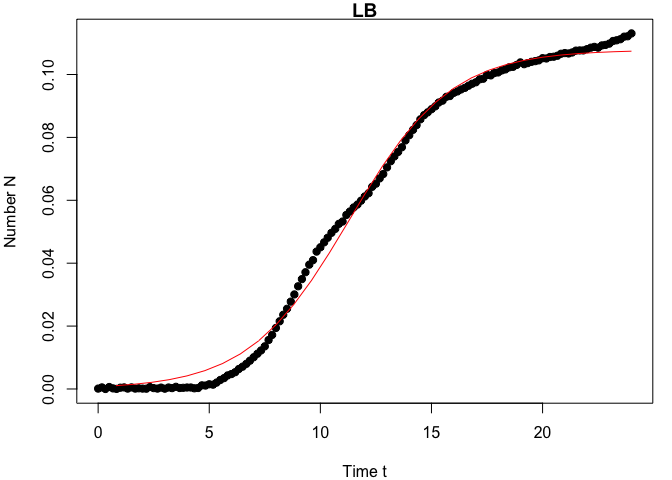
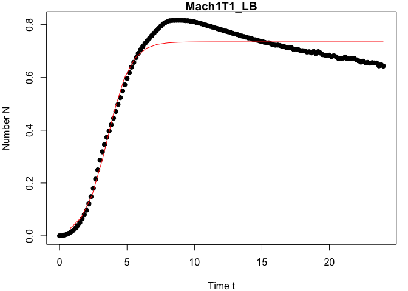
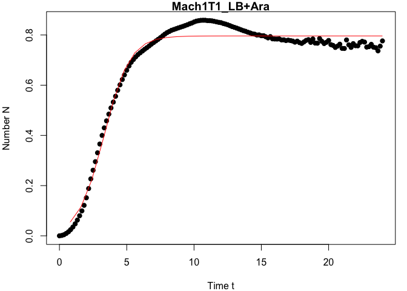
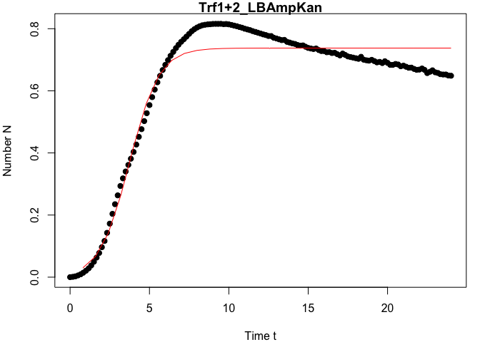
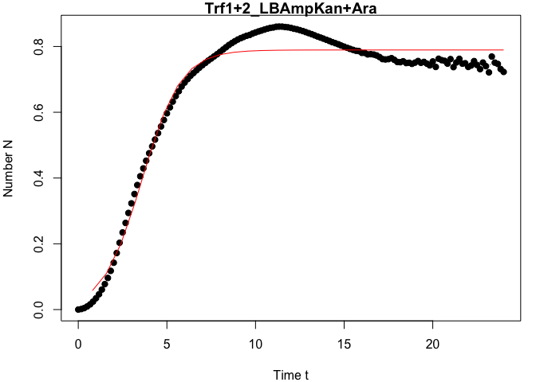
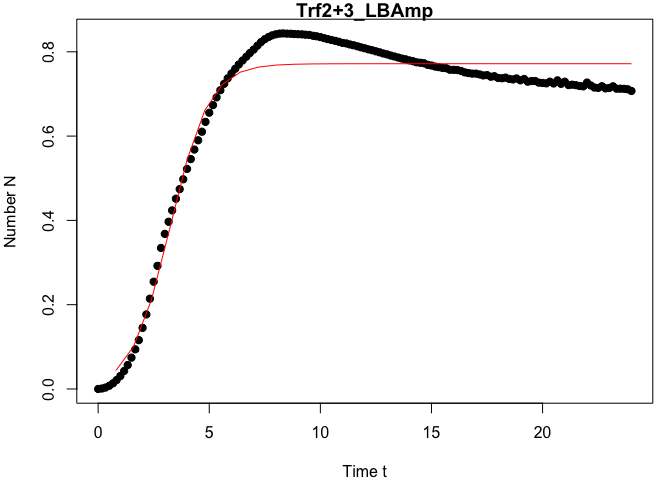
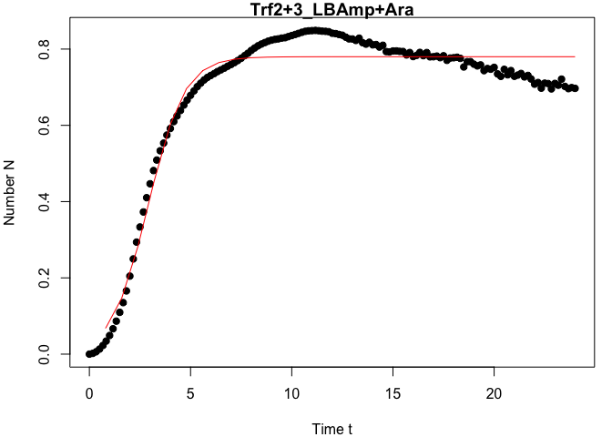
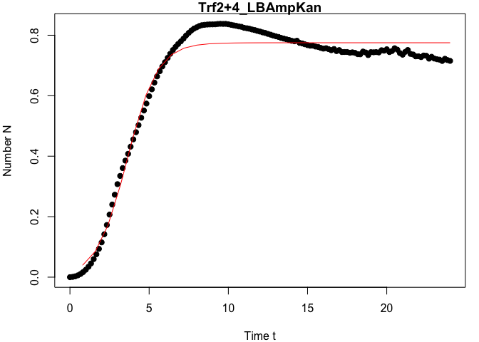
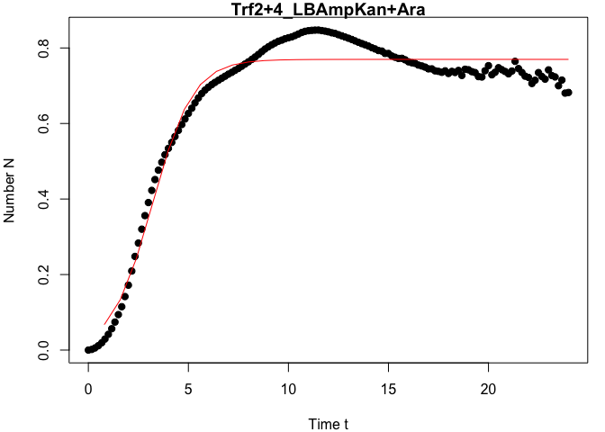

## Introduction

In this lab work we sought to characterize four samples of _Escherichia coli_ and determine which of three available plasmids were used to transform each aliquot of the _E. coli_ Mach1-T1 parent sample. The plasmids used were: 
   #261 containing a reversible construction by a recombinase
   #75 and #87, each allowing expression of an integrase

To determine the identity of the samples we plated on different substrates, digested and ran PCR, and incubated in a microplate reader taking growth measurements at 10 minute intervals using different wavelengths. Measurements at 600nm are also called absorbance detection in which a light source illuminates the sample and a light detector located on the other side of the well measures how much of the initial (100%) light is transmitted through the sample. The amount of transmitted light will typically be related to the concentration of the sample of interest.

In fluorescence intensity detection, the first optical system (excitation system) illuminates the sample using a specific wavelength (selected by an optical filter). As a result of the illumination, the sample emits light (it fluoresces) and a second optical system (emission system) collects the emitted light, separates it from the excitation light (using a filter or monochromator system), and measures the signal. The advantages of fluorescence detection over absorbance detection are sensitivity given the wide selection of fluorescent labels available today.

Note that the two higher wavelength readings across our replicates used slightly different excitation wavelengths (540/25 vs 530/25). They both used 590/20 for emission detection.

## Methods

Setup and file I/O
We read in two spreadsheets, one with two tabs wherein the second tab shows the plate map describing the samples loaded in each well of the two plates. We note that the loading was identical in the two plates. Two entire columms of LB per plate serve as an optical control (well names [.]11 and [.]12).

We then clean the data, removing the contribution of the media from the optical density by subtracting an observed OD value. While there are many ways to do this (using the LB controls, using the lowest value observed on the plate at that timepoint (assuming controls), subtracting the first reading of the sample from all  readings) for this project we subtracted the first reading of the sample from all readings of that sample.


```r
rm(list = ls());
setwd("/Users/hensonc/class/UE2.2");

library(tidyverse)
library(plotly)
library(readxl)
library(lubridate)
library(growthcurver)
library(statmod)


# plot formatting
mytheme = theme(axis.text.x = element_text(size = 12), axis.text.y = element_text(size = 12), 
               axis.title.x = element_text(size = 16), axis.title.y = element_text(size = 16),
               #legend.position = "none", 
               #aspect.ratio =1,
               panel.grid.minor=element_blank(), panel.grid.major=element_blank());

# I/O files
inputfile1 = "./2022-10-03_mSSB_Plate1-Com3.xlsx"
inputfile2 = "./2022-10-03_mSSB_Plate2-Com4.xlsx"

# note that both plates have the same layout so keep it simple and reuse the same map
platemap = read_excel(inputfile2, sheet="MAP", col_names = TRUE, skip=1, n_max=9)

# Ingest the relevant sections from our input data files.
d <- read_excel(inputfile1, sheet="Plate 2 - Sheet1", col_names = TRUE, skip=1, n_max=145)
e <- read_excel(inputfile2, sheet="Plate 2 - Sheet1", col_names = TRUE, skip=1, n_max=145)
f <- read_excel(inputfile1, sheet="Plate 2 - Sheet1", col_names = TRUE, skip=149, n_max=145)
g <- read_excel(inputfile2, sheet="Plate 2 - Sheet1", col_names = TRUE, skip=149, n_max=145)
h <- read_excel(inputfile1, sheet="Plate 2 - Sheet1", col_names = TRUE, skip=297, n_max=145)
i <- read_excel(inputfile2, sheet="Plate 2 - Sheet1", col_names = TRUE, skip=297, n_max=145)

plate_start <- as_datetime(d$Time[1])
plate_end <- as_datetime(h$Time[145])
time.interval <- plate_start %--% plate_end

# Future to-do: wrap these next three steps in a single loop
# Adjust the time as entered by the plate reader into hours and fractions of hours
d$Time <- as.duration(plate_start %--% d$Time) / dhours(1)
e$Time <- as.duration(plate_start %--% e$Time) / dhours(1)
f$Time <- as.duration(plate_start %--% f$Time) / dhours(1)
g$Time <- as.duration(plate_start %--% g$Time) / dhours(1)
h$Time <- as.duration(plate_start %--% h$Time) / dhours(1)
i$Time <- as.duration(plate_start %--% i$Time) / dhours(1)

# Then cut it off to reasonable precision
d$Time <- round(d$Time, digits = 2)
e$Time <- round(e$Time, digits = 2)
f$Time <- round(f$Time, digits = 2)
g$Time <- round(g$Time, digits = 2)
h$Time <- round(h$Time, digits = 2)
i$Time <- round(i$Time, digits = 2)

# Take second column (Temperature) out of temp frames, incompatible header cell (note for analysis)
d <- d[,-2]
e <- e[,-2]
f <- f[,-2]
g <- g[,-2]
h <- h[,-2]
i <- i[,-2]

# We need to remove the contribution of the media in the growth readings:
# There are many options including the choice to: 
#    1) calculate the average value for the LB 
#    in each plate row since we have two per row OR
#    2) subtract the LB lower value (no growth) from each value 
#    in the Treatment wells of that row OR
#    3) Vincent suggested simply deleting the first reading of each sample 
#    from all subsequent readings, so today we choose to do that

#subtract or add a vector from each row of a matrix object in the R programming language.
my_first_readings <- d[1,]
#Set time correction to zero to preserve timestamps
my_first_readings[1] <- 0
corrected_d <- (sweep(as.matrix(d),MARGIN=2,STATS=as.matrix(my_first_readings),FUN="-"))
corrected_d <- as.data.frame(corrected_d)

my_first_readings <- e[1,]
#Set time correction to zero to preserve timestamps
my_first_readings[1] <- 0
corrected_e <- (sweep(as.matrix(e),MARGIN=2,STATS=as.matrix(my_first_readings),FUN="-"))
corrected_e <- as.data.frame(corrected_e)

my_first_readings <- f[1,]
#Set time correction to zero to preserve timestamps
my_first_readings[1] <- 0
corrected_f <- (sweep(as.matrix(f),MARGIN=2,STATS=as.matrix(my_first_readings),FUN="-"))
corrected_f <- as.data.frame(corrected_f)

my_first_readings <- g[1,]
#Set time correction to zero to preserve timestamps
my_first_readings[1] <- 0
corrected_g <- (sweep(as.matrix(g),MARGIN=2,STATS=as.matrix(my_first_readings),FUN="-"))
corrected_g <- as.data.frame(corrected_g)

my_first_readings <- h[1,]
#Set time correction to zero to preserve timestamps
my_first_readings[1] <- 0
corrected_h <- (sweep(as.matrix(h),MARGIN=2,STATS=as.matrix(my_first_readings),FUN="-"))
corrected_h <- as.data.frame(corrected_h)

my_first_readings <- i[1,]
#Set time correction to zero to preserve timestamps
my_first_readings[1] <- 0
corrected_i <- (sweep(as.matrix(i),MARGIN=2,STATS=as.matrix(my_first_readings),FUN="-"))
corrected_i <- as.data.frame(corrected_i)

readings_od <- rbind(corrected_d,corrected_e)
readings_485_528_1 <- corrected_f
readings_485_528_2 <- corrected_g
readings_530_590 <- corrected_h
readings_540_590 <- corrected_i
```

After loading we now have five data frames, one for the OD600 wavelength replicates and two each for GFP and mKate detection. We expect that the GFP experiments run with two parameters on two separate plates/machines should demonstrate the same overall pattern, even if the absolute values of the readings differ. We do not necessarily expect that of the mKate readings because the replicates were not equivalent, having been excited at 530nm and 540nm.

### Step 1: organize (tidy) plate map as metadata
Downstream processing expects R "tidy" data. Here we reorganize the values in the data frame into R-compliant format and re-label the readings with the Treament name rather than the plate well name. This will allow us to recognize replicates.


```r
# Reorganize the platemap
platemap_tidy = platemap %>%
  pivot_longer(cols=2:13, names_to="wellcol", values_to="Treatment") %>%
  unite("Well", Colonne1, wellcol, sep="")

od_tidy = readings_od %>%
  pivot_longer(cols=A1:H12, names_to="Well", values_to="OD600") %>%
  select(Well,Time,OD600)

nm485_528_tidy_1 = readings_485_528_1 %>%
  pivot_longer(cols=A1:H12, names_to="Well", values_to="nm485_528_1") %>%
  select(nm485_528_1)

nm485_528_tidy_2 = readings_485_528_2 %>%
  pivot_longer(cols=A1:H12, names_to="Well", values_to="nm485_528_2") %>%
  select(nm485_528_2)

nm530_590_tidy = readings_530_590 %>%
  pivot_longer(cols=A1:H12, names_to="Well", values_to="nm530_590") %>%
  select(nm530_590)

nm540_590_tidy = readings_540_590 %>%
  pivot_longer(cols=A1:H12, names_to="Well", values_to="nm540_590") %>%
  select(nm540_590)

# Merge all readings into one data frame
all <-cbind(od_tidy,nm485_528_tidy_1,nm485_528_tidy_2,nm530_590_tidy,nm540_590_tidy)
# Re-label those readings with the treatment labels from the platemap
all_j = left_join(platemap_tidy, all, by="Well")
#harmonize treatments, removing team name prefix, allowing comparison of replicates
all_j$Treatment <- sub("^N°.*?_", "", all_j$Treatment)

#set summarize to not display the 'group_by' warning
options(dplyr.summarize.inform = FALSE)

#summarize results
od_all_msd = all_j %>%
  group_by(Treatment, Time) %>%
  summarize(OD600_mean = mean(OD600), OD600_sd = sd(OD600)) 

nm485_528_1_msd = all_j %>%
  group_by(Treatment, Time) %>%
  summarize(nm485_528_1_mean = mean(nm485_528_1), nm485_528_1_sd = sd(nm485_528_1)) 

nm485_528_2_msd = all_j %>%
  group_by(Treatment, Time) %>%
  summarize(nm485_528_2_mean = mean(nm485_528_2), nm485_528_2_sd = sd(nm485_528_2))

nm530_590_all_msd = all_j %>%
  group_by(Treatment, Time) %>%
  summarize(nm530_590_mean = mean(nm530_590), nm530_590_sd = sd(nm530_590))
#rename to keep these separate from the other excitation
nm530_590_all_msd$Treatment <- sub("", "nm530_", nm530_590_all_msd$Treatment)

nm540_590_all_msd = all_j %>%
  group_by(Treatment, Time) %>%
  summarize(nm540_590_mean = mean(nm540_590), nm540_590_sd = sd(nm540_590))
#rename to keep these separate from the other excitation
nm540_590_all_msd$Treatment <- sub("", "nm540_", nm540_590_all_msd$Treatment)
```

### Step 2: plot plate readings

Currently the data is normalized but not filtered, we have seent there is error in the data, at least to the extent that the LB was contaminated and grew. Further the two excitations of mKate are not at the same wavelength, introducing detection artifacts.


```r
#OD600 readings
myplot_od_all_msd = ggplot(od_all_msd, aes(x=Time, y=OD600_mean, group=Treatment, color=Treatment, text=Treatment)) +
ggtitle("Growth observed at OD600")+
geom_line(size=0.2, color='black') +
geom_point(size=1) +
#geom_errorbar( aes(ymin = OD600_mean-OD600_sd, ymax = OD600_mean+OD600_sd),width = 0.02)
theme_bw() +
xlab("Hours") + 
ylab("OD(600) Detection") +
mytheme;

myplotly_od_all_msd = ggplotly(myplot_od_all_msd, tooltip="text");
myplotly_od_all_msd
```

```{=html}
<div id="htmlwidget-f5fbcf88ed8dcf855bf8" style="width:672px;height:480px;" class="plotly html-widget"></div>
<script type="application/json" data-for="htmlwidget-f5fbcf88ed8dcf855bf8">{"x":{"data":[{"x":[0,0.17,0.33,0.5,0.67,0.83,1,1.17,1.33,1.5,1.67,1.83,2,2.17,2.33,2.5,2.67,2.83,3,3.17,3.33,3.5,3.67,3.83,4,4.17,4.33,4.5,4.67,4.83,5,5.17,5.33,5.5,5.67,5.83,6,6.17,6.33,6.5,6.67,6.83,7,7.17,7.33,7.5,7.67,7.83,8,8.17,8.33,8.5,8.67,8.83,9,9.17,9.33,9.5,9.67,9.83,10,10.17,10.33,10.5,10.67,10.83,11,11.17,11.33,11.5,11.67,11.83,12,12.17,12.33,12.5,12.67,12.83,13,13.17,13.33,13.5,13.67,13.83,14,14.17,14.33,14.5,14.67,14.83,15,15.17,15.33,15.5,15.67,15.83,16,16.17,16.33,16.5,16.67,16.83,17,17.17,17.33,17.5,17.67,17.83,18,18.17,18.33,18.5,18.67,18.83,19,19.17,19.33,19.5,19.67,19.83,20,20.17,20.33,20.5,20.67,20.83,21,21.17,21.33,21.5,21.67,21.83,22,22.17,22.33,22.5,22.67,22.83,23,23.17,23.33,23.5,23.67,23.83,24,null,0,0.17,0.33,0.5,0.67,0.83,1,1.17,1.33,1.5,1.67,1.83,2,2.17,2.33,2.5,2.67,2.83,3,3.17,3.33,3.5,3.67,3.83,4,4.17,4.33,4.5,4.67,4.83,5,5.17,5.33,5.5,5.67,5.83,6,6.17,6.33,6.5,6.67,6.83,7,7.17,7.33,7.5,7.67,7.83,8,8.17,8.33,8.5,8.67,8.83,9,9.17,9.33,9.5,9.67,9.83,10,10.17,10.33,10.5,10.67,10.83,11,11.17,11.33,11.5,11.67,11.83,12,12.17,12.33,12.5,12.67,12.83,13,13.17,13.33,13.5,13.67,13.83,14,14.17,14.33,14.5,14.67,14.83,15,15.17,15.33,15.5,15.67,15.83,16,16.17,16.33,16.5,16.67,16.83,17,17.17,17.33,17.5,17.67,17.83,18,18.17,18.33,18.5,18.67,18.83,19,19.17,19.33,19.5,19.67,19.83,20,20.17,20.33,20.5,20.67,20.83,21,21.17,21.33,21.5,21.67,21.83,22,22.17,22.33,22.5,22.67,22.83,23,23.17,23.33,23.5,23.67,23.83,24,null,0,0.17,0.33,0.5,0.67,0.83,1,1.17,1.33,1.5,1.67,1.83,2,2.17,2.33,2.5,2.67,2.83,3,3.17,3.33,3.5,3.67,3.83,4,4.17,4.33,4.5,4.67,4.83,5,5.17,5.33,5.5,5.67,5.83,6,6.17,6.33,6.5,6.67,6.83,7,7.17,7.33,7.5,7.67,7.83,8,8.17,8.33,8.5,8.67,8.83,9,9.17,9.33,9.5,9.67,9.83,10,10.17,10.33,10.5,10.67,10.83,11,11.17,11.33,11.5,11.67,11.83,12,12.17,12.33,12.5,12.67,12.83,13,13.17,13.33,13.5,13.67,13.83,14,14.17,14.33,14.5,14.67,14.83,15,15.17,15.33,15.5,15.67,15.83,16,16.17,16.33,16.5,16.67,16.83,17,17.17,17.33,17.5,17.67,17.83,18,18.17,18.33,18.5,18.67,18.83,19,19.17,19.33,19.5,19.67,19.83,20,20.17,20.33,20.5,20.67,20.83,21,21.17,21.33,21.5,21.67,21.83,22,22.17,22.33,22.5,22.67,22.83,23,23.17,23.33,23.5,23.67,23.83,24,null,0,0.17,0.33,0.5,0.67,0.83,1,1.17,1.33,1.5,1.67,1.83,2,2.17,2.33,2.5,2.67,2.83,3,3.17,3.33,3.5,3.67,3.83,4,4.17,4.33,4.5,4.67,4.83,5,5.17,5.33,5.5,5.67,5.83,6,6.17,6.33,6.5,6.67,6.83,7,7.17,7.33,7.5,7.67,7.83,8,8.17,8.33,8.5,8.67,8.83,9,9.17,9.33,9.5,9.67,9.83,10,10.17,10.33,10.5,10.67,10.83,11,11.17,11.33,11.5,11.67,11.83,12,12.17,12.33,12.5,12.67,12.83,13,13.17,13.33,13.5,13.67,13.83,14,14.17,14.33,14.5,14.67,14.83,15,15.17,15.33,15.5,15.67,15.83,16,16.17,16.33,16.5,16.67,16.83,17,17.17,17.33,17.5,17.67,17.83,18,18.17,18.33,18.5,18.67,18.83,19,19.17,19.33,19.5,19.67,19.83,20,20.17,20.33,20.5,20.67,20.83,21,21.17,21.33,21.5,21.67,21.83,22,22.17,22.33,22.5,22.67,22.83,23,23.17,23.33,23.5,23.67,23.83,24,null,0,0.17,0.33,0.5,0.67,0.83,1,1.17,1.33,1.5,1.67,1.83,2,2.17,2.33,2.5,2.67,2.83,3,3.17,3.33,3.5,3.67,3.83,4,4.17,4.33,4.5,4.67,4.83,5,5.17,5.33,5.5,5.67,5.83,6,6.17,6.33,6.5,6.67,6.83,7,7.17,7.33,7.5,7.67,7.83,8,8.17,8.33,8.5,8.67,8.83,9,9.17,9.33,9.5,9.67,9.83,10,10.17,10.33,10.5,10.67,10.83,11,11.17,11.33,11.5,11.67,11.83,12,12.17,12.33,12.5,12.67,12.83,13,13.17,13.33,13.5,13.67,13.83,14,14.17,14.33,14.5,14.67,14.83,15,15.17,15.33,15.5,15.67,15.83,16,16.17,16.33,16.5,16.67,16.83,17,17.17,17.33,17.5,17.67,17.83,18,18.17,18.33,18.5,18.67,18.83,19,19.17,19.33,19.5,19.67,19.83,20,20.17,20.33,20.5,20.67,20.83,21,21.17,21.33,21.5,21.67,21.83,22,22.17,22.33,22.5,22.67,22.83,23,23.17,23.33,23.5,23.67,23.83,24,null,0,0.17,0.33,0.5,0.67,0.83,1,1.17,1.33,1.5,1.67,1.83,2,2.17,2.33,2.5,2.67,2.83,3,3.17,3.33,3.5,3.67,3.83,4,4.17,4.33,4.5,4.67,4.83,5,5.17,5.33,5.5,5.67,5.83,6,6.17,6.33,6.5,6.67,6.83,7,7.17,7.33,7.5,7.67,7.83,8,8.17,8.33,8.5,8.67,8.83,9,9.17,9.33,9.5,9.67,9.83,10,10.17,10.33,10.5,10.67,10.83,11,11.17,11.33,11.5,11.67,11.83,12,12.17,12.33,12.5,12.67,12.83,13,13.17,13.33,13.5,13.67,13.83,14,14.17,14.33,14.5,14.67,14.83,15,15.17,15.33,15.5,15.67,15.83,16,16.17,16.33,16.5,16.67,16.83,17,17.17,17.33,17.5,17.67,17.83,18,18.17,18.33,18.5,18.67,18.83,19,19.17,19.33,19.5,19.67,19.83,20,20.17,20.33,20.5,20.67,20.83,21,21.17,21.33,21.5,21.67,21.83,22,22.17,22.33,22.5,22.67,22.83,23,23.17,23.33,23.5,23.67,23.83,24,null,0,0.17,0.33,0.5,0.67,0.83,1,1.17,1.33,1.5,1.67,1.83,2,2.17,2.33,2.5,2.67,2.83,3,3.17,3.33,3.5,3.67,3.83,4,4.17,4.33,4.5,4.67,4.83,5,5.17,5.33,5.5,5.67,5.83,6,6.17,6.33,6.5,6.67,6.83,7,7.17,7.33,7.5,7.67,7.83,8,8.17,8.33,8.5,8.67,8.83,9,9.17,9.33,9.5,9.67,9.83,10,10.17,10.33,10.5,10.67,10.83,11,11.17,11.33,11.5,11.67,11.83,12,12.17,12.33,12.5,12.67,12.83,13,13.17,13.33,13.5,13.67,13.83,14,14.17,14.33,14.5,14.67,14.83,15,15.17,15.33,15.5,15.67,15.83,16,16.17,16.33,16.5,16.67,16.83,17,17.17,17.33,17.5,17.67,17.83,18,18.17,18.33,18.5,18.67,18.83,19,19.17,19.33,19.5,19.67,19.83,20,20.17,20.33,20.5,20.67,20.83,21,21.17,21.33,21.5,21.67,21.83,22,22.17,22.33,22.5,22.67,22.83,23,23.17,23.33,23.5,23.67,23.83,24,null,0,0.17,0.33,0.5,0.67,0.83,1,1.17,1.33,1.5,1.67,1.83,2,2.17,2.33,2.5,2.67,2.83,3,3.17,3.33,3.5,3.67,3.83,4,4.17,4.33,4.5,4.67,4.83,5,5.17,5.33,5.5,5.67,5.83,6,6.17,6.33,6.5,6.67,6.83,7,7.17,7.33,7.5,7.67,7.83,8,8.17,8.33,8.5,8.67,8.83,9,9.17,9.33,9.5,9.67,9.83,10,10.17,10.33,10.5,10.67,10.83,11,11.17,11.33,11.5,11.67,11.83,12,12.17,12.33,12.5,12.67,12.83,13,13.17,13.33,13.5,13.67,13.83,14,14.17,14.33,14.5,14.67,14.83,15,15.17,15.33,15.5,15.67,15.83,16,16.17,16.33,16.5,16.67,16.83,17,17.17,17.33,17.5,17.67,17.83,18,18.17,18.33,18.5,18.67,18.83,19,19.17,19.33,19.5,19.67,19.83,20,20.17,20.33,20.5,20.67,20.83,21,21.17,21.33,21.5,21.67,21.83,22,22.17,22.33,22.5,22.67,22.83,23,23.17,23.33,23.5,23.67,23.83,24,null,0,0.17,0.33,0.5,0.67,0.83,1,1.17,1.33,1.5,1.67,1.83,2,2.17,2.33,2.5,2.67,2.83,3,3.17,3.33,3.5,3.67,3.83,4,4.17,4.33,4.5,4.67,4.83,5,5.17,5.33,5.5,5.67,5.83,6,6.17,6.33,6.5,6.67,6.83,7,7.17,7.33,7.5,7.67,7.83,8,8.17,8.33,8.5,8.67,8.83,9,9.17,9.33,9.5,9.67,9.83,10,10.17,10.33,10.5,10.67,10.83,11,11.17,11.33,11.5,11.67,11.83,12,12.17,12.33,12.5,12.67,12.83,13,13.17,13.33,13.5,13.67,13.83,14,14.17,14.33,14.5,14.67,14.83,15,15.17,15.33,15.5,15.67,15.83,16,16.17,16.33,16.5,16.67,16.83,17,17.17,17.33,17.5,17.67,17.83,18,18.17,18.33,18.5,18.67,18.83,19,19.17,19.33,19.5,19.67,19.83,20,20.17,20.33,20.5,20.67,20.83,21,21.17,21.33,21.5,21.67,21.83,22,22.17,22.33,22.5,22.67,22.83,23,23.17,23.33,23.5,23.67,23.83,24],"y":[0,0.000375,-0.000125,0.0005,6.25000000000001e-05,-9.37500000000001e-05,0.00028125,0.000375,0,0.000375,0,9.37500000000001e-05,0,-3.125e-05,0.0005,0.00015625,0,0.0003125,-3.125e-05,0.00034375,0.00015625,0.0005625,0.0001875,0.00025,0.00034375,0.00034375,9.37500000000001e-05,0.000187499999999999,0.00103125,0.00096875,0.001375,0.00125,0.00190625,0.00275,0.00334375,0.0041875,0.004625,0.00521875,0.00621875,0.00696875,0.00787500000000001,0.008875,0.00996875,0.01109375,0.012125,0.0134375,0.0154375,0.0170625,0.01928125,0.02140625,0.02346875,0.025375,0.02765625,0.0299375,0.03253125,0.0348125,0.037,0.03940625,0.04084375,0.0435625,0.0449375,0.0465,0.04796875,0.04953125,0.05078125,0.052375,0.053125,0.05521875,0.0563125,0.05759375,0.05853125,0.05975,0.06109375,0.062125,0.06415625,0.06515625,0.06684375,0.06821875,0.07034375,0.0723125,0.0738125,0.07525,0.07675,0.07890625,0.0805625,0.08228125,0.08378125,0.085625,0.08696875,0.08784375,0.08884375,0.08975,0.09096875,0.0915625,0.09278125,0.09303125,0.09403125,0.0945,0.095125,0.095625,0.0963125,0.0969375,0.09740625,0.09834375,0.09853125,0.09975,0.09959375,0.10034375,0.10053125,0.1011875,0.1015,0.10215625,0.1023125,0.10290625,0.10371875,0.10315625,0.1035,0.10390625,0.104125,0.104375,0.1050625,0.10496875,0.1054375,0.10553125,0.10584375,0.10646875,0.1066875,0.1065625,0.106875,0.10746875,0.10753125,0.10753125,0.1079375,0.10840625,0.10865625,0.10840625,0.109125,0.10928125,0.1096875,0.11053125,0.11075,0.11109375,0.11190625,0.11203125,0.1129375,null,0,0.000750000000000001,0.0025,0.00515,0.00905,0.014,0.0205,0.02835,0.03795,0.04975,0.0638,0.0801,0.0974,0.1213,0.14855,0.18035,0.21495,0.2499,0.28625,0.3181,0.3463,0.373,0.39715,0.4207,0.44535,0.47095,0.49745,0.5233,0.54875,0.5722,0.5961,0.61825,0.639,0.6573,0.6749,0.69105,0.7051,0.71735,0.7287,0.7386,0.74895,0.75855,0.76805,0.77675,0.78555,0.7944,0.8023,0.80755,0.8119,0.8145,0.8158,0.81615,0.8165,0.8166,0.8166,0.81605,0.8149,0.81475,0.8131,0.8124,0.81045,0.808,0.8058,0.80345,0.80065,0.7985,0.79515,0.7933,0.7906,0.7885,0.7852,0.7827,0.78035,0.77725,0.77555,0.7728,0.7701,0.76735,0.76485,0.7624,0.75975,0.75705,0.75475,0.7527,0.7496,0.74825,0.7447,0.7426,0.7406,0.73795,0.7357,0.73335,0.73115,0.73095,0.72695,0.7244,0.7223,0.7227,0.7212,0.71675,0.7163,0.71325,0.7121,0.71395,0.7069,0.70685,0.70625,0.7019,0.70135,0.7005,0.6965,0.69735,0.6931,0.69865,0.6907,0.698,0.6926,0.6863,0.6837,0.68355,0.68445,0.6788,0.6826,0.6778,0.67145,0.67245,0.6724,0.67755,0.6712,0.6709,0.67255,0.6719,0.66695,0.66275,0.6583,0.66145,0.65585,0.65695,0.6543,0.656,0.6549,0.65455,0.6439,0.6487,0.6432,null,0,0.00145,0.0042,0.0093,0.01595,0.0244,0.03505,0.04765,0.06265,0.08005,0.0994,0.1215,0.15145,0.18835,0.2267,0.2613,0.2954,0.33075,0.36565,0.4,0.43015,0.45795,0.48475,0.5094,0.53265,0.55595,0.5799,0.60145,0.6225,0.6411,0.6596,0.6767,0.6912,0.7024,0.7129,0.72165,0.72905,0.7361,0.74295,0.74945,0.7565,0.7634,0.7699,0.77645,0.78265,0.7893,0.79655,0.80325,0.8096,0.8142,0.81875,0.822,0.825,0.8281,0.8313,0.83415,0.8372,0.8406,0.84445,0.8475,0.85175,0.8552,0.8568,0.8583,0.85865,0.85865,0.85725,0.85705,0.85625,0.8544,0.85235,0.8505,0.8491,0.8459,0.84365,0.8407,0.83705,0.8336,0.83045,0.82735,0.8241,0.82055,0.81725,0.8147,0.8111,0.8081,0.8048,0.8033,0.8,0.80045,0.7972,0.7971,0.79295,0.78835,0.79345,0.7847,0.784,0.7838,0.7844,0.78035,0.78065,0.7779,0.77945,0.7777,0.7758,0.7715,0.77545,0.7697,0.7665,0.7724,0.7785,0.7814,0.77055,0.7841,0.76775,0.7672,0.78575,0.77475,0.7659,0.7707,0.7782,0.76155,0.75855,0.7504,0.75585,0.7634,0.74675,0.74625,0.78025,0.76055,0.7506,0.7656,0.75715,0.75685,0.77,0.77465,0.7717,0.7517,0.7536,0.76275,0.75155,0.7494,0.7368,0.7554,0.7764,null,0,0.00105,0.00255,0.0056,0.0093,0.0143,0.02075,0.0284,0.03755,0.0495,0.06305,0.0778,0.09645,0.1165,0.1428,0.17225,0.20385,0.2349,0.2634,0.2936,0.31805,0.34025,0.3614,0.3814,0.4032,0.427,0.4519,0.4765,0.50245,0.5279,0.5541,0.5796,0.60395,0.62745,0.64825,0.6669,0.68355,0.6988,0.7128,0.72545,0.7377,0.74835,0.7579,0.76625,0.77455,0.7834,0.792,0.7984,0.80385,0.8081,0.811,0.8127,0.8139,0.81445,0.8154,0.8156,0.81555,0.81575,0.81465,0.8152,0.814,0.8121,0.81,0.808,0.80535,0.80315,0.8,0.79765,0.7955,0.7923,0.78965,0.78715,0.7845,0.78165,0.77955,0.77655,0.77635,0.77095,0.76855,0.76575,0.7632,0.764,0.75765,0.7554,0.7527,0.75085,0.74755,0.74545,0.7462,0.74205,0.7381,0.73625,0.73455,0.73635,0.73125,0.72805,0.72795,0.72415,0.72465,0.7217,0.7225,0.71805,0.71395,0.72,0.7157,0.71075,0.70865,0.70695,0.705,0.703,0.7095,0.7002,0.6983,0.6971,0.69975,0.6957,0.69155,0.69315,0.68935,0.69525,0.6901,0.6836,0.6835,0.68645,0.6847,0.67905,0.68105,0.6775,0.6743,0.67465,0.6705,0.6677,0.66835,0.67185,0.66745,0.65715,0.66135,0.666,0.6596,0.6575,0.6536,0.6525,0.65255,0.64925,0.64855,null,0,0.00165,0.0044,0.00935,0.0158,0.02405,0.03445,0.04665,0.06075,0.07745,0.0961,0.11765,0.1425,0.17195,0.20315,0.2345,0.26345,0.29385,0.32295,0.3513,0.3787,0.4054,0.42925,0.4526,0.47545,0.4963,0.51685,0.5366,0.55695,0.57655,0.5968,0.61485,0.6324,0.64925,0.664,0.6782,0.69025,0.7008,0.7108,0.7192,0.7277,0.7353,0.74305,0.75015,0.757,0.7633,0.7701,0.7764,0.78355,0.79065,0.79755,0.8046,0.81055,0.81595,0.8212,0.8255,0.82895,0.8326,0.83515,0.83915,0.8427,0.84585,0.8484,0.85135,0.8542,0.8565,0.85785,0.8601,0.8605,0.8604,0.8592,0.85825,0.8565,0.854,0.8524,0.8497,0.8469,0.8438,0.84065,0.8374,0.83395,0.8304,0.827,0.8239,0.8204,0.8168,0.8132,0.81005,0.8068,0.8031,0.79945,0.7961,0.7928,0.78975,0.78705,0.786,0.78065,0.7804,0.7759,0.77665,0.7755,0.77285,0.76785,0.76165,0.76065,0.76155,0.7645,0.7595,0.75295,0.75225,0.7551,0.74965,0.75055,0.74725,0.751,0.75585,0.75035,0.7531,0.7478,0.7426,0.75455,0.7379,0.76275,0.75845,0.7564,0.74785,0.76165,0.7373,0.75145,0.7625,0.74785,0.749,0.73785,0.74215,0.75555,0.74375,0.73115,0.7511,0.74015,0.7213,0.7695,0.7509,0.7469,0.73135,0.7227,null,0,0.00115,0.00335,0.00755,0.0135,0.0211,0.0307,0.0427,0.0567,0.07435,0.09405,0.11585,0.145,0.1769,0.21425,0.2545,0.29215,0.33465,0.368,0.39675,0.4237,0.4514,0.4742,0.49755,0.52215,0.5454,0.5681,0.59005,0.6104,0.63375,0.6555,0.6735,0.6919,0.70885,0.72405,0.737,0.74865,0.75975,0.76985,0.77935,0.7884,0.7971,0.8053,0.8146,0.82305,0.83,0.83505,0.839,0.84155,0.84325,0.8436,0.8431,0.8428,0.8421,0.84165,0.8414,0.8406,0.8401,0.838,0.8368,0.83495,0.8324,0.8302,0.82805,0.826,0.82385,0.821,0.81985,0.8174,0.81545,0.813,0.81055,0.8083,0.80565,0.8037,0.80115,0.79875,0.796,0.7939,0.7911,0.7889,0.7864,0.78395,0.7822,0.77965,0.77765,0.7751,0.774,0.7727,0.76905,0.76745,0.76495,0.76355,0.76165,0.76095,0.7574,0.7572,0.75675,0.75465,0.75115,0.74955,0.74825,0.74825,0.7463,0.7439,0.74475,0.7409,0.74205,0.73795,0.73725,0.73875,0.7357,0.73445,0.7368,0.7323,0.73555,0.72915,0.73055,0.73065,0.72685,0.726,0.72515,0.7291,0.72485,0.73225,0.72395,0.7291,0.7211,0.722,0.7208,0.71885,0.718,0.727,0.7201,0.71525,0.7143,0.7183,0.71325,0.7142,0.71815,0.7125,0.71245,0.7122,0.71115,0.70705,null,0,0.00205,0.0061,0.0132,0.02275,0.0342,0.0489,0.0665,0.0865,0.1096,0.1351,0.1658,0.20465,0.24965,0.29375,0.33345,0.3728,0.4103,0.44675,0.48145,0.509,0.53335,0.5534,0.57445,0.5917,0.6098,0.62465,0.63885,0.65315,0.6662,0.6787,0.6904,0.7014,0.71065,0.7191,0.72555,0.7308,0.7358,0.741,0.74555,0.7501,0.75495,0.75955,0.76455,0.76985,0.7759,0.7827,0.789,0.7964,0.80285,0.8085,0.81315,0.8171,0.8206,0.82335,0.82545,0.8267,0.82875,0.82985,0.8326,0.83545,0.83835,0.8411,0.844,0.84655,0.8478,0.84835,0.8489,0.84815,0.847,0.8465,0.84555,0.84155,0.84055,0.83835,0.83635,0.8311,0.8268,0.82645,0.82265,0.82855,0.8168,0.813,0.8179,0.8111,0.81185,0.8053,0.80995,0.7935,0.7925,0.795,0.79515,0.794,0.79365,0.7847,0.79095,0.7804,0.7836,0.79125,0.78275,0.79085,0.77965,0.7799,0.7816,0.7775,0.78245,0.77045,0.77645,0.77725,0.77855,0.7756,0.7531,0.767,0.76705,0.76045,0.7559,0.75845,0.7434,0.749,0.7472,0.75205,0.735,0.72845,0.74695,0.73255,0.7436,0.7286,0.7318,0.736,0.72705,0.73085,0.7215,0.70795,0.7123,0.6975,0.7106,0.7095,0.69555,0.70995,0.7052,0.7211,0.7021,0.69625,0.69895,0.697,null,0,0.000950000000000001,0.0027,0.00595,0.0106,0.0167,0.0246,0.03435,0.0453,0.05975,0.0758,0.09365,0.11505,0.1419,0.1725,0.2069,0.2401,0.2726,0.30755,0.3348,0.36065,0.38535,0.40785,0.4316,0.4557,0.4794,0.5028,0.52715,0.5511,0.57405,0.5985,0.62115,0.6434,0.664,0.681,0.6966,0.71085,0.72515,0.7386,0.7512,0.7618,0.77115,0.7798,0.789,0.79895,0.80775,0.81585,0.82195,0.8262,0.8306,0.8332,0.8345,0.83535,0.8358,0.8359,0.83615,0.8373,0.8378,0.8375,0.83765,0.8363,0.8345,0.8328,0.8311,0.82905,0.82785,0.82455,0.82315,0.82155,0.81895,0.81705,0.8144,0.81215,0.8094,0.80755,0.8045,0.80185,0.7991,0.79655,0.79425,0.79115,0.78895,0.7865,0.78435,0.7816,0.77995,0.7818,0.77485,0.7729,0.7701,0.7673,0.7654,0.76565,0.76265,0.7613,0.75815,0.75575,0.7571,0.75405,0.7505,0.7545,0.74755,0.75095,0.74435,0.74455,0.74455,0.7421,0.7434,0.74165,0.7374,0.737,0.74605,0.743,0.7344,0.74405,0.74355,0.74425,0.7431,0.75045,0.74895,0.75365,0.74435,0.7478,0.757,0.7522,0.741,0.73565,0.74505,0.7512,0.73835,0.73625,0.73015,0.7304,0.72775,0.73295,0.7321,0.7226,0.72875,0.723,0.7206,0.71925,0.71495,0.7222,0.7179,0.71525,null,0,0.00175,0.0056,0.0116,0.0194,0.02915,0.04175,0.0566,0.0742,0.09395,0.11485,0.1417,0.17185,0.2093,0.2479,0.28335,0.3201,0.3561,0.39065,0.42285,0.45155,0.47645,0.4974,0.5173,0.53405,0.54995,0.56555,0.58165,0.59715,0.6119,0.6266,0.64035,0.6545,0.6676,0.67925,0.6884,0.69605,0.70295,0.7088,0.7144,0.7199,0.7251,0.7306,0.73545,0.74065,0.7458,0.75165,0.7574,0.7633,0.7697,0.77595,0.7829,0.79025,0.7972,0.8031,0.8086,0.8132,0.81775,0.8208,0.8243,0.827,0.82945,0.83285,0.83695,0.8411,0.844,0.84565,0.84665,0.8472,0.84735,0.846,0.84465,0.8427,0.8402,0.83855,0.83515,0.8321,0.82905,0.8258,0.8224,0.8188,0.8151,0.81155,0.80855,0.8051,0.8007,0.79745,0.79325,0.79175,0.78555,0.7854,0.7787,0.7754,0.7723,0.77255,0.76875,0.76335,0.76085,0.75925,0.7547,0.7523,0.7493,0.7447,0.74465,0.73945,0.738,0.73555,0.7394,0.7325,0.73795,0.73505,0.74045,0.72715,0.7436,0.74225,0.7372,0.7349,0.7242,0.72315,0.73965,0.7531,0.72895,0.73555,0.74765,0.7424,0.73775,0.73155,0.73885,0.76455,0.7454,0.7352,0.72535,0.72205,0.7059,0.71455,0.7348,0.72445,0.71745,0.74195,0.72685,0.7233,0.7,0.715,0.68045,0.6821],"text":["LB","LB","LB","LB","LB","LB","LB","LB","LB","LB","LB","LB","LB","LB","LB","LB","LB","LB","LB","LB","LB","LB","LB","LB","LB","LB","LB","LB","LB","LB","LB","LB","LB","LB","LB","LB","LB","LB","LB","LB","LB","LB","LB","LB","LB","LB","LB","LB","LB","LB","LB","LB","LB","LB","LB","LB","LB","LB","LB","LB","LB","LB","LB","LB","LB","LB","LB","LB","LB","LB","LB","LB","LB","LB","LB","LB","LB","LB","LB","LB","LB","LB","LB","LB","LB","LB","LB","LB","LB","LB","LB","LB","LB","LB","LB","LB","LB","LB","LB","LB","LB","LB","LB","LB","LB","LB","LB","LB","LB","LB","LB","LB","LB","LB","LB","LB","LB","LB","LB","LB","LB","LB","LB","LB","LB","LB","LB","LB","LB","LB","LB","LB","LB","LB","LB","LB","LB","LB","LB","LB","LB","LB","LB","LB","LB",null,"Mach1T1_LB","Mach1T1_LB","Mach1T1_LB","Mach1T1_LB","Mach1T1_LB","Mach1T1_LB","Mach1T1_LB","Mach1T1_LB","Mach1T1_LB","Mach1T1_LB","Mach1T1_LB","Mach1T1_LB","Mach1T1_LB","Mach1T1_LB","Mach1T1_LB","Mach1T1_LB","Mach1T1_LB","Mach1T1_LB","Mach1T1_LB","Mach1T1_LB","Mach1T1_LB","Mach1T1_LB","Mach1T1_LB","Mach1T1_LB","Mach1T1_LB","Mach1T1_LB","Mach1T1_LB","Mach1T1_LB","Mach1T1_LB","Mach1T1_LB","Mach1T1_LB","Mach1T1_LB","Mach1T1_LB","Mach1T1_LB","Mach1T1_LB","Mach1T1_LB","Mach1T1_LB","Mach1T1_LB","Mach1T1_LB","Mach1T1_LB","Mach1T1_LB","Mach1T1_LB","Mach1T1_LB","Mach1T1_LB","Mach1T1_LB","Mach1T1_LB","Mach1T1_LB","Mach1T1_LB","Mach1T1_LB","Mach1T1_LB","Mach1T1_LB","Mach1T1_LB","Mach1T1_LB","Mach1T1_LB","Mach1T1_LB","Mach1T1_LB","Mach1T1_LB","Mach1T1_LB","Mach1T1_LB","Mach1T1_LB","Mach1T1_LB","Mach1T1_LB","Mach1T1_LB","Mach1T1_LB","Mach1T1_LB","Mach1T1_LB","Mach1T1_LB","Mach1T1_LB","Mach1T1_LB","Mach1T1_LB","Mach1T1_LB","Mach1T1_LB","Mach1T1_LB","Mach1T1_LB","Mach1T1_LB","Mach1T1_LB","Mach1T1_LB","Mach1T1_LB","Mach1T1_LB","Mach1T1_LB","Mach1T1_LB","Mach1T1_LB","Mach1T1_LB","Mach1T1_LB","Mach1T1_LB","Mach1T1_LB","Mach1T1_LB","Mach1T1_LB","Mach1T1_LB","Mach1T1_LB","Mach1T1_LB","Mach1T1_LB","Mach1T1_LB","Mach1T1_LB","Mach1T1_LB","Mach1T1_LB","Mach1T1_LB","Mach1T1_LB","Mach1T1_LB","Mach1T1_LB","Mach1T1_LB","Mach1T1_LB","Mach1T1_LB","Mach1T1_LB","Mach1T1_LB","Mach1T1_LB","Mach1T1_LB","Mach1T1_LB","Mach1T1_LB","Mach1T1_LB","Mach1T1_LB","Mach1T1_LB","Mach1T1_LB","Mach1T1_LB","Mach1T1_LB","Mach1T1_LB","Mach1T1_LB","Mach1T1_LB","Mach1T1_LB","Mach1T1_LB","Mach1T1_LB","Mach1T1_LB","Mach1T1_LB","Mach1T1_LB","Mach1T1_LB","Mach1T1_LB","Mach1T1_LB","Mach1T1_LB","Mach1T1_LB","Mach1T1_LB","Mach1T1_LB","Mach1T1_LB","Mach1T1_LB","Mach1T1_LB","Mach1T1_LB","Mach1T1_LB","Mach1T1_LB","Mach1T1_LB","Mach1T1_LB","Mach1T1_LB","Mach1T1_LB","Mach1T1_LB","Mach1T1_LB","Mach1T1_LB","Mach1T1_LB",null,"Mach1T1_LB+Ara","Mach1T1_LB+Ara","Mach1T1_LB+Ara","Mach1T1_LB+Ara","Mach1T1_LB+Ara","Mach1T1_LB+Ara","Mach1T1_LB+Ara","Mach1T1_LB+Ara","Mach1T1_LB+Ara","Mach1T1_LB+Ara","Mach1T1_LB+Ara","Mach1T1_LB+Ara","Mach1T1_LB+Ara","Mach1T1_LB+Ara","Mach1T1_LB+Ara","Mach1T1_LB+Ara","Mach1T1_LB+Ara","Mach1T1_LB+Ara","Mach1T1_LB+Ara","Mach1T1_LB+Ara","Mach1T1_LB+Ara","Mach1T1_LB+Ara","Mach1T1_LB+Ara","Mach1T1_LB+Ara","Mach1T1_LB+Ara","Mach1T1_LB+Ara","Mach1T1_LB+Ara","Mach1T1_LB+Ara","Mach1T1_LB+Ara","Mach1T1_LB+Ara","Mach1T1_LB+Ara","Mach1T1_LB+Ara","Mach1T1_LB+Ara","Mach1T1_LB+Ara","Mach1T1_LB+Ara","Mach1T1_LB+Ara","Mach1T1_LB+Ara","Mach1T1_LB+Ara","Mach1T1_LB+Ara","Mach1T1_LB+Ara","Mach1T1_LB+Ara","Mach1T1_LB+Ara","Mach1T1_LB+Ara","Mach1T1_LB+Ara","Mach1T1_LB+Ara","Mach1T1_LB+Ara","Mach1T1_LB+Ara","Mach1T1_LB+Ara","Mach1T1_LB+Ara","Mach1T1_LB+Ara","Mach1T1_LB+Ara","Mach1T1_LB+Ara","Mach1T1_LB+Ara","Mach1T1_LB+Ara","Mach1T1_LB+Ara","Mach1T1_LB+Ara","Mach1T1_LB+Ara","Mach1T1_LB+Ara","Mach1T1_LB+Ara","Mach1T1_LB+Ara","Mach1T1_LB+Ara","Mach1T1_LB+Ara","Mach1T1_LB+Ara","Mach1T1_LB+Ara","Mach1T1_LB+Ara","Mach1T1_LB+Ara","Mach1T1_LB+Ara","Mach1T1_LB+Ara","Mach1T1_LB+Ara","Mach1T1_LB+Ara","Mach1T1_LB+Ara","Mach1T1_LB+Ara","Mach1T1_LB+Ara","Mach1T1_LB+Ara","Mach1T1_LB+Ara","Mach1T1_LB+Ara","Mach1T1_LB+Ara","Mach1T1_LB+Ara","Mach1T1_LB+Ara","Mach1T1_LB+Ara","Mach1T1_LB+Ara","Mach1T1_LB+Ara","Mach1T1_LB+Ara","Mach1T1_LB+Ara","Mach1T1_LB+Ara","Mach1T1_LB+Ara","Mach1T1_LB+Ara","Mach1T1_LB+Ara","Mach1T1_LB+Ara","Mach1T1_LB+Ara","Mach1T1_LB+Ara","Mach1T1_LB+Ara","Mach1T1_LB+Ara","Mach1T1_LB+Ara","Mach1T1_LB+Ara","Mach1T1_LB+Ara","Mach1T1_LB+Ara","Mach1T1_LB+Ara","Mach1T1_LB+Ara","Mach1T1_LB+Ara","Mach1T1_LB+Ara","Mach1T1_LB+Ara","Mach1T1_LB+Ara","Mach1T1_LB+Ara","Mach1T1_LB+Ara","Mach1T1_LB+Ara","Mach1T1_LB+Ara","Mach1T1_LB+Ara","Mach1T1_LB+Ara","Mach1T1_LB+Ara","Mach1T1_LB+Ara","Mach1T1_LB+Ara","Mach1T1_LB+Ara","Mach1T1_LB+Ara","Mach1T1_LB+Ara","Mach1T1_LB+Ara","Mach1T1_LB+Ara","Mach1T1_LB+Ara","Mach1T1_LB+Ara","Mach1T1_LB+Ara","Mach1T1_LB+Ara","Mach1T1_LB+Ara","Mach1T1_LB+Ara","Mach1T1_LB+Ara","Mach1T1_LB+Ara","Mach1T1_LB+Ara","Mach1T1_LB+Ara","Mach1T1_LB+Ara","Mach1T1_LB+Ara","Mach1T1_LB+Ara","Mach1T1_LB+Ara","Mach1T1_LB+Ara","Mach1T1_LB+Ara","Mach1T1_LB+Ara","Mach1T1_LB+Ara","Mach1T1_LB+Ara","Mach1T1_LB+Ara","Mach1T1_LB+Ara","Mach1T1_LB+Ara","Mach1T1_LB+Ara","Mach1T1_LB+Ara","Mach1T1_LB+Ara","Mach1T1_LB+Ara","Mach1T1_LB+Ara","Mach1T1_LB+Ara",null,"Trf1+2_LBAmpKan","Trf1+2_LBAmpKan","Trf1+2_LBAmpKan","Trf1+2_LBAmpKan","Trf1+2_LBAmpKan","Trf1+2_LBAmpKan","Trf1+2_LBAmpKan","Trf1+2_LBAmpKan","Trf1+2_LBAmpKan","Trf1+2_LBAmpKan","Trf1+2_LBAmpKan","Trf1+2_LBAmpKan","Trf1+2_LBAmpKan","Trf1+2_LBAmpKan","Trf1+2_LBAmpKan","Trf1+2_LBAmpKan","Trf1+2_LBAmpKan","Trf1+2_LBAmpKan","Trf1+2_LBAmpKan","Trf1+2_LBAmpKan","Trf1+2_LBAmpKan","Trf1+2_LBAmpKan","Trf1+2_LBAmpKan","Trf1+2_LBAmpKan","Trf1+2_LBAmpKan","Trf1+2_LBAmpKan","Trf1+2_LBAmpKan","Trf1+2_LBAmpKan","Trf1+2_LBAmpKan","Trf1+2_LBAmpKan","Trf1+2_LBAmpKan","Trf1+2_LBAmpKan","Trf1+2_LBAmpKan","Trf1+2_LBAmpKan","Trf1+2_LBAmpKan","Trf1+2_LBAmpKan","Trf1+2_LBAmpKan","Trf1+2_LBAmpKan","Trf1+2_LBAmpKan","Trf1+2_LBAmpKan","Trf1+2_LBAmpKan","Trf1+2_LBAmpKan","Trf1+2_LBAmpKan","Trf1+2_LBAmpKan","Trf1+2_LBAmpKan","Trf1+2_LBAmpKan","Trf1+2_LBAmpKan","Trf1+2_LBAmpKan","Trf1+2_LBAmpKan","Trf1+2_LBAmpKan","Trf1+2_LBAmpKan","Trf1+2_LBAmpKan","Trf1+2_LBAmpKan","Trf1+2_LBAmpKan","Trf1+2_LBAmpKan","Trf1+2_LBAmpKan","Trf1+2_LBAmpKan","Trf1+2_LBAmpKan","Trf1+2_LBAmpKan","Trf1+2_LBAmpKan","Trf1+2_LBAmpKan","Trf1+2_LBAmpKan","Trf1+2_LBAmpKan","Trf1+2_LBAmpKan","Trf1+2_LBAmpKan","Trf1+2_LBAmpKan","Trf1+2_LBAmpKan","Trf1+2_LBAmpKan","Trf1+2_LBAmpKan","Trf1+2_LBAmpKan","Trf1+2_LBAmpKan","Trf1+2_LBAmpKan","Trf1+2_LBAmpKan","Trf1+2_LBAmpKan","Trf1+2_LBAmpKan","Trf1+2_LBAmpKan","Trf1+2_LBAmpKan","Trf1+2_LBAmpKan","Trf1+2_LBAmpKan","Trf1+2_LBAmpKan","Trf1+2_LBAmpKan","Trf1+2_LBAmpKan","Trf1+2_LBAmpKan","Trf1+2_LBAmpKan","Trf1+2_LBAmpKan","Trf1+2_LBAmpKan","Trf1+2_LBAmpKan","Trf1+2_LBAmpKan","Trf1+2_LBAmpKan","Trf1+2_LBAmpKan","Trf1+2_LBAmpKan","Trf1+2_LBAmpKan","Trf1+2_LBAmpKan","Trf1+2_LBAmpKan","Trf1+2_LBAmpKan","Trf1+2_LBAmpKan","Trf1+2_LBAmpKan","Trf1+2_LBAmpKan","Trf1+2_LBAmpKan","Trf1+2_LBAmpKan","Trf1+2_LBAmpKan","Trf1+2_LBAmpKan","Trf1+2_LBAmpKan","Trf1+2_LBAmpKan","Trf1+2_LBAmpKan","Trf1+2_LBAmpKan","Trf1+2_LBAmpKan","Trf1+2_LBAmpKan","Trf1+2_LBAmpKan","Trf1+2_LBAmpKan","Trf1+2_LBAmpKan","Trf1+2_LBAmpKan","Trf1+2_LBAmpKan","Trf1+2_LBAmpKan","Trf1+2_LBAmpKan","Trf1+2_LBAmpKan","Trf1+2_LBAmpKan","Trf1+2_LBAmpKan","Trf1+2_LBAmpKan","Trf1+2_LBAmpKan","Trf1+2_LBAmpKan","Trf1+2_LBAmpKan","Trf1+2_LBAmpKan","Trf1+2_LBAmpKan","Trf1+2_LBAmpKan","Trf1+2_LBAmpKan","Trf1+2_LBAmpKan","Trf1+2_LBAmpKan","Trf1+2_LBAmpKan","Trf1+2_LBAmpKan","Trf1+2_LBAmpKan","Trf1+2_LBAmpKan","Trf1+2_LBAmpKan","Trf1+2_LBAmpKan","Trf1+2_LBAmpKan","Trf1+2_LBAmpKan","Trf1+2_LBAmpKan","Trf1+2_LBAmpKan","Trf1+2_LBAmpKan","Trf1+2_LBAmpKan","Trf1+2_LBAmpKan","Trf1+2_LBAmpKan","Trf1+2_LBAmpKan","Trf1+2_LBAmpKan","Trf1+2_LBAmpKan",null,"Trf1+2_LBAmpKan+Ara","Trf1+2_LBAmpKan+Ara","Trf1+2_LBAmpKan+Ara","Trf1+2_LBAmpKan+Ara","Trf1+2_LBAmpKan+Ara","Trf1+2_LBAmpKan+Ara","Trf1+2_LBAmpKan+Ara","Trf1+2_LBAmpKan+Ara","Trf1+2_LBAmpKan+Ara","Trf1+2_LBAmpKan+Ara","Trf1+2_LBAmpKan+Ara","Trf1+2_LBAmpKan+Ara","Trf1+2_LBAmpKan+Ara","Trf1+2_LBAmpKan+Ara","Trf1+2_LBAmpKan+Ara","Trf1+2_LBAmpKan+Ara","Trf1+2_LBAmpKan+Ara","Trf1+2_LBAmpKan+Ara","Trf1+2_LBAmpKan+Ara","Trf1+2_LBAmpKan+Ara","Trf1+2_LBAmpKan+Ara","Trf1+2_LBAmpKan+Ara","Trf1+2_LBAmpKan+Ara","Trf1+2_LBAmpKan+Ara","Trf1+2_LBAmpKan+Ara","Trf1+2_LBAmpKan+Ara","Trf1+2_LBAmpKan+Ara","Trf1+2_LBAmpKan+Ara","Trf1+2_LBAmpKan+Ara","Trf1+2_LBAmpKan+Ara","Trf1+2_LBAmpKan+Ara","Trf1+2_LBAmpKan+Ara","Trf1+2_LBAmpKan+Ara","Trf1+2_LBAmpKan+Ara","Trf1+2_LBAmpKan+Ara","Trf1+2_LBAmpKan+Ara","Trf1+2_LBAmpKan+Ara","Trf1+2_LBAmpKan+Ara","Trf1+2_LBAmpKan+Ara","Trf1+2_LBAmpKan+Ara","Trf1+2_LBAmpKan+Ara","Trf1+2_LBAmpKan+Ara","Trf1+2_LBAmpKan+Ara","Trf1+2_LBAmpKan+Ara","Trf1+2_LBAmpKan+Ara","Trf1+2_LBAmpKan+Ara","Trf1+2_LBAmpKan+Ara","Trf1+2_LBAmpKan+Ara","Trf1+2_LBAmpKan+Ara","Trf1+2_LBAmpKan+Ara","Trf1+2_LBAmpKan+Ara","Trf1+2_LBAmpKan+Ara","Trf1+2_LBAmpKan+Ara","Trf1+2_LBAmpKan+Ara","Trf1+2_LBAmpKan+Ara","Trf1+2_LBAmpKan+Ara","Trf1+2_LBAmpKan+Ara","Trf1+2_LBAmpKan+Ara","Trf1+2_LBAmpKan+Ara","Trf1+2_LBAmpKan+Ara","Trf1+2_LBAmpKan+Ara","Trf1+2_LBAmpKan+Ara","Trf1+2_LBAmpKan+Ara","Trf1+2_LBAmpKan+Ara","Trf1+2_LBAmpKan+Ara","Trf1+2_LBAmpKan+Ara","Trf1+2_LBAmpKan+Ara","Trf1+2_LBAmpKan+Ara","Trf1+2_LBAmpKan+Ara","Trf1+2_LBAmpKan+Ara","Trf1+2_LBAmpKan+Ara","Trf1+2_LBAmpKan+Ara","Trf1+2_LBAmpKan+Ara","Trf1+2_LBAmpKan+Ara","Trf1+2_LBAmpKan+Ara","Trf1+2_LBAmpKan+Ara","Trf1+2_LBAmpKan+Ara","Trf1+2_LBAmpKan+Ara","Trf1+2_LBAmpKan+Ara","Trf1+2_LBAmpKan+Ara","Trf1+2_LBAmpKan+Ara","Trf1+2_LBAmpKan+Ara","Trf1+2_LBAmpKan+Ara","Trf1+2_LBAmpKan+Ara","Trf1+2_LBAmpKan+Ara","Trf1+2_LBAmpKan+Ara","Trf1+2_LBAmpKan+Ara","Trf1+2_LBAmpKan+Ara","Trf1+2_LBAmpKan+Ara","Trf1+2_LBAmpKan+Ara","Trf1+2_LBAmpKan+Ara","Trf1+2_LBAmpKan+Ara","Trf1+2_LBAmpKan+Ara","Trf1+2_LBAmpKan+Ara","Trf1+2_LBAmpKan+Ara","Trf1+2_LBAmpKan+Ara","Trf1+2_LBAmpKan+Ara","Trf1+2_LBAmpKan+Ara","Trf1+2_LBAmpKan+Ara","Trf1+2_LBAmpKan+Ara","Trf1+2_LBAmpKan+Ara","Trf1+2_LBAmpKan+Ara","Trf1+2_LBAmpKan+Ara","Trf1+2_LBAmpKan+Ara","Trf1+2_LBAmpKan+Ara","Trf1+2_LBAmpKan+Ara","Trf1+2_LBAmpKan+Ara","Trf1+2_LBAmpKan+Ara","Trf1+2_LBAmpKan+Ara","Trf1+2_LBAmpKan+Ara","Trf1+2_LBAmpKan+Ara","Trf1+2_LBAmpKan+Ara","Trf1+2_LBAmpKan+Ara","Trf1+2_LBAmpKan+Ara","Trf1+2_LBAmpKan+Ara","Trf1+2_LBAmpKan+Ara","Trf1+2_LBAmpKan+Ara","Trf1+2_LBAmpKan+Ara","Trf1+2_LBAmpKan+Ara","Trf1+2_LBAmpKan+Ara","Trf1+2_LBAmpKan+Ara","Trf1+2_LBAmpKan+Ara","Trf1+2_LBAmpKan+Ara","Trf1+2_LBAmpKan+Ara","Trf1+2_LBAmpKan+Ara","Trf1+2_LBAmpKan+Ara","Trf1+2_LBAmpKan+Ara","Trf1+2_LBAmpKan+Ara","Trf1+2_LBAmpKan+Ara","Trf1+2_LBAmpKan+Ara","Trf1+2_LBAmpKan+Ara","Trf1+2_LBAmpKan+Ara","Trf1+2_LBAmpKan+Ara","Trf1+2_LBAmpKan+Ara","Trf1+2_LBAmpKan+Ara","Trf1+2_LBAmpKan+Ara","Trf1+2_LBAmpKan+Ara","Trf1+2_LBAmpKan+Ara","Trf1+2_LBAmpKan+Ara","Trf1+2_LBAmpKan+Ara","Trf1+2_LBAmpKan+Ara","Trf1+2_LBAmpKan+Ara","Trf1+2_LBAmpKan+Ara","Trf1+2_LBAmpKan+Ara","Trf1+2_LBAmpKan+Ara",null,"Trf2+3_LBAmp","Trf2+3_LBAmp","Trf2+3_LBAmp","Trf2+3_LBAmp","Trf2+3_LBAmp","Trf2+3_LBAmp","Trf2+3_LBAmp","Trf2+3_LBAmp","Trf2+3_LBAmp","Trf2+3_LBAmp","Trf2+3_LBAmp","Trf2+3_LBAmp","Trf2+3_LBAmp","Trf2+3_LBAmp","Trf2+3_LBAmp","Trf2+3_LBAmp","Trf2+3_LBAmp","Trf2+3_LBAmp","Trf2+3_LBAmp","Trf2+3_LBAmp","Trf2+3_LBAmp","Trf2+3_LBAmp","Trf2+3_LBAmp","Trf2+3_LBAmp","Trf2+3_LBAmp","Trf2+3_LBAmp","Trf2+3_LBAmp","Trf2+3_LBAmp","Trf2+3_LBAmp","Trf2+3_LBAmp","Trf2+3_LBAmp","Trf2+3_LBAmp","Trf2+3_LBAmp","Trf2+3_LBAmp","Trf2+3_LBAmp","Trf2+3_LBAmp","Trf2+3_LBAmp","Trf2+3_LBAmp","Trf2+3_LBAmp","Trf2+3_LBAmp","Trf2+3_LBAmp","Trf2+3_LBAmp","Trf2+3_LBAmp","Trf2+3_LBAmp","Trf2+3_LBAmp","Trf2+3_LBAmp","Trf2+3_LBAmp","Trf2+3_LBAmp","Trf2+3_LBAmp","Trf2+3_LBAmp","Trf2+3_LBAmp","Trf2+3_LBAmp","Trf2+3_LBAmp","Trf2+3_LBAmp","Trf2+3_LBAmp","Trf2+3_LBAmp","Trf2+3_LBAmp","Trf2+3_LBAmp","Trf2+3_LBAmp","Trf2+3_LBAmp","Trf2+3_LBAmp","Trf2+3_LBAmp","Trf2+3_LBAmp","Trf2+3_LBAmp","Trf2+3_LBAmp","Trf2+3_LBAmp","Trf2+3_LBAmp","Trf2+3_LBAmp","Trf2+3_LBAmp","Trf2+3_LBAmp","Trf2+3_LBAmp","Trf2+3_LBAmp","Trf2+3_LBAmp","Trf2+3_LBAmp","Trf2+3_LBAmp","Trf2+3_LBAmp","Trf2+3_LBAmp","Trf2+3_LBAmp","Trf2+3_LBAmp","Trf2+3_LBAmp","Trf2+3_LBAmp","Trf2+3_LBAmp","Trf2+3_LBAmp","Trf2+3_LBAmp","Trf2+3_LBAmp","Trf2+3_LBAmp","Trf2+3_LBAmp","Trf2+3_LBAmp","Trf2+3_LBAmp","Trf2+3_LBAmp","Trf2+3_LBAmp","Trf2+3_LBAmp","Trf2+3_LBAmp","Trf2+3_LBAmp","Trf2+3_LBAmp","Trf2+3_LBAmp","Trf2+3_LBAmp","Trf2+3_LBAmp","Trf2+3_LBAmp","Trf2+3_LBAmp","Trf2+3_LBAmp","Trf2+3_LBAmp","Trf2+3_LBAmp","Trf2+3_LBAmp","Trf2+3_LBAmp","Trf2+3_LBAmp","Trf2+3_LBAmp","Trf2+3_LBAmp","Trf2+3_LBAmp","Trf2+3_LBAmp","Trf2+3_LBAmp","Trf2+3_LBAmp","Trf2+3_LBAmp","Trf2+3_LBAmp","Trf2+3_LBAmp","Trf2+3_LBAmp","Trf2+3_LBAmp","Trf2+3_LBAmp","Trf2+3_LBAmp","Trf2+3_LBAmp","Trf2+3_LBAmp","Trf2+3_LBAmp","Trf2+3_LBAmp","Trf2+3_LBAmp","Trf2+3_LBAmp","Trf2+3_LBAmp","Trf2+3_LBAmp","Trf2+3_LBAmp","Trf2+3_LBAmp","Trf2+3_LBAmp","Trf2+3_LBAmp","Trf2+3_LBAmp","Trf2+3_LBAmp","Trf2+3_LBAmp","Trf2+3_LBAmp","Trf2+3_LBAmp","Trf2+3_LBAmp","Trf2+3_LBAmp","Trf2+3_LBAmp","Trf2+3_LBAmp","Trf2+3_LBAmp","Trf2+3_LBAmp","Trf2+3_LBAmp","Trf2+3_LBAmp","Trf2+3_LBAmp",null,"Trf2+3_LBAmp+Ara","Trf2+3_LBAmp+Ara","Trf2+3_LBAmp+Ara","Trf2+3_LBAmp+Ara","Trf2+3_LBAmp+Ara","Trf2+3_LBAmp+Ara","Trf2+3_LBAmp+Ara","Trf2+3_LBAmp+Ara","Trf2+3_LBAmp+Ara","Trf2+3_LBAmp+Ara","Trf2+3_LBAmp+Ara","Trf2+3_LBAmp+Ara","Trf2+3_LBAmp+Ara","Trf2+3_LBAmp+Ara","Trf2+3_LBAmp+Ara","Trf2+3_LBAmp+Ara","Trf2+3_LBAmp+Ara","Trf2+3_LBAmp+Ara","Trf2+3_LBAmp+Ara","Trf2+3_LBAmp+Ara","Trf2+3_LBAmp+Ara","Trf2+3_LBAmp+Ara","Trf2+3_LBAmp+Ara","Trf2+3_LBAmp+Ara","Trf2+3_LBAmp+Ara","Trf2+3_LBAmp+Ara","Trf2+3_LBAmp+Ara","Trf2+3_LBAmp+Ara","Trf2+3_LBAmp+Ara","Trf2+3_LBAmp+Ara","Trf2+3_LBAmp+Ara","Trf2+3_LBAmp+Ara","Trf2+3_LBAmp+Ara","Trf2+3_LBAmp+Ara","Trf2+3_LBAmp+Ara","Trf2+3_LBAmp+Ara","Trf2+3_LBAmp+Ara","Trf2+3_LBAmp+Ara","Trf2+3_LBAmp+Ara","Trf2+3_LBAmp+Ara","Trf2+3_LBAmp+Ara","Trf2+3_LBAmp+Ara","Trf2+3_LBAmp+Ara","Trf2+3_LBAmp+Ara","Trf2+3_LBAmp+Ara","Trf2+3_LBAmp+Ara","Trf2+3_LBAmp+Ara","Trf2+3_LBAmp+Ara","Trf2+3_LBAmp+Ara","Trf2+3_LBAmp+Ara","Trf2+3_LBAmp+Ara","Trf2+3_LBAmp+Ara","Trf2+3_LBAmp+Ara","Trf2+3_LBAmp+Ara","Trf2+3_LBAmp+Ara","Trf2+3_LBAmp+Ara","Trf2+3_LBAmp+Ara","Trf2+3_LBAmp+Ara","Trf2+3_LBAmp+Ara","Trf2+3_LBAmp+Ara","Trf2+3_LBAmp+Ara","Trf2+3_LBAmp+Ara","Trf2+3_LBAmp+Ara","Trf2+3_LBAmp+Ara","Trf2+3_LBAmp+Ara","Trf2+3_LBAmp+Ara","Trf2+3_LBAmp+Ara","Trf2+3_LBAmp+Ara","Trf2+3_LBAmp+Ara","Trf2+3_LBAmp+Ara","Trf2+3_LBAmp+Ara","Trf2+3_LBAmp+Ara","Trf2+3_LBAmp+Ara","Trf2+3_LBAmp+Ara","Trf2+3_LBAmp+Ara","Trf2+3_LBAmp+Ara","Trf2+3_LBAmp+Ara","Trf2+3_LBAmp+Ara","Trf2+3_LBAmp+Ara","Trf2+3_LBAmp+Ara","Trf2+3_LBAmp+Ara","Trf2+3_LBAmp+Ara","Trf2+3_LBAmp+Ara","Trf2+3_LBAmp+Ara","Trf2+3_LBAmp+Ara","Trf2+3_LBAmp+Ara","Trf2+3_LBAmp+Ara","Trf2+3_LBAmp+Ara","Trf2+3_LBAmp+Ara","Trf2+3_LBAmp+Ara","Trf2+3_LBAmp+Ara","Trf2+3_LBAmp+Ara","Trf2+3_LBAmp+Ara","Trf2+3_LBAmp+Ara","Trf2+3_LBAmp+Ara","Trf2+3_LBAmp+Ara","Trf2+3_LBAmp+Ara","Trf2+3_LBAmp+Ara","Trf2+3_LBAmp+Ara","Trf2+3_LBAmp+Ara","Trf2+3_LBAmp+Ara","Trf2+3_LBAmp+Ara","Trf2+3_LBAmp+Ara","Trf2+3_LBAmp+Ara","Trf2+3_LBAmp+Ara","Trf2+3_LBAmp+Ara","Trf2+3_LBAmp+Ara","Trf2+3_LBAmp+Ara","Trf2+3_LBAmp+Ara","Trf2+3_LBAmp+Ara","Trf2+3_LBAmp+Ara","Trf2+3_LBAmp+Ara","Trf2+3_LBAmp+Ara","Trf2+3_LBAmp+Ara","Trf2+3_LBAmp+Ara","Trf2+3_LBAmp+Ara","Trf2+3_LBAmp+Ara","Trf2+3_LBAmp+Ara","Trf2+3_LBAmp+Ara","Trf2+3_LBAmp+Ara","Trf2+3_LBAmp+Ara","Trf2+3_LBAmp+Ara","Trf2+3_LBAmp+Ara","Trf2+3_LBAmp+Ara","Trf2+3_LBAmp+Ara","Trf2+3_LBAmp+Ara","Trf2+3_LBAmp+Ara","Trf2+3_LBAmp+Ara","Trf2+3_LBAmp+Ara","Trf2+3_LBAmp+Ara","Trf2+3_LBAmp+Ara","Trf2+3_LBAmp+Ara","Trf2+3_LBAmp+Ara","Trf2+3_LBAmp+Ara","Trf2+3_LBAmp+Ara","Trf2+3_LBAmp+Ara","Trf2+3_LBAmp+Ara","Trf2+3_LBAmp+Ara","Trf2+3_LBAmp+Ara","Trf2+3_LBAmp+Ara","Trf2+3_LBAmp+Ara","Trf2+3_LBAmp+Ara","Trf2+3_LBAmp+Ara","Trf2+3_LBAmp+Ara","Trf2+3_LBAmp+Ara",null,"Trf2+4_LBAmpKan","Trf2+4_LBAmpKan","Trf2+4_LBAmpKan","Trf2+4_LBAmpKan","Trf2+4_LBAmpKan","Trf2+4_LBAmpKan","Trf2+4_LBAmpKan","Trf2+4_LBAmpKan","Trf2+4_LBAmpKan","Trf2+4_LBAmpKan","Trf2+4_LBAmpKan","Trf2+4_LBAmpKan","Trf2+4_LBAmpKan","Trf2+4_LBAmpKan","Trf2+4_LBAmpKan","Trf2+4_LBAmpKan","Trf2+4_LBAmpKan","Trf2+4_LBAmpKan","Trf2+4_LBAmpKan","Trf2+4_LBAmpKan","Trf2+4_LBAmpKan","Trf2+4_LBAmpKan","Trf2+4_LBAmpKan","Trf2+4_LBAmpKan","Trf2+4_LBAmpKan","Trf2+4_LBAmpKan","Trf2+4_LBAmpKan","Trf2+4_LBAmpKan","Trf2+4_LBAmpKan","Trf2+4_LBAmpKan","Trf2+4_LBAmpKan","Trf2+4_LBAmpKan","Trf2+4_LBAmpKan","Trf2+4_LBAmpKan","Trf2+4_LBAmpKan","Trf2+4_LBAmpKan","Trf2+4_LBAmpKan","Trf2+4_LBAmpKan","Trf2+4_LBAmpKan","Trf2+4_LBAmpKan","Trf2+4_LBAmpKan","Trf2+4_LBAmpKan","Trf2+4_LBAmpKan","Trf2+4_LBAmpKan","Trf2+4_LBAmpKan","Trf2+4_LBAmpKan","Trf2+4_LBAmpKan","Trf2+4_LBAmpKan","Trf2+4_LBAmpKan","Trf2+4_LBAmpKan","Trf2+4_LBAmpKan","Trf2+4_LBAmpKan","Trf2+4_LBAmpKan","Trf2+4_LBAmpKan","Trf2+4_LBAmpKan","Trf2+4_LBAmpKan","Trf2+4_LBAmpKan","Trf2+4_LBAmpKan","Trf2+4_LBAmpKan","Trf2+4_LBAmpKan","Trf2+4_LBAmpKan","Trf2+4_LBAmpKan","Trf2+4_LBAmpKan","Trf2+4_LBAmpKan","Trf2+4_LBAmpKan","Trf2+4_LBAmpKan","Trf2+4_LBAmpKan","Trf2+4_LBAmpKan","Trf2+4_LBAmpKan","Trf2+4_LBAmpKan","Trf2+4_LBAmpKan","Trf2+4_LBAmpKan","Trf2+4_LBAmpKan","Trf2+4_LBAmpKan","Trf2+4_LBAmpKan","Trf2+4_LBAmpKan","Trf2+4_LBAmpKan","Trf2+4_LBAmpKan","Trf2+4_LBAmpKan","Trf2+4_LBAmpKan","Trf2+4_LBAmpKan","Trf2+4_LBAmpKan","Trf2+4_LBAmpKan","Trf2+4_LBAmpKan","Trf2+4_LBAmpKan","Trf2+4_LBAmpKan","Trf2+4_LBAmpKan","Trf2+4_LBAmpKan","Trf2+4_LBAmpKan","Trf2+4_LBAmpKan","Trf2+4_LBAmpKan","Trf2+4_LBAmpKan","Trf2+4_LBAmpKan","Trf2+4_LBAmpKan","Trf2+4_LBAmpKan","Trf2+4_LBAmpKan","Trf2+4_LBAmpKan","Trf2+4_LBAmpKan","Trf2+4_LBAmpKan","Trf2+4_LBAmpKan","Trf2+4_LBAmpKan","Trf2+4_LBAmpKan","Trf2+4_LBAmpKan","Trf2+4_LBAmpKan","Trf2+4_LBAmpKan","Trf2+4_LBAmpKan","Trf2+4_LBAmpKan","Trf2+4_LBAmpKan","Trf2+4_LBAmpKan","Trf2+4_LBAmpKan","Trf2+4_LBAmpKan","Trf2+4_LBAmpKan","Trf2+4_LBAmpKan","Trf2+4_LBAmpKan","Trf2+4_LBAmpKan","Trf2+4_LBAmpKan","Trf2+4_LBAmpKan","Trf2+4_LBAmpKan","Trf2+4_LBAmpKan","Trf2+4_LBAmpKan","Trf2+4_LBAmpKan","Trf2+4_LBAmpKan","Trf2+4_LBAmpKan","Trf2+4_LBAmpKan","Trf2+4_LBAmpKan","Trf2+4_LBAmpKan","Trf2+4_LBAmpKan","Trf2+4_LBAmpKan","Trf2+4_LBAmpKan","Trf2+4_LBAmpKan","Trf2+4_LBAmpKan","Trf2+4_LBAmpKan","Trf2+4_LBAmpKan","Trf2+4_LBAmpKan","Trf2+4_LBAmpKan","Trf2+4_LBAmpKan","Trf2+4_LBAmpKan","Trf2+4_LBAmpKan","Trf2+4_LBAmpKan","Trf2+4_LBAmpKan","Trf2+4_LBAmpKan","Trf2+4_LBAmpKan","Trf2+4_LBAmpKan","Trf2+4_LBAmpKan","Trf2+4_LBAmpKan",null,"Trf2+4_LBAmpKan+Ara","Trf2+4_LBAmpKan+Ara","Trf2+4_LBAmpKan+Ara","Trf2+4_LBAmpKan+Ara","Trf2+4_LBAmpKan+Ara","Trf2+4_LBAmpKan+Ara","Trf2+4_LBAmpKan+Ara","Trf2+4_LBAmpKan+Ara","Trf2+4_LBAmpKan+Ara","Trf2+4_LBAmpKan+Ara","Trf2+4_LBAmpKan+Ara","Trf2+4_LBAmpKan+Ara","Trf2+4_LBAmpKan+Ara","Trf2+4_LBAmpKan+Ara","Trf2+4_LBAmpKan+Ara","Trf2+4_LBAmpKan+Ara","Trf2+4_LBAmpKan+Ara","Trf2+4_LBAmpKan+Ara","Trf2+4_LBAmpKan+Ara","Trf2+4_LBAmpKan+Ara","Trf2+4_LBAmpKan+Ara","Trf2+4_LBAmpKan+Ara","Trf2+4_LBAmpKan+Ara","Trf2+4_LBAmpKan+Ara","Trf2+4_LBAmpKan+Ara","Trf2+4_LBAmpKan+Ara","Trf2+4_LBAmpKan+Ara","Trf2+4_LBAmpKan+Ara","Trf2+4_LBAmpKan+Ara","Trf2+4_LBAmpKan+Ara","Trf2+4_LBAmpKan+Ara","Trf2+4_LBAmpKan+Ara","Trf2+4_LBAmpKan+Ara","Trf2+4_LBAmpKan+Ara","Trf2+4_LBAmpKan+Ara","Trf2+4_LBAmpKan+Ara","Trf2+4_LBAmpKan+Ara","Trf2+4_LBAmpKan+Ara","Trf2+4_LBAmpKan+Ara","Trf2+4_LBAmpKan+Ara","Trf2+4_LBAmpKan+Ara","Trf2+4_LBAmpKan+Ara","Trf2+4_LBAmpKan+Ara","Trf2+4_LBAmpKan+Ara","Trf2+4_LBAmpKan+Ara","Trf2+4_LBAmpKan+Ara","Trf2+4_LBAmpKan+Ara","Trf2+4_LBAmpKan+Ara","Trf2+4_LBAmpKan+Ara","Trf2+4_LBAmpKan+Ara","Trf2+4_LBAmpKan+Ara","Trf2+4_LBAmpKan+Ara","Trf2+4_LBAmpKan+Ara","Trf2+4_LBAmpKan+Ara","Trf2+4_LBAmpKan+Ara","Trf2+4_LBAmpKan+Ara","Trf2+4_LBAmpKan+Ara","Trf2+4_LBAmpKan+Ara","Trf2+4_LBAmpKan+Ara","Trf2+4_LBAmpKan+Ara","Trf2+4_LBAmpKan+Ara","Trf2+4_LBAmpKan+Ara","Trf2+4_LBAmpKan+Ara","Trf2+4_LBAmpKan+Ara","Trf2+4_LBAmpKan+Ara","Trf2+4_LBAmpKan+Ara","Trf2+4_LBAmpKan+Ara","Trf2+4_LBAmpKan+Ara","Trf2+4_LBAmpKan+Ara","Trf2+4_LBAmpKan+Ara","Trf2+4_LBAmpKan+Ara","Trf2+4_LBAmpKan+Ara","Trf2+4_LBAmpKan+Ara","Trf2+4_LBAmpKan+Ara","Trf2+4_LBAmpKan+Ara","Trf2+4_LBAmpKan+Ara","Trf2+4_LBAmpKan+Ara","Trf2+4_LBAmpKan+Ara","Trf2+4_LBAmpKan+Ara","Trf2+4_LBAmpKan+Ara","Trf2+4_LBAmpKan+Ara","Trf2+4_LBAmpKan+Ara","Trf2+4_LBAmpKan+Ara","Trf2+4_LBAmpKan+Ara","Trf2+4_LBAmpKan+Ara","Trf2+4_LBAmpKan+Ara","Trf2+4_LBAmpKan+Ara","Trf2+4_LBAmpKan+Ara","Trf2+4_LBAmpKan+Ara","Trf2+4_LBAmpKan+Ara","Trf2+4_LBAmpKan+Ara","Trf2+4_LBAmpKan+Ara","Trf2+4_LBAmpKan+Ara","Trf2+4_LBAmpKan+Ara","Trf2+4_LBAmpKan+Ara","Trf2+4_LBAmpKan+Ara","Trf2+4_LBAmpKan+Ara","Trf2+4_LBAmpKan+Ara","Trf2+4_LBAmpKan+Ara","Trf2+4_LBAmpKan+Ara","Trf2+4_LBAmpKan+Ara","Trf2+4_LBAmpKan+Ara","Trf2+4_LBAmpKan+Ara","Trf2+4_LBAmpKan+Ara","Trf2+4_LBAmpKan+Ara","Trf2+4_LBAmpKan+Ara","Trf2+4_LBAmpKan+Ara","Trf2+4_LBAmpKan+Ara","Trf2+4_LBAmpKan+Ara","Trf2+4_LBAmpKan+Ara","Trf2+4_LBAmpKan+Ara","Trf2+4_LBAmpKan+Ara","Trf2+4_LBAmpKan+Ara","Trf2+4_LBAmpKan+Ara","Trf2+4_LBAmpKan+Ara","Trf2+4_LBAmpKan+Ara","Trf2+4_LBAmpKan+Ara","Trf2+4_LBAmpKan+Ara","Trf2+4_LBAmpKan+Ara","Trf2+4_LBAmpKan+Ara","Trf2+4_LBAmpKan+Ara","Trf2+4_LBAmpKan+Ara","Trf2+4_LBAmpKan+Ara","Trf2+4_LBAmpKan+Ara","Trf2+4_LBAmpKan+Ara","Trf2+4_LBAmpKan+Ara","Trf2+4_LBAmpKan+Ara","Trf2+4_LBAmpKan+Ara","Trf2+4_LBAmpKan+Ara","Trf2+4_LBAmpKan+Ara","Trf2+4_LBAmpKan+Ara","Trf2+4_LBAmpKan+Ara","Trf2+4_LBAmpKan+Ara","Trf2+4_LBAmpKan+Ara","Trf2+4_LBAmpKan+Ara","Trf2+4_LBAmpKan+Ara","Trf2+4_LBAmpKan+Ara","Trf2+4_LBAmpKan+Ara","Trf2+4_LBAmpKan+Ara","Trf2+4_LBAmpKan+Ara","Trf2+4_LBAmpKan+Ara","Trf2+4_LBAmpKan+Ara","Trf2+4_LBAmpKan+Ara","Trf2+4_LBAmpKan+Ara","Trf2+4_LBAmpKan+Ara"],"type":"scatter","mode":"lines","line":{"width":0.755905511811024,"color":"rgba(0,0,0,1)","dash":"solid"},"hoveron":"points","showlegend":false,"xaxis":"x","yaxis":"y","hoverinfo":"text","frame":null},{"x":[0,0.17,0.33,0.5,0.67,0.83,1,1.17,1.33,1.5,1.67,1.83,2,2.17,2.33,2.5,2.67,2.83,3,3.17,3.33,3.5,3.67,3.83,4,4.17,4.33,4.5,4.67,4.83,5,5.17,5.33,5.5,5.67,5.83,6,6.17,6.33,6.5,6.67,6.83,7,7.17,7.33,7.5,7.67,7.83,8,8.17,8.33,8.5,8.67,8.83,9,9.17,9.33,9.5,9.67,9.83,10,10.17,10.33,10.5,10.67,10.83,11,11.17,11.33,11.5,11.67,11.83,12,12.17,12.33,12.5,12.67,12.83,13,13.17,13.33,13.5,13.67,13.83,14,14.17,14.33,14.5,14.67,14.83,15,15.17,15.33,15.5,15.67,15.83,16,16.17,16.33,16.5,16.67,16.83,17,17.17,17.33,17.5,17.67,17.83,18,18.17,18.33,18.5,18.67,18.83,19,19.17,19.33,19.5,19.67,19.83,20,20.17,20.33,20.5,20.67,20.83,21,21.17,21.33,21.5,21.67,21.83,22,22.17,22.33,22.5,22.67,22.83,23,23.17,23.33,23.5,23.67,23.83,24],"y":[0,0.000375,-0.000125,0.0005,6.25000000000001e-05,-9.37500000000001e-05,0.00028125,0.000375,0,0.000375,0,9.37500000000001e-05,0,-3.125e-05,0.0005,0.00015625,0,0.0003125,-3.125e-05,0.00034375,0.00015625,0.0005625,0.0001875,0.00025,0.00034375,0.00034375,9.37500000000001e-05,0.000187499999999999,0.00103125,0.00096875,0.001375,0.00125,0.00190625,0.00275,0.00334375,0.0041875,0.004625,0.00521875,0.00621875,0.00696875,0.00787500000000001,0.008875,0.00996875,0.01109375,0.012125,0.0134375,0.0154375,0.0170625,0.01928125,0.02140625,0.02346875,0.025375,0.02765625,0.0299375,0.03253125,0.0348125,0.037,0.03940625,0.04084375,0.0435625,0.0449375,0.0465,0.04796875,0.04953125,0.05078125,0.052375,0.053125,0.05521875,0.0563125,0.05759375,0.05853125,0.05975,0.06109375,0.062125,0.06415625,0.06515625,0.06684375,0.06821875,0.07034375,0.0723125,0.0738125,0.07525,0.07675,0.07890625,0.0805625,0.08228125,0.08378125,0.085625,0.08696875,0.08784375,0.08884375,0.08975,0.09096875,0.0915625,0.09278125,0.09303125,0.09403125,0.0945,0.095125,0.095625,0.0963125,0.0969375,0.09740625,0.09834375,0.09853125,0.09975,0.09959375,0.10034375,0.10053125,0.1011875,0.1015,0.10215625,0.1023125,0.10290625,0.10371875,0.10315625,0.1035,0.10390625,0.104125,0.104375,0.1050625,0.10496875,0.1054375,0.10553125,0.10584375,0.10646875,0.1066875,0.1065625,0.106875,0.10746875,0.10753125,0.10753125,0.1079375,0.10840625,0.10865625,0.10840625,0.109125,0.10928125,0.1096875,0.11053125,0.11075,0.11109375,0.11190625,0.11203125,0.1129375],"text":"LB","type":"scatter","mode":"markers","marker":{"autocolorscale":false,"color":"rgba(248,118,109,1)","opacity":1,"size":3.77952755905512,"symbol":"circle","line":{"width":1.88976377952756,"color":"rgba(248,118,109,1)"}},"hoveron":"points","name":"LB","legendgroup":"LB","showlegend":true,"xaxis":"x","yaxis":"y","hoverinfo":"text","frame":null},{"x":[0,0.17,0.33,0.5,0.67,0.83,1,1.17,1.33,1.5,1.67,1.83,2,2.17,2.33,2.5,2.67,2.83,3,3.17,3.33,3.5,3.67,3.83,4,4.17,4.33,4.5,4.67,4.83,5,5.17,5.33,5.5,5.67,5.83,6,6.17,6.33,6.5,6.67,6.83,7,7.17,7.33,7.5,7.67,7.83,8,8.17,8.33,8.5,8.67,8.83,9,9.17,9.33,9.5,9.67,9.83,10,10.17,10.33,10.5,10.67,10.83,11,11.17,11.33,11.5,11.67,11.83,12,12.17,12.33,12.5,12.67,12.83,13,13.17,13.33,13.5,13.67,13.83,14,14.17,14.33,14.5,14.67,14.83,15,15.17,15.33,15.5,15.67,15.83,16,16.17,16.33,16.5,16.67,16.83,17,17.17,17.33,17.5,17.67,17.83,18,18.17,18.33,18.5,18.67,18.83,19,19.17,19.33,19.5,19.67,19.83,20,20.17,20.33,20.5,20.67,20.83,21,21.17,21.33,21.5,21.67,21.83,22,22.17,22.33,22.5,22.67,22.83,23,23.17,23.33,23.5,23.67,23.83,24],"y":[0,0.000750000000000001,0.0025,0.00515,0.00905,0.014,0.0205,0.02835,0.03795,0.04975,0.0638,0.0801,0.0974,0.1213,0.14855,0.18035,0.21495,0.2499,0.28625,0.3181,0.3463,0.373,0.39715,0.4207,0.44535,0.47095,0.49745,0.5233,0.54875,0.5722,0.5961,0.61825,0.639,0.6573,0.6749,0.69105,0.7051,0.71735,0.7287,0.7386,0.74895,0.75855,0.76805,0.77675,0.78555,0.7944,0.8023,0.80755,0.8119,0.8145,0.8158,0.81615,0.8165,0.8166,0.8166,0.81605,0.8149,0.81475,0.8131,0.8124,0.81045,0.808,0.8058,0.80345,0.80065,0.7985,0.79515,0.7933,0.7906,0.7885,0.7852,0.7827,0.78035,0.77725,0.77555,0.7728,0.7701,0.76735,0.76485,0.7624,0.75975,0.75705,0.75475,0.7527,0.7496,0.74825,0.7447,0.7426,0.7406,0.73795,0.7357,0.73335,0.73115,0.73095,0.72695,0.7244,0.7223,0.7227,0.7212,0.71675,0.7163,0.71325,0.7121,0.71395,0.7069,0.70685,0.70625,0.7019,0.70135,0.7005,0.6965,0.69735,0.6931,0.69865,0.6907,0.698,0.6926,0.6863,0.6837,0.68355,0.68445,0.6788,0.6826,0.6778,0.67145,0.67245,0.6724,0.67755,0.6712,0.6709,0.67255,0.6719,0.66695,0.66275,0.6583,0.66145,0.65585,0.65695,0.6543,0.656,0.6549,0.65455,0.6439,0.6487,0.6432],"text":"Mach1T1_LB","type":"scatter","mode":"markers","marker":{"autocolorscale":false,"color":"rgba(211,146,0,1)","opacity":1,"size":3.77952755905512,"symbol":"circle","line":{"width":1.88976377952756,"color":"rgba(211,146,0,1)"}},"hoveron":"points","name":"Mach1T1_LB","legendgroup":"Mach1T1_LB","showlegend":true,"xaxis":"x","yaxis":"y","hoverinfo":"text","frame":null},{"x":[0,0.17,0.33,0.5,0.67,0.83,1,1.17,1.33,1.5,1.67,1.83,2,2.17,2.33,2.5,2.67,2.83,3,3.17,3.33,3.5,3.67,3.83,4,4.17,4.33,4.5,4.67,4.83,5,5.17,5.33,5.5,5.67,5.83,6,6.17,6.33,6.5,6.67,6.83,7,7.17,7.33,7.5,7.67,7.83,8,8.17,8.33,8.5,8.67,8.83,9,9.17,9.33,9.5,9.67,9.83,10,10.17,10.33,10.5,10.67,10.83,11,11.17,11.33,11.5,11.67,11.83,12,12.17,12.33,12.5,12.67,12.83,13,13.17,13.33,13.5,13.67,13.83,14,14.17,14.33,14.5,14.67,14.83,15,15.17,15.33,15.5,15.67,15.83,16,16.17,16.33,16.5,16.67,16.83,17,17.17,17.33,17.5,17.67,17.83,18,18.17,18.33,18.5,18.67,18.83,19,19.17,19.33,19.5,19.67,19.83,20,20.17,20.33,20.5,20.67,20.83,21,21.17,21.33,21.5,21.67,21.83,22,22.17,22.33,22.5,22.67,22.83,23,23.17,23.33,23.5,23.67,23.83,24],"y":[0,0.00145,0.0042,0.0093,0.01595,0.0244,0.03505,0.04765,0.06265,0.08005,0.0994,0.1215,0.15145,0.18835,0.2267,0.2613,0.2954,0.33075,0.36565,0.4,0.43015,0.45795,0.48475,0.5094,0.53265,0.55595,0.5799,0.60145,0.6225,0.6411,0.6596,0.6767,0.6912,0.7024,0.7129,0.72165,0.72905,0.7361,0.74295,0.74945,0.7565,0.7634,0.7699,0.77645,0.78265,0.7893,0.79655,0.80325,0.8096,0.8142,0.81875,0.822,0.825,0.8281,0.8313,0.83415,0.8372,0.8406,0.84445,0.8475,0.85175,0.8552,0.8568,0.8583,0.85865,0.85865,0.85725,0.85705,0.85625,0.8544,0.85235,0.8505,0.8491,0.8459,0.84365,0.8407,0.83705,0.8336,0.83045,0.82735,0.8241,0.82055,0.81725,0.8147,0.8111,0.8081,0.8048,0.8033,0.8,0.80045,0.7972,0.7971,0.79295,0.78835,0.79345,0.7847,0.784,0.7838,0.7844,0.78035,0.78065,0.7779,0.77945,0.7777,0.7758,0.7715,0.77545,0.7697,0.7665,0.7724,0.7785,0.7814,0.77055,0.7841,0.76775,0.7672,0.78575,0.77475,0.7659,0.7707,0.7782,0.76155,0.75855,0.7504,0.75585,0.7634,0.74675,0.74625,0.78025,0.76055,0.7506,0.7656,0.75715,0.75685,0.77,0.77465,0.7717,0.7517,0.7536,0.76275,0.75155,0.7494,0.7368,0.7554,0.7764],"text":"Mach1T1_LB+Ara","type":"scatter","mode":"markers","marker":{"autocolorscale":false,"color":"rgba(147,170,0,1)","opacity":1,"size":3.77952755905512,"symbol":"circle","line":{"width":1.88976377952756,"color":"rgba(147,170,0,1)"}},"hoveron":"points","name":"Mach1T1_LB+Ara","legendgroup":"Mach1T1_LB+Ara","showlegend":true,"xaxis":"x","yaxis":"y","hoverinfo":"text","frame":null},{"x":[0,0.17,0.33,0.5,0.67,0.83,1,1.17,1.33,1.5,1.67,1.83,2,2.17,2.33,2.5,2.67,2.83,3,3.17,3.33,3.5,3.67,3.83,4,4.17,4.33,4.5,4.67,4.83,5,5.17,5.33,5.5,5.67,5.83,6,6.17,6.33,6.5,6.67,6.83,7,7.17,7.33,7.5,7.67,7.83,8,8.17,8.33,8.5,8.67,8.83,9,9.17,9.33,9.5,9.67,9.83,10,10.17,10.33,10.5,10.67,10.83,11,11.17,11.33,11.5,11.67,11.83,12,12.17,12.33,12.5,12.67,12.83,13,13.17,13.33,13.5,13.67,13.83,14,14.17,14.33,14.5,14.67,14.83,15,15.17,15.33,15.5,15.67,15.83,16,16.17,16.33,16.5,16.67,16.83,17,17.17,17.33,17.5,17.67,17.83,18,18.17,18.33,18.5,18.67,18.83,19,19.17,19.33,19.5,19.67,19.83,20,20.17,20.33,20.5,20.67,20.83,21,21.17,21.33,21.5,21.67,21.83,22,22.17,22.33,22.5,22.67,22.83,23,23.17,23.33,23.5,23.67,23.83,24],"y":[0,0.00105,0.00255,0.0056,0.0093,0.0143,0.02075,0.0284,0.03755,0.0495,0.06305,0.0778,0.09645,0.1165,0.1428,0.17225,0.20385,0.2349,0.2634,0.2936,0.31805,0.34025,0.3614,0.3814,0.4032,0.427,0.4519,0.4765,0.50245,0.5279,0.5541,0.5796,0.60395,0.62745,0.64825,0.6669,0.68355,0.6988,0.7128,0.72545,0.7377,0.74835,0.7579,0.76625,0.77455,0.7834,0.792,0.7984,0.80385,0.8081,0.811,0.8127,0.8139,0.81445,0.8154,0.8156,0.81555,0.81575,0.81465,0.8152,0.814,0.8121,0.81,0.808,0.80535,0.80315,0.8,0.79765,0.7955,0.7923,0.78965,0.78715,0.7845,0.78165,0.77955,0.77655,0.77635,0.77095,0.76855,0.76575,0.7632,0.764,0.75765,0.7554,0.7527,0.75085,0.74755,0.74545,0.7462,0.74205,0.7381,0.73625,0.73455,0.73635,0.73125,0.72805,0.72795,0.72415,0.72465,0.7217,0.7225,0.71805,0.71395,0.72,0.7157,0.71075,0.70865,0.70695,0.705,0.703,0.7095,0.7002,0.6983,0.6971,0.69975,0.6957,0.69155,0.69315,0.68935,0.69525,0.6901,0.6836,0.6835,0.68645,0.6847,0.67905,0.68105,0.6775,0.6743,0.67465,0.6705,0.6677,0.66835,0.67185,0.66745,0.65715,0.66135,0.666,0.6596,0.6575,0.6536,0.6525,0.65255,0.64925,0.64855],"text":"Trf1+2_LBAmpKan","type":"scatter","mode":"markers","marker":{"autocolorscale":false,"color":"rgba(0,186,56,1)","opacity":1,"size":3.77952755905512,"symbol":"circle","line":{"width":1.88976377952756,"color":"rgba(0,186,56,1)"}},"hoveron":"points","name":"Trf1+2_LBAmpKan","legendgroup":"Trf1+2_LBAmpKan","showlegend":true,"xaxis":"x","yaxis":"y","hoverinfo":"text","frame":null},{"x":[0,0.17,0.33,0.5,0.67,0.83,1,1.17,1.33,1.5,1.67,1.83,2,2.17,2.33,2.5,2.67,2.83,3,3.17,3.33,3.5,3.67,3.83,4,4.17,4.33,4.5,4.67,4.83,5,5.17,5.33,5.5,5.67,5.83,6,6.17,6.33,6.5,6.67,6.83,7,7.17,7.33,7.5,7.67,7.83,8,8.17,8.33,8.5,8.67,8.83,9,9.17,9.33,9.5,9.67,9.83,10,10.17,10.33,10.5,10.67,10.83,11,11.17,11.33,11.5,11.67,11.83,12,12.17,12.33,12.5,12.67,12.83,13,13.17,13.33,13.5,13.67,13.83,14,14.17,14.33,14.5,14.67,14.83,15,15.17,15.33,15.5,15.67,15.83,16,16.17,16.33,16.5,16.67,16.83,17,17.17,17.33,17.5,17.67,17.83,18,18.17,18.33,18.5,18.67,18.83,19,19.17,19.33,19.5,19.67,19.83,20,20.17,20.33,20.5,20.67,20.83,21,21.17,21.33,21.5,21.67,21.83,22,22.17,22.33,22.5,22.67,22.83,23,23.17,23.33,23.5,23.67,23.83,24],"y":[0,0.00165,0.0044,0.00935,0.0158,0.02405,0.03445,0.04665,0.06075,0.07745,0.0961,0.11765,0.1425,0.17195,0.20315,0.2345,0.26345,0.29385,0.32295,0.3513,0.3787,0.4054,0.42925,0.4526,0.47545,0.4963,0.51685,0.5366,0.55695,0.57655,0.5968,0.61485,0.6324,0.64925,0.664,0.6782,0.69025,0.7008,0.7108,0.7192,0.7277,0.7353,0.74305,0.75015,0.757,0.7633,0.7701,0.7764,0.78355,0.79065,0.79755,0.8046,0.81055,0.81595,0.8212,0.8255,0.82895,0.8326,0.83515,0.83915,0.8427,0.84585,0.8484,0.85135,0.8542,0.8565,0.85785,0.8601,0.8605,0.8604,0.8592,0.85825,0.8565,0.854,0.8524,0.8497,0.8469,0.8438,0.84065,0.8374,0.83395,0.8304,0.827,0.8239,0.8204,0.8168,0.8132,0.81005,0.8068,0.8031,0.79945,0.7961,0.7928,0.78975,0.78705,0.786,0.78065,0.7804,0.7759,0.77665,0.7755,0.77285,0.76785,0.76165,0.76065,0.76155,0.7645,0.7595,0.75295,0.75225,0.7551,0.74965,0.75055,0.74725,0.751,0.75585,0.75035,0.7531,0.7478,0.7426,0.75455,0.7379,0.76275,0.75845,0.7564,0.74785,0.76165,0.7373,0.75145,0.7625,0.74785,0.749,0.73785,0.74215,0.75555,0.74375,0.73115,0.7511,0.74015,0.7213,0.7695,0.7509,0.7469,0.73135,0.7227],"text":"Trf1+2_LBAmpKan+Ara","type":"scatter","mode":"markers","marker":{"autocolorscale":false,"color":"rgba(0,193,159,1)","opacity":1,"size":3.77952755905512,"symbol":"circle","line":{"width":1.88976377952756,"color":"rgba(0,193,159,1)"}},"hoveron":"points","name":"Trf1+2_LBAmpKan+Ara","legendgroup":"Trf1+2_LBAmpKan+Ara","showlegend":true,"xaxis":"x","yaxis":"y","hoverinfo":"text","frame":null},{"x":[0,0.17,0.33,0.5,0.67,0.83,1,1.17,1.33,1.5,1.67,1.83,2,2.17,2.33,2.5,2.67,2.83,3,3.17,3.33,3.5,3.67,3.83,4,4.17,4.33,4.5,4.67,4.83,5,5.17,5.33,5.5,5.67,5.83,6,6.17,6.33,6.5,6.67,6.83,7,7.17,7.33,7.5,7.67,7.83,8,8.17,8.33,8.5,8.67,8.83,9,9.17,9.33,9.5,9.67,9.83,10,10.17,10.33,10.5,10.67,10.83,11,11.17,11.33,11.5,11.67,11.83,12,12.17,12.33,12.5,12.67,12.83,13,13.17,13.33,13.5,13.67,13.83,14,14.17,14.33,14.5,14.67,14.83,15,15.17,15.33,15.5,15.67,15.83,16,16.17,16.33,16.5,16.67,16.83,17,17.17,17.33,17.5,17.67,17.83,18,18.17,18.33,18.5,18.67,18.83,19,19.17,19.33,19.5,19.67,19.83,20,20.17,20.33,20.5,20.67,20.83,21,21.17,21.33,21.5,21.67,21.83,22,22.17,22.33,22.5,22.67,22.83,23,23.17,23.33,23.5,23.67,23.83,24],"y":[0,0.00115,0.00335,0.00755,0.0135,0.0211,0.0307,0.0427,0.0567,0.07435,0.09405,0.11585,0.145,0.1769,0.21425,0.2545,0.29215,0.33465,0.368,0.39675,0.4237,0.4514,0.4742,0.49755,0.52215,0.5454,0.5681,0.59005,0.6104,0.63375,0.6555,0.6735,0.6919,0.70885,0.72405,0.737,0.74865,0.75975,0.76985,0.77935,0.7884,0.7971,0.8053,0.8146,0.82305,0.83,0.83505,0.839,0.84155,0.84325,0.8436,0.8431,0.8428,0.8421,0.84165,0.8414,0.8406,0.8401,0.838,0.8368,0.83495,0.8324,0.8302,0.82805,0.826,0.82385,0.821,0.81985,0.8174,0.81545,0.813,0.81055,0.8083,0.80565,0.8037,0.80115,0.79875,0.796,0.7939,0.7911,0.7889,0.7864,0.78395,0.7822,0.77965,0.77765,0.7751,0.774,0.7727,0.76905,0.76745,0.76495,0.76355,0.76165,0.76095,0.7574,0.7572,0.75675,0.75465,0.75115,0.74955,0.74825,0.74825,0.7463,0.7439,0.74475,0.7409,0.74205,0.73795,0.73725,0.73875,0.7357,0.73445,0.7368,0.7323,0.73555,0.72915,0.73055,0.73065,0.72685,0.726,0.72515,0.7291,0.72485,0.73225,0.72395,0.7291,0.7211,0.722,0.7208,0.71885,0.718,0.727,0.7201,0.71525,0.7143,0.7183,0.71325,0.7142,0.71815,0.7125,0.71245,0.7122,0.71115,0.70705],"text":"Trf2+3_LBAmp","type":"scatter","mode":"markers","marker":{"autocolorscale":false,"color":"rgba(0,185,227,1)","opacity":1,"size":3.77952755905512,"symbol":"circle","line":{"width":1.88976377952756,"color":"rgba(0,185,227,1)"}},"hoveron":"points","name":"Trf2+3_LBAmp","legendgroup":"Trf2+3_LBAmp","showlegend":true,"xaxis":"x","yaxis":"y","hoverinfo":"text","frame":null},{"x":[0,0.17,0.33,0.5,0.67,0.83,1,1.17,1.33,1.5,1.67,1.83,2,2.17,2.33,2.5,2.67,2.83,3,3.17,3.33,3.5,3.67,3.83,4,4.17,4.33,4.5,4.67,4.83,5,5.17,5.33,5.5,5.67,5.83,6,6.17,6.33,6.5,6.67,6.83,7,7.17,7.33,7.5,7.67,7.83,8,8.17,8.33,8.5,8.67,8.83,9,9.17,9.33,9.5,9.67,9.83,10,10.17,10.33,10.5,10.67,10.83,11,11.17,11.33,11.5,11.67,11.83,12,12.17,12.33,12.5,12.67,12.83,13,13.17,13.33,13.5,13.67,13.83,14,14.17,14.33,14.5,14.67,14.83,15,15.17,15.33,15.5,15.67,15.83,16,16.17,16.33,16.5,16.67,16.83,17,17.17,17.33,17.5,17.67,17.83,18,18.17,18.33,18.5,18.67,18.83,19,19.17,19.33,19.5,19.67,19.83,20,20.17,20.33,20.5,20.67,20.83,21,21.17,21.33,21.5,21.67,21.83,22,22.17,22.33,22.5,22.67,22.83,23,23.17,23.33,23.5,23.67,23.83,24],"y":[0,0.00205,0.0061,0.0132,0.02275,0.0342,0.0489,0.0665,0.0865,0.1096,0.1351,0.1658,0.20465,0.24965,0.29375,0.33345,0.3728,0.4103,0.44675,0.48145,0.509,0.53335,0.5534,0.57445,0.5917,0.6098,0.62465,0.63885,0.65315,0.6662,0.6787,0.6904,0.7014,0.71065,0.7191,0.72555,0.7308,0.7358,0.741,0.74555,0.7501,0.75495,0.75955,0.76455,0.76985,0.7759,0.7827,0.789,0.7964,0.80285,0.8085,0.81315,0.8171,0.8206,0.82335,0.82545,0.8267,0.82875,0.82985,0.8326,0.83545,0.83835,0.8411,0.844,0.84655,0.8478,0.84835,0.8489,0.84815,0.847,0.8465,0.84555,0.84155,0.84055,0.83835,0.83635,0.8311,0.8268,0.82645,0.82265,0.82855,0.8168,0.813,0.8179,0.8111,0.81185,0.8053,0.80995,0.7935,0.7925,0.795,0.79515,0.794,0.79365,0.7847,0.79095,0.7804,0.7836,0.79125,0.78275,0.79085,0.77965,0.7799,0.7816,0.7775,0.78245,0.77045,0.77645,0.77725,0.77855,0.7756,0.7531,0.767,0.76705,0.76045,0.7559,0.75845,0.7434,0.749,0.7472,0.75205,0.735,0.72845,0.74695,0.73255,0.7436,0.7286,0.7318,0.736,0.72705,0.73085,0.7215,0.70795,0.7123,0.6975,0.7106,0.7095,0.69555,0.70995,0.7052,0.7211,0.7021,0.69625,0.69895,0.697],"text":"Trf2+3_LBAmp+Ara","type":"scatter","mode":"markers","marker":{"autocolorscale":false,"color":"rgba(97,156,255,1)","opacity":1,"size":3.77952755905512,"symbol":"circle","line":{"width":1.88976377952756,"color":"rgba(97,156,255,1)"}},"hoveron":"points","name":"Trf2+3_LBAmp+Ara","legendgroup":"Trf2+3_LBAmp+Ara","showlegend":true,"xaxis":"x","yaxis":"y","hoverinfo":"text","frame":null},{"x":[0,0.17,0.33,0.5,0.67,0.83,1,1.17,1.33,1.5,1.67,1.83,2,2.17,2.33,2.5,2.67,2.83,3,3.17,3.33,3.5,3.67,3.83,4,4.17,4.33,4.5,4.67,4.83,5,5.17,5.33,5.5,5.67,5.83,6,6.17,6.33,6.5,6.67,6.83,7,7.17,7.33,7.5,7.67,7.83,8,8.17,8.33,8.5,8.67,8.83,9,9.17,9.33,9.5,9.67,9.83,10,10.17,10.33,10.5,10.67,10.83,11,11.17,11.33,11.5,11.67,11.83,12,12.17,12.33,12.5,12.67,12.83,13,13.17,13.33,13.5,13.67,13.83,14,14.17,14.33,14.5,14.67,14.83,15,15.17,15.33,15.5,15.67,15.83,16,16.17,16.33,16.5,16.67,16.83,17,17.17,17.33,17.5,17.67,17.83,18,18.17,18.33,18.5,18.67,18.83,19,19.17,19.33,19.5,19.67,19.83,20,20.17,20.33,20.5,20.67,20.83,21,21.17,21.33,21.5,21.67,21.83,22,22.17,22.33,22.5,22.67,22.83,23,23.17,23.33,23.5,23.67,23.83,24],"y":[0,0.000950000000000001,0.0027,0.00595,0.0106,0.0167,0.0246,0.03435,0.0453,0.05975,0.0758,0.09365,0.11505,0.1419,0.1725,0.2069,0.2401,0.2726,0.30755,0.3348,0.36065,0.38535,0.40785,0.4316,0.4557,0.4794,0.5028,0.52715,0.5511,0.57405,0.5985,0.62115,0.6434,0.664,0.681,0.6966,0.71085,0.72515,0.7386,0.7512,0.7618,0.77115,0.7798,0.789,0.79895,0.80775,0.81585,0.82195,0.8262,0.8306,0.8332,0.8345,0.83535,0.8358,0.8359,0.83615,0.8373,0.8378,0.8375,0.83765,0.8363,0.8345,0.8328,0.8311,0.82905,0.82785,0.82455,0.82315,0.82155,0.81895,0.81705,0.8144,0.81215,0.8094,0.80755,0.8045,0.80185,0.7991,0.79655,0.79425,0.79115,0.78895,0.7865,0.78435,0.7816,0.77995,0.7818,0.77485,0.7729,0.7701,0.7673,0.7654,0.76565,0.76265,0.7613,0.75815,0.75575,0.7571,0.75405,0.7505,0.7545,0.74755,0.75095,0.74435,0.74455,0.74455,0.7421,0.7434,0.74165,0.7374,0.737,0.74605,0.743,0.7344,0.74405,0.74355,0.74425,0.7431,0.75045,0.74895,0.75365,0.74435,0.7478,0.757,0.7522,0.741,0.73565,0.74505,0.7512,0.73835,0.73625,0.73015,0.7304,0.72775,0.73295,0.7321,0.7226,0.72875,0.723,0.7206,0.71925,0.71495,0.7222,0.7179,0.71525],"text":"Trf2+4_LBAmpKan","type":"scatter","mode":"markers","marker":{"autocolorscale":false,"color":"rgba(219,114,251,1)","opacity":1,"size":3.77952755905512,"symbol":"circle","line":{"width":1.88976377952756,"color":"rgba(219,114,251,1)"}},"hoveron":"points","name":"Trf2+4_LBAmpKan","legendgroup":"Trf2+4_LBAmpKan","showlegend":true,"xaxis":"x","yaxis":"y","hoverinfo":"text","frame":null},{"x":[0,0.17,0.33,0.5,0.67,0.83,1,1.17,1.33,1.5,1.67,1.83,2,2.17,2.33,2.5,2.67,2.83,3,3.17,3.33,3.5,3.67,3.83,4,4.17,4.33,4.5,4.67,4.83,5,5.17,5.33,5.5,5.67,5.83,6,6.17,6.33,6.5,6.67,6.83,7,7.17,7.33,7.5,7.67,7.83,8,8.17,8.33,8.5,8.67,8.83,9,9.17,9.33,9.5,9.67,9.83,10,10.17,10.33,10.5,10.67,10.83,11,11.17,11.33,11.5,11.67,11.83,12,12.17,12.33,12.5,12.67,12.83,13,13.17,13.33,13.5,13.67,13.83,14,14.17,14.33,14.5,14.67,14.83,15,15.17,15.33,15.5,15.67,15.83,16,16.17,16.33,16.5,16.67,16.83,17,17.17,17.33,17.5,17.67,17.83,18,18.17,18.33,18.5,18.67,18.83,19,19.17,19.33,19.5,19.67,19.83,20,20.17,20.33,20.5,20.67,20.83,21,21.17,21.33,21.5,21.67,21.83,22,22.17,22.33,22.5,22.67,22.83,23,23.17,23.33,23.5,23.67,23.83,24],"y":[0,0.00175,0.0056,0.0116,0.0194,0.02915,0.04175,0.0566,0.0742,0.09395,0.11485,0.1417,0.17185,0.2093,0.2479,0.28335,0.3201,0.3561,0.39065,0.42285,0.45155,0.47645,0.4974,0.5173,0.53405,0.54995,0.56555,0.58165,0.59715,0.6119,0.6266,0.64035,0.6545,0.6676,0.67925,0.6884,0.69605,0.70295,0.7088,0.7144,0.7199,0.7251,0.7306,0.73545,0.74065,0.7458,0.75165,0.7574,0.7633,0.7697,0.77595,0.7829,0.79025,0.7972,0.8031,0.8086,0.8132,0.81775,0.8208,0.8243,0.827,0.82945,0.83285,0.83695,0.8411,0.844,0.84565,0.84665,0.8472,0.84735,0.846,0.84465,0.8427,0.8402,0.83855,0.83515,0.8321,0.82905,0.8258,0.8224,0.8188,0.8151,0.81155,0.80855,0.8051,0.8007,0.79745,0.79325,0.79175,0.78555,0.7854,0.7787,0.7754,0.7723,0.77255,0.76875,0.76335,0.76085,0.75925,0.7547,0.7523,0.7493,0.7447,0.74465,0.73945,0.738,0.73555,0.7394,0.7325,0.73795,0.73505,0.74045,0.72715,0.7436,0.74225,0.7372,0.7349,0.7242,0.72315,0.73965,0.7531,0.72895,0.73555,0.74765,0.7424,0.73775,0.73155,0.73885,0.76455,0.7454,0.7352,0.72535,0.72205,0.7059,0.71455,0.7348,0.72445,0.71745,0.74195,0.72685,0.7233,0.7,0.715,0.68045,0.6821],"text":"Trf2+4_LBAmpKan+Ara","type":"scatter","mode":"markers","marker":{"autocolorscale":false,"color":"rgba(255,97,195,1)","opacity":1,"size":3.77952755905512,"symbol":"circle","line":{"width":1.88976377952756,"color":"rgba(255,97,195,1)"}},"hoveron":"points","name":"Trf2+4_LBAmpKan+Ara","legendgroup":"Trf2+4_LBAmpKan+Ara","showlegend":true,"xaxis":"x","yaxis":"y","hoverinfo":"text","frame":null}],"layout":{"margin":{"t":43.7625570776256,"r":7.30593607305936,"b":51.0751349107514,"l":64.0929846409298},"plot_bgcolor":"rgba(255,255,255,1)","paper_bgcolor":"rgba(255,255,255,1)","font":{"color":"rgba(0,0,0,1)","family":"","size":14.6118721461187},"title":{"text":"Growth observed at OD600","font":{"color":"rgba(0,0,0,1)","family":"","size":17.5342465753425},"x":0,"xref":"paper"},"xaxis":{"domain":[0,1],"automargin":true,"type":"linear","autorange":false,"range":[-1.2,25.2],"tickmode":"array","ticktext":["0","5","10","15","20","25"],"tickvals":[0,5,10,15,20,25],"categoryorder":"array","categoryarray":["0","5","10","15","20","25"],"nticks":null,"ticks":"outside","tickcolor":"rgba(51,51,51,1)","ticklen":3.65296803652968,"tickwidth":0.66417600664176,"showticklabels":true,"tickfont":{"color":"rgba(77,77,77,1)","family":"","size":15.9402241594022},"tickangle":-0,"showline":false,"linecolor":null,"linewidth":0,"showgrid":false,"gridcolor":null,"gridwidth":0,"zeroline":false,"anchor":"y","title":{"text":"Hours","font":{"color":"rgba(0,0,0,1)","family":"","size":21.2536322125363}},"hoverformat":".2f"},"yaxis":{"domain":[0,1],"automargin":true,"type":"linear","autorange":false,"range":[-0.04315625,0.90353125],"tickmode":"array","ticktext":["0.00","0.25","0.50","0.75"],"tickvals":[0,0.25,0.5,0.75],"categoryorder":"array","categoryarray":["0.00","0.25","0.50","0.75"],"nticks":null,"ticks":"outside","tickcolor":"rgba(51,51,51,1)","ticklen":3.65296803652968,"tickwidth":0.66417600664176,"showticklabels":true,"tickfont":{"color":"rgba(77,77,77,1)","family":"","size":15.9402241594022},"tickangle":-0,"showline":false,"linecolor":null,"linewidth":0,"showgrid":false,"gridcolor":null,"gridwidth":0,"zeroline":false,"anchor":"x","title":{"text":"OD(600) Detection","font":{"color":"rgba(0,0,0,1)","family":"","size":21.2536322125363}},"hoverformat":".2f"},"shapes":[{"type":"rect","fillcolor":"transparent","line":{"color":"rgba(51,51,51,1)","width":0.66417600664176,"linetype":"solid"},"yref":"paper","xref":"paper","x0":0,"x1":1,"y0":0,"y1":1}],"showlegend":true,"legend":{"bgcolor":"rgba(255,255,255,1)","bordercolor":"transparent","borderwidth":1.88976377952756,"font":{"color":"rgba(0,0,0,1)","family":"","size":11.689497716895},"title":{"text":"Treatment","font":{"color":"rgba(0,0,0,1)","family":"","size":14.6118721461187}}},"hovermode":"closest","barmode":"relative"},"config":{"doubleClick":"reset","modeBarButtonsToAdd":["hoverclosest","hovercompare"],"showSendToCloud":false},"source":"A","attrs":{"15a415f6ae585":{"x":{},"y":{},"colour":{},"text":{},"type":"scatter"},"15a416302afb3":{"x":{},"y":{},"colour":{},"text":{}}},"cur_data":"15a415f6ae585","visdat":{"15a415f6ae585":["function (y) ","x"],"15a416302afb3":["function (y) ","x"]},"highlight":{"on":"plotly_click","persistent":false,"dynamic":false,"selectize":false,"opacityDim":0.2,"selected":{"opacity":1},"debounce":0},"shinyEvents":["plotly_hover","plotly_click","plotly_selected","plotly_relayout","plotly_brushed","plotly_brushing","plotly_clickannotation","plotly_doubleclick","plotly_deselect","plotly_afterplot","plotly_sunburstclick"],"base_url":"https://plot.ly"},"evals":[],"jsHooks":[]}</script>
```

```r
# # #plot OD for only the growth of plasmids and control to test for toxicity
od_subset_msd_ara <- subset(od_all_msd, Treatment %in% c("Trf1+2_LBAmpKan+Ara","Trf2+3_LBAmp+Ara","Trf2+4_LBAmpKan+Ara","Mach1T1_LB+Ara"))

# # #plot
myplot_od_subset_msd_ara = ggplot(od_subset_msd_ara, aes(x=Time, y=OD600_mean, group=Treatment, color=Treatment, text=Treatment)) +
ggtitle("OD600 Readings on Arabinose for Samples Carrying a Plasmid and WT")+
geom_line(size=0.2, color='black') +
geom_point(size=1) +
theme_bw() +
xlab("Hours") + 
ylab("OD(600) Detection") +
mytheme;

myplotly_od_subset_msd_ara = ggplotly(myplot_od_subset_msd_ara, tooltip="text");
myplotly_od_subset_msd_ara
```

```{=html}
<div id="htmlwidget-1c9298726343f6d1e590" style="width:672px;height:480px;" class="plotly html-widget"></div>
<script type="application/json" data-for="htmlwidget-1c9298726343f6d1e590">{"x":{"data":[{"x":[0,0.17,0.33,0.5,0.67,0.83,1,1.17,1.33,1.5,1.67,1.83,2,2.17,2.33,2.5,2.67,2.83,3,3.17,3.33,3.5,3.67,3.83,4,4.17,4.33,4.5,4.67,4.83,5,5.17,5.33,5.5,5.67,5.83,6,6.17,6.33,6.5,6.67,6.83,7,7.17,7.33,7.5,7.67,7.83,8,8.17,8.33,8.5,8.67,8.83,9,9.17,9.33,9.5,9.67,9.83,10,10.17,10.33,10.5,10.67,10.83,11,11.17,11.33,11.5,11.67,11.83,12,12.17,12.33,12.5,12.67,12.83,13,13.17,13.33,13.5,13.67,13.83,14,14.17,14.33,14.5,14.67,14.83,15,15.17,15.33,15.5,15.67,15.83,16,16.17,16.33,16.5,16.67,16.83,17,17.17,17.33,17.5,17.67,17.83,18,18.17,18.33,18.5,18.67,18.83,19,19.17,19.33,19.5,19.67,19.83,20,20.17,20.33,20.5,20.67,20.83,21,21.17,21.33,21.5,21.67,21.83,22,22.17,22.33,22.5,22.67,22.83,23,23.17,23.33,23.5,23.67,23.83,24,null,0,0.17,0.33,0.5,0.67,0.83,1,1.17,1.33,1.5,1.67,1.83,2,2.17,2.33,2.5,2.67,2.83,3,3.17,3.33,3.5,3.67,3.83,4,4.17,4.33,4.5,4.67,4.83,5,5.17,5.33,5.5,5.67,5.83,6,6.17,6.33,6.5,6.67,6.83,7,7.17,7.33,7.5,7.67,7.83,8,8.17,8.33,8.5,8.67,8.83,9,9.17,9.33,9.5,9.67,9.83,10,10.17,10.33,10.5,10.67,10.83,11,11.17,11.33,11.5,11.67,11.83,12,12.17,12.33,12.5,12.67,12.83,13,13.17,13.33,13.5,13.67,13.83,14,14.17,14.33,14.5,14.67,14.83,15,15.17,15.33,15.5,15.67,15.83,16,16.17,16.33,16.5,16.67,16.83,17,17.17,17.33,17.5,17.67,17.83,18,18.17,18.33,18.5,18.67,18.83,19,19.17,19.33,19.5,19.67,19.83,20,20.17,20.33,20.5,20.67,20.83,21,21.17,21.33,21.5,21.67,21.83,22,22.17,22.33,22.5,22.67,22.83,23,23.17,23.33,23.5,23.67,23.83,24,null,0,0.17,0.33,0.5,0.67,0.83,1,1.17,1.33,1.5,1.67,1.83,2,2.17,2.33,2.5,2.67,2.83,3,3.17,3.33,3.5,3.67,3.83,4,4.17,4.33,4.5,4.67,4.83,5,5.17,5.33,5.5,5.67,5.83,6,6.17,6.33,6.5,6.67,6.83,7,7.17,7.33,7.5,7.67,7.83,8,8.17,8.33,8.5,8.67,8.83,9,9.17,9.33,9.5,9.67,9.83,10,10.17,10.33,10.5,10.67,10.83,11,11.17,11.33,11.5,11.67,11.83,12,12.17,12.33,12.5,12.67,12.83,13,13.17,13.33,13.5,13.67,13.83,14,14.17,14.33,14.5,14.67,14.83,15,15.17,15.33,15.5,15.67,15.83,16,16.17,16.33,16.5,16.67,16.83,17,17.17,17.33,17.5,17.67,17.83,18,18.17,18.33,18.5,18.67,18.83,19,19.17,19.33,19.5,19.67,19.83,20,20.17,20.33,20.5,20.67,20.83,21,21.17,21.33,21.5,21.67,21.83,22,22.17,22.33,22.5,22.67,22.83,23,23.17,23.33,23.5,23.67,23.83,24,null,0,0.17,0.33,0.5,0.67,0.83,1,1.17,1.33,1.5,1.67,1.83,2,2.17,2.33,2.5,2.67,2.83,3,3.17,3.33,3.5,3.67,3.83,4,4.17,4.33,4.5,4.67,4.83,5,5.17,5.33,5.5,5.67,5.83,6,6.17,6.33,6.5,6.67,6.83,7,7.17,7.33,7.5,7.67,7.83,8,8.17,8.33,8.5,8.67,8.83,9,9.17,9.33,9.5,9.67,9.83,10,10.17,10.33,10.5,10.67,10.83,11,11.17,11.33,11.5,11.67,11.83,12,12.17,12.33,12.5,12.67,12.83,13,13.17,13.33,13.5,13.67,13.83,14,14.17,14.33,14.5,14.67,14.83,15,15.17,15.33,15.5,15.67,15.83,16,16.17,16.33,16.5,16.67,16.83,17,17.17,17.33,17.5,17.67,17.83,18,18.17,18.33,18.5,18.67,18.83,19,19.17,19.33,19.5,19.67,19.83,20,20.17,20.33,20.5,20.67,20.83,21,21.17,21.33,21.5,21.67,21.83,22,22.17,22.33,22.5,22.67,22.83,23,23.17,23.33,23.5,23.67,23.83,24],"y":[0,0.00145,0.0042,0.0093,0.01595,0.0244,0.03505,0.04765,0.06265,0.08005,0.0994,0.1215,0.15145,0.18835,0.2267,0.2613,0.2954,0.33075,0.36565,0.4,0.43015,0.45795,0.48475,0.5094,0.53265,0.55595,0.5799,0.60145,0.6225,0.6411,0.6596,0.6767,0.6912,0.7024,0.7129,0.72165,0.72905,0.7361,0.74295,0.74945,0.7565,0.7634,0.7699,0.77645,0.78265,0.7893,0.79655,0.80325,0.8096,0.8142,0.81875,0.822,0.825,0.8281,0.8313,0.83415,0.8372,0.8406,0.84445,0.8475,0.85175,0.8552,0.8568,0.8583,0.85865,0.85865,0.85725,0.85705,0.85625,0.8544,0.85235,0.8505,0.8491,0.8459,0.84365,0.8407,0.83705,0.8336,0.83045,0.82735,0.8241,0.82055,0.81725,0.8147,0.8111,0.8081,0.8048,0.8033,0.8,0.80045,0.7972,0.7971,0.79295,0.78835,0.79345,0.7847,0.784,0.7838,0.7844,0.78035,0.78065,0.7779,0.77945,0.7777,0.7758,0.7715,0.77545,0.7697,0.7665,0.7724,0.7785,0.7814,0.77055,0.7841,0.76775,0.7672,0.78575,0.77475,0.7659,0.7707,0.7782,0.76155,0.75855,0.7504,0.75585,0.7634,0.74675,0.74625,0.78025,0.76055,0.7506,0.7656,0.75715,0.75685,0.77,0.77465,0.7717,0.7517,0.7536,0.76275,0.75155,0.7494,0.7368,0.7554,0.7764,null,0,0.00165,0.0044,0.00935,0.0158,0.02405,0.03445,0.04665,0.06075,0.07745,0.0961,0.11765,0.1425,0.17195,0.20315,0.2345,0.26345,0.29385,0.32295,0.3513,0.3787,0.4054,0.42925,0.4526,0.47545,0.4963,0.51685,0.5366,0.55695,0.57655,0.5968,0.61485,0.6324,0.64925,0.664,0.6782,0.69025,0.7008,0.7108,0.7192,0.7277,0.7353,0.74305,0.75015,0.757,0.7633,0.7701,0.7764,0.78355,0.79065,0.79755,0.8046,0.81055,0.81595,0.8212,0.8255,0.82895,0.8326,0.83515,0.83915,0.8427,0.84585,0.8484,0.85135,0.8542,0.8565,0.85785,0.8601,0.8605,0.8604,0.8592,0.85825,0.8565,0.854,0.8524,0.8497,0.8469,0.8438,0.84065,0.8374,0.83395,0.8304,0.827,0.8239,0.8204,0.8168,0.8132,0.81005,0.8068,0.8031,0.79945,0.7961,0.7928,0.78975,0.78705,0.786,0.78065,0.7804,0.7759,0.77665,0.7755,0.77285,0.76785,0.76165,0.76065,0.76155,0.7645,0.7595,0.75295,0.75225,0.7551,0.74965,0.75055,0.74725,0.751,0.75585,0.75035,0.7531,0.7478,0.7426,0.75455,0.7379,0.76275,0.75845,0.7564,0.74785,0.76165,0.7373,0.75145,0.7625,0.74785,0.749,0.73785,0.74215,0.75555,0.74375,0.73115,0.7511,0.74015,0.7213,0.7695,0.7509,0.7469,0.73135,0.7227,null,0,0.00205,0.0061,0.0132,0.02275,0.0342,0.0489,0.0665,0.0865,0.1096,0.1351,0.1658,0.20465,0.24965,0.29375,0.33345,0.3728,0.4103,0.44675,0.48145,0.509,0.53335,0.5534,0.57445,0.5917,0.6098,0.62465,0.63885,0.65315,0.6662,0.6787,0.6904,0.7014,0.71065,0.7191,0.72555,0.7308,0.7358,0.741,0.74555,0.7501,0.75495,0.75955,0.76455,0.76985,0.7759,0.7827,0.789,0.7964,0.80285,0.8085,0.81315,0.8171,0.8206,0.82335,0.82545,0.8267,0.82875,0.82985,0.8326,0.83545,0.83835,0.8411,0.844,0.84655,0.8478,0.84835,0.8489,0.84815,0.847,0.8465,0.84555,0.84155,0.84055,0.83835,0.83635,0.8311,0.8268,0.82645,0.82265,0.82855,0.8168,0.813,0.8179,0.8111,0.81185,0.8053,0.80995,0.7935,0.7925,0.795,0.79515,0.794,0.79365,0.7847,0.79095,0.7804,0.7836,0.79125,0.78275,0.79085,0.77965,0.7799,0.7816,0.7775,0.78245,0.77045,0.77645,0.77725,0.77855,0.7756,0.7531,0.767,0.76705,0.76045,0.7559,0.75845,0.7434,0.749,0.7472,0.75205,0.735,0.72845,0.74695,0.73255,0.7436,0.7286,0.7318,0.736,0.72705,0.73085,0.7215,0.70795,0.7123,0.6975,0.7106,0.7095,0.69555,0.70995,0.7052,0.7211,0.7021,0.69625,0.69895,0.697,null,0,0.00175,0.0056,0.0116,0.0194,0.02915,0.04175,0.0566,0.0742,0.09395,0.11485,0.1417,0.17185,0.2093,0.2479,0.28335,0.3201,0.3561,0.39065,0.42285,0.45155,0.47645,0.4974,0.5173,0.53405,0.54995,0.56555,0.58165,0.59715,0.6119,0.6266,0.64035,0.6545,0.6676,0.67925,0.6884,0.69605,0.70295,0.7088,0.7144,0.7199,0.7251,0.7306,0.73545,0.74065,0.7458,0.75165,0.7574,0.7633,0.7697,0.77595,0.7829,0.79025,0.7972,0.8031,0.8086,0.8132,0.81775,0.8208,0.8243,0.827,0.82945,0.83285,0.83695,0.8411,0.844,0.84565,0.84665,0.8472,0.84735,0.846,0.84465,0.8427,0.8402,0.83855,0.83515,0.8321,0.82905,0.8258,0.8224,0.8188,0.8151,0.81155,0.80855,0.8051,0.8007,0.79745,0.79325,0.79175,0.78555,0.7854,0.7787,0.7754,0.7723,0.77255,0.76875,0.76335,0.76085,0.75925,0.7547,0.7523,0.7493,0.7447,0.74465,0.73945,0.738,0.73555,0.7394,0.7325,0.73795,0.73505,0.74045,0.72715,0.7436,0.74225,0.7372,0.7349,0.7242,0.72315,0.73965,0.7531,0.72895,0.73555,0.74765,0.7424,0.73775,0.73155,0.73885,0.76455,0.7454,0.7352,0.72535,0.72205,0.7059,0.71455,0.7348,0.72445,0.71745,0.74195,0.72685,0.7233,0.7,0.715,0.68045,0.6821],"text":["Mach1T1_LB+Ara","Mach1T1_LB+Ara","Mach1T1_LB+Ara","Mach1T1_LB+Ara","Mach1T1_LB+Ara","Mach1T1_LB+Ara","Mach1T1_LB+Ara","Mach1T1_LB+Ara","Mach1T1_LB+Ara","Mach1T1_LB+Ara","Mach1T1_LB+Ara","Mach1T1_LB+Ara","Mach1T1_LB+Ara","Mach1T1_LB+Ara","Mach1T1_LB+Ara","Mach1T1_LB+Ara","Mach1T1_LB+Ara","Mach1T1_LB+Ara","Mach1T1_LB+Ara","Mach1T1_LB+Ara","Mach1T1_LB+Ara","Mach1T1_LB+Ara","Mach1T1_LB+Ara","Mach1T1_LB+Ara","Mach1T1_LB+Ara","Mach1T1_LB+Ara","Mach1T1_LB+Ara","Mach1T1_LB+Ara","Mach1T1_LB+Ara","Mach1T1_LB+Ara","Mach1T1_LB+Ara","Mach1T1_LB+Ara","Mach1T1_LB+Ara","Mach1T1_LB+Ara","Mach1T1_LB+Ara","Mach1T1_LB+Ara","Mach1T1_LB+Ara","Mach1T1_LB+Ara","Mach1T1_LB+Ara","Mach1T1_LB+Ara","Mach1T1_LB+Ara","Mach1T1_LB+Ara","Mach1T1_LB+Ara","Mach1T1_LB+Ara","Mach1T1_LB+Ara","Mach1T1_LB+Ara","Mach1T1_LB+Ara","Mach1T1_LB+Ara","Mach1T1_LB+Ara","Mach1T1_LB+Ara","Mach1T1_LB+Ara","Mach1T1_LB+Ara","Mach1T1_LB+Ara","Mach1T1_LB+Ara","Mach1T1_LB+Ara","Mach1T1_LB+Ara","Mach1T1_LB+Ara","Mach1T1_LB+Ara","Mach1T1_LB+Ara","Mach1T1_LB+Ara","Mach1T1_LB+Ara","Mach1T1_LB+Ara","Mach1T1_LB+Ara","Mach1T1_LB+Ara","Mach1T1_LB+Ara","Mach1T1_LB+Ara","Mach1T1_LB+Ara","Mach1T1_LB+Ara","Mach1T1_LB+Ara","Mach1T1_LB+Ara","Mach1T1_LB+Ara","Mach1T1_LB+Ara","Mach1T1_LB+Ara","Mach1T1_LB+Ara","Mach1T1_LB+Ara","Mach1T1_LB+Ara","Mach1T1_LB+Ara","Mach1T1_LB+Ara","Mach1T1_LB+Ara","Mach1T1_LB+Ara","Mach1T1_LB+Ara","Mach1T1_LB+Ara","Mach1T1_LB+Ara","Mach1T1_LB+Ara","Mach1T1_LB+Ara","Mach1T1_LB+Ara","Mach1T1_LB+Ara","Mach1T1_LB+Ara","Mach1T1_LB+Ara","Mach1T1_LB+Ara","Mach1T1_LB+Ara","Mach1T1_LB+Ara","Mach1T1_LB+Ara","Mach1T1_LB+Ara","Mach1T1_LB+Ara","Mach1T1_LB+Ara","Mach1T1_LB+Ara","Mach1T1_LB+Ara","Mach1T1_LB+Ara","Mach1T1_LB+Ara","Mach1T1_LB+Ara","Mach1T1_LB+Ara","Mach1T1_LB+Ara","Mach1T1_LB+Ara","Mach1T1_LB+Ara","Mach1T1_LB+Ara","Mach1T1_LB+Ara","Mach1T1_LB+Ara","Mach1T1_LB+Ara","Mach1T1_LB+Ara","Mach1T1_LB+Ara","Mach1T1_LB+Ara","Mach1T1_LB+Ara","Mach1T1_LB+Ara","Mach1T1_LB+Ara","Mach1T1_LB+Ara","Mach1T1_LB+Ara","Mach1T1_LB+Ara","Mach1T1_LB+Ara","Mach1T1_LB+Ara","Mach1T1_LB+Ara","Mach1T1_LB+Ara","Mach1T1_LB+Ara","Mach1T1_LB+Ara","Mach1T1_LB+Ara","Mach1T1_LB+Ara","Mach1T1_LB+Ara","Mach1T1_LB+Ara","Mach1T1_LB+Ara","Mach1T1_LB+Ara","Mach1T1_LB+Ara","Mach1T1_LB+Ara","Mach1T1_LB+Ara","Mach1T1_LB+Ara","Mach1T1_LB+Ara","Mach1T1_LB+Ara","Mach1T1_LB+Ara","Mach1T1_LB+Ara","Mach1T1_LB+Ara","Mach1T1_LB+Ara","Mach1T1_LB+Ara","Mach1T1_LB+Ara","Mach1T1_LB+Ara","Mach1T1_LB+Ara","Mach1T1_LB+Ara",null,"Trf1+2_LBAmpKan+Ara","Trf1+2_LBAmpKan+Ara","Trf1+2_LBAmpKan+Ara","Trf1+2_LBAmpKan+Ara","Trf1+2_LBAmpKan+Ara","Trf1+2_LBAmpKan+Ara","Trf1+2_LBAmpKan+Ara","Trf1+2_LBAmpKan+Ara","Trf1+2_LBAmpKan+Ara","Trf1+2_LBAmpKan+Ara","Trf1+2_LBAmpKan+Ara","Trf1+2_LBAmpKan+Ara","Trf1+2_LBAmpKan+Ara","Trf1+2_LBAmpKan+Ara","Trf1+2_LBAmpKan+Ara","Trf1+2_LBAmpKan+Ara","Trf1+2_LBAmpKan+Ara","Trf1+2_LBAmpKan+Ara","Trf1+2_LBAmpKan+Ara","Trf1+2_LBAmpKan+Ara","Trf1+2_LBAmpKan+Ara","Trf1+2_LBAmpKan+Ara","Trf1+2_LBAmpKan+Ara","Trf1+2_LBAmpKan+Ara","Trf1+2_LBAmpKan+Ara","Trf1+2_LBAmpKan+Ara","Trf1+2_LBAmpKan+Ara","Trf1+2_LBAmpKan+Ara","Trf1+2_LBAmpKan+Ara","Trf1+2_LBAmpKan+Ara","Trf1+2_LBAmpKan+Ara","Trf1+2_LBAmpKan+Ara","Trf1+2_LBAmpKan+Ara","Trf1+2_LBAmpKan+Ara","Trf1+2_LBAmpKan+Ara","Trf1+2_LBAmpKan+Ara","Trf1+2_LBAmpKan+Ara","Trf1+2_LBAmpKan+Ara","Trf1+2_LBAmpKan+Ara","Trf1+2_LBAmpKan+Ara","Trf1+2_LBAmpKan+Ara","Trf1+2_LBAmpKan+Ara","Trf1+2_LBAmpKan+Ara","Trf1+2_LBAmpKan+Ara","Trf1+2_LBAmpKan+Ara","Trf1+2_LBAmpKan+Ara","Trf1+2_LBAmpKan+Ara","Trf1+2_LBAmpKan+Ara","Trf1+2_LBAmpKan+Ara","Trf1+2_LBAmpKan+Ara","Trf1+2_LBAmpKan+Ara","Trf1+2_LBAmpKan+Ara","Trf1+2_LBAmpKan+Ara","Trf1+2_LBAmpKan+Ara","Trf1+2_LBAmpKan+Ara","Trf1+2_LBAmpKan+Ara","Trf1+2_LBAmpKan+Ara","Trf1+2_LBAmpKan+Ara","Trf1+2_LBAmpKan+Ara","Trf1+2_LBAmpKan+Ara","Trf1+2_LBAmpKan+Ara","Trf1+2_LBAmpKan+Ara","Trf1+2_LBAmpKan+Ara","Trf1+2_LBAmpKan+Ara","Trf1+2_LBAmpKan+Ara","Trf1+2_LBAmpKan+Ara","Trf1+2_LBAmpKan+Ara","Trf1+2_LBAmpKan+Ara","Trf1+2_LBAmpKan+Ara","Trf1+2_LBAmpKan+Ara","Trf1+2_LBAmpKan+Ara","Trf1+2_LBAmpKan+Ara","Trf1+2_LBAmpKan+Ara","Trf1+2_LBAmpKan+Ara","Trf1+2_LBAmpKan+Ara","Trf1+2_LBAmpKan+Ara","Trf1+2_LBAmpKan+Ara","Trf1+2_LBAmpKan+Ara","Trf1+2_LBAmpKan+Ara","Trf1+2_LBAmpKan+Ara","Trf1+2_LBAmpKan+Ara","Trf1+2_LBAmpKan+Ara","Trf1+2_LBAmpKan+Ara","Trf1+2_LBAmpKan+Ara","Trf1+2_LBAmpKan+Ara","Trf1+2_LBAmpKan+Ara","Trf1+2_LBAmpKan+Ara","Trf1+2_LBAmpKan+Ara","Trf1+2_LBAmpKan+Ara","Trf1+2_LBAmpKan+Ara","Trf1+2_LBAmpKan+Ara","Trf1+2_LBAmpKan+Ara","Trf1+2_LBAmpKan+Ara","Trf1+2_LBAmpKan+Ara","Trf1+2_LBAmpKan+Ara","Trf1+2_LBAmpKan+Ara","Trf1+2_LBAmpKan+Ara","Trf1+2_LBAmpKan+Ara","Trf1+2_LBAmpKan+Ara","Trf1+2_LBAmpKan+Ara","Trf1+2_LBAmpKan+Ara","Trf1+2_LBAmpKan+Ara","Trf1+2_LBAmpKan+Ara","Trf1+2_LBAmpKan+Ara","Trf1+2_LBAmpKan+Ara","Trf1+2_LBAmpKan+Ara","Trf1+2_LBAmpKan+Ara","Trf1+2_LBAmpKan+Ara","Trf1+2_LBAmpKan+Ara","Trf1+2_LBAmpKan+Ara","Trf1+2_LBAmpKan+Ara","Trf1+2_LBAmpKan+Ara","Trf1+2_LBAmpKan+Ara","Trf1+2_LBAmpKan+Ara","Trf1+2_LBAmpKan+Ara","Trf1+2_LBAmpKan+Ara","Trf1+2_LBAmpKan+Ara","Trf1+2_LBAmpKan+Ara","Trf1+2_LBAmpKan+Ara","Trf1+2_LBAmpKan+Ara","Trf1+2_LBAmpKan+Ara","Trf1+2_LBAmpKan+Ara","Trf1+2_LBAmpKan+Ara","Trf1+2_LBAmpKan+Ara","Trf1+2_LBAmpKan+Ara","Trf1+2_LBAmpKan+Ara","Trf1+2_LBAmpKan+Ara","Trf1+2_LBAmpKan+Ara","Trf1+2_LBAmpKan+Ara","Trf1+2_LBAmpKan+Ara","Trf1+2_LBAmpKan+Ara","Trf1+2_LBAmpKan+Ara","Trf1+2_LBAmpKan+Ara","Trf1+2_LBAmpKan+Ara","Trf1+2_LBAmpKan+Ara","Trf1+2_LBAmpKan+Ara","Trf1+2_LBAmpKan+Ara","Trf1+2_LBAmpKan+Ara","Trf1+2_LBAmpKan+Ara","Trf1+2_LBAmpKan+Ara","Trf1+2_LBAmpKan+Ara","Trf1+2_LBAmpKan+Ara","Trf1+2_LBAmpKan+Ara","Trf1+2_LBAmpKan+Ara","Trf1+2_LBAmpKan+Ara",null,"Trf2+3_LBAmp+Ara","Trf2+3_LBAmp+Ara","Trf2+3_LBAmp+Ara","Trf2+3_LBAmp+Ara","Trf2+3_LBAmp+Ara","Trf2+3_LBAmp+Ara","Trf2+3_LBAmp+Ara","Trf2+3_LBAmp+Ara","Trf2+3_LBAmp+Ara","Trf2+3_LBAmp+Ara","Trf2+3_LBAmp+Ara","Trf2+3_LBAmp+Ara","Trf2+3_LBAmp+Ara","Trf2+3_LBAmp+Ara","Trf2+3_LBAmp+Ara","Trf2+3_LBAmp+Ara","Trf2+3_LBAmp+Ara","Trf2+3_LBAmp+Ara","Trf2+3_LBAmp+Ara","Trf2+3_LBAmp+Ara","Trf2+3_LBAmp+Ara","Trf2+3_LBAmp+Ara","Trf2+3_LBAmp+Ara","Trf2+3_LBAmp+Ara","Trf2+3_LBAmp+Ara","Trf2+3_LBAmp+Ara","Trf2+3_LBAmp+Ara","Trf2+3_LBAmp+Ara","Trf2+3_LBAmp+Ara","Trf2+3_LBAmp+Ara","Trf2+3_LBAmp+Ara","Trf2+3_LBAmp+Ara","Trf2+3_LBAmp+Ara","Trf2+3_LBAmp+Ara","Trf2+3_LBAmp+Ara","Trf2+3_LBAmp+Ara","Trf2+3_LBAmp+Ara","Trf2+3_LBAmp+Ara","Trf2+3_LBAmp+Ara","Trf2+3_LBAmp+Ara","Trf2+3_LBAmp+Ara","Trf2+3_LBAmp+Ara","Trf2+3_LBAmp+Ara","Trf2+3_LBAmp+Ara","Trf2+3_LBAmp+Ara","Trf2+3_LBAmp+Ara","Trf2+3_LBAmp+Ara","Trf2+3_LBAmp+Ara","Trf2+3_LBAmp+Ara","Trf2+3_LBAmp+Ara","Trf2+3_LBAmp+Ara","Trf2+3_LBAmp+Ara","Trf2+3_LBAmp+Ara","Trf2+3_LBAmp+Ara","Trf2+3_LBAmp+Ara","Trf2+3_LBAmp+Ara","Trf2+3_LBAmp+Ara","Trf2+3_LBAmp+Ara","Trf2+3_LBAmp+Ara","Trf2+3_LBAmp+Ara","Trf2+3_LBAmp+Ara","Trf2+3_LBAmp+Ara","Trf2+3_LBAmp+Ara","Trf2+3_LBAmp+Ara","Trf2+3_LBAmp+Ara","Trf2+3_LBAmp+Ara","Trf2+3_LBAmp+Ara","Trf2+3_LBAmp+Ara","Trf2+3_LBAmp+Ara","Trf2+3_LBAmp+Ara","Trf2+3_LBAmp+Ara","Trf2+3_LBAmp+Ara","Trf2+3_LBAmp+Ara","Trf2+3_LBAmp+Ara","Trf2+3_LBAmp+Ara","Trf2+3_LBAmp+Ara","Trf2+3_LBAmp+Ara","Trf2+3_LBAmp+Ara","Trf2+3_LBAmp+Ara","Trf2+3_LBAmp+Ara","Trf2+3_LBAmp+Ara","Trf2+3_LBAmp+Ara","Trf2+3_LBAmp+Ara","Trf2+3_LBAmp+Ara","Trf2+3_LBAmp+Ara","Trf2+3_LBAmp+Ara","Trf2+3_LBAmp+Ara","Trf2+3_LBAmp+Ara","Trf2+3_LBAmp+Ara","Trf2+3_LBAmp+Ara","Trf2+3_LBAmp+Ara","Trf2+3_LBAmp+Ara","Trf2+3_LBAmp+Ara","Trf2+3_LBAmp+Ara","Trf2+3_LBAmp+Ara","Trf2+3_LBAmp+Ara","Trf2+3_LBAmp+Ara","Trf2+3_LBAmp+Ara","Trf2+3_LBAmp+Ara","Trf2+3_LBAmp+Ara","Trf2+3_LBAmp+Ara","Trf2+3_LBAmp+Ara","Trf2+3_LBAmp+Ara","Trf2+3_LBAmp+Ara","Trf2+3_LBAmp+Ara","Trf2+3_LBAmp+Ara","Trf2+3_LBAmp+Ara","Trf2+3_LBAmp+Ara","Trf2+3_LBAmp+Ara","Trf2+3_LBAmp+Ara","Trf2+3_LBAmp+Ara","Trf2+3_LBAmp+Ara","Trf2+3_LBAmp+Ara","Trf2+3_LBAmp+Ara","Trf2+3_LBAmp+Ara","Trf2+3_LBAmp+Ara","Trf2+3_LBAmp+Ara","Trf2+3_LBAmp+Ara","Trf2+3_LBAmp+Ara","Trf2+3_LBAmp+Ara","Trf2+3_LBAmp+Ara","Trf2+3_LBAmp+Ara","Trf2+3_LBAmp+Ara","Trf2+3_LBAmp+Ara","Trf2+3_LBAmp+Ara","Trf2+3_LBAmp+Ara","Trf2+3_LBAmp+Ara","Trf2+3_LBAmp+Ara","Trf2+3_LBAmp+Ara","Trf2+3_LBAmp+Ara","Trf2+3_LBAmp+Ara","Trf2+3_LBAmp+Ara","Trf2+3_LBAmp+Ara","Trf2+3_LBAmp+Ara","Trf2+3_LBAmp+Ara","Trf2+3_LBAmp+Ara","Trf2+3_LBAmp+Ara","Trf2+3_LBAmp+Ara","Trf2+3_LBAmp+Ara","Trf2+3_LBAmp+Ara","Trf2+3_LBAmp+Ara","Trf2+3_LBAmp+Ara","Trf2+3_LBAmp+Ara","Trf2+3_LBAmp+Ara","Trf2+3_LBAmp+Ara",null,"Trf2+4_LBAmpKan+Ara","Trf2+4_LBAmpKan+Ara","Trf2+4_LBAmpKan+Ara","Trf2+4_LBAmpKan+Ara","Trf2+4_LBAmpKan+Ara","Trf2+4_LBAmpKan+Ara","Trf2+4_LBAmpKan+Ara","Trf2+4_LBAmpKan+Ara","Trf2+4_LBAmpKan+Ara","Trf2+4_LBAmpKan+Ara","Trf2+4_LBAmpKan+Ara","Trf2+4_LBAmpKan+Ara","Trf2+4_LBAmpKan+Ara","Trf2+4_LBAmpKan+Ara","Trf2+4_LBAmpKan+Ara","Trf2+4_LBAmpKan+Ara","Trf2+4_LBAmpKan+Ara","Trf2+4_LBAmpKan+Ara","Trf2+4_LBAmpKan+Ara","Trf2+4_LBAmpKan+Ara","Trf2+4_LBAmpKan+Ara","Trf2+4_LBAmpKan+Ara","Trf2+4_LBAmpKan+Ara","Trf2+4_LBAmpKan+Ara","Trf2+4_LBAmpKan+Ara","Trf2+4_LBAmpKan+Ara","Trf2+4_LBAmpKan+Ara","Trf2+4_LBAmpKan+Ara","Trf2+4_LBAmpKan+Ara","Trf2+4_LBAmpKan+Ara","Trf2+4_LBAmpKan+Ara","Trf2+4_LBAmpKan+Ara","Trf2+4_LBAmpKan+Ara","Trf2+4_LBAmpKan+Ara","Trf2+4_LBAmpKan+Ara","Trf2+4_LBAmpKan+Ara","Trf2+4_LBAmpKan+Ara","Trf2+4_LBAmpKan+Ara","Trf2+4_LBAmpKan+Ara","Trf2+4_LBAmpKan+Ara","Trf2+4_LBAmpKan+Ara","Trf2+4_LBAmpKan+Ara","Trf2+4_LBAmpKan+Ara","Trf2+4_LBAmpKan+Ara","Trf2+4_LBAmpKan+Ara","Trf2+4_LBAmpKan+Ara","Trf2+4_LBAmpKan+Ara","Trf2+4_LBAmpKan+Ara","Trf2+4_LBAmpKan+Ara","Trf2+4_LBAmpKan+Ara","Trf2+4_LBAmpKan+Ara","Trf2+4_LBAmpKan+Ara","Trf2+4_LBAmpKan+Ara","Trf2+4_LBAmpKan+Ara","Trf2+4_LBAmpKan+Ara","Trf2+4_LBAmpKan+Ara","Trf2+4_LBAmpKan+Ara","Trf2+4_LBAmpKan+Ara","Trf2+4_LBAmpKan+Ara","Trf2+4_LBAmpKan+Ara","Trf2+4_LBAmpKan+Ara","Trf2+4_LBAmpKan+Ara","Trf2+4_LBAmpKan+Ara","Trf2+4_LBAmpKan+Ara","Trf2+4_LBAmpKan+Ara","Trf2+4_LBAmpKan+Ara","Trf2+4_LBAmpKan+Ara","Trf2+4_LBAmpKan+Ara","Trf2+4_LBAmpKan+Ara","Trf2+4_LBAmpKan+Ara","Trf2+4_LBAmpKan+Ara","Trf2+4_LBAmpKan+Ara","Trf2+4_LBAmpKan+Ara","Trf2+4_LBAmpKan+Ara","Trf2+4_LBAmpKan+Ara","Trf2+4_LBAmpKan+Ara","Trf2+4_LBAmpKan+Ara","Trf2+4_LBAmpKan+Ara","Trf2+4_LBAmpKan+Ara","Trf2+4_LBAmpKan+Ara","Trf2+4_LBAmpKan+Ara","Trf2+4_LBAmpKan+Ara","Trf2+4_LBAmpKan+Ara","Trf2+4_LBAmpKan+Ara","Trf2+4_LBAmpKan+Ara","Trf2+4_LBAmpKan+Ara","Trf2+4_LBAmpKan+Ara","Trf2+4_LBAmpKan+Ara","Trf2+4_LBAmpKan+Ara","Trf2+4_LBAmpKan+Ara","Trf2+4_LBAmpKan+Ara","Trf2+4_LBAmpKan+Ara","Trf2+4_LBAmpKan+Ara","Trf2+4_LBAmpKan+Ara","Trf2+4_LBAmpKan+Ara","Trf2+4_LBAmpKan+Ara","Trf2+4_LBAmpKan+Ara","Trf2+4_LBAmpKan+Ara","Trf2+4_LBAmpKan+Ara","Trf2+4_LBAmpKan+Ara","Trf2+4_LBAmpKan+Ara","Trf2+4_LBAmpKan+Ara","Trf2+4_LBAmpKan+Ara","Trf2+4_LBAmpKan+Ara","Trf2+4_LBAmpKan+Ara","Trf2+4_LBAmpKan+Ara","Trf2+4_LBAmpKan+Ara","Trf2+4_LBAmpKan+Ara","Trf2+4_LBAmpKan+Ara","Trf2+4_LBAmpKan+Ara","Trf2+4_LBAmpKan+Ara","Trf2+4_LBAmpKan+Ara","Trf2+4_LBAmpKan+Ara","Trf2+4_LBAmpKan+Ara","Trf2+4_LBAmpKan+Ara","Trf2+4_LBAmpKan+Ara","Trf2+4_LBAmpKan+Ara","Trf2+4_LBAmpKan+Ara","Trf2+4_LBAmpKan+Ara","Trf2+4_LBAmpKan+Ara","Trf2+4_LBAmpKan+Ara","Trf2+4_LBAmpKan+Ara","Trf2+4_LBAmpKan+Ara","Trf2+4_LBAmpKan+Ara","Trf2+4_LBAmpKan+Ara","Trf2+4_LBAmpKan+Ara","Trf2+4_LBAmpKan+Ara","Trf2+4_LBAmpKan+Ara","Trf2+4_LBAmpKan+Ara","Trf2+4_LBAmpKan+Ara","Trf2+4_LBAmpKan+Ara","Trf2+4_LBAmpKan+Ara","Trf2+4_LBAmpKan+Ara","Trf2+4_LBAmpKan+Ara","Trf2+4_LBAmpKan+Ara","Trf2+4_LBAmpKan+Ara","Trf2+4_LBAmpKan+Ara","Trf2+4_LBAmpKan+Ara","Trf2+4_LBAmpKan+Ara","Trf2+4_LBAmpKan+Ara","Trf2+4_LBAmpKan+Ara","Trf2+4_LBAmpKan+Ara","Trf2+4_LBAmpKan+Ara","Trf2+4_LBAmpKan+Ara","Trf2+4_LBAmpKan+Ara"],"type":"scatter","mode":"lines","line":{"width":0.755905511811024,"color":"rgba(0,0,0,1)","dash":"solid"},"hoveron":"points","showlegend":false,"xaxis":"x","yaxis":"y","hoverinfo":"text","frame":null},{"x":[0,0.17,0.33,0.5,0.67,0.83,1,1.17,1.33,1.5,1.67,1.83,2,2.17,2.33,2.5,2.67,2.83,3,3.17,3.33,3.5,3.67,3.83,4,4.17,4.33,4.5,4.67,4.83,5,5.17,5.33,5.5,5.67,5.83,6,6.17,6.33,6.5,6.67,6.83,7,7.17,7.33,7.5,7.67,7.83,8,8.17,8.33,8.5,8.67,8.83,9,9.17,9.33,9.5,9.67,9.83,10,10.17,10.33,10.5,10.67,10.83,11,11.17,11.33,11.5,11.67,11.83,12,12.17,12.33,12.5,12.67,12.83,13,13.17,13.33,13.5,13.67,13.83,14,14.17,14.33,14.5,14.67,14.83,15,15.17,15.33,15.5,15.67,15.83,16,16.17,16.33,16.5,16.67,16.83,17,17.17,17.33,17.5,17.67,17.83,18,18.17,18.33,18.5,18.67,18.83,19,19.17,19.33,19.5,19.67,19.83,20,20.17,20.33,20.5,20.67,20.83,21,21.17,21.33,21.5,21.67,21.83,22,22.17,22.33,22.5,22.67,22.83,23,23.17,23.33,23.5,23.67,23.83,24],"y":[0,0.00145,0.0042,0.0093,0.01595,0.0244,0.03505,0.04765,0.06265,0.08005,0.0994,0.1215,0.15145,0.18835,0.2267,0.2613,0.2954,0.33075,0.36565,0.4,0.43015,0.45795,0.48475,0.5094,0.53265,0.55595,0.5799,0.60145,0.6225,0.6411,0.6596,0.6767,0.6912,0.7024,0.7129,0.72165,0.72905,0.7361,0.74295,0.74945,0.7565,0.7634,0.7699,0.77645,0.78265,0.7893,0.79655,0.80325,0.8096,0.8142,0.81875,0.822,0.825,0.8281,0.8313,0.83415,0.8372,0.8406,0.84445,0.8475,0.85175,0.8552,0.8568,0.8583,0.85865,0.85865,0.85725,0.85705,0.85625,0.8544,0.85235,0.8505,0.8491,0.8459,0.84365,0.8407,0.83705,0.8336,0.83045,0.82735,0.8241,0.82055,0.81725,0.8147,0.8111,0.8081,0.8048,0.8033,0.8,0.80045,0.7972,0.7971,0.79295,0.78835,0.79345,0.7847,0.784,0.7838,0.7844,0.78035,0.78065,0.7779,0.77945,0.7777,0.7758,0.7715,0.77545,0.7697,0.7665,0.7724,0.7785,0.7814,0.77055,0.7841,0.76775,0.7672,0.78575,0.77475,0.7659,0.7707,0.7782,0.76155,0.75855,0.7504,0.75585,0.7634,0.74675,0.74625,0.78025,0.76055,0.7506,0.7656,0.75715,0.75685,0.77,0.77465,0.7717,0.7517,0.7536,0.76275,0.75155,0.7494,0.7368,0.7554,0.7764],"text":"Mach1T1_LB+Ara","type":"scatter","mode":"markers","marker":{"autocolorscale":false,"color":"rgba(248,118,109,1)","opacity":1,"size":3.77952755905512,"symbol":"circle","line":{"width":1.88976377952756,"color":"rgba(248,118,109,1)"}},"hoveron":"points","name":"Mach1T1_LB+Ara","legendgroup":"Mach1T1_LB+Ara","showlegend":true,"xaxis":"x","yaxis":"y","hoverinfo":"text","frame":null},{"x":[0,0.17,0.33,0.5,0.67,0.83,1,1.17,1.33,1.5,1.67,1.83,2,2.17,2.33,2.5,2.67,2.83,3,3.17,3.33,3.5,3.67,3.83,4,4.17,4.33,4.5,4.67,4.83,5,5.17,5.33,5.5,5.67,5.83,6,6.17,6.33,6.5,6.67,6.83,7,7.17,7.33,7.5,7.67,7.83,8,8.17,8.33,8.5,8.67,8.83,9,9.17,9.33,9.5,9.67,9.83,10,10.17,10.33,10.5,10.67,10.83,11,11.17,11.33,11.5,11.67,11.83,12,12.17,12.33,12.5,12.67,12.83,13,13.17,13.33,13.5,13.67,13.83,14,14.17,14.33,14.5,14.67,14.83,15,15.17,15.33,15.5,15.67,15.83,16,16.17,16.33,16.5,16.67,16.83,17,17.17,17.33,17.5,17.67,17.83,18,18.17,18.33,18.5,18.67,18.83,19,19.17,19.33,19.5,19.67,19.83,20,20.17,20.33,20.5,20.67,20.83,21,21.17,21.33,21.5,21.67,21.83,22,22.17,22.33,22.5,22.67,22.83,23,23.17,23.33,23.5,23.67,23.83,24],"y":[0,0.00165,0.0044,0.00935,0.0158,0.02405,0.03445,0.04665,0.06075,0.07745,0.0961,0.11765,0.1425,0.17195,0.20315,0.2345,0.26345,0.29385,0.32295,0.3513,0.3787,0.4054,0.42925,0.4526,0.47545,0.4963,0.51685,0.5366,0.55695,0.57655,0.5968,0.61485,0.6324,0.64925,0.664,0.6782,0.69025,0.7008,0.7108,0.7192,0.7277,0.7353,0.74305,0.75015,0.757,0.7633,0.7701,0.7764,0.78355,0.79065,0.79755,0.8046,0.81055,0.81595,0.8212,0.8255,0.82895,0.8326,0.83515,0.83915,0.8427,0.84585,0.8484,0.85135,0.8542,0.8565,0.85785,0.8601,0.8605,0.8604,0.8592,0.85825,0.8565,0.854,0.8524,0.8497,0.8469,0.8438,0.84065,0.8374,0.83395,0.8304,0.827,0.8239,0.8204,0.8168,0.8132,0.81005,0.8068,0.8031,0.79945,0.7961,0.7928,0.78975,0.78705,0.786,0.78065,0.7804,0.7759,0.77665,0.7755,0.77285,0.76785,0.76165,0.76065,0.76155,0.7645,0.7595,0.75295,0.75225,0.7551,0.74965,0.75055,0.74725,0.751,0.75585,0.75035,0.7531,0.7478,0.7426,0.75455,0.7379,0.76275,0.75845,0.7564,0.74785,0.76165,0.7373,0.75145,0.7625,0.74785,0.749,0.73785,0.74215,0.75555,0.74375,0.73115,0.7511,0.74015,0.7213,0.7695,0.7509,0.7469,0.73135,0.7227],"text":"Trf1+2_LBAmpKan+Ara","type":"scatter","mode":"markers","marker":{"autocolorscale":false,"color":"rgba(124,174,0,1)","opacity":1,"size":3.77952755905512,"symbol":"circle","line":{"width":1.88976377952756,"color":"rgba(124,174,0,1)"}},"hoveron":"points","name":"Trf1+2_LBAmpKan+Ara","legendgroup":"Trf1+2_LBAmpKan+Ara","showlegend":true,"xaxis":"x","yaxis":"y","hoverinfo":"text","frame":null},{"x":[0,0.17,0.33,0.5,0.67,0.83,1,1.17,1.33,1.5,1.67,1.83,2,2.17,2.33,2.5,2.67,2.83,3,3.17,3.33,3.5,3.67,3.83,4,4.17,4.33,4.5,4.67,4.83,5,5.17,5.33,5.5,5.67,5.83,6,6.17,6.33,6.5,6.67,6.83,7,7.17,7.33,7.5,7.67,7.83,8,8.17,8.33,8.5,8.67,8.83,9,9.17,9.33,9.5,9.67,9.83,10,10.17,10.33,10.5,10.67,10.83,11,11.17,11.33,11.5,11.67,11.83,12,12.17,12.33,12.5,12.67,12.83,13,13.17,13.33,13.5,13.67,13.83,14,14.17,14.33,14.5,14.67,14.83,15,15.17,15.33,15.5,15.67,15.83,16,16.17,16.33,16.5,16.67,16.83,17,17.17,17.33,17.5,17.67,17.83,18,18.17,18.33,18.5,18.67,18.83,19,19.17,19.33,19.5,19.67,19.83,20,20.17,20.33,20.5,20.67,20.83,21,21.17,21.33,21.5,21.67,21.83,22,22.17,22.33,22.5,22.67,22.83,23,23.17,23.33,23.5,23.67,23.83,24],"y":[0,0.00205,0.0061,0.0132,0.02275,0.0342,0.0489,0.0665,0.0865,0.1096,0.1351,0.1658,0.20465,0.24965,0.29375,0.33345,0.3728,0.4103,0.44675,0.48145,0.509,0.53335,0.5534,0.57445,0.5917,0.6098,0.62465,0.63885,0.65315,0.6662,0.6787,0.6904,0.7014,0.71065,0.7191,0.72555,0.7308,0.7358,0.741,0.74555,0.7501,0.75495,0.75955,0.76455,0.76985,0.7759,0.7827,0.789,0.7964,0.80285,0.8085,0.81315,0.8171,0.8206,0.82335,0.82545,0.8267,0.82875,0.82985,0.8326,0.83545,0.83835,0.8411,0.844,0.84655,0.8478,0.84835,0.8489,0.84815,0.847,0.8465,0.84555,0.84155,0.84055,0.83835,0.83635,0.8311,0.8268,0.82645,0.82265,0.82855,0.8168,0.813,0.8179,0.8111,0.81185,0.8053,0.80995,0.7935,0.7925,0.795,0.79515,0.794,0.79365,0.7847,0.79095,0.7804,0.7836,0.79125,0.78275,0.79085,0.77965,0.7799,0.7816,0.7775,0.78245,0.77045,0.77645,0.77725,0.77855,0.7756,0.7531,0.767,0.76705,0.76045,0.7559,0.75845,0.7434,0.749,0.7472,0.75205,0.735,0.72845,0.74695,0.73255,0.7436,0.7286,0.7318,0.736,0.72705,0.73085,0.7215,0.70795,0.7123,0.6975,0.7106,0.7095,0.69555,0.70995,0.7052,0.7211,0.7021,0.69625,0.69895,0.697],"text":"Trf2+3_LBAmp+Ara","type":"scatter","mode":"markers","marker":{"autocolorscale":false,"color":"rgba(0,191,196,1)","opacity":1,"size":3.77952755905512,"symbol":"circle","line":{"width":1.88976377952756,"color":"rgba(0,191,196,1)"}},"hoveron":"points","name":"Trf2+3_LBAmp+Ara","legendgroup":"Trf2+3_LBAmp+Ara","showlegend":true,"xaxis":"x","yaxis":"y","hoverinfo":"text","frame":null},{"x":[0,0.17,0.33,0.5,0.67,0.83,1,1.17,1.33,1.5,1.67,1.83,2,2.17,2.33,2.5,2.67,2.83,3,3.17,3.33,3.5,3.67,3.83,4,4.17,4.33,4.5,4.67,4.83,5,5.17,5.33,5.5,5.67,5.83,6,6.17,6.33,6.5,6.67,6.83,7,7.17,7.33,7.5,7.67,7.83,8,8.17,8.33,8.5,8.67,8.83,9,9.17,9.33,9.5,9.67,9.83,10,10.17,10.33,10.5,10.67,10.83,11,11.17,11.33,11.5,11.67,11.83,12,12.17,12.33,12.5,12.67,12.83,13,13.17,13.33,13.5,13.67,13.83,14,14.17,14.33,14.5,14.67,14.83,15,15.17,15.33,15.5,15.67,15.83,16,16.17,16.33,16.5,16.67,16.83,17,17.17,17.33,17.5,17.67,17.83,18,18.17,18.33,18.5,18.67,18.83,19,19.17,19.33,19.5,19.67,19.83,20,20.17,20.33,20.5,20.67,20.83,21,21.17,21.33,21.5,21.67,21.83,22,22.17,22.33,22.5,22.67,22.83,23,23.17,23.33,23.5,23.67,23.83,24],"y":[0,0.00175,0.0056,0.0116,0.0194,0.02915,0.04175,0.0566,0.0742,0.09395,0.11485,0.1417,0.17185,0.2093,0.2479,0.28335,0.3201,0.3561,0.39065,0.42285,0.45155,0.47645,0.4974,0.5173,0.53405,0.54995,0.56555,0.58165,0.59715,0.6119,0.6266,0.64035,0.6545,0.6676,0.67925,0.6884,0.69605,0.70295,0.7088,0.7144,0.7199,0.7251,0.7306,0.73545,0.74065,0.7458,0.75165,0.7574,0.7633,0.7697,0.77595,0.7829,0.79025,0.7972,0.8031,0.8086,0.8132,0.81775,0.8208,0.8243,0.827,0.82945,0.83285,0.83695,0.8411,0.844,0.84565,0.84665,0.8472,0.84735,0.846,0.84465,0.8427,0.8402,0.83855,0.83515,0.8321,0.82905,0.8258,0.8224,0.8188,0.8151,0.81155,0.80855,0.8051,0.8007,0.79745,0.79325,0.79175,0.78555,0.7854,0.7787,0.7754,0.7723,0.77255,0.76875,0.76335,0.76085,0.75925,0.7547,0.7523,0.7493,0.7447,0.74465,0.73945,0.738,0.73555,0.7394,0.7325,0.73795,0.73505,0.74045,0.72715,0.7436,0.74225,0.7372,0.7349,0.7242,0.72315,0.73965,0.7531,0.72895,0.73555,0.74765,0.7424,0.73775,0.73155,0.73885,0.76455,0.7454,0.7352,0.72535,0.72205,0.7059,0.71455,0.7348,0.72445,0.71745,0.74195,0.72685,0.7233,0.7,0.715,0.68045,0.6821],"text":"Trf2+4_LBAmpKan+Ara","type":"scatter","mode":"markers","marker":{"autocolorscale":false,"color":"rgba(199,124,255,1)","opacity":1,"size":3.77952755905512,"symbol":"circle","line":{"width":1.88976377952756,"color":"rgba(199,124,255,1)"}},"hoveron":"points","name":"Trf2+4_LBAmpKan+Ara","legendgroup":"Trf2+4_LBAmpKan+Ara","showlegend":true,"xaxis":"x","yaxis":"y","hoverinfo":"text","frame":null}],"layout":{"margin":{"t":43.7625570776256,"r":7.30593607305936,"b":51.0751349107514,"l":64.0929846409298},"plot_bgcolor":"rgba(255,255,255,1)","paper_bgcolor":"rgba(255,255,255,1)","font":{"color":"rgba(0,0,0,1)","family":"","size":14.6118721461187},"title":{"text":"OD600 Readings on Arabinose for Samples Carrying a Plasmid and WT","font":{"color":"rgba(0,0,0,1)","family":"","size":17.5342465753425},"x":0,"xref":"paper"},"xaxis":{"domain":[0,1],"automargin":true,"type":"linear","autorange":false,"range":[-1.2,25.2],"tickmode":"array","ticktext":["0","5","10","15","20","25"],"tickvals":[0,5,10,15,20,25],"categoryorder":"array","categoryarray":["0","5","10","15","20","25"],"nticks":null,"ticks":"outside","tickcolor":"rgba(51,51,51,1)","ticklen":3.65296803652968,"tickwidth":0.66417600664176,"showticklabels":true,"tickfont":{"color":"rgba(77,77,77,1)","family":"","size":15.9402241594022},"tickangle":-0,"showline":false,"linecolor":null,"linewidth":0,"showgrid":false,"gridcolor":null,"gridwidth":0,"zeroline":false,"anchor":"y","title":{"text":"Hours","font":{"color":"rgba(0,0,0,1)","family":"","size":21.2536322125363}},"hoverformat":".2f"},"yaxis":{"domain":[0,1],"automargin":true,"type":"linear","autorange":false,"range":[-0.043025,0.903525],"tickmode":"array","ticktext":["0.00","0.25","0.50","0.75"],"tickvals":[0,0.25,0.5,0.75],"categoryorder":"array","categoryarray":["0.00","0.25","0.50","0.75"],"nticks":null,"ticks":"outside","tickcolor":"rgba(51,51,51,1)","ticklen":3.65296803652968,"tickwidth":0.66417600664176,"showticklabels":true,"tickfont":{"color":"rgba(77,77,77,1)","family":"","size":15.9402241594022},"tickangle":-0,"showline":false,"linecolor":null,"linewidth":0,"showgrid":false,"gridcolor":null,"gridwidth":0,"zeroline":false,"anchor":"x","title":{"text":"OD(600) Detection","font":{"color":"rgba(0,0,0,1)","family":"","size":21.2536322125363}},"hoverformat":".2f"},"shapes":[{"type":"rect","fillcolor":"transparent","line":{"color":"rgba(51,51,51,1)","width":0.66417600664176,"linetype":"solid"},"yref":"paper","xref":"paper","x0":0,"x1":1,"y0":0,"y1":1}],"showlegend":true,"legend":{"bgcolor":"rgba(255,255,255,1)","bordercolor":"transparent","borderwidth":1.88976377952756,"font":{"color":"rgba(0,0,0,1)","family":"","size":11.689497716895},"title":{"text":"Treatment","font":{"color":"rgba(0,0,0,1)","family":"","size":14.6118721461187}}},"hovermode":"closest","barmode":"relative"},"config":{"doubleClick":"reset","modeBarButtonsToAdd":["hoverclosest","hovercompare"],"showSendToCloud":false},"source":"A","attrs":{"15a4153a57a30":{"x":{},"y":{},"colour":{},"text":{},"type":"scatter"},"15a4114f91037":{"x":{},"y":{},"colour":{},"text":{}}},"cur_data":"15a4153a57a30","visdat":{"15a4153a57a30":["function (y) ","x"],"15a4114f91037":["function (y) ","x"]},"highlight":{"on":"plotly_click","persistent":false,"dynamic":false,"selectize":false,"opacityDim":0.2,"selected":{"opacity":1},"debounce":0},"shinyEvents":["plotly_hover","plotly_click","plotly_selected","plotly_relayout","plotly_brushed","plotly_brushing","plotly_clickannotation","plotly_doubleclick","plotly_deselect","plotly_afterplot","plotly_sunburstclick"],"base_url":"https://plot.ly"},"evals":[],"jsHooks":[]}</script>
```

```r
# # #plot OD for only the growth of plasmids and control to test for toxicity
od_subset_msd <- subset(od_all_msd, Treatment %in% c("Trf1+2_LBAmpKan","Trf2+3_LBAmp","Trf2+4_LBAmpKan","Mach1T1_LB"))

# # #plot
myplot_od_subset_msd = ggplot(od_subset_msd, aes(x=Time, y=OD600_mean, group=Treatment, color=Treatment, text=Treatment)) +
ggtitle("OD600 Readings Without Arabinose for Samples Carrying a Plasmid and WT")+
geom_line(size=0.2, color='black') +
geom_point(size=1) +
theme_bw() +
xlab("Hours") + 
ylab("OD(600) Detection") +
mytheme;

myplotly_od_subset_msd = ggplotly(myplot_od_subset_msd, tooltip="text");
myplotly_od_subset_msd
```

```{=html}
<div id="htmlwidget-4a09ce579412085c0484" style="width:672px;height:480px;" class="plotly html-widget"></div>
<script type="application/json" data-for="htmlwidget-4a09ce579412085c0484">{"x":{"data":[{"x":[0,0.17,0.33,0.5,0.67,0.83,1,1.17,1.33,1.5,1.67,1.83,2,2.17,2.33,2.5,2.67,2.83,3,3.17,3.33,3.5,3.67,3.83,4,4.17,4.33,4.5,4.67,4.83,5,5.17,5.33,5.5,5.67,5.83,6,6.17,6.33,6.5,6.67,6.83,7,7.17,7.33,7.5,7.67,7.83,8,8.17,8.33,8.5,8.67,8.83,9,9.17,9.33,9.5,9.67,9.83,10,10.17,10.33,10.5,10.67,10.83,11,11.17,11.33,11.5,11.67,11.83,12,12.17,12.33,12.5,12.67,12.83,13,13.17,13.33,13.5,13.67,13.83,14,14.17,14.33,14.5,14.67,14.83,15,15.17,15.33,15.5,15.67,15.83,16,16.17,16.33,16.5,16.67,16.83,17,17.17,17.33,17.5,17.67,17.83,18,18.17,18.33,18.5,18.67,18.83,19,19.17,19.33,19.5,19.67,19.83,20,20.17,20.33,20.5,20.67,20.83,21,21.17,21.33,21.5,21.67,21.83,22,22.17,22.33,22.5,22.67,22.83,23,23.17,23.33,23.5,23.67,23.83,24,null,0,0.17,0.33,0.5,0.67,0.83,1,1.17,1.33,1.5,1.67,1.83,2,2.17,2.33,2.5,2.67,2.83,3,3.17,3.33,3.5,3.67,3.83,4,4.17,4.33,4.5,4.67,4.83,5,5.17,5.33,5.5,5.67,5.83,6,6.17,6.33,6.5,6.67,6.83,7,7.17,7.33,7.5,7.67,7.83,8,8.17,8.33,8.5,8.67,8.83,9,9.17,9.33,9.5,9.67,9.83,10,10.17,10.33,10.5,10.67,10.83,11,11.17,11.33,11.5,11.67,11.83,12,12.17,12.33,12.5,12.67,12.83,13,13.17,13.33,13.5,13.67,13.83,14,14.17,14.33,14.5,14.67,14.83,15,15.17,15.33,15.5,15.67,15.83,16,16.17,16.33,16.5,16.67,16.83,17,17.17,17.33,17.5,17.67,17.83,18,18.17,18.33,18.5,18.67,18.83,19,19.17,19.33,19.5,19.67,19.83,20,20.17,20.33,20.5,20.67,20.83,21,21.17,21.33,21.5,21.67,21.83,22,22.17,22.33,22.5,22.67,22.83,23,23.17,23.33,23.5,23.67,23.83,24,null,0,0.17,0.33,0.5,0.67,0.83,1,1.17,1.33,1.5,1.67,1.83,2,2.17,2.33,2.5,2.67,2.83,3,3.17,3.33,3.5,3.67,3.83,4,4.17,4.33,4.5,4.67,4.83,5,5.17,5.33,5.5,5.67,5.83,6,6.17,6.33,6.5,6.67,6.83,7,7.17,7.33,7.5,7.67,7.83,8,8.17,8.33,8.5,8.67,8.83,9,9.17,9.33,9.5,9.67,9.83,10,10.17,10.33,10.5,10.67,10.83,11,11.17,11.33,11.5,11.67,11.83,12,12.17,12.33,12.5,12.67,12.83,13,13.17,13.33,13.5,13.67,13.83,14,14.17,14.33,14.5,14.67,14.83,15,15.17,15.33,15.5,15.67,15.83,16,16.17,16.33,16.5,16.67,16.83,17,17.17,17.33,17.5,17.67,17.83,18,18.17,18.33,18.5,18.67,18.83,19,19.17,19.33,19.5,19.67,19.83,20,20.17,20.33,20.5,20.67,20.83,21,21.17,21.33,21.5,21.67,21.83,22,22.17,22.33,22.5,22.67,22.83,23,23.17,23.33,23.5,23.67,23.83,24,null,0,0.17,0.33,0.5,0.67,0.83,1,1.17,1.33,1.5,1.67,1.83,2,2.17,2.33,2.5,2.67,2.83,3,3.17,3.33,3.5,3.67,3.83,4,4.17,4.33,4.5,4.67,4.83,5,5.17,5.33,5.5,5.67,5.83,6,6.17,6.33,6.5,6.67,6.83,7,7.17,7.33,7.5,7.67,7.83,8,8.17,8.33,8.5,8.67,8.83,9,9.17,9.33,9.5,9.67,9.83,10,10.17,10.33,10.5,10.67,10.83,11,11.17,11.33,11.5,11.67,11.83,12,12.17,12.33,12.5,12.67,12.83,13,13.17,13.33,13.5,13.67,13.83,14,14.17,14.33,14.5,14.67,14.83,15,15.17,15.33,15.5,15.67,15.83,16,16.17,16.33,16.5,16.67,16.83,17,17.17,17.33,17.5,17.67,17.83,18,18.17,18.33,18.5,18.67,18.83,19,19.17,19.33,19.5,19.67,19.83,20,20.17,20.33,20.5,20.67,20.83,21,21.17,21.33,21.5,21.67,21.83,22,22.17,22.33,22.5,22.67,22.83,23,23.17,23.33,23.5,23.67,23.83,24],"y":[0,0.000750000000000001,0.0025,0.00515,0.00905,0.014,0.0205,0.02835,0.03795,0.04975,0.0638,0.0801,0.0974,0.1213,0.14855,0.18035,0.21495,0.2499,0.28625,0.3181,0.3463,0.373,0.39715,0.4207,0.44535,0.47095,0.49745,0.5233,0.54875,0.5722,0.5961,0.61825,0.639,0.6573,0.6749,0.69105,0.7051,0.71735,0.7287,0.7386,0.74895,0.75855,0.76805,0.77675,0.78555,0.7944,0.8023,0.80755,0.8119,0.8145,0.8158,0.81615,0.8165,0.8166,0.8166,0.81605,0.8149,0.81475,0.8131,0.8124,0.81045,0.808,0.8058,0.80345,0.80065,0.7985,0.79515,0.7933,0.7906,0.7885,0.7852,0.7827,0.78035,0.77725,0.77555,0.7728,0.7701,0.76735,0.76485,0.7624,0.75975,0.75705,0.75475,0.7527,0.7496,0.74825,0.7447,0.7426,0.7406,0.73795,0.7357,0.73335,0.73115,0.73095,0.72695,0.7244,0.7223,0.7227,0.7212,0.71675,0.7163,0.71325,0.7121,0.71395,0.7069,0.70685,0.70625,0.7019,0.70135,0.7005,0.6965,0.69735,0.6931,0.69865,0.6907,0.698,0.6926,0.6863,0.6837,0.68355,0.68445,0.6788,0.6826,0.6778,0.67145,0.67245,0.6724,0.67755,0.6712,0.6709,0.67255,0.6719,0.66695,0.66275,0.6583,0.66145,0.65585,0.65695,0.6543,0.656,0.6549,0.65455,0.6439,0.6487,0.6432,null,0,0.00105,0.00255,0.0056,0.0093,0.0143,0.02075,0.0284,0.03755,0.0495,0.06305,0.0778,0.09645,0.1165,0.1428,0.17225,0.20385,0.2349,0.2634,0.2936,0.31805,0.34025,0.3614,0.3814,0.4032,0.427,0.4519,0.4765,0.50245,0.5279,0.5541,0.5796,0.60395,0.62745,0.64825,0.6669,0.68355,0.6988,0.7128,0.72545,0.7377,0.74835,0.7579,0.76625,0.77455,0.7834,0.792,0.7984,0.80385,0.8081,0.811,0.8127,0.8139,0.81445,0.8154,0.8156,0.81555,0.81575,0.81465,0.8152,0.814,0.8121,0.81,0.808,0.80535,0.80315,0.8,0.79765,0.7955,0.7923,0.78965,0.78715,0.7845,0.78165,0.77955,0.77655,0.77635,0.77095,0.76855,0.76575,0.7632,0.764,0.75765,0.7554,0.7527,0.75085,0.74755,0.74545,0.7462,0.74205,0.7381,0.73625,0.73455,0.73635,0.73125,0.72805,0.72795,0.72415,0.72465,0.7217,0.7225,0.71805,0.71395,0.72,0.7157,0.71075,0.70865,0.70695,0.705,0.703,0.7095,0.7002,0.6983,0.6971,0.69975,0.6957,0.69155,0.69315,0.68935,0.69525,0.6901,0.6836,0.6835,0.68645,0.6847,0.67905,0.68105,0.6775,0.6743,0.67465,0.6705,0.6677,0.66835,0.67185,0.66745,0.65715,0.66135,0.666,0.6596,0.6575,0.6536,0.6525,0.65255,0.64925,0.64855,null,0,0.00115,0.00335,0.00755,0.0135,0.0211,0.0307,0.0427,0.0567,0.07435,0.09405,0.11585,0.145,0.1769,0.21425,0.2545,0.29215,0.33465,0.368,0.39675,0.4237,0.4514,0.4742,0.49755,0.52215,0.5454,0.5681,0.59005,0.6104,0.63375,0.6555,0.6735,0.6919,0.70885,0.72405,0.737,0.74865,0.75975,0.76985,0.77935,0.7884,0.7971,0.8053,0.8146,0.82305,0.83,0.83505,0.839,0.84155,0.84325,0.8436,0.8431,0.8428,0.8421,0.84165,0.8414,0.8406,0.8401,0.838,0.8368,0.83495,0.8324,0.8302,0.82805,0.826,0.82385,0.821,0.81985,0.8174,0.81545,0.813,0.81055,0.8083,0.80565,0.8037,0.80115,0.79875,0.796,0.7939,0.7911,0.7889,0.7864,0.78395,0.7822,0.77965,0.77765,0.7751,0.774,0.7727,0.76905,0.76745,0.76495,0.76355,0.76165,0.76095,0.7574,0.7572,0.75675,0.75465,0.75115,0.74955,0.74825,0.74825,0.7463,0.7439,0.74475,0.7409,0.74205,0.73795,0.73725,0.73875,0.7357,0.73445,0.7368,0.7323,0.73555,0.72915,0.73055,0.73065,0.72685,0.726,0.72515,0.7291,0.72485,0.73225,0.72395,0.7291,0.7211,0.722,0.7208,0.71885,0.718,0.727,0.7201,0.71525,0.7143,0.7183,0.71325,0.7142,0.71815,0.7125,0.71245,0.7122,0.71115,0.70705,null,0,0.000950000000000001,0.0027,0.00595,0.0106,0.0167,0.0246,0.03435,0.0453,0.05975,0.0758,0.09365,0.11505,0.1419,0.1725,0.2069,0.2401,0.2726,0.30755,0.3348,0.36065,0.38535,0.40785,0.4316,0.4557,0.4794,0.5028,0.52715,0.5511,0.57405,0.5985,0.62115,0.6434,0.664,0.681,0.6966,0.71085,0.72515,0.7386,0.7512,0.7618,0.77115,0.7798,0.789,0.79895,0.80775,0.81585,0.82195,0.8262,0.8306,0.8332,0.8345,0.83535,0.8358,0.8359,0.83615,0.8373,0.8378,0.8375,0.83765,0.8363,0.8345,0.8328,0.8311,0.82905,0.82785,0.82455,0.82315,0.82155,0.81895,0.81705,0.8144,0.81215,0.8094,0.80755,0.8045,0.80185,0.7991,0.79655,0.79425,0.79115,0.78895,0.7865,0.78435,0.7816,0.77995,0.7818,0.77485,0.7729,0.7701,0.7673,0.7654,0.76565,0.76265,0.7613,0.75815,0.75575,0.7571,0.75405,0.7505,0.7545,0.74755,0.75095,0.74435,0.74455,0.74455,0.7421,0.7434,0.74165,0.7374,0.737,0.74605,0.743,0.7344,0.74405,0.74355,0.74425,0.7431,0.75045,0.74895,0.75365,0.74435,0.7478,0.757,0.7522,0.741,0.73565,0.74505,0.7512,0.73835,0.73625,0.73015,0.7304,0.72775,0.73295,0.7321,0.7226,0.72875,0.723,0.7206,0.71925,0.71495,0.7222,0.7179,0.71525],"text":["Mach1T1_LB","Mach1T1_LB","Mach1T1_LB","Mach1T1_LB","Mach1T1_LB","Mach1T1_LB","Mach1T1_LB","Mach1T1_LB","Mach1T1_LB","Mach1T1_LB","Mach1T1_LB","Mach1T1_LB","Mach1T1_LB","Mach1T1_LB","Mach1T1_LB","Mach1T1_LB","Mach1T1_LB","Mach1T1_LB","Mach1T1_LB","Mach1T1_LB","Mach1T1_LB","Mach1T1_LB","Mach1T1_LB","Mach1T1_LB","Mach1T1_LB","Mach1T1_LB","Mach1T1_LB","Mach1T1_LB","Mach1T1_LB","Mach1T1_LB","Mach1T1_LB","Mach1T1_LB","Mach1T1_LB","Mach1T1_LB","Mach1T1_LB","Mach1T1_LB","Mach1T1_LB","Mach1T1_LB","Mach1T1_LB","Mach1T1_LB","Mach1T1_LB","Mach1T1_LB","Mach1T1_LB","Mach1T1_LB","Mach1T1_LB","Mach1T1_LB","Mach1T1_LB","Mach1T1_LB","Mach1T1_LB","Mach1T1_LB","Mach1T1_LB","Mach1T1_LB","Mach1T1_LB","Mach1T1_LB","Mach1T1_LB","Mach1T1_LB","Mach1T1_LB","Mach1T1_LB","Mach1T1_LB","Mach1T1_LB","Mach1T1_LB","Mach1T1_LB","Mach1T1_LB","Mach1T1_LB","Mach1T1_LB","Mach1T1_LB","Mach1T1_LB","Mach1T1_LB","Mach1T1_LB","Mach1T1_LB","Mach1T1_LB","Mach1T1_LB","Mach1T1_LB","Mach1T1_LB","Mach1T1_LB","Mach1T1_LB","Mach1T1_LB","Mach1T1_LB","Mach1T1_LB","Mach1T1_LB","Mach1T1_LB","Mach1T1_LB","Mach1T1_LB","Mach1T1_LB","Mach1T1_LB","Mach1T1_LB","Mach1T1_LB","Mach1T1_LB","Mach1T1_LB","Mach1T1_LB","Mach1T1_LB","Mach1T1_LB","Mach1T1_LB","Mach1T1_LB","Mach1T1_LB","Mach1T1_LB","Mach1T1_LB","Mach1T1_LB","Mach1T1_LB","Mach1T1_LB","Mach1T1_LB","Mach1T1_LB","Mach1T1_LB","Mach1T1_LB","Mach1T1_LB","Mach1T1_LB","Mach1T1_LB","Mach1T1_LB","Mach1T1_LB","Mach1T1_LB","Mach1T1_LB","Mach1T1_LB","Mach1T1_LB","Mach1T1_LB","Mach1T1_LB","Mach1T1_LB","Mach1T1_LB","Mach1T1_LB","Mach1T1_LB","Mach1T1_LB","Mach1T1_LB","Mach1T1_LB","Mach1T1_LB","Mach1T1_LB","Mach1T1_LB","Mach1T1_LB","Mach1T1_LB","Mach1T1_LB","Mach1T1_LB","Mach1T1_LB","Mach1T1_LB","Mach1T1_LB","Mach1T1_LB","Mach1T1_LB","Mach1T1_LB","Mach1T1_LB","Mach1T1_LB","Mach1T1_LB","Mach1T1_LB","Mach1T1_LB","Mach1T1_LB","Mach1T1_LB","Mach1T1_LB","Mach1T1_LB","Mach1T1_LB",null,"Trf1+2_LBAmpKan","Trf1+2_LBAmpKan","Trf1+2_LBAmpKan","Trf1+2_LBAmpKan","Trf1+2_LBAmpKan","Trf1+2_LBAmpKan","Trf1+2_LBAmpKan","Trf1+2_LBAmpKan","Trf1+2_LBAmpKan","Trf1+2_LBAmpKan","Trf1+2_LBAmpKan","Trf1+2_LBAmpKan","Trf1+2_LBAmpKan","Trf1+2_LBAmpKan","Trf1+2_LBAmpKan","Trf1+2_LBAmpKan","Trf1+2_LBAmpKan","Trf1+2_LBAmpKan","Trf1+2_LBAmpKan","Trf1+2_LBAmpKan","Trf1+2_LBAmpKan","Trf1+2_LBAmpKan","Trf1+2_LBAmpKan","Trf1+2_LBAmpKan","Trf1+2_LBAmpKan","Trf1+2_LBAmpKan","Trf1+2_LBAmpKan","Trf1+2_LBAmpKan","Trf1+2_LBAmpKan","Trf1+2_LBAmpKan","Trf1+2_LBAmpKan","Trf1+2_LBAmpKan","Trf1+2_LBAmpKan","Trf1+2_LBAmpKan","Trf1+2_LBAmpKan","Trf1+2_LBAmpKan","Trf1+2_LBAmpKan","Trf1+2_LBAmpKan","Trf1+2_LBAmpKan","Trf1+2_LBAmpKan","Trf1+2_LBAmpKan","Trf1+2_LBAmpKan","Trf1+2_LBAmpKan","Trf1+2_LBAmpKan","Trf1+2_LBAmpKan","Trf1+2_LBAmpKan","Trf1+2_LBAmpKan","Trf1+2_LBAmpKan","Trf1+2_LBAmpKan","Trf1+2_LBAmpKan","Trf1+2_LBAmpKan","Trf1+2_LBAmpKan","Trf1+2_LBAmpKan","Trf1+2_LBAmpKan","Trf1+2_LBAmpKan","Trf1+2_LBAmpKan","Trf1+2_LBAmpKan","Trf1+2_LBAmpKan","Trf1+2_LBAmpKan","Trf1+2_LBAmpKan","Trf1+2_LBAmpKan","Trf1+2_LBAmpKan","Trf1+2_LBAmpKan","Trf1+2_LBAmpKan","Trf1+2_LBAmpKan","Trf1+2_LBAmpKan","Trf1+2_LBAmpKan","Trf1+2_LBAmpKan","Trf1+2_LBAmpKan","Trf1+2_LBAmpKan","Trf1+2_LBAmpKan","Trf1+2_LBAmpKan","Trf1+2_LBAmpKan","Trf1+2_LBAmpKan","Trf1+2_LBAmpKan","Trf1+2_LBAmpKan","Trf1+2_LBAmpKan","Trf1+2_LBAmpKan","Trf1+2_LBAmpKan","Trf1+2_LBAmpKan","Trf1+2_LBAmpKan","Trf1+2_LBAmpKan","Trf1+2_LBAmpKan","Trf1+2_LBAmpKan","Trf1+2_LBAmpKan","Trf1+2_LBAmpKan","Trf1+2_LBAmpKan","Trf1+2_LBAmpKan","Trf1+2_LBAmpKan","Trf1+2_LBAmpKan","Trf1+2_LBAmpKan","Trf1+2_LBAmpKan","Trf1+2_LBAmpKan","Trf1+2_LBAmpKan","Trf1+2_LBAmpKan","Trf1+2_LBAmpKan","Trf1+2_LBAmpKan","Trf1+2_LBAmpKan","Trf1+2_LBAmpKan","Trf1+2_LBAmpKan","Trf1+2_LBAmpKan","Trf1+2_LBAmpKan","Trf1+2_LBAmpKan","Trf1+2_LBAmpKan","Trf1+2_LBAmpKan","Trf1+2_LBAmpKan","Trf1+2_LBAmpKan","Trf1+2_LBAmpKan","Trf1+2_LBAmpKan","Trf1+2_LBAmpKan","Trf1+2_LBAmpKan","Trf1+2_LBAmpKan","Trf1+2_LBAmpKan","Trf1+2_LBAmpKan","Trf1+2_LBAmpKan","Trf1+2_LBAmpKan","Trf1+2_LBAmpKan","Trf1+2_LBAmpKan","Trf1+2_LBAmpKan","Trf1+2_LBAmpKan","Trf1+2_LBAmpKan","Trf1+2_LBAmpKan","Trf1+2_LBAmpKan","Trf1+2_LBAmpKan","Trf1+2_LBAmpKan","Trf1+2_LBAmpKan","Trf1+2_LBAmpKan","Trf1+2_LBAmpKan","Trf1+2_LBAmpKan","Trf1+2_LBAmpKan","Trf1+2_LBAmpKan","Trf1+2_LBAmpKan","Trf1+2_LBAmpKan","Trf1+2_LBAmpKan","Trf1+2_LBAmpKan","Trf1+2_LBAmpKan","Trf1+2_LBAmpKan","Trf1+2_LBAmpKan","Trf1+2_LBAmpKan","Trf1+2_LBAmpKan","Trf1+2_LBAmpKan","Trf1+2_LBAmpKan","Trf1+2_LBAmpKan","Trf1+2_LBAmpKan","Trf1+2_LBAmpKan",null,"Trf2+3_LBAmp","Trf2+3_LBAmp","Trf2+3_LBAmp","Trf2+3_LBAmp","Trf2+3_LBAmp","Trf2+3_LBAmp","Trf2+3_LBAmp","Trf2+3_LBAmp","Trf2+3_LBAmp","Trf2+3_LBAmp","Trf2+3_LBAmp","Trf2+3_LBAmp","Trf2+3_LBAmp","Trf2+3_LBAmp","Trf2+3_LBAmp","Trf2+3_LBAmp","Trf2+3_LBAmp","Trf2+3_LBAmp","Trf2+3_LBAmp","Trf2+3_LBAmp","Trf2+3_LBAmp","Trf2+3_LBAmp","Trf2+3_LBAmp","Trf2+3_LBAmp","Trf2+3_LBAmp","Trf2+3_LBAmp","Trf2+3_LBAmp","Trf2+3_LBAmp","Trf2+3_LBAmp","Trf2+3_LBAmp","Trf2+3_LBAmp","Trf2+3_LBAmp","Trf2+3_LBAmp","Trf2+3_LBAmp","Trf2+3_LBAmp","Trf2+3_LBAmp","Trf2+3_LBAmp","Trf2+3_LBAmp","Trf2+3_LBAmp","Trf2+3_LBAmp","Trf2+3_LBAmp","Trf2+3_LBAmp","Trf2+3_LBAmp","Trf2+3_LBAmp","Trf2+3_LBAmp","Trf2+3_LBAmp","Trf2+3_LBAmp","Trf2+3_LBAmp","Trf2+3_LBAmp","Trf2+3_LBAmp","Trf2+3_LBAmp","Trf2+3_LBAmp","Trf2+3_LBAmp","Trf2+3_LBAmp","Trf2+3_LBAmp","Trf2+3_LBAmp","Trf2+3_LBAmp","Trf2+3_LBAmp","Trf2+3_LBAmp","Trf2+3_LBAmp","Trf2+3_LBAmp","Trf2+3_LBAmp","Trf2+3_LBAmp","Trf2+3_LBAmp","Trf2+3_LBAmp","Trf2+3_LBAmp","Trf2+3_LBAmp","Trf2+3_LBAmp","Trf2+3_LBAmp","Trf2+3_LBAmp","Trf2+3_LBAmp","Trf2+3_LBAmp","Trf2+3_LBAmp","Trf2+3_LBAmp","Trf2+3_LBAmp","Trf2+3_LBAmp","Trf2+3_LBAmp","Trf2+3_LBAmp","Trf2+3_LBAmp","Trf2+3_LBAmp","Trf2+3_LBAmp","Trf2+3_LBAmp","Trf2+3_LBAmp","Trf2+3_LBAmp","Trf2+3_LBAmp","Trf2+3_LBAmp","Trf2+3_LBAmp","Trf2+3_LBAmp","Trf2+3_LBAmp","Trf2+3_LBAmp","Trf2+3_LBAmp","Trf2+3_LBAmp","Trf2+3_LBAmp","Trf2+3_LBAmp","Trf2+3_LBAmp","Trf2+3_LBAmp","Trf2+3_LBAmp","Trf2+3_LBAmp","Trf2+3_LBAmp","Trf2+3_LBAmp","Trf2+3_LBAmp","Trf2+3_LBAmp","Trf2+3_LBAmp","Trf2+3_LBAmp","Trf2+3_LBAmp","Trf2+3_LBAmp","Trf2+3_LBAmp","Trf2+3_LBAmp","Trf2+3_LBAmp","Trf2+3_LBAmp","Trf2+3_LBAmp","Trf2+3_LBAmp","Trf2+3_LBAmp","Trf2+3_LBAmp","Trf2+3_LBAmp","Trf2+3_LBAmp","Trf2+3_LBAmp","Trf2+3_LBAmp","Trf2+3_LBAmp","Trf2+3_LBAmp","Trf2+3_LBAmp","Trf2+3_LBAmp","Trf2+3_LBAmp","Trf2+3_LBAmp","Trf2+3_LBAmp","Trf2+3_LBAmp","Trf2+3_LBAmp","Trf2+3_LBAmp","Trf2+3_LBAmp","Trf2+3_LBAmp","Trf2+3_LBAmp","Trf2+3_LBAmp","Trf2+3_LBAmp","Trf2+3_LBAmp","Trf2+3_LBAmp","Trf2+3_LBAmp","Trf2+3_LBAmp","Trf2+3_LBAmp","Trf2+3_LBAmp","Trf2+3_LBAmp","Trf2+3_LBAmp","Trf2+3_LBAmp","Trf2+3_LBAmp","Trf2+3_LBAmp","Trf2+3_LBAmp",null,"Trf2+4_LBAmpKan","Trf2+4_LBAmpKan","Trf2+4_LBAmpKan","Trf2+4_LBAmpKan","Trf2+4_LBAmpKan","Trf2+4_LBAmpKan","Trf2+4_LBAmpKan","Trf2+4_LBAmpKan","Trf2+4_LBAmpKan","Trf2+4_LBAmpKan","Trf2+4_LBAmpKan","Trf2+4_LBAmpKan","Trf2+4_LBAmpKan","Trf2+4_LBAmpKan","Trf2+4_LBAmpKan","Trf2+4_LBAmpKan","Trf2+4_LBAmpKan","Trf2+4_LBAmpKan","Trf2+4_LBAmpKan","Trf2+4_LBAmpKan","Trf2+4_LBAmpKan","Trf2+4_LBAmpKan","Trf2+4_LBAmpKan","Trf2+4_LBAmpKan","Trf2+4_LBAmpKan","Trf2+4_LBAmpKan","Trf2+4_LBAmpKan","Trf2+4_LBAmpKan","Trf2+4_LBAmpKan","Trf2+4_LBAmpKan","Trf2+4_LBAmpKan","Trf2+4_LBAmpKan","Trf2+4_LBAmpKan","Trf2+4_LBAmpKan","Trf2+4_LBAmpKan","Trf2+4_LBAmpKan","Trf2+4_LBAmpKan","Trf2+4_LBAmpKan","Trf2+4_LBAmpKan","Trf2+4_LBAmpKan","Trf2+4_LBAmpKan","Trf2+4_LBAmpKan","Trf2+4_LBAmpKan","Trf2+4_LBAmpKan","Trf2+4_LBAmpKan","Trf2+4_LBAmpKan","Trf2+4_LBAmpKan","Trf2+4_LBAmpKan","Trf2+4_LBAmpKan","Trf2+4_LBAmpKan","Trf2+4_LBAmpKan","Trf2+4_LBAmpKan","Trf2+4_LBAmpKan","Trf2+4_LBAmpKan","Trf2+4_LBAmpKan","Trf2+4_LBAmpKan","Trf2+4_LBAmpKan","Trf2+4_LBAmpKan","Trf2+4_LBAmpKan","Trf2+4_LBAmpKan","Trf2+4_LBAmpKan","Trf2+4_LBAmpKan","Trf2+4_LBAmpKan","Trf2+4_LBAmpKan","Trf2+4_LBAmpKan","Trf2+4_LBAmpKan","Trf2+4_LBAmpKan","Trf2+4_LBAmpKan","Trf2+4_LBAmpKan","Trf2+4_LBAmpKan","Trf2+4_LBAmpKan","Trf2+4_LBAmpKan","Trf2+4_LBAmpKan","Trf2+4_LBAmpKan","Trf2+4_LBAmpKan","Trf2+4_LBAmpKan","Trf2+4_LBAmpKan","Trf2+4_LBAmpKan","Trf2+4_LBAmpKan","Trf2+4_LBAmpKan","Trf2+4_LBAmpKan","Trf2+4_LBAmpKan","Trf2+4_LBAmpKan","Trf2+4_LBAmpKan","Trf2+4_LBAmpKan","Trf2+4_LBAmpKan","Trf2+4_LBAmpKan","Trf2+4_LBAmpKan","Trf2+4_LBAmpKan","Trf2+4_LBAmpKan","Trf2+4_LBAmpKan","Trf2+4_LBAmpKan","Trf2+4_LBAmpKan","Trf2+4_LBAmpKan","Trf2+4_LBAmpKan","Trf2+4_LBAmpKan","Trf2+4_LBAmpKan","Trf2+4_LBAmpKan","Trf2+4_LBAmpKan","Trf2+4_LBAmpKan","Trf2+4_LBAmpKan","Trf2+4_LBAmpKan","Trf2+4_LBAmpKan","Trf2+4_LBAmpKan","Trf2+4_LBAmpKan","Trf2+4_LBAmpKan","Trf2+4_LBAmpKan","Trf2+4_LBAmpKan","Trf2+4_LBAmpKan","Trf2+4_LBAmpKan","Trf2+4_LBAmpKan","Trf2+4_LBAmpKan","Trf2+4_LBAmpKan","Trf2+4_LBAmpKan","Trf2+4_LBAmpKan","Trf2+4_LBAmpKan","Trf2+4_LBAmpKan","Trf2+4_LBAmpKan","Trf2+4_LBAmpKan","Trf2+4_LBAmpKan","Trf2+4_LBAmpKan","Trf2+4_LBAmpKan","Trf2+4_LBAmpKan","Trf2+4_LBAmpKan","Trf2+4_LBAmpKan","Trf2+4_LBAmpKan","Trf2+4_LBAmpKan","Trf2+4_LBAmpKan","Trf2+4_LBAmpKan","Trf2+4_LBAmpKan","Trf2+4_LBAmpKan","Trf2+4_LBAmpKan","Trf2+4_LBAmpKan","Trf2+4_LBAmpKan","Trf2+4_LBAmpKan","Trf2+4_LBAmpKan","Trf2+4_LBAmpKan","Trf2+4_LBAmpKan","Trf2+4_LBAmpKan","Trf2+4_LBAmpKan","Trf2+4_LBAmpKan","Trf2+4_LBAmpKan","Trf2+4_LBAmpKan","Trf2+4_LBAmpKan","Trf2+4_LBAmpKan"],"type":"scatter","mode":"lines","line":{"width":0.755905511811024,"color":"rgba(0,0,0,1)","dash":"solid"},"hoveron":"points","showlegend":false,"xaxis":"x","yaxis":"y","hoverinfo":"text","frame":null},{"x":[0,0.17,0.33,0.5,0.67,0.83,1,1.17,1.33,1.5,1.67,1.83,2,2.17,2.33,2.5,2.67,2.83,3,3.17,3.33,3.5,3.67,3.83,4,4.17,4.33,4.5,4.67,4.83,5,5.17,5.33,5.5,5.67,5.83,6,6.17,6.33,6.5,6.67,6.83,7,7.17,7.33,7.5,7.67,7.83,8,8.17,8.33,8.5,8.67,8.83,9,9.17,9.33,9.5,9.67,9.83,10,10.17,10.33,10.5,10.67,10.83,11,11.17,11.33,11.5,11.67,11.83,12,12.17,12.33,12.5,12.67,12.83,13,13.17,13.33,13.5,13.67,13.83,14,14.17,14.33,14.5,14.67,14.83,15,15.17,15.33,15.5,15.67,15.83,16,16.17,16.33,16.5,16.67,16.83,17,17.17,17.33,17.5,17.67,17.83,18,18.17,18.33,18.5,18.67,18.83,19,19.17,19.33,19.5,19.67,19.83,20,20.17,20.33,20.5,20.67,20.83,21,21.17,21.33,21.5,21.67,21.83,22,22.17,22.33,22.5,22.67,22.83,23,23.17,23.33,23.5,23.67,23.83,24],"y":[0,0.000750000000000001,0.0025,0.00515,0.00905,0.014,0.0205,0.02835,0.03795,0.04975,0.0638,0.0801,0.0974,0.1213,0.14855,0.18035,0.21495,0.2499,0.28625,0.3181,0.3463,0.373,0.39715,0.4207,0.44535,0.47095,0.49745,0.5233,0.54875,0.5722,0.5961,0.61825,0.639,0.6573,0.6749,0.69105,0.7051,0.71735,0.7287,0.7386,0.74895,0.75855,0.76805,0.77675,0.78555,0.7944,0.8023,0.80755,0.8119,0.8145,0.8158,0.81615,0.8165,0.8166,0.8166,0.81605,0.8149,0.81475,0.8131,0.8124,0.81045,0.808,0.8058,0.80345,0.80065,0.7985,0.79515,0.7933,0.7906,0.7885,0.7852,0.7827,0.78035,0.77725,0.77555,0.7728,0.7701,0.76735,0.76485,0.7624,0.75975,0.75705,0.75475,0.7527,0.7496,0.74825,0.7447,0.7426,0.7406,0.73795,0.7357,0.73335,0.73115,0.73095,0.72695,0.7244,0.7223,0.7227,0.7212,0.71675,0.7163,0.71325,0.7121,0.71395,0.7069,0.70685,0.70625,0.7019,0.70135,0.7005,0.6965,0.69735,0.6931,0.69865,0.6907,0.698,0.6926,0.6863,0.6837,0.68355,0.68445,0.6788,0.6826,0.6778,0.67145,0.67245,0.6724,0.67755,0.6712,0.6709,0.67255,0.6719,0.66695,0.66275,0.6583,0.66145,0.65585,0.65695,0.6543,0.656,0.6549,0.65455,0.6439,0.6487,0.6432],"text":"Mach1T1_LB","type":"scatter","mode":"markers","marker":{"autocolorscale":false,"color":"rgba(248,118,109,1)","opacity":1,"size":3.77952755905512,"symbol":"circle","line":{"width":1.88976377952756,"color":"rgba(248,118,109,1)"}},"hoveron":"points","name":"Mach1T1_LB","legendgroup":"Mach1T1_LB","showlegend":true,"xaxis":"x","yaxis":"y","hoverinfo":"text","frame":null},{"x":[0,0.17,0.33,0.5,0.67,0.83,1,1.17,1.33,1.5,1.67,1.83,2,2.17,2.33,2.5,2.67,2.83,3,3.17,3.33,3.5,3.67,3.83,4,4.17,4.33,4.5,4.67,4.83,5,5.17,5.33,5.5,5.67,5.83,6,6.17,6.33,6.5,6.67,6.83,7,7.17,7.33,7.5,7.67,7.83,8,8.17,8.33,8.5,8.67,8.83,9,9.17,9.33,9.5,9.67,9.83,10,10.17,10.33,10.5,10.67,10.83,11,11.17,11.33,11.5,11.67,11.83,12,12.17,12.33,12.5,12.67,12.83,13,13.17,13.33,13.5,13.67,13.83,14,14.17,14.33,14.5,14.67,14.83,15,15.17,15.33,15.5,15.67,15.83,16,16.17,16.33,16.5,16.67,16.83,17,17.17,17.33,17.5,17.67,17.83,18,18.17,18.33,18.5,18.67,18.83,19,19.17,19.33,19.5,19.67,19.83,20,20.17,20.33,20.5,20.67,20.83,21,21.17,21.33,21.5,21.67,21.83,22,22.17,22.33,22.5,22.67,22.83,23,23.17,23.33,23.5,23.67,23.83,24],"y":[0,0.00105,0.00255,0.0056,0.0093,0.0143,0.02075,0.0284,0.03755,0.0495,0.06305,0.0778,0.09645,0.1165,0.1428,0.17225,0.20385,0.2349,0.2634,0.2936,0.31805,0.34025,0.3614,0.3814,0.4032,0.427,0.4519,0.4765,0.50245,0.5279,0.5541,0.5796,0.60395,0.62745,0.64825,0.6669,0.68355,0.6988,0.7128,0.72545,0.7377,0.74835,0.7579,0.76625,0.77455,0.7834,0.792,0.7984,0.80385,0.8081,0.811,0.8127,0.8139,0.81445,0.8154,0.8156,0.81555,0.81575,0.81465,0.8152,0.814,0.8121,0.81,0.808,0.80535,0.80315,0.8,0.79765,0.7955,0.7923,0.78965,0.78715,0.7845,0.78165,0.77955,0.77655,0.77635,0.77095,0.76855,0.76575,0.7632,0.764,0.75765,0.7554,0.7527,0.75085,0.74755,0.74545,0.7462,0.74205,0.7381,0.73625,0.73455,0.73635,0.73125,0.72805,0.72795,0.72415,0.72465,0.7217,0.7225,0.71805,0.71395,0.72,0.7157,0.71075,0.70865,0.70695,0.705,0.703,0.7095,0.7002,0.6983,0.6971,0.69975,0.6957,0.69155,0.69315,0.68935,0.69525,0.6901,0.6836,0.6835,0.68645,0.6847,0.67905,0.68105,0.6775,0.6743,0.67465,0.6705,0.6677,0.66835,0.67185,0.66745,0.65715,0.66135,0.666,0.6596,0.6575,0.6536,0.6525,0.65255,0.64925,0.64855],"text":"Trf1+2_LBAmpKan","type":"scatter","mode":"markers","marker":{"autocolorscale":false,"color":"rgba(124,174,0,1)","opacity":1,"size":3.77952755905512,"symbol":"circle","line":{"width":1.88976377952756,"color":"rgba(124,174,0,1)"}},"hoveron":"points","name":"Trf1+2_LBAmpKan","legendgroup":"Trf1+2_LBAmpKan","showlegend":true,"xaxis":"x","yaxis":"y","hoverinfo":"text","frame":null},{"x":[0,0.17,0.33,0.5,0.67,0.83,1,1.17,1.33,1.5,1.67,1.83,2,2.17,2.33,2.5,2.67,2.83,3,3.17,3.33,3.5,3.67,3.83,4,4.17,4.33,4.5,4.67,4.83,5,5.17,5.33,5.5,5.67,5.83,6,6.17,6.33,6.5,6.67,6.83,7,7.17,7.33,7.5,7.67,7.83,8,8.17,8.33,8.5,8.67,8.83,9,9.17,9.33,9.5,9.67,9.83,10,10.17,10.33,10.5,10.67,10.83,11,11.17,11.33,11.5,11.67,11.83,12,12.17,12.33,12.5,12.67,12.83,13,13.17,13.33,13.5,13.67,13.83,14,14.17,14.33,14.5,14.67,14.83,15,15.17,15.33,15.5,15.67,15.83,16,16.17,16.33,16.5,16.67,16.83,17,17.17,17.33,17.5,17.67,17.83,18,18.17,18.33,18.5,18.67,18.83,19,19.17,19.33,19.5,19.67,19.83,20,20.17,20.33,20.5,20.67,20.83,21,21.17,21.33,21.5,21.67,21.83,22,22.17,22.33,22.5,22.67,22.83,23,23.17,23.33,23.5,23.67,23.83,24],"y":[0,0.00115,0.00335,0.00755,0.0135,0.0211,0.0307,0.0427,0.0567,0.07435,0.09405,0.11585,0.145,0.1769,0.21425,0.2545,0.29215,0.33465,0.368,0.39675,0.4237,0.4514,0.4742,0.49755,0.52215,0.5454,0.5681,0.59005,0.6104,0.63375,0.6555,0.6735,0.6919,0.70885,0.72405,0.737,0.74865,0.75975,0.76985,0.77935,0.7884,0.7971,0.8053,0.8146,0.82305,0.83,0.83505,0.839,0.84155,0.84325,0.8436,0.8431,0.8428,0.8421,0.84165,0.8414,0.8406,0.8401,0.838,0.8368,0.83495,0.8324,0.8302,0.82805,0.826,0.82385,0.821,0.81985,0.8174,0.81545,0.813,0.81055,0.8083,0.80565,0.8037,0.80115,0.79875,0.796,0.7939,0.7911,0.7889,0.7864,0.78395,0.7822,0.77965,0.77765,0.7751,0.774,0.7727,0.76905,0.76745,0.76495,0.76355,0.76165,0.76095,0.7574,0.7572,0.75675,0.75465,0.75115,0.74955,0.74825,0.74825,0.7463,0.7439,0.74475,0.7409,0.74205,0.73795,0.73725,0.73875,0.7357,0.73445,0.7368,0.7323,0.73555,0.72915,0.73055,0.73065,0.72685,0.726,0.72515,0.7291,0.72485,0.73225,0.72395,0.7291,0.7211,0.722,0.7208,0.71885,0.718,0.727,0.7201,0.71525,0.7143,0.7183,0.71325,0.7142,0.71815,0.7125,0.71245,0.7122,0.71115,0.70705],"text":"Trf2+3_LBAmp","type":"scatter","mode":"markers","marker":{"autocolorscale":false,"color":"rgba(0,191,196,1)","opacity":1,"size":3.77952755905512,"symbol":"circle","line":{"width":1.88976377952756,"color":"rgba(0,191,196,1)"}},"hoveron":"points","name":"Trf2+3_LBAmp","legendgroup":"Trf2+3_LBAmp","showlegend":true,"xaxis":"x","yaxis":"y","hoverinfo":"text","frame":null},{"x":[0,0.17,0.33,0.5,0.67,0.83,1,1.17,1.33,1.5,1.67,1.83,2,2.17,2.33,2.5,2.67,2.83,3,3.17,3.33,3.5,3.67,3.83,4,4.17,4.33,4.5,4.67,4.83,5,5.17,5.33,5.5,5.67,5.83,6,6.17,6.33,6.5,6.67,6.83,7,7.17,7.33,7.5,7.67,7.83,8,8.17,8.33,8.5,8.67,8.83,9,9.17,9.33,9.5,9.67,9.83,10,10.17,10.33,10.5,10.67,10.83,11,11.17,11.33,11.5,11.67,11.83,12,12.17,12.33,12.5,12.67,12.83,13,13.17,13.33,13.5,13.67,13.83,14,14.17,14.33,14.5,14.67,14.83,15,15.17,15.33,15.5,15.67,15.83,16,16.17,16.33,16.5,16.67,16.83,17,17.17,17.33,17.5,17.67,17.83,18,18.17,18.33,18.5,18.67,18.83,19,19.17,19.33,19.5,19.67,19.83,20,20.17,20.33,20.5,20.67,20.83,21,21.17,21.33,21.5,21.67,21.83,22,22.17,22.33,22.5,22.67,22.83,23,23.17,23.33,23.5,23.67,23.83,24],"y":[0,0.000950000000000001,0.0027,0.00595,0.0106,0.0167,0.0246,0.03435,0.0453,0.05975,0.0758,0.09365,0.11505,0.1419,0.1725,0.2069,0.2401,0.2726,0.30755,0.3348,0.36065,0.38535,0.40785,0.4316,0.4557,0.4794,0.5028,0.52715,0.5511,0.57405,0.5985,0.62115,0.6434,0.664,0.681,0.6966,0.71085,0.72515,0.7386,0.7512,0.7618,0.77115,0.7798,0.789,0.79895,0.80775,0.81585,0.82195,0.8262,0.8306,0.8332,0.8345,0.83535,0.8358,0.8359,0.83615,0.8373,0.8378,0.8375,0.83765,0.8363,0.8345,0.8328,0.8311,0.82905,0.82785,0.82455,0.82315,0.82155,0.81895,0.81705,0.8144,0.81215,0.8094,0.80755,0.8045,0.80185,0.7991,0.79655,0.79425,0.79115,0.78895,0.7865,0.78435,0.7816,0.77995,0.7818,0.77485,0.7729,0.7701,0.7673,0.7654,0.76565,0.76265,0.7613,0.75815,0.75575,0.7571,0.75405,0.7505,0.7545,0.74755,0.75095,0.74435,0.74455,0.74455,0.7421,0.7434,0.74165,0.7374,0.737,0.74605,0.743,0.7344,0.74405,0.74355,0.74425,0.7431,0.75045,0.74895,0.75365,0.74435,0.7478,0.757,0.7522,0.741,0.73565,0.74505,0.7512,0.73835,0.73625,0.73015,0.7304,0.72775,0.73295,0.7321,0.7226,0.72875,0.723,0.7206,0.71925,0.71495,0.7222,0.7179,0.71525],"text":"Trf2+4_LBAmpKan","type":"scatter","mode":"markers","marker":{"autocolorscale":false,"color":"rgba(199,124,255,1)","opacity":1,"size":3.77952755905512,"symbol":"circle","line":{"width":1.88976377952756,"color":"rgba(199,124,255,1)"}},"hoveron":"points","name":"Trf2+4_LBAmpKan","legendgroup":"Trf2+4_LBAmpKan","showlegend":true,"xaxis":"x","yaxis":"y","hoverinfo":"text","frame":null}],"layout":{"margin":{"t":43.7625570776256,"r":7.30593607305936,"b":51.0751349107514,"l":56.1228725612287},"plot_bgcolor":"rgba(255,255,255,1)","paper_bgcolor":"rgba(255,255,255,1)","font":{"color":"rgba(0,0,0,1)","family":"","size":14.6118721461187},"title":{"text":"OD600 Readings Without Arabinose for Samples Carrying a Plasmid and WT","font":{"color":"rgba(0,0,0,1)","family":"","size":17.5342465753425},"x":0,"xref":"paper"},"xaxis":{"domain":[0,1],"automargin":true,"type":"linear","autorange":false,"range":[-1.2,25.2],"tickmode":"array","ticktext":["0","5","10","15","20","25"],"tickvals":[0,5,10,15,20,25],"categoryorder":"array","categoryarray":["0","5","10","15","20","25"],"nticks":null,"ticks":"outside","tickcolor":"rgba(51,51,51,1)","ticklen":3.65296803652968,"tickwidth":0.66417600664176,"showticklabels":true,"tickfont":{"color":"rgba(77,77,77,1)","family":"","size":15.9402241594022},"tickangle":-0,"showline":false,"linecolor":null,"linewidth":0,"showgrid":false,"gridcolor":null,"gridwidth":0,"zeroline":false,"anchor":"y","title":{"text":"Hours","font":{"color":"rgba(0,0,0,1)","family":"","size":21.2536322125363}},"hoverformat":".2f"},"yaxis":{"domain":[0,1],"automargin":true,"type":"linear","autorange":false,"range":[-0.04218,0.88578],"tickmode":"array","ticktext":["0.0","0.2","0.4","0.6","0.8"],"tickvals":[0,0.2,0.4,0.6,0.8],"categoryorder":"array","categoryarray":["0.0","0.2","0.4","0.6","0.8"],"nticks":null,"ticks":"outside","tickcolor":"rgba(51,51,51,1)","ticklen":3.65296803652968,"tickwidth":0.66417600664176,"showticklabels":true,"tickfont":{"color":"rgba(77,77,77,1)","family":"","size":15.9402241594022},"tickangle":-0,"showline":false,"linecolor":null,"linewidth":0,"showgrid":false,"gridcolor":null,"gridwidth":0,"zeroline":false,"anchor":"x","title":{"text":"OD(600) Detection","font":{"color":"rgba(0,0,0,1)","family":"","size":21.2536322125363}},"hoverformat":".2f"},"shapes":[{"type":"rect","fillcolor":"transparent","line":{"color":"rgba(51,51,51,1)","width":0.66417600664176,"linetype":"solid"},"yref":"paper","xref":"paper","x0":0,"x1":1,"y0":0,"y1":1}],"showlegend":true,"legend":{"bgcolor":"rgba(255,255,255,1)","bordercolor":"transparent","borderwidth":1.88976377952756,"font":{"color":"rgba(0,0,0,1)","family":"","size":11.689497716895},"title":{"text":"Treatment","font":{"color":"rgba(0,0,0,1)","family":"","size":14.6118721461187}}},"hovermode":"closest","barmode":"relative"},"config":{"doubleClick":"reset","modeBarButtonsToAdd":["hoverclosest","hovercompare"],"showSendToCloud":false},"source":"A","attrs":{"15a411420c28e":{"x":{},"y":{},"colour":{},"text":{},"type":"scatter"},"15a4172c502f4":{"x":{},"y":{},"colour":{},"text":{}}},"cur_data":"15a411420c28e","visdat":{"15a411420c28e":["function (y) ","x"],"15a4172c502f4":["function (y) ","x"]},"highlight":{"on":"plotly_click","persistent":false,"dynamic":false,"selectize":false,"opacityDim":0.2,"selected":{"opacity":1},"debounce":0},"shinyEvents":["plotly_hover","plotly_click","plotly_selected","plotly_relayout","plotly_brushed","plotly_brushing","plotly_clickannotation","plotly_doubleclick","plotly_deselect","plotly_afterplot","plotly_sunburstclick"],"base_url":"https://plot.ly"},"evals":[],"jsHooks":[]}</script>
```

```r
#First plate nm485_528 readings
myplot_nm485_528_1_msd = ggplot(nm485_528_1_msd, aes(x=Time, y=nm485_528_1_mean, group=Treatment, color=Treatment, text=Treatment)) +
ggtitle("Plate 1 Detection of GFP at Excitation nm485 and Emission nm528")+
geom_line(size=0.2, color='black') +
geom_point(size=1) +
#geom_errorbar( aes(ymin = nm485_528_1_mean-nm485_528_1_sd, ymax = nm485_528_1_mean+nm485_528_1_sd),width = 0.02)
theme_bw() +
xlab("Hours") + 
ylab("528 fluorescence intensity") +
mytheme;

myplotly_nm485_528_1_msd = ggplotly(myplot_nm485_528_1_msd, tooltip="text");
myplotly_nm485_528_1_msd
```

```{=html}
<div id="htmlwidget-f12bc243009af47baab1" style="width:672px;height:480px;" class="plotly html-widget"></div>
<script type="application/json" data-for="htmlwidget-f12bc243009af47baab1">{"x":{"data":[{"x":[0,0.17,0.33,0.5,0.67,0.83,1,1.17,1.33,1.5,1.67,1.83,2,2.17,2.33,2.5,2.67,2.83,3,3.17,3.33,3.5,3.67,3.83,4,4.17,4.33,4.5,4.67,4.83,5,5.17,5.33,5.5,5.67,5.83,6,6.17,6.33,6.5,6.67,6.83,7,7.17,7.33,7.5,7.67,7.83,8,8.17,8.33,8.5,8.67,8.83,9,9.17,9.33,9.5,9.67,9.83,10,10.17,10.33,10.5,10.67,10.83,11,11.17,11.33,11.5,11.67,11.83,12,12.17,12.33,12.5,12.67,12.83,13,13.17,13.33,13.5,13.67,13.83,14,14.17,14.33,14.5,14.67,14.83,15,15.17,15.33,15.5,15.67,15.83,16,16.17,16.33,16.5,16.67,16.83,17,17.17,17.33,17.5,17.67,17.83,18,18.17,18.33,18.5,18.67,18.83,19,19.17,19.33,19.5,19.67,19.83,20,20.17,20.33,20.5,20.67,20.83,21,21.17,21.33,21.5,21.67,21.83,22,22.17,22.33,22.5,22.67,22.83,23,23.17,23.33,23.5,23.67,23.83,24,null,0,0.17,0.33,0.5,0.67,0.83,1,1.17,1.33,1.5,1.67,1.83,2,2.17,2.33,2.5,2.67,2.83,3,3.17,3.33,3.5,3.67,3.83,4,4.17,4.33,4.5,4.67,4.83,5,5.17,5.33,5.5,5.67,5.83,6,6.17,6.33,6.5,6.67,6.83,7,7.17,7.33,7.5,7.67,7.83,8,8.17,8.33,8.5,8.67,8.83,9,9.17,9.33,9.5,9.67,9.83,10,10.17,10.33,10.5,10.67,10.83,11,11.17,11.33,11.5,11.67,11.83,12,12.17,12.33,12.5,12.67,12.83,13,13.17,13.33,13.5,13.67,13.83,14,14.17,14.33,14.5,14.67,14.83,15,15.17,15.33,15.5,15.67,15.83,16,16.17,16.33,16.5,16.67,16.83,17,17.17,17.33,17.5,17.67,17.83,18,18.17,18.33,18.5,18.67,18.83,19,19.17,19.33,19.5,19.67,19.83,20,20.17,20.33,20.5,20.67,20.83,21,21.17,21.33,21.5,21.67,21.83,22,22.17,22.33,22.5,22.67,22.83,23,23.17,23.33,23.5,23.67,23.83,24,null,0,0.17,0.33,0.5,0.67,0.83,1,1.17,1.33,1.5,1.67,1.83,2,2.17,2.33,2.5,2.67,2.83,3,3.17,3.33,3.5,3.67,3.83,4,4.17,4.33,4.5,4.67,4.83,5,5.17,5.33,5.5,5.67,5.83,6,6.17,6.33,6.5,6.67,6.83,7,7.17,7.33,7.5,7.67,7.83,8,8.17,8.33,8.5,8.67,8.83,9,9.17,9.33,9.5,9.67,9.83,10,10.17,10.33,10.5,10.67,10.83,11,11.17,11.33,11.5,11.67,11.83,12,12.17,12.33,12.5,12.67,12.83,13,13.17,13.33,13.5,13.67,13.83,14,14.17,14.33,14.5,14.67,14.83,15,15.17,15.33,15.5,15.67,15.83,16,16.17,16.33,16.5,16.67,16.83,17,17.17,17.33,17.5,17.67,17.83,18,18.17,18.33,18.5,18.67,18.83,19,19.17,19.33,19.5,19.67,19.83,20,20.17,20.33,20.5,20.67,20.83,21,21.17,21.33,21.5,21.67,21.83,22,22.17,22.33,22.5,22.67,22.83,23,23.17,23.33,23.5,23.67,23.83,24,null,0,0.17,0.33,0.5,0.67,0.83,1,1.17,1.33,1.5,1.67,1.83,2,2.17,2.33,2.5,2.67,2.83,3,3.17,3.33,3.5,3.67,3.83,4,4.17,4.33,4.5,4.67,4.83,5,5.17,5.33,5.5,5.67,5.83,6,6.17,6.33,6.5,6.67,6.83,7,7.17,7.33,7.5,7.67,7.83,8,8.17,8.33,8.5,8.67,8.83,9,9.17,9.33,9.5,9.67,9.83,10,10.17,10.33,10.5,10.67,10.83,11,11.17,11.33,11.5,11.67,11.83,12,12.17,12.33,12.5,12.67,12.83,13,13.17,13.33,13.5,13.67,13.83,14,14.17,14.33,14.5,14.67,14.83,15,15.17,15.33,15.5,15.67,15.83,16,16.17,16.33,16.5,16.67,16.83,17,17.17,17.33,17.5,17.67,17.83,18,18.17,18.33,18.5,18.67,18.83,19,19.17,19.33,19.5,19.67,19.83,20,20.17,20.33,20.5,20.67,20.83,21,21.17,21.33,21.5,21.67,21.83,22,22.17,22.33,22.5,22.67,22.83,23,23.17,23.33,23.5,23.67,23.83,24,null,0,0.17,0.33,0.5,0.67,0.83,1,1.17,1.33,1.5,1.67,1.83,2,2.17,2.33,2.5,2.67,2.83,3,3.17,3.33,3.5,3.67,3.83,4,4.17,4.33,4.5,4.67,4.83,5,5.17,5.33,5.5,5.67,5.83,6,6.17,6.33,6.5,6.67,6.83,7,7.17,7.33,7.5,7.67,7.83,8,8.17,8.33,8.5,8.67,8.83,9,9.17,9.33,9.5,9.67,9.83,10,10.17,10.33,10.5,10.67,10.83,11,11.17,11.33,11.5,11.67,11.83,12,12.17,12.33,12.5,12.67,12.83,13,13.17,13.33,13.5,13.67,13.83,14,14.17,14.33,14.5,14.67,14.83,15,15.17,15.33,15.5,15.67,15.83,16,16.17,16.33,16.5,16.67,16.83,17,17.17,17.33,17.5,17.67,17.83,18,18.17,18.33,18.5,18.67,18.83,19,19.17,19.33,19.5,19.67,19.83,20,20.17,20.33,20.5,20.67,20.83,21,21.17,21.33,21.5,21.67,21.83,22,22.17,22.33,22.5,22.67,22.83,23,23.17,23.33,23.5,23.67,23.83,24,null,0,0.17,0.33,0.5,0.67,0.83,1,1.17,1.33,1.5,1.67,1.83,2,2.17,2.33,2.5,2.67,2.83,3,3.17,3.33,3.5,3.67,3.83,4,4.17,4.33,4.5,4.67,4.83,5,5.17,5.33,5.5,5.67,5.83,6,6.17,6.33,6.5,6.67,6.83,7,7.17,7.33,7.5,7.67,7.83,8,8.17,8.33,8.5,8.67,8.83,9,9.17,9.33,9.5,9.67,9.83,10,10.17,10.33,10.5,10.67,10.83,11,11.17,11.33,11.5,11.67,11.83,12,12.17,12.33,12.5,12.67,12.83,13,13.17,13.33,13.5,13.67,13.83,14,14.17,14.33,14.5,14.67,14.83,15,15.17,15.33,15.5,15.67,15.83,16,16.17,16.33,16.5,16.67,16.83,17,17.17,17.33,17.5,17.67,17.83,18,18.17,18.33,18.5,18.67,18.83,19,19.17,19.33,19.5,19.67,19.83,20,20.17,20.33,20.5,20.67,20.83,21,21.17,21.33,21.5,21.67,21.83,22,22.17,22.33,22.5,22.67,22.83,23,23.17,23.33,23.5,23.67,23.83,24,null,0,0.17,0.33,0.5,0.67,0.83,1,1.17,1.33,1.5,1.67,1.83,2,2.17,2.33,2.5,2.67,2.83,3,3.17,3.33,3.5,3.67,3.83,4,4.17,4.33,4.5,4.67,4.83,5,5.17,5.33,5.5,5.67,5.83,6,6.17,6.33,6.5,6.67,6.83,7,7.17,7.33,7.5,7.67,7.83,8,8.17,8.33,8.5,8.67,8.83,9,9.17,9.33,9.5,9.67,9.83,10,10.17,10.33,10.5,10.67,10.83,11,11.17,11.33,11.5,11.67,11.83,12,12.17,12.33,12.5,12.67,12.83,13,13.17,13.33,13.5,13.67,13.83,14,14.17,14.33,14.5,14.67,14.83,15,15.17,15.33,15.5,15.67,15.83,16,16.17,16.33,16.5,16.67,16.83,17,17.17,17.33,17.5,17.67,17.83,18,18.17,18.33,18.5,18.67,18.83,19,19.17,19.33,19.5,19.67,19.83,20,20.17,20.33,20.5,20.67,20.83,21,21.17,21.33,21.5,21.67,21.83,22,22.17,22.33,22.5,22.67,22.83,23,23.17,23.33,23.5,23.67,23.83,24,null,0,0.17,0.33,0.5,0.67,0.83,1,1.17,1.33,1.5,1.67,1.83,2,2.17,2.33,2.5,2.67,2.83,3,3.17,3.33,3.5,3.67,3.83,4,4.17,4.33,4.5,4.67,4.83,5,5.17,5.33,5.5,5.67,5.83,6,6.17,6.33,6.5,6.67,6.83,7,7.17,7.33,7.5,7.67,7.83,8,8.17,8.33,8.5,8.67,8.83,9,9.17,9.33,9.5,9.67,9.83,10,10.17,10.33,10.5,10.67,10.83,11,11.17,11.33,11.5,11.67,11.83,12,12.17,12.33,12.5,12.67,12.83,13,13.17,13.33,13.5,13.67,13.83,14,14.17,14.33,14.5,14.67,14.83,15,15.17,15.33,15.5,15.67,15.83,16,16.17,16.33,16.5,16.67,16.83,17,17.17,17.33,17.5,17.67,17.83,18,18.17,18.33,18.5,18.67,18.83,19,19.17,19.33,19.5,19.67,19.83,20,20.17,20.33,20.5,20.67,20.83,21,21.17,21.33,21.5,21.67,21.83,22,22.17,22.33,22.5,22.67,22.83,23,23.17,23.33,23.5,23.67,23.83,24,null,0,0.17,0.33,0.5,0.67,0.83,1,1.17,1.33,1.5,1.67,1.83,2,2.17,2.33,2.5,2.67,2.83,3,3.17,3.33,3.5,3.67,3.83,4,4.17,4.33,4.5,4.67,4.83,5,5.17,5.33,5.5,5.67,5.83,6,6.17,6.33,6.5,6.67,6.83,7,7.17,7.33,7.5,7.67,7.83,8,8.17,8.33,8.5,8.67,8.83,9,9.17,9.33,9.5,9.67,9.83,10,10.17,10.33,10.5,10.67,10.83,11,11.17,11.33,11.5,11.67,11.83,12,12.17,12.33,12.5,12.67,12.83,13,13.17,13.33,13.5,13.67,13.83,14,14.17,14.33,14.5,14.67,14.83,15,15.17,15.33,15.5,15.67,15.83,16,16.17,16.33,16.5,16.67,16.83,17,17.17,17.33,17.5,17.67,17.83,18,18.17,18.33,18.5,18.67,18.83,19,19.17,19.33,19.5,19.67,19.83,20,20.17,20.33,20.5,20.67,20.83,21,21.17,21.33,21.5,21.67,21.83,22,22.17,22.33,22.5,22.67,22.83,23,23.17,23.33,23.5,23.67,23.83,24],"y":[0,-79.5,-121.1875,-137.375,-132.5625,-149.9375,-139.6875,-140,-161.9375,-192.1875,-191.8125,-207.1875,-183.375,-155.3125,-99.5,-77.0625,-69.4375,-66.8125,-35.6875,-42.75,-44.8125,-51.125,-48.6875,-65.625,-72.5,-79,-86.9375,-81.5625,-65.8125,-68.625,-69.4375,-59.125,-62.75,-74.75,-93.625,-83.75,-93.1875,-98.625,-94.3125,-102.5625,-91.25,-85.75,-74,-56.1875,-88.1875,-109.875,-106.75,-140.375,-154.9375,-151.75,-163.5,-165.75,-160.1875,-162.0625,-181.5,-175.0625,-213.5,-196.3125,-181.875,-162,-164.875,-163.875,-158.5625,-153.25,-154,-147.75,-151.5,-148.5625,-151.8125,-145.5625,-150.6875,-168.9375,-174.25,-172.1875,-182.25,-170.5,-173.125,-167.9375,-177,-172.8125,-187.8125,-181.0625,-178.25,-188.9375,-185.625,-196.3125,-193.625,-192.5,-186.875,-194.375,-189.125,-193,-192.8125,-199.875,-202.25,-191,-192.875,-195.0625,-185.125,-189.8125,-190.9375,-181.125,-183.875,-178.625,-178.875,-182.6875,-187,-188.5,-194.125,-180.8125,-180.6875,-188.8125,-186.6875,-193.625,-200.125,-192,-201.75,-210.125,-217.5625,-222.5,-233.625,-238.875,-240.4375,-245.625,-255.0625,-267.3125,-276.25,-273.1875,-277.875,-283.375,-287.4375,-289,-290.0625,-317.4375,-347.625,-373.6875,-394.6875,-409.4375,-422.5,-443.9375,-455.125,-458.375,-468.125,-466.8125,-472.1875,null,0,-76.3,-120.6,-129,-122.9,-141.1,-135.2,-133.4,-155.4,-181.8,-182.8,-196.9,-172,-123.6,-52.8,-25.9,16.7,52.9,122.7,164.4,209.1,255.4,311.3,368,416.8,473,511.8,576.7,648.3,714.6,783.7,866.5,944.5,1014.6,1064.9,1119.4,1210.5,1250.3,1305.7,1338.6,1381.3,1438.8,1507.1,1559.4,1534,1555.6,1577.6,1561,1555.9,1560,1566.7,1572.8,1586.6,1593.8,1592.6,1585.9,1546.7,1582.1,1611.7,1621.5,1629,1636.3,1648,1643.3,1663.4,1671.7,1661.5,1656.9,1661.5,1670.4,1675.6,1652.2,1649.2,1642.5,1654.1,1658.5,1664.4,1657.5,1678.3,1669,1648.9,1655.7,1662.1,1675.5,1675.6,1670.7,1677.6,1684.2,1678.2,1695.7,1697.7,1699.5,1696,1694.1,1707.2,1698.5,1713.8,1722.2,1730.5,1727.3,1735.8,1739.6,1749.9,1760.1,1767.3,1763.8,1768.2,1763.7,1761.8,1779.8,1777.7,1782,1791.4,1774.2,1764.7,1763.9,1776.6,1754.5,1742.6,1732.9,1735.8,1730.8,1721.8,1702.5,1691.9,1686.1,1676,1670.9,1675.1,1668.9,1661.5,1641,1648.1,1603.4,1562.5,1513.9,1481.2,1457.5,1438.1,1402.3,1398.9,1403.4,1379.8,1374.7,1380.8,null,0,-69,-116.2,-124.2,-122,-137.3,-120.5,-131.8,-150.3,-178.9,-167.7,-165.1,-123.6,-64.1,26.9,86.3,124.7,194.5,309.9,396.3,496.6,608.8,711,758.6,812.2,866.7,930.7,1017.4,1117.4,1219.8,1301.5,1420.8,1532,1628.9,1722.4,1795.6,1872.2,1914.5,1984.4,2051.6,2105.1,2210.8,2280.2,2345.7,2346.6,2364.6,2395.1,2386,2399.2,2409.9,2428,2440.9,2479.4,2495,2477.6,2504.8,2464.5,2515.4,2546.4,2574.1,2594.9,2614.4,2635.4,2649.8,2664.3,2668.6,2660.6,2649.9,2677.5,2681.5,2693.4,2658.1,2661.7,2637,2659.1,2669,2671.1,2689.3,2684.5,2676.3,2656.3,2672.4,2686,2694.9,2704.2,2702.4,2705.8,2706.9,2720,2725.2,2721.5,2733.7,2744.8,2731.7,2756.1,2756.1,2763.6,2777.8,2782.1,2788.8,2803.4,2815.9,2829.2,2841,2853.5,2867.3,2847.8,2856.7,2868.2,2856,2881.1,2892.2,2880.9,2891.9,2888.7,2888.3,2892.5,2879.7,2860.6,2864.9,2861.9,2851.8,2854.8,2845.8,2822.3,2820.9,2806.8,2815.3,2830.7,2808.2,2801.7,2803.8,2814.5,2763.7,2721.2,2681.9,2632.5,2605.3,2576.8,2558.7,2528.1,2550.2,2527,2533.9,2534.7,null,0,-79.1,-113.3,-122.8,-114.6,-124,-108.4,-107.8,-122.1,-146.3,-123.6,-125.2,-80.4,-14.4,103.4,185.1,283.6,374.9,500.7,611.9,749.3,927.7,1147.5,1349.9,1571,1786.3,2045.5,2358.2,2684.1,3041,3380.4,3790.7,4212.9,4675.7,5182.6,5760.2,6430.4,7052.6,7717.2,8371.3,9019,9734.6,10456.9,11175.1,11812.6,12478.8,13194.9,13821.7,14536.6,15277.5,15974.7,16720.5,17469.3,18126.4,18717.9,19402.5,19814.1,20559,21264.4,21926.7,22512,23099.1,23659.2,24136.4,24605.5,25056.8,25412.1,25773.4,26177.7,26604.7,26952.5,27208.2,27448,27758.1,28103.4,28475.7,28826,29170.2,29545.9,29742.5,29928.9,30307.1,30623.4,30951.2,31306.5,31510.4,31899.1,32205.8,32542.7,32842.2,33163.4,33395.8,33647.6,33926.6,34287.2,34643.8,35086.5,35279.4,35590.7,35956.9,36189.9,36498.2,36791.1,37211.7,37341.4,37582.1,37695.5,38027,38344.5,38609.3,39180.6,39174,39537.5,39549.5,39928,39971.5,40253.5,40292.5,40300.9,40345.6,40802.8,40739.4,40974.2,41159.4,41002.8,40974.1,41217,41335.2,41406.1,41316.7,41407.9,41508.8,41718.2,41559.9,41161.4,40830.3,40783.2,40673.7,40492.9,40491.3,40306.5,40573.9,40324.2,40722.1,40704,null,0,-68.3,-104.3,-130.3,-120.9,-137.8,-127.7,-109.4,-138.4,-156.5,-124.9,-119.9,-74.3,-4.3,88.8,155,218.9,301.5,409.1,494.8,572.9,665,753.7,800.1,867.2,929.8,1006.3,1102.9,1201.5,1285.4,1362.5,1473.6,1580.3,1673.9,1745.4,1834.2,1932.4,2021.1,2119.8,2211.3,2290.2,2402.7,2497.5,2592.6,2613.7,2666.4,2722.1,2770.1,2806.2,2853.7,2913.7,2971.4,3046,3080.8,3109.1,3168.2,3148.5,3231.9,3295.6,3363.8,3406.4,3445.8,3495,3523.2,3564,3595.9,3599.2,3619.8,3650.5,3680.3,3702.2,3697.4,3695.3,3710.9,3752.9,3769.2,3792,3812.7,3847.9,3855.2,3844.6,3874.6,3891,3924.9,3952.4,3963.7,3977.7,4010.9,4053.7,4066.7,4092.3,4123,4129.4,4152.6,4190.2,4253.5,4264.8,4276.2,4310.3,4344.5,4373.3,4401.4,4429,4444.3,4472.7,4513.3,4513.3,4556.1,4565.6,4610.3,4624.4,4637.7,4671.7,4684.2,4675,4718,4707.3,4703.2,4698,4720,4770.4,4746.1,4754.6,4749.2,4749.5,4748.3,4747,4767.9,4758,4770.9,4758.7,4785.5,4810.6,4746.5,4686.3,4654.6,4598,4537.4,4538.5,4510.3,4496.6,4493.8,4487.8,4489.9,4491.2,null,0,-57.2,-90.9,-99.4,-89.4,-102.8,-79.9,-80.4,-89.4,-109.5,-68.7,-65.9,13.2,111.2,263.8,412.6,559.5,700.3,892.8,1100.7,1378.7,1702.1,2039.5,2322.8,2644.2,3008.2,3415.4,3895.5,4377.9,4873.7,5363.6,5931.9,6552.2,7214.2,7897.6,8635.9,9404.1,10113.5,10826.7,11565.3,12289.1,13083.2,13920.2,14780.1,15483.4,16268,17147.4,17818,18619.7,19439.8,20204.1,20979.9,21792.9,22458.3,23132.5,23835.5,24310.5,25185.3,25969.6,26719.9,27397.9,28049.2,28713,29317.7,29924.1,30488.2,30956,31502.3,32019.9,32508.8,32991.9,33319.7,33678.2,34120.2,34562,35045.4,35496.8,35930.9,36436.5,36738.1,36977.3,37450,37864,38310.3,38614,38917.4,39289.2,39741.7,40173.8,40456,40836.3,41146,41425.2,41847.5,42147.5,42505.9,42798.3,43039.6,43464.2,43717.5,43980.4,44283.2,44612,45110,45249.4,45558.4,45710.7,45982.8,46216.6,46600,46866.3,47073.4,47254.4,47521.8,47769.3,47897,47998.1,47972.1,48403.2,48441.1,48701.3,48710.2,48840.4,49017.1,49116.5,48851.6,49273.9,49238.8,49297,49284.6,49473.3,49502.9,49806.2,49398.5,49031.4,48805.6,48568.3,48379.3,48264,48272.9,48061.4,48331.7,48250.1,48294.6,48413.5,null,0,-67,-98.2,-94.1,-77.7,-76.7,-54.7,-41.3,-33.2,-58.8,11.6,63.9,186.6,355.1,562.3,743.5,935.4,1176.6,1468.9,1762.3,2076.7,2423.9,2739.2,3065,3446.7,3879,4345.2,4883.5,5470.7,6021.7,6565,7138.3,7667,8173,8646.8,9164.7,9690.4,10197.3,10782.3,11357.4,11933,12624.9,13378.4,14115.4,14717.7,15435.7,16252.3,16851.8,17649.2,18483.7,19300.9,20177.5,21149,22012.8,22818.6,23778,24447.3,25491.7,26431,27384.7,28255.8,29055.6,29841,30515.4,31187.7,31728.9,32224.7,32703,33195,33709.6,34081.7,34336,34577,34933.8,35234.7,35576.9,35859.2,36200.8,36422.5,36661.7,36840.9,37056.5,37307.1,37538.9,37812.4,38001.8,38145.2,38372.6,38441.8,38704.3,38893.7,39045.2,39334.8,39442.6,39477.8,39747.3,39936.7,40121.6,40301.1,40353.6,40648.1,40810.8,41000.8,41347.5,41283,41505.8,41517.3,41598.4,41856.3,42015.4,42190.9,42179.9,42455.8,42451.8,42538.9,42874.6,42841.1,42760.3,42779.5,42998.2,43052.3,42943.8,42948.8,42994.7,43013.4,42892.2,42834.1,42857.5,43020.3,43005.6,42997.2,43037.4,42987.7,42695.5,42406.9,42266.4,41993.1,41768.6,41551.9,41439.2,41618.6,41351.4,41232.3,41247.4,41346.1,null,0,-82.6,-119.4,-136.4,-125.4,-142.2,-129.1,-138.6,-157.1,-171.2,-157.6,-163.5,-122.6,-60.7,25.2,89.7,138.1,201.9,274.9,339.8,402.2,487.5,566.7,642.8,695.6,747,820.7,906.2,995,1076.9,1162.7,1252.3,1340.6,1406.3,1468,1560.5,1646,1711.3,1785.2,1859.5,1914.9,1981.7,2078.9,2148.8,2183.9,2225.2,2273.4,2264.1,2267.6,2279.8,2291.6,2316.9,2349.8,2346.1,2344.4,2372.5,2366.6,2420.4,2460,2485.3,2506.4,2519.1,2544.6,2564.5,2572.6,2594.9,2579.9,2597.2,2616.4,2635.9,2638.2,2623.6,2625.1,2635.2,2648.5,2666.2,2688.2,2704.6,2719.1,2720.4,2713.8,2732,2745.8,2770.2,2773.2,2800.5,2804.1,2828.7,2829.5,2854.9,2860.7,2874.6,2876.3,2899.1,2902,2936.1,2947.3,2965.9,2957.8,2980.4,3004.6,3026.3,3043.4,3073.9,3064.9,3079.1,3080,3079.8,3109.9,3116,3136.3,3147,3162.8,3155.2,3150.8,3158.1,3164.5,3161,3148.3,3155.4,3164.4,3154,3160.2,3144.1,3141,3133,3130.8,3138.9,3142.2,3131.4,3134.7,3132.7,3153.2,3105.4,3058.2,3028.5,2977.5,2950.1,2927.6,2905.8,2886.2,2909,2902.1,2892.3,2897.9,null,0,-67,-108.6,-116.4,-114.9,-116.2,-109.6,-110.7,-119.7,-140.3,-105.6,-104.2,-56.6,20.4,130.5,211.4,287.6,376.8,504.5,623.6,750,894.5,1023.1,1142.4,1225.1,1327.8,1406.8,1528.2,1625.6,1711.1,1795.9,1900.9,1991.2,2075.9,2148.2,2227.2,2319.2,2391.7,2469.7,2535.3,2617.8,2689,2789.4,2864.5,2875.3,2908.6,2964.6,2977,3017.8,3055.7,3104.7,3169.2,3236.3,3277.9,3292.6,3361.2,3343.4,3431,3502.7,3564.4,3596.6,3630.9,3668,3699.2,3728.3,3744.1,3727.9,3748.1,3765.4,3779.7,3795.1,3774.9,3782.4,3778.3,3794.3,3819.2,3846,3865.3,3892.1,3884.5,3887.4,3912,3937.3,3948,3981.2,3986.9,3999.7,4025.6,4050.4,4067.9,4087.3,4108.6,4128.2,4150,4176.8,4218.5,4242,4263.2,4270.6,4303.5,4329.7,4345.3,4376,4416.8,4411.7,4441.7,4433.4,4469.1,4475.4,4526.6,4535.4,4558.5,4578.7,4618.5,4616.9,4631.5,4635.1,4636.1,4602.9,4645.4,4665,4625.6,4628.6,4673.1,4659.3,4656,4676.6,4638.1,4711.8,4706.3,4660.8,4680.7,4679.3,4613.8,4557.4,4539.2,4481.2,4445.8,4416,4376.5,4382.8,4351.7,4354.6,4340.5,4353.5],"text":["LB","LB","LB","LB","LB","LB","LB","LB","LB","LB","LB","LB","LB","LB","LB","LB","LB","LB","LB","LB","LB","LB","LB","LB","LB","LB","LB","LB","LB","LB","LB","LB","LB","LB","LB","LB","LB","LB","LB","LB","LB","LB","LB","LB","LB","LB","LB","LB","LB","LB","LB","LB","LB","LB","LB","LB","LB","LB","LB","LB","LB","LB","LB","LB","LB","LB","LB","LB","LB","LB","LB","LB","LB","LB","LB","LB","LB","LB","LB","LB","LB","LB","LB","LB","LB","LB","LB","LB","LB","LB","LB","LB","LB","LB","LB","LB","LB","LB","LB","LB","LB","LB","LB","LB","LB","LB","LB","LB","LB","LB","LB","LB","LB","LB","LB","LB","LB","LB","LB","LB","LB","LB","LB","LB","LB","LB","LB","LB","LB","LB","LB","LB","LB","LB","LB","LB","LB","LB","LB","LB","LB","LB","LB","LB","LB",null,"Mach1T1_LB","Mach1T1_LB","Mach1T1_LB","Mach1T1_LB","Mach1T1_LB","Mach1T1_LB","Mach1T1_LB","Mach1T1_LB","Mach1T1_LB","Mach1T1_LB","Mach1T1_LB","Mach1T1_LB","Mach1T1_LB","Mach1T1_LB","Mach1T1_LB","Mach1T1_LB","Mach1T1_LB","Mach1T1_LB","Mach1T1_LB","Mach1T1_LB","Mach1T1_LB","Mach1T1_LB","Mach1T1_LB","Mach1T1_LB","Mach1T1_LB","Mach1T1_LB","Mach1T1_LB","Mach1T1_LB","Mach1T1_LB","Mach1T1_LB","Mach1T1_LB","Mach1T1_LB","Mach1T1_LB","Mach1T1_LB","Mach1T1_LB","Mach1T1_LB","Mach1T1_LB","Mach1T1_LB","Mach1T1_LB","Mach1T1_LB","Mach1T1_LB","Mach1T1_LB","Mach1T1_LB","Mach1T1_LB","Mach1T1_LB","Mach1T1_LB","Mach1T1_LB","Mach1T1_LB","Mach1T1_LB","Mach1T1_LB","Mach1T1_LB","Mach1T1_LB","Mach1T1_LB","Mach1T1_LB","Mach1T1_LB","Mach1T1_LB","Mach1T1_LB","Mach1T1_LB","Mach1T1_LB","Mach1T1_LB","Mach1T1_LB","Mach1T1_LB","Mach1T1_LB","Mach1T1_LB","Mach1T1_LB","Mach1T1_LB","Mach1T1_LB","Mach1T1_LB","Mach1T1_LB","Mach1T1_LB","Mach1T1_LB","Mach1T1_LB","Mach1T1_LB","Mach1T1_LB","Mach1T1_LB","Mach1T1_LB","Mach1T1_LB","Mach1T1_LB","Mach1T1_LB","Mach1T1_LB","Mach1T1_LB","Mach1T1_LB","Mach1T1_LB","Mach1T1_LB","Mach1T1_LB","Mach1T1_LB","Mach1T1_LB","Mach1T1_LB","Mach1T1_LB","Mach1T1_LB","Mach1T1_LB","Mach1T1_LB","Mach1T1_LB","Mach1T1_LB","Mach1T1_LB","Mach1T1_LB","Mach1T1_LB","Mach1T1_LB","Mach1T1_LB","Mach1T1_LB","Mach1T1_LB","Mach1T1_LB","Mach1T1_LB","Mach1T1_LB","Mach1T1_LB","Mach1T1_LB","Mach1T1_LB","Mach1T1_LB","Mach1T1_LB","Mach1T1_LB","Mach1T1_LB","Mach1T1_LB","Mach1T1_LB","Mach1T1_LB","Mach1T1_LB","Mach1T1_LB","Mach1T1_LB","Mach1T1_LB","Mach1T1_LB","Mach1T1_LB","Mach1T1_LB","Mach1T1_LB","Mach1T1_LB","Mach1T1_LB","Mach1T1_LB","Mach1T1_LB","Mach1T1_LB","Mach1T1_LB","Mach1T1_LB","Mach1T1_LB","Mach1T1_LB","Mach1T1_LB","Mach1T1_LB","Mach1T1_LB","Mach1T1_LB","Mach1T1_LB","Mach1T1_LB","Mach1T1_LB","Mach1T1_LB","Mach1T1_LB","Mach1T1_LB","Mach1T1_LB","Mach1T1_LB","Mach1T1_LB","Mach1T1_LB",null,"Mach1T1_LB+Ara","Mach1T1_LB+Ara","Mach1T1_LB+Ara","Mach1T1_LB+Ara","Mach1T1_LB+Ara","Mach1T1_LB+Ara","Mach1T1_LB+Ara","Mach1T1_LB+Ara","Mach1T1_LB+Ara","Mach1T1_LB+Ara","Mach1T1_LB+Ara","Mach1T1_LB+Ara","Mach1T1_LB+Ara","Mach1T1_LB+Ara","Mach1T1_LB+Ara","Mach1T1_LB+Ara","Mach1T1_LB+Ara","Mach1T1_LB+Ara","Mach1T1_LB+Ara","Mach1T1_LB+Ara","Mach1T1_LB+Ara","Mach1T1_LB+Ara","Mach1T1_LB+Ara","Mach1T1_LB+Ara","Mach1T1_LB+Ara","Mach1T1_LB+Ara","Mach1T1_LB+Ara","Mach1T1_LB+Ara","Mach1T1_LB+Ara","Mach1T1_LB+Ara","Mach1T1_LB+Ara","Mach1T1_LB+Ara","Mach1T1_LB+Ara","Mach1T1_LB+Ara","Mach1T1_LB+Ara","Mach1T1_LB+Ara","Mach1T1_LB+Ara","Mach1T1_LB+Ara","Mach1T1_LB+Ara","Mach1T1_LB+Ara","Mach1T1_LB+Ara","Mach1T1_LB+Ara","Mach1T1_LB+Ara","Mach1T1_LB+Ara","Mach1T1_LB+Ara","Mach1T1_LB+Ara","Mach1T1_LB+Ara","Mach1T1_LB+Ara","Mach1T1_LB+Ara","Mach1T1_LB+Ara","Mach1T1_LB+Ara","Mach1T1_LB+Ara","Mach1T1_LB+Ara","Mach1T1_LB+Ara","Mach1T1_LB+Ara","Mach1T1_LB+Ara","Mach1T1_LB+Ara","Mach1T1_LB+Ara","Mach1T1_LB+Ara","Mach1T1_LB+Ara","Mach1T1_LB+Ara","Mach1T1_LB+Ara","Mach1T1_LB+Ara","Mach1T1_LB+Ara","Mach1T1_LB+Ara","Mach1T1_LB+Ara","Mach1T1_LB+Ara","Mach1T1_LB+Ara","Mach1T1_LB+Ara","Mach1T1_LB+Ara","Mach1T1_LB+Ara","Mach1T1_LB+Ara","Mach1T1_LB+Ara","Mach1T1_LB+Ara","Mach1T1_LB+Ara","Mach1T1_LB+Ara","Mach1T1_LB+Ara","Mach1T1_LB+Ara","Mach1T1_LB+Ara","Mach1T1_LB+Ara","Mach1T1_LB+Ara","Mach1T1_LB+Ara","Mach1T1_LB+Ara","Mach1T1_LB+Ara","Mach1T1_LB+Ara","Mach1T1_LB+Ara","Mach1T1_LB+Ara","Mach1T1_LB+Ara","Mach1T1_LB+Ara","Mach1T1_LB+Ara","Mach1T1_LB+Ara","Mach1T1_LB+Ara","Mach1T1_LB+Ara","Mach1T1_LB+Ara","Mach1T1_LB+Ara","Mach1T1_LB+Ara","Mach1T1_LB+Ara","Mach1T1_LB+Ara","Mach1T1_LB+Ara","Mach1T1_LB+Ara","Mach1T1_LB+Ara","Mach1T1_LB+Ara","Mach1T1_LB+Ara","Mach1T1_LB+Ara","Mach1T1_LB+Ara","Mach1T1_LB+Ara","Mach1T1_LB+Ara","Mach1T1_LB+Ara","Mach1T1_LB+Ara","Mach1T1_LB+Ara","Mach1T1_LB+Ara","Mach1T1_LB+Ara","Mach1T1_LB+Ara","Mach1T1_LB+Ara","Mach1T1_LB+Ara","Mach1T1_LB+Ara","Mach1T1_LB+Ara","Mach1T1_LB+Ara","Mach1T1_LB+Ara","Mach1T1_LB+Ara","Mach1T1_LB+Ara","Mach1T1_LB+Ara","Mach1T1_LB+Ara","Mach1T1_LB+Ara","Mach1T1_LB+Ara","Mach1T1_LB+Ara","Mach1T1_LB+Ara","Mach1T1_LB+Ara","Mach1T1_LB+Ara","Mach1T1_LB+Ara","Mach1T1_LB+Ara","Mach1T1_LB+Ara","Mach1T1_LB+Ara","Mach1T1_LB+Ara","Mach1T1_LB+Ara","Mach1T1_LB+Ara","Mach1T1_LB+Ara","Mach1T1_LB+Ara","Mach1T1_LB+Ara","Mach1T1_LB+Ara","Mach1T1_LB+Ara","Mach1T1_LB+Ara","Mach1T1_LB+Ara","Mach1T1_LB+Ara","Mach1T1_LB+Ara",null,"Trf1+2_LBAmpKan","Trf1+2_LBAmpKan","Trf1+2_LBAmpKan","Trf1+2_LBAmpKan","Trf1+2_LBAmpKan","Trf1+2_LBAmpKan","Trf1+2_LBAmpKan","Trf1+2_LBAmpKan","Trf1+2_LBAmpKan","Trf1+2_LBAmpKan","Trf1+2_LBAmpKan","Trf1+2_LBAmpKan","Trf1+2_LBAmpKan","Trf1+2_LBAmpKan","Trf1+2_LBAmpKan","Trf1+2_LBAmpKan","Trf1+2_LBAmpKan","Trf1+2_LBAmpKan","Trf1+2_LBAmpKan","Trf1+2_LBAmpKan","Trf1+2_LBAmpKan","Trf1+2_LBAmpKan","Trf1+2_LBAmpKan","Trf1+2_LBAmpKan","Trf1+2_LBAmpKan","Trf1+2_LBAmpKan","Trf1+2_LBAmpKan","Trf1+2_LBAmpKan","Trf1+2_LBAmpKan","Trf1+2_LBAmpKan","Trf1+2_LBAmpKan","Trf1+2_LBAmpKan","Trf1+2_LBAmpKan","Trf1+2_LBAmpKan","Trf1+2_LBAmpKan","Trf1+2_LBAmpKan","Trf1+2_LBAmpKan","Trf1+2_LBAmpKan","Trf1+2_LBAmpKan","Trf1+2_LBAmpKan","Trf1+2_LBAmpKan","Trf1+2_LBAmpKan","Trf1+2_LBAmpKan","Trf1+2_LBAmpKan","Trf1+2_LBAmpKan","Trf1+2_LBAmpKan","Trf1+2_LBAmpKan","Trf1+2_LBAmpKan","Trf1+2_LBAmpKan","Trf1+2_LBAmpKan","Trf1+2_LBAmpKan","Trf1+2_LBAmpKan","Trf1+2_LBAmpKan","Trf1+2_LBAmpKan","Trf1+2_LBAmpKan","Trf1+2_LBAmpKan","Trf1+2_LBAmpKan","Trf1+2_LBAmpKan","Trf1+2_LBAmpKan","Trf1+2_LBAmpKan","Trf1+2_LBAmpKan","Trf1+2_LBAmpKan","Trf1+2_LBAmpKan","Trf1+2_LBAmpKan","Trf1+2_LBAmpKan","Trf1+2_LBAmpKan","Trf1+2_LBAmpKan","Trf1+2_LBAmpKan","Trf1+2_LBAmpKan","Trf1+2_LBAmpKan","Trf1+2_LBAmpKan","Trf1+2_LBAmpKan","Trf1+2_LBAmpKan","Trf1+2_LBAmpKan","Trf1+2_LBAmpKan","Trf1+2_LBAmpKan","Trf1+2_LBAmpKan","Trf1+2_LBAmpKan","Trf1+2_LBAmpKan","Trf1+2_LBAmpKan","Trf1+2_LBAmpKan","Trf1+2_LBAmpKan","Trf1+2_LBAmpKan","Trf1+2_LBAmpKan","Trf1+2_LBAmpKan","Trf1+2_LBAmpKan","Trf1+2_LBAmpKan","Trf1+2_LBAmpKan","Trf1+2_LBAmpKan","Trf1+2_LBAmpKan","Trf1+2_LBAmpKan","Trf1+2_LBAmpKan","Trf1+2_LBAmpKan","Trf1+2_LBAmpKan","Trf1+2_LBAmpKan","Trf1+2_LBAmpKan","Trf1+2_LBAmpKan","Trf1+2_LBAmpKan","Trf1+2_LBAmpKan","Trf1+2_LBAmpKan","Trf1+2_LBAmpKan","Trf1+2_LBAmpKan","Trf1+2_LBAmpKan","Trf1+2_LBAmpKan","Trf1+2_LBAmpKan","Trf1+2_LBAmpKan","Trf1+2_LBAmpKan","Trf1+2_LBAmpKan","Trf1+2_LBAmpKan","Trf1+2_LBAmpKan","Trf1+2_LBAmpKan","Trf1+2_LBAmpKan","Trf1+2_LBAmpKan","Trf1+2_LBAmpKan","Trf1+2_LBAmpKan","Trf1+2_LBAmpKan","Trf1+2_LBAmpKan","Trf1+2_LBAmpKan","Trf1+2_LBAmpKan","Trf1+2_LBAmpKan","Trf1+2_LBAmpKan","Trf1+2_LBAmpKan","Trf1+2_LBAmpKan","Trf1+2_LBAmpKan","Trf1+2_LBAmpKan","Trf1+2_LBAmpKan","Trf1+2_LBAmpKan","Trf1+2_LBAmpKan","Trf1+2_LBAmpKan","Trf1+2_LBAmpKan","Trf1+2_LBAmpKan","Trf1+2_LBAmpKan","Trf1+2_LBAmpKan","Trf1+2_LBAmpKan","Trf1+2_LBAmpKan","Trf1+2_LBAmpKan","Trf1+2_LBAmpKan","Trf1+2_LBAmpKan","Trf1+2_LBAmpKan","Trf1+2_LBAmpKan","Trf1+2_LBAmpKan","Trf1+2_LBAmpKan","Trf1+2_LBAmpKan","Trf1+2_LBAmpKan","Trf1+2_LBAmpKan",null,"Trf1+2_LBAmpKan+Ara","Trf1+2_LBAmpKan+Ara","Trf1+2_LBAmpKan+Ara","Trf1+2_LBAmpKan+Ara","Trf1+2_LBAmpKan+Ara","Trf1+2_LBAmpKan+Ara","Trf1+2_LBAmpKan+Ara","Trf1+2_LBAmpKan+Ara","Trf1+2_LBAmpKan+Ara","Trf1+2_LBAmpKan+Ara","Trf1+2_LBAmpKan+Ara","Trf1+2_LBAmpKan+Ara","Trf1+2_LBAmpKan+Ara","Trf1+2_LBAmpKan+Ara","Trf1+2_LBAmpKan+Ara","Trf1+2_LBAmpKan+Ara","Trf1+2_LBAmpKan+Ara","Trf1+2_LBAmpKan+Ara","Trf1+2_LBAmpKan+Ara","Trf1+2_LBAmpKan+Ara","Trf1+2_LBAmpKan+Ara","Trf1+2_LBAmpKan+Ara","Trf1+2_LBAmpKan+Ara","Trf1+2_LBAmpKan+Ara","Trf1+2_LBAmpKan+Ara","Trf1+2_LBAmpKan+Ara","Trf1+2_LBAmpKan+Ara","Trf1+2_LBAmpKan+Ara","Trf1+2_LBAmpKan+Ara","Trf1+2_LBAmpKan+Ara","Trf1+2_LBAmpKan+Ara","Trf1+2_LBAmpKan+Ara","Trf1+2_LBAmpKan+Ara","Trf1+2_LBAmpKan+Ara","Trf1+2_LBAmpKan+Ara","Trf1+2_LBAmpKan+Ara","Trf1+2_LBAmpKan+Ara","Trf1+2_LBAmpKan+Ara","Trf1+2_LBAmpKan+Ara","Trf1+2_LBAmpKan+Ara","Trf1+2_LBAmpKan+Ara","Trf1+2_LBAmpKan+Ara","Trf1+2_LBAmpKan+Ara","Trf1+2_LBAmpKan+Ara","Trf1+2_LBAmpKan+Ara","Trf1+2_LBAmpKan+Ara","Trf1+2_LBAmpKan+Ara","Trf1+2_LBAmpKan+Ara","Trf1+2_LBAmpKan+Ara","Trf1+2_LBAmpKan+Ara","Trf1+2_LBAmpKan+Ara","Trf1+2_LBAmpKan+Ara","Trf1+2_LBAmpKan+Ara","Trf1+2_LBAmpKan+Ara","Trf1+2_LBAmpKan+Ara","Trf1+2_LBAmpKan+Ara","Trf1+2_LBAmpKan+Ara","Trf1+2_LBAmpKan+Ara","Trf1+2_LBAmpKan+Ara","Trf1+2_LBAmpKan+Ara","Trf1+2_LBAmpKan+Ara","Trf1+2_LBAmpKan+Ara","Trf1+2_LBAmpKan+Ara","Trf1+2_LBAmpKan+Ara","Trf1+2_LBAmpKan+Ara","Trf1+2_LBAmpKan+Ara","Trf1+2_LBAmpKan+Ara","Trf1+2_LBAmpKan+Ara","Trf1+2_LBAmpKan+Ara","Trf1+2_LBAmpKan+Ara","Trf1+2_LBAmpKan+Ara","Trf1+2_LBAmpKan+Ara","Trf1+2_LBAmpKan+Ara","Trf1+2_LBAmpKan+Ara","Trf1+2_LBAmpKan+Ara","Trf1+2_LBAmpKan+Ara","Trf1+2_LBAmpKan+Ara","Trf1+2_LBAmpKan+Ara","Trf1+2_LBAmpKan+Ara","Trf1+2_LBAmpKan+Ara","Trf1+2_LBAmpKan+Ara","Trf1+2_LBAmpKan+Ara","Trf1+2_LBAmpKan+Ara","Trf1+2_LBAmpKan+Ara","Trf1+2_LBAmpKan+Ara","Trf1+2_LBAmpKan+Ara","Trf1+2_LBAmpKan+Ara","Trf1+2_LBAmpKan+Ara","Trf1+2_LBAmpKan+Ara","Trf1+2_LBAmpKan+Ara","Trf1+2_LBAmpKan+Ara","Trf1+2_LBAmpKan+Ara","Trf1+2_LBAmpKan+Ara","Trf1+2_LBAmpKan+Ara","Trf1+2_LBAmpKan+Ara","Trf1+2_LBAmpKan+Ara","Trf1+2_LBAmpKan+Ara","Trf1+2_LBAmpKan+Ara","Trf1+2_LBAmpKan+Ara","Trf1+2_LBAmpKan+Ara","Trf1+2_LBAmpKan+Ara","Trf1+2_LBAmpKan+Ara","Trf1+2_LBAmpKan+Ara","Trf1+2_LBAmpKan+Ara","Trf1+2_LBAmpKan+Ara","Trf1+2_LBAmpKan+Ara","Trf1+2_LBAmpKan+Ara","Trf1+2_LBAmpKan+Ara","Trf1+2_LBAmpKan+Ara","Trf1+2_LBAmpKan+Ara","Trf1+2_LBAmpKan+Ara","Trf1+2_LBAmpKan+Ara","Trf1+2_LBAmpKan+Ara","Trf1+2_LBAmpKan+Ara","Trf1+2_LBAmpKan+Ara","Trf1+2_LBAmpKan+Ara","Trf1+2_LBAmpKan+Ara","Trf1+2_LBAmpKan+Ara","Trf1+2_LBAmpKan+Ara","Trf1+2_LBAmpKan+Ara","Trf1+2_LBAmpKan+Ara","Trf1+2_LBAmpKan+Ara","Trf1+2_LBAmpKan+Ara","Trf1+2_LBAmpKan+Ara","Trf1+2_LBAmpKan+Ara","Trf1+2_LBAmpKan+Ara","Trf1+2_LBAmpKan+Ara","Trf1+2_LBAmpKan+Ara","Trf1+2_LBAmpKan+Ara","Trf1+2_LBAmpKan+Ara","Trf1+2_LBAmpKan+Ara","Trf1+2_LBAmpKan+Ara","Trf1+2_LBAmpKan+Ara","Trf1+2_LBAmpKan+Ara","Trf1+2_LBAmpKan+Ara","Trf1+2_LBAmpKan+Ara","Trf1+2_LBAmpKan+Ara","Trf1+2_LBAmpKan+Ara","Trf1+2_LBAmpKan+Ara","Trf1+2_LBAmpKan+Ara","Trf1+2_LBAmpKan+Ara","Trf1+2_LBAmpKan+Ara","Trf1+2_LBAmpKan+Ara","Trf1+2_LBAmpKan+Ara","Trf1+2_LBAmpKan+Ara",null,"Trf2+3_LBAmp","Trf2+3_LBAmp","Trf2+3_LBAmp","Trf2+3_LBAmp","Trf2+3_LBAmp","Trf2+3_LBAmp","Trf2+3_LBAmp","Trf2+3_LBAmp","Trf2+3_LBAmp","Trf2+3_LBAmp","Trf2+3_LBAmp","Trf2+3_LBAmp","Trf2+3_LBAmp","Trf2+3_LBAmp","Trf2+3_LBAmp","Trf2+3_LBAmp","Trf2+3_LBAmp","Trf2+3_LBAmp","Trf2+3_LBAmp","Trf2+3_LBAmp","Trf2+3_LBAmp","Trf2+3_LBAmp","Trf2+3_LBAmp","Trf2+3_LBAmp","Trf2+3_LBAmp","Trf2+3_LBAmp","Trf2+3_LBAmp","Trf2+3_LBAmp","Trf2+3_LBAmp","Trf2+3_LBAmp","Trf2+3_LBAmp","Trf2+3_LBAmp","Trf2+3_LBAmp","Trf2+3_LBAmp","Trf2+3_LBAmp","Trf2+3_LBAmp","Trf2+3_LBAmp","Trf2+3_LBAmp","Trf2+3_LBAmp","Trf2+3_LBAmp","Trf2+3_LBAmp","Trf2+3_LBAmp","Trf2+3_LBAmp","Trf2+3_LBAmp","Trf2+3_LBAmp","Trf2+3_LBAmp","Trf2+3_LBAmp","Trf2+3_LBAmp","Trf2+3_LBAmp","Trf2+3_LBAmp","Trf2+3_LBAmp","Trf2+3_LBAmp","Trf2+3_LBAmp","Trf2+3_LBAmp","Trf2+3_LBAmp","Trf2+3_LBAmp","Trf2+3_LBAmp","Trf2+3_LBAmp","Trf2+3_LBAmp","Trf2+3_LBAmp","Trf2+3_LBAmp","Trf2+3_LBAmp","Trf2+3_LBAmp","Trf2+3_LBAmp","Trf2+3_LBAmp","Trf2+3_LBAmp","Trf2+3_LBAmp","Trf2+3_LBAmp","Trf2+3_LBAmp","Trf2+3_LBAmp","Trf2+3_LBAmp","Trf2+3_LBAmp","Trf2+3_LBAmp","Trf2+3_LBAmp","Trf2+3_LBAmp","Trf2+3_LBAmp","Trf2+3_LBAmp","Trf2+3_LBAmp","Trf2+3_LBAmp","Trf2+3_LBAmp","Trf2+3_LBAmp","Trf2+3_LBAmp","Trf2+3_LBAmp","Trf2+3_LBAmp","Trf2+3_LBAmp","Trf2+3_LBAmp","Trf2+3_LBAmp","Trf2+3_LBAmp","Trf2+3_LBAmp","Trf2+3_LBAmp","Trf2+3_LBAmp","Trf2+3_LBAmp","Trf2+3_LBAmp","Trf2+3_LBAmp","Trf2+3_LBAmp","Trf2+3_LBAmp","Trf2+3_LBAmp","Trf2+3_LBAmp","Trf2+3_LBAmp","Trf2+3_LBAmp","Trf2+3_LBAmp","Trf2+3_LBAmp","Trf2+3_LBAmp","Trf2+3_LBAmp","Trf2+3_LBAmp","Trf2+3_LBAmp","Trf2+3_LBAmp","Trf2+3_LBAmp","Trf2+3_LBAmp","Trf2+3_LBAmp","Trf2+3_LBAmp","Trf2+3_LBAmp","Trf2+3_LBAmp","Trf2+3_LBAmp","Trf2+3_LBAmp","Trf2+3_LBAmp","Trf2+3_LBAmp","Trf2+3_LBAmp","Trf2+3_LBAmp","Trf2+3_LBAmp","Trf2+3_LBAmp","Trf2+3_LBAmp","Trf2+3_LBAmp","Trf2+3_LBAmp","Trf2+3_LBAmp","Trf2+3_LBAmp","Trf2+3_LBAmp","Trf2+3_LBAmp","Trf2+3_LBAmp","Trf2+3_LBAmp","Trf2+3_LBAmp","Trf2+3_LBAmp","Trf2+3_LBAmp","Trf2+3_LBAmp","Trf2+3_LBAmp","Trf2+3_LBAmp","Trf2+3_LBAmp","Trf2+3_LBAmp","Trf2+3_LBAmp","Trf2+3_LBAmp","Trf2+3_LBAmp","Trf2+3_LBAmp","Trf2+3_LBAmp","Trf2+3_LBAmp","Trf2+3_LBAmp",null,"Trf2+3_LBAmp+Ara","Trf2+3_LBAmp+Ara","Trf2+3_LBAmp+Ara","Trf2+3_LBAmp+Ara","Trf2+3_LBAmp+Ara","Trf2+3_LBAmp+Ara","Trf2+3_LBAmp+Ara","Trf2+3_LBAmp+Ara","Trf2+3_LBAmp+Ara","Trf2+3_LBAmp+Ara","Trf2+3_LBAmp+Ara","Trf2+3_LBAmp+Ara","Trf2+3_LBAmp+Ara","Trf2+3_LBAmp+Ara","Trf2+3_LBAmp+Ara","Trf2+3_LBAmp+Ara","Trf2+3_LBAmp+Ara","Trf2+3_LBAmp+Ara","Trf2+3_LBAmp+Ara","Trf2+3_LBAmp+Ara","Trf2+3_LBAmp+Ara","Trf2+3_LBAmp+Ara","Trf2+3_LBAmp+Ara","Trf2+3_LBAmp+Ara","Trf2+3_LBAmp+Ara","Trf2+3_LBAmp+Ara","Trf2+3_LBAmp+Ara","Trf2+3_LBAmp+Ara","Trf2+3_LBAmp+Ara","Trf2+3_LBAmp+Ara","Trf2+3_LBAmp+Ara","Trf2+3_LBAmp+Ara","Trf2+3_LBAmp+Ara","Trf2+3_LBAmp+Ara","Trf2+3_LBAmp+Ara","Trf2+3_LBAmp+Ara","Trf2+3_LBAmp+Ara","Trf2+3_LBAmp+Ara","Trf2+3_LBAmp+Ara","Trf2+3_LBAmp+Ara","Trf2+3_LBAmp+Ara","Trf2+3_LBAmp+Ara","Trf2+3_LBAmp+Ara","Trf2+3_LBAmp+Ara","Trf2+3_LBAmp+Ara","Trf2+3_LBAmp+Ara","Trf2+3_LBAmp+Ara","Trf2+3_LBAmp+Ara","Trf2+3_LBAmp+Ara","Trf2+3_LBAmp+Ara","Trf2+3_LBAmp+Ara","Trf2+3_LBAmp+Ara","Trf2+3_LBAmp+Ara","Trf2+3_LBAmp+Ara","Trf2+3_LBAmp+Ara","Trf2+3_LBAmp+Ara","Trf2+3_LBAmp+Ara","Trf2+3_LBAmp+Ara","Trf2+3_LBAmp+Ara","Trf2+3_LBAmp+Ara","Trf2+3_LBAmp+Ara","Trf2+3_LBAmp+Ara","Trf2+3_LBAmp+Ara","Trf2+3_LBAmp+Ara","Trf2+3_LBAmp+Ara","Trf2+3_LBAmp+Ara","Trf2+3_LBAmp+Ara","Trf2+3_LBAmp+Ara","Trf2+3_LBAmp+Ara","Trf2+3_LBAmp+Ara","Trf2+3_LBAmp+Ara","Trf2+3_LBAmp+Ara","Trf2+3_LBAmp+Ara","Trf2+3_LBAmp+Ara","Trf2+3_LBAmp+Ara","Trf2+3_LBAmp+Ara","Trf2+3_LBAmp+Ara","Trf2+3_LBAmp+Ara","Trf2+3_LBAmp+Ara","Trf2+3_LBAmp+Ara","Trf2+3_LBAmp+Ara","Trf2+3_LBAmp+Ara","Trf2+3_LBAmp+Ara","Trf2+3_LBAmp+Ara","Trf2+3_LBAmp+Ara","Trf2+3_LBAmp+Ara","Trf2+3_LBAmp+Ara","Trf2+3_LBAmp+Ara","Trf2+3_LBAmp+Ara","Trf2+3_LBAmp+Ara","Trf2+3_LBAmp+Ara","Trf2+3_LBAmp+Ara","Trf2+3_LBAmp+Ara","Trf2+3_LBAmp+Ara","Trf2+3_LBAmp+Ara","Trf2+3_LBAmp+Ara","Trf2+3_LBAmp+Ara","Trf2+3_LBAmp+Ara","Trf2+3_LBAmp+Ara","Trf2+3_LBAmp+Ara","Trf2+3_LBAmp+Ara","Trf2+3_LBAmp+Ara","Trf2+3_LBAmp+Ara","Trf2+3_LBAmp+Ara","Trf2+3_LBAmp+Ara","Trf2+3_LBAmp+Ara","Trf2+3_LBAmp+Ara","Trf2+3_LBAmp+Ara","Trf2+3_LBAmp+Ara","Trf2+3_LBAmp+Ara","Trf2+3_LBAmp+Ara","Trf2+3_LBAmp+Ara","Trf2+3_LBAmp+Ara","Trf2+3_LBAmp+Ara","Trf2+3_LBAmp+Ara","Trf2+3_LBAmp+Ara","Trf2+3_LBAmp+Ara","Trf2+3_LBAmp+Ara","Trf2+3_LBAmp+Ara","Trf2+3_LBAmp+Ara","Trf2+3_LBAmp+Ara","Trf2+3_LBAmp+Ara","Trf2+3_LBAmp+Ara","Trf2+3_LBAmp+Ara","Trf2+3_LBAmp+Ara","Trf2+3_LBAmp+Ara","Trf2+3_LBAmp+Ara","Trf2+3_LBAmp+Ara","Trf2+3_LBAmp+Ara","Trf2+3_LBAmp+Ara","Trf2+3_LBAmp+Ara","Trf2+3_LBAmp+Ara","Trf2+3_LBAmp+Ara","Trf2+3_LBAmp+Ara","Trf2+3_LBAmp+Ara","Trf2+3_LBAmp+Ara","Trf2+3_LBAmp+Ara","Trf2+3_LBAmp+Ara","Trf2+3_LBAmp+Ara","Trf2+3_LBAmp+Ara","Trf2+3_LBAmp+Ara","Trf2+3_LBAmp+Ara","Trf2+3_LBAmp+Ara","Trf2+3_LBAmp+Ara","Trf2+3_LBAmp+Ara",null,"Trf2+4_LBAmpKan","Trf2+4_LBAmpKan","Trf2+4_LBAmpKan","Trf2+4_LBAmpKan","Trf2+4_LBAmpKan","Trf2+4_LBAmpKan","Trf2+4_LBAmpKan","Trf2+4_LBAmpKan","Trf2+4_LBAmpKan","Trf2+4_LBAmpKan","Trf2+4_LBAmpKan","Trf2+4_LBAmpKan","Trf2+4_LBAmpKan","Trf2+4_LBAmpKan","Trf2+4_LBAmpKan","Trf2+4_LBAmpKan","Trf2+4_LBAmpKan","Trf2+4_LBAmpKan","Trf2+4_LBAmpKan","Trf2+4_LBAmpKan","Trf2+4_LBAmpKan","Trf2+4_LBAmpKan","Trf2+4_LBAmpKan","Trf2+4_LBAmpKan","Trf2+4_LBAmpKan","Trf2+4_LBAmpKan","Trf2+4_LBAmpKan","Trf2+4_LBAmpKan","Trf2+4_LBAmpKan","Trf2+4_LBAmpKan","Trf2+4_LBAmpKan","Trf2+4_LBAmpKan","Trf2+4_LBAmpKan","Trf2+4_LBAmpKan","Trf2+4_LBAmpKan","Trf2+4_LBAmpKan","Trf2+4_LBAmpKan","Trf2+4_LBAmpKan","Trf2+4_LBAmpKan","Trf2+4_LBAmpKan","Trf2+4_LBAmpKan","Trf2+4_LBAmpKan","Trf2+4_LBAmpKan","Trf2+4_LBAmpKan","Trf2+4_LBAmpKan","Trf2+4_LBAmpKan","Trf2+4_LBAmpKan","Trf2+4_LBAmpKan","Trf2+4_LBAmpKan","Trf2+4_LBAmpKan","Trf2+4_LBAmpKan","Trf2+4_LBAmpKan","Trf2+4_LBAmpKan","Trf2+4_LBAmpKan","Trf2+4_LBAmpKan","Trf2+4_LBAmpKan","Trf2+4_LBAmpKan","Trf2+4_LBAmpKan","Trf2+4_LBAmpKan","Trf2+4_LBAmpKan","Trf2+4_LBAmpKan","Trf2+4_LBAmpKan","Trf2+4_LBAmpKan","Trf2+4_LBAmpKan","Trf2+4_LBAmpKan","Trf2+4_LBAmpKan","Trf2+4_LBAmpKan","Trf2+4_LBAmpKan","Trf2+4_LBAmpKan","Trf2+4_LBAmpKan","Trf2+4_LBAmpKan","Trf2+4_LBAmpKan","Trf2+4_LBAmpKan","Trf2+4_LBAmpKan","Trf2+4_LBAmpKan","Trf2+4_LBAmpKan","Trf2+4_LBAmpKan","Trf2+4_LBAmpKan","Trf2+4_LBAmpKan","Trf2+4_LBAmpKan","Trf2+4_LBAmpKan","Trf2+4_LBAmpKan","Trf2+4_LBAmpKan","Trf2+4_LBAmpKan","Trf2+4_LBAmpKan","Trf2+4_LBAmpKan","Trf2+4_LBAmpKan","Trf2+4_LBAmpKan","Trf2+4_LBAmpKan","Trf2+4_LBAmpKan","Trf2+4_LBAmpKan","Trf2+4_LBAmpKan","Trf2+4_LBAmpKan","Trf2+4_LBAmpKan","Trf2+4_LBAmpKan","Trf2+4_LBAmpKan","Trf2+4_LBAmpKan","Trf2+4_LBAmpKan","Trf2+4_LBAmpKan","Trf2+4_LBAmpKan","Trf2+4_LBAmpKan","Trf2+4_LBAmpKan","Trf2+4_LBAmpKan","Trf2+4_LBAmpKan","Trf2+4_LBAmpKan","Trf2+4_LBAmpKan","Trf2+4_LBAmpKan","Trf2+4_LBAmpKan","Trf2+4_LBAmpKan","Trf2+4_LBAmpKan","Trf2+4_LBAmpKan","Trf2+4_LBAmpKan","Trf2+4_LBAmpKan","Trf2+4_LBAmpKan","Trf2+4_LBAmpKan","Trf2+4_LBAmpKan","Trf2+4_LBAmpKan","Trf2+4_LBAmpKan","Trf2+4_LBAmpKan","Trf2+4_LBAmpKan","Trf2+4_LBAmpKan","Trf2+4_LBAmpKan","Trf2+4_LBAmpKan","Trf2+4_LBAmpKan","Trf2+4_LBAmpKan","Trf2+4_LBAmpKan","Trf2+4_LBAmpKan","Trf2+4_LBAmpKan","Trf2+4_LBAmpKan","Trf2+4_LBAmpKan","Trf2+4_LBAmpKan","Trf2+4_LBAmpKan","Trf2+4_LBAmpKan","Trf2+4_LBAmpKan","Trf2+4_LBAmpKan","Trf2+4_LBAmpKan","Trf2+4_LBAmpKan","Trf2+4_LBAmpKan","Trf2+4_LBAmpKan","Trf2+4_LBAmpKan","Trf2+4_LBAmpKan","Trf2+4_LBAmpKan","Trf2+4_LBAmpKan","Trf2+4_LBAmpKan","Trf2+4_LBAmpKan",null,"Trf2+4_LBAmpKan+Ara","Trf2+4_LBAmpKan+Ara","Trf2+4_LBAmpKan+Ara","Trf2+4_LBAmpKan+Ara","Trf2+4_LBAmpKan+Ara","Trf2+4_LBAmpKan+Ara","Trf2+4_LBAmpKan+Ara","Trf2+4_LBAmpKan+Ara","Trf2+4_LBAmpKan+Ara","Trf2+4_LBAmpKan+Ara","Trf2+4_LBAmpKan+Ara","Trf2+4_LBAmpKan+Ara","Trf2+4_LBAmpKan+Ara","Trf2+4_LBAmpKan+Ara","Trf2+4_LBAmpKan+Ara","Trf2+4_LBAmpKan+Ara","Trf2+4_LBAmpKan+Ara","Trf2+4_LBAmpKan+Ara","Trf2+4_LBAmpKan+Ara","Trf2+4_LBAmpKan+Ara","Trf2+4_LBAmpKan+Ara","Trf2+4_LBAmpKan+Ara","Trf2+4_LBAmpKan+Ara","Trf2+4_LBAmpKan+Ara","Trf2+4_LBAmpKan+Ara","Trf2+4_LBAmpKan+Ara","Trf2+4_LBAmpKan+Ara","Trf2+4_LBAmpKan+Ara","Trf2+4_LBAmpKan+Ara","Trf2+4_LBAmpKan+Ara","Trf2+4_LBAmpKan+Ara","Trf2+4_LBAmpKan+Ara","Trf2+4_LBAmpKan+Ara","Trf2+4_LBAmpKan+Ara","Trf2+4_LBAmpKan+Ara","Trf2+4_LBAmpKan+Ara","Trf2+4_LBAmpKan+Ara","Trf2+4_LBAmpKan+Ara","Trf2+4_LBAmpKan+Ara","Trf2+4_LBAmpKan+Ara","Trf2+4_LBAmpKan+Ara","Trf2+4_LBAmpKan+Ara","Trf2+4_LBAmpKan+Ara","Trf2+4_LBAmpKan+Ara","Trf2+4_LBAmpKan+Ara","Trf2+4_LBAmpKan+Ara","Trf2+4_LBAmpKan+Ara","Trf2+4_LBAmpKan+Ara","Trf2+4_LBAmpKan+Ara","Trf2+4_LBAmpKan+Ara","Trf2+4_LBAmpKan+Ara","Trf2+4_LBAmpKan+Ara","Trf2+4_LBAmpKan+Ara","Trf2+4_LBAmpKan+Ara","Trf2+4_LBAmpKan+Ara","Trf2+4_LBAmpKan+Ara","Trf2+4_LBAmpKan+Ara","Trf2+4_LBAmpKan+Ara","Trf2+4_LBAmpKan+Ara","Trf2+4_LBAmpKan+Ara","Trf2+4_LBAmpKan+Ara","Trf2+4_LBAmpKan+Ara","Trf2+4_LBAmpKan+Ara","Trf2+4_LBAmpKan+Ara","Trf2+4_LBAmpKan+Ara","Trf2+4_LBAmpKan+Ara","Trf2+4_LBAmpKan+Ara","Trf2+4_LBAmpKan+Ara","Trf2+4_LBAmpKan+Ara","Trf2+4_LBAmpKan+Ara","Trf2+4_LBAmpKan+Ara","Trf2+4_LBAmpKan+Ara","Trf2+4_LBAmpKan+Ara","Trf2+4_LBAmpKan+Ara","Trf2+4_LBAmpKan+Ara","Trf2+4_LBAmpKan+Ara","Trf2+4_LBAmpKan+Ara","Trf2+4_LBAmpKan+Ara","Trf2+4_LBAmpKan+Ara","Trf2+4_LBAmpKan+Ara","Trf2+4_LBAmpKan+Ara","Trf2+4_LBAmpKan+Ara","Trf2+4_LBAmpKan+Ara","Trf2+4_LBAmpKan+Ara","Trf2+4_LBAmpKan+Ara","Trf2+4_LBAmpKan+Ara","Trf2+4_LBAmpKan+Ara","Trf2+4_LBAmpKan+Ara","Trf2+4_LBAmpKan+Ara","Trf2+4_LBAmpKan+Ara","Trf2+4_LBAmpKan+Ara","Trf2+4_LBAmpKan+Ara","Trf2+4_LBAmpKan+Ara","Trf2+4_LBAmpKan+Ara","Trf2+4_LBAmpKan+Ara","Trf2+4_LBAmpKan+Ara","Trf2+4_LBAmpKan+Ara","Trf2+4_LBAmpKan+Ara","Trf2+4_LBAmpKan+Ara","Trf2+4_LBAmpKan+Ara","Trf2+4_LBAmpKan+Ara","Trf2+4_LBAmpKan+Ara","Trf2+4_LBAmpKan+Ara","Trf2+4_LBAmpKan+Ara","Trf2+4_LBAmpKan+Ara","Trf2+4_LBAmpKan+Ara","Trf2+4_LBAmpKan+Ara","Trf2+4_LBAmpKan+Ara","Trf2+4_LBAmpKan+Ara","Trf2+4_LBAmpKan+Ara","Trf2+4_LBAmpKan+Ara","Trf2+4_LBAmpKan+Ara","Trf2+4_LBAmpKan+Ara","Trf2+4_LBAmpKan+Ara","Trf2+4_LBAmpKan+Ara","Trf2+4_LBAmpKan+Ara","Trf2+4_LBAmpKan+Ara","Trf2+4_LBAmpKan+Ara","Trf2+4_LBAmpKan+Ara","Trf2+4_LBAmpKan+Ara","Trf2+4_LBAmpKan+Ara","Trf2+4_LBAmpKan+Ara","Trf2+4_LBAmpKan+Ara","Trf2+4_LBAmpKan+Ara","Trf2+4_LBAmpKan+Ara","Trf2+4_LBAmpKan+Ara","Trf2+4_LBAmpKan+Ara","Trf2+4_LBAmpKan+Ara","Trf2+4_LBAmpKan+Ara","Trf2+4_LBAmpKan+Ara","Trf2+4_LBAmpKan+Ara","Trf2+4_LBAmpKan+Ara","Trf2+4_LBAmpKan+Ara","Trf2+4_LBAmpKan+Ara","Trf2+4_LBAmpKan+Ara","Trf2+4_LBAmpKan+Ara","Trf2+4_LBAmpKan+Ara","Trf2+4_LBAmpKan+Ara","Trf2+4_LBAmpKan+Ara","Trf2+4_LBAmpKan+Ara","Trf2+4_LBAmpKan+Ara","Trf2+4_LBAmpKan+Ara","Trf2+4_LBAmpKan+Ara","Trf2+4_LBAmpKan+Ara","Trf2+4_LBAmpKan+Ara"],"type":"scatter","mode":"lines","line":{"width":0.755905511811024,"color":"rgba(0,0,0,1)","dash":"solid"},"hoveron":"points","showlegend":false,"xaxis":"x","yaxis":"y","hoverinfo":"text","frame":null},{"x":[0,0.17,0.33,0.5,0.67,0.83,1,1.17,1.33,1.5,1.67,1.83,2,2.17,2.33,2.5,2.67,2.83,3,3.17,3.33,3.5,3.67,3.83,4,4.17,4.33,4.5,4.67,4.83,5,5.17,5.33,5.5,5.67,5.83,6,6.17,6.33,6.5,6.67,6.83,7,7.17,7.33,7.5,7.67,7.83,8,8.17,8.33,8.5,8.67,8.83,9,9.17,9.33,9.5,9.67,9.83,10,10.17,10.33,10.5,10.67,10.83,11,11.17,11.33,11.5,11.67,11.83,12,12.17,12.33,12.5,12.67,12.83,13,13.17,13.33,13.5,13.67,13.83,14,14.17,14.33,14.5,14.67,14.83,15,15.17,15.33,15.5,15.67,15.83,16,16.17,16.33,16.5,16.67,16.83,17,17.17,17.33,17.5,17.67,17.83,18,18.17,18.33,18.5,18.67,18.83,19,19.17,19.33,19.5,19.67,19.83,20,20.17,20.33,20.5,20.67,20.83,21,21.17,21.33,21.5,21.67,21.83,22,22.17,22.33,22.5,22.67,22.83,23,23.17,23.33,23.5,23.67,23.83,24],"y":[0,-79.5,-121.1875,-137.375,-132.5625,-149.9375,-139.6875,-140,-161.9375,-192.1875,-191.8125,-207.1875,-183.375,-155.3125,-99.5,-77.0625,-69.4375,-66.8125,-35.6875,-42.75,-44.8125,-51.125,-48.6875,-65.625,-72.5,-79,-86.9375,-81.5625,-65.8125,-68.625,-69.4375,-59.125,-62.75,-74.75,-93.625,-83.75,-93.1875,-98.625,-94.3125,-102.5625,-91.25,-85.75,-74,-56.1875,-88.1875,-109.875,-106.75,-140.375,-154.9375,-151.75,-163.5,-165.75,-160.1875,-162.0625,-181.5,-175.0625,-213.5,-196.3125,-181.875,-162,-164.875,-163.875,-158.5625,-153.25,-154,-147.75,-151.5,-148.5625,-151.8125,-145.5625,-150.6875,-168.9375,-174.25,-172.1875,-182.25,-170.5,-173.125,-167.9375,-177,-172.8125,-187.8125,-181.0625,-178.25,-188.9375,-185.625,-196.3125,-193.625,-192.5,-186.875,-194.375,-189.125,-193,-192.8125,-199.875,-202.25,-191,-192.875,-195.0625,-185.125,-189.8125,-190.9375,-181.125,-183.875,-178.625,-178.875,-182.6875,-187,-188.5,-194.125,-180.8125,-180.6875,-188.8125,-186.6875,-193.625,-200.125,-192,-201.75,-210.125,-217.5625,-222.5,-233.625,-238.875,-240.4375,-245.625,-255.0625,-267.3125,-276.25,-273.1875,-277.875,-283.375,-287.4375,-289,-290.0625,-317.4375,-347.625,-373.6875,-394.6875,-409.4375,-422.5,-443.9375,-455.125,-458.375,-468.125,-466.8125,-472.1875],"text":"LB","type":"scatter","mode":"markers","marker":{"autocolorscale":false,"color":"rgba(248,118,109,1)","opacity":1,"size":3.77952755905512,"symbol":"circle","line":{"width":1.88976377952756,"color":"rgba(248,118,109,1)"}},"hoveron":"points","name":"LB","legendgroup":"LB","showlegend":true,"xaxis":"x","yaxis":"y","hoverinfo":"text","frame":null},{"x":[0,0.17,0.33,0.5,0.67,0.83,1,1.17,1.33,1.5,1.67,1.83,2,2.17,2.33,2.5,2.67,2.83,3,3.17,3.33,3.5,3.67,3.83,4,4.17,4.33,4.5,4.67,4.83,5,5.17,5.33,5.5,5.67,5.83,6,6.17,6.33,6.5,6.67,6.83,7,7.17,7.33,7.5,7.67,7.83,8,8.17,8.33,8.5,8.67,8.83,9,9.17,9.33,9.5,9.67,9.83,10,10.17,10.33,10.5,10.67,10.83,11,11.17,11.33,11.5,11.67,11.83,12,12.17,12.33,12.5,12.67,12.83,13,13.17,13.33,13.5,13.67,13.83,14,14.17,14.33,14.5,14.67,14.83,15,15.17,15.33,15.5,15.67,15.83,16,16.17,16.33,16.5,16.67,16.83,17,17.17,17.33,17.5,17.67,17.83,18,18.17,18.33,18.5,18.67,18.83,19,19.17,19.33,19.5,19.67,19.83,20,20.17,20.33,20.5,20.67,20.83,21,21.17,21.33,21.5,21.67,21.83,22,22.17,22.33,22.5,22.67,22.83,23,23.17,23.33,23.5,23.67,23.83,24],"y":[0,-76.3,-120.6,-129,-122.9,-141.1,-135.2,-133.4,-155.4,-181.8,-182.8,-196.9,-172,-123.6,-52.8,-25.9,16.7,52.9,122.7,164.4,209.1,255.4,311.3,368,416.8,473,511.8,576.7,648.3,714.6,783.7,866.5,944.5,1014.6,1064.9,1119.4,1210.5,1250.3,1305.7,1338.6,1381.3,1438.8,1507.1,1559.4,1534,1555.6,1577.6,1561,1555.9,1560,1566.7,1572.8,1586.6,1593.8,1592.6,1585.9,1546.7,1582.1,1611.7,1621.5,1629,1636.3,1648,1643.3,1663.4,1671.7,1661.5,1656.9,1661.5,1670.4,1675.6,1652.2,1649.2,1642.5,1654.1,1658.5,1664.4,1657.5,1678.3,1669,1648.9,1655.7,1662.1,1675.5,1675.6,1670.7,1677.6,1684.2,1678.2,1695.7,1697.7,1699.5,1696,1694.1,1707.2,1698.5,1713.8,1722.2,1730.5,1727.3,1735.8,1739.6,1749.9,1760.1,1767.3,1763.8,1768.2,1763.7,1761.8,1779.8,1777.7,1782,1791.4,1774.2,1764.7,1763.9,1776.6,1754.5,1742.6,1732.9,1735.8,1730.8,1721.8,1702.5,1691.9,1686.1,1676,1670.9,1675.1,1668.9,1661.5,1641,1648.1,1603.4,1562.5,1513.9,1481.2,1457.5,1438.1,1402.3,1398.9,1403.4,1379.8,1374.7,1380.8],"text":"Mach1T1_LB","type":"scatter","mode":"markers","marker":{"autocolorscale":false,"color":"rgba(211,146,0,1)","opacity":1,"size":3.77952755905512,"symbol":"circle","line":{"width":1.88976377952756,"color":"rgba(211,146,0,1)"}},"hoveron":"points","name":"Mach1T1_LB","legendgroup":"Mach1T1_LB","showlegend":true,"xaxis":"x","yaxis":"y","hoverinfo":"text","frame":null},{"x":[0,0.17,0.33,0.5,0.67,0.83,1,1.17,1.33,1.5,1.67,1.83,2,2.17,2.33,2.5,2.67,2.83,3,3.17,3.33,3.5,3.67,3.83,4,4.17,4.33,4.5,4.67,4.83,5,5.17,5.33,5.5,5.67,5.83,6,6.17,6.33,6.5,6.67,6.83,7,7.17,7.33,7.5,7.67,7.83,8,8.17,8.33,8.5,8.67,8.83,9,9.17,9.33,9.5,9.67,9.83,10,10.17,10.33,10.5,10.67,10.83,11,11.17,11.33,11.5,11.67,11.83,12,12.17,12.33,12.5,12.67,12.83,13,13.17,13.33,13.5,13.67,13.83,14,14.17,14.33,14.5,14.67,14.83,15,15.17,15.33,15.5,15.67,15.83,16,16.17,16.33,16.5,16.67,16.83,17,17.17,17.33,17.5,17.67,17.83,18,18.17,18.33,18.5,18.67,18.83,19,19.17,19.33,19.5,19.67,19.83,20,20.17,20.33,20.5,20.67,20.83,21,21.17,21.33,21.5,21.67,21.83,22,22.17,22.33,22.5,22.67,22.83,23,23.17,23.33,23.5,23.67,23.83,24],"y":[0,-69,-116.2,-124.2,-122,-137.3,-120.5,-131.8,-150.3,-178.9,-167.7,-165.1,-123.6,-64.1,26.9,86.3,124.7,194.5,309.9,396.3,496.6,608.8,711,758.6,812.2,866.7,930.7,1017.4,1117.4,1219.8,1301.5,1420.8,1532,1628.9,1722.4,1795.6,1872.2,1914.5,1984.4,2051.6,2105.1,2210.8,2280.2,2345.7,2346.6,2364.6,2395.1,2386,2399.2,2409.9,2428,2440.9,2479.4,2495,2477.6,2504.8,2464.5,2515.4,2546.4,2574.1,2594.9,2614.4,2635.4,2649.8,2664.3,2668.6,2660.6,2649.9,2677.5,2681.5,2693.4,2658.1,2661.7,2637,2659.1,2669,2671.1,2689.3,2684.5,2676.3,2656.3,2672.4,2686,2694.9,2704.2,2702.4,2705.8,2706.9,2720,2725.2,2721.5,2733.7,2744.8,2731.7,2756.1,2756.1,2763.6,2777.8,2782.1,2788.8,2803.4,2815.9,2829.2,2841,2853.5,2867.3,2847.8,2856.7,2868.2,2856,2881.1,2892.2,2880.9,2891.9,2888.7,2888.3,2892.5,2879.7,2860.6,2864.9,2861.9,2851.8,2854.8,2845.8,2822.3,2820.9,2806.8,2815.3,2830.7,2808.2,2801.7,2803.8,2814.5,2763.7,2721.2,2681.9,2632.5,2605.3,2576.8,2558.7,2528.1,2550.2,2527,2533.9,2534.7],"text":"Mach1T1_LB+Ara","type":"scatter","mode":"markers","marker":{"autocolorscale":false,"color":"rgba(147,170,0,1)","opacity":1,"size":3.77952755905512,"symbol":"circle","line":{"width":1.88976377952756,"color":"rgba(147,170,0,1)"}},"hoveron":"points","name":"Mach1T1_LB+Ara","legendgroup":"Mach1T1_LB+Ara","showlegend":true,"xaxis":"x","yaxis":"y","hoverinfo":"text","frame":null},{"x":[0,0.17,0.33,0.5,0.67,0.83,1,1.17,1.33,1.5,1.67,1.83,2,2.17,2.33,2.5,2.67,2.83,3,3.17,3.33,3.5,3.67,3.83,4,4.17,4.33,4.5,4.67,4.83,5,5.17,5.33,5.5,5.67,5.83,6,6.17,6.33,6.5,6.67,6.83,7,7.17,7.33,7.5,7.67,7.83,8,8.17,8.33,8.5,8.67,8.83,9,9.17,9.33,9.5,9.67,9.83,10,10.17,10.33,10.5,10.67,10.83,11,11.17,11.33,11.5,11.67,11.83,12,12.17,12.33,12.5,12.67,12.83,13,13.17,13.33,13.5,13.67,13.83,14,14.17,14.33,14.5,14.67,14.83,15,15.17,15.33,15.5,15.67,15.83,16,16.17,16.33,16.5,16.67,16.83,17,17.17,17.33,17.5,17.67,17.83,18,18.17,18.33,18.5,18.67,18.83,19,19.17,19.33,19.5,19.67,19.83,20,20.17,20.33,20.5,20.67,20.83,21,21.17,21.33,21.5,21.67,21.83,22,22.17,22.33,22.5,22.67,22.83,23,23.17,23.33,23.5,23.67,23.83,24],"y":[0,-79.1,-113.3,-122.8,-114.6,-124,-108.4,-107.8,-122.1,-146.3,-123.6,-125.2,-80.4,-14.4,103.4,185.1,283.6,374.9,500.7,611.9,749.3,927.7,1147.5,1349.9,1571,1786.3,2045.5,2358.2,2684.1,3041,3380.4,3790.7,4212.9,4675.7,5182.6,5760.2,6430.4,7052.6,7717.2,8371.3,9019,9734.6,10456.9,11175.1,11812.6,12478.8,13194.9,13821.7,14536.6,15277.5,15974.7,16720.5,17469.3,18126.4,18717.9,19402.5,19814.1,20559,21264.4,21926.7,22512,23099.1,23659.2,24136.4,24605.5,25056.8,25412.1,25773.4,26177.7,26604.7,26952.5,27208.2,27448,27758.1,28103.4,28475.7,28826,29170.2,29545.9,29742.5,29928.9,30307.1,30623.4,30951.2,31306.5,31510.4,31899.1,32205.8,32542.7,32842.2,33163.4,33395.8,33647.6,33926.6,34287.2,34643.8,35086.5,35279.4,35590.7,35956.9,36189.9,36498.2,36791.1,37211.7,37341.4,37582.1,37695.5,38027,38344.5,38609.3,39180.6,39174,39537.5,39549.5,39928,39971.5,40253.5,40292.5,40300.9,40345.6,40802.8,40739.4,40974.2,41159.4,41002.8,40974.1,41217,41335.2,41406.1,41316.7,41407.9,41508.8,41718.2,41559.9,41161.4,40830.3,40783.2,40673.7,40492.9,40491.3,40306.5,40573.9,40324.2,40722.1,40704],"text":"Trf1+2_LBAmpKan","type":"scatter","mode":"markers","marker":{"autocolorscale":false,"color":"rgba(0,186,56,1)","opacity":1,"size":3.77952755905512,"symbol":"circle","line":{"width":1.88976377952756,"color":"rgba(0,186,56,1)"}},"hoveron":"points","name":"Trf1+2_LBAmpKan","legendgroup":"Trf1+2_LBAmpKan","showlegend":true,"xaxis":"x","yaxis":"y","hoverinfo":"text","frame":null},{"x":[0,0.17,0.33,0.5,0.67,0.83,1,1.17,1.33,1.5,1.67,1.83,2,2.17,2.33,2.5,2.67,2.83,3,3.17,3.33,3.5,3.67,3.83,4,4.17,4.33,4.5,4.67,4.83,5,5.17,5.33,5.5,5.67,5.83,6,6.17,6.33,6.5,6.67,6.83,7,7.17,7.33,7.5,7.67,7.83,8,8.17,8.33,8.5,8.67,8.83,9,9.17,9.33,9.5,9.67,9.83,10,10.17,10.33,10.5,10.67,10.83,11,11.17,11.33,11.5,11.67,11.83,12,12.17,12.33,12.5,12.67,12.83,13,13.17,13.33,13.5,13.67,13.83,14,14.17,14.33,14.5,14.67,14.83,15,15.17,15.33,15.5,15.67,15.83,16,16.17,16.33,16.5,16.67,16.83,17,17.17,17.33,17.5,17.67,17.83,18,18.17,18.33,18.5,18.67,18.83,19,19.17,19.33,19.5,19.67,19.83,20,20.17,20.33,20.5,20.67,20.83,21,21.17,21.33,21.5,21.67,21.83,22,22.17,22.33,22.5,22.67,22.83,23,23.17,23.33,23.5,23.67,23.83,24],"y":[0,-68.3,-104.3,-130.3,-120.9,-137.8,-127.7,-109.4,-138.4,-156.5,-124.9,-119.9,-74.3,-4.3,88.8,155,218.9,301.5,409.1,494.8,572.9,665,753.7,800.1,867.2,929.8,1006.3,1102.9,1201.5,1285.4,1362.5,1473.6,1580.3,1673.9,1745.4,1834.2,1932.4,2021.1,2119.8,2211.3,2290.2,2402.7,2497.5,2592.6,2613.7,2666.4,2722.1,2770.1,2806.2,2853.7,2913.7,2971.4,3046,3080.8,3109.1,3168.2,3148.5,3231.9,3295.6,3363.8,3406.4,3445.8,3495,3523.2,3564,3595.9,3599.2,3619.8,3650.5,3680.3,3702.2,3697.4,3695.3,3710.9,3752.9,3769.2,3792,3812.7,3847.9,3855.2,3844.6,3874.6,3891,3924.9,3952.4,3963.7,3977.7,4010.9,4053.7,4066.7,4092.3,4123,4129.4,4152.6,4190.2,4253.5,4264.8,4276.2,4310.3,4344.5,4373.3,4401.4,4429,4444.3,4472.7,4513.3,4513.3,4556.1,4565.6,4610.3,4624.4,4637.7,4671.7,4684.2,4675,4718,4707.3,4703.2,4698,4720,4770.4,4746.1,4754.6,4749.2,4749.5,4748.3,4747,4767.9,4758,4770.9,4758.7,4785.5,4810.6,4746.5,4686.3,4654.6,4598,4537.4,4538.5,4510.3,4496.6,4493.8,4487.8,4489.9,4491.2],"text":"Trf1+2_LBAmpKan+Ara","type":"scatter","mode":"markers","marker":{"autocolorscale":false,"color":"rgba(0,193,159,1)","opacity":1,"size":3.77952755905512,"symbol":"circle","line":{"width":1.88976377952756,"color":"rgba(0,193,159,1)"}},"hoveron":"points","name":"Trf1+2_LBAmpKan+Ara","legendgroup":"Trf1+2_LBAmpKan+Ara","showlegend":true,"xaxis":"x","yaxis":"y","hoverinfo":"text","frame":null},{"x":[0,0.17,0.33,0.5,0.67,0.83,1,1.17,1.33,1.5,1.67,1.83,2,2.17,2.33,2.5,2.67,2.83,3,3.17,3.33,3.5,3.67,3.83,4,4.17,4.33,4.5,4.67,4.83,5,5.17,5.33,5.5,5.67,5.83,6,6.17,6.33,6.5,6.67,6.83,7,7.17,7.33,7.5,7.67,7.83,8,8.17,8.33,8.5,8.67,8.83,9,9.17,9.33,9.5,9.67,9.83,10,10.17,10.33,10.5,10.67,10.83,11,11.17,11.33,11.5,11.67,11.83,12,12.17,12.33,12.5,12.67,12.83,13,13.17,13.33,13.5,13.67,13.83,14,14.17,14.33,14.5,14.67,14.83,15,15.17,15.33,15.5,15.67,15.83,16,16.17,16.33,16.5,16.67,16.83,17,17.17,17.33,17.5,17.67,17.83,18,18.17,18.33,18.5,18.67,18.83,19,19.17,19.33,19.5,19.67,19.83,20,20.17,20.33,20.5,20.67,20.83,21,21.17,21.33,21.5,21.67,21.83,22,22.17,22.33,22.5,22.67,22.83,23,23.17,23.33,23.5,23.67,23.83,24],"y":[0,-57.2,-90.9,-99.4,-89.4,-102.8,-79.9,-80.4,-89.4,-109.5,-68.7,-65.9,13.2,111.2,263.8,412.6,559.5,700.3,892.8,1100.7,1378.7,1702.1,2039.5,2322.8,2644.2,3008.2,3415.4,3895.5,4377.9,4873.7,5363.6,5931.9,6552.2,7214.2,7897.6,8635.9,9404.1,10113.5,10826.7,11565.3,12289.1,13083.2,13920.2,14780.1,15483.4,16268,17147.4,17818,18619.7,19439.8,20204.1,20979.9,21792.9,22458.3,23132.5,23835.5,24310.5,25185.3,25969.6,26719.9,27397.9,28049.2,28713,29317.7,29924.1,30488.2,30956,31502.3,32019.9,32508.8,32991.9,33319.7,33678.2,34120.2,34562,35045.4,35496.8,35930.9,36436.5,36738.1,36977.3,37450,37864,38310.3,38614,38917.4,39289.2,39741.7,40173.8,40456,40836.3,41146,41425.2,41847.5,42147.5,42505.9,42798.3,43039.6,43464.2,43717.5,43980.4,44283.2,44612,45110,45249.4,45558.4,45710.7,45982.8,46216.6,46600,46866.3,47073.4,47254.4,47521.8,47769.3,47897,47998.1,47972.1,48403.2,48441.1,48701.3,48710.2,48840.4,49017.1,49116.5,48851.6,49273.9,49238.8,49297,49284.6,49473.3,49502.9,49806.2,49398.5,49031.4,48805.6,48568.3,48379.3,48264,48272.9,48061.4,48331.7,48250.1,48294.6,48413.5],"text":"Trf2+3_LBAmp","type":"scatter","mode":"markers","marker":{"autocolorscale":false,"color":"rgba(0,185,227,1)","opacity":1,"size":3.77952755905512,"symbol":"circle","line":{"width":1.88976377952756,"color":"rgba(0,185,227,1)"}},"hoveron":"points","name":"Trf2+3_LBAmp","legendgroup":"Trf2+3_LBAmp","showlegend":true,"xaxis":"x","yaxis":"y","hoverinfo":"text","frame":null},{"x":[0,0.17,0.33,0.5,0.67,0.83,1,1.17,1.33,1.5,1.67,1.83,2,2.17,2.33,2.5,2.67,2.83,3,3.17,3.33,3.5,3.67,3.83,4,4.17,4.33,4.5,4.67,4.83,5,5.17,5.33,5.5,5.67,5.83,6,6.17,6.33,6.5,6.67,6.83,7,7.17,7.33,7.5,7.67,7.83,8,8.17,8.33,8.5,8.67,8.83,9,9.17,9.33,9.5,9.67,9.83,10,10.17,10.33,10.5,10.67,10.83,11,11.17,11.33,11.5,11.67,11.83,12,12.17,12.33,12.5,12.67,12.83,13,13.17,13.33,13.5,13.67,13.83,14,14.17,14.33,14.5,14.67,14.83,15,15.17,15.33,15.5,15.67,15.83,16,16.17,16.33,16.5,16.67,16.83,17,17.17,17.33,17.5,17.67,17.83,18,18.17,18.33,18.5,18.67,18.83,19,19.17,19.33,19.5,19.67,19.83,20,20.17,20.33,20.5,20.67,20.83,21,21.17,21.33,21.5,21.67,21.83,22,22.17,22.33,22.5,22.67,22.83,23,23.17,23.33,23.5,23.67,23.83,24],"y":[0,-67,-98.2,-94.1,-77.7,-76.7,-54.7,-41.3,-33.2,-58.8,11.6,63.9,186.6,355.1,562.3,743.5,935.4,1176.6,1468.9,1762.3,2076.7,2423.9,2739.2,3065,3446.7,3879,4345.2,4883.5,5470.7,6021.7,6565,7138.3,7667,8173,8646.8,9164.7,9690.4,10197.3,10782.3,11357.4,11933,12624.9,13378.4,14115.4,14717.7,15435.7,16252.3,16851.8,17649.2,18483.7,19300.9,20177.5,21149,22012.8,22818.6,23778,24447.3,25491.7,26431,27384.7,28255.8,29055.6,29841,30515.4,31187.7,31728.9,32224.7,32703,33195,33709.6,34081.7,34336,34577,34933.8,35234.7,35576.9,35859.2,36200.8,36422.5,36661.7,36840.9,37056.5,37307.1,37538.9,37812.4,38001.8,38145.2,38372.6,38441.8,38704.3,38893.7,39045.2,39334.8,39442.6,39477.8,39747.3,39936.7,40121.6,40301.1,40353.6,40648.1,40810.8,41000.8,41347.5,41283,41505.8,41517.3,41598.4,41856.3,42015.4,42190.9,42179.9,42455.8,42451.8,42538.9,42874.6,42841.1,42760.3,42779.5,42998.2,43052.3,42943.8,42948.8,42994.7,43013.4,42892.2,42834.1,42857.5,43020.3,43005.6,42997.2,43037.4,42987.7,42695.5,42406.9,42266.4,41993.1,41768.6,41551.9,41439.2,41618.6,41351.4,41232.3,41247.4,41346.1],"text":"Trf2+3_LBAmp+Ara","type":"scatter","mode":"markers","marker":{"autocolorscale":false,"color":"rgba(97,156,255,1)","opacity":1,"size":3.77952755905512,"symbol":"circle","line":{"width":1.88976377952756,"color":"rgba(97,156,255,1)"}},"hoveron":"points","name":"Trf2+3_LBAmp+Ara","legendgroup":"Trf2+3_LBAmp+Ara","showlegend":true,"xaxis":"x","yaxis":"y","hoverinfo":"text","frame":null},{"x":[0,0.17,0.33,0.5,0.67,0.83,1,1.17,1.33,1.5,1.67,1.83,2,2.17,2.33,2.5,2.67,2.83,3,3.17,3.33,3.5,3.67,3.83,4,4.17,4.33,4.5,4.67,4.83,5,5.17,5.33,5.5,5.67,5.83,6,6.17,6.33,6.5,6.67,6.83,7,7.17,7.33,7.5,7.67,7.83,8,8.17,8.33,8.5,8.67,8.83,9,9.17,9.33,9.5,9.67,9.83,10,10.17,10.33,10.5,10.67,10.83,11,11.17,11.33,11.5,11.67,11.83,12,12.17,12.33,12.5,12.67,12.83,13,13.17,13.33,13.5,13.67,13.83,14,14.17,14.33,14.5,14.67,14.83,15,15.17,15.33,15.5,15.67,15.83,16,16.17,16.33,16.5,16.67,16.83,17,17.17,17.33,17.5,17.67,17.83,18,18.17,18.33,18.5,18.67,18.83,19,19.17,19.33,19.5,19.67,19.83,20,20.17,20.33,20.5,20.67,20.83,21,21.17,21.33,21.5,21.67,21.83,22,22.17,22.33,22.5,22.67,22.83,23,23.17,23.33,23.5,23.67,23.83,24],"y":[0,-82.6,-119.4,-136.4,-125.4,-142.2,-129.1,-138.6,-157.1,-171.2,-157.6,-163.5,-122.6,-60.7,25.2,89.7,138.1,201.9,274.9,339.8,402.2,487.5,566.7,642.8,695.6,747,820.7,906.2,995,1076.9,1162.7,1252.3,1340.6,1406.3,1468,1560.5,1646,1711.3,1785.2,1859.5,1914.9,1981.7,2078.9,2148.8,2183.9,2225.2,2273.4,2264.1,2267.6,2279.8,2291.6,2316.9,2349.8,2346.1,2344.4,2372.5,2366.6,2420.4,2460,2485.3,2506.4,2519.1,2544.6,2564.5,2572.6,2594.9,2579.9,2597.2,2616.4,2635.9,2638.2,2623.6,2625.1,2635.2,2648.5,2666.2,2688.2,2704.6,2719.1,2720.4,2713.8,2732,2745.8,2770.2,2773.2,2800.5,2804.1,2828.7,2829.5,2854.9,2860.7,2874.6,2876.3,2899.1,2902,2936.1,2947.3,2965.9,2957.8,2980.4,3004.6,3026.3,3043.4,3073.9,3064.9,3079.1,3080,3079.8,3109.9,3116,3136.3,3147,3162.8,3155.2,3150.8,3158.1,3164.5,3161,3148.3,3155.4,3164.4,3154,3160.2,3144.1,3141,3133,3130.8,3138.9,3142.2,3131.4,3134.7,3132.7,3153.2,3105.4,3058.2,3028.5,2977.5,2950.1,2927.6,2905.8,2886.2,2909,2902.1,2892.3,2897.9],"text":"Trf2+4_LBAmpKan","type":"scatter","mode":"markers","marker":{"autocolorscale":false,"color":"rgba(219,114,251,1)","opacity":1,"size":3.77952755905512,"symbol":"circle","line":{"width":1.88976377952756,"color":"rgba(219,114,251,1)"}},"hoveron":"points","name":"Trf2+4_LBAmpKan","legendgroup":"Trf2+4_LBAmpKan","showlegend":true,"xaxis":"x","yaxis":"y","hoverinfo":"text","frame":null},{"x":[0,0.17,0.33,0.5,0.67,0.83,1,1.17,1.33,1.5,1.67,1.83,2,2.17,2.33,2.5,2.67,2.83,3,3.17,3.33,3.5,3.67,3.83,4,4.17,4.33,4.5,4.67,4.83,5,5.17,5.33,5.5,5.67,5.83,6,6.17,6.33,6.5,6.67,6.83,7,7.17,7.33,7.5,7.67,7.83,8,8.17,8.33,8.5,8.67,8.83,9,9.17,9.33,9.5,9.67,9.83,10,10.17,10.33,10.5,10.67,10.83,11,11.17,11.33,11.5,11.67,11.83,12,12.17,12.33,12.5,12.67,12.83,13,13.17,13.33,13.5,13.67,13.83,14,14.17,14.33,14.5,14.67,14.83,15,15.17,15.33,15.5,15.67,15.83,16,16.17,16.33,16.5,16.67,16.83,17,17.17,17.33,17.5,17.67,17.83,18,18.17,18.33,18.5,18.67,18.83,19,19.17,19.33,19.5,19.67,19.83,20,20.17,20.33,20.5,20.67,20.83,21,21.17,21.33,21.5,21.67,21.83,22,22.17,22.33,22.5,22.67,22.83,23,23.17,23.33,23.5,23.67,23.83,24],"y":[0,-67,-108.6,-116.4,-114.9,-116.2,-109.6,-110.7,-119.7,-140.3,-105.6,-104.2,-56.6,20.4,130.5,211.4,287.6,376.8,504.5,623.6,750,894.5,1023.1,1142.4,1225.1,1327.8,1406.8,1528.2,1625.6,1711.1,1795.9,1900.9,1991.2,2075.9,2148.2,2227.2,2319.2,2391.7,2469.7,2535.3,2617.8,2689,2789.4,2864.5,2875.3,2908.6,2964.6,2977,3017.8,3055.7,3104.7,3169.2,3236.3,3277.9,3292.6,3361.2,3343.4,3431,3502.7,3564.4,3596.6,3630.9,3668,3699.2,3728.3,3744.1,3727.9,3748.1,3765.4,3779.7,3795.1,3774.9,3782.4,3778.3,3794.3,3819.2,3846,3865.3,3892.1,3884.5,3887.4,3912,3937.3,3948,3981.2,3986.9,3999.7,4025.6,4050.4,4067.9,4087.3,4108.6,4128.2,4150,4176.8,4218.5,4242,4263.2,4270.6,4303.5,4329.7,4345.3,4376,4416.8,4411.7,4441.7,4433.4,4469.1,4475.4,4526.6,4535.4,4558.5,4578.7,4618.5,4616.9,4631.5,4635.1,4636.1,4602.9,4645.4,4665,4625.6,4628.6,4673.1,4659.3,4656,4676.6,4638.1,4711.8,4706.3,4660.8,4680.7,4679.3,4613.8,4557.4,4539.2,4481.2,4445.8,4416,4376.5,4382.8,4351.7,4354.6,4340.5,4353.5],"text":"Trf2+4_LBAmpKan+Ara","type":"scatter","mode":"markers","marker":{"autocolorscale":false,"color":"rgba(255,97,195,1)","opacity":1,"size":3.77952755905512,"symbol":"circle","line":{"width":1.88976377952756,"color":"rgba(255,97,195,1)"}},"hoveron":"points","name":"Trf2+4_LBAmpKan+Ara","legendgroup":"Trf2+4_LBAmpKan+Ara","showlegend":true,"xaxis":"x","yaxis":"y","hoverinfo":"text","frame":null}],"layout":{"margin":{"t":43.7625570776256,"r":7.30593607305936,"b":51.0751349107514,"l":72.063096720631},"plot_bgcolor":"rgba(255,255,255,1)","paper_bgcolor":"rgba(255,255,255,1)","font":{"color":"rgba(0,0,0,1)","family":"","size":14.6118721461187},"title":{"text":"Plate 1 Detection of GFP at Excitation nm485 and Emission nm528","font":{"color":"rgba(0,0,0,1)","family":"","size":17.5342465753425},"x":0,"xref":"paper"},"xaxis":{"domain":[0,1],"automargin":true,"type":"linear","autorange":false,"range":[-1.2,25.2],"tickmode":"array","ticktext":["0","5","10","15","20","25"],"tickvals":[0,5,10,15,20,25],"categoryorder":"array","categoryarray":["0","5","10","15","20","25"],"nticks":null,"ticks":"outside","tickcolor":"rgba(51,51,51,1)","ticklen":3.65296803652968,"tickwidth":0.66417600664176,"showticklabels":true,"tickfont":{"color":"rgba(77,77,77,1)","family":"","size":15.9402241594022},"tickangle":-0,"showline":false,"linecolor":null,"linewidth":0,"showgrid":false,"gridcolor":null,"gridwidth":0,"zeroline":false,"anchor":"y","title":{"text":"Hours","font":{"color":"rgba(0,0,0,1)","family":"","size":21.2536322125363}},"hoverformat":".2f"},"yaxis":{"domain":[0,1],"automargin":true,"type":"linear","autorange":false,"range":[-2986.106875,52320.119375],"tickmode":"array","ticktext":["0","10000","20000","30000","40000","50000"],"tickvals":[0,10000,20000,30000,40000,50000],"categoryorder":"array","categoryarray":["0","10000","20000","30000","40000","50000"],"nticks":null,"ticks":"outside","tickcolor":"rgba(51,51,51,1)","ticklen":3.65296803652968,"tickwidth":0.66417600664176,"showticklabels":true,"tickfont":{"color":"rgba(77,77,77,1)","family":"","size":15.9402241594022},"tickangle":-0,"showline":false,"linecolor":null,"linewidth":0,"showgrid":false,"gridcolor":null,"gridwidth":0,"zeroline":false,"anchor":"x","title":{"text":"528 fluorescence intensity","font":{"color":"rgba(0,0,0,1)","family":"","size":21.2536322125363}},"hoverformat":".2f"},"shapes":[{"type":"rect","fillcolor":"transparent","line":{"color":"rgba(51,51,51,1)","width":0.66417600664176,"linetype":"solid"},"yref":"paper","xref":"paper","x0":0,"x1":1,"y0":0,"y1":1}],"showlegend":true,"legend":{"bgcolor":"rgba(255,255,255,1)","bordercolor":"transparent","borderwidth":1.88976377952756,"font":{"color":"rgba(0,0,0,1)","family":"","size":11.689497716895},"title":{"text":"Treatment","font":{"color":"rgba(0,0,0,1)","family":"","size":14.6118721461187}}},"hovermode":"closest","barmode":"relative"},"config":{"doubleClick":"reset","modeBarButtonsToAdd":["hoverclosest","hovercompare"],"showSendToCloud":false},"source":"A","attrs":{"15a41239d86dd":{"x":{},"y":{},"colour":{},"text":{},"type":"scatter"},"15a413b01296f":{"x":{},"y":{},"colour":{},"text":{}}},"cur_data":"15a41239d86dd","visdat":{"15a41239d86dd":["function (y) ","x"],"15a413b01296f":["function (y) ","x"]},"highlight":{"on":"plotly_click","persistent":false,"dynamic":false,"selectize":false,"opacityDim":0.2,"selected":{"opacity":1},"debounce":0},"shinyEvents":["plotly_hover","plotly_click","plotly_selected","plotly_relayout","plotly_brushed","plotly_brushing","plotly_clickannotation","plotly_doubleclick","plotly_deselect","plotly_afterplot","plotly_sunburstclick"],"base_url":"https://plot.ly"},"evals":[],"jsHooks":[]}</script>
```

```r
#Second plate nm485_528 readings
myplot_nm485_528_2_msd = ggplot(nm485_528_2_msd, aes(x=Time, y=nm485_528_2_mean, group=Treatment, color=Treatment, text=Treatment)) +
ggtitle("Plate 2 Detection of GFP at Excitation nm485 and Emission nm528")+
geom_line(size=0.2, color='black') +
geom_point(size=1) +
#geom_errorbar( aes(ymin = nm485_528_2_mean-nm485_528_2_sd, ymax = nm485_528_2_mean+nm485_528_2_sd),width = 0.02)
theme_bw() +
xlab("Hours") + 
ylab("528 fluorescence intensity") +
mytheme;

myplotly_nm485_528_2_msd = ggplotly(myplot_nm485_528_2_msd, tooltip="text");
myplotly_nm485_528_2_msd
```

```{=html}
<div id="htmlwidget-96ada71df4fe2f951893" style="width:672px;height:480px;" class="plotly html-widget"></div>
<script type="application/json" data-for="htmlwidget-96ada71df4fe2f951893">{"x":{"data":[{"x":[0,0.17,0.33,0.5,0.67,0.83,1,1.17,1.33,1.5,1.67,1.83,2,2.17,2.33,2.5,2.67,2.83,3,3.17,3.33,3.5,3.67,3.83,4,4.17,4.33,4.5,4.67,4.83,5,5.17,5.33,5.5,5.67,5.83,6,6.17,6.33,6.5,6.67,6.83,7,7.17,7.33,7.5,7.67,7.83,8,8.17,8.33,8.5,8.67,8.83,9,9.17,9.33,9.5,9.67,9.83,10,10.17,10.33,10.5,10.67,10.83,11,11.17,11.33,11.5,11.67,11.83,12,12.17,12.33,12.5,12.67,12.83,13,13.17,13.33,13.5,13.67,13.83,14,14.17,14.33,14.5,14.67,14.83,15,15.17,15.33,15.5,15.67,15.83,16,16.17,16.33,16.5,16.67,16.83,17,17.17,17.33,17.5,17.67,17.83,18,18.17,18.33,18.5,18.67,18.83,19,19.17,19.33,19.5,19.67,19.83,20,20.17,20.33,20.5,20.67,20.83,21,21.17,21.33,21.5,21.67,21.83,22,22.17,22.33,22.5,22.67,22.83,23,23.17,23.33,23.5,23.67,23.83,24,null,0,0.17,0.33,0.5,0.67,0.83,1,1.17,1.33,1.5,1.67,1.83,2,2.17,2.33,2.5,2.67,2.83,3,3.17,3.33,3.5,3.67,3.83,4,4.17,4.33,4.5,4.67,4.83,5,5.17,5.33,5.5,5.67,5.83,6,6.17,6.33,6.5,6.67,6.83,7,7.17,7.33,7.5,7.67,7.83,8,8.17,8.33,8.5,8.67,8.83,9,9.17,9.33,9.5,9.67,9.83,10,10.17,10.33,10.5,10.67,10.83,11,11.17,11.33,11.5,11.67,11.83,12,12.17,12.33,12.5,12.67,12.83,13,13.17,13.33,13.5,13.67,13.83,14,14.17,14.33,14.5,14.67,14.83,15,15.17,15.33,15.5,15.67,15.83,16,16.17,16.33,16.5,16.67,16.83,17,17.17,17.33,17.5,17.67,17.83,18,18.17,18.33,18.5,18.67,18.83,19,19.17,19.33,19.5,19.67,19.83,20,20.17,20.33,20.5,20.67,20.83,21,21.17,21.33,21.5,21.67,21.83,22,22.17,22.33,22.5,22.67,22.83,23,23.17,23.33,23.5,23.67,23.83,24,null,0,0.17,0.33,0.5,0.67,0.83,1,1.17,1.33,1.5,1.67,1.83,2,2.17,2.33,2.5,2.67,2.83,3,3.17,3.33,3.5,3.67,3.83,4,4.17,4.33,4.5,4.67,4.83,5,5.17,5.33,5.5,5.67,5.83,6,6.17,6.33,6.5,6.67,6.83,7,7.17,7.33,7.5,7.67,7.83,8,8.17,8.33,8.5,8.67,8.83,9,9.17,9.33,9.5,9.67,9.83,10,10.17,10.33,10.5,10.67,10.83,11,11.17,11.33,11.5,11.67,11.83,12,12.17,12.33,12.5,12.67,12.83,13,13.17,13.33,13.5,13.67,13.83,14,14.17,14.33,14.5,14.67,14.83,15,15.17,15.33,15.5,15.67,15.83,16,16.17,16.33,16.5,16.67,16.83,17,17.17,17.33,17.5,17.67,17.83,18,18.17,18.33,18.5,18.67,18.83,19,19.17,19.33,19.5,19.67,19.83,20,20.17,20.33,20.5,20.67,20.83,21,21.17,21.33,21.5,21.67,21.83,22,22.17,22.33,22.5,22.67,22.83,23,23.17,23.33,23.5,23.67,23.83,24,null,0,0.17,0.33,0.5,0.67,0.83,1,1.17,1.33,1.5,1.67,1.83,2,2.17,2.33,2.5,2.67,2.83,3,3.17,3.33,3.5,3.67,3.83,4,4.17,4.33,4.5,4.67,4.83,5,5.17,5.33,5.5,5.67,5.83,6,6.17,6.33,6.5,6.67,6.83,7,7.17,7.33,7.5,7.67,7.83,8,8.17,8.33,8.5,8.67,8.83,9,9.17,9.33,9.5,9.67,9.83,10,10.17,10.33,10.5,10.67,10.83,11,11.17,11.33,11.5,11.67,11.83,12,12.17,12.33,12.5,12.67,12.83,13,13.17,13.33,13.5,13.67,13.83,14,14.17,14.33,14.5,14.67,14.83,15,15.17,15.33,15.5,15.67,15.83,16,16.17,16.33,16.5,16.67,16.83,17,17.17,17.33,17.5,17.67,17.83,18,18.17,18.33,18.5,18.67,18.83,19,19.17,19.33,19.5,19.67,19.83,20,20.17,20.33,20.5,20.67,20.83,21,21.17,21.33,21.5,21.67,21.83,22,22.17,22.33,22.5,22.67,22.83,23,23.17,23.33,23.5,23.67,23.83,24,null,0,0.17,0.33,0.5,0.67,0.83,1,1.17,1.33,1.5,1.67,1.83,2,2.17,2.33,2.5,2.67,2.83,3,3.17,3.33,3.5,3.67,3.83,4,4.17,4.33,4.5,4.67,4.83,5,5.17,5.33,5.5,5.67,5.83,6,6.17,6.33,6.5,6.67,6.83,7,7.17,7.33,7.5,7.67,7.83,8,8.17,8.33,8.5,8.67,8.83,9,9.17,9.33,9.5,9.67,9.83,10,10.17,10.33,10.5,10.67,10.83,11,11.17,11.33,11.5,11.67,11.83,12,12.17,12.33,12.5,12.67,12.83,13,13.17,13.33,13.5,13.67,13.83,14,14.17,14.33,14.5,14.67,14.83,15,15.17,15.33,15.5,15.67,15.83,16,16.17,16.33,16.5,16.67,16.83,17,17.17,17.33,17.5,17.67,17.83,18,18.17,18.33,18.5,18.67,18.83,19,19.17,19.33,19.5,19.67,19.83,20,20.17,20.33,20.5,20.67,20.83,21,21.17,21.33,21.5,21.67,21.83,22,22.17,22.33,22.5,22.67,22.83,23,23.17,23.33,23.5,23.67,23.83,24,null,0,0.17,0.33,0.5,0.67,0.83,1,1.17,1.33,1.5,1.67,1.83,2,2.17,2.33,2.5,2.67,2.83,3,3.17,3.33,3.5,3.67,3.83,4,4.17,4.33,4.5,4.67,4.83,5,5.17,5.33,5.5,5.67,5.83,6,6.17,6.33,6.5,6.67,6.83,7,7.17,7.33,7.5,7.67,7.83,8,8.17,8.33,8.5,8.67,8.83,9,9.17,9.33,9.5,9.67,9.83,10,10.17,10.33,10.5,10.67,10.83,11,11.17,11.33,11.5,11.67,11.83,12,12.17,12.33,12.5,12.67,12.83,13,13.17,13.33,13.5,13.67,13.83,14,14.17,14.33,14.5,14.67,14.83,15,15.17,15.33,15.5,15.67,15.83,16,16.17,16.33,16.5,16.67,16.83,17,17.17,17.33,17.5,17.67,17.83,18,18.17,18.33,18.5,18.67,18.83,19,19.17,19.33,19.5,19.67,19.83,20,20.17,20.33,20.5,20.67,20.83,21,21.17,21.33,21.5,21.67,21.83,22,22.17,22.33,22.5,22.67,22.83,23,23.17,23.33,23.5,23.67,23.83,24,null,0,0.17,0.33,0.5,0.67,0.83,1,1.17,1.33,1.5,1.67,1.83,2,2.17,2.33,2.5,2.67,2.83,3,3.17,3.33,3.5,3.67,3.83,4,4.17,4.33,4.5,4.67,4.83,5,5.17,5.33,5.5,5.67,5.83,6,6.17,6.33,6.5,6.67,6.83,7,7.17,7.33,7.5,7.67,7.83,8,8.17,8.33,8.5,8.67,8.83,9,9.17,9.33,9.5,9.67,9.83,10,10.17,10.33,10.5,10.67,10.83,11,11.17,11.33,11.5,11.67,11.83,12,12.17,12.33,12.5,12.67,12.83,13,13.17,13.33,13.5,13.67,13.83,14,14.17,14.33,14.5,14.67,14.83,15,15.17,15.33,15.5,15.67,15.83,16,16.17,16.33,16.5,16.67,16.83,17,17.17,17.33,17.5,17.67,17.83,18,18.17,18.33,18.5,18.67,18.83,19,19.17,19.33,19.5,19.67,19.83,20,20.17,20.33,20.5,20.67,20.83,21,21.17,21.33,21.5,21.67,21.83,22,22.17,22.33,22.5,22.67,22.83,23,23.17,23.33,23.5,23.67,23.83,24,null,0,0.17,0.33,0.5,0.67,0.83,1,1.17,1.33,1.5,1.67,1.83,2,2.17,2.33,2.5,2.67,2.83,3,3.17,3.33,3.5,3.67,3.83,4,4.17,4.33,4.5,4.67,4.83,5,5.17,5.33,5.5,5.67,5.83,6,6.17,6.33,6.5,6.67,6.83,7,7.17,7.33,7.5,7.67,7.83,8,8.17,8.33,8.5,8.67,8.83,9,9.17,9.33,9.5,9.67,9.83,10,10.17,10.33,10.5,10.67,10.83,11,11.17,11.33,11.5,11.67,11.83,12,12.17,12.33,12.5,12.67,12.83,13,13.17,13.33,13.5,13.67,13.83,14,14.17,14.33,14.5,14.67,14.83,15,15.17,15.33,15.5,15.67,15.83,16,16.17,16.33,16.5,16.67,16.83,17,17.17,17.33,17.5,17.67,17.83,18,18.17,18.33,18.5,18.67,18.83,19,19.17,19.33,19.5,19.67,19.83,20,20.17,20.33,20.5,20.67,20.83,21,21.17,21.33,21.5,21.67,21.83,22,22.17,22.33,22.5,22.67,22.83,23,23.17,23.33,23.5,23.67,23.83,24,null,0,0.17,0.33,0.5,0.67,0.83,1,1.17,1.33,1.5,1.67,1.83,2,2.17,2.33,2.5,2.67,2.83,3,3.17,3.33,3.5,3.67,3.83,4,4.17,4.33,4.5,4.67,4.83,5,5.17,5.33,5.5,5.67,5.83,6,6.17,6.33,6.5,6.67,6.83,7,7.17,7.33,7.5,7.67,7.83,8,8.17,8.33,8.5,8.67,8.83,9,9.17,9.33,9.5,9.67,9.83,10,10.17,10.33,10.5,10.67,10.83,11,11.17,11.33,11.5,11.67,11.83,12,12.17,12.33,12.5,12.67,12.83,13,13.17,13.33,13.5,13.67,13.83,14,14.17,14.33,14.5,14.67,14.83,15,15.17,15.33,15.5,15.67,15.83,16,16.17,16.33,16.5,16.67,16.83,17,17.17,17.33,17.5,17.67,17.83,18,18.17,18.33,18.5,18.67,18.83,19,19.17,19.33,19.5,19.67,19.83,20,20.17,20.33,20.5,20.67,20.83,21,21.17,21.33,21.5,21.67,21.83,22,22.17,22.33,22.5,22.67,22.83,23,23.17,23.33,23.5,23.67,23.83,24],"y":[0,-50.375,-62.5,-61.0625,-73.875,-69,-83.5,-97.0625,-122.5625,-114,-113.4375,-109.75,-80.3125,-64.0625,-66.9375,-68.8125,-69.875,-44.4375,-38.5625,-59.6875,-84.75,-93.6875,-102.5625,-109.125,-120.5,-135.125,-105.0625,-89.4375,-84.8125,-74.75,-73.4375,-74.4375,-79.9375,-81.125,-95,-93.375,-100.375,-140.875,-123.75,-107.6875,-97.25,-88.6875,-46.875,-48.375,-95.625,-110.4375,-129.3125,-153.9375,-142.9375,-154,-157.6875,-149.3125,-143.8125,-126.125,-143.875,-133.5,-114.5,-89.25,-57.4375,-41.3125,-28.4375,-23.125,-10.4375,11.125,26.3125,40.3125,40.875,40.75,44.6875,51.625,64.4375,72.4375,70.0625,59.1875,67,71.4375,80.125,83.4375,77.75,69.625,76.625,80.5,88.125,84.25,73.9375,74.75,81.8125,87.5,87.5,84.5,80.4375,85.0625,86.1875,91.5,89.75,85.3125,91.625,98.3125,104.875,102.8125,96,102.5625,110.9375,116.625,113.4375,110.3125,116.5,124.375,131.8125,127.875,125.5,123.5625,129.3125,133.6875,130.5,131.9375,126.1875,132.75,135.1875,129.125,125.8125,129.1875,137.375,131.75,121.875,125.25,127.0625,131.1875,132.6875,124.375,123.375,128.75,126.75,95.5625,58.375,30.25,13.75,-3.25,-21.9375,-44.875,-62.75,-75.5625,-87.5,-97.125,-121.3125,null,0,-49.4,-62.1,-63.1,-84.5,-74.6,-90.4,-103,-127.4,-121.4,-119.9,-112.3,-72.2,-47.4,-37,-23.7,1.3,53.6,102.9,118.9,138.2,169.2,214.2,258,295,309.9,389.5,450.3,504.7,559.6,605.3,647,684.9,723.3,753.6,789.2,816.4,785.5,844.7,885.3,918.8,943.1,1020,1034.7,989,977.4,962.8,931.9,955.1,941.6,944.7,960.3,974.4,1006.5,981.6,991.5,1019.1,1060.5,1104,1135.7,1149,1159,1181.7,1206,1235.7,1254.4,1260.3,1258.3,1268.8,1283.2,1301,1322.3,1317.1,1309.7,1315.2,1324.9,1333.4,1348.1,1345.5,1335.2,1346.3,1357.2,1366.1,1366.3,1352.1,1359.5,1370.4,1377.9,1387.1,1372.9,1376.8,1380.4,1386,1400.2,1391.4,1393.1,1402.1,1412.9,1428.7,1423.6,1421.7,1429.4,1439.3,1454.6,1453.1,1446.9,1457.4,1469.4,1479.8,1479.7,1476.6,1473,1478.4,1496.3,1495.1,1482.1,1481.1,1489.7,1491.4,1487,1485.3,1489.3,1500.3,1498.8,1479.6,1479.6,1482,1487.3,1492.1,1478.4,1480.5,1484.5,1480.4,1434.8,1379.6,1345.3,1317.9,1285.8,1264.6,1222.7,1196.7,1178.2,1158.2,1146.1,1106.1,null,0,-44.9,-61,-59,-77.8,-63.7,-79.6,-91.1,-114.6,-100.9,-88.7,-69.3,-20.8,22.6,51.9,84.2,131.2,218.8,300.6,365.8,435.4,513.6,593.2,662.5,715.3,767.2,879.9,972.1,1054.8,1126.3,1200.4,1254.9,1299.7,1339.9,1373.5,1417.4,1448.2,1420.6,1478.1,1533.7,1583.4,1625,1720,1741.1,1690.7,1682.7,1672.4,1646.6,1681.2,1674.9,1682.4,1705.1,1726.6,1773.5,1746.7,1767.6,1811.9,1858,1912,1949.9,1969.5,1987.4,2012.9,2044.4,2074.8,2099,2106.4,2105.2,2122,2144,2162.3,2179.9,2182.7,2176.8,2182.1,2197.1,2216.1,2227.6,2222.1,2211.7,2224.7,2240.1,2254,2256.6,2247.7,2255.9,2268.7,2285.7,2294.4,2294.8,2292.3,2303.8,2313.8,2336,2335.1,2333.7,2345,2366,2379.8,2384.2,2382.5,2394.7,2417.3,2439.8,2442,2444.8,2453.1,2468.5,2486.7,2506.2,2498.9,2507.1,2515.6,2537.8,2540.2,2540.3,2551.3,2557.5,2565.6,2565.3,2564.4,2568.9,2596.1,2596.6,2576.8,2583.8,2598.2,2610.1,2628.7,2610.5,2620.9,2628.4,2638.2,2584.1,2524,2482,2448.1,2416.6,2399.7,2349.1,2317.1,2303.8,2288.2,2276.5,2229.8,null,0,-49.2,-64.2,-59.9,-76.2,-60.4,-70.8,-76.8,-98.5,-81.5,-69.8,-49.2,8.59999999999999,60.4,104.6,157.8,236,360.6,483.9,576,690.4,836.1,1022.7,1256.4,1492.5,1725.2,2040.1,2333,2621.3,2943.7,3278.4,3622.3,3975.3,4350.7,4729.5,5161.9,5612.9,5949.4,6495.9,7017.1,7538,8044.1,8678.3,9147.1,9419.5,9797,10160,10463.1,10947.7,11298.3,11668.9,12067.4,12465.9,12906.9,13125.8,13468.9,13889.6,14349.4,14827.8,15257.7,15594.5,15912.7,16283.3,16657.8,17020.5,17373.3,17607.4,17816.3,18099.1,18375.9,18690.7,18979.1,19181.1,19357,19576.7,19825.3,20131.4,20355.6,20532.7,20659.5,20890,21200.2,21464.5,21627,21764,21927.2,22144.4,22397.9,22594.6,22756.9,22912.7,23149.4,23307.4,23607.2,23762.7,23859.7,24070.2,24375.5,24632.6,24646.8,24820.8,25034.8,25240.8,25383.5,25599.1,25650.2,25821.5,26131.7,26327.2,26424.3,26577.3,26647.7,26796.1,26956.6,27216.5,27157,27304.1,27521,27554.2,27688.2,27714.1,27834.9,27982.1,28096.8,28071.7,28086.1,28299.2,28400.8,28492.8,28502.8,28625.4,28615.2,28742.4,28504.6,28101,27928.8,27781.5,27777,27502.9,27245.5,27055,27038.6,27018.2,26936.6,26663.4,null,0,-48.2,-65.3,-58.3,-77.2,-62.8,-75,-81.2,-105,-92.4,-79.9,-68.3,-11.8,30.9,53.1,84.8,121.1,194.5,259.1,304.7,362.7,437.9,517.1,609.9,670.2,703.3,802.8,876.6,954.4,1025.6,1099.9,1170.5,1226.6,1287.2,1333.5,1398.6,1451.2,1447.6,1536.8,1613.3,1677.5,1741.3,1852.7,1893.9,1866.5,1880.7,1886.9,1885.8,1943.7,1965.5,1996.8,2047.9,2106,2170.2,2165.7,2215.7,2275.5,2347.1,2424.4,2484.6,2526,2556.9,2602.5,2654,2701.2,2737.1,2758.5,2764.1,2787.3,2816.8,2847.7,2878,2882,2882.9,2898,2928.6,2962.1,2986.6,2993.1,2996.2,3018.6,3051.6,3084.2,3097.8,3092,3109.5,3144.3,3175.3,3194.1,3195.1,3207.8,3233.9,3252.3,3279.6,3291.9,3297,3324.3,3356.9,3389.5,3392,3398.9,3426.4,3452.9,3486.5,3497.7,3504.9,3527,3554.6,3586.3,3601.2,3609.8,3625.7,3651.9,3677.8,3689.8,3691.9,3710.3,3733.3,3749.2,3753,3763.7,3789,3826.9,3833.5,3823.1,3833.8,3853.4,3875.1,3896.8,3883.4,3893.4,3911.6,3901.7,3860.8,3785.9,3734,3702.4,3683.6,3645.1,3583.3,3565.9,3536.5,3524.8,3507.5,3454,null,0,-46.3,-56.8,-48.6,-62,-39.9,-51.2,-56.9,-77.6,-49.1,-31.6,-3.3,64.2,136.1,203.2,296.5,399.9,557.5,707.7,855.7,1045,1269.2,1521.7,1806.6,2075.3,2367.6,2776.9,3169.3,3538.1,3936.8,4345.9,4760.2,5192.6,5667.1,6130.2,6672.5,7210.5,7612.1,8255.5,8888.5,9502.7,10090.8,10854,11392.9,11697.1,12128.4,12552.8,12925.7,13494,13915.7,14363.9,14868.6,15354.8,15911,16206.5,16662.9,17192.8,17780.7,18393.8,18910,19369,19779.7,20269.3,20760,21262.2,21704.5,22033.3,22350.5,22731.1,23118.5,23541.2,23915.8,24187.2,24374.3,24692.5,25047.7,25414.6,25697.6,25912.9,26095.2,26409.5,26732.6,27056.9,27270.1,27432.4,27707.7,27984.4,28344.1,28548.5,28729.9,28935.9,29186.7,29422,29657.6,29890.9,30013.9,30355.6,30627.8,30914.3,31120.5,31266.4,31462.1,31817.3,32015.5,32177.5,32326.2,32535.8,32800.2,33068,33273,33368.3,33537.6,33726.6,33886.7,34039,34063.4,34252,34513.9,34673,34760.2,34901.3,35079.6,35379.6,35320.3,35391.1,35523.6,35610.1,35839.6,36072.6,35910.3,36088.5,36213.9,36395.7,35971.5,35501.5,35280.7,35197.9,35007,34848.9,34708.1,34459.5,34434.9,34392.1,34304.6,34003.7,null,0,-48.7,-56.4,-52.6,-45,-40.1,-41.7,-48.6,-54.6,-24.4,7.3,55.9,136.4,237.6,336,446.2,574.2,758.3,942.7,1118.8,1330.4,1572.7,1820.6,2083.5,2303.5,2541.1,2920.8,3306.1,3698.5,4098.8,4492,4872.7,5242.9,5585.7,5896.2,6235.8,6554.6,6744,7161,7583.6,7999.9,8433.1,9022.3,9425,9684.1,10091.7,10516.7,10906,11509.3,12021.5,12572.2,13206.3,13820.6,14551.8,15032.2,15684.3,16389.7,17136.4,17916.6,18571.2,19149.3,19693.4,20281.1,20861.2,21392.7,21853.4,22149,22381.7,22707.9,22971.2,23262.6,23523.9,23645.4,23721.2,23904.5,24086.2,24302.3,24429.1,24493.7,24577.8,24763.1,24999.4,25192.1,25292.3,25234.7,25411.4,25571.7,25781.9,25853.7,25897.3,26016.4,26198.5,26340.2,26502,26523.8,26611.1,26768.9,27038.3,27318.9,27460.6,27505.5,27572.7,27837.7,27989.8,28066.8,28132.6,28307.8,28531.1,28715.8,28784.2,28843.6,28873.6,29038.6,29221.4,29209.7,29120.5,29326.1,29382.5,29390.7,29378,29530.4,29555.7,29657.1,29771.1,29707.8,29857.1,30078.6,30018.5,30143.6,30029.6,30117.7,30248.5,30186.6,29747.1,29510.1,29313.6,29212.5,28908.5,28879.9,28599.1,28499.7,28342.1,28193.2,28132.5,27946.5,null,0,-46,-63.4,-63,-77.1,-66.9,-76.1,-87.8,-115,-93.8,-90.3,-81.4,-38.6,-8.8,5.1,25.9,53.1,114.5,151.2,159.6,185.3,214.7,253.9,307.9,344.8,364.5,458.9,526.6,583.4,648.8,712.3,762.3,814.3,868.6,913.9,973.8,1021.9,1022.1,1096.1,1166.1,1218.1,1273.5,1373.9,1414.1,1386.6,1403.5,1409.4,1401,1437.4,1444.3,1459.5,1482.9,1505.8,1544.5,1531.5,1557,1605.8,1663.4,1723.9,1755.5,1780.5,1796.5,1828.2,1870.9,1904,1933.8,1944.5,1948,1971.3,1990.6,2021.5,2043.7,2051.9,2049.1,2067.5,2087.9,2113,2129,2129.8,2127.5,2146.6,2164.6,2191.5,2198.9,2192.1,2205.5,2224.1,2248.1,2252.9,2260.2,2260.5,2276.9,2296.8,2313.1,2318.5,2320.7,2339.8,2369.2,2386.5,2387.9,2391.5,2410.7,2434.3,2455.5,2459.5,2462.5,2478.6,2501.8,2524.4,2529.9,2529.9,2538.1,2559.6,2569.9,2570.8,2583.8,2597.3,2609.3,2624,2619.9,2630.5,2647,2665.9,2664.4,2652.5,2661.4,2673.9,2679,2698.3,2683.5,2699.7,2714.6,2712.8,2663,2603.3,2563.9,2532.1,2505.7,2473.9,2433.7,2410.5,2393.4,2376.8,2362.2,2328.1,null,0,-51.1,-65.1,-69.6,-71.7,-67.3,-83.7,-90.9,-106.8,-85.3,-78.1,-59.1,-15.8,28.7,52.6,83.1,119.8,200,261.2,302.3,361.4,434.3,511.2,594.5,654.9,695.2,806,881.6,945.6,1015.3,1075.7,1134.2,1191.8,1255.6,1311.4,1378.1,1438.2,1437.2,1515.3,1602.8,1671.9,1729.3,1852.4,1883.2,1854.3,1866.9,1877.2,1881,1942.1,1963.9,1994.2,2048.6,2097.5,2170,2183.3,2230.8,2298.4,2379.5,2471.1,2528,2565.9,2606.3,2656.2,2710.9,2768.8,2813.2,2828.6,2834.4,2858.4,2889.5,2919.6,2946.7,2952.5,2945.7,2967.7,2996.1,3027.8,3037.7,3044.2,3052.5,3072.1,3096.7,3129.2,3135.6,3135.2,3157.1,3184.1,3210.3,3232.5,3229.7,3245.3,3269.4,3289.8,3317.7,3325.3,3334.5,3358.3,3395.6,3416.8,3420.2,3434,3460.6,3489.7,3512.1,3530.1,3538.5,3558.1,3593.6,3613.1,3620.3,3626.5,3637.5,3663.9,3688.7,3694.9,3699.6,3711.9,3731.8,3753.7,3775,3799.3,3815.7,3844.6,3844.4,3825.5,3847.9,3864.8,3892.7,3900.9,3891.1,3899.6,3909.7,3928.9,3850.1,3782.1,3751.9,3711.9,3681.1,3664.1,3614.3,3578.5,3544.1,3533.9,3497.5,3448.4],"text":["LB","LB","LB","LB","LB","LB","LB","LB","LB","LB","LB","LB","LB","LB","LB","LB","LB","LB","LB","LB","LB","LB","LB","LB","LB","LB","LB","LB","LB","LB","LB","LB","LB","LB","LB","LB","LB","LB","LB","LB","LB","LB","LB","LB","LB","LB","LB","LB","LB","LB","LB","LB","LB","LB","LB","LB","LB","LB","LB","LB","LB","LB","LB","LB","LB","LB","LB","LB","LB","LB","LB","LB","LB","LB","LB","LB","LB","LB","LB","LB","LB","LB","LB","LB","LB","LB","LB","LB","LB","LB","LB","LB","LB","LB","LB","LB","LB","LB","LB","LB","LB","LB","LB","LB","LB","LB","LB","LB","LB","LB","LB","LB","LB","LB","LB","LB","LB","LB","LB","LB","LB","LB","LB","LB","LB","LB","LB","LB","LB","LB","LB","LB","LB","LB","LB","LB","LB","LB","LB","LB","LB","LB","LB","LB","LB",null,"Mach1T1_LB","Mach1T1_LB","Mach1T1_LB","Mach1T1_LB","Mach1T1_LB","Mach1T1_LB","Mach1T1_LB","Mach1T1_LB","Mach1T1_LB","Mach1T1_LB","Mach1T1_LB","Mach1T1_LB","Mach1T1_LB","Mach1T1_LB","Mach1T1_LB","Mach1T1_LB","Mach1T1_LB","Mach1T1_LB","Mach1T1_LB","Mach1T1_LB","Mach1T1_LB","Mach1T1_LB","Mach1T1_LB","Mach1T1_LB","Mach1T1_LB","Mach1T1_LB","Mach1T1_LB","Mach1T1_LB","Mach1T1_LB","Mach1T1_LB","Mach1T1_LB","Mach1T1_LB","Mach1T1_LB","Mach1T1_LB","Mach1T1_LB","Mach1T1_LB","Mach1T1_LB","Mach1T1_LB","Mach1T1_LB","Mach1T1_LB","Mach1T1_LB","Mach1T1_LB","Mach1T1_LB","Mach1T1_LB","Mach1T1_LB","Mach1T1_LB","Mach1T1_LB","Mach1T1_LB","Mach1T1_LB","Mach1T1_LB","Mach1T1_LB","Mach1T1_LB","Mach1T1_LB","Mach1T1_LB","Mach1T1_LB","Mach1T1_LB","Mach1T1_LB","Mach1T1_LB","Mach1T1_LB","Mach1T1_LB","Mach1T1_LB","Mach1T1_LB","Mach1T1_LB","Mach1T1_LB","Mach1T1_LB","Mach1T1_LB","Mach1T1_LB","Mach1T1_LB","Mach1T1_LB","Mach1T1_LB","Mach1T1_LB","Mach1T1_LB","Mach1T1_LB","Mach1T1_LB","Mach1T1_LB","Mach1T1_LB","Mach1T1_LB","Mach1T1_LB","Mach1T1_LB","Mach1T1_LB","Mach1T1_LB","Mach1T1_LB","Mach1T1_LB","Mach1T1_LB","Mach1T1_LB","Mach1T1_LB","Mach1T1_LB","Mach1T1_LB","Mach1T1_LB","Mach1T1_LB","Mach1T1_LB","Mach1T1_LB","Mach1T1_LB","Mach1T1_LB","Mach1T1_LB","Mach1T1_LB","Mach1T1_LB","Mach1T1_LB","Mach1T1_LB","Mach1T1_LB","Mach1T1_LB","Mach1T1_LB","Mach1T1_LB","Mach1T1_LB","Mach1T1_LB","Mach1T1_LB","Mach1T1_LB","Mach1T1_LB","Mach1T1_LB","Mach1T1_LB","Mach1T1_LB","Mach1T1_LB","Mach1T1_LB","Mach1T1_LB","Mach1T1_LB","Mach1T1_LB","Mach1T1_LB","Mach1T1_LB","Mach1T1_LB","Mach1T1_LB","Mach1T1_LB","Mach1T1_LB","Mach1T1_LB","Mach1T1_LB","Mach1T1_LB","Mach1T1_LB","Mach1T1_LB","Mach1T1_LB","Mach1T1_LB","Mach1T1_LB","Mach1T1_LB","Mach1T1_LB","Mach1T1_LB","Mach1T1_LB","Mach1T1_LB","Mach1T1_LB","Mach1T1_LB","Mach1T1_LB","Mach1T1_LB","Mach1T1_LB","Mach1T1_LB","Mach1T1_LB","Mach1T1_LB","Mach1T1_LB","Mach1T1_LB",null,"Mach1T1_LB+Ara","Mach1T1_LB+Ara","Mach1T1_LB+Ara","Mach1T1_LB+Ara","Mach1T1_LB+Ara","Mach1T1_LB+Ara","Mach1T1_LB+Ara","Mach1T1_LB+Ara","Mach1T1_LB+Ara","Mach1T1_LB+Ara","Mach1T1_LB+Ara","Mach1T1_LB+Ara","Mach1T1_LB+Ara","Mach1T1_LB+Ara","Mach1T1_LB+Ara","Mach1T1_LB+Ara","Mach1T1_LB+Ara","Mach1T1_LB+Ara","Mach1T1_LB+Ara","Mach1T1_LB+Ara","Mach1T1_LB+Ara","Mach1T1_LB+Ara","Mach1T1_LB+Ara","Mach1T1_LB+Ara","Mach1T1_LB+Ara","Mach1T1_LB+Ara","Mach1T1_LB+Ara","Mach1T1_LB+Ara","Mach1T1_LB+Ara","Mach1T1_LB+Ara","Mach1T1_LB+Ara","Mach1T1_LB+Ara","Mach1T1_LB+Ara","Mach1T1_LB+Ara","Mach1T1_LB+Ara","Mach1T1_LB+Ara","Mach1T1_LB+Ara","Mach1T1_LB+Ara","Mach1T1_LB+Ara","Mach1T1_LB+Ara","Mach1T1_LB+Ara","Mach1T1_LB+Ara","Mach1T1_LB+Ara","Mach1T1_LB+Ara","Mach1T1_LB+Ara","Mach1T1_LB+Ara","Mach1T1_LB+Ara","Mach1T1_LB+Ara","Mach1T1_LB+Ara","Mach1T1_LB+Ara","Mach1T1_LB+Ara","Mach1T1_LB+Ara","Mach1T1_LB+Ara","Mach1T1_LB+Ara","Mach1T1_LB+Ara","Mach1T1_LB+Ara","Mach1T1_LB+Ara","Mach1T1_LB+Ara","Mach1T1_LB+Ara","Mach1T1_LB+Ara","Mach1T1_LB+Ara","Mach1T1_LB+Ara","Mach1T1_LB+Ara","Mach1T1_LB+Ara","Mach1T1_LB+Ara","Mach1T1_LB+Ara","Mach1T1_LB+Ara","Mach1T1_LB+Ara","Mach1T1_LB+Ara","Mach1T1_LB+Ara","Mach1T1_LB+Ara","Mach1T1_LB+Ara","Mach1T1_LB+Ara","Mach1T1_LB+Ara","Mach1T1_LB+Ara","Mach1T1_LB+Ara","Mach1T1_LB+Ara","Mach1T1_LB+Ara","Mach1T1_LB+Ara","Mach1T1_LB+Ara","Mach1T1_LB+Ara","Mach1T1_LB+Ara","Mach1T1_LB+Ara","Mach1T1_LB+Ara","Mach1T1_LB+Ara","Mach1T1_LB+Ara","Mach1T1_LB+Ara","Mach1T1_LB+Ara","Mach1T1_LB+Ara","Mach1T1_LB+Ara","Mach1T1_LB+Ara","Mach1T1_LB+Ara","Mach1T1_LB+Ara","Mach1T1_LB+Ara","Mach1T1_LB+Ara","Mach1T1_LB+Ara","Mach1T1_LB+Ara","Mach1T1_LB+Ara","Mach1T1_LB+Ara","Mach1T1_LB+Ara","Mach1T1_LB+Ara","Mach1T1_LB+Ara","Mach1T1_LB+Ara","Mach1T1_LB+Ara","Mach1T1_LB+Ara","Mach1T1_LB+Ara","Mach1T1_LB+Ara","Mach1T1_LB+Ara","Mach1T1_LB+Ara","Mach1T1_LB+Ara","Mach1T1_LB+Ara","Mach1T1_LB+Ara","Mach1T1_LB+Ara","Mach1T1_LB+Ara","Mach1T1_LB+Ara","Mach1T1_LB+Ara","Mach1T1_LB+Ara","Mach1T1_LB+Ara","Mach1T1_LB+Ara","Mach1T1_LB+Ara","Mach1T1_LB+Ara","Mach1T1_LB+Ara","Mach1T1_LB+Ara","Mach1T1_LB+Ara","Mach1T1_LB+Ara","Mach1T1_LB+Ara","Mach1T1_LB+Ara","Mach1T1_LB+Ara","Mach1T1_LB+Ara","Mach1T1_LB+Ara","Mach1T1_LB+Ara","Mach1T1_LB+Ara","Mach1T1_LB+Ara","Mach1T1_LB+Ara","Mach1T1_LB+Ara","Mach1T1_LB+Ara","Mach1T1_LB+Ara","Mach1T1_LB+Ara","Mach1T1_LB+Ara","Mach1T1_LB+Ara","Mach1T1_LB+Ara","Mach1T1_LB+Ara","Mach1T1_LB+Ara","Mach1T1_LB+Ara","Mach1T1_LB+Ara",null,"Trf1+2_LBAmpKan","Trf1+2_LBAmpKan","Trf1+2_LBAmpKan","Trf1+2_LBAmpKan","Trf1+2_LBAmpKan","Trf1+2_LBAmpKan","Trf1+2_LBAmpKan","Trf1+2_LBAmpKan","Trf1+2_LBAmpKan","Trf1+2_LBAmpKan","Trf1+2_LBAmpKan","Trf1+2_LBAmpKan","Trf1+2_LBAmpKan","Trf1+2_LBAmpKan","Trf1+2_LBAmpKan","Trf1+2_LBAmpKan","Trf1+2_LBAmpKan","Trf1+2_LBAmpKan","Trf1+2_LBAmpKan","Trf1+2_LBAmpKan","Trf1+2_LBAmpKan","Trf1+2_LBAmpKan","Trf1+2_LBAmpKan","Trf1+2_LBAmpKan","Trf1+2_LBAmpKan","Trf1+2_LBAmpKan","Trf1+2_LBAmpKan","Trf1+2_LBAmpKan","Trf1+2_LBAmpKan","Trf1+2_LBAmpKan","Trf1+2_LBAmpKan","Trf1+2_LBAmpKan","Trf1+2_LBAmpKan","Trf1+2_LBAmpKan","Trf1+2_LBAmpKan","Trf1+2_LBAmpKan","Trf1+2_LBAmpKan","Trf1+2_LBAmpKan","Trf1+2_LBAmpKan","Trf1+2_LBAmpKan","Trf1+2_LBAmpKan","Trf1+2_LBAmpKan","Trf1+2_LBAmpKan","Trf1+2_LBAmpKan","Trf1+2_LBAmpKan","Trf1+2_LBAmpKan","Trf1+2_LBAmpKan","Trf1+2_LBAmpKan","Trf1+2_LBAmpKan","Trf1+2_LBAmpKan","Trf1+2_LBAmpKan","Trf1+2_LBAmpKan","Trf1+2_LBAmpKan","Trf1+2_LBAmpKan","Trf1+2_LBAmpKan","Trf1+2_LBAmpKan","Trf1+2_LBAmpKan","Trf1+2_LBAmpKan","Trf1+2_LBAmpKan","Trf1+2_LBAmpKan","Trf1+2_LBAmpKan","Trf1+2_LBAmpKan","Trf1+2_LBAmpKan","Trf1+2_LBAmpKan","Trf1+2_LBAmpKan","Trf1+2_LBAmpKan","Trf1+2_LBAmpKan","Trf1+2_LBAmpKan","Trf1+2_LBAmpKan","Trf1+2_LBAmpKan","Trf1+2_LBAmpKan","Trf1+2_LBAmpKan","Trf1+2_LBAmpKan","Trf1+2_LBAmpKan","Trf1+2_LBAmpKan","Trf1+2_LBAmpKan","Trf1+2_LBAmpKan","Trf1+2_LBAmpKan","Trf1+2_LBAmpKan","Trf1+2_LBAmpKan","Trf1+2_LBAmpKan","Trf1+2_LBAmpKan","Trf1+2_LBAmpKan","Trf1+2_LBAmpKan","Trf1+2_LBAmpKan","Trf1+2_LBAmpKan","Trf1+2_LBAmpKan","Trf1+2_LBAmpKan","Trf1+2_LBAmpKan","Trf1+2_LBAmpKan","Trf1+2_LBAmpKan","Trf1+2_LBAmpKan","Trf1+2_LBAmpKan","Trf1+2_LBAmpKan","Trf1+2_LBAmpKan","Trf1+2_LBAmpKan","Trf1+2_LBAmpKan","Trf1+2_LBAmpKan","Trf1+2_LBAmpKan","Trf1+2_LBAmpKan","Trf1+2_LBAmpKan","Trf1+2_LBAmpKan","Trf1+2_LBAmpKan","Trf1+2_LBAmpKan","Trf1+2_LBAmpKan","Trf1+2_LBAmpKan","Trf1+2_LBAmpKan","Trf1+2_LBAmpKan","Trf1+2_LBAmpKan","Trf1+2_LBAmpKan","Trf1+2_LBAmpKan","Trf1+2_LBAmpKan","Trf1+2_LBAmpKan","Trf1+2_LBAmpKan","Trf1+2_LBAmpKan","Trf1+2_LBAmpKan","Trf1+2_LBAmpKan","Trf1+2_LBAmpKan","Trf1+2_LBAmpKan","Trf1+2_LBAmpKan","Trf1+2_LBAmpKan","Trf1+2_LBAmpKan","Trf1+2_LBAmpKan","Trf1+2_LBAmpKan","Trf1+2_LBAmpKan","Trf1+2_LBAmpKan","Trf1+2_LBAmpKan","Trf1+2_LBAmpKan","Trf1+2_LBAmpKan","Trf1+2_LBAmpKan","Trf1+2_LBAmpKan","Trf1+2_LBAmpKan","Trf1+2_LBAmpKan","Trf1+2_LBAmpKan","Trf1+2_LBAmpKan","Trf1+2_LBAmpKan","Trf1+2_LBAmpKan","Trf1+2_LBAmpKan","Trf1+2_LBAmpKan","Trf1+2_LBAmpKan","Trf1+2_LBAmpKan","Trf1+2_LBAmpKan","Trf1+2_LBAmpKan","Trf1+2_LBAmpKan","Trf1+2_LBAmpKan",null,"Trf1+2_LBAmpKan+Ara","Trf1+2_LBAmpKan+Ara","Trf1+2_LBAmpKan+Ara","Trf1+2_LBAmpKan+Ara","Trf1+2_LBAmpKan+Ara","Trf1+2_LBAmpKan+Ara","Trf1+2_LBAmpKan+Ara","Trf1+2_LBAmpKan+Ara","Trf1+2_LBAmpKan+Ara","Trf1+2_LBAmpKan+Ara","Trf1+2_LBAmpKan+Ara","Trf1+2_LBAmpKan+Ara","Trf1+2_LBAmpKan+Ara","Trf1+2_LBAmpKan+Ara","Trf1+2_LBAmpKan+Ara","Trf1+2_LBAmpKan+Ara","Trf1+2_LBAmpKan+Ara","Trf1+2_LBAmpKan+Ara","Trf1+2_LBAmpKan+Ara","Trf1+2_LBAmpKan+Ara","Trf1+2_LBAmpKan+Ara","Trf1+2_LBAmpKan+Ara","Trf1+2_LBAmpKan+Ara","Trf1+2_LBAmpKan+Ara","Trf1+2_LBAmpKan+Ara","Trf1+2_LBAmpKan+Ara","Trf1+2_LBAmpKan+Ara","Trf1+2_LBAmpKan+Ara","Trf1+2_LBAmpKan+Ara","Trf1+2_LBAmpKan+Ara","Trf1+2_LBAmpKan+Ara","Trf1+2_LBAmpKan+Ara","Trf1+2_LBAmpKan+Ara","Trf1+2_LBAmpKan+Ara","Trf1+2_LBAmpKan+Ara","Trf1+2_LBAmpKan+Ara","Trf1+2_LBAmpKan+Ara","Trf1+2_LBAmpKan+Ara","Trf1+2_LBAmpKan+Ara","Trf1+2_LBAmpKan+Ara","Trf1+2_LBAmpKan+Ara","Trf1+2_LBAmpKan+Ara","Trf1+2_LBAmpKan+Ara","Trf1+2_LBAmpKan+Ara","Trf1+2_LBAmpKan+Ara","Trf1+2_LBAmpKan+Ara","Trf1+2_LBAmpKan+Ara","Trf1+2_LBAmpKan+Ara","Trf1+2_LBAmpKan+Ara","Trf1+2_LBAmpKan+Ara","Trf1+2_LBAmpKan+Ara","Trf1+2_LBAmpKan+Ara","Trf1+2_LBAmpKan+Ara","Trf1+2_LBAmpKan+Ara","Trf1+2_LBAmpKan+Ara","Trf1+2_LBAmpKan+Ara","Trf1+2_LBAmpKan+Ara","Trf1+2_LBAmpKan+Ara","Trf1+2_LBAmpKan+Ara","Trf1+2_LBAmpKan+Ara","Trf1+2_LBAmpKan+Ara","Trf1+2_LBAmpKan+Ara","Trf1+2_LBAmpKan+Ara","Trf1+2_LBAmpKan+Ara","Trf1+2_LBAmpKan+Ara","Trf1+2_LBAmpKan+Ara","Trf1+2_LBAmpKan+Ara","Trf1+2_LBAmpKan+Ara","Trf1+2_LBAmpKan+Ara","Trf1+2_LBAmpKan+Ara","Trf1+2_LBAmpKan+Ara","Trf1+2_LBAmpKan+Ara","Trf1+2_LBAmpKan+Ara","Trf1+2_LBAmpKan+Ara","Trf1+2_LBAmpKan+Ara","Trf1+2_LBAmpKan+Ara","Trf1+2_LBAmpKan+Ara","Trf1+2_LBAmpKan+Ara","Trf1+2_LBAmpKan+Ara","Trf1+2_LBAmpKan+Ara","Trf1+2_LBAmpKan+Ara","Trf1+2_LBAmpKan+Ara","Trf1+2_LBAmpKan+Ara","Trf1+2_LBAmpKan+Ara","Trf1+2_LBAmpKan+Ara","Trf1+2_LBAmpKan+Ara","Trf1+2_LBAmpKan+Ara","Trf1+2_LBAmpKan+Ara","Trf1+2_LBAmpKan+Ara","Trf1+2_LBAmpKan+Ara","Trf1+2_LBAmpKan+Ara","Trf1+2_LBAmpKan+Ara","Trf1+2_LBAmpKan+Ara","Trf1+2_LBAmpKan+Ara","Trf1+2_LBAmpKan+Ara","Trf1+2_LBAmpKan+Ara","Trf1+2_LBAmpKan+Ara","Trf1+2_LBAmpKan+Ara","Trf1+2_LBAmpKan+Ara","Trf1+2_LBAmpKan+Ara","Trf1+2_LBAmpKan+Ara","Trf1+2_LBAmpKan+Ara","Trf1+2_LBAmpKan+Ara","Trf1+2_LBAmpKan+Ara","Trf1+2_LBAmpKan+Ara","Trf1+2_LBAmpKan+Ara","Trf1+2_LBAmpKan+Ara","Trf1+2_LBAmpKan+Ara","Trf1+2_LBAmpKan+Ara","Trf1+2_LBAmpKan+Ara","Trf1+2_LBAmpKan+Ara","Trf1+2_LBAmpKan+Ara","Trf1+2_LBAmpKan+Ara","Trf1+2_LBAmpKan+Ara","Trf1+2_LBAmpKan+Ara","Trf1+2_LBAmpKan+Ara","Trf1+2_LBAmpKan+Ara","Trf1+2_LBAmpKan+Ara","Trf1+2_LBAmpKan+Ara","Trf1+2_LBAmpKan+Ara","Trf1+2_LBAmpKan+Ara","Trf1+2_LBAmpKan+Ara","Trf1+2_LBAmpKan+Ara","Trf1+2_LBAmpKan+Ara","Trf1+2_LBAmpKan+Ara","Trf1+2_LBAmpKan+Ara","Trf1+2_LBAmpKan+Ara","Trf1+2_LBAmpKan+Ara","Trf1+2_LBAmpKan+Ara","Trf1+2_LBAmpKan+Ara","Trf1+2_LBAmpKan+Ara","Trf1+2_LBAmpKan+Ara","Trf1+2_LBAmpKan+Ara","Trf1+2_LBAmpKan+Ara","Trf1+2_LBAmpKan+Ara","Trf1+2_LBAmpKan+Ara","Trf1+2_LBAmpKan+Ara","Trf1+2_LBAmpKan+Ara","Trf1+2_LBAmpKan+Ara","Trf1+2_LBAmpKan+Ara","Trf1+2_LBAmpKan+Ara","Trf1+2_LBAmpKan+Ara","Trf1+2_LBAmpKan+Ara","Trf1+2_LBAmpKan+Ara","Trf1+2_LBAmpKan+Ara",null,"Trf2+3_LBAmp","Trf2+3_LBAmp","Trf2+3_LBAmp","Trf2+3_LBAmp","Trf2+3_LBAmp","Trf2+3_LBAmp","Trf2+3_LBAmp","Trf2+3_LBAmp","Trf2+3_LBAmp","Trf2+3_LBAmp","Trf2+3_LBAmp","Trf2+3_LBAmp","Trf2+3_LBAmp","Trf2+3_LBAmp","Trf2+3_LBAmp","Trf2+3_LBAmp","Trf2+3_LBAmp","Trf2+3_LBAmp","Trf2+3_LBAmp","Trf2+3_LBAmp","Trf2+3_LBAmp","Trf2+3_LBAmp","Trf2+3_LBAmp","Trf2+3_LBAmp","Trf2+3_LBAmp","Trf2+3_LBAmp","Trf2+3_LBAmp","Trf2+3_LBAmp","Trf2+3_LBAmp","Trf2+3_LBAmp","Trf2+3_LBAmp","Trf2+3_LBAmp","Trf2+3_LBAmp","Trf2+3_LBAmp","Trf2+3_LBAmp","Trf2+3_LBAmp","Trf2+3_LBAmp","Trf2+3_LBAmp","Trf2+3_LBAmp","Trf2+3_LBAmp","Trf2+3_LBAmp","Trf2+3_LBAmp","Trf2+3_LBAmp","Trf2+3_LBAmp","Trf2+3_LBAmp","Trf2+3_LBAmp","Trf2+3_LBAmp","Trf2+3_LBAmp","Trf2+3_LBAmp","Trf2+3_LBAmp","Trf2+3_LBAmp","Trf2+3_LBAmp","Trf2+3_LBAmp","Trf2+3_LBAmp","Trf2+3_LBAmp","Trf2+3_LBAmp","Trf2+3_LBAmp","Trf2+3_LBAmp","Trf2+3_LBAmp","Trf2+3_LBAmp","Trf2+3_LBAmp","Trf2+3_LBAmp","Trf2+3_LBAmp","Trf2+3_LBAmp","Trf2+3_LBAmp","Trf2+3_LBAmp","Trf2+3_LBAmp","Trf2+3_LBAmp","Trf2+3_LBAmp","Trf2+3_LBAmp","Trf2+3_LBAmp","Trf2+3_LBAmp","Trf2+3_LBAmp","Trf2+3_LBAmp","Trf2+3_LBAmp","Trf2+3_LBAmp","Trf2+3_LBAmp","Trf2+3_LBAmp","Trf2+3_LBAmp","Trf2+3_LBAmp","Trf2+3_LBAmp","Trf2+3_LBAmp","Trf2+3_LBAmp","Trf2+3_LBAmp","Trf2+3_LBAmp","Trf2+3_LBAmp","Trf2+3_LBAmp","Trf2+3_LBAmp","Trf2+3_LBAmp","Trf2+3_LBAmp","Trf2+3_LBAmp","Trf2+3_LBAmp","Trf2+3_LBAmp","Trf2+3_LBAmp","Trf2+3_LBAmp","Trf2+3_LBAmp","Trf2+3_LBAmp","Trf2+3_LBAmp","Trf2+3_LBAmp","Trf2+3_LBAmp","Trf2+3_LBAmp","Trf2+3_LBAmp","Trf2+3_LBAmp","Trf2+3_LBAmp","Trf2+3_LBAmp","Trf2+3_LBAmp","Trf2+3_LBAmp","Trf2+3_LBAmp","Trf2+3_LBAmp","Trf2+3_LBAmp","Trf2+3_LBAmp","Trf2+3_LBAmp","Trf2+3_LBAmp","Trf2+3_LBAmp","Trf2+3_LBAmp","Trf2+3_LBAmp","Trf2+3_LBAmp","Trf2+3_LBAmp","Trf2+3_LBAmp","Trf2+3_LBAmp","Trf2+3_LBAmp","Trf2+3_LBAmp","Trf2+3_LBAmp","Trf2+3_LBAmp","Trf2+3_LBAmp","Trf2+3_LBAmp","Trf2+3_LBAmp","Trf2+3_LBAmp","Trf2+3_LBAmp","Trf2+3_LBAmp","Trf2+3_LBAmp","Trf2+3_LBAmp","Trf2+3_LBAmp","Trf2+3_LBAmp","Trf2+3_LBAmp","Trf2+3_LBAmp","Trf2+3_LBAmp","Trf2+3_LBAmp","Trf2+3_LBAmp","Trf2+3_LBAmp","Trf2+3_LBAmp","Trf2+3_LBAmp","Trf2+3_LBAmp","Trf2+3_LBAmp","Trf2+3_LBAmp",null,"Trf2+3_LBAmp+Ara","Trf2+3_LBAmp+Ara","Trf2+3_LBAmp+Ara","Trf2+3_LBAmp+Ara","Trf2+3_LBAmp+Ara","Trf2+3_LBAmp+Ara","Trf2+3_LBAmp+Ara","Trf2+3_LBAmp+Ara","Trf2+3_LBAmp+Ara","Trf2+3_LBAmp+Ara","Trf2+3_LBAmp+Ara","Trf2+3_LBAmp+Ara","Trf2+3_LBAmp+Ara","Trf2+3_LBAmp+Ara","Trf2+3_LBAmp+Ara","Trf2+3_LBAmp+Ara","Trf2+3_LBAmp+Ara","Trf2+3_LBAmp+Ara","Trf2+3_LBAmp+Ara","Trf2+3_LBAmp+Ara","Trf2+3_LBAmp+Ara","Trf2+3_LBAmp+Ara","Trf2+3_LBAmp+Ara","Trf2+3_LBAmp+Ara","Trf2+3_LBAmp+Ara","Trf2+3_LBAmp+Ara","Trf2+3_LBAmp+Ara","Trf2+3_LBAmp+Ara","Trf2+3_LBAmp+Ara","Trf2+3_LBAmp+Ara","Trf2+3_LBAmp+Ara","Trf2+3_LBAmp+Ara","Trf2+3_LBAmp+Ara","Trf2+3_LBAmp+Ara","Trf2+3_LBAmp+Ara","Trf2+3_LBAmp+Ara","Trf2+3_LBAmp+Ara","Trf2+3_LBAmp+Ara","Trf2+3_LBAmp+Ara","Trf2+3_LBAmp+Ara","Trf2+3_LBAmp+Ara","Trf2+3_LBAmp+Ara","Trf2+3_LBAmp+Ara","Trf2+3_LBAmp+Ara","Trf2+3_LBAmp+Ara","Trf2+3_LBAmp+Ara","Trf2+3_LBAmp+Ara","Trf2+3_LBAmp+Ara","Trf2+3_LBAmp+Ara","Trf2+3_LBAmp+Ara","Trf2+3_LBAmp+Ara","Trf2+3_LBAmp+Ara","Trf2+3_LBAmp+Ara","Trf2+3_LBAmp+Ara","Trf2+3_LBAmp+Ara","Trf2+3_LBAmp+Ara","Trf2+3_LBAmp+Ara","Trf2+3_LBAmp+Ara","Trf2+3_LBAmp+Ara","Trf2+3_LBAmp+Ara","Trf2+3_LBAmp+Ara","Trf2+3_LBAmp+Ara","Trf2+3_LBAmp+Ara","Trf2+3_LBAmp+Ara","Trf2+3_LBAmp+Ara","Trf2+3_LBAmp+Ara","Trf2+3_LBAmp+Ara","Trf2+3_LBAmp+Ara","Trf2+3_LBAmp+Ara","Trf2+3_LBAmp+Ara","Trf2+3_LBAmp+Ara","Trf2+3_LBAmp+Ara","Trf2+3_LBAmp+Ara","Trf2+3_LBAmp+Ara","Trf2+3_LBAmp+Ara","Trf2+3_LBAmp+Ara","Trf2+3_LBAmp+Ara","Trf2+3_LBAmp+Ara","Trf2+3_LBAmp+Ara","Trf2+3_LBAmp+Ara","Trf2+3_LBAmp+Ara","Trf2+3_LBAmp+Ara","Trf2+3_LBAmp+Ara","Trf2+3_LBAmp+Ara","Trf2+3_LBAmp+Ara","Trf2+3_LBAmp+Ara","Trf2+3_LBAmp+Ara","Trf2+3_LBAmp+Ara","Trf2+3_LBAmp+Ara","Trf2+3_LBAmp+Ara","Trf2+3_LBAmp+Ara","Trf2+3_LBAmp+Ara","Trf2+3_LBAmp+Ara","Trf2+3_LBAmp+Ara","Trf2+3_LBAmp+Ara","Trf2+3_LBAmp+Ara","Trf2+3_LBAmp+Ara","Trf2+3_LBAmp+Ara","Trf2+3_LBAmp+Ara","Trf2+3_LBAmp+Ara","Trf2+3_LBAmp+Ara","Trf2+3_LBAmp+Ara","Trf2+3_LBAmp+Ara","Trf2+3_LBAmp+Ara","Trf2+3_LBAmp+Ara","Trf2+3_LBAmp+Ara","Trf2+3_LBAmp+Ara","Trf2+3_LBAmp+Ara","Trf2+3_LBAmp+Ara","Trf2+3_LBAmp+Ara","Trf2+3_LBAmp+Ara","Trf2+3_LBAmp+Ara","Trf2+3_LBAmp+Ara","Trf2+3_LBAmp+Ara","Trf2+3_LBAmp+Ara","Trf2+3_LBAmp+Ara","Trf2+3_LBAmp+Ara","Trf2+3_LBAmp+Ara","Trf2+3_LBAmp+Ara","Trf2+3_LBAmp+Ara","Trf2+3_LBAmp+Ara","Trf2+3_LBAmp+Ara","Trf2+3_LBAmp+Ara","Trf2+3_LBAmp+Ara","Trf2+3_LBAmp+Ara","Trf2+3_LBAmp+Ara","Trf2+3_LBAmp+Ara","Trf2+3_LBAmp+Ara","Trf2+3_LBAmp+Ara","Trf2+3_LBAmp+Ara","Trf2+3_LBAmp+Ara","Trf2+3_LBAmp+Ara","Trf2+3_LBAmp+Ara","Trf2+3_LBAmp+Ara","Trf2+3_LBAmp+Ara","Trf2+3_LBAmp+Ara","Trf2+3_LBAmp+Ara","Trf2+3_LBAmp+Ara","Trf2+3_LBAmp+Ara","Trf2+3_LBAmp+Ara","Trf2+3_LBAmp+Ara","Trf2+3_LBAmp+Ara","Trf2+3_LBAmp+Ara","Trf2+3_LBAmp+Ara","Trf2+3_LBAmp+Ara",null,"Trf2+4_LBAmpKan","Trf2+4_LBAmpKan","Trf2+4_LBAmpKan","Trf2+4_LBAmpKan","Trf2+4_LBAmpKan","Trf2+4_LBAmpKan","Trf2+4_LBAmpKan","Trf2+4_LBAmpKan","Trf2+4_LBAmpKan","Trf2+4_LBAmpKan","Trf2+4_LBAmpKan","Trf2+4_LBAmpKan","Trf2+4_LBAmpKan","Trf2+4_LBAmpKan","Trf2+4_LBAmpKan","Trf2+4_LBAmpKan","Trf2+4_LBAmpKan","Trf2+4_LBAmpKan","Trf2+4_LBAmpKan","Trf2+4_LBAmpKan","Trf2+4_LBAmpKan","Trf2+4_LBAmpKan","Trf2+4_LBAmpKan","Trf2+4_LBAmpKan","Trf2+4_LBAmpKan","Trf2+4_LBAmpKan","Trf2+4_LBAmpKan","Trf2+4_LBAmpKan","Trf2+4_LBAmpKan","Trf2+4_LBAmpKan","Trf2+4_LBAmpKan","Trf2+4_LBAmpKan","Trf2+4_LBAmpKan","Trf2+4_LBAmpKan","Trf2+4_LBAmpKan","Trf2+4_LBAmpKan","Trf2+4_LBAmpKan","Trf2+4_LBAmpKan","Trf2+4_LBAmpKan","Trf2+4_LBAmpKan","Trf2+4_LBAmpKan","Trf2+4_LBAmpKan","Trf2+4_LBAmpKan","Trf2+4_LBAmpKan","Trf2+4_LBAmpKan","Trf2+4_LBAmpKan","Trf2+4_LBAmpKan","Trf2+4_LBAmpKan","Trf2+4_LBAmpKan","Trf2+4_LBAmpKan","Trf2+4_LBAmpKan","Trf2+4_LBAmpKan","Trf2+4_LBAmpKan","Trf2+4_LBAmpKan","Trf2+4_LBAmpKan","Trf2+4_LBAmpKan","Trf2+4_LBAmpKan","Trf2+4_LBAmpKan","Trf2+4_LBAmpKan","Trf2+4_LBAmpKan","Trf2+4_LBAmpKan","Trf2+4_LBAmpKan","Trf2+4_LBAmpKan","Trf2+4_LBAmpKan","Trf2+4_LBAmpKan","Trf2+4_LBAmpKan","Trf2+4_LBAmpKan","Trf2+4_LBAmpKan","Trf2+4_LBAmpKan","Trf2+4_LBAmpKan","Trf2+4_LBAmpKan","Trf2+4_LBAmpKan","Trf2+4_LBAmpKan","Trf2+4_LBAmpKan","Trf2+4_LBAmpKan","Trf2+4_LBAmpKan","Trf2+4_LBAmpKan","Trf2+4_LBAmpKan","Trf2+4_LBAmpKan","Trf2+4_LBAmpKan","Trf2+4_LBAmpKan","Trf2+4_LBAmpKan","Trf2+4_LBAmpKan","Trf2+4_LBAmpKan","Trf2+4_LBAmpKan","Trf2+4_LBAmpKan","Trf2+4_LBAmpKan","Trf2+4_LBAmpKan","Trf2+4_LBAmpKan","Trf2+4_LBAmpKan","Trf2+4_LBAmpKan","Trf2+4_LBAmpKan","Trf2+4_LBAmpKan","Trf2+4_LBAmpKan","Trf2+4_LBAmpKan","Trf2+4_LBAmpKan","Trf2+4_LBAmpKan","Trf2+4_LBAmpKan","Trf2+4_LBAmpKan","Trf2+4_LBAmpKan","Trf2+4_LBAmpKan","Trf2+4_LBAmpKan","Trf2+4_LBAmpKan","Trf2+4_LBAmpKan","Trf2+4_LBAmpKan","Trf2+4_LBAmpKan","Trf2+4_LBAmpKan","Trf2+4_LBAmpKan","Trf2+4_LBAmpKan","Trf2+4_LBAmpKan","Trf2+4_LBAmpKan","Trf2+4_LBAmpKan","Trf2+4_LBAmpKan","Trf2+4_LBAmpKan","Trf2+4_LBAmpKan","Trf2+4_LBAmpKan","Trf2+4_LBAmpKan","Trf2+4_LBAmpKan","Trf2+4_LBAmpKan","Trf2+4_LBAmpKan","Trf2+4_LBAmpKan","Trf2+4_LBAmpKan","Trf2+4_LBAmpKan","Trf2+4_LBAmpKan","Trf2+4_LBAmpKan","Trf2+4_LBAmpKan","Trf2+4_LBAmpKan","Trf2+4_LBAmpKan","Trf2+4_LBAmpKan","Trf2+4_LBAmpKan","Trf2+4_LBAmpKan","Trf2+4_LBAmpKan","Trf2+4_LBAmpKan","Trf2+4_LBAmpKan","Trf2+4_LBAmpKan","Trf2+4_LBAmpKan","Trf2+4_LBAmpKan","Trf2+4_LBAmpKan","Trf2+4_LBAmpKan","Trf2+4_LBAmpKan","Trf2+4_LBAmpKan","Trf2+4_LBAmpKan","Trf2+4_LBAmpKan","Trf2+4_LBAmpKan","Trf2+4_LBAmpKan",null,"Trf2+4_LBAmpKan+Ara","Trf2+4_LBAmpKan+Ara","Trf2+4_LBAmpKan+Ara","Trf2+4_LBAmpKan+Ara","Trf2+4_LBAmpKan+Ara","Trf2+4_LBAmpKan+Ara","Trf2+4_LBAmpKan+Ara","Trf2+4_LBAmpKan+Ara","Trf2+4_LBAmpKan+Ara","Trf2+4_LBAmpKan+Ara","Trf2+4_LBAmpKan+Ara","Trf2+4_LBAmpKan+Ara","Trf2+4_LBAmpKan+Ara","Trf2+4_LBAmpKan+Ara","Trf2+4_LBAmpKan+Ara","Trf2+4_LBAmpKan+Ara","Trf2+4_LBAmpKan+Ara","Trf2+4_LBAmpKan+Ara","Trf2+4_LBAmpKan+Ara","Trf2+4_LBAmpKan+Ara","Trf2+4_LBAmpKan+Ara","Trf2+4_LBAmpKan+Ara","Trf2+4_LBAmpKan+Ara","Trf2+4_LBAmpKan+Ara","Trf2+4_LBAmpKan+Ara","Trf2+4_LBAmpKan+Ara","Trf2+4_LBAmpKan+Ara","Trf2+4_LBAmpKan+Ara","Trf2+4_LBAmpKan+Ara","Trf2+4_LBAmpKan+Ara","Trf2+4_LBAmpKan+Ara","Trf2+4_LBAmpKan+Ara","Trf2+4_LBAmpKan+Ara","Trf2+4_LBAmpKan+Ara","Trf2+4_LBAmpKan+Ara","Trf2+4_LBAmpKan+Ara","Trf2+4_LBAmpKan+Ara","Trf2+4_LBAmpKan+Ara","Trf2+4_LBAmpKan+Ara","Trf2+4_LBAmpKan+Ara","Trf2+4_LBAmpKan+Ara","Trf2+4_LBAmpKan+Ara","Trf2+4_LBAmpKan+Ara","Trf2+4_LBAmpKan+Ara","Trf2+4_LBAmpKan+Ara","Trf2+4_LBAmpKan+Ara","Trf2+4_LBAmpKan+Ara","Trf2+4_LBAmpKan+Ara","Trf2+4_LBAmpKan+Ara","Trf2+4_LBAmpKan+Ara","Trf2+4_LBAmpKan+Ara","Trf2+4_LBAmpKan+Ara","Trf2+4_LBAmpKan+Ara","Trf2+4_LBAmpKan+Ara","Trf2+4_LBAmpKan+Ara","Trf2+4_LBAmpKan+Ara","Trf2+4_LBAmpKan+Ara","Trf2+4_LBAmpKan+Ara","Trf2+4_LBAmpKan+Ara","Trf2+4_LBAmpKan+Ara","Trf2+4_LBAmpKan+Ara","Trf2+4_LBAmpKan+Ara","Trf2+4_LBAmpKan+Ara","Trf2+4_LBAmpKan+Ara","Trf2+4_LBAmpKan+Ara","Trf2+4_LBAmpKan+Ara","Trf2+4_LBAmpKan+Ara","Trf2+4_LBAmpKan+Ara","Trf2+4_LBAmpKan+Ara","Trf2+4_LBAmpKan+Ara","Trf2+4_LBAmpKan+Ara","Trf2+4_LBAmpKan+Ara","Trf2+4_LBAmpKan+Ara","Trf2+4_LBAmpKan+Ara","Trf2+4_LBAmpKan+Ara","Trf2+4_LBAmpKan+Ara","Trf2+4_LBAmpKan+Ara","Trf2+4_LBAmpKan+Ara","Trf2+4_LBAmpKan+Ara","Trf2+4_LBAmpKan+Ara","Trf2+4_LBAmpKan+Ara","Trf2+4_LBAmpKan+Ara","Trf2+4_LBAmpKan+Ara","Trf2+4_LBAmpKan+Ara","Trf2+4_LBAmpKan+Ara","Trf2+4_LBAmpKan+Ara","Trf2+4_LBAmpKan+Ara","Trf2+4_LBAmpKan+Ara","Trf2+4_LBAmpKan+Ara","Trf2+4_LBAmpKan+Ara","Trf2+4_LBAmpKan+Ara","Trf2+4_LBAmpKan+Ara","Trf2+4_LBAmpKan+Ara","Trf2+4_LBAmpKan+Ara","Trf2+4_LBAmpKan+Ara","Trf2+4_LBAmpKan+Ara","Trf2+4_LBAmpKan+Ara","Trf2+4_LBAmpKan+Ara","Trf2+4_LBAmpKan+Ara","Trf2+4_LBAmpKan+Ara","Trf2+4_LBAmpKan+Ara","Trf2+4_LBAmpKan+Ara","Trf2+4_LBAmpKan+Ara","Trf2+4_LBAmpKan+Ara","Trf2+4_LBAmpKan+Ara","Trf2+4_LBAmpKan+Ara","Trf2+4_LBAmpKan+Ara","Trf2+4_LBAmpKan+Ara","Trf2+4_LBAmpKan+Ara","Trf2+4_LBAmpKan+Ara","Trf2+4_LBAmpKan+Ara","Trf2+4_LBAmpKan+Ara","Trf2+4_LBAmpKan+Ara","Trf2+4_LBAmpKan+Ara","Trf2+4_LBAmpKan+Ara","Trf2+4_LBAmpKan+Ara","Trf2+4_LBAmpKan+Ara","Trf2+4_LBAmpKan+Ara","Trf2+4_LBAmpKan+Ara","Trf2+4_LBAmpKan+Ara","Trf2+4_LBAmpKan+Ara","Trf2+4_LBAmpKan+Ara","Trf2+4_LBAmpKan+Ara","Trf2+4_LBAmpKan+Ara","Trf2+4_LBAmpKan+Ara","Trf2+4_LBAmpKan+Ara","Trf2+4_LBAmpKan+Ara","Trf2+4_LBAmpKan+Ara","Trf2+4_LBAmpKan+Ara","Trf2+4_LBAmpKan+Ara","Trf2+4_LBAmpKan+Ara","Trf2+4_LBAmpKan+Ara","Trf2+4_LBAmpKan+Ara","Trf2+4_LBAmpKan+Ara","Trf2+4_LBAmpKan+Ara","Trf2+4_LBAmpKan+Ara","Trf2+4_LBAmpKan+Ara","Trf2+4_LBAmpKan+Ara","Trf2+4_LBAmpKan+Ara","Trf2+4_LBAmpKan+Ara","Trf2+4_LBAmpKan+Ara","Trf2+4_LBAmpKan+Ara","Trf2+4_LBAmpKan+Ara","Trf2+4_LBAmpKan+Ara","Trf2+4_LBAmpKan+Ara"],"type":"scatter","mode":"lines","line":{"width":0.755905511811024,"color":"rgba(0,0,0,1)","dash":"solid"},"hoveron":"points","showlegend":false,"xaxis":"x","yaxis":"y","hoverinfo":"text","frame":null},{"x":[0,0.17,0.33,0.5,0.67,0.83,1,1.17,1.33,1.5,1.67,1.83,2,2.17,2.33,2.5,2.67,2.83,3,3.17,3.33,3.5,3.67,3.83,4,4.17,4.33,4.5,4.67,4.83,5,5.17,5.33,5.5,5.67,5.83,6,6.17,6.33,6.5,6.67,6.83,7,7.17,7.33,7.5,7.67,7.83,8,8.17,8.33,8.5,8.67,8.83,9,9.17,9.33,9.5,9.67,9.83,10,10.17,10.33,10.5,10.67,10.83,11,11.17,11.33,11.5,11.67,11.83,12,12.17,12.33,12.5,12.67,12.83,13,13.17,13.33,13.5,13.67,13.83,14,14.17,14.33,14.5,14.67,14.83,15,15.17,15.33,15.5,15.67,15.83,16,16.17,16.33,16.5,16.67,16.83,17,17.17,17.33,17.5,17.67,17.83,18,18.17,18.33,18.5,18.67,18.83,19,19.17,19.33,19.5,19.67,19.83,20,20.17,20.33,20.5,20.67,20.83,21,21.17,21.33,21.5,21.67,21.83,22,22.17,22.33,22.5,22.67,22.83,23,23.17,23.33,23.5,23.67,23.83,24],"y":[0,-50.375,-62.5,-61.0625,-73.875,-69,-83.5,-97.0625,-122.5625,-114,-113.4375,-109.75,-80.3125,-64.0625,-66.9375,-68.8125,-69.875,-44.4375,-38.5625,-59.6875,-84.75,-93.6875,-102.5625,-109.125,-120.5,-135.125,-105.0625,-89.4375,-84.8125,-74.75,-73.4375,-74.4375,-79.9375,-81.125,-95,-93.375,-100.375,-140.875,-123.75,-107.6875,-97.25,-88.6875,-46.875,-48.375,-95.625,-110.4375,-129.3125,-153.9375,-142.9375,-154,-157.6875,-149.3125,-143.8125,-126.125,-143.875,-133.5,-114.5,-89.25,-57.4375,-41.3125,-28.4375,-23.125,-10.4375,11.125,26.3125,40.3125,40.875,40.75,44.6875,51.625,64.4375,72.4375,70.0625,59.1875,67,71.4375,80.125,83.4375,77.75,69.625,76.625,80.5,88.125,84.25,73.9375,74.75,81.8125,87.5,87.5,84.5,80.4375,85.0625,86.1875,91.5,89.75,85.3125,91.625,98.3125,104.875,102.8125,96,102.5625,110.9375,116.625,113.4375,110.3125,116.5,124.375,131.8125,127.875,125.5,123.5625,129.3125,133.6875,130.5,131.9375,126.1875,132.75,135.1875,129.125,125.8125,129.1875,137.375,131.75,121.875,125.25,127.0625,131.1875,132.6875,124.375,123.375,128.75,126.75,95.5625,58.375,30.25,13.75,-3.25,-21.9375,-44.875,-62.75,-75.5625,-87.5,-97.125,-121.3125],"text":"LB","type":"scatter","mode":"markers","marker":{"autocolorscale":false,"color":"rgba(248,118,109,1)","opacity":1,"size":3.77952755905512,"symbol":"circle","line":{"width":1.88976377952756,"color":"rgba(248,118,109,1)"}},"hoveron":"points","name":"LB","legendgroup":"LB","showlegend":true,"xaxis":"x","yaxis":"y","hoverinfo":"text","frame":null},{"x":[0,0.17,0.33,0.5,0.67,0.83,1,1.17,1.33,1.5,1.67,1.83,2,2.17,2.33,2.5,2.67,2.83,3,3.17,3.33,3.5,3.67,3.83,4,4.17,4.33,4.5,4.67,4.83,5,5.17,5.33,5.5,5.67,5.83,6,6.17,6.33,6.5,6.67,6.83,7,7.17,7.33,7.5,7.67,7.83,8,8.17,8.33,8.5,8.67,8.83,9,9.17,9.33,9.5,9.67,9.83,10,10.17,10.33,10.5,10.67,10.83,11,11.17,11.33,11.5,11.67,11.83,12,12.17,12.33,12.5,12.67,12.83,13,13.17,13.33,13.5,13.67,13.83,14,14.17,14.33,14.5,14.67,14.83,15,15.17,15.33,15.5,15.67,15.83,16,16.17,16.33,16.5,16.67,16.83,17,17.17,17.33,17.5,17.67,17.83,18,18.17,18.33,18.5,18.67,18.83,19,19.17,19.33,19.5,19.67,19.83,20,20.17,20.33,20.5,20.67,20.83,21,21.17,21.33,21.5,21.67,21.83,22,22.17,22.33,22.5,22.67,22.83,23,23.17,23.33,23.5,23.67,23.83,24],"y":[0,-49.4,-62.1,-63.1,-84.5,-74.6,-90.4,-103,-127.4,-121.4,-119.9,-112.3,-72.2,-47.4,-37,-23.7,1.3,53.6,102.9,118.9,138.2,169.2,214.2,258,295,309.9,389.5,450.3,504.7,559.6,605.3,647,684.9,723.3,753.6,789.2,816.4,785.5,844.7,885.3,918.8,943.1,1020,1034.7,989,977.4,962.8,931.9,955.1,941.6,944.7,960.3,974.4,1006.5,981.6,991.5,1019.1,1060.5,1104,1135.7,1149,1159,1181.7,1206,1235.7,1254.4,1260.3,1258.3,1268.8,1283.2,1301,1322.3,1317.1,1309.7,1315.2,1324.9,1333.4,1348.1,1345.5,1335.2,1346.3,1357.2,1366.1,1366.3,1352.1,1359.5,1370.4,1377.9,1387.1,1372.9,1376.8,1380.4,1386,1400.2,1391.4,1393.1,1402.1,1412.9,1428.7,1423.6,1421.7,1429.4,1439.3,1454.6,1453.1,1446.9,1457.4,1469.4,1479.8,1479.7,1476.6,1473,1478.4,1496.3,1495.1,1482.1,1481.1,1489.7,1491.4,1487,1485.3,1489.3,1500.3,1498.8,1479.6,1479.6,1482,1487.3,1492.1,1478.4,1480.5,1484.5,1480.4,1434.8,1379.6,1345.3,1317.9,1285.8,1264.6,1222.7,1196.7,1178.2,1158.2,1146.1,1106.1],"text":"Mach1T1_LB","type":"scatter","mode":"markers","marker":{"autocolorscale":false,"color":"rgba(211,146,0,1)","opacity":1,"size":3.77952755905512,"symbol":"circle","line":{"width":1.88976377952756,"color":"rgba(211,146,0,1)"}},"hoveron":"points","name":"Mach1T1_LB","legendgroup":"Mach1T1_LB","showlegend":true,"xaxis":"x","yaxis":"y","hoverinfo":"text","frame":null},{"x":[0,0.17,0.33,0.5,0.67,0.83,1,1.17,1.33,1.5,1.67,1.83,2,2.17,2.33,2.5,2.67,2.83,3,3.17,3.33,3.5,3.67,3.83,4,4.17,4.33,4.5,4.67,4.83,5,5.17,5.33,5.5,5.67,5.83,6,6.17,6.33,6.5,6.67,6.83,7,7.17,7.33,7.5,7.67,7.83,8,8.17,8.33,8.5,8.67,8.83,9,9.17,9.33,9.5,9.67,9.83,10,10.17,10.33,10.5,10.67,10.83,11,11.17,11.33,11.5,11.67,11.83,12,12.17,12.33,12.5,12.67,12.83,13,13.17,13.33,13.5,13.67,13.83,14,14.17,14.33,14.5,14.67,14.83,15,15.17,15.33,15.5,15.67,15.83,16,16.17,16.33,16.5,16.67,16.83,17,17.17,17.33,17.5,17.67,17.83,18,18.17,18.33,18.5,18.67,18.83,19,19.17,19.33,19.5,19.67,19.83,20,20.17,20.33,20.5,20.67,20.83,21,21.17,21.33,21.5,21.67,21.83,22,22.17,22.33,22.5,22.67,22.83,23,23.17,23.33,23.5,23.67,23.83,24],"y":[0,-44.9,-61,-59,-77.8,-63.7,-79.6,-91.1,-114.6,-100.9,-88.7,-69.3,-20.8,22.6,51.9,84.2,131.2,218.8,300.6,365.8,435.4,513.6,593.2,662.5,715.3,767.2,879.9,972.1,1054.8,1126.3,1200.4,1254.9,1299.7,1339.9,1373.5,1417.4,1448.2,1420.6,1478.1,1533.7,1583.4,1625,1720,1741.1,1690.7,1682.7,1672.4,1646.6,1681.2,1674.9,1682.4,1705.1,1726.6,1773.5,1746.7,1767.6,1811.9,1858,1912,1949.9,1969.5,1987.4,2012.9,2044.4,2074.8,2099,2106.4,2105.2,2122,2144,2162.3,2179.9,2182.7,2176.8,2182.1,2197.1,2216.1,2227.6,2222.1,2211.7,2224.7,2240.1,2254,2256.6,2247.7,2255.9,2268.7,2285.7,2294.4,2294.8,2292.3,2303.8,2313.8,2336,2335.1,2333.7,2345,2366,2379.8,2384.2,2382.5,2394.7,2417.3,2439.8,2442,2444.8,2453.1,2468.5,2486.7,2506.2,2498.9,2507.1,2515.6,2537.8,2540.2,2540.3,2551.3,2557.5,2565.6,2565.3,2564.4,2568.9,2596.1,2596.6,2576.8,2583.8,2598.2,2610.1,2628.7,2610.5,2620.9,2628.4,2638.2,2584.1,2524,2482,2448.1,2416.6,2399.7,2349.1,2317.1,2303.8,2288.2,2276.5,2229.8],"text":"Mach1T1_LB+Ara","type":"scatter","mode":"markers","marker":{"autocolorscale":false,"color":"rgba(147,170,0,1)","opacity":1,"size":3.77952755905512,"symbol":"circle","line":{"width":1.88976377952756,"color":"rgba(147,170,0,1)"}},"hoveron":"points","name":"Mach1T1_LB+Ara","legendgroup":"Mach1T1_LB+Ara","showlegend":true,"xaxis":"x","yaxis":"y","hoverinfo":"text","frame":null},{"x":[0,0.17,0.33,0.5,0.67,0.83,1,1.17,1.33,1.5,1.67,1.83,2,2.17,2.33,2.5,2.67,2.83,3,3.17,3.33,3.5,3.67,3.83,4,4.17,4.33,4.5,4.67,4.83,5,5.17,5.33,5.5,5.67,5.83,6,6.17,6.33,6.5,6.67,6.83,7,7.17,7.33,7.5,7.67,7.83,8,8.17,8.33,8.5,8.67,8.83,9,9.17,9.33,9.5,9.67,9.83,10,10.17,10.33,10.5,10.67,10.83,11,11.17,11.33,11.5,11.67,11.83,12,12.17,12.33,12.5,12.67,12.83,13,13.17,13.33,13.5,13.67,13.83,14,14.17,14.33,14.5,14.67,14.83,15,15.17,15.33,15.5,15.67,15.83,16,16.17,16.33,16.5,16.67,16.83,17,17.17,17.33,17.5,17.67,17.83,18,18.17,18.33,18.5,18.67,18.83,19,19.17,19.33,19.5,19.67,19.83,20,20.17,20.33,20.5,20.67,20.83,21,21.17,21.33,21.5,21.67,21.83,22,22.17,22.33,22.5,22.67,22.83,23,23.17,23.33,23.5,23.67,23.83,24],"y":[0,-49.2,-64.2,-59.9,-76.2,-60.4,-70.8,-76.8,-98.5,-81.5,-69.8,-49.2,8.59999999999999,60.4,104.6,157.8,236,360.6,483.9,576,690.4,836.1,1022.7,1256.4,1492.5,1725.2,2040.1,2333,2621.3,2943.7,3278.4,3622.3,3975.3,4350.7,4729.5,5161.9,5612.9,5949.4,6495.9,7017.1,7538,8044.1,8678.3,9147.1,9419.5,9797,10160,10463.1,10947.7,11298.3,11668.9,12067.4,12465.9,12906.9,13125.8,13468.9,13889.6,14349.4,14827.8,15257.7,15594.5,15912.7,16283.3,16657.8,17020.5,17373.3,17607.4,17816.3,18099.1,18375.9,18690.7,18979.1,19181.1,19357,19576.7,19825.3,20131.4,20355.6,20532.7,20659.5,20890,21200.2,21464.5,21627,21764,21927.2,22144.4,22397.9,22594.6,22756.9,22912.7,23149.4,23307.4,23607.2,23762.7,23859.7,24070.2,24375.5,24632.6,24646.8,24820.8,25034.8,25240.8,25383.5,25599.1,25650.2,25821.5,26131.7,26327.2,26424.3,26577.3,26647.7,26796.1,26956.6,27216.5,27157,27304.1,27521,27554.2,27688.2,27714.1,27834.9,27982.1,28096.8,28071.7,28086.1,28299.2,28400.8,28492.8,28502.8,28625.4,28615.2,28742.4,28504.6,28101,27928.8,27781.5,27777,27502.9,27245.5,27055,27038.6,27018.2,26936.6,26663.4],"text":"Trf1+2_LBAmpKan","type":"scatter","mode":"markers","marker":{"autocolorscale":false,"color":"rgba(0,186,56,1)","opacity":1,"size":3.77952755905512,"symbol":"circle","line":{"width":1.88976377952756,"color":"rgba(0,186,56,1)"}},"hoveron":"points","name":"Trf1+2_LBAmpKan","legendgroup":"Trf1+2_LBAmpKan","showlegend":true,"xaxis":"x","yaxis":"y","hoverinfo":"text","frame":null},{"x":[0,0.17,0.33,0.5,0.67,0.83,1,1.17,1.33,1.5,1.67,1.83,2,2.17,2.33,2.5,2.67,2.83,3,3.17,3.33,3.5,3.67,3.83,4,4.17,4.33,4.5,4.67,4.83,5,5.17,5.33,5.5,5.67,5.83,6,6.17,6.33,6.5,6.67,6.83,7,7.17,7.33,7.5,7.67,7.83,8,8.17,8.33,8.5,8.67,8.83,9,9.17,9.33,9.5,9.67,9.83,10,10.17,10.33,10.5,10.67,10.83,11,11.17,11.33,11.5,11.67,11.83,12,12.17,12.33,12.5,12.67,12.83,13,13.17,13.33,13.5,13.67,13.83,14,14.17,14.33,14.5,14.67,14.83,15,15.17,15.33,15.5,15.67,15.83,16,16.17,16.33,16.5,16.67,16.83,17,17.17,17.33,17.5,17.67,17.83,18,18.17,18.33,18.5,18.67,18.83,19,19.17,19.33,19.5,19.67,19.83,20,20.17,20.33,20.5,20.67,20.83,21,21.17,21.33,21.5,21.67,21.83,22,22.17,22.33,22.5,22.67,22.83,23,23.17,23.33,23.5,23.67,23.83,24],"y":[0,-48.2,-65.3,-58.3,-77.2,-62.8,-75,-81.2,-105,-92.4,-79.9,-68.3,-11.8,30.9,53.1,84.8,121.1,194.5,259.1,304.7,362.7,437.9,517.1,609.9,670.2,703.3,802.8,876.6,954.4,1025.6,1099.9,1170.5,1226.6,1287.2,1333.5,1398.6,1451.2,1447.6,1536.8,1613.3,1677.5,1741.3,1852.7,1893.9,1866.5,1880.7,1886.9,1885.8,1943.7,1965.5,1996.8,2047.9,2106,2170.2,2165.7,2215.7,2275.5,2347.1,2424.4,2484.6,2526,2556.9,2602.5,2654,2701.2,2737.1,2758.5,2764.1,2787.3,2816.8,2847.7,2878,2882,2882.9,2898,2928.6,2962.1,2986.6,2993.1,2996.2,3018.6,3051.6,3084.2,3097.8,3092,3109.5,3144.3,3175.3,3194.1,3195.1,3207.8,3233.9,3252.3,3279.6,3291.9,3297,3324.3,3356.9,3389.5,3392,3398.9,3426.4,3452.9,3486.5,3497.7,3504.9,3527,3554.6,3586.3,3601.2,3609.8,3625.7,3651.9,3677.8,3689.8,3691.9,3710.3,3733.3,3749.2,3753,3763.7,3789,3826.9,3833.5,3823.1,3833.8,3853.4,3875.1,3896.8,3883.4,3893.4,3911.6,3901.7,3860.8,3785.9,3734,3702.4,3683.6,3645.1,3583.3,3565.9,3536.5,3524.8,3507.5,3454],"text":"Trf1+2_LBAmpKan+Ara","type":"scatter","mode":"markers","marker":{"autocolorscale":false,"color":"rgba(0,193,159,1)","opacity":1,"size":3.77952755905512,"symbol":"circle","line":{"width":1.88976377952756,"color":"rgba(0,193,159,1)"}},"hoveron":"points","name":"Trf1+2_LBAmpKan+Ara","legendgroup":"Trf1+2_LBAmpKan+Ara","showlegend":true,"xaxis":"x","yaxis":"y","hoverinfo":"text","frame":null},{"x":[0,0.17,0.33,0.5,0.67,0.83,1,1.17,1.33,1.5,1.67,1.83,2,2.17,2.33,2.5,2.67,2.83,3,3.17,3.33,3.5,3.67,3.83,4,4.17,4.33,4.5,4.67,4.83,5,5.17,5.33,5.5,5.67,5.83,6,6.17,6.33,6.5,6.67,6.83,7,7.17,7.33,7.5,7.67,7.83,8,8.17,8.33,8.5,8.67,8.83,9,9.17,9.33,9.5,9.67,9.83,10,10.17,10.33,10.5,10.67,10.83,11,11.17,11.33,11.5,11.67,11.83,12,12.17,12.33,12.5,12.67,12.83,13,13.17,13.33,13.5,13.67,13.83,14,14.17,14.33,14.5,14.67,14.83,15,15.17,15.33,15.5,15.67,15.83,16,16.17,16.33,16.5,16.67,16.83,17,17.17,17.33,17.5,17.67,17.83,18,18.17,18.33,18.5,18.67,18.83,19,19.17,19.33,19.5,19.67,19.83,20,20.17,20.33,20.5,20.67,20.83,21,21.17,21.33,21.5,21.67,21.83,22,22.17,22.33,22.5,22.67,22.83,23,23.17,23.33,23.5,23.67,23.83,24],"y":[0,-46.3,-56.8,-48.6,-62,-39.9,-51.2,-56.9,-77.6,-49.1,-31.6,-3.3,64.2,136.1,203.2,296.5,399.9,557.5,707.7,855.7,1045,1269.2,1521.7,1806.6,2075.3,2367.6,2776.9,3169.3,3538.1,3936.8,4345.9,4760.2,5192.6,5667.1,6130.2,6672.5,7210.5,7612.1,8255.5,8888.5,9502.7,10090.8,10854,11392.9,11697.1,12128.4,12552.8,12925.7,13494,13915.7,14363.9,14868.6,15354.8,15911,16206.5,16662.9,17192.8,17780.7,18393.8,18910,19369,19779.7,20269.3,20760,21262.2,21704.5,22033.3,22350.5,22731.1,23118.5,23541.2,23915.8,24187.2,24374.3,24692.5,25047.7,25414.6,25697.6,25912.9,26095.2,26409.5,26732.6,27056.9,27270.1,27432.4,27707.7,27984.4,28344.1,28548.5,28729.9,28935.9,29186.7,29422,29657.6,29890.9,30013.9,30355.6,30627.8,30914.3,31120.5,31266.4,31462.1,31817.3,32015.5,32177.5,32326.2,32535.8,32800.2,33068,33273,33368.3,33537.6,33726.6,33886.7,34039,34063.4,34252,34513.9,34673,34760.2,34901.3,35079.6,35379.6,35320.3,35391.1,35523.6,35610.1,35839.6,36072.6,35910.3,36088.5,36213.9,36395.7,35971.5,35501.5,35280.7,35197.9,35007,34848.9,34708.1,34459.5,34434.9,34392.1,34304.6,34003.7],"text":"Trf2+3_LBAmp","type":"scatter","mode":"markers","marker":{"autocolorscale":false,"color":"rgba(0,185,227,1)","opacity":1,"size":3.77952755905512,"symbol":"circle","line":{"width":1.88976377952756,"color":"rgba(0,185,227,1)"}},"hoveron":"points","name":"Trf2+3_LBAmp","legendgroup":"Trf2+3_LBAmp","showlegend":true,"xaxis":"x","yaxis":"y","hoverinfo":"text","frame":null},{"x":[0,0.17,0.33,0.5,0.67,0.83,1,1.17,1.33,1.5,1.67,1.83,2,2.17,2.33,2.5,2.67,2.83,3,3.17,3.33,3.5,3.67,3.83,4,4.17,4.33,4.5,4.67,4.83,5,5.17,5.33,5.5,5.67,5.83,6,6.17,6.33,6.5,6.67,6.83,7,7.17,7.33,7.5,7.67,7.83,8,8.17,8.33,8.5,8.67,8.83,9,9.17,9.33,9.5,9.67,9.83,10,10.17,10.33,10.5,10.67,10.83,11,11.17,11.33,11.5,11.67,11.83,12,12.17,12.33,12.5,12.67,12.83,13,13.17,13.33,13.5,13.67,13.83,14,14.17,14.33,14.5,14.67,14.83,15,15.17,15.33,15.5,15.67,15.83,16,16.17,16.33,16.5,16.67,16.83,17,17.17,17.33,17.5,17.67,17.83,18,18.17,18.33,18.5,18.67,18.83,19,19.17,19.33,19.5,19.67,19.83,20,20.17,20.33,20.5,20.67,20.83,21,21.17,21.33,21.5,21.67,21.83,22,22.17,22.33,22.5,22.67,22.83,23,23.17,23.33,23.5,23.67,23.83,24],"y":[0,-48.7,-56.4,-52.6,-45,-40.1,-41.7,-48.6,-54.6,-24.4,7.3,55.9,136.4,237.6,336,446.2,574.2,758.3,942.7,1118.8,1330.4,1572.7,1820.6,2083.5,2303.5,2541.1,2920.8,3306.1,3698.5,4098.8,4492,4872.7,5242.9,5585.7,5896.2,6235.8,6554.6,6744,7161,7583.6,7999.9,8433.1,9022.3,9425,9684.1,10091.7,10516.7,10906,11509.3,12021.5,12572.2,13206.3,13820.6,14551.8,15032.2,15684.3,16389.7,17136.4,17916.6,18571.2,19149.3,19693.4,20281.1,20861.2,21392.7,21853.4,22149,22381.7,22707.9,22971.2,23262.6,23523.9,23645.4,23721.2,23904.5,24086.2,24302.3,24429.1,24493.7,24577.8,24763.1,24999.4,25192.1,25292.3,25234.7,25411.4,25571.7,25781.9,25853.7,25897.3,26016.4,26198.5,26340.2,26502,26523.8,26611.1,26768.9,27038.3,27318.9,27460.6,27505.5,27572.7,27837.7,27989.8,28066.8,28132.6,28307.8,28531.1,28715.8,28784.2,28843.6,28873.6,29038.6,29221.4,29209.7,29120.5,29326.1,29382.5,29390.7,29378,29530.4,29555.7,29657.1,29771.1,29707.8,29857.1,30078.6,30018.5,30143.6,30029.6,30117.7,30248.5,30186.6,29747.1,29510.1,29313.6,29212.5,28908.5,28879.9,28599.1,28499.7,28342.1,28193.2,28132.5,27946.5],"text":"Trf2+3_LBAmp+Ara","type":"scatter","mode":"markers","marker":{"autocolorscale":false,"color":"rgba(97,156,255,1)","opacity":1,"size":3.77952755905512,"symbol":"circle","line":{"width":1.88976377952756,"color":"rgba(97,156,255,1)"}},"hoveron":"points","name":"Trf2+3_LBAmp+Ara","legendgroup":"Trf2+3_LBAmp+Ara","showlegend":true,"xaxis":"x","yaxis":"y","hoverinfo":"text","frame":null},{"x":[0,0.17,0.33,0.5,0.67,0.83,1,1.17,1.33,1.5,1.67,1.83,2,2.17,2.33,2.5,2.67,2.83,3,3.17,3.33,3.5,3.67,3.83,4,4.17,4.33,4.5,4.67,4.83,5,5.17,5.33,5.5,5.67,5.83,6,6.17,6.33,6.5,6.67,6.83,7,7.17,7.33,7.5,7.67,7.83,8,8.17,8.33,8.5,8.67,8.83,9,9.17,9.33,9.5,9.67,9.83,10,10.17,10.33,10.5,10.67,10.83,11,11.17,11.33,11.5,11.67,11.83,12,12.17,12.33,12.5,12.67,12.83,13,13.17,13.33,13.5,13.67,13.83,14,14.17,14.33,14.5,14.67,14.83,15,15.17,15.33,15.5,15.67,15.83,16,16.17,16.33,16.5,16.67,16.83,17,17.17,17.33,17.5,17.67,17.83,18,18.17,18.33,18.5,18.67,18.83,19,19.17,19.33,19.5,19.67,19.83,20,20.17,20.33,20.5,20.67,20.83,21,21.17,21.33,21.5,21.67,21.83,22,22.17,22.33,22.5,22.67,22.83,23,23.17,23.33,23.5,23.67,23.83,24],"y":[0,-46,-63.4,-63,-77.1,-66.9,-76.1,-87.8,-115,-93.8,-90.3,-81.4,-38.6,-8.8,5.1,25.9,53.1,114.5,151.2,159.6,185.3,214.7,253.9,307.9,344.8,364.5,458.9,526.6,583.4,648.8,712.3,762.3,814.3,868.6,913.9,973.8,1021.9,1022.1,1096.1,1166.1,1218.1,1273.5,1373.9,1414.1,1386.6,1403.5,1409.4,1401,1437.4,1444.3,1459.5,1482.9,1505.8,1544.5,1531.5,1557,1605.8,1663.4,1723.9,1755.5,1780.5,1796.5,1828.2,1870.9,1904,1933.8,1944.5,1948,1971.3,1990.6,2021.5,2043.7,2051.9,2049.1,2067.5,2087.9,2113,2129,2129.8,2127.5,2146.6,2164.6,2191.5,2198.9,2192.1,2205.5,2224.1,2248.1,2252.9,2260.2,2260.5,2276.9,2296.8,2313.1,2318.5,2320.7,2339.8,2369.2,2386.5,2387.9,2391.5,2410.7,2434.3,2455.5,2459.5,2462.5,2478.6,2501.8,2524.4,2529.9,2529.9,2538.1,2559.6,2569.9,2570.8,2583.8,2597.3,2609.3,2624,2619.9,2630.5,2647,2665.9,2664.4,2652.5,2661.4,2673.9,2679,2698.3,2683.5,2699.7,2714.6,2712.8,2663,2603.3,2563.9,2532.1,2505.7,2473.9,2433.7,2410.5,2393.4,2376.8,2362.2,2328.1],"text":"Trf2+4_LBAmpKan","type":"scatter","mode":"markers","marker":{"autocolorscale":false,"color":"rgba(219,114,251,1)","opacity":1,"size":3.77952755905512,"symbol":"circle","line":{"width":1.88976377952756,"color":"rgba(219,114,251,1)"}},"hoveron":"points","name":"Trf2+4_LBAmpKan","legendgroup":"Trf2+4_LBAmpKan","showlegend":true,"xaxis":"x","yaxis":"y","hoverinfo":"text","frame":null},{"x":[0,0.17,0.33,0.5,0.67,0.83,1,1.17,1.33,1.5,1.67,1.83,2,2.17,2.33,2.5,2.67,2.83,3,3.17,3.33,3.5,3.67,3.83,4,4.17,4.33,4.5,4.67,4.83,5,5.17,5.33,5.5,5.67,5.83,6,6.17,6.33,6.5,6.67,6.83,7,7.17,7.33,7.5,7.67,7.83,8,8.17,8.33,8.5,8.67,8.83,9,9.17,9.33,9.5,9.67,9.83,10,10.17,10.33,10.5,10.67,10.83,11,11.17,11.33,11.5,11.67,11.83,12,12.17,12.33,12.5,12.67,12.83,13,13.17,13.33,13.5,13.67,13.83,14,14.17,14.33,14.5,14.67,14.83,15,15.17,15.33,15.5,15.67,15.83,16,16.17,16.33,16.5,16.67,16.83,17,17.17,17.33,17.5,17.67,17.83,18,18.17,18.33,18.5,18.67,18.83,19,19.17,19.33,19.5,19.67,19.83,20,20.17,20.33,20.5,20.67,20.83,21,21.17,21.33,21.5,21.67,21.83,22,22.17,22.33,22.5,22.67,22.83,23,23.17,23.33,23.5,23.67,23.83,24],"y":[0,-51.1,-65.1,-69.6,-71.7,-67.3,-83.7,-90.9,-106.8,-85.3,-78.1,-59.1,-15.8,28.7,52.6,83.1,119.8,200,261.2,302.3,361.4,434.3,511.2,594.5,654.9,695.2,806,881.6,945.6,1015.3,1075.7,1134.2,1191.8,1255.6,1311.4,1378.1,1438.2,1437.2,1515.3,1602.8,1671.9,1729.3,1852.4,1883.2,1854.3,1866.9,1877.2,1881,1942.1,1963.9,1994.2,2048.6,2097.5,2170,2183.3,2230.8,2298.4,2379.5,2471.1,2528,2565.9,2606.3,2656.2,2710.9,2768.8,2813.2,2828.6,2834.4,2858.4,2889.5,2919.6,2946.7,2952.5,2945.7,2967.7,2996.1,3027.8,3037.7,3044.2,3052.5,3072.1,3096.7,3129.2,3135.6,3135.2,3157.1,3184.1,3210.3,3232.5,3229.7,3245.3,3269.4,3289.8,3317.7,3325.3,3334.5,3358.3,3395.6,3416.8,3420.2,3434,3460.6,3489.7,3512.1,3530.1,3538.5,3558.1,3593.6,3613.1,3620.3,3626.5,3637.5,3663.9,3688.7,3694.9,3699.6,3711.9,3731.8,3753.7,3775,3799.3,3815.7,3844.6,3844.4,3825.5,3847.9,3864.8,3892.7,3900.9,3891.1,3899.6,3909.7,3928.9,3850.1,3782.1,3751.9,3711.9,3681.1,3664.1,3614.3,3578.5,3544.1,3533.9,3497.5,3448.4],"text":"Trf2+4_LBAmpKan+Ara","type":"scatter","mode":"markers","marker":{"autocolorscale":false,"color":"rgba(255,97,195,1)","opacity":1,"size":3.77952755905512,"symbol":"circle","line":{"width":1.88976377952756,"color":"rgba(255,97,195,1)"}},"hoveron":"points","name":"Trf2+4_LBAmpKan+Ara","legendgroup":"Trf2+4_LBAmpKan+Ara","showlegend":true,"xaxis":"x","yaxis":"y","hoverinfo":"text","frame":null}],"layout":{"margin":{"t":43.7625570776256,"r":7.30593607305936,"b":51.0751349107514,"l":72.063096720631},"plot_bgcolor":"rgba(255,255,255,1)","paper_bgcolor":"rgba(255,255,255,1)","font":{"color":"rgba(0,0,0,1)","family":"","size":14.6118721461187},"title":{"text":"Plate 2 Detection of GFP at Excitation nm485 and Emission nm528","font":{"color":"rgba(0,0,0,1)","family":"","size":17.5342465753425},"x":0,"xref":"paper"},"xaxis":{"domain":[0,1],"automargin":true,"type":"linear","autorange":false,"range":[-1.2,25.2],"tickmode":"array","ticktext":["0","5","10","15","20","25"],"tickvals":[0,5,10,15,20,25],"categoryorder":"array","categoryarray":["0","5","10","15","20","25"],"nticks":null,"ticks":"outside","tickcolor":"rgba(51,51,51,1)","ticklen":3.65296803652968,"tickwidth":0.66417600664176,"showticklabels":true,"tickfont":{"color":"rgba(77,77,77,1)","family":"","size":15.9402241594022},"tickangle":-0,"showline":false,"linecolor":null,"linewidth":0,"showgrid":false,"gridcolor":null,"gridwidth":0,"zeroline":false,"anchor":"y","title":{"text":"Hours","font":{"color":"rgba(0,0,0,1)","family":"","size":21.2536322125363}},"hoverformat":".2f"},"yaxis":{"domain":[0,1],"automargin":true,"type":"linear","autorange":false,"range":[-1985.356875,38223.369375],"tickmode":"array","ticktext":["0","10000","20000","30000"],"tickvals":[-2.27373675443232e-13,10000,20000,30000],"categoryorder":"array","categoryarray":["0","10000","20000","30000"],"nticks":null,"ticks":"outside","tickcolor":"rgba(51,51,51,1)","ticklen":3.65296803652968,"tickwidth":0.66417600664176,"showticklabels":true,"tickfont":{"color":"rgba(77,77,77,1)","family":"","size":15.9402241594022},"tickangle":-0,"showline":false,"linecolor":null,"linewidth":0,"showgrid":false,"gridcolor":null,"gridwidth":0,"zeroline":false,"anchor":"x","title":{"text":"528 fluorescence intensity","font":{"color":"rgba(0,0,0,1)","family":"","size":21.2536322125363}},"hoverformat":".2f"},"shapes":[{"type":"rect","fillcolor":"transparent","line":{"color":"rgba(51,51,51,1)","width":0.66417600664176,"linetype":"solid"},"yref":"paper","xref":"paper","x0":0,"x1":1,"y0":0,"y1":1}],"showlegend":true,"legend":{"bgcolor":"rgba(255,255,255,1)","bordercolor":"transparent","borderwidth":1.88976377952756,"font":{"color":"rgba(0,0,0,1)","family":"","size":11.689497716895},"title":{"text":"Treatment","font":{"color":"rgba(0,0,0,1)","family":"","size":14.6118721461187}}},"hovermode":"closest","barmode":"relative"},"config":{"doubleClick":"reset","modeBarButtonsToAdd":["hoverclosest","hovercompare"],"showSendToCloud":false},"source":"A","attrs":{"15a4148acfc3c":{"x":{},"y":{},"colour":{},"text":{},"type":"scatter"},"15a4154e3ec6a":{"x":{},"y":{},"colour":{},"text":{}}},"cur_data":"15a4148acfc3c","visdat":{"15a4148acfc3c":["function (y) ","x"],"15a4154e3ec6a":["function (y) ","x"]},"highlight":{"on":"plotly_click","persistent":false,"dynamic":false,"selectize":false,"opacityDim":0.2,"selected":{"opacity":1},"debounce":0},"shinyEvents":["plotly_hover","plotly_click","plotly_selected","plotly_relayout","plotly_brushed","plotly_brushing","plotly_clickannotation","plotly_doubleclick","plotly_deselect","plotly_afterplot","plotly_sunburstclick"],"base_url":"https://plot.ly"},"evals":[],"jsHooks":[]}</script>
```

```r
#nm530_590 readings
myplot_nm530_590_all_msd = ggplot(nm530_590_all_msd, aes(x=Time, y=nm530_590_mean, group=Treatment, color=Treatment, text=Treatment)) +
ggtitle("Detection of mKate at Excitation nm530 and Emission nm590")+
geom_line(size=0.2, color='black') +
geom_point(size=1) +
#geom_errorbar( aes(ymin = nm540_590_mean-nm540_590_sd, ymax = nm540_590_mean+nm540_590_sd),width = 0.02)
theme_bw() +
xlab("Hours") + 
ylab("590 fluorescence intensity") +
mytheme;

myplotly_nm530_590_all_msd = ggplotly(myplot_nm530_590_all_msd, tooltip="text");
myplotly_nm530_590_all_msd
```

```{=html}
<div id="htmlwidget-73c26bcae9f1638e65e9" style="width:672px;height:480px;" class="plotly html-widget"></div>
<script type="application/json" data-for="htmlwidget-73c26bcae9f1638e65e9">{"x":{"data":[{"x":[0,0.17,0.33,0.5,0.67,0.83,1,1.17,1.33,1.5,1.67,1.83,2,2.17,2.33,2.5,2.67,2.83,3,3.17,3.33,3.5,3.67,3.83,4,4.17,4.33,4.5,4.67,4.83,5,5.17,5.33,5.5,5.67,5.83,6,6.17,6.33,6.5,6.67,6.83,7,7.17,7.33,7.5,7.67,7.83,8,8.17,8.33,8.5,8.67,8.83,9,9.17,9.33,9.5,9.67,9.83,10,10.17,10.33,10.5,10.67,10.83,11,11.17,11.33,11.5,11.67,11.83,12,12.17,12.33,12.5,12.67,12.83,13,13.17,13.33,13.5,13.67,13.83,14,14.17,14.33,14.5,14.67,14.83,15,15.17,15.33,15.5,15.67,15.83,16,16.17,16.33,16.5,16.67,16.83,17,17.17,17.33,17.5,17.67,17.83,18,18.17,18.33,18.5,18.67,18.83,19,19.17,19.33,19.5,19.67,19.83,20,20.17,20.33,20.5,20.67,20.83,21,21.17,21.33,21.5,21.67,21.83,22,22.17,22.33,22.5,22.67,22.83,23,23.17,23.33,23.5,23.67,23.83,24,null,0,0.17,0.33,0.5,0.67,0.83,1,1.17,1.33,1.5,1.67,1.83,2,2.17,2.33,2.5,2.67,2.83,3,3.17,3.33,3.5,3.67,3.83,4,4.17,4.33,4.5,4.67,4.83,5,5.17,5.33,5.5,5.67,5.83,6,6.17,6.33,6.5,6.67,6.83,7,7.17,7.33,7.5,7.67,7.83,8,8.17,8.33,8.5,8.67,8.83,9,9.17,9.33,9.5,9.67,9.83,10,10.17,10.33,10.5,10.67,10.83,11,11.17,11.33,11.5,11.67,11.83,12,12.17,12.33,12.5,12.67,12.83,13,13.17,13.33,13.5,13.67,13.83,14,14.17,14.33,14.5,14.67,14.83,15,15.17,15.33,15.5,15.67,15.83,16,16.17,16.33,16.5,16.67,16.83,17,17.17,17.33,17.5,17.67,17.83,18,18.17,18.33,18.5,18.67,18.83,19,19.17,19.33,19.5,19.67,19.83,20,20.17,20.33,20.5,20.67,20.83,21,21.17,21.33,21.5,21.67,21.83,22,22.17,22.33,22.5,22.67,22.83,23,23.17,23.33,23.5,23.67,23.83,24,null,0,0.17,0.33,0.5,0.67,0.83,1,1.17,1.33,1.5,1.67,1.83,2,2.17,2.33,2.5,2.67,2.83,3,3.17,3.33,3.5,3.67,3.83,4,4.17,4.33,4.5,4.67,4.83,5,5.17,5.33,5.5,5.67,5.83,6,6.17,6.33,6.5,6.67,6.83,7,7.17,7.33,7.5,7.67,7.83,8,8.17,8.33,8.5,8.67,8.83,9,9.17,9.33,9.5,9.67,9.83,10,10.17,10.33,10.5,10.67,10.83,11,11.17,11.33,11.5,11.67,11.83,12,12.17,12.33,12.5,12.67,12.83,13,13.17,13.33,13.5,13.67,13.83,14,14.17,14.33,14.5,14.67,14.83,15,15.17,15.33,15.5,15.67,15.83,16,16.17,16.33,16.5,16.67,16.83,17,17.17,17.33,17.5,17.67,17.83,18,18.17,18.33,18.5,18.67,18.83,19,19.17,19.33,19.5,19.67,19.83,20,20.17,20.33,20.5,20.67,20.83,21,21.17,21.33,21.5,21.67,21.83,22,22.17,22.33,22.5,22.67,22.83,23,23.17,23.33,23.5,23.67,23.83,24,null,0,0.17,0.33,0.5,0.67,0.83,1,1.17,1.33,1.5,1.67,1.83,2,2.17,2.33,2.5,2.67,2.83,3,3.17,3.33,3.5,3.67,3.83,4,4.17,4.33,4.5,4.67,4.83,5,5.17,5.33,5.5,5.67,5.83,6,6.17,6.33,6.5,6.67,6.83,7,7.17,7.33,7.5,7.67,7.83,8,8.17,8.33,8.5,8.67,8.83,9,9.17,9.33,9.5,9.67,9.83,10,10.17,10.33,10.5,10.67,10.83,11,11.17,11.33,11.5,11.67,11.83,12,12.17,12.33,12.5,12.67,12.83,13,13.17,13.33,13.5,13.67,13.83,14,14.17,14.33,14.5,14.67,14.83,15,15.17,15.33,15.5,15.67,15.83,16,16.17,16.33,16.5,16.67,16.83,17,17.17,17.33,17.5,17.67,17.83,18,18.17,18.33,18.5,18.67,18.83,19,19.17,19.33,19.5,19.67,19.83,20,20.17,20.33,20.5,20.67,20.83,21,21.17,21.33,21.5,21.67,21.83,22,22.17,22.33,22.5,22.67,22.83,23,23.17,23.33,23.5,23.67,23.83,24,null,0,0.17,0.33,0.5,0.67,0.83,1,1.17,1.33,1.5,1.67,1.83,2,2.17,2.33,2.5,2.67,2.83,3,3.17,3.33,3.5,3.67,3.83,4,4.17,4.33,4.5,4.67,4.83,5,5.17,5.33,5.5,5.67,5.83,6,6.17,6.33,6.5,6.67,6.83,7,7.17,7.33,7.5,7.67,7.83,8,8.17,8.33,8.5,8.67,8.83,9,9.17,9.33,9.5,9.67,9.83,10,10.17,10.33,10.5,10.67,10.83,11,11.17,11.33,11.5,11.67,11.83,12,12.17,12.33,12.5,12.67,12.83,13,13.17,13.33,13.5,13.67,13.83,14,14.17,14.33,14.5,14.67,14.83,15,15.17,15.33,15.5,15.67,15.83,16,16.17,16.33,16.5,16.67,16.83,17,17.17,17.33,17.5,17.67,17.83,18,18.17,18.33,18.5,18.67,18.83,19,19.17,19.33,19.5,19.67,19.83,20,20.17,20.33,20.5,20.67,20.83,21,21.17,21.33,21.5,21.67,21.83,22,22.17,22.33,22.5,22.67,22.83,23,23.17,23.33,23.5,23.67,23.83,24,null,0,0.17,0.33,0.5,0.67,0.83,1,1.17,1.33,1.5,1.67,1.83,2,2.17,2.33,2.5,2.67,2.83,3,3.17,3.33,3.5,3.67,3.83,4,4.17,4.33,4.5,4.67,4.83,5,5.17,5.33,5.5,5.67,5.83,6,6.17,6.33,6.5,6.67,6.83,7,7.17,7.33,7.5,7.67,7.83,8,8.17,8.33,8.5,8.67,8.83,9,9.17,9.33,9.5,9.67,9.83,10,10.17,10.33,10.5,10.67,10.83,11,11.17,11.33,11.5,11.67,11.83,12,12.17,12.33,12.5,12.67,12.83,13,13.17,13.33,13.5,13.67,13.83,14,14.17,14.33,14.5,14.67,14.83,15,15.17,15.33,15.5,15.67,15.83,16,16.17,16.33,16.5,16.67,16.83,17,17.17,17.33,17.5,17.67,17.83,18,18.17,18.33,18.5,18.67,18.83,19,19.17,19.33,19.5,19.67,19.83,20,20.17,20.33,20.5,20.67,20.83,21,21.17,21.33,21.5,21.67,21.83,22,22.17,22.33,22.5,22.67,22.83,23,23.17,23.33,23.5,23.67,23.83,24,null,0,0.17,0.33,0.5,0.67,0.83,1,1.17,1.33,1.5,1.67,1.83,2,2.17,2.33,2.5,2.67,2.83,3,3.17,3.33,3.5,3.67,3.83,4,4.17,4.33,4.5,4.67,4.83,5,5.17,5.33,5.5,5.67,5.83,6,6.17,6.33,6.5,6.67,6.83,7,7.17,7.33,7.5,7.67,7.83,8,8.17,8.33,8.5,8.67,8.83,9,9.17,9.33,9.5,9.67,9.83,10,10.17,10.33,10.5,10.67,10.83,11,11.17,11.33,11.5,11.67,11.83,12,12.17,12.33,12.5,12.67,12.83,13,13.17,13.33,13.5,13.67,13.83,14,14.17,14.33,14.5,14.67,14.83,15,15.17,15.33,15.5,15.67,15.83,16,16.17,16.33,16.5,16.67,16.83,17,17.17,17.33,17.5,17.67,17.83,18,18.17,18.33,18.5,18.67,18.83,19,19.17,19.33,19.5,19.67,19.83,20,20.17,20.33,20.5,20.67,20.83,21,21.17,21.33,21.5,21.67,21.83,22,22.17,22.33,22.5,22.67,22.83,23,23.17,23.33,23.5,23.67,23.83,24,null,0,0.17,0.33,0.5,0.67,0.83,1,1.17,1.33,1.5,1.67,1.83,2,2.17,2.33,2.5,2.67,2.83,3,3.17,3.33,3.5,3.67,3.83,4,4.17,4.33,4.5,4.67,4.83,5,5.17,5.33,5.5,5.67,5.83,6,6.17,6.33,6.5,6.67,6.83,7,7.17,7.33,7.5,7.67,7.83,8,8.17,8.33,8.5,8.67,8.83,9,9.17,9.33,9.5,9.67,9.83,10,10.17,10.33,10.5,10.67,10.83,11,11.17,11.33,11.5,11.67,11.83,12,12.17,12.33,12.5,12.67,12.83,13,13.17,13.33,13.5,13.67,13.83,14,14.17,14.33,14.5,14.67,14.83,15,15.17,15.33,15.5,15.67,15.83,16,16.17,16.33,16.5,16.67,16.83,17,17.17,17.33,17.5,17.67,17.83,18,18.17,18.33,18.5,18.67,18.83,19,19.17,19.33,19.5,19.67,19.83,20,20.17,20.33,20.5,20.67,20.83,21,21.17,21.33,21.5,21.67,21.83,22,22.17,22.33,22.5,22.67,22.83,23,23.17,23.33,23.5,23.67,23.83,24,null,0,0.17,0.33,0.5,0.67,0.83,1,1.17,1.33,1.5,1.67,1.83,2,2.17,2.33,2.5,2.67,2.83,3,3.17,3.33,3.5,3.67,3.83,4,4.17,4.33,4.5,4.67,4.83,5,5.17,5.33,5.5,5.67,5.83,6,6.17,6.33,6.5,6.67,6.83,7,7.17,7.33,7.5,7.67,7.83,8,8.17,8.33,8.5,8.67,8.83,9,9.17,9.33,9.5,9.67,9.83,10,10.17,10.33,10.5,10.67,10.83,11,11.17,11.33,11.5,11.67,11.83,12,12.17,12.33,12.5,12.67,12.83,13,13.17,13.33,13.5,13.67,13.83,14,14.17,14.33,14.5,14.67,14.83,15,15.17,15.33,15.5,15.67,15.83,16,16.17,16.33,16.5,16.67,16.83,17,17.17,17.33,17.5,17.67,17.83,18,18.17,18.33,18.5,18.67,18.83,19,19.17,19.33,19.5,19.67,19.83,20,20.17,20.33,20.5,20.67,20.83,21,21.17,21.33,21.5,21.67,21.83,22,22.17,22.33,22.5,22.67,22.83,23,23.17,23.33,23.5,23.67,23.83,24],"y":[0,-738.75,-1098.9375,-952.4375,-1142.8125,-1162.25,-1093.625,-365.25,-1151.75,-1196.0625,-1237.0625,-1262.6875,-1323.3125,-444.625,-1205.4375,-12.9375,-1356.125,-1212.75,-1372.0625,-1320.625,-1219.75,-1302,-271,-1010.125,-1325.125,-1007.5625,-1385.8125,-1380.875,-1004.0625,-504.0625,-1312.4375,-1150.8125,-1090.5625,-1359.625,-1369.5625,-1375.9375,-1402.0625,-1366.25,-333.5,-894.8125,-391.125,-1162.75,-1499.375,-1471.625,-1471.75,-1401.75,-1455.25,-1500.875,-1418.9375,-1549.625,-1560,-1605.125,-794.1875,-1649,-1160.3125,-1068.5625,-1409.6875,-1635.3125,-1357.9375,-1336,-1655.875,-1065.8125,-1688.4375,-1704.25,-1391.625,-1484.1875,-1212.4375,-1516.125,-1678.6875,-1671.625,-1595.9375,-1455.5625,-1642.0625,-466.375,-1715.4375,-1714.125,-851,-512.375,-1771.5625,-1725.25,-1775.5625,-1587.0625,-1730.8125,-1660.875,-1782.1875,-1811.1875,-751.375,-1477.6875,-1382.875,-1879.3125,-1508.625,-1799.6875,-1651,-1837.0625,-1860.125,-1852.25,-1773.375,-1569.125,-1740.0625,-1769.4375,-1825.25,-750.5,-1540.375,-1696.75,-1717.3125,-1843.1875,-1713.5625,-501.375,-1867.0625,-1653.625,-1264.0625,-1784.4375,-1743.5,-1748.3125,-1808.125,-1806.375,-1794.5625,-1770,-403,-1824.375,-1779.5,-1612.25,-1673.4375,-1723.4375,-1794.125,-336.9375,-1691.375,-1829.9375,-1760.5,-1776.0625,-1771.3125,-727.4375,-1145.6875,-845,-1705.875,-1857.5625,-1492.375,-1864.5,-1085.5,-1875.4375,-1025.9375,-1736,-1794.3125,-1842.6875,-1832.9375,null,0,-727.2,-1201.4,-1085.6,-1278.9,-1281.9,-1305.7,-632.9,-1450.1,-1563.3,-1692.4,-1814.5,-1960.6,-1166.2,-2036.5,-1016.6,-2467.9,-2455.8,-2710.4,-2768.2,-2777.7,-2947.7,-2036.4,-2800.9,-3206.7,-2986.7,-3447.1,-3531.9,-3227.8,-2838,-3679,-3544.6,-3525.1,-3812.9,-3850.6,-3873.2,-3896.4,-3872,-2966.4,-3454.2,-2972,-3668.9,-4003,-3984.1,-3982.5,-3924.8,-3954.9,-3996.2,-3907.4,-4014.7,-4002.5,-4019.5,-3282.2,-4055,-3617.4,-3501.9,-3804,-4002.1,-3738.4,-3686.7,-3979.6,-3389.3,-3994.3,-3985.7,-3656.9,-3765.1,-3504.1,-3769.2,-3901.8,-3874.3,-3816.1,-3668.3,-3811.7,-2713.9,-3844,-3820.7,-3015.7,-2693.4,-3821.8,-3765.8,-3796.7,-3597.8,-3707.6,-3630.3,-3718.6,-3741.9,-2781.9,-3410.9,-3303.6,-3759.6,-3401.6,-3675.7,-3522.7,-3698.2,-3710.2,-3695.9,-3624.7,-3366,-3583.4,-3599.3,-3646.9,-2621.1,-3378,-3521.9,-3542.7,-3650.6,-3551,-2402.5,-3642.3,-3467.7,-3096.1,-3568.8,-3519.2,-3531.7,-3581.8,-3571.8,-3551.9,-3541.9,-2268.8,-3576.5,-3536.1,-3384.4,-3450.5,-3473.1,-3541,-2231.2,-3458.4,-3573.1,-3519.4,-3513.8,-3510.7,-2563.7,-2938.9,-2645.3,-3425.6,-3585.4,-3213.9,-3586.4,-2853.8,-3582.5,-2798.8,-3436.5,-3513.5,-3563.7,-3548.8,null,0,-785.2,-1197.4,-1099.3,-1304.1,-1442.9,-1431.4,-769.2,-1620.2,-1745.4,-1907.7,-2012.8,-2201.2,-1492,-2360.7,-1352.9,-2718,-2682.7,-2915.8,-2952,-2926.4,-3065.1,-2174.6,-2934,-3318,-3116.8,-3554.1,-3618.4,-3323.1,-2928.6,-3735.4,-3624.9,-3570.4,-3847.3,-3860.6,-3867.6,-3899.3,-3863.7,-2943.8,-3438.9,-2966.8,-3657.5,-3963.2,-3934.2,-3919.4,-3851.8,-3906.8,-3924.3,-3842.3,-3928.7,-3930,-3938.5,-3203.2,-3960.3,-3513.7,-3410.2,-3702.2,-3889.1,-3615.9,-3588.7,-3869.6,-3339.5,-3896.6,-3869.7,-3583.3,-3647.4,-3389.9,-3639.1,-3775.3,-3750.8,-3657.8,-3542.6,-3683.1,-2602.1,-3697.9,-3680.1,-2889.1,-2543.3,-3654.5,-3605.5,-3644.1,-3444.9,-3541.6,-3463.9,-3560.5,-3562.4,-2594.8,-3234.6,-3132.8,-3557.5,-3199.6,-3478.2,-3323,-3472.9,-3486.3,-3479.6,-3398.7,-3175.1,-3343.9,-3372.1,-3404.5,-2430.7,-3140.3,-3263.1,-3290.6,-3397.5,-3287,-2163.6,-3398.5,-3200.9,-2835.4,-3289,-3255.5,-3266.2,-3306.6,-3284.3,-3271.1,-3263.9,-2017.6,-3288.6,-3241.1,-3095.4,-3151,-3184.8,-3236.1,-1918.6,-3148.8,-3268.7,-3194.6,-3194.9,-3209.5,-2251.5,-2611.9,-2341.5,-3099.7,-3265.1,-2887.5,-3228.7,-2528.1,-3233.1,-2476.3,-3108.1,-3167.7,-3203.1,-3186.7,null,0,-722.1,-1127.9,-1034.4,-1280.8,-1282.9,-1259.2,-582.9,-1422.7,-1506.1,-1612.7,-1700.3,-1835.2,-1027.4,-1891.4,-816.4,-2222.9,-2152.1,-2391.9,-2412.3,-2382.3,-2522.5,-1570.3,-2357.4,-2739.5,-2534.1,-3002.9,-3096.4,-2795.9,-2451.5,-3311.7,-3206.2,-3218.4,-3528.2,-3550.1,-3580.9,-3600.5,-3557.4,-2603.3,-3098.2,-2581.3,-3250.3,-3559.8,-3494,-3453.9,-3339.1,-3345.3,-3321.2,-3214.2,-3245.2,-3188,-3159.5,-2367.2,-3123.9,-2615.9,-2474.3,-2718.4,-2868.9,-2542.7,-2460.3,-2689.5,-2070,-2622.6,-2566.2,-2211.3,-2281.2,-1991.1,-2223.9,-2342.6,-2294.4,-2202.4,-2044.7,-2163.1,-1057.9,-2152.4,-2119.1,-1295.9,-952.3,-2066,-1984.9,-2027.1,-1811.6,-1913.4,-1812.2,-1885.2,-1890.1,-903.3,-1533.6,-1411,-1849.2,-1461.1,-1740.6,-1584.8,-1733.3,-1708.9,-1694.7,-1596.5,-1323.2,-1531,-1533.2,-1573.7,-530.1,-1281.8,-1389.2,-1405,-1502.3,-1401.6,-237,-1476.8,-1278.2,-872.3,-1352.7,-1284.1,-1302.1,-1318.9,-1310.7,-1285.2,-1246.9,49.5,-1281.9,-1220,-1067.5,-1129.5,-1146,-1195.5,101.1,-1099,-1209,-1138.2,-1142.2,-1130.1,-179,-549.1,-256.7,-1037.8,-1183.2,-807.7,-1183.1,-450.8,-1173.9,-389.9,-1027.5,-1094.2,-1155.5,-1121.9,null,0,-769.2,-1152,-1041,-1296.6,-1359.6,-1368.8,-677.7,-1532.1,-1616.8,-1740.9,-1849.6,-2003.6,-1208.7,-2018.5,-944,-2264.5,-2162.2,-2343.5,-2317.3,-2234.5,-2316.7,-1343.7,-2013.3,-2267.6,-1919.1,-2216.7,-2134.2,-1670.7,-1123.5,-1730.2,-1441,-1215.7,-1264.7,-1065.9,-801.3,-546.3,-175.3,1099.1,1032.7,1934.9,1723.9,1884.1,2411.4,2935.5,3522.7,4024.2,4543.9,5211.2,5727.4,6333.2,6979.9,8388.3,8345.9,9549.1,10405,10908.4,11514.8,12645,13566.1,14111.7,15469.9,15650,16417.5,17484.4,18072.7,19000,19395.9,19805.4,20391.1,20966.7,21580.3,21896.4,23485,22749.9,23126.7,24341.3,24998.4,24138,24454.1,24629.8,25058.3,25127.1,25366.8,25458.7,25578.1,26696.7,26133.1,26310.9,25967.3,26378.2,26239.9,26431.2,26401.1,26474.6,26725.8,26736,26979.7,26864.2,26986.8,27004.2,28014.3,27438.7,27188.4,27372,27326.3,27498.1,28866.8,27489.8,27912.1,28235.7,27813.5,27954,28035.7,28011.4,28131.4,28122.1,28136.7,29426.9,28203.8,28640.6,28724.1,28785.6,28713.3,28701.3,30035.9,28872.7,28727,28858.7,28859,28804.5,29921.3,29651.1,29800.6,29082.9,28911.9,29283.1,28899.8,29728.6,28958.9,29786.3,29075.9,29015.9,28950.8,28994.6,null,0,-762.8,-1117.5,-1018.3,-1267.3,-1365.1,-1365.7,-701.5,-1551.5,-1688.7,-1823.8,-1948.4,-2157.3,-1458.2,-2286.4,-1320.1,-2635.9,-2616.3,-2825.7,-2860.4,-2823.4,-2934.2,-2096.2,-2820.2,-3163.7,-2938.8,-3371.9,-3415,-3146.4,-2748.4,-3507.1,-3403.8,-3343.5,-3564.4,-3583.5,-3558.6,-3576.8,-3515.3,-2591.7,-3056.6,-2620.5,-3242.3,-3505.5,-3454,-3419.7,-3309.8,-3316.2,-3308.6,-3176.9,-3249.1,-3220,-3208.7,-2485.4,-3186.7,-2708.5,-2598.7,-2847.2,-3016.6,-2737.2,-2664.4,-2921.2,-2386.9,-2886.4,-2851.5,-2591.7,-2614.9,-2357.5,-2580.5,-2696.1,-2675.6,-2581.9,-2432.8,-2563.4,-1533.1,-2574.8,-2549.4,-1781.9,-1426.6,-2518.4,-2441.1,-2464.4,-2272.9,-2363.8,-2270.7,-2370.6,-2372.9,-1421.9,-2045.4,-1958,-2360.5,-2023.1,-2271.6,-2117.9,-2263.2,-2267.5,-2267.3,-2196.1,-2019.4,-2138.9,-2128,-2183.8,-1232.4,-1911.1,-2045.7,-2057.4,-2150.2,-2016.3,-975.6,-2143.7,-1945.1,-1591.6,-2039.8,-1999.4,-1997.8,-2051.7,-2062.2,-2015.3,-1997.5,-794.4,-2035.4,-1972.3,-1813.8,-1860.8,-1919,-1953.9,-680.4,-1866.6,-2010.3,-1950,-1932.3,-1932.4,-1009.9,-1365,-1109.3,-1869.8,-2007.1,-1683.4,-2004.9,-1313.2,-2007.9,-1268.7,-1894.2,-1931.9,-1967.1,-1951.6,null,0,-697.8,-1052,-964.9,-1241.4,-1351.4,-1378.8,-779.2,-1616.5,-1785.5,-1953.1,-2137.8,-2350.9,-1736.7,-2504.5,-1594.5,-2854.3,-2811.2,-3014.6,-3028.8,-3001.7,-3092.7,-2269.4,-2928.7,-3201.5,-2961.8,-3303.1,-3321.5,-3059,-2640.7,-3304.1,-3197.5,-3127.8,-3325,-3347.5,-3323,-3328.3,-3268.3,-2342.9,-2809.2,-2367.3,-2978.1,-3217.9,-3156.3,-3114.6,-3022.2,-3037,-3035.8,-2931.4,-2957.6,-2953.1,-2914,-2218.1,-2858.6,-2392.6,-2279.8,-2494.9,-2626.9,-2366.1,-2288.6,-2481,-1986,-2447.3,-2409.4,-2163.4,-2155.6,-1891,-2102.4,-2211.9,-2159,-2086.7,-1941.5,-2046.2,-1047.5,-2057,-2040.5,-1300.8,-961,-1989.8,-1918.4,-1951,-1759.9,-1854.2,-1769.6,-1848.8,-1833.6,-945.4,-1559.6,-1483.2,-1838.8,-1563,-1767.2,-1613.2,-1751.4,-1767.1,-1741.5,-1669,-1582.3,-1631.4,-1638.7,-1679.8,-762.3,-1415.2,-1526.2,-1518.9,-1647.3,-1501.3,-485.8,-1636.9,-1434,-1099.1,-1508.2,-1445.8,-1462.8,-1528.1,-1491.5,-1479.9,-1470.1,-292.7,-1495.1,-1435.2,-1298.9,-1324.2,-1373.6,-1421.4,-173.3,-1345.9,-1455,-1362.6,-1363.1,-1380,-479.2,-823.3,-555.4,-1294.7,-1424.1,-1121.4,-1415.3,-782.7,-1436.5,-715,-1296.7,-1358.8,-1386.9,-1365.2,null,0,-723.3,-1069.3,-935.2,-1202.8,-1271.5,-1252,-588.6,-1455.5,-1551.4,-1701.5,-1812,-1974.8,-1273.8,-2066.1,-1088.3,-2398.7,-2332.8,-2529,-2503.9,-2427.7,-2470.1,-1542.1,-2161.3,-2388.1,-2054.2,-2347.1,-2264.8,-1833.3,-1243.7,-1822.5,-1542.6,-1298.4,-1342.5,-1109.5,-839.2,-573.7,-242.8,1036.8,938,1748.4,1502,1658.4,2193,2806.5,3571.8,4330.1,5069.1,5931,6554,7185.4,7785.8,9051.4,8829,9767.8,10347.6,10534.8,10882,11648.4,12230.3,12451.2,13426.1,13264.6,13682.8,14336.6,14622.8,15213.2,15275.3,15393.8,15695.4,16002.1,16387.1,16461.2,17753.3,16883.3,17099.9,18071.8,18614.7,17658.6,17905.5,18005,18359.2,18439,18708.7,18789.3,18934.3,20138.6,19592.7,19764,19498.4,19913.1,19813.2,20189.7,20230,20249.7,20508.8,20637.6,20955.5,20917.5,21032.2,21172,22244.8,21664.1,21569.7,21655.5,21578,21823.5,23013.7,21918.1,22241,22661.3,22287.2,22440,22448.2,22462.1,22552.2,22692.1,22783.5,24040.1,22848.6,23022.7,23159.9,23167.7,23183.7,23130.5,24441,23330.4,23250.8,23316.3,23298.5,23346.6,24353.5,23960.8,24214.8,23544,23408.6,23718.5,23389.3,24093.8,23402.9,24212.5,23572.3,23553.2,23554.7,23558.6,null,0,-736.4,-1114.8,-1005.5,-1240.4,-1331.4,-1357.7,-712,-1594.5,-1678.8,-1851.3,-1995,-2166,-1520.8,-2268.9,-1309.7,-2509.4,-2419.2,-2570.5,-2522,-2435.8,-2453.4,-1546.3,-2089.2,-2222.2,-1838.8,-1999.7,-1795.5,-1265.8,-611.3,-1021.7,-612.9,-263.9,-160.7,163.6,520.5,894.3,1374.5,2775.9,2827,3842.1,3824.4,4164.1,4863.4,5513.6,6206.6,6830.6,7410.9,8139.8,8705,9323.6,9974.3,11360.1,11345.7,12491,13283.9,13754.5,14389,15415.8,16310,16939.5,18241,18544.1,19385.8,20438.5,21116.9,22020.2,22394.4,22801.6,23312.8,23811.8,24328.9,24562.8,25905.6,25128.6,25373.7,26324.1,26885.4,25935.7,26146.3,26159.7,26516.7,26471.1,26654.6,26636.5,26701.9,27720,27062.3,27215,26899.8,27180.9,27080.6,27302.1,27235.8,27271.5,27380.8,27547.6,27722,27567.3,27678.7,27647.9,28647.9,28013.5,27954.2,27944.9,27846.6,27961,29290.1,28071.3,28509.3,28976.4,28552.1,28712,28997.1,28907.2,28948.3,28936.7,29125.3,30245.2,29107.2,29308.9,29146.8,29320.7,29552.8,29528.7,30841,29805.2,29423,29908.1,29850.5,29706.5,30663.8,30277.1,30406,29690.1,29831.7,30132,29794.4,30472.9,29671.5,30515.3,29748.5,29795.8,29590.2,29745.7],"text":["nm530_LB","nm530_LB","nm530_LB","nm530_LB","nm530_LB","nm530_LB","nm530_LB","nm530_LB","nm530_LB","nm530_LB","nm530_LB","nm530_LB","nm530_LB","nm530_LB","nm530_LB","nm530_LB","nm530_LB","nm530_LB","nm530_LB","nm530_LB","nm530_LB","nm530_LB","nm530_LB","nm530_LB","nm530_LB","nm530_LB","nm530_LB","nm530_LB","nm530_LB","nm530_LB","nm530_LB","nm530_LB","nm530_LB","nm530_LB","nm530_LB","nm530_LB","nm530_LB","nm530_LB","nm530_LB","nm530_LB","nm530_LB","nm530_LB","nm530_LB","nm530_LB","nm530_LB","nm530_LB","nm530_LB","nm530_LB","nm530_LB","nm530_LB","nm530_LB","nm530_LB","nm530_LB","nm530_LB","nm530_LB","nm530_LB","nm530_LB","nm530_LB","nm530_LB","nm530_LB","nm530_LB","nm530_LB","nm530_LB","nm530_LB","nm530_LB","nm530_LB","nm530_LB","nm530_LB","nm530_LB","nm530_LB","nm530_LB","nm530_LB","nm530_LB","nm530_LB","nm530_LB","nm530_LB","nm530_LB","nm530_LB","nm530_LB","nm530_LB","nm530_LB","nm530_LB","nm530_LB","nm530_LB","nm530_LB","nm530_LB","nm530_LB","nm530_LB","nm530_LB","nm530_LB","nm530_LB","nm530_LB","nm530_LB","nm530_LB","nm530_LB","nm530_LB","nm530_LB","nm530_LB","nm530_LB","nm530_LB","nm530_LB","nm530_LB","nm530_LB","nm530_LB","nm530_LB","nm530_LB","nm530_LB","nm530_LB","nm530_LB","nm530_LB","nm530_LB","nm530_LB","nm530_LB","nm530_LB","nm530_LB","nm530_LB","nm530_LB","nm530_LB","nm530_LB","nm530_LB","nm530_LB","nm530_LB","nm530_LB","nm530_LB","nm530_LB","nm530_LB","nm530_LB","nm530_LB","nm530_LB","nm530_LB","nm530_LB","nm530_LB","nm530_LB","nm530_LB","nm530_LB","nm530_LB","nm530_LB","nm530_LB","nm530_LB","nm530_LB","nm530_LB","nm530_LB","nm530_LB","nm530_LB","nm530_LB",null,"nm530_Mach1T1_LB","nm530_Mach1T1_LB","nm530_Mach1T1_LB","nm530_Mach1T1_LB","nm530_Mach1T1_LB","nm530_Mach1T1_LB","nm530_Mach1T1_LB","nm530_Mach1T1_LB","nm530_Mach1T1_LB","nm530_Mach1T1_LB","nm530_Mach1T1_LB","nm530_Mach1T1_LB","nm530_Mach1T1_LB","nm530_Mach1T1_LB","nm530_Mach1T1_LB","nm530_Mach1T1_LB","nm530_Mach1T1_LB","nm530_Mach1T1_LB","nm530_Mach1T1_LB","nm530_Mach1T1_LB","nm530_Mach1T1_LB","nm530_Mach1T1_LB","nm530_Mach1T1_LB","nm530_Mach1T1_LB","nm530_Mach1T1_LB","nm530_Mach1T1_LB","nm530_Mach1T1_LB","nm530_Mach1T1_LB","nm530_Mach1T1_LB","nm530_Mach1T1_LB","nm530_Mach1T1_LB","nm530_Mach1T1_LB","nm530_Mach1T1_LB","nm530_Mach1T1_LB","nm530_Mach1T1_LB","nm530_Mach1T1_LB","nm530_Mach1T1_LB","nm530_Mach1T1_LB","nm530_Mach1T1_LB","nm530_Mach1T1_LB","nm530_Mach1T1_LB","nm530_Mach1T1_LB","nm530_Mach1T1_LB","nm530_Mach1T1_LB","nm530_Mach1T1_LB","nm530_Mach1T1_LB","nm530_Mach1T1_LB","nm530_Mach1T1_LB","nm530_Mach1T1_LB","nm530_Mach1T1_LB","nm530_Mach1T1_LB","nm530_Mach1T1_LB","nm530_Mach1T1_LB","nm530_Mach1T1_LB","nm530_Mach1T1_LB","nm530_Mach1T1_LB","nm530_Mach1T1_LB","nm530_Mach1T1_LB","nm530_Mach1T1_LB","nm530_Mach1T1_LB","nm530_Mach1T1_LB","nm530_Mach1T1_LB","nm530_Mach1T1_LB","nm530_Mach1T1_LB","nm530_Mach1T1_LB","nm530_Mach1T1_LB","nm530_Mach1T1_LB","nm530_Mach1T1_LB","nm530_Mach1T1_LB","nm530_Mach1T1_LB","nm530_Mach1T1_LB","nm530_Mach1T1_LB","nm530_Mach1T1_LB","nm530_Mach1T1_LB","nm530_Mach1T1_LB","nm530_Mach1T1_LB","nm530_Mach1T1_LB","nm530_Mach1T1_LB","nm530_Mach1T1_LB","nm530_Mach1T1_LB","nm530_Mach1T1_LB","nm530_Mach1T1_LB","nm530_Mach1T1_LB","nm530_Mach1T1_LB","nm530_Mach1T1_LB","nm530_Mach1T1_LB","nm530_Mach1T1_LB","nm530_Mach1T1_LB","nm530_Mach1T1_LB","nm530_Mach1T1_LB","nm530_Mach1T1_LB","nm530_Mach1T1_LB","nm530_Mach1T1_LB","nm530_Mach1T1_LB","nm530_Mach1T1_LB","nm530_Mach1T1_LB","nm530_Mach1T1_LB","nm530_Mach1T1_LB","nm530_Mach1T1_LB","nm530_Mach1T1_LB","nm530_Mach1T1_LB","nm530_Mach1T1_LB","nm530_Mach1T1_LB","nm530_Mach1T1_LB","nm530_Mach1T1_LB","nm530_Mach1T1_LB","nm530_Mach1T1_LB","nm530_Mach1T1_LB","nm530_Mach1T1_LB","nm530_Mach1T1_LB","nm530_Mach1T1_LB","nm530_Mach1T1_LB","nm530_Mach1T1_LB","nm530_Mach1T1_LB","nm530_Mach1T1_LB","nm530_Mach1T1_LB","nm530_Mach1T1_LB","nm530_Mach1T1_LB","nm530_Mach1T1_LB","nm530_Mach1T1_LB","nm530_Mach1T1_LB","nm530_Mach1T1_LB","nm530_Mach1T1_LB","nm530_Mach1T1_LB","nm530_Mach1T1_LB","nm530_Mach1T1_LB","nm530_Mach1T1_LB","nm530_Mach1T1_LB","nm530_Mach1T1_LB","nm530_Mach1T1_LB","nm530_Mach1T1_LB","nm530_Mach1T1_LB","nm530_Mach1T1_LB","nm530_Mach1T1_LB","nm530_Mach1T1_LB","nm530_Mach1T1_LB","nm530_Mach1T1_LB","nm530_Mach1T1_LB","nm530_Mach1T1_LB","nm530_Mach1T1_LB","nm530_Mach1T1_LB","nm530_Mach1T1_LB","nm530_Mach1T1_LB","nm530_Mach1T1_LB","nm530_Mach1T1_LB",null,"nm530_Mach1T1_LB+Ara","nm530_Mach1T1_LB+Ara","nm530_Mach1T1_LB+Ara","nm530_Mach1T1_LB+Ara","nm530_Mach1T1_LB+Ara","nm530_Mach1T1_LB+Ara","nm530_Mach1T1_LB+Ara","nm530_Mach1T1_LB+Ara","nm530_Mach1T1_LB+Ara","nm530_Mach1T1_LB+Ara","nm530_Mach1T1_LB+Ara","nm530_Mach1T1_LB+Ara","nm530_Mach1T1_LB+Ara","nm530_Mach1T1_LB+Ara","nm530_Mach1T1_LB+Ara","nm530_Mach1T1_LB+Ara","nm530_Mach1T1_LB+Ara","nm530_Mach1T1_LB+Ara","nm530_Mach1T1_LB+Ara","nm530_Mach1T1_LB+Ara","nm530_Mach1T1_LB+Ara","nm530_Mach1T1_LB+Ara","nm530_Mach1T1_LB+Ara","nm530_Mach1T1_LB+Ara","nm530_Mach1T1_LB+Ara","nm530_Mach1T1_LB+Ara","nm530_Mach1T1_LB+Ara","nm530_Mach1T1_LB+Ara","nm530_Mach1T1_LB+Ara","nm530_Mach1T1_LB+Ara","nm530_Mach1T1_LB+Ara","nm530_Mach1T1_LB+Ara","nm530_Mach1T1_LB+Ara","nm530_Mach1T1_LB+Ara","nm530_Mach1T1_LB+Ara","nm530_Mach1T1_LB+Ara","nm530_Mach1T1_LB+Ara","nm530_Mach1T1_LB+Ara","nm530_Mach1T1_LB+Ara","nm530_Mach1T1_LB+Ara","nm530_Mach1T1_LB+Ara","nm530_Mach1T1_LB+Ara","nm530_Mach1T1_LB+Ara","nm530_Mach1T1_LB+Ara","nm530_Mach1T1_LB+Ara","nm530_Mach1T1_LB+Ara","nm530_Mach1T1_LB+Ara","nm530_Mach1T1_LB+Ara","nm530_Mach1T1_LB+Ara","nm530_Mach1T1_LB+Ara","nm530_Mach1T1_LB+Ara","nm530_Mach1T1_LB+Ara","nm530_Mach1T1_LB+Ara","nm530_Mach1T1_LB+Ara","nm530_Mach1T1_LB+Ara","nm530_Mach1T1_LB+Ara","nm530_Mach1T1_LB+Ara","nm530_Mach1T1_LB+Ara","nm530_Mach1T1_LB+Ara","nm530_Mach1T1_LB+Ara","nm530_Mach1T1_LB+Ara","nm530_Mach1T1_LB+Ara","nm530_Mach1T1_LB+Ara","nm530_Mach1T1_LB+Ara","nm530_Mach1T1_LB+Ara","nm530_Mach1T1_LB+Ara","nm530_Mach1T1_LB+Ara","nm530_Mach1T1_LB+Ara","nm530_Mach1T1_LB+Ara","nm530_Mach1T1_LB+Ara","nm530_Mach1T1_LB+Ara","nm530_Mach1T1_LB+Ara","nm530_Mach1T1_LB+Ara","nm530_Mach1T1_LB+Ara","nm530_Mach1T1_LB+Ara","nm530_Mach1T1_LB+Ara","nm530_Mach1T1_LB+Ara","nm530_Mach1T1_LB+Ara","nm530_Mach1T1_LB+Ara","nm530_Mach1T1_LB+Ara","nm530_Mach1T1_LB+Ara","nm530_Mach1T1_LB+Ara","nm530_Mach1T1_LB+Ara","nm530_Mach1T1_LB+Ara","nm530_Mach1T1_LB+Ara","nm530_Mach1T1_LB+Ara","nm530_Mach1T1_LB+Ara","nm530_Mach1T1_LB+Ara","nm530_Mach1T1_LB+Ara","nm530_Mach1T1_LB+Ara","nm530_Mach1T1_LB+Ara","nm530_Mach1T1_LB+Ara","nm530_Mach1T1_LB+Ara","nm530_Mach1T1_LB+Ara","nm530_Mach1T1_LB+Ara","nm530_Mach1T1_LB+Ara","nm530_Mach1T1_LB+Ara","nm530_Mach1T1_LB+Ara","nm530_Mach1T1_LB+Ara","nm530_Mach1T1_LB+Ara","nm530_Mach1T1_LB+Ara","nm530_Mach1T1_LB+Ara","nm530_Mach1T1_LB+Ara","nm530_Mach1T1_LB+Ara","nm530_Mach1T1_LB+Ara","nm530_Mach1T1_LB+Ara","nm530_Mach1T1_LB+Ara","nm530_Mach1T1_LB+Ara","nm530_Mach1T1_LB+Ara","nm530_Mach1T1_LB+Ara","nm530_Mach1T1_LB+Ara","nm530_Mach1T1_LB+Ara","nm530_Mach1T1_LB+Ara","nm530_Mach1T1_LB+Ara","nm530_Mach1T1_LB+Ara","nm530_Mach1T1_LB+Ara","nm530_Mach1T1_LB+Ara","nm530_Mach1T1_LB+Ara","nm530_Mach1T1_LB+Ara","nm530_Mach1T1_LB+Ara","nm530_Mach1T1_LB+Ara","nm530_Mach1T1_LB+Ara","nm530_Mach1T1_LB+Ara","nm530_Mach1T1_LB+Ara","nm530_Mach1T1_LB+Ara","nm530_Mach1T1_LB+Ara","nm530_Mach1T1_LB+Ara","nm530_Mach1T1_LB+Ara","nm530_Mach1T1_LB+Ara","nm530_Mach1T1_LB+Ara","nm530_Mach1T1_LB+Ara","nm530_Mach1T1_LB+Ara","nm530_Mach1T1_LB+Ara","nm530_Mach1T1_LB+Ara","nm530_Mach1T1_LB+Ara","nm530_Mach1T1_LB+Ara","nm530_Mach1T1_LB+Ara","nm530_Mach1T1_LB+Ara","nm530_Mach1T1_LB+Ara","nm530_Mach1T1_LB+Ara","nm530_Mach1T1_LB+Ara","nm530_Mach1T1_LB+Ara","nm530_Mach1T1_LB+Ara","nm530_Mach1T1_LB+Ara","nm530_Mach1T1_LB+Ara",null,"nm530_Trf1+2_LBAmpKan","nm530_Trf1+2_LBAmpKan","nm530_Trf1+2_LBAmpKan","nm530_Trf1+2_LBAmpKan","nm530_Trf1+2_LBAmpKan","nm530_Trf1+2_LBAmpKan","nm530_Trf1+2_LBAmpKan","nm530_Trf1+2_LBAmpKan","nm530_Trf1+2_LBAmpKan","nm530_Trf1+2_LBAmpKan","nm530_Trf1+2_LBAmpKan","nm530_Trf1+2_LBAmpKan","nm530_Trf1+2_LBAmpKan","nm530_Trf1+2_LBAmpKan","nm530_Trf1+2_LBAmpKan","nm530_Trf1+2_LBAmpKan","nm530_Trf1+2_LBAmpKan","nm530_Trf1+2_LBAmpKan","nm530_Trf1+2_LBAmpKan","nm530_Trf1+2_LBAmpKan","nm530_Trf1+2_LBAmpKan","nm530_Trf1+2_LBAmpKan","nm530_Trf1+2_LBAmpKan","nm530_Trf1+2_LBAmpKan","nm530_Trf1+2_LBAmpKan","nm530_Trf1+2_LBAmpKan","nm530_Trf1+2_LBAmpKan","nm530_Trf1+2_LBAmpKan","nm530_Trf1+2_LBAmpKan","nm530_Trf1+2_LBAmpKan","nm530_Trf1+2_LBAmpKan","nm530_Trf1+2_LBAmpKan","nm530_Trf1+2_LBAmpKan","nm530_Trf1+2_LBAmpKan","nm530_Trf1+2_LBAmpKan","nm530_Trf1+2_LBAmpKan","nm530_Trf1+2_LBAmpKan","nm530_Trf1+2_LBAmpKan","nm530_Trf1+2_LBAmpKan","nm530_Trf1+2_LBAmpKan","nm530_Trf1+2_LBAmpKan","nm530_Trf1+2_LBAmpKan","nm530_Trf1+2_LBAmpKan","nm530_Trf1+2_LBAmpKan","nm530_Trf1+2_LBAmpKan","nm530_Trf1+2_LBAmpKan","nm530_Trf1+2_LBAmpKan","nm530_Trf1+2_LBAmpKan","nm530_Trf1+2_LBAmpKan","nm530_Trf1+2_LBAmpKan","nm530_Trf1+2_LBAmpKan","nm530_Trf1+2_LBAmpKan","nm530_Trf1+2_LBAmpKan","nm530_Trf1+2_LBAmpKan","nm530_Trf1+2_LBAmpKan","nm530_Trf1+2_LBAmpKan","nm530_Trf1+2_LBAmpKan","nm530_Trf1+2_LBAmpKan","nm530_Trf1+2_LBAmpKan","nm530_Trf1+2_LBAmpKan","nm530_Trf1+2_LBAmpKan","nm530_Trf1+2_LBAmpKan","nm530_Trf1+2_LBAmpKan","nm530_Trf1+2_LBAmpKan","nm530_Trf1+2_LBAmpKan","nm530_Trf1+2_LBAmpKan","nm530_Trf1+2_LBAmpKan","nm530_Trf1+2_LBAmpKan","nm530_Trf1+2_LBAmpKan","nm530_Trf1+2_LBAmpKan","nm530_Trf1+2_LBAmpKan","nm530_Trf1+2_LBAmpKan","nm530_Trf1+2_LBAmpKan","nm530_Trf1+2_LBAmpKan","nm530_Trf1+2_LBAmpKan","nm530_Trf1+2_LBAmpKan","nm530_Trf1+2_LBAmpKan","nm530_Trf1+2_LBAmpKan","nm530_Trf1+2_LBAmpKan","nm530_Trf1+2_LBAmpKan","nm530_Trf1+2_LBAmpKan","nm530_Trf1+2_LBAmpKan","nm530_Trf1+2_LBAmpKan","nm530_Trf1+2_LBAmpKan","nm530_Trf1+2_LBAmpKan","nm530_Trf1+2_LBAmpKan","nm530_Trf1+2_LBAmpKan","nm530_Trf1+2_LBAmpKan","nm530_Trf1+2_LBAmpKan","nm530_Trf1+2_LBAmpKan","nm530_Trf1+2_LBAmpKan","nm530_Trf1+2_LBAmpKan","nm530_Trf1+2_LBAmpKan","nm530_Trf1+2_LBAmpKan","nm530_Trf1+2_LBAmpKan","nm530_Trf1+2_LBAmpKan","nm530_Trf1+2_LBAmpKan","nm530_Trf1+2_LBAmpKan","nm530_Trf1+2_LBAmpKan","nm530_Trf1+2_LBAmpKan","nm530_Trf1+2_LBAmpKan","nm530_Trf1+2_LBAmpKan","nm530_Trf1+2_LBAmpKan","nm530_Trf1+2_LBAmpKan","nm530_Trf1+2_LBAmpKan","nm530_Trf1+2_LBAmpKan","nm530_Trf1+2_LBAmpKan","nm530_Trf1+2_LBAmpKan","nm530_Trf1+2_LBAmpKan","nm530_Trf1+2_LBAmpKan","nm530_Trf1+2_LBAmpKan","nm530_Trf1+2_LBAmpKan","nm530_Trf1+2_LBAmpKan","nm530_Trf1+2_LBAmpKan","nm530_Trf1+2_LBAmpKan","nm530_Trf1+2_LBAmpKan","nm530_Trf1+2_LBAmpKan","nm530_Trf1+2_LBAmpKan","nm530_Trf1+2_LBAmpKan","nm530_Trf1+2_LBAmpKan","nm530_Trf1+2_LBAmpKan","nm530_Trf1+2_LBAmpKan","nm530_Trf1+2_LBAmpKan","nm530_Trf1+2_LBAmpKan","nm530_Trf1+2_LBAmpKan","nm530_Trf1+2_LBAmpKan","nm530_Trf1+2_LBAmpKan","nm530_Trf1+2_LBAmpKan","nm530_Trf1+2_LBAmpKan","nm530_Trf1+2_LBAmpKan","nm530_Trf1+2_LBAmpKan","nm530_Trf1+2_LBAmpKan","nm530_Trf1+2_LBAmpKan","nm530_Trf1+2_LBAmpKan","nm530_Trf1+2_LBAmpKan","nm530_Trf1+2_LBAmpKan","nm530_Trf1+2_LBAmpKan","nm530_Trf1+2_LBAmpKan","nm530_Trf1+2_LBAmpKan","nm530_Trf1+2_LBAmpKan","nm530_Trf1+2_LBAmpKan","nm530_Trf1+2_LBAmpKan","nm530_Trf1+2_LBAmpKan","nm530_Trf1+2_LBAmpKan","nm530_Trf1+2_LBAmpKan",null,"nm530_Trf1+2_LBAmpKan+Ara","nm530_Trf1+2_LBAmpKan+Ara","nm530_Trf1+2_LBAmpKan+Ara","nm530_Trf1+2_LBAmpKan+Ara","nm530_Trf1+2_LBAmpKan+Ara","nm530_Trf1+2_LBAmpKan+Ara","nm530_Trf1+2_LBAmpKan+Ara","nm530_Trf1+2_LBAmpKan+Ara","nm530_Trf1+2_LBAmpKan+Ara","nm530_Trf1+2_LBAmpKan+Ara","nm530_Trf1+2_LBAmpKan+Ara","nm530_Trf1+2_LBAmpKan+Ara","nm530_Trf1+2_LBAmpKan+Ara","nm530_Trf1+2_LBAmpKan+Ara","nm530_Trf1+2_LBAmpKan+Ara","nm530_Trf1+2_LBAmpKan+Ara","nm530_Trf1+2_LBAmpKan+Ara","nm530_Trf1+2_LBAmpKan+Ara","nm530_Trf1+2_LBAmpKan+Ara","nm530_Trf1+2_LBAmpKan+Ara","nm530_Trf1+2_LBAmpKan+Ara","nm530_Trf1+2_LBAmpKan+Ara","nm530_Trf1+2_LBAmpKan+Ara","nm530_Trf1+2_LBAmpKan+Ara","nm530_Trf1+2_LBAmpKan+Ara","nm530_Trf1+2_LBAmpKan+Ara","nm530_Trf1+2_LBAmpKan+Ara","nm530_Trf1+2_LBAmpKan+Ara","nm530_Trf1+2_LBAmpKan+Ara","nm530_Trf1+2_LBAmpKan+Ara","nm530_Trf1+2_LBAmpKan+Ara","nm530_Trf1+2_LBAmpKan+Ara","nm530_Trf1+2_LBAmpKan+Ara","nm530_Trf1+2_LBAmpKan+Ara","nm530_Trf1+2_LBAmpKan+Ara","nm530_Trf1+2_LBAmpKan+Ara","nm530_Trf1+2_LBAmpKan+Ara","nm530_Trf1+2_LBAmpKan+Ara","nm530_Trf1+2_LBAmpKan+Ara","nm530_Trf1+2_LBAmpKan+Ara","nm530_Trf1+2_LBAmpKan+Ara","nm530_Trf1+2_LBAmpKan+Ara","nm530_Trf1+2_LBAmpKan+Ara","nm530_Trf1+2_LBAmpKan+Ara","nm530_Trf1+2_LBAmpKan+Ara","nm530_Trf1+2_LBAmpKan+Ara","nm530_Trf1+2_LBAmpKan+Ara","nm530_Trf1+2_LBAmpKan+Ara","nm530_Trf1+2_LBAmpKan+Ara","nm530_Trf1+2_LBAmpKan+Ara","nm530_Trf1+2_LBAmpKan+Ara","nm530_Trf1+2_LBAmpKan+Ara","nm530_Trf1+2_LBAmpKan+Ara","nm530_Trf1+2_LBAmpKan+Ara","nm530_Trf1+2_LBAmpKan+Ara","nm530_Trf1+2_LBAmpKan+Ara","nm530_Trf1+2_LBAmpKan+Ara","nm530_Trf1+2_LBAmpKan+Ara","nm530_Trf1+2_LBAmpKan+Ara","nm530_Trf1+2_LBAmpKan+Ara","nm530_Trf1+2_LBAmpKan+Ara","nm530_Trf1+2_LBAmpKan+Ara","nm530_Trf1+2_LBAmpKan+Ara","nm530_Trf1+2_LBAmpKan+Ara","nm530_Trf1+2_LBAmpKan+Ara","nm530_Trf1+2_LBAmpKan+Ara","nm530_Trf1+2_LBAmpKan+Ara","nm530_Trf1+2_LBAmpKan+Ara","nm530_Trf1+2_LBAmpKan+Ara","nm530_Trf1+2_LBAmpKan+Ara","nm530_Trf1+2_LBAmpKan+Ara","nm530_Trf1+2_LBAmpKan+Ara","nm530_Trf1+2_LBAmpKan+Ara","nm530_Trf1+2_LBAmpKan+Ara","nm530_Trf1+2_LBAmpKan+Ara","nm530_Trf1+2_LBAmpKan+Ara","nm530_Trf1+2_LBAmpKan+Ara","nm530_Trf1+2_LBAmpKan+Ara","nm530_Trf1+2_LBAmpKan+Ara","nm530_Trf1+2_LBAmpKan+Ara","nm530_Trf1+2_LBAmpKan+Ara","nm530_Trf1+2_LBAmpKan+Ara","nm530_Trf1+2_LBAmpKan+Ara","nm530_Trf1+2_LBAmpKan+Ara","nm530_Trf1+2_LBAmpKan+Ara","nm530_Trf1+2_LBAmpKan+Ara","nm530_Trf1+2_LBAmpKan+Ara","nm530_Trf1+2_LBAmpKan+Ara","nm530_Trf1+2_LBAmpKan+Ara","nm530_Trf1+2_LBAmpKan+Ara","nm530_Trf1+2_LBAmpKan+Ara","nm530_Trf1+2_LBAmpKan+Ara","nm530_Trf1+2_LBAmpKan+Ara","nm530_Trf1+2_LBAmpKan+Ara","nm530_Trf1+2_LBAmpKan+Ara","nm530_Trf1+2_LBAmpKan+Ara","nm530_Trf1+2_LBAmpKan+Ara","nm530_Trf1+2_LBAmpKan+Ara","nm530_Trf1+2_LBAmpKan+Ara","nm530_Trf1+2_LBAmpKan+Ara","nm530_Trf1+2_LBAmpKan+Ara","nm530_Trf1+2_LBAmpKan+Ara","nm530_Trf1+2_LBAmpKan+Ara","nm530_Trf1+2_LBAmpKan+Ara","nm530_Trf1+2_LBAmpKan+Ara","nm530_Trf1+2_LBAmpKan+Ara","nm530_Trf1+2_LBAmpKan+Ara","nm530_Trf1+2_LBAmpKan+Ara","nm530_Trf1+2_LBAmpKan+Ara","nm530_Trf1+2_LBAmpKan+Ara","nm530_Trf1+2_LBAmpKan+Ara","nm530_Trf1+2_LBAmpKan+Ara","nm530_Trf1+2_LBAmpKan+Ara","nm530_Trf1+2_LBAmpKan+Ara","nm530_Trf1+2_LBAmpKan+Ara","nm530_Trf1+2_LBAmpKan+Ara","nm530_Trf1+2_LBAmpKan+Ara","nm530_Trf1+2_LBAmpKan+Ara","nm530_Trf1+2_LBAmpKan+Ara","nm530_Trf1+2_LBAmpKan+Ara","nm530_Trf1+2_LBAmpKan+Ara","nm530_Trf1+2_LBAmpKan+Ara","nm530_Trf1+2_LBAmpKan+Ara","nm530_Trf1+2_LBAmpKan+Ara","nm530_Trf1+2_LBAmpKan+Ara","nm530_Trf1+2_LBAmpKan+Ara","nm530_Trf1+2_LBAmpKan+Ara","nm530_Trf1+2_LBAmpKan+Ara","nm530_Trf1+2_LBAmpKan+Ara","nm530_Trf1+2_LBAmpKan+Ara","nm530_Trf1+2_LBAmpKan+Ara","nm530_Trf1+2_LBAmpKan+Ara","nm530_Trf1+2_LBAmpKan+Ara","nm530_Trf1+2_LBAmpKan+Ara","nm530_Trf1+2_LBAmpKan+Ara","nm530_Trf1+2_LBAmpKan+Ara","nm530_Trf1+2_LBAmpKan+Ara","nm530_Trf1+2_LBAmpKan+Ara","nm530_Trf1+2_LBAmpKan+Ara","nm530_Trf1+2_LBAmpKan+Ara","nm530_Trf1+2_LBAmpKan+Ara","nm530_Trf1+2_LBAmpKan+Ara","nm530_Trf1+2_LBAmpKan+Ara","nm530_Trf1+2_LBAmpKan+Ara","nm530_Trf1+2_LBAmpKan+Ara",null,"nm530_Trf2+3_LBAmp","nm530_Trf2+3_LBAmp","nm530_Trf2+3_LBAmp","nm530_Trf2+3_LBAmp","nm530_Trf2+3_LBAmp","nm530_Trf2+3_LBAmp","nm530_Trf2+3_LBAmp","nm530_Trf2+3_LBAmp","nm530_Trf2+3_LBAmp","nm530_Trf2+3_LBAmp","nm530_Trf2+3_LBAmp","nm530_Trf2+3_LBAmp","nm530_Trf2+3_LBAmp","nm530_Trf2+3_LBAmp","nm530_Trf2+3_LBAmp","nm530_Trf2+3_LBAmp","nm530_Trf2+3_LBAmp","nm530_Trf2+3_LBAmp","nm530_Trf2+3_LBAmp","nm530_Trf2+3_LBAmp","nm530_Trf2+3_LBAmp","nm530_Trf2+3_LBAmp","nm530_Trf2+3_LBAmp","nm530_Trf2+3_LBAmp","nm530_Trf2+3_LBAmp","nm530_Trf2+3_LBAmp","nm530_Trf2+3_LBAmp","nm530_Trf2+3_LBAmp","nm530_Trf2+3_LBAmp","nm530_Trf2+3_LBAmp","nm530_Trf2+3_LBAmp","nm530_Trf2+3_LBAmp","nm530_Trf2+3_LBAmp","nm530_Trf2+3_LBAmp","nm530_Trf2+3_LBAmp","nm530_Trf2+3_LBAmp","nm530_Trf2+3_LBAmp","nm530_Trf2+3_LBAmp","nm530_Trf2+3_LBAmp","nm530_Trf2+3_LBAmp","nm530_Trf2+3_LBAmp","nm530_Trf2+3_LBAmp","nm530_Trf2+3_LBAmp","nm530_Trf2+3_LBAmp","nm530_Trf2+3_LBAmp","nm530_Trf2+3_LBAmp","nm530_Trf2+3_LBAmp","nm530_Trf2+3_LBAmp","nm530_Trf2+3_LBAmp","nm530_Trf2+3_LBAmp","nm530_Trf2+3_LBAmp","nm530_Trf2+3_LBAmp","nm530_Trf2+3_LBAmp","nm530_Trf2+3_LBAmp","nm530_Trf2+3_LBAmp","nm530_Trf2+3_LBAmp","nm530_Trf2+3_LBAmp","nm530_Trf2+3_LBAmp","nm530_Trf2+3_LBAmp","nm530_Trf2+3_LBAmp","nm530_Trf2+3_LBAmp","nm530_Trf2+3_LBAmp","nm530_Trf2+3_LBAmp","nm530_Trf2+3_LBAmp","nm530_Trf2+3_LBAmp","nm530_Trf2+3_LBAmp","nm530_Trf2+3_LBAmp","nm530_Trf2+3_LBAmp","nm530_Trf2+3_LBAmp","nm530_Trf2+3_LBAmp","nm530_Trf2+3_LBAmp","nm530_Trf2+3_LBAmp","nm530_Trf2+3_LBAmp","nm530_Trf2+3_LBAmp","nm530_Trf2+3_LBAmp","nm530_Trf2+3_LBAmp","nm530_Trf2+3_LBAmp","nm530_Trf2+3_LBAmp","nm530_Trf2+3_LBAmp","nm530_Trf2+3_LBAmp","nm530_Trf2+3_LBAmp","nm530_Trf2+3_LBAmp","nm530_Trf2+3_LBAmp","nm530_Trf2+3_LBAmp","nm530_Trf2+3_LBAmp","nm530_Trf2+3_LBAmp","nm530_Trf2+3_LBAmp","nm530_Trf2+3_LBAmp","nm530_Trf2+3_LBAmp","nm530_Trf2+3_LBAmp","nm530_Trf2+3_LBAmp","nm530_Trf2+3_LBAmp","nm530_Trf2+3_LBAmp","nm530_Trf2+3_LBAmp","nm530_Trf2+3_LBAmp","nm530_Trf2+3_LBAmp","nm530_Trf2+3_LBAmp","nm530_Trf2+3_LBAmp","nm530_Trf2+3_LBAmp","nm530_Trf2+3_LBAmp","nm530_Trf2+3_LBAmp","nm530_Trf2+3_LBAmp","nm530_Trf2+3_LBAmp","nm530_Trf2+3_LBAmp","nm530_Trf2+3_LBAmp","nm530_Trf2+3_LBAmp","nm530_Trf2+3_LBAmp","nm530_Trf2+3_LBAmp","nm530_Trf2+3_LBAmp","nm530_Trf2+3_LBAmp","nm530_Trf2+3_LBAmp","nm530_Trf2+3_LBAmp","nm530_Trf2+3_LBAmp","nm530_Trf2+3_LBAmp","nm530_Trf2+3_LBAmp","nm530_Trf2+3_LBAmp","nm530_Trf2+3_LBAmp","nm530_Trf2+3_LBAmp","nm530_Trf2+3_LBAmp","nm530_Trf2+3_LBAmp","nm530_Trf2+3_LBAmp","nm530_Trf2+3_LBAmp","nm530_Trf2+3_LBAmp","nm530_Trf2+3_LBAmp","nm530_Trf2+3_LBAmp","nm530_Trf2+3_LBAmp","nm530_Trf2+3_LBAmp","nm530_Trf2+3_LBAmp","nm530_Trf2+3_LBAmp","nm530_Trf2+3_LBAmp","nm530_Trf2+3_LBAmp","nm530_Trf2+3_LBAmp","nm530_Trf2+3_LBAmp","nm530_Trf2+3_LBAmp","nm530_Trf2+3_LBAmp","nm530_Trf2+3_LBAmp","nm530_Trf2+3_LBAmp","nm530_Trf2+3_LBAmp","nm530_Trf2+3_LBAmp","nm530_Trf2+3_LBAmp","nm530_Trf2+3_LBAmp","nm530_Trf2+3_LBAmp","nm530_Trf2+3_LBAmp","nm530_Trf2+3_LBAmp","nm530_Trf2+3_LBAmp",null,"nm530_Trf2+3_LBAmp+Ara","nm530_Trf2+3_LBAmp+Ara","nm530_Trf2+3_LBAmp+Ara","nm530_Trf2+3_LBAmp+Ara","nm530_Trf2+3_LBAmp+Ara","nm530_Trf2+3_LBAmp+Ara","nm530_Trf2+3_LBAmp+Ara","nm530_Trf2+3_LBAmp+Ara","nm530_Trf2+3_LBAmp+Ara","nm530_Trf2+3_LBAmp+Ara","nm530_Trf2+3_LBAmp+Ara","nm530_Trf2+3_LBAmp+Ara","nm530_Trf2+3_LBAmp+Ara","nm530_Trf2+3_LBAmp+Ara","nm530_Trf2+3_LBAmp+Ara","nm530_Trf2+3_LBAmp+Ara","nm530_Trf2+3_LBAmp+Ara","nm530_Trf2+3_LBAmp+Ara","nm530_Trf2+3_LBAmp+Ara","nm530_Trf2+3_LBAmp+Ara","nm530_Trf2+3_LBAmp+Ara","nm530_Trf2+3_LBAmp+Ara","nm530_Trf2+3_LBAmp+Ara","nm530_Trf2+3_LBAmp+Ara","nm530_Trf2+3_LBAmp+Ara","nm530_Trf2+3_LBAmp+Ara","nm530_Trf2+3_LBAmp+Ara","nm530_Trf2+3_LBAmp+Ara","nm530_Trf2+3_LBAmp+Ara","nm530_Trf2+3_LBAmp+Ara","nm530_Trf2+3_LBAmp+Ara","nm530_Trf2+3_LBAmp+Ara","nm530_Trf2+3_LBAmp+Ara","nm530_Trf2+3_LBAmp+Ara","nm530_Trf2+3_LBAmp+Ara","nm530_Trf2+3_LBAmp+Ara","nm530_Trf2+3_LBAmp+Ara","nm530_Trf2+3_LBAmp+Ara","nm530_Trf2+3_LBAmp+Ara","nm530_Trf2+3_LBAmp+Ara","nm530_Trf2+3_LBAmp+Ara","nm530_Trf2+3_LBAmp+Ara","nm530_Trf2+3_LBAmp+Ara","nm530_Trf2+3_LBAmp+Ara","nm530_Trf2+3_LBAmp+Ara","nm530_Trf2+3_LBAmp+Ara","nm530_Trf2+3_LBAmp+Ara","nm530_Trf2+3_LBAmp+Ara","nm530_Trf2+3_LBAmp+Ara","nm530_Trf2+3_LBAmp+Ara","nm530_Trf2+3_LBAmp+Ara","nm530_Trf2+3_LBAmp+Ara","nm530_Trf2+3_LBAmp+Ara","nm530_Trf2+3_LBAmp+Ara","nm530_Trf2+3_LBAmp+Ara","nm530_Trf2+3_LBAmp+Ara","nm530_Trf2+3_LBAmp+Ara","nm530_Trf2+3_LBAmp+Ara","nm530_Trf2+3_LBAmp+Ara","nm530_Trf2+3_LBAmp+Ara","nm530_Trf2+3_LBAmp+Ara","nm530_Trf2+3_LBAmp+Ara","nm530_Trf2+3_LBAmp+Ara","nm530_Trf2+3_LBAmp+Ara","nm530_Trf2+3_LBAmp+Ara","nm530_Trf2+3_LBAmp+Ara","nm530_Trf2+3_LBAmp+Ara","nm530_Trf2+3_LBAmp+Ara","nm530_Trf2+3_LBAmp+Ara","nm530_Trf2+3_LBAmp+Ara","nm530_Trf2+3_LBAmp+Ara","nm530_Trf2+3_LBAmp+Ara","nm530_Trf2+3_LBAmp+Ara","nm530_Trf2+3_LBAmp+Ara","nm530_Trf2+3_LBAmp+Ara","nm530_Trf2+3_LBAmp+Ara","nm530_Trf2+3_LBAmp+Ara","nm530_Trf2+3_LBAmp+Ara","nm530_Trf2+3_LBAmp+Ara","nm530_Trf2+3_LBAmp+Ara","nm530_Trf2+3_LBAmp+Ara","nm530_Trf2+3_LBAmp+Ara","nm530_Trf2+3_LBAmp+Ara","nm530_Trf2+3_LBAmp+Ara","nm530_Trf2+3_LBAmp+Ara","nm530_Trf2+3_LBAmp+Ara","nm530_Trf2+3_LBAmp+Ara","nm530_Trf2+3_LBAmp+Ara","nm530_Trf2+3_LBAmp+Ara","nm530_Trf2+3_LBAmp+Ara","nm530_Trf2+3_LBAmp+Ara","nm530_Trf2+3_LBAmp+Ara","nm530_Trf2+3_LBAmp+Ara","nm530_Trf2+3_LBAmp+Ara","nm530_Trf2+3_LBAmp+Ara","nm530_Trf2+3_LBAmp+Ara","nm530_Trf2+3_LBAmp+Ara","nm530_Trf2+3_LBAmp+Ara","nm530_Trf2+3_LBAmp+Ara","nm530_Trf2+3_LBAmp+Ara","nm530_Trf2+3_LBAmp+Ara","nm530_Trf2+3_LBAmp+Ara","nm530_Trf2+3_LBAmp+Ara","nm530_Trf2+3_LBAmp+Ara","nm530_Trf2+3_LBAmp+Ara","nm530_Trf2+3_LBAmp+Ara","nm530_Trf2+3_LBAmp+Ara","nm530_Trf2+3_LBAmp+Ara","nm530_Trf2+3_LBAmp+Ara","nm530_Trf2+3_LBAmp+Ara","nm530_Trf2+3_LBAmp+Ara","nm530_Trf2+3_LBAmp+Ara","nm530_Trf2+3_LBAmp+Ara","nm530_Trf2+3_LBAmp+Ara","nm530_Trf2+3_LBAmp+Ara","nm530_Trf2+3_LBAmp+Ara","nm530_Trf2+3_LBAmp+Ara","nm530_Trf2+3_LBAmp+Ara","nm530_Trf2+3_LBAmp+Ara","nm530_Trf2+3_LBAmp+Ara","nm530_Trf2+3_LBAmp+Ara","nm530_Trf2+3_LBAmp+Ara","nm530_Trf2+3_LBAmp+Ara","nm530_Trf2+3_LBAmp+Ara","nm530_Trf2+3_LBAmp+Ara","nm530_Trf2+3_LBAmp+Ara","nm530_Trf2+3_LBAmp+Ara","nm530_Trf2+3_LBAmp+Ara","nm530_Trf2+3_LBAmp+Ara","nm530_Trf2+3_LBAmp+Ara","nm530_Trf2+3_LBAmp+Ara","nm530_Trf2+3_LBAmp+Ara","nm530_Trf2+3_LBAmp+Ara","nm530_Trf2+3_LBAmp+Ara","nm530_Trf2+3_LBAmp+Ara","nm530_Trf2+3_LBAmp+Ara","nm530_Trf2+3_LBAmp+Ara","nm530_Trf2+3_LBAmp+Ara","nm530_Trf2+3_LBAmp+Ara","nm530_Trf2+3_LBAmp+Ara","nm530_Trf2+3_LBAmp+Ara","nm530_Trf2+3_LBAmp+Ara","nm530_Trf2+3_LBAmp+Ara","nm530_Trf2+3_LBAmp+Ara","nm530_Trf2+3_LBAmp+Ara",null,"nm530_Trf2+4_LBAmpKan","nm530_Trf2+4_LBAmpKan","nm530_Trf2+4_LBAmpKan","nm530_Trf2+4_LBAmpKan","nm530_Trf2+4_LBAmpKan","nm530_Trf2+4_LBAmpKan","nm530_Trf2+4_LBAmpKan","nm530_Trf2+4_LBAmpKan","nm530_Trf2+4_LBAmpKan","nm530_Trf2+4_LBAmpKan","nm530_Trf2+4_LBAmpKan","nm530_Trf2+4_LBAmpKan","nm530_Trf2+4_LBAmpKan","nm530_Trf2+4_LBAmpKan","nm530_Trf2+4_LBAmpKan","nm530_Trf2+4_LBAmpKan","nm530_Trf2+4_LBAmpKan","nm530_Trf2+4_LBAmpKan","nm530_Trf2+4_LBAmpKan","nm530_Trf2+4_LBAmpKan","nm530_Trf2+4_LBAmpKan","nm530_Trf2+4_LBAmpKan","nm530_Trf2+4_LBAmpKan","nm530_Trf2+4_LBAmpKan","nm530_Trf2+4_LBAmpKan","nm530_Trf2+4_LBAmpKan","nm530_Trf2+4_LBAmpKan","nm530_Trf2+4_LBAmpKan","nm530_Trf2+4_LBAmpKan","nm530_Trf2+4_LBAmpKan","nm530_Trf2+4_LBAmpKan","nm530_Trf2+4_LBAmpKan","nm530_Trf2+4_LBAmpKan","nm530_Trf2+4_LBAmpKan","nm530_Trf2+4_LBAmpKan","nm530_Trf2+4_LBAmpKan","nm530_Trf2+4_LBAmpKan","nm530_Trf2+4_LBAmpKan","nm530_Trf2+4_LBAmpKan","nm530_Trf2+4_LBAmpKan","nm530_Trf2+4_LBAmpKan","nm530_Trf2+4_LBAmpKan","nm530_Trf2+4_LBAmpKan","nm530_Trf2+4_LBAmpKan","nm530_Trf2+4_LBAmpKan","nm530_Trf2+4_LBAmpKan","nm530_Trf2+4_LBAmpKan","nm530_Trf2+4_LBAmpKan","nm530_Trf2+4_LBAmpKan","nm530_Trf2+4_LBAmpKan","nm530_Trf2+4_LBAmpKan","nm530_Trf2+4_LBAmpKan","nm530_Trf2+4_LBAmpKan","nm530_Trf2+4_LBAmpKan","nm530_Trf2+4_LBAmpKan","nm530_Trf2+4_LBAmpKan","nm530_Trf2+4_LBAmpKan","nm530_Trf2+4_LBAmpKan","nm530_Trf2+4_LBAmpKan","nm530_Trf2+4_LBAmpKan","nm530_Trf2+4_LBAmpKan","nm530_Trf2+4_LBAmpKan","nm530_Trf2+4_LBAmpKan","nm530_Trf2+4_LBAmpKan","nm530_Trf2+4_LBAmpKan","nm530_Trf2+4_LBAmpKan","nm530_Trf2+4_LBAmpKan","nm530_Trf2+4_LBAmpKan","nm530_Trf2+4_LBAmpKan","nm530_Trf2+4_LBAmpKan","nm530_Trf2+4_LBAmpKan","nm530_Trf2+4_LBAmpKan","nm530_Trf2+4_LBAmpKan","nm530_Trf2+4_LBAmpKan","nm530_Trf2+4_LBAmpKan","nm530_Trf2+4_LBAmpKan","nm530_Trf2+4_LBAmpKan","nm530_Trf2+4_LBAmpKan","nm530_Trf2+4_LBAmpKan","nm530_Trf2+4_LBAmpKan","nm530_Trf2+4_LBAmpKan","nm530_Trf2+4_LBAmpKan","nm530_Trf2+4_LBAmpKan","nm530_Trf2+4_LBAmpKan","nm530_Trf2+4_LBAmpKan","nm530_Trf2+4_LBAmpKan","nm530_Trf2+4_LBAmpKan","nm530_Trf2+4_LBAmpKan","nm530_Trf2+4_LBAmpKan","nm530_Trf2+4_LBAmpKan","nm530_Trf2+4_LBAmpKan","nm530_Trf2+4_LBAmpKan","nm530_Trf2+4_LBAmpKan","nm530_Trf2+4_LBAmpKan","nm530_Trf2+4_LBAmpKan","nm530_Trf2+4_LBAmpKan","nm530_Trf2+4_LBAmpKan","nm530_Trf2+4_LBAmpKan","nm530_Trf2+4_LBAmpKan","nm530_Trf2+4_LBAmpKan","nm530_Trf2+4_LBAmpKan","nm530_Trf2+4_LBAmpKan","nm530_Trf2+4_LBAmpKan","nm530_Trf2+4_LBAmpKan","nm530_Trf2+4_LBAmpKan","nm530_Trf2+4_LBAmpKan","nm530_Trf2+4_LBAmpKan","nm530_Trf2+4_LBAmpKan","nm530_Trf2+4_LBAmpKan","nm530_Trf2+4_LBAmpKan","nm530_Trf2+4_LBAmpKan","nm530_Trf2+4_LBAmpKan","nm530_Trf2+4_LBAmpKan","nm530_Trf2+4_LBAmpKan","nm530_Trf2+4_LBAmpKan","nm530_Trf2+4_LBAmpKan","nm530_Trf2+4_LBAmpKan","nm530_Trf2+4_LBAmpKan","nm530_Trf2+4_LBAmpKan","nm530_Trf2+4_LBAmpKan","nm530_Trf2+4_LBAmpKan","nm530_Trf2+4_LBAmpKan","nm530_Trf2+4_LBAmpKan","nm530_Trf2+4_LBAmpKan","nm530_Trf2+4_LBAmpKan","nm530_Trf2+4_LBAmpKan","nm530_Trf2+4_LBAmpKan","nm530_Trf2+4_LBAmpKan","nm530_Trf2+4_LBAmpKan","nm530_Trf2+4_LBAmpKan","nm530_Trf2+4_LBAmpKan","nm530_Trf2+4_LBAmpKan","nm530_Trf2+4_LBAmpKan","nm530_Trf2+4_LBAmpKan","nm530_Trf2+4_LBAmpKan","nm530_Trf2+4_LBAmpKan","nm530_Trf2+4_LBAmpKan","nm530_Trf2+4_LBAmpKan","nm530_Trf2+4_LBAmpKan","nm530_Trf2+4_LBAmpKan","nm530_Trf2+4_LBAmpKan","nm530_Trf2+4_LBAmpKan","nm530_Trf2+4_LBAmpKan","nm530_Trf2+4_LBAmpKan","nm530_Trf2+4_LBAmpKan",null,"nm530_Trf2+4_LBAmpKan+Ara","nm530_Trf2+4_LBAmpKan+Ara","nm530_Trf2+4_LBAmpKan+Ara","nm530_Trf2+4_LBAmpKan+Ara","nm530_Trf2+4_LBAmpKan+Ara","nm530_Trf2+4_LBAmpKan+Ara","nm530_Trf2+4_LBAmpKan+Ara","nm530_Trf2+4_LBAmpKan+Ara","nm530_Trf2+4_LBAmpKan+Ara","nm530_Trf2+4_LBAmpKan+Ara","nm530_Trf2+4_LBAmpKan+Ara","nm530_Trf2+4_LBAmpKan+Ara","nm530_Trf2+4_LBAmpKan+Ara","nm530_Trf2+4_LBAmpKan+Ara","nm530_Trf2+4_LBAmpKan+Ara","nm530_Trf2+4_LBAmpKan+Ara","nm530_Trf2+4_LBAmpKan+Ara","nm530_Trf2+4_LBAmpKan+Ara","nm530_Trf2+4_LBAmpKan+Ara","nm530_Trf2+4_LBAmpKan+Ara","nm530_Trf2+4_LBAmpKan+Ara","nm530_Trf2+4_LBAmpKan+Ara","nm530_Trf2+4_LBAmpKan+Ara","nm530_Trf2+4_LBAmpKan+Ara","nm530_Trf2+4_LBAmpKan+Ara","nm530_Trf2+4_LBAmpKan+Ara","nm530_Trf2+4_LBAmpKan+Ara","nm530_Trf2+4_LBAmpKan+Ara","nm530_Trf2+4_LBAmpKan+Ara","nm530_Trf2+4_LBAmpKan+Ara","nm530_Trf2+4_LBAmpKan+Ara","nm530_Trf2+4_LBAmpKan+Ara","nm530_Trf2+4_LBAmpKan+Ara","nm530_Trf2+4_LBAmpKan+Ara","nm530_Trf2+4_LBAmpKan+Ara","nm530_Trf2+4_LBAmpKan+Ara","nm530_Trf2+4_LBAmpKan+Ara","nm530_Trf2+4_LBAmpKan+Ara","nm530_Trf2+4_LBAmpKan+Ara","nm530_Trf2+4_LBAmpKan+Ara","nm530_Trf2+4_LBAmpKan+Ara","nm530_Trf2+4_LBAmpKan+Ara","nm530_Trf2+4_LBAmpKan+Ara","nm530_Trf2+4_LBAmpKan+Ara","nm530_Trf2+4_LBAmpKan+Ara","nm530_Trf2+4_LBAmpKan+Ara","nm530_Trf2+4_LBAmpKan+Ara","nm530_Trf2+4_LBAmpKan+Ara","nm530_Trf2+4_LBAmpKan+Ara","nm530_Trf2+4_LBAmpKan+Ara","nm530_Trf2+4_LBAmpKan+Ara","nm530_Trf2+4_LBAmpKan+Ara","nm530_Trf2+4_LBAmpKan+Ara","nm530_Trf2+4_LBAmpKan+Ara","nm530_Trf2+4_LBAmpKan+Ara","nm530_Trf2+4_LBAmpKan+Ara","nm530_Trf2+4_LBAmpKan+Ara","nm530_Trf2+4_LBAmpKan+Ara","nm530_Trf2+4_LBAmpKan+Ara","nm530_Trf2+4_LBAmpKan+Ara","nm530_Trf2+4_LBAmpKan+Ara","nm530_Trf2+4_LBAmpKan+Ara","nm530_Trf2+4_LBAmpKan+Ara","nm530_Trf2+4_LBAmpKan+Ara","nm530_Trf2+4_LBAmpKan+Ara","nm530_Trf2+4_LBAmpKan+Ara","nm530_Trf2+4_LBAmpKan+Ara","nm530_Trf2+4_LBAmpKan+Ara","nm530_Trf2+4_LBAmpKan+Ara","nm530_Trf2+4_LBAmpKan+Ara","nm530_Trf2+4_LBAmpKan+Ara","nm530_Trf2+4_LBAmpKan+Ara","nm530_Trf2+4_LBAmpKan+Ara","nm530_Trf2+4_LBAmpKan+Ara","nm530_Trf2+4_LBAmpKan+Ara","nm530_Trf2+4_LBAmpKan+Ara","nm530_Trf2+4_LBAmpKan+Ara","nm530_Trf2+4_LBAmpKan+Ara","nm530_Trf2+4_LBAmpKan+Ara","nm530_Trf2+4_LBAmpKan+Ara","nm530_Trf2+4_LBAmpKan+Ara","nm530_Trf2+4_LBAmpKan+Ara","nm530_Trf2+4_LBAmpKan+Ara","nm530_Trf2+4_LBAmpKan+Ara","nm530_Trf2+4_LBAmpKan+Ara","nm530_Trf2+4_LBAmpKan+Ara","nm530_Trf2+4_LBAmpKan+Ara","nm530_Trf2+4_LBAmpKan+Ara","nm530_Trf2+4_LBAmpKan+Ara","nm530_Trf2+4_LBAmpKan+Ara","nm530_Trf2+4_LBAmpKan+Ara","nm530_Trf2+4_LBAmpKan+Ara","nm530_Trf2+4_LBAmpKan+Ara","nm530_Trf2+4_LBAmpKan+Ara","nm530_Trf2+4_LBAmpKan+Ara","nm530_Trf2+4_LBAmpKan+Ara","nm530_Trf2+4_LBAmpKan+Ara","nm530_Trf2+4_LBAmpKan+Ara","nm530_Trf2+4_LBAmpKan+Ara","nm530_Trf2+4_LBAmpKan+Ara","nm530_Trf2+4_LBAmpKan+Ara","nm530_Trf2+4_LBAmpKan+Ara","nm530_Trf2+4_LBAmpKan+Ara","nm530_Trf2+4_LBAmpKan+Ara","nm530_Trf2+4_LBAmpKan+Ara","nm530_Trf2+4_LBAmpKan+Ara","nm530_Trf2+4_LBAmpKan+Ara","nm530_Trf2+4_LBAmpKan+Ara","nm530_Trf2+4_LBAmpKan+Ara","nm530_Trf2+4_LBAmpKan+Ara","nm530_Trf2+4_LBAmpKan+Ara","nm530_Trf2+4_LBAmpKan+Ara","nm530_Trf2+4_LBAmpKan+Ara","nm530_Trf2+4_LBAmpKan+Ara","nm530_Trf2+4_LBAmpKan+Ara","nm530_Trf2+4_LBAmpKan+Ara","nm530_Trf2+4_LBAmpKan+Ara","nm530_Trf2+4_LBAmpKan+Ara","nm530_Trf2+4_LBAmpKan+Ara","nm530_Trf2+4_LBAmpKan+Ara","nm530_Trf2+4_LBAmpKan+Ara","nm530_Trf2+4_LBAmpKan+Ara","nm530_Trf2+4_LBAmpKan+Ara","nm530_Trf2+4_LBAmpKan+Ara","nm530_Trf2+4_LBAmpKan+Ara","nm530_Trf2+4_LBAmpKan+Ara","nm530_Trf2+4_LBAmpKan+Ara","nm530_Trf2+4_LBAmpKan+Ara","nm530_Trf2+4_LBAmpKan+Ara","nm530_Trf2+4_LBAmpKan+Ara","nm530_Trf2+4_LBAmpKan+Ara","nm530_Trf2+4_LBAmpKan+Ara","nm530_Trf2+4_LBAmpKan+Ara","nm530_Trf2+4_LBAmpKan+Ara","nm530_Trf2+4_LBAmpKan+Ara","nm530_Trf2+4_LBAmpKan+Ara","nm530_Trf2+4_LBAmpKan+Ara","nm530_Trf2+4_LBAmpKan+Ara","nm530_Trf2+4_LBAmpKan+Ara","nm530_Trf2+4_LBAmpKan+Ara","nm530_Trf2+4_LBAmpKan+Ara","nm530_Trf2+4_LBAmpKan+Ara","nm530_Trf2+4_LBAmpKan+Ara","nm530_Trf2+4_LBAmpKan+Ara","nm530_Trf2+4_LBAmpKan+Ara"],"type":"scatter","mode":"lines","line":{"width":0.755905511811024,"color":"rgba(0,0,0,1)","dash":"solid"},"hoveron":"points","showlegend":false,"xaxis":"x","yaxis":"y","hoverinfo":"text","frame":null},{"x":[0,0.17,0.33,0.5,0.67,0.83,1,1.17,1.33,1.5,1.67,1.83,2,2.17,2.33,2.5,2.67,2.83,3,3.17,3.33,3.5,3.67,3.83,4,4.17,4.33,4.5,4.67,4.83,5,5.17,5.33,5.5,5.67,5.83,6,6.17,6.33,6.5,6.67,6.83,7,7.17,7.33,7.5,7.67,7.83,8,8.17,8.33,8.5,8.67,8.83,9,9.17,9.33,9.5,9.67,9.83,10,10.17,10.33,10.5,10.67,10.83,11,11.17,11.33,11.5,11.67,11.83,12,12.17,12.33,12.5,12.67,12.83,13,13.17,13.33,13.5,13.67,13.83,14,14.17,14.33,14.5,14.67,14.83,15,15.17,15.33,15.5,15.67,15.83,16,16.17,16.33,16.5,16.67,16.83,17,17.17,17.33,17.5,17.67,17.83,18,18.17,18.33,18.5,18.67,18.83,19,19.17,19.33,19.5,19.67,19.83,20,20.17,20.33,20.5,20.67,20.83,21,21.17,21.33,21.5,21.67,21.83,22,22.17,22.33,22.5,22.67,22.83,23,23.17,23.33,23.5,23.67,23.83,24],"y":[0,-738.75,-1098.9375,-952.4375,-1142.8125,-1162.25,-1093.625,-365.25,-1151.75,-1196.0625,-1237.0625,-1262.6875,-1323.3125,-444.625,-1205.4375,-12.9375,-1356.125,-1212.75,-1372.0625,-1320.625,-1219.75,-1302,-271,-1010.125,-1325.125,-1007.5625,-1385.8125,-1380.875,-1004.0625,-504.0625,-1312.4375,-1150.8125,-1090.5625,-1359.625,-1369.5625,-1375.9375,-1402.0625,-1366.25,-333.5,-894.8125,-391.125,-1162.75,-1499.375,-1471.625,-1471.75,-1401.75,-1455.25,-1500.875,-1418.9375,-1549.625,-1560,-1605.125,-794.1875,-1649,-1160.3125,-1068.5625,-1409.6875,-1635.3125,-1357.9375,-1336,-1655.875,-1065.8125,-1688.4375,-1704.25,-1391.625,-1484.1875,-1212.4375,-1516.125,-1678.6875,-1671.625,-1595.9375,-1455.5625,-1642.0625,-466.375,-1715.4375,-1714.125,-851,-512.375,-1771.5625,-1725.25,-1775.5625,-1587.0625,-1730.8125,-1660.875,-1782.1875,-1811.1875,-751.375,-1477.6875,-1382.875,-1879.3125,-1508.625,-1799.6875,-1651,-1837.0625,-1860.125,-1852.25,-1773.375,-1569.125,-1740.0625,-1769.4375,-1825.25,-750.5,-1540.375,-1696.75,-1717.3125,-1843.1875,-1713.5625,-501.375,-1867.0625,-1653.625,-1264.0625,-1784.4375,-1743.5,-1748.3125,-1808.125,-1806.375,-1794.5625,-1770,-403,-1824.375,-1779.5,-1612.25,-1673.4375,-1723.4375,-1794.125,-336.9375,-1691.375,-1829.9375,-1760.5,-1776.0625,-1771.3125,-727.4375,-1145.6875,-845,-1705.875,-1857.5625,-1492.375,-1864.5,-1085.5,-1875.4375,-1025.9375,-1736,-1794.3125,-1842.6875,-1832.9375],"text":"nm530_LB","type":"scatter","mode":"markers","marker":{"autocolorscale":false,"color":"rgba(248,118,109,1)","opacity":1,"size":3.77952755905512,"symbol":"circle","line":{"width":1.88976377952756,"color":"rgba(248,118,109,1)"}},"hoveron":"points","name":"nm530_LB","legendgroup":"nm530_LB","showlegend":true,"xaxis":"x","yaxis":"y","hoverinfo":"text","frame":null},{"x":[0,0.17,0.33,0.5,0.67,0.83,1,1.17,1.33,1.5,1.67,1.83,2,2.17,2.33,2.5,2.67,2.83,3,3.17,3.33,3.5,3.67,3.83,4,4.17,4.33,4.5,4.67,4.83,5,5.17,5.33,5.5,5.67,5.83,6,6.17,6.33,6.5,6.67,6.83,7,7.17,7.33,7.5,7.67,7.83,8,8.17,8.33,8.5,8.67,8.83,9,9.17,9.33,9.5,9.67,9.83,10,10.17,10.33,10.5,10.67,10.83,11,11.17,11.33,11.5,11.67,11.83,12,12.17,12.33,12.5,12.67,12.83,13,13.17,13.33,13.5,13.67,13.83,14,14.17,14.33,14.5,14.67,14.83,15,15.17,15.33,15.5,15.67,15.83,16,16.17,16.33,16.5,16.67,16.83,17,17.17,17.33,17.5,17.67,17.83,18,18.17,18.33,18.5,18.67,18.83,19,19.17,19.33,19.5,19.67,19.83,20,20.17,20.33,20.5,20.67,20.83,21,21.17,21.33,21.5,21.67,21.83,22,22.17,22.33,22.5,22.67,22.83,23,23.17,23.33,23.5,23.67,23.83,24],"y":[0,-727.2,-1201.4,-1085.6,-1278.9,-1281.9,-1305.7,-632.9,-1450.1,-1563.3,-1692.4,-1814.5,-1960.6,-1166.2,-2036.5,-1016.6,-2467.9,-2455.8,-2710.4,-2768.2,-2777.7,-2947.7,-2036.4,-2800.9,-3206.7,-2986.7,-3447.1,-3531.9,-3227.8,-2838,-3679,-3544.6,-3525.1,-3812.9,-3850.6,-3873.2,-3896.4,-3872,-2966.4,-3454.2,-2972,-3668.9,-4003,-3984.1,-3982.5,-3924.8,-3954.9,-3996.2,-3907.4,-4014.7,-4002.5,-4019.5,-3282.2,-4055,-3617.4,-3501.9,-3804,-4002.1,-3738.4,-3686.7,-3979.6,-3389.3,-3994.3,-3985.7,-3656.9,-3765.1,-3504.1,-3769.2,-3901.8,-3874.3,-3816.1,-3668.3,-3811.7,-2713.9,-3844,-3820.7,-3015.7,-2693.4,-3821.8,-3765.8,-3796.7,-3597.8,-3707.6,-3630.3,-3718.6,-3741.9,-2781.9,-3410.9,-3303.6,-3759.6,-3401.6,-3675.7,-3522.7,-3698.2,-3710.2,-3695.9,-3624.7,-3366,-3583.4,-3599.3,-3646.9,-2621.1,-3378,-3521.9,-3542.7,-3650.6,-3551,-2402.5,-3642.3,-3467.7,-3096.1,-3568.8,-3519.2,-3531.7,-3581.8,-3571.8,-3551.9,-3541.9,-2268.8,-3576.5,-3536.1,-3384.4,-3450.5,-3473.1,-3541,-2231.2,-3458.4,-3573.1,-3519.4,-3513.8,-3510.7,-2563.7,-2938.9,-2645.3,-3425.6,-3585.4,-3213.9,-3586.4,-2853.8,-3582.5,-2798.8,-3436.5,-3513.5,-3563.7,-3548.8],"text":"nm530_Mach1T1_LB","type":"scatter","mode":"markers","marker":{"autocolorscale":false,"color":"rgba(211,146,0,1)","opacity":1,"size":3.77952755905512,"symbol":"circle","line":{"width":1.88976377952756,"color":"rgba(211,146,0,1)"}},"hoveron":"points","name":"nm530_Mach1T1_LB","legendgroup":"nm530_Mach1T1_LB","showlegend":true,"xaxis":"x","yaxis":"y","hoverinfo":"text","frame":null},{"x":[0,0.17,0.33,0.5,0.67,0.83,1,1.17,1.33,1.5,1.67,1.83,2,2.17,2.33,2.5,2.67,2.83,3,3.17,3.33,3.5,3.67,3.83,4,4.17,4.33,4.5,4.67,4.83,5,5.17,5.33,5.5,5.67,5.83,6,6.17,6.33,6.5,6.67,6.83,7,7.17,7.33,7.5,7.67,7.83,8,8.17,8.33,8.5,8.67,8.83,9,9.17,9.33,9.5,9.67,9.83,10,10.17,10.33,10.5,10.67,10.83,11,11.17,11.33,11.5,11.67,11.83,12,12.17,12.33,12.5,12.67,12.83,13,13.17,13.33,13.5,13.67,13.83,14,14.17,14.33,14.5,14.67,14.83,15,15.17,15.33,15.5,15.67,15.83,16,16.17,16.33,16.5,16.67,16.83,17,17.17,17.33,17.5,17.67,17.83,18,18.17,18.33,18.5,18.67,18.83,19,19.17,19.33,19.5,19.67,19.83,20,20.17,20.33,20.5,20.67,20.83,21,21.17,21.33,21.5,21.67,21.83,22,22.17,22.33,22.5,22.67,22.83,23,23.17,23.33,23.5,23.67,23.83,24],"y":[0,-785.2,-1197.4,-1099.3,-1304.1,-1442.9,-1431.4,-769.2,-1620.2,-1745.4,-1907.7,-2012.8,-2201.2,-1492,-2360.7,-1352.9,-2718,-2682.7,-2915.8,-2952,-2926.4,-3065.1,-2174.6,-2934,-3318,-3116.8,-3554.1,-3618.4,-3323.1,-2928.6,-3735.4,-3624.9,-3570.4,-3847.3,-3860.6,-3867.6,-3899.3,-3863.7,-2943.8,-3438.9,-2966.8,-3657.5,-3963.2,-3934.2,-3919.4,-3851.8,-3906.8,-3924.3,-3842.3,-3928.7,-3930,-3938.5,-3203.2,-3960.3,-3513.7,-3410.2,-3702.2,-3889.1,-3615.9,-3588.7,-3869.6,-3339.5,-3896.6,-3869.7,-3583.3,-3647.4,-3389.9,-3639.1,-3775.3,-3750.8,-3657.8,-3542.6,-3683.1,-2602.1,-3697.9,-3680.1,-2889.1,-2543.3,-3654.5,-3605.5,-3644.1,-3444.9,-3541.6,-3463.9,-3560.5,-3562.4,-2594.8,-3234.6,-3132.8,-3557.5,-3199.6,-3478.2,-3323,-3472.9,-3486.3,-3479.6,-3398.7,-3175.1,-3343.9,-3372.1,-3404.5,-2430.7,-3140.3,-3263.1,-3290.6,-3397.5,-3287,-2163.6,-3398.5,-3200.9,-2835.4,-3289,-3255.5,-3266.2,-3306.6,-3284.3,-3271.1,-3263.9,-2017.6,-3288.6,-3241.1,-3095.4,-3151,-3184.8,-3236.1,-1918.6,-3148.8,-3268.7,-3194.6,-3194.9,-3209.5,-2251.5,-2611.9,-2341.5,-3099.7,-3265.1,-2887.5,-3228.7,-2528.1,-3233.1,-2476.3,-3108.1,-3167.7,-3203.1,-3186.7],"text":"nm530_Mach1T1_LB+Ara","type":"scatter","mode":"markers","marker":{"autocolorscale":false,"color":"rgba(147,170,0,1)","opacity":1,"size":3.77952755905512,"symbol":"circle","line":{"width":1.88976377952756,"color":"rgba(147,170,0,1)"}},"hoveron":"points","name":"nm530_Mach1T1_LB+Ara","legendgroup":"nm530_Mach1T1_LB+Ara","showlegend":true,"xaxis":"x","yaxis":"y","hoverinfo":"text","frame":null},{"x":[0,0.17,0.33,0.5,0.67,0.83,1,1.17,1.33,1.5,1.67,1.83,2,2.17,2.33,2.5,2.67,2.83,3,3.17,3.33,3.5,3.67,3.83,4,4.17,4.33,4.5,4.67,4.83,5,5.17,5.33,5.5,5.67,5.83,6,6.17,6.33,6.5,6.67,6.83,7,7.17,7.33,7.5,7.67,7.83,8,8.17,8.33,8.5,8.67,8.83,9,9.17,9.33,9.5,9.67,9.83,10,10.17,10.33,10.5,10.67,10.83,11,11.17,11.33,11.5,11.67,11.83,12,12.17,12.33,12.5,12.67,12.83,13,13.17,13.33,13.5,13.67,13.83,14,14.17,14.33,14.5,14.67,14.83,15,15.17,15.33,15.5,15.67,15.83,16,16.17,16.33,16.5,16.67,16.83,17,17.17,17.33,17.5,17.67,17.83,18,18.17,18.33,18.5,18.67,18.83,19,19.17,19.33,19.5,19.67,19.83,20,20.17,20.33,20.5,20.67,20.83,21,21.17,21.33,21.5,21.67,21.83,22,22.17,22.33,22.5,22.67,22.83,23,23.17,23.33,23.5,23.67,23.83,24],"y":[0,-722.1,-1127.9,-1034.4,-1280.8,-1282.9,-1259.2,-582.9,-1422.7,-1506.1,-1612.7,-1700.3,-1835.2,-1027.4,-1891.4,-816.4,-2222.9,-2152.1,-2391.9,-2412.3,-2382.3,-2522.5,-1570.3,-2357.4,-2739.5,-2534.1,-3002.9,-3096.4,-2795.9,-2451.5,-3311.7,-3206.2,-3218.4,-3528.2,-3550.1,-3580.9,-3600.5,-3557.4,-2603.3,-3098.2,-2581.3,-3250.3,-3559.8,-3494,-3453.9,-3339.1,-3345.3,-3321.2,-3214.2,-3245.2,-3188,-3159.5,-2367.2,-3123.9,-2615.9,-2474.3,-2718.4,-2868.9,-2542.7,-2460.3,-2689.5,-2070,-2622.6,-2566.2,-2211.3,-2281.2,-1991.1,-2223.9,-2342.6,-2294.4,-2202.4,-2044.7,-2163.1,-1057.9,-2152.4,-2119.1,-1295.9,-952.3,-2066,-1984.9,-2027.1,-1811.6,-1913.4,-1812.2,-1885.2,-1890.1,-903.3,-1533.6,-1411,-1849.2,-1461.1,-1740.6,-1584.8,-1733.3,-1708.9,-1694.7,-1596.5,-1323.2,-1531,-1533.2,-1573.7,-530.1,-1281.8,-1389.2,-1405,-1502.3,-1401.6,-237,-1476.8,-1278.2,-872.3,-1352.7,-1284.1,-1302.1,-1318.9,-1310.7,-1285.2,-1246.9,49.5,-1281.9,-1220,-1067.5,-1129.5,-1146,-1195.5,101.1,-1099,-1209,-1138.2,-1142.2,-1130.1,-179,-549.1,-256.7,-1037.8,-1183.2,-807.7,-1183.1,-450.8,-1173.9,-389.9,-1027.5,-1094.2,-1155.5,-1121.9],"text":"nm530_Trf1+2_LBAmpKan","type":"scatter","mode":"markers","marker":{"autocolorscale":false,"color":"rgba(0,186,56,1)","opacity":1,"size":3.77952755905512,"symbol":"circle","line":{"width":1.88976377952756,"color":"rgba(0,186,56,1)"}},"hoveron":"points","name":"nm530_Trf1+2_LBAmpKan","legendgroup":"nm530_Trf1+2_LBAmpKan","showlegend":true,"xaxis":"x","yaxis":"y","hoverinfo":"text","frame":null},{"x":[0,0.17,0.33,0.5,0.67,0.83,1,1.17,1.33,1.5,1.67,1.83,2,2.17,2.33,2.5,2.67,2.83,3,3.17,3.33,3.5,3.67,3.83,4,4.17,4.33,4.5,4.67,4.83,5,5.17,5.33,5.5,5.67,5.83,6,6.17,6.33,6.5,6.67,6.83,7,7.17,7.33,7.5,7.67,7.83,8,8.17,8.33,8.5,8.67,8.83,9,9.17,9.33,9.5,9.67,9.83,10,10.17,10.33,10.5,10.67,10.83,11,11.17,11.33,11.5,11.67,11.83,12,12.17,12.33,12.5,12.67,12.83,13,13.17,13.33,13.5,13.67,13.83,14,14.17,14.33,14.5,14.67,14.83,15,15.17,15.33,15.5,15.67,15.83,16,16.17,16.33,16.5,16.67,16.83,17,17.17,17.33,17.5,17.67,17.83,18,18.17,18.33,18.5,18.67,18.83,19,19.17,19.33,19.5,19.67,19.83,20,20.17,20.33,20.5,20.67,20.83,21,21.17,21.33,21.5,21.67,21.83,22,22.17,22.33,22.5,22.67,22.83,23,23.17,23.33,23.5,23.67,23.83,24],"y":[0,-769.2,-1152,-1041,-1296.6,-1359.6,-1368.8,-677.7,-1532.1,-1616.8,-1740.9,-1849.6,-2003.6,-1208.7,-2018.5,-944,-2264.5,-2162.2,-2343.5,-2317.3,-2234.5,-2316.7,-1343.7,-2013.3,-2267.6,-1919.1,-2216.7,-2134.2,-1670.7,-1123.5,-1730.2,-1441,-1215.7,-1264.7,-1065.9,-801.3,-546.3,-175.3,1099.1,1032.7,1934.9,1723.9,1884.1,2411.4,2935.5,3522.7,4024.2,4543.9,5211.2,5727.4,6333.2,6979.9,8388.3,8345.9,9549.1,10405,10908.4,11514.8,12645,13566.1,14111.7,15469.9,15650,16417.5,17484.4,18072.7,19000,19395.9,19805.4,20391.1,20966.7,21580.3,21896.4,23485,22749.9,23126.7,24341.3,24998.4,24138,24454.1,24629.8,25058.3,25127.1,25366.8,25458.7,25578.1,26696.7,26133.1,26310.9,25967.3,26378.2,26239.9,26431.2,26401.1,26474.6,26725.8,26736,26979.7,26864.2,26986.8,27004.2,28014.3,27438.7,27188.4,27372,27326.3,27498.1,28866.8,27489.8,27912.1,28235.7,27813.5,27954,28035.7,28011.4,28131.4,28122.1,28136.7,29426.9,28203.8,28640.6,28724.1,28785.6,28713.3,28701.3,30035.9,28872.7,28727,28858.7,28859,28804.5,29921.3,29651.1,29800.6,29082.9,28911.9,29283.1,28899.8,29728.6,28958.9,29786.3,29075.9,29015.9,28950.8,28994.6],"text":"nm530_Trf1+2_LBAmpKan+Ara","type":"scatter","mode":"markers","marker":{"autocolorscale":false,"color":"rgba(0,193,159,1)","opacity":1,"size":3.77952755905512,"symbol":"circle","line":{"width":1.88976377952756,"color":"rgba(0,193,159,1)"}},"hoveron":"points","name":"nm530_Trf1+2_LBAmpKan+Ara","legendgroup":"nm530_Trf1+2_LBAmpKan+Ara","showlegend":true,"xaxis":"x","yaxis":"y","hoverinfo":"text","frame":null},{"x":[0,0.17,0.33,0.5,0.67,0.83,1,1.17,1.33,1.5,1.67,1.83,2,2.17,2.33,2.5,2.67,2.83,3,3.17,3.33,3.5,3.67,3.83,4,4.17,4.33,4.5,4.67,4.83,5,5.17,5.33,5.5,5.67,5.83,6,6.17,6.33,6.5,6.67,6.83,7,7.17,7.33,7.5,7.67,7.83,8,8.17,8.33,8.5,8.67,8.83,9,9.17,9.33,9.5,9.67,9.83,10,10.17,10.33,10.5,10.67,10.83,11,11.17,11.33,11.5,11.67,11.83,12,12.17,12.33,12.5,12.67,12.83,13,13.17,13.33,13.5,13.67,13.83,14,14.17,14.33,14.5,14.67,14.83,15,15.17,15.33,15.5,15.67,15.83,16,16.17,16.33,16.5,16.67,16.83,17,17.17,17.33,17.5,17.67,17.83,18,18.17,18.33,18.5,18.67,18.83,19,19.17,19.33,19.5,19.67,19.83,20,20.17,20.33,20.5,20.67,20.83,21,21.17,21.33,21.5,21.67,21.83,22,22.17,22.33,22.5,22.67,22.83,23,23.17,23.33,23.5,23.67,23.83,24],"y":[0,-762.8,-1117.5,-1018.3,-1267.3,-1365.1,-1365.7,-701.5,-1551.5,-1688.7,-1823.8,-1948.4,-2157.3,-1458.2,-2286.4,-1320.1,-2635.9,-2616.3,-2825.7,-2860.4,-2823.4,-2934.2,-2096.2,-2820.2,-3163.7,-2938.8,-3371.9,-3415,-3146.4,-2748.4,-3507.1,-3403.8,-3343.5,-3564.4,-3583.5,-3558.6,-3576.8,-3515.3,-2591.7,-3056.6,-2620.5,-3242.3,-3505.5,-3454,-3419.7,-3309.8,-3316.2,-3308.6,-3176.9,-3249.1,-3220,-3208.7,-2485.4,-3186.7,-2708.5,-2598.7,-2847.2,-3016.6,-2737.2,-2664.4,-2921.2,-2386.9,-2886.4,-2851.5,-2591.7,-2614.9,-2357.5,-2580.5,-2696.1,-2675.6,-2581.9,-2432.8,-2563.4,-1533.1,-2574.8,-2549.4,-1781.9,-1426.6,-2518.4,-2441.1,-2464.4,-2272.9,-2363.8,-2270.7,-2370.6,-2372.9,-1421.9,-2045.4,-1958,-2360.5,-2023.1,-2271.6,-2117.9,-2263.2,-2267.5,-2267.3,-2196.1,-2019.4,-2138.9,-2128,-2183.8,-1232.4,-1911.1,-2045.7,-2057.4,-2150.2,-2016.3,-975.6,-2143.7,-1945.1,-1591.6,-2039.8,-1999.4,-1997.8,-2051.7,-2062.2,-2015.3,-1997.5,-794.4,-2035.4,-1972.3,-1813.8,-1860.8,-1919,-1953.9,-680.4,-1866.6,-2010.3,-1950,-1932.3,-1932.4,-1009.9,-1365,-1109.3,-1869.8,-2007.1,-1683.4,-2004.9,-1313.2,-2007.9,-1268.7,-1894.2,-1931.9,-1967.1,-1951.6],"text":"nm530_Trf2+3_LBAmp","type":"scatter","mode":"markers","marker":{"autocolorscale":false,"color":"rgba(0,185,227,1)","opacity":1,"size":3.77952755905512,"symbol":"circle","line":{"width":1.88976377952756,"color":"rgba(0,185,227,1)"}},"hoveron":"points","name":"nm530_Trf2+3_LBAmp","legendgroup":"nm530_Trf2+3_LBAmp","showlegend":true,"xaxis":"x","yaxis":"y","hoverinfo":"text","frame":null},{"x":[0,0.17,0.33,0.5,0.67,0.83,1,1.17,1.33,1.5,1.67,1.83,2,2.17,2.33,2.5,2.67,2.83,3,3.17,3.33,3.5,3.67,3.83,4,4.17,4.33,4.5,4.67,4.83,5,5.17,5.33,5.5,5.67,5.83,6,6.17,6.33,6.5,6.67,6.83,7,7.17,7.33,7.5,7.67,7.83,8,8.17,8.33,8.5,8.67,8.83,9,9.17,9.33,9.5,9.67,9.83,10,10.17,10.33,10.5,10.67,10.83,11,11.17,11.33,11.5,11.67,11.83,12,12.17,12.33,12.5,12.67,12.83,13,13.17,13.33,13.5,13.67,13.83,14,14.17,14.33,14.5,14.67,14.83,15,15.17,15.33,15.5,15.67,15.83,16,16.17,16.33,16.5,16.67,16.83,17,17.17,17.33,17.5,17.67,17.83,18,18.17,18.33,18.5,18.67,18.83,19,19.17,19.33,19.5,19.67,19.83,20,20.17,20.33,20.5,20.67,20.83,21,21.17,21.33,21.5,21.67,21.83,22,22.17,22.33,22.5,22.67,22.83,23,23.17,23.33,23.5,23.67,23.83,24],"y":[0,-697.8,-1052,-964.9,-1241.4,-1351.4,-1378.8,-779.2,-1616.5,-1785.5,-1953.1,-2137.8,-2350.9,-1736.7,-2504.5,-1594.5,-2854.3,-2811.2,-3014.6,-3028.8,-3001.7,-3092.7,-2269.4,-2928.7,-3201.5,-2961.8,-3303.1,-3321.5,-3059,-2640.7,-3304.1,-3197.5,-3127.8,-3325,-3347.5,-3323,-3328.3,-3268.3,-2342.9,-2809.2,-2367.3,-2978.1,-3217.9,-3156.3,-3114.6,-3022.2,-3037,-3035.8,-2931.4,-2957.6,-2953.1,-2914,-2218.1,-2858.6,-2392.6,-2279.8,-2494.9,-2626.9,-2366.1,-2288.6,-2481,-1986,-2447.3,-2409.4,-2163.4,-2155.6,-1891,-2102.4,-2211.9,-2159,-2086.7,-1941.5,-2046.2,-1047.5,-2057,-2040.5,-1300.8,-961,-1989.8,-1918.4,-1951,-1759.9,-1854.2,-1769.6,-1848.8,-1833.6,-945.4,-1559.6,-1483.2,-1838.8,-1563,-1767.2,-1613.2,-1751.4,-1767.1,-1741.5,-1669,-1582.3,-1631.4,-1638.7,-1679.8,-762.3,-1415.2,-1526.2,-1518.9,-1647.3,-1501.3,-485.8,-1636.9,-1434,-1099.1,-1508.2,-1445.8,-1462.8,-1528.1,-1491.5,-1479.9,-1470.1,-292.7,-1495.1,-1435.2,-1298.9,-1324.2,-1373.6,-1421.4,-173.3,-1345.9,-1455,-1362.6,-1363.1,-1380,-479.2,-823.3,-555.4,-1294.7,-1424.1,-1121.4,-1415.3,-782.7,-1436.5,-715,-1296.7,-1358.8,-1386.9,-1365.2],"text":"nm530_Trf2+3_LBAmp+Ara","type":"scatter","mode":"markers","marker":{"autocolorscale":false,"color":"rgba(97,156,255,1)","opacity":1,"size":3.77952755905512,"symbol":"circle","line":{"width":1.88976377952756,"color":"rgba(97,156,255,1)"}},"hoveron":"points","name":"nm530_Trf2+3_LBAmp+Ara","legendgroup":"nm530_Trf2+3_LBAmp+Ara","showlegend":true,"xaxis":"x","yaxis":"y","hoverinfo":"text","frame":null},{"x":[0,0.17,0.33,0.5,0.67,0.83,1,1.17,1.33,1.5,1.67,1.83,2,2.17,2.33,2.5,2.67,2.83,3,3.17,3.33,3.5,3.67,3.83,4,4.17,4.33,4.5,4.67,4.83,5,5.17,5.33,5.5,5.67,5.83,6,6.17,6.33,6.5,6.67,6.83,7,7.17,7.33,7.5,7.67,7.83,8,8.17,8.33,8.5,8.67,8.83,9,9.17,9.33,9.5,9.67,9.83,10,10.17,10.33,10.5,10.67,10.83,11,11.17,11.33,11.5,11.67,11.83,12,12.17,12.33,12.5,12.67,12.83,13,13.17,13.33,13.5,13.67,13.83,14,14.17,14.33,14.5,14.67,14.83,15,15.17,15.33,15.5,15.67,15.83,16,16.17,16.33,16.5,16.67,16.83,17,17.17,17.33,17.5,17.67,17.83,18,18.17,18.33,18.5,18.67,18.83,19,19.17,19.33,19.5,19.67,19.83,20,20.17,20.33,20.5,20.67,20.83,21,21.17,21.33,21.5,21.67,21.83,22,22.17,22.33,22.5,22.67,22.83,23,23.17,23.33,23.5,23.67,23.83,24],"y":[0,-723.3,-1069.3,-935.2,-1202.8,-1271.5,-1252,-588.6,-1455.5,-1551.4,-1701.5,-1812,-1974.8,-1273.8,-2066.1,-1088.3,-2398.7,-2332.8,-2529,-2503.9,-2427.7,-2470.1,-1542.1,-2161.3,-2388.1,-2054.2,-2347.1,-2264.8,-1833.3,-1243.7,-1822.5,-1542.6,-1298.4,-1342.5,-1109.5,-839.2,-573.7,-242.8,1036.8,938,1748.4,1502,1658.4,2193,2806.5,3571.8,4330.1,5069.1,5931,6554,7185.4,7785.8,9051.4,8829,9767.8,10347.6,10534.8,10882,11648.4,12230.3,12451.2,13426.1,13264.6,13682.8,14336.6,14622.8,15213.2,15275.3,15393.8,15695.4,16002.1,16387.1,16461.2,17753.3,16883.3,17099.9,18071.8,18614.7,17658.6,17905.5,18005,18359.2,18439,18708.7,18789.3,18934.3,20138.6,19592.7,19764,19498.4,19913.1,19813.2,20189.7,20230,20249.7,20508.8,20637.6,20955.5,20917.5,21032.2,21172,22244.8,21664.1,21569.7,21655.5,21578,21823.5,23013.7,21918.1,22241,22661.3,22287.2,22440,22448.2,22462.1,22552.2,22692.1,22783.5,24040.1,22848.6,23022.7,23159.9,23167.7,23183.7,23130.5,24441,23330.4,23250.8,23316.3,23298.5,23346.6,24353.5,23960.8,24214.8,23544,23408.6,23718.5,23389.3,24093.8,23402.9,24212.5,23572.3,23553.2,23554.7,23558.6],"text":"nm530_Trf2+4_LBAmpKan","type":"scatter","mode":"markers","marker":{"autocolorscale":false,"color":"rgba(219,114,251,1)","opacity":1,"size":3.77952755905512,"symbol":"circle","line":{"width":1.88976377952756,"color":"rgba(219,114,251,1)"}},"hoveron":"points","name":"nm530_Trf2+4_LBAmpKan","legendgroup":"nm530_Trf2+4_LBAmpKan","showlegend":true,"xaxis":"x","yaxis":"y","hoverinfo":"text","frame":null},{"x":[0,0.17,0.33,0.5,0.67,0.83,1,1.17,1.33,1.5,1.67,1.83,2,2.17,2.33,2.5,2.67,2.83,3,3.17,3.33,3.5,3.67,3.83,4,4.17,4.33,4.5,4.67,4.83,5,5.17,5.33,5.5,5.67,5.83,6,6.17,6.33,6.5,6.67,6.83,7,7.17,7.33,7.5,7.67,7.83,8,8.17,8.33,8.5,8.67,8.83,9,9.17,9.33,9.5,9.67,9.83,10,10.17,10.33,10.5,10.67,10.83,11,11.17,11.33,11.5,11.67,11.83,12,12.17,12.33,12.5,12.67,12.83,13,13.17,13.33,13.5,13.67,13.83,14,14.17,14.33,14.5,14.67,14.83,15,15.17,15.33,15.5,15.67,15.83,16,16.17,16.33,16.5,16.67,16.83,17,17.17,17.33,17.5,17.67,17.83,18,18.17,18.33,18.5,18.67,18.83,19,19.17,19.33,19.5,19.67,19.83,20,20.17,20.33,20.5,20.67,20.83,21,21.17,21.33,21.5,21.67,21.83,22,22.17,22.33,22.5,22.67,22.83,23,23.17,23.33,23.5,23.67,23.83,24],"y":[0,-736.4,-1114.8,-1005.5,-1240.4,-1331.4,-1357.7,-712,-1594.5,-1678.8,-1851.3,-1995,-2166,-1520.8,-2268.9,-1309.7,-2509.4,-2419.2,-2570.5,-2522,-2435.8,-2453.4,-1546.3,-2089.2,-2222.2,-1838.8,-1999.7,-1795.5,-1265.8,-611.3,-1021.7,-612.9,-263.9,-160.7,163.6,520.5,894.3,1374.5,2775.9,2827,3842.1,3824.4,4164.1,4863.4,5513.6,6206.6,6830.6,7410.9,8139.8,8705,9323.6,9974.3,11360.1,11345.7,12491,13283.9,13754.5,14389,15415.8,16310,16939.5,18241,18544.1,19385.8,20438.5,21116.9,22020.2,22394.4,22801.6,23312.8,23811.8,24328.9,24562.8,25905.6,25128.6,25373.7,26324.1,26885.4,25935.7,26146.3,26159.7,26516.7,26471.1,26654.6,26636.5,26701.9,27720,27062.3,27215,26899.8,27180.9,27080.6,27302.1,27235.8,27271.5,27380.8,27547.6,27722,27567.3,27678.7,27647.9,28647.9,28013.5,27954.2,27944.9,27846.6,27961,29290.1,28071.3,28509.3,28976.4,28552.1,28712,28997.1,28907.2,28948.3,28936.7,29125.3,30245.2,29107.2,29308.9,29146.8,29320.7,29552.8,29528.7,30841,29805.2,29423,29908.1,29850.5,29706.5,30663.8,30277.1,30406,29690.1,29831.7,30132,29794.4,30472.9,29671.5,30515.3,29748.5,29795.8,29590.2,29745.7],"text":"nm530_Trf2+4_LBAmpKan+Ara","type":"scatter","mode":"markers","marker":{"autocolorscale":false,"color":"rgba(255,97,195,1)","opacity":1,"size":3.77952755905512,"symbol":"circle","line":{"width":1.88976377952756,"color":"rgba(255,97,195,1)"}},"hoveron":"points","name":"nm530_Trf2+4_LBAmpKan+Ara","legendgroup":"nm530_Trf2+4_LBAmpKan+Ara","showlegend":true,"xaxis":"x","yaxis":"y","hoverinfo":"text","frame":null}],"layout":{"margin":{"t":43.7625570776256,"r":7.30593607305936,"b":51.0751349107514,"l":72.063096720631},"plot_bgcolor":"rgba(255,255,255,1)","paper_bgcolor":"rgba(255,255,255,1)","font":{"color":"rgba(0,0,0,1)","family":"","size":14.6118721461187},"title":{"text":"Detection of mKate at Excitation nm530 and Emission nm590","font":{"color":"rgba(0,0,0,1)","family":"","size":17.5342465753425},"x":0,"xref":"paper"},"xaxis":{"domain":[0,1],"automargin":true,"type":"linear","autorange":false,"range":[-1.2,25.2],"tickmode":"array","ticktext":["0","5","10","15","20","25"],"tickvals":[0,5,10,15,20,25],"categoryorder":"array","categoryarray":["0","5","10","15","20","25"],"nticks":null,"ticks":"outside","tickcolor":"rgba(51,51,51,1)","ticklen":3.65296803652968,"tickwidth":0.66417600664176,"showticklabels":true,"tickfont":{"color":"rgba(77,77,77,1)","family":"","size":15.9402241594022},"tickangle":-0,"showline":false,"linecolor":null,"linewidth":0,"showgrid":false,"gridcolor":null,"gridwidth":0,"zeroline":false,"anchor":"y","title":{"text":"Hours","font":{"color":"rgba(0,0,0,1)","family":"","size":21.2536322125363}},"hoverformat":".2f"},"yaxis":{"domain":[0,1],"automargin":true,"type":"linear","autorange":false,"range":[-5799.8,32585.8],"tickmode":"array","ticktext":["0","10000","20000","30000"],"tickvals":[0,10000,20000,30000],"categoryorder":"array","categoryarray":["0","10000","20000","30000"],"nticks":null,"ticks":"outside","tickcolor":"rgba(51,51,51,1)","ticklen":3.65296803652968,"tickwidth":0.66417600664176,"showticklabels":true,"tickfont":{"color":"rgba(77,77,77,1)","family":"","size":15.9402241594022},"tickangle":-0,"showline":false,"linecolor":null,"linewidth":0,"showgrid":false,"gridcolor":null,"gridwidth":0,"zeroline":false,"anchor":"x","title":{"text":"590 fluorescence intensity","font":{"color":"rgba(0,0,0,1)","family":"","size":21.2536322125363}},"hoverformat":".2f"},"shapes":[{"type":"rect","fillcolor":"transparent","line":{"color":"rgba(51,51,51,1)","width":0.66417600664176,"linetype":"solid"},"yref":"paper","xref":"paper","x0":0,"x1":1,"y0":0,"y1":1}],"showlegend":true,"legend":{"bgcolor":"rgba(255,255,255,1)","bordercolor":"transparent","borderwidth":1.88976377952756,"font":{"color":"rgba(0,0,0,1)","family":"","size":11.689497716895},"title":{"text":"Treatment","font":{"color":"rgba(0,0,0,1)","family":"","size":14.6118721461187}}},"hovermode":"closest","barmode":"relative"},"config":{"doubleClick":"reset","modeBarButtonsToAdd":["hoverclosest","hovercompare"],"showSendToCloud":false},"source":"A","attrs":{"15a416e5b1ae1":{"x":{},"y":{},"colour":{},"text":{},"type":"scatter"},"15a411f41e261":{"x":{},"y":{},"colour":{},"text":{}}},"cur_data":"15a416e5b1ae1","visdat":{"15a416e5b1ae1":["function (y) ","x"],"15a411f41e261":["function (y) ","x"]},"highlight":{"on":"plotly_click","persistent":false,"dynamic":false,"selectize":false,"opacityDim":0.2,"selected":{"opacity":1},"debounce":0},"shinyEvents":["plotly_hover","plotly_click","plotly_selected","plotly_relayout","plotly_brushed","plotly_brushing","plotly_clickannotation","plotly_doubleclick","plotly_deselect","plotly_afterplot","plotly_sunburstclick"],"base_url":"https://plot.ly"},"evals":[],"jsHooks":[]}</script>
```

```r
#nm540_590 readings
myplot_nm540_590_all_msd = ggplot(nm540_590_all_msd, aes(x=Time, y=nm540_590_mean, group=Treatment, color=Treatment, text=Treatment)) +
ggtitle("Detection of mKate at Excitation nm540 and Emission nm590")+
geom_line(size=0.2, color='black') +
geom_point(size=1) +
#geom_errorbar( aes(ymin = nm540_590_mean-nm540_590_sd, ymax = nm540_590_mean+nm540_590_sd),width = 0.02)
theme_bw() +
xlab("Hours") + 
ylab("590 fluorescence intensity") +
mytheme;

myplotly_nm540_590_all_msd = ggplotly(myplot_nm540_590_all_msd, tooltip="text");
myplotly_nm540_590_all_msd
```

```{=html}
<div id="htmlwidget-4be6da0e584254d3f2b4" style="width:672px;height:480px;" class="plotly html-widget"></div>
<script type="application/json" data-for="htmlwidget-4be6da0e584254d3f2b4">{"x":{"data":[{"x":[0,0.17,0.33,0.5,0.67,0.83,1,1.17,1.33,1.5,1.67,1.83,2,2.17,2.33,2.5,2.67,2.83,3,3.17,3.33,3.5,3.67,3.83,4,4.17,4.33,4.5,4.67,4.83,5,5.17,5.33,5.5,5.67,5.83,6,6.17,6.33,6.5,6.67,6.83,7,7.17,7.33,7.5,7.67,7.83,8,8.17,8.33,8.5,8.67,8.83,9,9.17,9.33,9.5,9.67,9.83,10,10.17,10.33,10.5,10.67,10.83,11,11.17,11.33,11.5,11.67,11.83,12,12.17,12.33,12.5,12.67,12.83,13,13.17,13.33,13.5,13.67,13.83,14,14.17,14.33,14.5,14.67,14.83,15,15.17,15.33,15.5,15.67,15.83,16,16.17,16.33,16.5,16.67,16.83,17,17.17,17.33,17.5,17.67,17.83,18,18.17,18.33,18.5,18.67,18.83,19,19.17,19.33,19.5,19.67,19.83,20,20.17,20.33,20.5,20.67,20.83,21,21.17,21.33,21.5,21.67,21.83,22,22.17,22.33,22.5,22.67,22.83,23,23.17,23.33,23.5,23.67,23.83,24,null,0,0.17,0.33,0.5,0.67,0.83,1,1.17,1.33,1.5,1.67,1.83,2,2.17,2.33,2.5,2.67,2.83,3,3.17,3.33,3.5,3.67,3.83,4,4.17,4.33,4.5,4.67,4.83,5,5.17,5.33,5.5,5.67,5.83,6,6.17,6.33,6.5,6.67,6.83,7,7.17,7.33,7.5,7.67,7.83,8,8.17,8.33,8.5,8.67,8.83,9,9.17,9.33,9.5,9.67,9.83,10,10.17,10.33,10.5,10.67,10.83,11,11.17,11.33,11.5,11.67,11.83,12,12.17,12.33,12.5,12.67,12.83,13,13.17,13.33,13.5,13.67,13.83,14,14.17,14.33,14.5,14.67,14.83,15,15.17,15.33,15.5,15.67,15.83,16,16.17,16.33,16.5,16.67,16.83,17,17.17,17.33,17.5,17.67,17.83,18,18.17,18.33,18.5,18.67,18.83,19,19.17,19.33,19.5,19.67,19.83,20,20.17,20.33,20.5,20.67,20.83,21,21.17,21.33,21.5,21.67,21.83,22,22.17,22.33,22.5,22.67,22.83,23,23.17,23.33,23.5,23.67,23.83,24,null,0,0.17,0.33,0.5,0.67,0.83,1,1.17,1.33,1.5,1.67,1.83,2,2.17,2.33,2.5,2.67,2.83,3,3.17,3.33,3.5,3.67,3.83,4,4.17,4.33,4.5,4.67,4.83,5,5.17,5.33,5.5,5.67,5.83,6,6.17,6.33,6.5,6.67,6.83,7,7.17,7.33,7.5,7.67,7.83,8,8.17,8.33,8.5,8.67,8.83,9,9.17,9.33,9.5,9.67,9.83,10,10.17,10.33,10.5,10.67,10.83,11,11.17,11.33,11.5,11.67,11.83,12,12.17,12.33,12.5,12.67,12.83,13,13.17,13.33,13.5,13.67,13.83,14,14.17,14.33,14.5,14.67,14.83,15,15.17,15.33,15.5,15.67,15.83,16,16.17,16.33,16.5,16.67,16.83,17,17.17,17.33,17.5,17.67,17.83,18,18.17,18.33,18.5,18.67,18.83,19,19.17,19.33,19.5,19.67,19.83,20,20.17,20.33,20.5,20.67,20.83,21,21.17,21.33,21.5,21.67,21.83,22,22.17,22.33,22.5,22.67,22.83,23,23.17,23.33,23.5,23.67,23.83,24,null,0,0.17,0.33,0.5,0.67,0.83,1,1.17,1.33,1.5,1.67,1.83,2,2.17,2.33,2.5,2.67,2.83,3,3.17,3.33,3.5,3.67,3.83,4,4.17,4.33,4.5,4.67,4.83,5,5.17,5.33,5.5,5.67,5.83,6,6.17,6.33,6.5,6.67,6.83,7,7.17,7.33,7.5,7.67,7.83,8,8.17,8.33,8.5,8.67,8.83,9,9.17,9.33,9.5,9.67,9.83,10,10.17,10.33,10.5,10.67,10.83,11,11.17,11.33,11.5,11.67,11.83,12,12.17,12.33,12.5,12.67,12.83,13,13.17,13.33,13.5,13.67,13.83,14,14.17,14.33,14.5,14.67,14.83,15,15.17,15.33,15.5,15.67,15.83,16,16.17,16.33,16.5,16.67,16.83,17,17.17,17.33,17.5,17.67,17.83,18,18.17,18.33,18.5,18.67,18.83,19,19.17,19.33,19.5,19.67,19.83,20,20.17,20.33,20.5,20.67,20.83,21,21.17,21.33,21.5,21.67,21.83,22,22.17,22.33,22.5,22.67,22.83,23,23.17,23.33,23.5,23.67,23.83,24,null,0,0.17,0.33,0.5,0.67,0.83,1,1.17,1.33,1.5,1.67,1.83,2,2.17,2.33,2.5,2.67,2.83,3,3.17,3.33,3.5,3.67,3.83,4,4.17,4.33,4.5,4.67,4.83,5,5.17,5.33,5.5,5.67,5.83,6,6.17,6.33,6.5,6.67,6.83,7,7.17,7.33,7.5,7.67,7.83,8,8.17,8.33,8.5,8.67,8.83,9,9.17,9.33,9.5,9.67,9.83,10,10.17,10.33,10.5,10.67,10.83,11,11.17,11.33,11.5,11.67,11.83,12,12.17,12.33,12.5,12.67,12.83,13,13.17,13.33,13.5,13.67,13.83,14,14.17,14.33,14.5,14.67,14.83,15,15.17,15.33,15.5,15.67,15.83,16,16.17,16.33,16.5,16.67,16.83,17,17.17,17.33,17.5,17.67,17.83,18,18.17,18.33,18.5,18.67,18.83,19,19.17,19.33,19.5,19.67,19.83,20,20.17,20.33,20.5,20.67,20.83,21,21.17,21.33,21.5,21.67,21.83,22,22.17,22.33,22.5,22.67,22.83,23,23.17,23.33,23.5,23.67,23.83,24,null,0,0.17,0.33,0.5,0.67,0.83,1,1.17,1.33,1.5,1.67,1.83,2,2.17,2.33,2.5,2.67,2.83,3,3.17,3.33,3.5,3.67,3.83,4,4.17,4.33,4.5,4.67,4.83,5,5.17,5.33,5.5,5.67,5.83,6,6.17,6.33,6.5,6.67,6.83,7,7.17,7.33,7.5,7.67,7.83,8,8.17,8.33,8.5,8.67,8.83,9,9.17,9.33,9.5,9.67,9.83,10,10.17,10.33,10.5,10.67,10.83,11,11.17,11.33,11.5,11.67,11.83,12,12.17,12.33,12.5,12.67,12.83,13,13.17,13.33,13.5,13.67,13.83,14,14.17,14.33,14.5,14.67,14.83,15,15.17,15.33,15.5,15.67,15.83,16,16.17,16.33,16.5,16.67,16.83,17,17.17,17.33,17.5,17.67,17.83,18,18.17,18.33,18.5,18.67,18.83,19,19.17,19.33,19.5,19.67,19.83,20,20.17,20.33,20.5,20.67,20.83,21,21.17,21.33,21.5,21.67,21.83,22,22.17,22.33,22.5,22.67,22.83,23,23.17,23.33,23.5,23.67,23.83,24,null,0,0.17,0.33,0.5,0.67,0.83,1,1.17,1.33,1.5,1.67,1.83,2,2.17,2.33,2.5,2.67,2.83,3,3.17,3.33,3.5,3.67,3.83,4,4.17,4.33,4.5,4.67,4.83,5,5.17,5.33,5.5,5.67,5.83,6,6.17,6.33,6.5,6.67,6.83,7,7.17,7.33,7.5,7.67,7.83,8,8.17,8.33,8.5,8.67,8.83,9,9.17,9.33,9.5,9.67,9.83,10,10.17,10.33,10.5,10.67,10.83,11,11.17,11.33,11.5,11.67,11.83,12,12.17,12.33,12.5,12.67,12.83,13,13.17,13.33,13.5,13.67,13.83,14,14.17,14.33,14.5,14.67,14.83,15,15.17,15.33,15.5,15.67,15.83,16,16.17,16.33,16.5,16.67,16.83,17,17.17,17.33,17.5,17.67,17.83,18,18.17,18.33,18.5,18.67,18.83,19,19.17,19.33,19.5,19.67,19.83,20,20.17,20.33,20.5,20.67,20.83,21,21.17,21.33,21.5,21.67,21.83,22,22.17,22.33,22.5,22.67,22.83,23,23.17,23.33,23.5,23.67,23.83,24,null,0,0.17,0.33,0.5,0.67,0.83,1,1.17,1.33,1.5,1.67,1.83,2,2.17,2.33,2.5,2.67,2.83,3,3.17,3.33,3.5,3.67,3.83,4,4.17,4.33,4.5,4.67,4.83,5,5.17,5.33,5.5,5.67,5.83,6,6.17,6.33,6.5,6.67,6.83,7,7.17,7.33,7.5,7.67,7.83,8,8.17,8.33,8.5,8.67,8.83,9,9.17,9.33,9.5,9.67,9.83,10,10.17,10.33,10.5,10.67,10.83,11,11.17,11.33,11.5,11.67,11.83,12,12.17,12.33,12.5,12.67,12.83,13,13.17,13.33,13.5,13.67,13.83,14,14.17,14.33,14.5,14.67,14.83,15,15.17,15.33,15.5,15.67,15.83,16,16.17,16.33,16.5,16.67,16.83,17,17.17,17.33,17.5,17.67,17.83,18,18.17,18.33,18.5,18.67,18.83,19,19.17,19.33,19.5,19.67,19.83,20,20.17,20.33,20.5,20.67,20.83,21,21.17,21.33,21.5,21.67,21.83,22,22.17,22.33,22.5,22.67,22.83,23,23.17,23.33,23.5,23.67,23.83,24,null,0,0.17,0.33,0.5,0.67,0.83,1,1.17,1.33,1.5,1.67,1.83,2,2.17,2.33,2.5,2.67,2.83,3,3.17,3.33,3.5,3.67,3.83,4,4.17,4.33,4.5,4.67,4.83,5,5.17,5.33,5.5,5.67,5.83,6,6.17,6.33,6.5,6.67,6.83,7,7.17,7.33,7.5,7.67,7.83,8,8.17,8.33,8.5,8.67,8.83,9,9.17,9.33,9.5,9.67,9.83,10,10.17,10.33,10.5,10.67,10.83,11,11.17,11.33,11.5,11.67,11.83,12,12.17,12.33,12.5,12.67,12.83,13,13.17,13.33,13.5,13.67,13.83,14,14.17,14.33,14.5,14.67,14.83,15,15.17,15.33,15.5,15.67,15.83,16,16.17,16.33,16.5,16.67,16.83,17,17.17,17.33,17.5,17.67,17.83,18,18.17,18.33,18.5,18.67,18.83,19,19.17,19.33,19.5,19.67,19.83,20,20.17,20.33,20.5,20.67,20.83,21,21.17,21.33,21.5,21.67,21.83,22,22.17,22.33,22.5,22.67,22.83,23,23.17,23.33,23.5,23.67,23.83,24],"y":[0,-19.9375,-27.6875,-30.75,-16.125,-14.1875,0.75,8.625,7.3125,14.5625,40.0625,40.375,45.125,54.375,63.3125,73.1875,68.75,78.3125,68.3125,91.75,74.125,91.875,90.1875,94.625,86.375,89.6875,96.1875,80.3125,91.6875,83.1875,83.1875,87.5,80.125,87.0625,82.4375,69.5,72.6875,77.125,73.875,64.125,61.0625,64.9375,80.875,70.1875,69.3125,73.9375,70.75,73.25,68.25,62.3125,68.1875,66.1875,48.375,52.5,52.5,48.6875,50.25,40.9375,27.625,22,7.875,3.5,-3.0625,-10.3125,-7.8125,-32.75,-25.375,-34.375,-29.4375,-32.5625,-29.6875,-27.9375,-11.6875,-28.375,-0.6875,-11.125,-1.6875,9.4375,27.8125,30.125,51.1875,69.625,63.875,76.8125,92.3125,73.125,83.125,106.375,112.1875,122.125,120.75,122.75,131.375,132.0625,136.4375,139.9375,121.9375,128.25,135.5,125.4375,120.875,127.25,133.625,126.5625,125.0625,122.1875,125.625,131.25,130.25,123.6875,133.4375,133.0625,132.125,130.75,134.0625,117.625,114,107.875,122.1875,129.625,134.1875,129.6875,133.75,132.6875,115.0625,126.0625,116.375,125.125,132.375,119,110.375,127.3125,110.9375,114.9375,119.0625,103.125,118.25,117.1875,106.5625,108.375,108.1875,91.4375,91.1875,73.3125,70.5,null,0,-15.1,-25.2,-27.9,-16.7,-11.4,-0.5,1.5,-1.9,3.6,23.4,22,23.9,25.9,29,38.2,31.7,45.6,34.7,56.7,39.7,63.2,65.5,75.7,68.2,77.4,84.6,78.9,88.1,81.3,87.2,93.5,95.9,109.5,108,104.1,110.5,125.7,129.6,121.3,119.1,137.9,156.5,150.7,161.5,170.6,175,182.1,181.4,183.9,190.7,192,179.3,191.3,190.1,194.3,194.7,186.9,176.8,177.5,161.4,159.4,159.7,151.4,154.8,132.2,139.2,137.6,148,142.5,151.4,153.1,171.1,160,194.8,180.1,195.1,205.2,227.4,235.3,258.9,281.2,276.6,293.2,316.7,296.2,309,334.7,342.9,359.2,356.5,356.8,376.5,375.5,379.6,383.6,368.8,377,385.7,377.5,375.5,381.9,395.8,391.3,388.9,384.2,395.8,396.9,398.3,393.9,400.8,400.5,400.1,410.2,411.3,387.8,382.2,385.2,399.1,413.9,414.2,410.5,417.6,421,399.1,414.7,400.3,411.4,420.6,406,401.3,418.9,399.8,407.4,410.7,390,409,405.7,395.4,396,396.1,381.8,381.8,359.8,362.1,null,0,-21.1,-27.9,-36.9,-25,-25.2,-12.9,-11.3,-15.8,-10.8,6,5.5,6.5,6.3,15.4,25.3,21.1,34,26.4,50.6,39.5,57.3,63.8,70.3,68.9,85.3,94.8,91.3,106,104.8,108.2,115.1,116.7,130.1,129.2,124.9,131.3,141.9,145.1,143.8,149.1,160,177.2,179.2,185.4,198.6,203,214.3,219.3,222.8,233.1,244.5,231.6,244.9,248.4,256.7,264.7,259.1,253.5,259.2,248.1,250.5,256.3,251.5,258.1,236.7,253.7,251.8,261.2,260.4,269.6,276.7,296.6,288.1,321,314.4,326.7,344.2,369.1,378.7,401.5,427.9,427.3,441.4,465.3,452.9,470.5,495.4,506.3,521.9,523.2,529.1,543.7,549,556,562.3,551.3,555.1,562.6,558,562.8,566.2,581.7,578.9,579.9,574,584,590.2,594.8,595,609.4,609.9,611.5,614.2,627.7,616.4,615.2,613.6,626.5,643.3,643.2,635.1,645.6,653.3,631,644.8,638.6,649.2,660.7,652.1,645.5,667.3,650.6,661.5,663.2,651.3,664.6,665.3,654.7,652.1,652.9,649.1,641.2,624.2,617.7,null,0,-18.7,-24,-32.9,-19.1,-9.4,1.3,4.5,0.0999999999999996,5.3,22.2,27.1,30.9,34.2,48.3,55.6,52.6,70.8,65.9,93.1,82.6,111.5,123.6,138.9,137.8,161.4,177.6,180.1,202.6,211.6,228.5,252.6,273.2,299.7,318.6,329.4,359.3,395,419.7,438.4,465.6,509.5,561.4,585,630.2,676.9,727.1,772.8,824.5,869.7,914.6,957.9,979.3,1016.9,1048.5,1076.4,1101.9,1117.4,1130.4,1144.6,1144,1159.4,1173.6,1175.4,1192.7,1175.7,1201.9,1203.3,1225.4,1232,1244.9,1258,1293.1,1285.9,1338.5,1331.9,1361.3,1388.9,1423.1,1444.6,1484.2,1521.8,1531.9,1560.3,1597.9,1579.9,1605.5,1646.8,1669.1,1695.9,1701.4,1710.4,1738.8,1746.2,1757,1775.8,1762.7,1781.5,1796.3,1785.9,1794.6,1808.4,1824.3,1820.5,1827.5,1833.3,1842.9,1855.9,1862.6,1858.7,1877.7,1880.6,1888.1,1891.5,1908.6,1886.8,1885.1,1894.5,1907.5,1926,1932.3,1931.8,1940,1952.4,1929.9,1941,1939.4,1955.9,1960.1,1953.2,1949.9,1971.1,1947.8,1963.2,1956.7,1953.4,1969.9,1976.5,1959.6,1952.1,1959.5,1945.7,1937.2,1911.3,1906.8,null,0,-17.6,-19.2,-24.2,-2.1,10,34.3,49.8,62.2,83.6,124.6,147.1,184.8,226.8,274.5,340.3,389.7,462.5,518.4,610.3,667.6,758.8,850.4,950.3,1047.2,1189.2,1346.7,1511.9,1725,1940,2175.7,2435.9,2686.7,2974.1,3251.1,3552.6,3908.1,4307,4752.6,5234.3,5770.1,6320.7,6905.3,7461.8,8047.4,8641.2,9226.9,9851.5,10457.7,11073.3,11709,12367.4,12992.1,13650.9,14301.4,14949.8,15609.9,16248.9,16880.6,17487.8,18108.7,18735.2,19352.9,19945.2,20553.1,21043.8,21672.8,22144,22686.5,23107.4,23539,23875.3,24369.2,24617,25091.5,25322,25552.7,25849.4,26140.8,26408.7,26696.6,26952.6,27095.7,27271.2,27493.9,27543.8,27667.3,27876.6,27972.7,28117.9,28166.2,28230.9,28316.5,28326,28400.4,28401.8,28379.2,28448.5,28471.5,28478.7,28460.6,28586.4,28618.9,28624.1,28628.3,28640.6,28715.1,28754.1,28781.4,28820.9,28935.4,28925.9,28990.4,29022.2,29133.6,29053.5,29160.1,29170.7,29237.8,29285.9,29348,29479,29602.9,29576.2,29549.6,29572.3,29587.2,29703.3,29803.8,29687.4,29611.2,29693.5,29563.6,29755,29733.4,29623,29698.2,29833.3,29740.8,29626.6,29685.5,29508.9,29429.1,29289.1,29158.7,null,0,-20.2,-33.7,-37.1,-25.8,-28.5,-15.7,-9.8,-11.8,-9.9,6.4,5,9.7,13.1,19.4,33,30.3,40.4,38.1,69.5,63.2,87.4,97,112,113.8,131.2,148.3,150.8,171.3,179.6,195.3,212.8,225.9,252.5,263,267.9,292.4,317.5,335,347.8,370.4,391.5,429.1,445.2,467.7,496.2,522.7,548.4,570.8,591.7,608.4,629.2,626.6,642.5,650,657.3,673,665.6,663.3,659.3,650.8,650.7,649.7,641.9,647,630.7,644.1,636.4,648.8,641.3,651.2,656.8,680,670.8,705.2,696.6,707.8,727.8,751.5,764.9,787.5,814,817.2,832.6,857,844.7,861.9,886.2,898.3,910.2,915.6,919.1,930.3,929.9,939.6,950,936.3,942.1,951.6,945.5,944.2,951.8,962.7,949.4,951.5,946.9,957.7,964.9,963.1,956.2,969.6,975.8,971.1,973,979,963.9,958.2,961.2,967,981.8,986.8,983,990.9,985.2,975.9,982.3,971.6,978.5,989.2,974,972.9,988,971.6,982.6,977.1,963.9,975.4,977.1,969.9,965.7,961.7,940.2,943.5,923,912.4,null,0,-18.9,-24.7,-31.4,-18.6,-22,-8.7,-0.400000000000001,-6.2,-3.3,17.6,20.7,26.9,32.1,39.5,54.9,57.4,70,76.4,103.1,98.7,127.2,136.4,148.3,157.2,179,197.8,204.3,228.7,240.1,255.7,271.6,281.7,304.9,314.2,320.3,338.2,362.1,378.4,391.2,412.6,436.5,467.5,481.8,502.1,528.2,549.4,573.9,591.5,616.3,634,660.7,667.8,698.1,717.2,737.8,764.1,774.1,791.9,799.8,807.9,826.5,840.1,848.3,870.1,864,886.3,888.4,906.9,915.4,927.1,937.9,967.1,956,993.2,991.8,1005.2,1024.3,1048.7,1067.4,1092,1122.6,1126.9,1144.8,1165.3,1159.6,1176.8,1207.4,1208.5,1227.1,1230.6,1241.1,1252.6,1253.5,1261.9,1268.2,1250.2,1267.7,1282.6,1279.7,1276.7,1283.1,1301.1,1294.4,1298.1,1289.2,1306.1,1314.5,1316,1311.2,1321.6,1326.3,1333,1335,1340.1,1322.5,1323.8,1318.3,1330.1,1338.7,1346.1,1343.2,1343.1,1351.4,1339.9,1354.8,1350.3,1352.6,1365.4,1352.6,1349.8,1365.4,1348.1,1357.3,1363.8,1347,1363.7,1357.3,1353.9,1354.8,1356.7,1334.1,1323.6,1312.9,1305,null,0,-16.2,-22.5,-25.2,-5.2,1.4,23.9,35.4,44.2,56.8,89.7,103.4,123.4,152.8,191.1,236.9,267.7,323.8,370.8,459.4,508.7,601.9,685.7,783,877.1,994.3,1129.9,1255.7,1422.2,1584,1767.6,1960.8,2160,2393.1,2619.4,2874.2,3165.8,3484.3,3807.9,4157.5,4534.9,4937.5,5382.5,5823.6,6316.2,6884.5,7487.5,8143.5,8789.3,9418.9,10019.6,10589.8,11095.5,11601.5,12064.7,12492.2,12924.6,13323.7,13726.8,14090.4,14407.2,14708.9,14974.4,15205.6,15451.4,15589.2,15850.6,15997.5,16246.5,16382,16591.7,16730.4,17014.9,17133.9,17432,17593.1,17764.2,18006.8,18252.3,18494,18787.9,19022.6,19216.8,19447.7,19643.1,19798.7,19961.8,20194.3,20314.9,20547.4,20648.4,20796.6,20949.3,20970.2,21189.3,21266.8,21333.4,21522.5,21627,21641.2,21737.4,21860.5,21956.9,21998.5,22107.6,22126.4,22171.3,22278,22291.2,22376.2,22438,22537.7,22651.7,22703.9,22714.6,22827.4,22886,22945.9,23072.7,23123.8,23245.5,23273.8,23264,23267.5,23252.7,23279.9,23250.4,23294,23377.5,23334.6,23406.1,23414.8,23339.8,23420.3,23405.9,23412.1,23400.4,23406.5,23374,23353.4,23355.7,23229,23165.6,23038.4,22995.5,null,0,-14.8,-18.6,-16.2,6.4,15.2,38.7,60.4,74,96.5,137,164.1,201.7,242.8,298.4,362.3,416.8,493.9,554,654.4,712.2,814.9,901,1004.3,1116.9,1262.2,1432.7,1607.9,1834.9,2066.7,2314.3,2588.1,2860,3154.2,3442,3746.3,4103.8,4491.7,4910.7,5373.1,5874.1,6411.6,6975.1,7520.1,8060.6,8621.5,9174.9,9730.4,10280.3,10842.2,11417.1,12018.2,12593.2,13222.1,13823.8,14428.8,15038.5,15646.6,16280.6,16861.8,17457.8,18090.1,18714.7,19321.2,19977.8,20507.7,21157.6,21618,22205.9,22627.4,23102.5,23449.5,23937.5,24217.8,24686.9,24933.3,25177.2,25501.8,25799.8,26130.7,26425.5,26684.4,26851.7,27033.2,27296,27385.8,27514.4,27706.7,27823,27963.2,28037.9,28105.1,28196.7,28229,28279.3,28331.1,28277.6,28387.1,28432.5,28380.7,28414.8,28460,28639.2,28580.6,28641.8,28637.9,28668.7,28714.4,28699.2,28714.9,28784.4,28799,28879.1,28978.2,29047.8,28968.5,29009.4,29039.5,29171.7,29454.4,29568.6,29566.8,29646.3,29663.8,29526.5,29662.1,29656.8,29688.6,29730.5,29732.1,29701.2,29585.6,29633.5,29682.9,29719.3,29775.4,29745.6,29694.4,29850.3,29810.1,29804.4,29480.6,29501.5,29219.6,29151.1],"text":["nm540_LB","nm540_LB","nm540_LB","nm540_LB","nm540_LB","nm540_LB","nm540_LB","nm540_LB","nm540_LB","nm540_LB","nm540_LB","nm540_LB","nm540_LB","nm540_LB","nm540_LB","nm540_LB","nm540_LB","nm540_LB","nm540_LB","nm540_LB","nm540_LB","nm540_LB","nm540_LB","nm540_LB","nm540_LB","nm540_LB","nm540_LB","nm540_LB","nm540_LB","nm540_LB","nm540_LB","nm540_LB","nm540_LB","nm540_LB","nm540_LB","nm540_LB","nm540_LB","nm540_LB","nm540_LB","nm540_LB","nm540_LB","nm540_LB","nm540_LB","nm540_LB","nm540_LB","nm540_LB","nm540_LB","nm540_LB","nm540_LB","nm540_LB","nm540_LB","nm540_LB","nm540_LB","nm540_LB","nm540_LB","nm540_LB","nm540_LB","nm540_LB","nm540_LB","nm540_LB","nm540_LB","nm540_LB","nm540_LB","nm540_LB","nm540_LB","nm540_LB","nm540_LB","nm540_LB","nm540_LB","nm540_LB","nm540_LB","nm540_LB","nm540_LB","nm540_LB","nm540_LB","nm540_LB","nm540_LB","nm540_LB","nm540_LB","nm540_LB","nm540_LB","nm540_LB","nm540_LB","nm540_LB","nm540_LB","nm540_LB","nm540_LB","nm540_LB","nm540_LB","nm540_LB","nm540_LB","nm540_LB","nm540_LB","nm540_LB","nm540_LB","nm540_LB","nm540_LB","nm540_LB","nm540_LB","nm540_LB","nm540_LB","nm540_LB","nm540_LB","nm540_LB","nm540_LB","nm540_LB","nm540_LB","nm540_LB","nm540_LB","nm540_LB","nm540_LB","nm540_LB","nm540_LB","nm540_LB","nm540_LB","nm540_LB","nm540_LB","nm540_LB","nm540_LB","nm540_LB","nm540_LB","nm540_LB","nm540_LB","nm540_LB","nm540_LB","nm540_LB","nm540_LB","nm540_LB","nm540_LB","nm540_LB","nm540_LB","nm540_LB","nm540_LB","nm540_LB","nm540_LB","nm540_LB","nm540_LB","nm540_LB","nm540_LB","nm540_LB","nm540_LB","nm540_LB","nm540_LB","nm540_LB","nm540_LB",null,"nm540_Mach1T1_LB","nm540_Mach1T1_LB","nm540_Mach1T1_LB","nm540_Mach1T1_LB","nm540_Mach1T1_LB","nm540_Mach1T1_LB","nm540_Mach1T1_LB","nm540_Mach1T1_LB","nm540_Mach1T1_LB","nm540_Mach1T1_LB","nm540_Mach1T1_LB","nm540_Mach1T1_LB","nm540_Mach1T1_LB","nm540_Mach1T1_LB","nm540_Mach1T1_LB","nm540_Mach1T1_LB","nm540_Mach1T1_LB","nm540_Mach1T1_LB","nm540_Mach1T1_LB","nm540_Mach1T1_LB","nm540_Mach1T1_LB","nm540_Mach1T1_LB","nm540_Mach1T1_LB","nm540_Mach1T1_LB","nm540_Mach1T1_LB","nm540_Mach1T1_LB","nm540_Mach1T1_LB","nm540_Mach1T1_LB","nm540_Mach1T1_LB","nm540_Mach1T1_LB","nm540_Mach1T1_LB","nm540_Mach1T1_LB","nm540_Mach1T1_LB","nm540_Mach1T1_LB","nm540_Mach1T1_LB","nm540_Mach1T1_LB","nm540_Mach1T1_LB","nm540_Mach1T1_LB","nm540_Mach1T1_LB","nm540_Mach1T1_LB","nm540_Mach1T1_LB","nm540_Mach1T1_LB","nm540_Mach1T1_LB","nm540_Mach1T1_LB","nm540_Mach1T1_LB","nm540_Mach1T1_LB","nm540_Mach1T1_LB","nm540_Mach1T1_LB","nm540_Mach1T1_LB","nm540_Mach1T1_LB","nm540_Mach1T1_LB","nm540_Mach1T1_LB","nm540_Mach1T1_LB","nm540_Mach1T1_LB","nm540_Mach1T1_LB","nm540_Mach1T1_LB","nm540_Mach1T1_LB","nm540_Mach1T1_LB","nm540_Mach1T1_LB","nm540_Mach1T1_LB","nm540_Mach1T1_LB","nm540_Mach1T1_LB","nm540_Mach1T1_LB","nm540_Mach1T1_LB","nm540_Mach1T1_LB","nm540_Mach1T1_LB","nm540_Mach1T1_LB","nm540_Mach1T1_LB","nm540_Mach1T1_LB","nm540_Mach1T1_LB","nm540_Mach1T1_LB","nm540_Mach1T1_LB","nm540_Mach1T1_LB","nm540_Mach1T1_LB","nm540_Mach1T1_LB","nm540_Mach1T1_LB","nm540_Mach1T1_LB","nm540_Mach1T1_LB","nm540_Mach1T1_LB","nm540_Mach1T1_LB","nm540_Mach1T1_LB","nm540_Mach1T1_LB","nm540_Mach1T1_LB","nm540_Mach1T1_LB","nm540_Mach1T1_LB","nm540_Mach1T1_LB","nm540_Mach1T1_LB","nm540_Mach1T1_LB","nm540_Mach1T1_LB","nm540_Mach1T1_LB","nm540_Mach1T1_LB","nm540_Mach1T1_LB","nm540_Mach1T1_LB","nm540_Mach1T1_LB","nm540_Mach1T1_LB","nm540_Mach1T1_LB","nm540_Mach1T1_LB","nm540_Mach1T1_LB","nm540_Mach1T1_LB","nm540_Mach1T1_LB","nm540_Mach1T1_LB","nm540_Mach1T1_LB","nm540_Mach1T1_LB","nm540_Mach1T1_LB","nm540_Mach1T1_LB","nm540_Mach1T1_LB","nm540_Mach1T1_LB","nm540_Mach1T1_LB","nm540_Mach1T1_LB","nm540_Mach1T1_LB","nm540_Mach1T1_LB","nm540_Mach1T1_LB","nm540_Mach1T1_LB","nm540_Mach1T1_LB","nm540_Mach1T1_LB","nm540_Mach1T1_LB","nm540_Mach1T1_LB","nm540_Mach1T1_LB","nm540_Mach1T1_LB","nm540_Mach1T1_LB","nm540_Mach1T1_LB","nm540_Mach1T1_LB","nm540_Mach1T1_LB","nm540_Mach1T1_LB","nm540_Mach1T1_LB","nm540_Mach1T1_LB","nm540_Mach1T1_LB","nm540_Mach1T1_LB","nm540_Mach1T1_LB","nm540_Mach1T1_LB","nm540_Mach1T1_LB","nm540_Mach1T1_LB","nm540_Mach1T1_LB","nm540_Mach1T1_LB","nm540_Mach1T1_LB","nm540_Mach1T1_LB","nm540_Mach1T1_LB","nm540_Mach1T1_LB","nm540_Mach1T1_LB","nm540_Mach1T1_LB","nm540_Mach1T1_LB","nm540_Mach1T1_LB","nm540_Mach1T1_LB","nm540_Mach1T1_LB","nm540_Mach1T1_LB",null,"nm540_Mach1T1_LB+Ara","nm540_Mach1T1_LB+Ara","nm540_Mach1T1_LB+Ara","nm540_Mach1T1_LB+Ara","nm540_Mach1T1_LB+Ara","nm540_Mach1T1_LB+Ara","nm540_Mach1T1_LB+Ara","nm540_Mach1T1_LB+Ara","nm540_Mach1T1_LB+Ara","nm540_Mach1T1_LB+Ara","nm540_Mach1T1_LB+Ara","nm540_Mach1T1_LB+Ara","nm540_Mach1T1_LB+Ara","nm540_Mach1T1_LB+Ara","nm540_Mach1T1_LB+Ara","nm540_Mach1T1_LB+Ara","nm540_Mach1T1_LB+Ara","nm540_Mach1T1_LB+Ara","nm540_Mach1T1_LB+Ara","nm540_Mach1T1_LB+Ara","nm540_Mach1T1_LB+Ara","nm540_Mach1T1_LB+Ara","nm540_Mach1T1_LB+Ara","nm540_Mach1T1_LB+Ara","nm540_Mach1T1_LB+Ara","nm540_Mach1T1_LB+Ara","nm540_Mach1T1_LB+Ara","nm540_Mach1T1_LB+Ara","nm540_Mach1T1_LB+Ara","nm540_Mach1T1_LB+Ara","nm540_Mach1T1_LB+Ara","nm540_Mach1T1_LB+Ara","nm540_Mach1T1_LB+Ara","nm540_Mach1T1_LB+Ara","nm540_Mach1T1_LB+Ara","nm540_Mach1T1_LB+Ara","nm540_Mach1T1_LB+Ara","nm540_Mach1T1_LB+Ara","nm540_Mach1T1_LB+Ara","nm540_Mach1T1_LB+Ara","nm540_Mach1T1_LB+Ara","nm540_Mach1T1_LB+Ara","nm540_Mach1T1_LB+Ara","nm540_Mach1T1_LB+Ara","nm540_Mach1T1_LB+Ara","nm540_Mach1T1_LB+Ara","nm540_Mach1T1_LB+Ara","nm540_Mach1T1_LB+Ara","nm540_Mach1T1_LB+Ara","nm540_Mach1T1_LB+Ara","nm540_Mach1T1_LB+Ara","nm540_Mach1T1_LB+Ara","nm540_Mach1T1_LB+Ara","nm540_Mach1T1_LB+Ara","nm540_Mach1T1_LB+Ara","nm540_Mach1T1_LB+Ara","nm540_Mach1T1_LB+Ara","nm540_Mach1T1_LB+Ara","nm540_Mach1T1_LB+Ara","nm540_Mach1T1_LB+Ara","nm540_Mach1T1_LB+Ara","nm540_Mach1T1_LB+Ara","nm540_Mach1T1_LB+Ara","nm540_Mach1T1_LB+Ara","nm540_Mach1T1_LB+Ara","nm540_Mach1T1_LB+Ara","nm540_Mach1T1_LB+Ara","nm540_Mach1T1_LB+Ara","nm540_Mach1T1_LB+Ara","nm540_Mach1T1_LB+Ara","nm540_Mach1T1_LB+Ara","nm540_Mach1T1_LB+Ara","nm540_Mach1T1_LB+Ara","nm540_Mach1T1_LB+Ara","nm540_Mach1T1_LB+Ara","nm540_Mach1T1_LB+Ara","nm540_Mach1T1_LB+Ara","nm540_Mach1T1_LB+Ara","nm540_Mach1T1_LB+Ara","nm540_Mach1T1_LB+Ara","nm540_Mach1T1_LB+Ara","nm540_Mach1T1_LB+Ara","nm540_Mach1T1_LB+Ara","nm540_Mach1T1_LB+Ara","nm540_Mach1T1_LB+Ara","nm540_Mach1T1_LB+Ara","nm540_Mach1T1_LB+Ara","nm540_Mach1T1_LB+Ara","nm540_Mach1T1_LB+Ara","nm540_Mach1T1_LB+Ara","nm540_Mach1T1_LB+Ara","nm540_Mach1T1_LB+Ara","nm540_Mach1T1_LB+Ara","nm540_Mach1T1_LB+Ara","nm540_Mach1T1_LB+Ara","nm540_Mach1T1_LB+Ara","nm540_Mach1T1_LB+Ara","nm540_Mach1T1_LB+Ara","nm540_Mach1T1_LB+Ara","nm540_Mach1T1_LB+Ara","nm540_Mach1T1_LB+Ara","nm540_Mach1T1_LB+Ara","nm540_Mach1T1_LB+Ara","nm540_Mach1T1_LB+Ara","nm540_Mach1T1_LB+Ara","nm540_Mach1T1_LB+Ara","nm540_Mach1T1_LB+Ara","nm540_Mach1T1_LB+Ara","nm540_Mach1T1_LB+Ara","nm540_Mach1T1_LB+Ara","nm540_Mach1T1_LB+Ara","nm540_Mach1T1_LB+Ara","nm540_Mach1T1_LB+Ara","nm540_Mach1T1_LB+Ara","nm540_Mach1T1_LB+Ara","nm540_Mach1T1_LB+Ara","nm540_Mach1T1_LB+Ara","nm540_Mach1T1_LB+Ara","nm540_Mach1T1_LB+Ara","nm540_Mach1T1_LB+Ara","nm540_Mach1T1_LB+Ara","nm540_Mach1T1_LB+Ara","nm540_Mach1T1_LB+Ara","nm540_Mach1T1_LB+Ara","nm540_Mach1T1_LB+Ara","nm540_Mach1T1_LB+Ara","nm540_Mach1T1_LB+Ara","nm540_Mach1T1_LB+Ara","nm540_Mach1T1_LB+Ara","nm540_Mach1T1_LB+Ara","nm540_Mach1T1_LB+Ara","nm540_Mach1T1_LB+Ara","nm540_Mach1T1_LB+Ara","nm540_Mach1T1_LB+Ara","nm540_Mach1T1_LB+Ara","nm540_Mach1T1_LB+Ara","nm540_Mach1T1_LB+Ara","nm540_Mach1T1_LB+Ara","nm540_Mach1T1_LB+Ara","nm540_Mach1T1_LB+Ara","nm540_Mach1T1_LB+Ara","nm540_Mach1T1_LB+Ara","nm540_Mach1T1_LB+Ara","nm540_Mach1T1_LB+Ara","nm540_Mach1T1_LB+Ara",null,"nm540_Trf1+2_LBAmpKan","nm540_Trf1+2_LBAmpKan","nm540_Trf1+2_LBAmpKan","nm540_Trf1+2_LBAmpKan","nm540_Trf1+2_LBAmpKan","nm540_Trf1+2_LBAmpKan","nm540_Trf1+2_LBAmpKan","nm540_Trf1+2_LBAmpKan","nm540_Trf1+2_LBAmpKan","nm540_Trf1+2_LBAmpKan","nm540_Trf1+2_LBAmpKan","nm540_Trf1+2_LBAmpKan","nm540_Trf1+2_LBAmpKan","nm540_Trf1+2_LBAmpKan","nm540_Trf1+2_LBAmpKan","nm540_Trf1+2_LBAmpKan","nm540_Trf1+2_LBAmpKan","nm540_Trf1+2_LBAmpKan","nm540_Trf1+2_LBAmpKan","nm540_Trf1+2_LBAmpKan","nm540_Trf1+2_LBAmpKan","nm540_Trf1+2_LBAmpKan","nm540_Trf1+2_LBAmpKan","nm540_Trf1+2_LBAmpKan","nm540_Trf1+2_LBAmpKan","nm540_Trf1+2_LBAmpKan","nm540_Trf1+2_LBAmpKan","nm540_Trf1+2_LBAmpKan","nm540_Trf1+2_LBAmpKan","nm540_Trf1+2_LBAmpKan","nm540_Trf1+2_LBAmpKan","nm540_Trf1+2_LBAmpKan","nm540_Trf1+2_LBAmpKan","nm540_Trf1+2_LBAmpKan","nm540_Trf1+2_LBAmpKan","nm540_Trf1+2_LBAmpKan","nm540_Trf1+2_LBAmpKan","nm540_Trf1+2_LBAmpKan","nm540_Trf1+2_LBAmpKan","nm540_Trf1+2_LBAmpKan","nm540_Trf1+2_LBAmpKan","nm540_Trf1+2_LBAmpKan","nm540_Trf1+2_LBAmpKan","nm540_Trf1+2_LBAmpKan","nm540_Trf1+2_LBAmpKan","nm540_Trf1+2_LBAmpKan","nm540_Trf1+2_LBAmpKan","nm540_Trf1+2_LBAmpKan","nm540_Trf1+2_LBAmpKan","nm540_Trf1+2_LBAmpKan","nm540_Trf1+2_LBAmpKan","nm540_Trf1+2_LBAmpKan","nm540_Trf1+2_LBAmpKan","nm540_Trf1+2_LBAmpKan","nm540_Trf1+2_LBAmpKan","nm540_Trf1+2_LBAmpKan","nm540_Trf1+2_LBAmpKan","nm540_Trf1+2_LBAmpKan","nm540_Trf1+2_LBAmpKan","nm540_Trf1+2_LBAmpKan","nm540_Trf1+2_LBAmpKan","nm540_Trf1+2_LBAmpKan","nm540_Trf1+2_LBAmpKan","nm540_Trf1+2_LBAmpKan","nm540_Trf1+2_LBAmpKan","nm540_Trf1+2_LBAmpKan","nm540_Trf1+2_LBAmpKan","nm540_Trf1+2_LBAmpKan","nm540_Trf1+2_LBAmpKan","nm540_Trf1+2_LBAmpKan","nm540_Trf1+2_LBAmpKan","nm540_Trf1+2_LBAmpKan","nm540_Trf1+2_LBAmpKan","nm540_Trf1+2_LBAmpKan","nm540_Trf1+2_LBAmpKan","nm540_Trf1+2_LBAmpKan","nm540_Trf1+2_LBAmpKan","nm540_Trf1+2_LBAmpKan","nm540_Trf1+2_LBAmpKan","nm540_Trf1+2_LBAmpKan","nm540_Trf1+2_LBAmpKan","nm540_Trf1+2_LBAmpKan","nm540_Trf1+2_LBAmpKan","nm540_Trf1+2_LBAmpKan","nm540_Trf1+2_LBAmpKan","nm540_Trf1+2_LBAmpKan","nm540_Trf1+2_LBAmpKan","nm540_Trf1+2_LBAmpKan","nm540_Trf1+2_LBAmpKan","nm540_Trf1+2_LBAmpKan","nm540_Trf1+2_LBAmpKan","nm540_Trf1+2_LBAmpKan","nm540_Trf1+2_LBAmpKan","nm540_Trf1+2_LBAmpKan","nm540_Trf1+2_LBAmpKan","nm540_Trf1+2_LBAmpKan","nm540_Trf1+2_LBAmpKan","nm540_Trf1+2_LBAmpKan","nm540_Trf1+2_LBAmpKan","nm540_Trf1+2_LBAmpKan","nm540_Trf1+2_LBAmpKan","nm540_Trf1+2_LBAmpKan","nm540_Trf1+2_LBAmpKan","nm540_Trf1+2_LBAmpKan","nm540_Trf1+2_LBAmpKan","nm540_Trf1+2_LBAmpKan","nm540_Trf1+2_LBAmpKan","nm540_Trf1+2_LBAmpKan","nm540_Trf1+2_LBAmpKan","nm540_Trf1+2_LBAmpKan","nm540_Trf1+2_LBAmpKan","nm540_Trf1+2_LBAmpKan","nm540_Trf1+2_LBAmpKan","nm540_Trf1+2_LBAmpKan","nm540_Trf1+2_LBAmpKan","nm540_Trf1+2_LBAmpKan","nm540_Trf1+2_LBAmpKan","nm540_Trf1+2_LBAmpKan","nm540_Trf1+2_LBAmpKan","nm540_Trf1+2_LBAmpKan","nm540_Trf1+2_LBAmpKan","nm540_Trf1+2_LBAmpKan","nm540_Trf1+2_LBAmpKan","nm540_Trf1+2_LBAmpKan","nm540_Trf1+2_LBAmpKan","nm540_Trf1+2_LBAmpKan","nm540_Trf1+2_LBAmpKan","nm540_Trf1+2_LBAmpKan","nm540_Trf1+2_LBAmpKan","nm540_Trf1+2_LBAmpKan","nm540_Trf1+2_LBAmpKan","nm540_Trf1+2_LBAmpKan","nm540_Trf1+2_LBAmpKan","nm540_Trf1+2_LBAmpKan","nm540_Trf1+2_LBAmpKan","nm540_Trf1+2_LBAmpKan","nm540_Trf1+2_LBAmpKan","nm540_Trf1+2_LBAmpKan","nm540_Trf1+2_LBAmpKan","nm540_Trf1+2_LBAmpKan","nm540_Trf1+2_LBAmpKan","nm540_Trf1+2_LBAmpKan","nm540_Trf1+2_LBAmpKan","nm540_Trf1+2_LBAmpKan","nm540_Trf1+2_LBAmpKan",null,"nm540_Trf1+2_LBAmpKan+Ara","nm540_Trf1+2_LBAmpKan+Ara","nm540_Trf1+2_LBAmpKan+Ara","nm540_Trf1+2_LBAmpKan+Ara","nm540_Trf1+2_LBAmpKan+Ara","nm540_Trf1+2_LBAmpKan+Ara","nm540_Trf1+2_LBAmpKan+Ara","nm540_Trf1+2_LBAmpKan+Ara","nm540_Trf1+2_LBAmpKan+Ara","nm540_Trf1+2_LBAmpKan+Ara","nm540_Trf1+2_LBAmpKan+Ara","nm540_Trf1+2_LBAmpKan+Ara","nm540_Trf1+2_LBAmpKan+Ara","nm540_Trf1+2_LBAmpKan+Ara","nm540_Trf1+2_LBAmpKan+Ara","nm540_Trf1+2_LBAmpKan+Ara","nm540_Trf1+2_LBAmpKan+Ara","nm540_Trf1+2_LBAmpKan+Ara","nm540_Trf1+2_LBAmpKan+Ara","nm540_Trf1+2_LBAmpKan+Ara","nm540_Trf1+2_LBAmpKan+Ara","nm540_Trf1+2_LBAmpKan+Ara","nm540_Trf1+2_LBAmpKan+Ara","nm540_Trf1+2_LBAmpKan+Ara","nm540_Trf1+2_LBAmpKan+Ara","nm540_Trf1+2_LBAmpKan+Ara","nm540_Trf1+2_LBAmpKan+Ara","nm540_Trf1+2_LBAmpKan+Ara","nm540_Trf1+2_LBAmpKan+Ara","nm540_Trf1+2_LBAmpKan+Ara","nm540_Trf1+2_LBAmpKan+Ara","nm540_Trf1+2_LBAmpKan+Ara","nm540_Trf1+2_LBAmpKan+Ara","nm540_Trf1+2_LBAmpKan+Ara","nm540_Trf1+2_LBAmpKan+Ara","nm540_Trf1+2_LBAmpKan+Ara","nm540_Trf1+2_LBAmpKan+Ara","nm540_Trf1+2_LBAmpKan+Ara","nm540_Trf1+2_LBAmpKan+Ara","nm540_Trf1+2_LBAmpKan+Ara","nm540_Trf1+2_LBAmpKan+Ara","nm540_Trf1+2_LBAmpKan+Ara","nm540_Trf1+2_LBAmpKan+Ara","nm540_Trf1+2_LBAmpKan+Ara","nm540_Trf1+2_LBAmpKan+Ara","nm540_Trf1+2_LBAmpKan+Ara","nm540_Trf1+2_LBAmpKan+Ara","nm540_Trf1+2_LBAmpKan+Ara","nm540_Trf1+2_LBAmpKan+Ara","nm540_Trf1+2_LBAmpKan+Ara","nm540_Trf1+2_LBAmpKan+Ara","nm540_Trf1+2_LBAmpKan+Ara","nm540_Trf1+2_LBAmpKan+Ara","nm540_Trf1+2_LBAmpKan+Ara","nm540_Trf1+2_LBAmpKan+Ara","nm540_Trf1+2_LBAmpKan+Ara","nm540_Trf1+2_LBAmpKan+Ara","nm540_Trf1+2_LBAmpKan+Ara","nm540_Trf1+2_LBAmpKan+Ara","nm540_Trf1+2_LBAmpKan+Ara","nm540_Trf1+2_LBAmpKan+Ara","nm540_Trf1+2_LBAmpKan+Ara","nm540_Trf1+2_LBAmpKan+Ara","nm540_Trf1+2_LBAmpKan+Ara","nm540_Trf1+2_LBAmpKan+Ara","nm540_Trf1+2_LBAmpKan+Ara","nm540_Trf1+2_LBAmpKan+Ara","nm540_Trf1+2_LBAmpKan+Ara","nm540_Trf1+2_LBAmpKan+Ara","nm540_Trf1+2_LBAmpKan+Ara","nm540_Trf1+2_LBAmpKan+Ara","nm540_Trf1+2_LBAmpKan+Ara","nm540_Trf1+2_LBAmpKan+Ara","nm540_Trf1+2_LBAmpKan+Ara","nm540_Trf1+2_LBAmpKan+Ara","nm540_Trf1+2_LBAmpKan+Ara","nm540_Trf1+2_LBAmpKan+Ara","nm540_Trf1+2_LBAmpKan+Ara","nm540_Trf1+2_LBAmpKan+Ara","nm540_Trf1+2_LBAmpKan+Ara","nm540_Trf1+2_LBAmpKan+Ara","nm540_Trf1+2_LBAmpKan+Ara","nm540_Trf1+2_LBAmpKan+Ara","nm540_Trf1+2_LBAmpKan+Ara","nm540_Trf1+2_LBAmpKan+Ara","nm540_Trf1+2_LBAmpKan+Ara","nm540_Trf1+2_LBAmpKan+Ara","nm540_Trf1+2_LBAmpKan+Ara","nm540_Trf1+2_LBAmpKan+Ara","nm540_Trf1+2_LBAmpKan+Ara","nm540_Trf1+2_LBAmpKan+Ara","nm540_Trf1+2_LBAmpKan+Ara","nm540_Trf1+2_LBAmpKan+Ara","nm540_Trf1+2_LBAmpKan+Ara","nm540_Trf1+2_LBAmpKan+Ara","nm540_Trf1+2_LBAmpKan+Ara","nm540_Trf1+2_LBAmpKan+Ara","nm540_Trf1+2_LBAmpKan+Ara","nm540_Trf1+2_LBAmpKan+Ara","nm540_Trf1+2_LBAmpKan+Ara","nm540_Trf1+2_LBAmpKan+Ara","nm540_Trf1+2_LBAmpKan+Ara","nm540_Trf1+2_LBAmpKan+Ara","nm540_Trf1+2_LBAmpKan+Ara","nm540_Trf1+2_LBAmpKan+Ara","nm540_Trf1+2_LBAmpKan+Ara","nm540_Trf1+2_LBAmpKan+Ara","nm540_Trf1+2_LBAmpKan+Ara","nm540_Trf1+2_LBAmpKan+Ara","nm540_Trf1+2_LBAmpKan+Ara","nm540_Trf1+2_LBAmpKan+Ara","nm540_Trf1+2_LBAmpKan+Ara","nm540_Trf1+2_LBAmpKan+Ara","nm540_Trf1+2_LBAmpKan+Ara","nm540_Trf1+2_LBAmpKan+Ara","nm540_Trf1+2_LBAmpKan+Ara","nm540_Trf1+2_LBAmpKan+Ara","nm540_Trf1+2_LBAmpKan+Ara","nm540_Trf1+2_LBAmpKan+Ara","nm540_Trf1+2_LBAmpKan+Ara","nm540_Trf1+2_LBAmpKan+Ara","nm540_Trf1+2_LBAmpKan+Ara","nm540_Trf1+2_LBAmpKan+Ara","nm540_Trf1+2_LBAmpKan+Ara","nm540_Trf1+2_LBAmpKan+Ara","nm540_Trf1+2_LBAmpKan+Ara","nm540_Trf1+2_LBAmpKan+Ara","nm540_Trf1+2_LBAmpKan+Ara","nm540_Trf1+2_LBAmpKan+Ara","nm540_Trf1+2_LBAmpKan+Ara","nm540_Trf1+2_LBAmpKan+Ara","nm540_Trf1+2_LBAmpKan+Ara","nm540_Trf1+2_LBAmpKan+Ara","nm540_Trf1+2_LBAmpKan+Ara","nm540_Trf1+2_LBAmpKan+Ara","nm540_Trf1+2_LBAmpKan+Ara","nm540_Trf1+2_LBAmpKan+Ara","nm540_Trf1+2_LBAmpKan+Ara","nm540_Trf1+2_LBAmpKan+Ara","nm540_Trf1+2_LBAmpKan+Ara","nm540_Trf1+2_LBAmpKan+Ara","nm540_Trf1+2_LBAmpKan+Ara","nm540_Trf1+2_LBAmpKan+Ara","nm540_Trf1+2_LBAmpKan+Ara","nm540_Trf1+2_LBAmpKan+Ara",null,"nm540_Trf2+3_LBAmp","nm540_Trf2+3_LBAmp","nm540_Trf2+3_LBAmp","nm540_Trf2+3_LBAmp","nm540_Trf2+3_LBAmp","nm540_Trf2+3_LBAmp","nm540_Trf2+3_LBAmp","nm540_Trf2+3_LBAmp","nm540_Trf2+3_LBAmp","nm540_Trf2+3_LBAmp","nm540_Trf2+3_LBAmp","nm540_Trf2+3_LBAmp","nm540_Trf2+3_LBAmp","nm540_Trf2+3_LBAmp","nm540_Trf2+3_LBAmp","nm540_Trf2+3_LBAmp","nm540_Trf2+3_LBAmp","nm540_Trf2+3_LBAmp","nm540_Trf2+3_LBAmp","nm540_Trf2+3_LBAmp","nm540_Trf2+3_LBAmp","nm540_Trf2+3_LBAmp","nm540_Trf2+3_LBAmp","nm540_Trf2+3_LBAmp","nm540_Trf2+3_LBAmp","nm540_Trf2+3_LBAmp","nm540_Trf2+3_LBAmp","nm540_Trf2+3_LBAmp","nm540_Trf2+3_LBAmp","nm540_Trf2+3_LBAmp","nm540_Trf2+3_LBAmp","nm540_Trf2+3_LBAmp","nm540_Trf2+3_LBAmp","nm540_Trf2+3_LBAmp","nm540_Trf2+3_LBAmp","nm540_Trf2+3_LBAmp","nm540_Trf2+3_LBAmp","nm540_Trf2+3_LBAmp","nm540_Trf2+3_LBAmp","nm540_Trf2+3_LBAmp","nm540_Trf2+3_LBAmp","nm540_Trf2+3_LBAmp","nm540_Trf2+3_LBAmp","nm540_Trf2+3_LBAmp","nm540_Trf2+3_LBAmp","nm540_Trf2+3_LBAmp","nm540_Trf2+3_LBAmp","nm540_Trf2+3_LBAmp","nm540_Trf2+3_LBAmp","nm540_Trf2+3_LBAmp","nm540_Trf2+3_LBAmp","nm540_Trf2+3_LBAmp","nm540_Trf2+3_LBAmp","nm540_Trf2+3_LBAmp","nm540_Trf2+3_LBAmp","nm540_Trf2+3_LBAmp","nm540_Trf2+3_LBAmp","nm540_Trf2+3_LBAmp","nm540_Trf2+3_LBAmp","nm540_Trf2+3_LBAmp","nm540_Trf2+3_LBAmp","nm540_Trf2+3_LBAmp","nm540_Trf2+3_LBAmp","nm540_Trf2+3_LBAmp","nm540_Trf2+3_LBAmp","nm540_Trf2+3_LBAmp","nm540_Trf2+3_LBAmp","nm540_Trf2+3_LBAmp","nm540_Trf2+3_LBAmp","nm540_Trf2+3_LBAmp","nm540_Trf2+3_LBAmp","nm540_Trf2+3_LBAmp","nm540_Trf2+3_LBAmp","nm540_Trf2+3_LBAmp","nm540_Trf2+3_LBAmp","nm540_Trf2+3_LBAmp","nm540_Trf2+3_LBAmp","nm540_Trf2+3_LBAmp","nm540_Trf2+3_LBAmp","nm540_Trf2+3_LBAmp","nm540_Trf2+3_LBAmp","nm540_Trf2+3_LBAmp","nm540_Trf2+3_LBAmp","nm540_Trf2+3_LBAmp","nm540_Trf2+3_LBAmp","nm540_Trf2+3_LBAmp","nm540_Trf2+3_LBAmp","nm540_Trf2+3_LBAmp","nm540_Trf2+3_LBAmp","nm540_Trf2+3_LBAmp","nm540_Trf2+3_LBAmp","nm540_Trf2+3_LBAmp","nm540_Trf2+3_LBAmp","nm540_Trf2+3_LBAmp","nm540_Trf2+3_LBAmp","nm540_Trf2+3_LBAmp","nm540_Trf2+3_LBAmp","nm540_Trf2+3_LBAmp","nm540_Trf2+3_LBAmp","nm540_Trf2+3_LBAmp","nm540_Trf2+3_LBAmp","nm540_Trf2+3_LBAmp","nm540_Trf2+3_LBAmp","nm540_Trf2+3_LBAmp","nm540_Trf2+3_LBAmp","nm540_Trf2+3_LBAmp","nm540_Trf2+3_LBAmp","nm540_Trf2+3_LBAmp","nm540_Trf2+3_LBAmp","nm540_Trf2+3_LBAmp","nm540_Trf2+3_LBAmp","nm540_Trf2+3_LBAmp","nm540_Trf2+3_LBAmp","nm540_Trf2+3_LBAmp","nm540_Trf2+3_LBAmp","nm540_Trf2+3_LBAmp","nm540_Trf2+3_LBAmp","nm540_Trf2+3_LBAmp","nm540_Trf2+3_LBAmp","nm540_Trf2+3_LBAmp","nm540_Trf2+3_LBAmp","nm540_Trf2+3_LBAmp","nm540_Trf2+3_LBAmp","nm540_Trf2+3_LBAmp","nm540_Trf2+3_LBAmp","nm540_Trf2+3_LBAmp","nm540_Trf2+3_LBAmp","nm540_Trf2+3_LBAmp","nm540_Trf2+3_LBAmp","nm540_Trf2+3_LBAmp","nm540_Trf2+3_LBAmp","nm540_Trf2+3_LBAmp","nm540_Trf2+3_LBAmp","nm540_Trf2+3_LBAmp","nm540_Trf2+3_LBAmp","nm540_Trf2+3_LBAmp","nm540_Trf2+3_LBAmp","nm540_Trf2+3_LBAmp","nm540_Trf2+3_LBAmp","nm540_Trf2+3_LBAmp","nm540_Trf2+3_LBAmp","nm540_Trf2+3_LBAmp","nm540_Trf2+3_LBAmp","nm540_Trf2+3_LBAmp","nm540_Trf2+3_LBAmp",null,"nm540_Trf2+3_LBAmp+Ara","nm540_Trf2+3_LBAmp+Ara","nm540_Trf2+3_LBAmp+Ara","nm540_Trf2+3_LBAmp+Ara","nm540_Trf2+3_LBAmp+Ara","nm540_Trf2+3_LBAmp+Ara","nm540_Trf2+3_LBAmp+Ara","nm540_Trf2+3_LBAmp+Ara","nm540_Trf2+3_LBAmp+Ara","nm540_Trf2+3_LBAmp+Ara","nm540_Trf2+3_LBAmp+Ara","nm540_Trf2+3_LBAmp+Ara","nm540_Trf2+3_LBAmp+Ara","nm540_Trf2+3_LBAmp+Ara","nm540_Trf2+3_LBAmp+Ara","nm540_Trf2+3_LBAmp+Ara","nm540_Trf2+3_LBAmp+Ara","nm540_Trf2+3_LBAmp+Ara","nm540_Trf2+3_LBAmp+Ara","nm540_Trf2+3_LBAmp+Ara","nm540_Trf2+3_LBAmp+Ara","nm540_Trf2+3_LBAmp+Ara","nm540_Trf2+3_LBAmp+Ara","nm540_Trf2+3_LBAmp+Ara","nm540_Trf2+3_LBAmp+Ara","nm540_Trf2+3_LBAmp+Ara","nm540_Trf2+3_LBAmp+Ara","nm540_Trf2+3_LBAmp+Ara","nm540_Trf2+3_LBAmp+Ara","nm540_Trf2+3_LBAmp+Ara","nm540_Trf2+3_LBAmp+Ara","nm540_Trf2+3_LBAmp+Ara","nm540_Trf2+3_LBAmp+Ara","nm540_Trf2+3_LBAmp+Ara","nm540_Trf2+3_LBAmp+Ara","nm540_Trf2+3_LBAmp+Ara","nm540_Trf2+3_LBAmp+Ara","nm540_Trf2+3_LBAmp+Ara","nm540_Trf2+3_LBAmp+Ara","nm540_Trf2+3_LBAmp+Ara","nm540_Trf2+3_LBAmp+Ara","nm540_Trf2+3_LBAmp+Ara","nm540_Trf2+3_LBAmp+Ara","nm540_Trf2+3_LBAmp+Ara","nm540_Trf2+3_LBAmp+Ara","nm540_Trf2+3_LBAmp+Ara","nm540_Trf2+3_LBAmp+Ara","nm540_Trf2+3_LBAmp+Ara","nm540_Trf2+3_LBAmp+Ara","nm540_Trf2+3_LBAmp+Ara","nm540_Trf2+3_LBAmp+Ara","nm540_Trf2+3_LBAmp+Ara","nm540_Trf2+3_LBAmp+Ara","nm540_Trf2+3_LBAmp+Ara","nm540_Trf2+3_LBAmp+Ara","nm540_Trf2+3_LBAmp+Ara","nm540_Trf2+3_LBAmp+Ara","nm540_Trf2+3_LBAmp+Ara","nm540_Trf2+3_LBAmp+Ara","nm540_Trf2+3_LBAmp+Ara","nm540_Trf2+3_LBAmp+Ara","nm540_Trf2+3_LBAmp+Ara","nm540_Trf2+3_LBAmp+Ara","nm540_Trf2+3_LBAmp+Ara","nm540_Trf2+3_LBAmp+Ara","nm540_Trf2+3_LBAmp+Ara","nm540_Trf2+3_LBAmp+Ara","nm540_Trf2+3_LBAmp+Ara","nm540_Trf2+3_LBAmp+Ara","nm540_Trf2+3_LBAmp+Ara","nm540_Trf2+3_LBAmp+Ara","nm540_Trf2+3_LBAmp+Ara","nm540_Trf2+3_LBAmp+Ara","nm540_Trf2+3_LBAmp+Ara","nm540_Trf2+3_LBAmp+Ara","nm540_Trf2+3_LBAmp+Ara","nm540_Trf2+3_LBAmp+Ara","nm540_Trf2+3_LBAmp+Ara","nm540_Trf2+3_LBAmp+Ara","nm540_Trf2+3_LBAmp+Ara","nm540_Trf2+3_LBAmp+Ara","nm540_Trf2+3_LBAmp+Ara","nm540_Trf2+3_LBAmp+Ara","nm540_Trf2+3_LBAmp+Ara","nm540_Trf2+3_LBAmp+Ara","nm540_Trf2+3_LBAmp+Ara","nm540_Trf2+3_LBAmp+Ara","nm540_Trf2+3_LBAmp+Ara","nm540_Trf2+3_LBAmp+Ara","nm540_Trf2+3_LBAmp+Ara","nm540_Trf2+3_LBAmp+Ara","nm540_Trf2+3_LBAmp+Ara","nm540_Trf2+3_LBAmp+Ara","nm540_Trf2+3_LBAmp+Ara","nm540_Trf2+3_LBAmp+Ara","nm540_Trf2+3_LBAmp+Ara","nm540_Trf2+3_LBAmp+Ara","nm540_Trf2+3_LBAmp+Ara","nm540_Trf2+3_LBAmp+Ara","nm540_Trf2+3_LBAmp+Ara","nm540_Trf2+3_LBAmp+Ara","nm540_Trf2+3_LBAmp+Ara","nm540_Trf2+3_LBAmp+Ara","nm540_Trf2+3_LBAmp+Ara","nm540_Trf2+3_LBAmp+Ara","nm540_Trf2+3_LBAmp+Ara","nm540_Trf2+3_LBAmp+Ara","nm540_Trf2+3_LBAmp+Ara","nm540_Trf2+3_LBAmp+Ara","nm540_Trf2+3_LBAmp+Ara","nm540_Trf2+3_LBAmp+Ara","nm540_Trf2+3_LBAmp+Ara","nm540_Trf2+3_LBAmp+Ara","nm540_Trf2+3_LBAmp+Ara","nm540_Trf2+3_LBAmp+Ara","nm540_Trf2+3_LBAmp+Ara","nm540_Trf2+3_LBAmp+Ara","nm540_Trf2+3_LBAmp+Ara","nm540_Trf2+3_LBAmp+Ara","nm540_Trf2+3_LBAmp+Ara","nm540_Trf2+3_LBAmp+Ara","nm540_Trf2+3_LBAmp+Ara","nm540_Trf2+3_LBAmp+Ara","nm540_Trf2+3_LBAmp+Ara","nm540_Trf2+3_LBAmp+Ara","nm540_Trf2+3_LBAmp+Ara","nm540_Trf2+3_LBAmp+Ara","nm540_Trf2+3_LBAmp+Ara","nm540_Trf2+3_LBAmp+Ara","nm540_Trf2+3_LBAmp+Ara","nm540_Trf2+3_LBAmp+Ara","nm540_Trf2+3_LBAmp+Ara","nm540_Trf2+3_LBAmp+Ara","nm540_Trf2+3_LBAmp+Ara","nm540_Trf2+3_LBAmp+Ara","nm540_Trf2+3_LBAmp+Ara","nm540_Trf2+3_LBAmp+Ara","nm540_Trf2+3_LBAmp+Ara","nm540_Trf2+3_LBAmp+Ara","nm540_Trf2+3_LBAmp+Ara","nm540_Trf2+3_LBAmp+Ara","nm540_Trf2+3_LBAmp+Ara","nm540_Trf2+3_LBAmp+Ara","nm540_Trf2+3_LBAmp+Ara","nm540_Trf2+3_LBAmp+Ara",null,"nm540_Trf2+4_LBAmpKan","nm540_Trf2+4_LBAmpKan","nm540_Trf2+4_LBAmpKan","nm540_Trf2+4_LBAmpKan","nm540_Trf2+4_LBAmpKan","nm540_Trf2+4_LBAmpKan","nm540_Trf2+4_LBAmpKan","nm540_Trf2+4_LBAmpKan","nm540_Trf2+4_LBAmpKan","nm540_Trf2+4_LBAmpKan","nm540_Trf2+4_LBAmpKan","nm540_Trf2+4_LBAmpKan","nm540_Trf2+4_LBAmpKan","nm540_Trf2+4_LBAmpKan","nm540_Trf2+4_LBAmpKan","nm540_Trf2+4_LBAmpKan","nm540_Trf2+4_LBAmpKan","nm540_Trf2+4_LBAmpKan","nm540_Trf2+4_LBAmpKan","nm540_Trf2+4_LBAmpKan","nm540_Trf2+4_LBAmpKan","nm540_Trf2+4_LBAmpKan","nm540_Trf2+4_LBAmpKan","nm540_Trf2+4_LBAmpKan","nm540_Trf2+4_LBAmpKan","nm540_Trf2+4_LBAmpKan","nm540_Trf2+4_LBAmpKan","nm540_Trf2+4_LBAmpKan","nm540_Trf2+4_LBAmpKan","nm540_Trf2+4_LBAmpKan","nm540_Trf2+4_LBAmpKan","nm540_Trf2+4_LBAmpKan","nm540_Trf2+4_LBAmpKan","nm540_Trf2+4_LBAmpKan","nm540_Trf2+4_LBAmpKan","nm540_Trf2+4_LBAmpKan","nm540_Trf2+4_LBAmpKan","nm540_Trf2+4_LBAmpKan","nm540_Trf2+4_LBAmpKan","nm540_Trf2+4_LBAmpKan","nm540_Trf2+4_LBAmpKan","nm540_Trf2+4_LBAmpKan","nm540_Trf2+4_LBAmpKan","nm540_Trf2+4_LBAmpKan","nm540_Trf2+4_LBAmpKan","nm540_Trf2+4_LBAmpKan","nm540_Trf2+4_LBAmpKan","nm540_Trf2+4_LBAmpKan","nm540_Trf2+4_LBAmpKan","nm540_Trf2+4_LBAmpKan","nm540_Trf2+4_LBAmpKan","nm540_Trf2+4_LBAmpKan","nm540_Trf2+4_LBAmpKan","nm540_Trf2+4_LBAmpKan","nm540_Trf2+4_LBAmpKan","nm540_Trf2+4_LBAmpKan","nm540_Trf2+4_LBAmpKan","nm540_Trf2+4_LBAmpKan","nm540_Trf2+4_LBAmpKan","nm540_Trf2+4_LBAmpKan","nm540_Trf2+4_LBAmpKan","nm540_Trf2+4_LBAmpKan","nm540_Trf2+4_LBAmpKan","nm540_Trf2+4_LBAmpKan","nm540_Trf2+4_LBAmpKan","nm540_Trf2+4_LBAmpKan","nm540_Trf2+4_LBAmpKan","nm540_Trf2+4_LBAmpKan","nm540_Trf2+4_LBAmpKan","nm540_Trf2+4_LBAmpKan","nm540_Trf2+4_LBAmpKan","nm540_Trf2+4_LBAmpKan","nm540_Trf2+4_LBAmpKan","nm540_Trf2+4_LBAmpKan","nm540_Trf2+4_LBAmpKan","nm540_Trf2+4_LBAmpKan","nm540_Trf2+4_LBAmpKan","nm540_Trf2+4_LBAmpKan","nm540_Trf2+4_LBAmpKan","nm540_Trf2+4_LBAmpKan","nm540_Trf2+4_LBAmpKan","nm540_Trf2+4_LBAmpKan","nm540_Trf2+4_LBAmpKan","nm540_Trf2+4_LBAmpKan","nm540_Trf2+4_LBAmpKan","nm540_Trf2+4_LBAmpKan","nm540_Trf2+4_LBAmpKan","nm540_Trf2+4_LBAmpKan","nm540_Trf2+4_LBAmpKan","nm540_Trf2+4_LBAmpKan","nm540_Trf2+4_LBAmpKan","nm540_Trf2+4_LBAmpKan","nm540_Trf2+4_LBAmpKan","nm540_Trf2+4_LBAmpKan","nm540_Trf2+4_LBAmpKan","nm540_Trf2+4_LBAmpKan","nm540_Trf2+4_LBAmpKan","nm540_Trf2+4_LBAmpKan","nm540_Trf2+4_LBAmpKan","nm540_Trf2+4_LBAmpKan","nm540_Trf2+4_LBAmpKan","nm540_Trf2+4_LBAmpKan","nm540_Trf2+4_LBAmpKan","nm540_Trf2+4_LBAmpKan","nm540_Trf2+4_LBAmpKan","nm540_Trf2+4_LBAmpKan","nm540_Trf2+4_LBAmpKan","nm540_Trf2+4_LBAmpKan","nm540_Trf2+4_LBAmpKan","nm540_Trf2+4_LBAmpKan","nm540_Trf2+4_LBAmpKan","nm540_Trf2+4_LBAmpKan","nm540_Trf2+4_LBAmpKan","nm540_Trf2+4_LBAmpKan","nm540_Trf2+4_LBAmpKan","nm540_Trf2+4_LBAmpKan","nm540_Trf2+4_LBAmpKan","nm540_Trf2+4_LBAmpKan","nm540_Trf2+4_LBAmpKan","nm540_Trf2+4_LBAmpKan","nm540_Trf2+4_LBAmpKan","nm540_Trf2+4_LBAmpKan","nm540_Trf2+4_LBAmpKan","nm540_Trf2+4_LBAmpKan","nm540_Trf2+4_LBAmpKan","nm540_Trf2+4_LBAmpKan","nm540_Trf2+4_LBAmpKan","nm540_Trf2+4_LBAmpKan","nm540_Trf2+4_LBAmpKan","nm540_Trf2+4_LBAmpKan","nm540_Trf2+4_LBAmpKan","nm540_Trf2+4_LBAmpKan","nm540_Trf2+4_LBAmpKan","nm540_Trf2+4_LBAmpKan","nm540_Trf2+4_LBAmpKan","nm540_Trf2+4_LBAmpKan","nm540_Trf2+4_LBAmpKan","nm540_Trf2+4_LBAmpKan","nm540_Trf2+4_LBAmpKan","nm540_Trf2+4_LBAmpKan","nm540_Trf2+4_LBAmpKan","nm540_Trf2+4_LBAmpKan","nm540_Trf2+4_LBAmpKan","nm540_Trf2+4_LBAmpKan","nm540_Trf2+4_LBAmpKan",null,"nm540_Trf2+4_LBAmpKan+Ara","nm540_Trf2+4_LBAmpKan+Ara","nm540_Trf2+4_LBAmpKan+Ara","nm540_Trf2+4_LBAmpKan+Ara","nm540_Trf2+4_LBAmpKan+Ara","nm540_Trf2+4_LBAmpKan+Ara","nm540_Trf2+4_LBAmpKan+Ara","nm540_Trf2+4_LBAmpKan+Ara","nm540_Trf2+4_LBAmpKan+Ara","nm540_Trf2+4_LBAmpKan+Ara","nm540_Trf2+4_LBAmpKan+Ara","nm540_Trf2+4_LBAmpKan+Ara","nm540_Trf2+4_LBAmpKan+Ara","nm540_Trf2+4_LBAmpKan+Ara","nm540_Trf2+4_LBAmpKan+Ara","nm540_Trf2+4_LBAmpKan+Ara","nm540_Trf2+4_LBAmpKan+Ara","nm540_Trf2+4_LBAmpKan+Ara","nm540_Trf2+4_LBAmpKan+Ara","nm540_Trf2+4_LBAmpKan+Ara","nm540_Trf2+4_LBAmpKan+Ara","nm540_Trf2+4_LBAmpKan+Ara","nm540_Trf2+4_LBAmpKan+Ara","nm540_Trf2+4_LBAmpKan+Ara","nm540_Trf2+4_LBAmpKan+Ara","nm540_Trf2+4_LBAmpKan+Ara","nm540_Trf2+4_LBAmpKan+Ara","nm540_Trf2+4_LBAmpKan+Ara","nm540_Trf2+4_LBAmpKan+Ara","nm540_Trf2+4_LBAmpKan+Ara","nm540_Trf2+4_LBAmpKan+Ara","nm540_Trf2+4_LBAmpKan+Ara","nm540_Trf2+4_LBAmpKan+Ara","nm540_Trf2+4_LBAmpKan+Ara","nm540_Trf2+4_LBAmpKan+Ara","nm540_Trf2+4_LBAmpKan+Ara","nm540_Trf2+4_LBAmpKan+Ara","nm540_Trf2+4_LBAmpKan+Ara","nm540_Trf2+4_LBAmpKan+Ara","nm540_Trf2+4_LBAmpKan+Ara","nm540_Trf2+4_LBAmpKan+Ara","nm540_Trf2+4_LBAmpKan+Ara","nm540_Trf2+4_LBAmpKan+Ara","nm540_Trf2+4_LBAmpKan+Ara","nm540_Trf2+4_LBAmpKan+Ara","nm540_Trf2+4_LBAmpKan+Ara","nm540_Trf2+4_LBAmpKan+Ara","nm540_Trf2+4_LBAmpKan+Ara","nm540_Trf2+4_LBAmpKan+Ara","nm540_Trf2+4_LBAmpKan+Ara","nm540_Trf2+4_LBAmpKan+Ara","nm540_Trf2+4_LBAmpKan+Ara","nm540_Trf2+4_LBAmpKan+Ara","nm540_Trf2+4_LBAmpKan+Ara","nm540_Trf2+4_LBAmpKan+Ara","nm540_Trf2+4_LBAmpKan+Ara","nm540_Trf2+4_LBAmpKan+Ara","nm540_Trf2+4_LBAmpKan+Ara","nm540_Trf2+4_LBAmpKan+Ara","nm540_Trf2+4_LBAmpKan+Ara","nm540_Trf2+4_LBAmpKan+Ara","nm540_Trf2+4_LBAmpKan+Ara","nm540_Trf2+4_LBAmpKan+Ara","nm540_Trf2+4_LBAmpKan+Ara","nm540_Trf2+4_LBAmpKan+Ara","nm540_Trf2+4_LBAmpKan+Ara","nm540_Trf2+4_LBAmpKan+Ara","nm540_Trf2+4_LBAmpKan+Ara","nm540_Trf2+4_LBAmpKan+Ara","nm540_Trf2+4_LBAmpKan+Ara","nm540_Trf2+4_LBAmpKan+Ara","nm540_Trf2+4_LBAmpKan+Ara","nm540_Trf2+4_LBAmpKan+Ara","nm540_Trf2+4_LBAmpKan+Ara","nm540_Trf2+4_LBAmpKan+Ara","nm540_Trf2+4_LBAmpKan+Ara","nm540_Trf2+4_LBAmpKan+Ara","nm540_Trf2+4_LBAmpKan+Ara","nm540_Trf2+4_LBAmpKan+Ara","nm540_Trf2+4_LBAmpKan+Ara","nm540_Trf2+4_LBAmpKan+Ara","nm540_Trf2+4_LBAmpKan+Ara","nm540_Trf2+4_LBAmpKan+Ara","nm540_Trf2+4_LBAmpKan+Ara","nm540_Trf2+4_LBAmpKan+Ara","nm540_Trf2+4_LBAmpKan+Ara","nm540_Trf2+4_LBAmpKan+Ara","nm540_Trf2+4_LBAmpKan+Ara","nm540_Trf2+4_LBAmpKan+Ara","nm540_Trf2+4_LBAmpKan+Ara","nm540_Trf2+4_LBAmpKan+Ara","nm540_Trf2+4_LBAmpKan+Ara","nm540_Trf2+4_LBAmpKan+Ara","nm540_Trf2+4_LBAmpKan+Ara","nm540_Trf2+4_LBAmpKan+Ara","nm540_Trf2+4_LBAmpKan+Ara","nm540_Trf2+4_LBAmpKan+Ara","nm540_Trf2+4_LBAmpKan+Ara","nm540_Trf2+4_LBAmpKan+Ara","nm540_Trf2+4_LBAmpKan+Ara","nm540_Trf2+4_LBAmpKan+Ara","nm540_Trf2+4_LBAmpKan+Ara","nm540_Trf2+4_LBAmpKan+Ara","nm540_Trf2+4_LBAmpKan+Ara","nm540_Trf2+4_LBAmpKan+Ara","nm540_Trf2+4_LBAmpKan+Ara","nm540_Trf2+4_LBAmpKan+Ara","nm540_Trf2+4_LBAmpKan+Ara","nm540_Trf2+4_LBAmpKan+Ara","nm540_Trf2+4_LBAmpKan+Ara","nm540_Trf2+4_LBAmpKan+Ara","nm540_Trf2+4_LBAmpKan+Ara","nm540_Trf2+4_LBAmpKan+Ara","nm540_Trf2+4_LBAmpKan+Ara","nm540_Trf2+4_LBAmpKan+Ara","nm540_Trf2+4_LBAmpKan+Ara","nm540_Trf2+4_LBAmpKan+Ara","nm540_Trf2+4_LBAmpKan+Ara","nm540_Trf2+4_LBAmpKan+Ara","nm540_Trf2+4_LBAmpKan+Ara","nm540_Trf2+4_LBAmpKan+Ara","nm540_Trf2+4_LBAmpKan+Ara","nm540_Trf2+4_LBAmpKan+Ara","nm540_Trf2+4_LBAmpKan+Ara","nm540_Trf2+4_LBAmpKan+Ara","nm540_Trf2+4_LBAmpKan+Ara","nm540_Trf2+4_LBAmpKan+Ara","nm540_Trf2+4_LBAmpKan+Ara","nm540_Trf2+4_LBAmpKan+Ara","nm540_Trf2+4_LBAmpKan+Ara","nm540_Trf2+4_LBAmpKan+Ara","nm540_Trf2+4_LBAmpKan+Ara","nm540_Trf2+4_LBAmpKan+Ara","nm540_Trf2+4_LBAmpKan+Ara","nm540_Trf2+4_LBAmpKan+Ara","nm540_Trf2+4_LBAmpKan+Ara","nm540_Trf2+4_LBAmpKan+Ara","nm540_Trf2+4_LBAmpKan+Ara","nm540_Trf2+4_LBAmpKan+Ara","nm540_Trf2+4_LBAmpKan+Ara","nm540_Trf2+4_LBAmpKan+Ara","nm540_Trf2+4_LBAmpKan+Ara","nm540_Trf2+4_LBAmpKan+Ara","nm540_Trf2+4_LBAmpKan+Ara","nm540_Trf2+4_LBAmpKan+Ara"],"type":"scatter","mode":"lines","line":{"width":0.755905511811024,"color":"rgba(0,0,0,1)","dash":"solid"},"hoveron":"points","showlegend":false,"xaxis":"x","yaxis":"y","hoverinfo":"text","frame":null},{"x":[0,0.17,0.33,0.5,0.67,0.83,1,1.17,1.33,1.5,1.67,1.83,2,2.17,2.33,2.5,2.67,2.83,3,3.17,3.33,3.5,3.67,3.83,4,4.17,4.33,4.5,4.67,4.83,5,5.17,5.33,5.5,5.67,5.83,6,6.17,6.33,6.5,6.67,6.83,7,7.17,7.33,7.5,7.67,7.83,8,8.17,8.33,8.5,8.67,8.83,9,9.17,9.33,9.5,9.67,9.83,10,10.17,10.33,10.5,10.67,10.83,11,11.17,11.33,11.5,11.67,11.83,12,12.17,12.33,12.5,12.67,12.83,13,13.17,13.33,13.5,13.67,13.83,14,14.17,14.33,14.5,14.67,14.83,15,15.17,15.33,15.5,15.67,15.83,16,16.17,16.33,16.5,16.67,16.83,17,17.17,17.33,17.5,17.67,17.83,18,18.17,18.33,18.5,18.67,18.83,19,19.17,19.33,19.5,19.67,19.83,20,20.17,20.33,20.5,20.67,20.83,21,21.17,21.33,21.5,21.67,21.83,22,22.17,22.33,22.5,22.67,22.83,23,23.17,23.33,23.5,23.67,23.83,24],"y":[0,-19.9375,-27.6875,-30.75,-16.125,-14.1875,0.75,8.625,7.3125,14.5625,40.0625,40.375,45.125,54.375,63.3125,73.1875,68.75,78.3125,68.3125,91.75,74.125,91.875,90.1875,94.625,86.375,89.6875,96.1875,80.3125,91.6875,83.1875,83.1875,87.5,80.125,87.0625,82.4375,69.5,72.6875,77.125,73.875,64.125,61.0625,64.9375,80.875,70.1875,69.3125,73.9375,70.75,73.25,68.25,62.3125,68.1875,66.1875,48.375,52.5,52.5,48.6875,50.25,40.9375,27.625,22,7.875,3.5,-3.0625,-10.3125,-7.8125,-32.75,-25.375,-34.375,-29.4375,-32.5625,-29.6875,-27.9375,-11.6875,-28.375,-0.6875,-11.125,-1.6875,9.4375,27.8125,30.125,51.1875,69.625,63.875,76.8125,92.3125,73.125,83.125,106.375,112.1875,122.125,120.75,122.75,131.375,132.0625,136.4375,139.9375,121.9375,128.25,135.5,125.4375,120.875,127.25,133.625,126.5625,125.0625,122.1875,125.625,131.25,130.25,123.6875,133.4375,133.0625,132.125,130.75,134.0625,117.625,114,107.875,122.1875,129.625,134.1875,129.6875,133.75,132.6875,115.0625,126.0625,116.375,125.125,132.375,119,110.375,127.3125,110.9375,114.9375,119.0625,103.125,118.25,117.1875,106.5625,108.375,108.1875,91.4375,91.1875,73.3125,70.5],"text":"nm540_LB","type":"scatter","mode":"markers","marker":{"autocolorscale":false,"color":"rgba(248,118,109,1)","opacity":1,"size":3.77952755905512,"symbol":"circle","line":{"width":1.88976377952756,"color":"rgba(248,118,109,1)"}},"hoveron":"points","name":"nm540_LB","legendgroup":"nm540_LB","showlegend":true,"xaxis":"x","yaxis":"y","hoverinfo":"text","frame":null},{"x":[0,0.17,0.33,0.5,0.67,0.83,1,1.17,1.33,1.5,1.67,1.83,2,2.17,2.33,2.5,2.67,2.83,3,3.17,3.33,3.5,3.67,3.83,4,4.17,4.33,4.5,4.67,4.83,5,5.17,5.33,5.5,5.67,5.83,6,6.17,6.33,6.5,6.67,6.83,7,7.17,7.33,7.5,7.67,7.83,8,8.17,8.33,8.5,8.67,8.83,9,9.17,9.33,9.5,9.67,9.83,10,10.17,10.33,10.5,10.67,10.83,11,11.17,11.33,11.5,11.67,11.83,12,12.17,12.33,12.5,12.67,12.83,13,13.17,13.33,13.5,13.67,13.83,14,14.17,14.33,14.5,14.67,14.83,15,15.17,15.33,15.5,15.67,15.83,16,16.17,16.33,16.5,16.67,16.83,17,17.17,17.33,17.5,17.67,17.83,18,18.17,18.33,18.5,18.67,18.83,19,19.17,19.33,19.5,19.67,19.83,20,20.17,20.33,20.5,20.67,20.83,21,21.17,21.33,21.5,21.67,21.83,22,22.17,22.33,22.5,22.67,22.83,23,23.17,23.33,23.5,23.67,23.83,24],"y":[0,-15.1,-25.2,-27.9,-16.7,-11.4,-0.5,1.5,-1.9,3.6,23.4,22,23.9,25.9,29,38.2,31.7,45.6,34.7,56.7,39.7,63.2,65.5,75.7,68.2,77.4,84.6,78.9,88.1,81.3,87.2,93.5,95.9,109.5,108,104.1,110.5,125.7,129.6,121.3,119.1,137.9,156.5,150.7,161.5,170.6,175,182.1,181.4,183.9,190.7,192,179.3,191.3,190.1,194.3,194.7,186.9,176.8,177.5,161.4,159.4,159.7,151.4,154.8,132.2,139.2,137.6,148,142.5,151.4,153.1,171.1,160,194.8,180.1,195.1,205.2,227.4,235.3,258.9,281.2,276.6,293.2,316.7,296.2,309,334.7,342.9,359.2,356.5,356.8,376.5,375.5,379.6,383.6,368.8,377,385.7,377.5,375.5,381.9,395.8,391.3,388.9,384.2,395.8,396.9,398.3,393.9,400.8,400.5,400.1,410.2,411.3,387.8,382.2,385.2,399.1,413.9,414.2,410.5,417.6,421,399.1,414.7,400.3,411.4,420.6,406,401.3,418.9,399.8,407.4,410.7,390,409,405.7,395.4,396,396.1,381.8,381.8,359.8,362.1],"text":"nm540_Mach1T1_LB","type":"scatter","mode":"markers","marker":{"autocolorscale":false,"color":"rgba(211,146,0,1)","opacity":1,"size":3.77952755905512,"symbol":"circle","line":{"width":1.88976377952756,"color":"rgba(211,146,0,1)"}},"hoveron":"points","name":"nm540_Mach1T1_LB","legendgroup":"nm540_Mach1T1_LB","showlegend":true,"xaxis":"x","yaxis":"y","hoverinfo":"text","frame":null},{"x":[0,0.17,0.33,0.5,0.67,0.83,1,1.17,1.33,1.5,1.67,1.83,2,2.17,2.33,2.5,2.67,2.83,3,3.17,3.33,3.5,3.67,3.83,4,4.17,4.33,4.5,4.67,4.83,5,5.17,5.33,5.5,5.67,5.83,6,6.17,6.33,6.5,6.67,6.83,7,7.17,7.33,7.5,7.67,7.83,8,8.17,8.33,8.5,8.67,8.83,9,9.17,9.33,9.5,9.67,9.83,10,10.17,10.33,10.5,10.67,10.83,11,11.17,11.33,11.5,11.67,11.83,12,12.17,12.33,12.5,12.67,12.83,13,13.17,13.33,13.5,13.67,13.83,14,14.17,14.33,14.5,14.67,14.83,15,15.17,15.33,15.5,15.67,15.83,16,16.17,16.33,16.5,16.67,16.83,17,17.17,17.33,17.5,17.67,17.83,18,18.17,18.33,18.5,18.67,18.83,19,19.17,19.33,19.5,19.67,19.83,20,20.17,20.33,20.5,20.67,20.83,21,21.17,21.33,21.5,21.67,21.83,22,22.17,22.33,22.5,22.67,22.83,23,23.17,23.33,23.5,23.67,23.83,24],"y":[0,-21.1,-27.9,-36.9,-25,-25.2,-12.9,-11.3,-15.8,-10.8,6,5.5,6.5,6.3,15.4,25.3,21.1,34,26.4,50.6,39.5,57.3,63.8,70.3,68.9,85.3,94.8,91.3,106,104.8,108.2,115.1,116.7,130.1,129.2,124.9,131.3,141.9,145.1,143.8,149.1,160,177.2,179.2,185.4,198.6,203,214.3,219.3,222.8,233.1,244.5,231.6,244.9,248.4,256.7,264.7,259.1,253.5,259.2,248.1,250.5,256.3,251.5,258.1,236.7,253.7,251.8,261.2,260.4,269.6,276.7,296.6,288.1,321,314.4,326.7,344.2,369.1,378.7,401.5,427.9,427.3,441.4,465.3,452.9,470.5,495.4,506.3,521.9,523.2,529.1,543.7,549,556,562.3,551.3,555.1,562.6,558,562.8,566.2,581.7,578.9,579.9,574,584,590.2,594.8,595,609.4,609.9,611.5,614.2,627.7,616.4,615.2,613.6,626.5,643.3,643.2,635.1,645.6,653.3,631,644.8,638.6,649.2,660.7,652.1,645.5,667.3,650.6,661.5,663.2,651.3,664.6,665.3,654.7,652.1,652.9,649.1,641.2,624.2,617.7],"text":"nm540_Mach1T1_LB+Ara","type":"scatter","mode":"markers","marker":{"autocolorscale":false,"color":"rgba(147,170,0,1)","opacity":1,"size":3.77952755905512,"symbol":"circle","line":{"width":1.88976377952756,"color":"rgba(147,170,0,1)"}},"hoveron":"points","name":"nm540_Mach1T1_LB+Ara","legendgroup":"nm540_Mach1T1_LB+Ara","showlegend":true,"xaxis":"x","yaxis":"y","hoverinfo":"text","frame":null},{"x":[0,0.17,0.33,0.5,0.67,0.83,1,1.17,1.33,1.5,1.67,1.83,2,2.17,2.33,2.5,2.67,2.83,3,3.17,3.33,3.5,3.67,3.83,4,4.17,4.33,4.5,4.67,4.83,5,5.17,5.33,5.5,5.67,5.83,6,6.17,6.33,6.5,6.67,6.83,7,7.17,7.33,7.5,7.67,7.83,8,8.17,8.33,8.5,8.67,8.83,9,9.17,9.33,9.5,9.67,9.83,10,10.17,10.33,10.5,10.67,10.83,11,11.17,11.33,11.5,11.67,11.83,12,12.17,12.33,12.5,12.67,12.83,13,13.17,13.33,13.5,13.67,13.83,14,14.17,14.33,14.5,14.67,14.83,15,15.17,15.33,15.5,15.67,15.83,16,16.17,16.33,16.5,16.67,16.83,17,17.17,17.33,17.5,17.67,17.83,18,18.17,18.33,18.5,18.67,18.83,19,19.17,19.33,19.5,19.67,19.83,20,20.17,20.33,20.5,20.67,20.83,21,21.17,21.33,21.5,21.67,21.83,22,22.17,22.33,22.5,22.67,22.83,23,23.17,23.33,23.5,23.67,23.83,24],"y":[0,-18.7,-24,-32.9,-19.1,-9.4,1.3,4.5,0.0999999999999996,5.3,22.2,27.1,30.9,34.2,48.3,55.6,52.6,70.8,65.9,93.1,82.6,111.5,123.6,138.9,137.8,161.4,177.6,180.1,202.6,211.6,228.5,252.6,273.2,299.7,318.6,329.4,359.3,395,419.7,438.4,465.6,509.5,561.4,585,630.2,676.9,727.1,772.8,824.5,869.7,914.6,957.9,979.3,1016.9,1048.5,1076.4,1101.9,1117.4,1130.4,1144.6,1144,1159.4,1173.6,1175.4,1192.7,1175.7,1201.9,1203.3,1225.4,1232,1244.9,1258,1293.1,1285.9,1338.5,1331.9,1361.3,1388.9,1423.1,1444.6,1484.2,1521.8,1531.9,1560.3,1597.9,1579.9,1605.5,1646.8,1669.1,1695.9,1701.4,1710.4,1738.8,1746.2,1757,1775.8,1762.7,1781.5,1796.3,1785.9,1794.6,1808.4,1824.3,1820.5,1827.5,1833.3,1842.9,1855.9,1862.6,1858.7,1877.7,1880.6,1888.1,1891.5,1908.6,1886.8,1885.1,1894.5,1907.5,1926,1932.3,1931.8,1940,1952.4,1929.9,1941,1939.4,1955.9,1960.1,1953.2,1949.9,1971.1,1947.8,1963.2,1956.7,1953.4,1969.9,1976.5,1959.6,1952.1,1959.5,1945.7,1937.2,1911.3,1906.8],"text":"nm540_Trf1+2_LBAmpKan","type":"scatter","mode":"markers","marker":{"autocolorscale":false,"color":"rgba(0,186,56,1)","opacity":1,"size":3.77952755905512,"symbol":"circle","line":{"width":1.88976377952756,"color":"rgba(0,186,56,1)"}},"hoveron":"points","name":"nm540_Trf1+2_LBAmpKan","legendgroup":"nm540_Trf1+2_LBAmpKan","showlegend":true,"xaxis":"x","yaxis":"y","hoverinfo":"text","frame":null},{"x":[0,0.17,0.33,0.5,0.67,0.83,1,1.17,1.33,1.5,1.67,1.83,2,2.17,2.33,2.5,2.67,2.83,3,3.17,3.33,3.5,3.67,3.83,4,4.17,4.33,4.5,4.67,4.83,5,5.17,5.33,5.5,5.67,5.83,6,6.17,6.33,6.5,6.67,6.83,7,7.17,7.33,7.5,7.67,7.83,8,8.17,8.33,8.5,8.67,8.83,9,9.17,9.33,9.5,9.67,9.83,10,10.17,10.33,10.5,10.67,10.83,11,11.17,11.33,11.5,11.67,11.83,12,12.17,12.33,12.5,12.67,12.83,13,13.17,13.33,13.5,13.67,13.83,14,14.17,14.33,14.5,14.67,14.83,15,15.17,15.33,15.5,15.67,15.83,16,16.17,16.33,16.5,16.67,16.83,17,17.17,17.33,17.5,17.67,17.83,18,18.17,18.33,18.5,18.67,18.83,19,19.17,19.33,19.5,19.67,19.83,20,20.17,20.33,20.5,20.67,20.83,21,21.17,21.33,21.5,21.67,21.83,22,22.17,22.33,22.5,22.67,22.83,23,23.17,23.33,23.5,23.67,23.83,24],"y":[0,-17.6,-19.2,-24.2,-2.1,10,34.3,49.8,62.2,83.6,124.6,147.1,184.8,226.8,274.5,340.3,389.7,462.5,518.4,610.3,667.6,758.8,850.4,950.3,1047.2,1189.2,1346.7,1511.9,1725,1940,2175.7,2435.9,2686.7,2974.1,3251.1,3552.6,3908.1,4307,4752.6,5234.3,5770.1,6320.7,6905.3,7461.8,8047.4,8641.2,9226.9,9851.5,10457.7,11073.3,11709,12367.4,12992.1,13650.9,14301.4,14949.8,15609.9,16248.9,16880.6,17487.8,18108.7,18735.2,19352.9,19945.2,20553.1,21043.8,21672.8,22144,22686.5,23107.4,23539,23875.3,24369.2,24617,25091.5,25322,25552.7,25849.4,26140.8,26408.7,26696.6,26952.6,27095.7,27271.2,27493.9,27543.8,27667.3,27876.6,27972.7,28117.9,28166.2,28230.9,28316.5,28326,28400.4,28401.8,28379.2,28448.5,28471.5,28478.7,28460.6,28586.4,28618.9,28624.1,28628.3,28640.6,28715.1,28754.1,28781.4,28820.9,28935.4,28925.9,28990.4,29022.2,29133.6,29053.5,29160.1,29170.7,29237.8,29285.9,29348,29479,29602.9,29576.2,29549.6,29572.3,29587.2,29703.3,29803.8,29687.4,29611.2,29693.5,29563.6,29755,29733.4,29623,29698.2,29833.3,29740.8,29626.6,29685.5,29508.9,29429.1,29289.1,29158.7],"text":"nm540_Trf1+2_LBAmpKan+Ara","type":"scatter","mode":"markers","marker":{"autocolorscale":false,"color":"rgba(0,193,159,1)","opacity":1,"size":3.77952755905512,"symbol":"circle","line":{"width":1.88976377952756,"color":"rgba(0,193,159,1)"}},"hoveron":"points","name":"nm540_Trf1+2_LBAmpKan+Ara","legendgroup":"nm540_Trf1+2_LBAmpKan+Ara","showlegend":true,"xaxis":"x","yaxis":"y","hoverinfo":"text","frame":null},{"x":[0,0.17,0.33,0.5,0.67,0.83,1,1.17,1.33,1.5,1.67,1.83,2,2.17,2.33,2.5,2.67,2.83,3,3.17,3.33,3.5,3.67,3.83,4,4.17,4.33,4.5,4.67,4.83,5,5.17,5.33,5.5,5.67,5.83,6,6.17,6.33,6.5,6.67,6.83,7,7.17,7.33,7.5,7.67,7.83,8,8.17,8.33,8.5,8.67,8.83,9,9.17,9.33,9.5,9.67,9.83,10,10.17,10.33,10.5,10.67,10.83,11,11.17,11.33,11.5,11.67,11.83,12,12.17,12.33,12.5,12.67,12.83,13,13.17,13.33,13.5,13.67,13.83,14,14.17,14.33,14.5,14.67,14.83,15,15.17,15.33,15.5,15.67,15.83,16,16.17,16.33,16.5,16.67,16.83,17,17.17,17.33,17.5,17.67,17.83,18,18.17,18.33,18.5,18.67,18.83,19,19.17,19.33,19.5,19.67,19.83,20,20.17,20.33,20.5,20.67,20.83,21,21.17,21.33,21.5,21.67,21.83,22,22.17,22.33,22.5,22.67,22.83,23,23.17,23.33,23.5,23.67,23.83,24],"y":[0,-20.2,-33.7,-37.1,-25.8,-28.5,-15.7,-9.8,-11.8,-9.9,6.4,5,9.7,13.1,19.4,33,30.3,40.4,38.1,69.5,63.2,87.4,97,112,113.8,131.2,148.3,150.8,171.3,179.6,195.3,212.8,225.9,252.5,263,267.9,292.4,317.5,335,347.8,370.4,391.5,429.1,445.2,467.7,496.2,522.7,548.4,570.8,591.7,608.4,629.2,626.6,642.5,650,657.3,673,665.6,663.3,659.3,650.8,650.7,649.7,641.9,647,630.7,644.1,636.4,648.8,641.3,651.2,656.8,680,670.8,705.2,696.6,707.8,727.8,751.5,764.9,787.5,814,817.2,832.6,857,844.7,861.9,886.2,898.3,910.2,915.6,919.1,930.3,929.9,939.6,950,936.3,942.1,951.6,945.5,944.2,951.8,962.7,949.4,951.5,946.9,957.7,964.9,963.1,956.2,969.6,975.8,971.1,973,979,963.9,958.2,961.2,967,981.8,986.8,983,990.9,985.2,975.9,982.3,971.6,978.5,989.2,974,972.9,988,971.6,982.6,977.1,963.9,975.4,977.1,969.9,965.7,961.7,940.2,943.5,923,912.4],"text":"nm540_Trf2+3_LBAmp","type":"scatter","mode":"markers","marker":{"autocolorscale":false,"color":"rgba(0,185,227,1)","opacity":1,"size":3.77952755905512,"symbol":"circle","line":{"width":1.88976377952756,"color":"rgba(0,185,227,1)"}},"hoveron":"points","name":"nm540_Trf2+3_LBAmp","legendgroup":"nm540_Trf2+3_LBAmp","showlegend":true,"xaxis":"x","yaxis":"y","hoverinfo":"text","frame":null},{"x":[0,0.17,0.33,0.5,0.67,0.83,1,1.17,1.33,1.5,1.67,1.83,2,2.17,2.33,2.5,2.67,2.83,3,3.17,3.33,3.5,3.67,3.83,4,4.17,4.33,4.5,4.67,4.83,5,5.17,5.33,5.5,5.67,5.83,6,6.17,6.33,6.5,6.67,6.83,7,7.17,7.33,7.5,7.67,7.83,8,8.17,8.33,8.5,8.67,8.83,9,9.17,9.33,9.5,9.67,9.83,10,10.17,10.33,10.5,10.67,10.83,11,11.17,11.33,11.5,11.67,11.83,12,12.17,12.33,12.5,12.67,12.83,13,13.17,13.33,13.5,13.67,13.83,14,14.17,14.33,14.5,14.67,14.83,15,15.17,15.33,15.5,15.67,15.83,16,16.17,16.33,16.5,16.67,16.83,17,17.17,17.33,17.5,17.67,17.83,18,18.17,18.33,18.5,18.67,18.83,19,19.17,19.33,19.5,19.67,19.83,20,20.17,20.33,20.5,20.67,20.83,21,21.17,21.33,21.5,21.67,21.83,22,22.17,22.33,22.5,22.67,22.83,23,23.17,23.33,23.5,23.67,23.83,24],"y":[0,-18.9,-24.7,-31.4,-18.6,-22,-8.7,-0.400000000000001,-6.2,-3.3,17.6,20.7,26.9,32.1,39.5,54.9,57.4,70,76.4,103.1,98.7,127.2,136.4,148.3,157.2,179,197.8,204.3,228.7,240.1,255.7,271.6,281.7,304.9,314.2,320.3,338.2,362.1,378.4,391.2,412.6,436.5,467.5,481.8,502.1,528.2,549.4,573.9,591.5,616.3,634,660.7,667.8,698.1,717.2,737.8,764.1,774.1,791.9,799.8,807.9,826.5,840.1,848.3,870.1,864,886.3,888.4,906.9,915.4,927.1,937.9,967.1,956,993.2,991.8,1005.2,1024.3,1048.7,1067.4,1092,1122.6,1126.9,1144.8,1165.3,1159.6,1176.8,1207.4,1208.5,1227.1,1230.6,1241.1,1252.6,1253.5,1261.9,1268.2,1250.2,1267.7,1282.6,1279.7,1276.7,1283.1,1301.1,1294.4,1298.1,1289.2,1306.1,1314.5,1316,1311.2,1321.6,1326.3,1333,1335,1340.1,1322.5,1323.8,1318.3,1330.1,1338.7,1346.1,1343.2,1343.1,1351.4,1339.9,1354.8,1350.3,1352.6,1365.4,1352.6,1349.8,1365.4,1348.1,1357.3,1363.8,1347,1363.7,1357.3,1353.9,1354.8,1356.7,1334.1,1323.6,1312.9,1305],"text":"nm540_Trf2+3_LBAmp+Ara","type":"scatter","mode":"markers","marker":{"autocolorscale":false,"color":"rgba(97,156,255,1)","opacity":1,"size":3.77952755905512,"symbol":"circle","line":{"width":1.88976377952756,"color":"rgba(97,156,255,1)"}},"hoveron":"points","name":"nm540_Trf2+3_LBAmp+Ara","legendgroup":"nm540_Trf2+3_LBAmp+Ara","showlegend":true,"xaxis":"x","yaxis":"y","hoverinfo":"text","frame":null},{"x":[0,0.17,0.33,0.5,0.67,0.83,1,1.17,1.33,1.5,1.67,1.83,2,2.17,2.33,2.5,2.67,2.83,3,3.17,3.33,3.5,3.67,3.83,4,4.17,4.33,4.5,4.67,4.83,5,5.17,5.33,5.5,5.67,5.83,6,6.17,6.33,6.5,6.67,6.83,7,7.17,7.33,7.5,7.67,7.83,8,8.17,8.33,8.5,8.67,8.83,9,9.17,9.33,9.5,9.67,9.83,10,10.17,10.33,10.5,10.67,10.83,11,11.17,11.33,11.5,11.67,11.83,12,12.17,12.33,12.5,12.67,12.83,13,13.17,13.33,13.5,13.67,13.83,14,14.17,14.33,14.5,14.67,14.83,15,15.17,15.33,15.5,15.67,15.83,16,16.17,16.33,16.5,16.67,16.83,17,17.17,17.33,17.5,17.67,17.83,18,18.17,18.33,18.5,18.67,18.83,19,19.17,19.33,19.5,19.67,19.83,20,20.17,20.33,20.5,20.67,20.83,21,21.17,21.33,21.5,21.67,21.83,22,22.17,22.33,22.5,22.67,22.83,23,23.17,23.33,23.5,23.67,23.83,24],"y":[0,-16.2,-22.5,-25.2,-5.2,1.4,23.9,35.4,44.2,56.8,89.7,103.4,123.4,152.8,191.1,236.9,267.7,323.8,370.8,459.4,508.7,601.9,685.7,783,877.1,994.3,1129.9,1255.7,1422.2,1584,1767.6,1960.8,2160,2393.1,2619.4,2874.2,3165.8,3484.3,3807.9,4157.5,4534.9,4937.5,5382.5,5823.6,6316.2,6884.5,7487.5,8143.5,8789.3,9418.9,10019.6,10589.8,11095.5,11601.5,12064.7,12492.2,12924.6,13323.7,13726.8,14090.4,14407.2,14708.9,14974.4,15205.6,15451.4,15589.2,15850.6,15997.5,16246.5,16382,16591.7,16730.4,17014.9,17133.9,17432,17593.1,17764.2,18006.8,18252.3,18494,18787.9,19022.6,19216.8,19447.7,19643.1,19798.7,19961.8,20194.3,20314.9,20547.4,20648.4,20796.6,20949.3,20970.2,21189.3,21266.8,21333.4,21522.5,21627,21641.2,21737.4,21860.5,21956.9,21998.5,22107.6,22126.4,22171.3,22278,22291.2,22376.2,22438,22537.7,22651.7,22703.9,22714.6,22827.4,22886,22945.9,23072.7,23123.8,23245.5,23273.8,23264,23267.5,23252.7,23279.9,23250.4,23294,23377.5,23334.6,23406.1,23414.8,23339.8,23420.3,23405.9,23412.1,23400.4,23406.5,23374,23353.4,23355.7,23229,23165.6,23038.4,22995.5],"text":"nm540_Trf2+4_LBAmpKan","type":"scatter","mode":"markers","marker":{"autocolorscale":false,"color":"rgba(219,114,251,1)","opacity":1,"size":3.77952755905512,"symbol":"circle","line":{"width":1.88976377952756,"color":"rgba(219,114,251,1)"}},"hoveron":"points","name":"nm540_Trf2+4_LBAmpKan","legendgroup":"nm540_Trf2+4_LBAmpKan","showlegend":true,"xaxis":"x","yaxis":"y","hoverinfo":"text","frame":null},{"x":[0,0.17,0.33,0.5,0.67,0.83,1,1.17,1.33,1.5,1.67,1.83,2,2.17,2.33,2.5,2.67,2.83,3,3.17,3.33,3.5,3.67,3.83,4,4.17,4.33,4.5,4.67,4.83,5,5.17,5.33,5.5,5.67,5.83,6,6.17,6.33,6.5,6.67,6.83,7,7.17,7.33,7.5,7.67,7.83,8,8.17,8.33,8.5,8.67,8.83,9,9.17,9.33,9.5,9.67,9.83,10,10.17,10.33,10.5,10.67,10.83,11,11.17,11.33,11.5,11.67,11.83,12,12.17,12.33,12.5,12.67,12.83,13,13.17,13.33,13.5,13.67,13.83,14,14.17,14.33,14.5,14.67,14.83,15,15.17,15.33,15.5,15.67,15.83,16,16.17,16.33,16.5,16.67,16.83,17,17.17,17.33,17.5,17.67,17.83,18,18.17,18.33,18.5,18.67,18.83,19,19.17,19.33,19.5,19.67,19.83,20,20.17,20.33,20.5,20.67,20.83,21,21.17,21.33,21.5,21.67,21.83,22,22.17,22.33,22.5,22.67,22.83,23,23.17,23.33,23.5,23.67,23.83,24],"y":[0,-14.8,-18.6,-16.2,6.4,15.2,38.7,60.4,74,96.5,137,164.1,201.7,242.8,298.4,362.3,416.8,493.9,554,654.4,712.2,814.9,901,1004.3,1116.9,1262.2,1432.7,1607.9,1834.9,2066.7,2314.3,2588.1,2860,3154.2,3442,3746.3,4103.8,4491.7,4910.7,5373.1,5874.1,6411.6,6975.1,7520.1,8060.6,8621.5,9174.9,9730.4,10280.3,10842.2,11417.1,12018.2,12593.2,13222.1,13823.8,14428.8,15038.5,15646.6,16280.6,16861.8,17457.8,18090.1,18714.7,19321.2,19977.8,20507.7,21157.6,21618,22205.9,22627.4,23102.5,23449.5,23937.5,24217.8,24686.9,24933.3,25177.2,25501.8,25799.8,26130.7,26425.5,26684.4,26851.7,27033.2,27296,27385.8,27514.4,27706.7,27823,27963.2,28037.9,28105.1,28196.7,28229,28279.3,28331.1,28277.6,28387.1,28432.5,28380.7,28414.8,28460,28639.2,28580.6,28641.8,28637.9,28668.7,28714.4,28699.2,28714.9,28784.4,28799,28879.1,28978.2,29047.8,28968.5,29009.4,29039.5,29171.7,29454.4,29568.6,29566.8,29646.3,29663.8,29526.5,29662.1,29656.8,29688.6,29730.5,29732.1,29701.2,29585.6,29633.5,29682.9,29719.3,29775.4,29745.6,29694.4,29850.3,29810.1,29804.4,29480.6,29501.5,29219.6,29151.1],"text":"nm540_Trf2+4_LBAmpKan+Ara","type":"scatter","mode":"markers","marker":{"autocolorscale":false,"color":"rgba(255,97,195,1)","opacity":1,"size":3.77952755905512,"symbol":"circle","line":{"width":1.88976377952756,"color":"rgba(255,97,195,1)"}},"hoveron":"points","name":"nm540_Trf2+4_LBAmpKan+Ara","legendgroup":"nm540_Trf2+4_LBAmpKan+Ara","showlegend":true,"xaxis":"x","yaxis":"y","hoverinfo":"text","frame":null}],"layout":{"margin":{"t":43.7625570776256,"r":7.30593607305936,"b":51.0751349107514,"l":72.063096720631},"plot_bgcolor":"rgba(255,255,255,1)","paper_bgcolor":"rgba(255,255,255,1)","font":{"color":"rgba(0,0,0,1)","family":"","size":14.6118721461187},"title":{"text":"Detection of mKate at Excitation nm540 and Emission nm590","font":{"color":"rgba(0,0,0,1)","family":"","size":17.5342465753425},"x":0,"xref":"paper"},"xaxis":{"domain":[0,1],"automargin":true,"type":"linear","autorange":false,"range":[-1.2,25.2],"tickmode":"array","ticktext":["0","5","10","15","20","25"],"tickvals":[0,5,10,15,20,25],"categoryorder":"array","categoryarray":["0","5","10","15","20","25"],"nticks":null,"ticks":"outside","tickcolor":"rgba(51,51,51,1)","ticklen":3.65296803652968,"tickwidth":0.66417600664176,"showticklabels":true,"tickfont":{"color":"rgba(77,77,77,1)","family":"","size":15.9402241594022},"tickangle":-0,"showline":false,"linecolor":null,"linewidth":0,"showgrid":false,"gridcolor":null,"gridwidth":0,"zeroline":false,"anchor":"y","title":{"text":"Hours","font":{"color":"rgba(0,0,0,1)","family":"","size":21.2536322125363}},"hoverformat":".2f"},"yaxis":{"domain":[0,1],"automargin":true,"type":"linear","autorange":false,"range":[-1531.47,31344.67],"tickmode":"array","ticktext":["0","10000","20000","30000"],"tickvals":[0,10000,20000,30000],"categoryorder":"array","categoryarray":["0","10000","20000","30000"],"nticks":null,"ticks":"outside","tickcolor":"rgba(51,51,51,1)","ticklen":3.65296803652968,"tickwidth":0.66417600664176,"showticklabels":true,"tickfont":{"color":"rgba(77,77,77,1)","family":"","size":15.9402241594022},"tickangle":-0,"showline":false,"linecolor":null,"linewidth":0,"showgrid":false,"gridcolor":null,"gridwidth":0,"zeroline":false,"anchor":"x","title":{"text":"590 fluorescence intensity","font":{"color":"rgba(0,0,0,1)","family":"","size":21.2536322125363}},"hoverformat":".2f"},"shapes":[{"type":"rect","fillcolor":"transparent","line":{"color":"rgba(51,51,51,1)","width":0.66417600664176,"linetype":"solid"},"yref":"paper","xref":"paper","x0":0,"x1":1,"y0":0,"y1":1}],"showlegend":true,"legend":{"bgcolor":"rgba(255,255,255,1)","bordercolor":"transparent","borderwidth":1.88976377952756,"font":{"color":"rgba(0,0,0,1)","family":"","size":11.689497716895},"title":{"text":"Treatment","font":{"color":"rgba(0,0,0,1)","family":"","size":14.6118721461187}}},"hovermode":"closest","barmode":"relative"},"config":{"doubleClick":"reset","modeBarButtonsToAdd":["hoverclosest","hovercompare"],"showSendToCloud":false},"source":"A","attrs":{"15a414e56c0a0":{"x":{},"y":{},"colour":{},"text":{},"type":"scatter"},"15a412180708e":{"x":{},"y":{},"colour":{},"text":{}}},"cur_data":"15a414e56c0a0","visdat":{"15a414e56c0a0":["function (y) ","x"],"15a412180708e":["function (y) ","x"]},"highlight":{"on":"plotly_click","persistent":false,"dynamic":false,"selectize":false,"opacityDim":0.2,"selected":{"opacity":1},"debounce":0},"shinyEvents":["plotly_hover","plotly_click","plotly_selected","plotly_relayout","plotly_brushed","plotly_brushing","plotly_clickannotation","plotly_doubleclick","plotly_deselect","plotly_afterplot","plotly_sunburstclick"],"base_url":"https://plot.ly"},"evals":[],"jsHooks":[]}</script>
```

```r
# # #plot mKate detection in plasmids that should only have GFP
#mkate_subset_530_msd <- subset(nm530_590_all_msd, Treatment %in% 
#c("nm530_Trf1+2_LBAmpKan","nm530_Trf2+3_LBAmp"))
mkate_subset_540_msd <- subset(nm540_590_all_msd, Treatment %in% 
c("nm540_Trf1+2_LBAmpKan","nm540_Trf2+3_LBAmp"))

#It would be good to find a way to plot both on one graph
#mkate_subset_msd <- rbind(mkate_subset_530_msd,mkate_subset_540_msd)
mkate_subset_msd <- mkate_subset_540_msd
#mkate_subset_msd <- mkate_subset_530_msd

#mKate where she shouldn't be plot
myplot_590_subset_msd = ggplot(mkate_subset_msd, aes(x=Time, y=nm540_590_mean, group=Treatment, color=Treatment, text=Treatment)) +
ggtitle("OD590 Readings of nm540 excitation without expected mKate Activity")+
geom_line(size=0.2, color='black') +
geom_point(size=1) +
theme_bw() +
xlab("Hours") +
ylab("590 fluorescence intensity") +
mytheme;

myplotly_590_subset_msd = ggplotly(myplot_590_subset_msd, tooltip="text");
myplotly_590_subset_msd
```

```{=html}
<div id="htmlwidget-fd77813dee35b5fb6e63" style="width:672px;height:480px;" class="plotly html-widget"></div>
<script type="application/json" data-for="htmlwidget-fd77813dee35b5fb6e63">{"x":{"data":[{"x":[0,0.17,0.33,0.5,0.67,0.83,1,1.17,1.33,1.5,1.67,1.83,2,2.17,2.33,2.5,2.67,2.83,3,3.17,3.33,3.5,3.67,3.83,4,4.17,4.33,4.5,4.67,4.83,5,5.17,5.33,5.5,5.67,5.83,6,6.17,6.33,6.5,6.67,6.83,7,7.17,7.33,7.5,7.67,7.83,8,8.17,8.33,8.5,8.67,8.83,9,9.17,9.33,9.5,9.67,9.83,10,10.17,10.33,10.5,10.67,10.83,11,11.17,11.33,11.5,11.67,11.83,12,12.17,12.33,12.5,12.67,12.83,13,13.17,13.33,13.5,13.67,13.83,14,14.17,14.33,14.5,14.67,14.83,15,15.17,15.33,15.5,15.67,15.83,16,16.17,16.33,16.5,16.67,16.83,17,17.17,17.33,17.5,17.67,17.83,18,18.17,18.33,18.5,18.67,18.83,19,19.17,19.33,19.5,19.67,19.83,20,20.17,20.33,20.5,20.67,20.83,21,21.17,21.33,21.5,21.67,21.83,22,22.17,22.33,22.5,22.67,22.83,23,23.17,23.33,23.5,23.67,23.83,24,null,0,0.17,0.33,0.5,0.67,0.83,1,1.17,1.33,1.5,1.67,1.83,2,2.17,2.33,2.5,2.67,2.83,3,3.17,3.33,3.5,3.67,3.83,4,4.17,4.33,4.5,4.67,4.83,5,5.17,5.33,5.5,5.67,5.83,6,6.17,6.33,6.5,6.67,6.83,7,7.17,7.33,7.5,7.67,7.83,8,8.17,8.33,8.5,8.67,8.83,9,9.17,9.33,9.5,9.67,9.83,10,10.17,10.33,10.5,10.67,10.83,11,11.17,11.33,11.5,11.67,11.83,12,12.17,12.33,12.5,12.67,12.83,13,13.17,13.33,13.5,13.67,13.83,14,14.17,14.33,14.5,14.67,14.83,15,15.17,15.33,15.5,15.67,15.83,16,16.17,16.33,16.5,16.67,16.83,17,17.17,17.33,17.5,17.67,17.83,18,18.17,18.33,18.5,18.67,18.83,19,19.17,19.33,19.5,19.67,19.83,20,20.17,20.33,20.5,20.67,20.83,21,21.17,21.33,21.5,21.67,21.83,22,22.17,22.33,22.5,22.67,22.83,23,23.17,23.33,23.5,23.67,23.83,24],"y":[0,-18.7,-24,-32.9,-19.1,-9.4,1.3,4.5,0.0999999999999996,5.3,22.2,27.1,30.9,34.2,48.3,55.6,52.6,70.8,65.9,93.1,82.6,111.5,123.6,138.9,137.8,161.4,177.6,180.1,202.6,211.6,228.5,252.6,273.2,299.7,318.6,329.4,359.3,395,419.7,438.4,465.6,509.5,561.4,585,630.2,676.9,727.1,772.8,824.5,869.7,914.6,957.9,979.3,1016.9,1048.5,1076.4,1101.9,1117.4,1130.4,1144.6,1144,1159.4,1173.6,1175.4,1192.7,1175.7,1201.9,1203.3,1225.4,1232,1244.9,1258,1293.1,1285.9,1338.5,1331.9,1361.3,1388.9,1423.1,1444.6,1484.2,1521.8,1531.9,1560.3,1597.9,1579.9,1605.5,1646.8,1669.1,1695.9,1701.4,1710.4,1738.8,1746.2,1757,1775.8,1762.7,1781.5,1796.3,1785.9,1794.6,1808.4,1824.3,1820.5,1827.5,1833.3,1842.9,1855.9,1862.6,1858.7,1877.7,1880.6,1888.1,1891.5,1908.6,1886.8,1885.1,1894.5,1907.5,1926,1932.3,1931.8,1940,1952.4,1929.9,1941,1939.4,1955.9,1960.1,1953.2,1949.9,1971.1,1947.8,1963.2,1956.7,1953.4,1969.9,1976.5,1959.6,1952.1,1959.5,1945.7,1937.2,1911.3,1906.8,null,0,-20.2,-33.7,-37.1,-25.8,-28.5,-15.7,-9.8,-11.8,-9.9,6.4,5,9.7,13.1,19.4,33,30.3,40.4,38.1,69.5,63.2,87.4,97,112,113.8,131.2,148.3,150.8,171.3,179.6,195.3,212.8,225.9,252.5,263,267.9,292.4,317.5,335,347.8,370.4,391.5,429.1,445.2,467.7,496.2,522.7,548.4,570.8,591.7,608.4,629.2,626.6,642.5,650,657.3,673,665.6,663.3,659.3,650.8,650.7,649.7,641.9,647,630.7,644.1,636.4,648.8,641.3,651.2,656.8,680,670.8,705.2,696.6,707.8,727.8,751.5,764.9,787.5,814,817.2,832.6,857,844.7,861.9,886.2,898.3,910.2,915.6,919.1,930.3,929.9,939.6,950,936.3,942.1,951.6,945.5,944.2,951.8,962.7,949.4,951.5,946.9,957.7,964.9,963.1,956.2,969.6,975.8,971.1,973,979,963.9,958.2,961.2,967,981.8,986.8,983,990.9,985.2,975.9,982.3,971.6,978.5,989.2,974,972.9,988,971.6,982.6,977.1,963.9,975.4,977.1,969.9,965.7,961.7,940.2,943.5,923,912.4],"text":["nm540_Trf1+2_LBAmpKan","nm540_Trf1+2_LBAmpKan","nm540_Trf1+2_LBAmpKan","nm540_Trf1+2_LBAmpKan","nm540_Trf1+2_LBAmpKan","nm540_Trf1+2_LBAmpKan","nm540_Trf1+2_LBAmpKan","nm540_Trf1+2_LBAmpKan","nm540_Trf1+2_LBAmpKan","nm540_Trf1+2_LBAmpKan","nm540_Trf1+2_LBAmpKan","nm540_Trf1+2_LBAmpKan","nm540_Trf1+2_LBAmpKan","nm540_Trf1+2_LBAmpKan","nm540_Trf1+2_LBAmpKan","nm540_Trf1+2_LBAmpKan","nm540_Trf1+2_LBAmpKan","nm540_Trf1+2_LBAmpKan","nm540_Trf1+2_LBAmpKan","nm540_Trf1+2_LBAmpKan","nm540_Trf1+2_LBAmpKan","nm540_Trf1+2_LBAmpKan","nm540_Trf1+2_LBAmpKan","nm540_Trf1+2_LBAmpKan","nm540_Trf1+2_LBAmpKan","nm540_Trf1+2_LBAmpKan","nm540_Trf1+2_LBAmpKan","nm540_Trf1+2_LBAmpKan","nm540_Trf1+2_LBAmpKan","nm540_Trf1+2_LBAmpKan","nm540_Trf1+2_LBAmpKan","nm540_Trf1+2_LBAmpKan","nm540_Trf1+2_LBAmpKan","nm540_Trf1+2_LBAmpKan","nm540_Trf1+2_LBAmpKan","nm540_Trf1+2_LBAmpKan","nm540_Trf1+2_LBAmpKan","nm540_Trf1+2_LBAmpKan","nm540_Trf1+2_LBAmpKan","nm540_Trf1+2_LBAmpKan","nm540_Trf1+2_LBAmpKan","nm540_Trf1+2_LBAmpKan","nm540_Trf1+2_LBAmpKan","nm540_Trf1+2_LBAmpKan","nm540_Trf1+2_LBAmpKan","nm540_Trf1+2_LBAmpKan","nm540_Trf1+2_LBAmpKan","nm540_Trf1+2_LBAmpKan","nm540_Trf1+2_LBAmpKan","nm540_Trf1+2_LBAmpKan","nm540_Trf1+2_LBAmpKan","nm540_Trf1+2_LBAmpKan","nm540_Trf1+2_LBAmpKan","nm540_Trf1+2_LBAmpKan","nm540_Trf1+2_LBAmpKan","nm540_Trf1+2_LBAmpKan","nm540_Trf1+2_LBAmpKan","nm540_Trf1+2_LBAmpKan","nm540_Trf1+2_LBAmpKan","nm540_Trf1+2_LBAmpKan","nm540_Trf1+2_LBAmpKan","nm540_Trf1+2_LBAmpKan","nm540_Trf1+2_LBAmpKan","nm540_Trf1+2_LBAmpKan","nm540_Trf1+2_LBAmpKan","nm540_Trf1+2_LBAmpKan","nm540_Trf1+2_LBAmpKan","nm540_Trf1+2_LBAmpKan","nm540_Trf1+2_LBAmpKan","nm540_Trf1+2_LBAmpKan","nm540_Trf1+2_LBAmpKan","nm540_Trf1+2_LBAmpKan","nm540_Trf1+2_LBAmpKan","nm540_Trf1+2_LBAmpKan","nm540_Trf1+2_LBAmpKan","nm540_Trf1+2_LBAmpKan","nm540_Trf1+2_LBAmpKan","nm540_Trf1+2_LBAmpKan","nm540_Trf1+2_LBAmpKan","nm540_Trf1+2_LBAmpKan","nm540_Trf1+2_LBAmpKan","nm540_Trf1+2_LBAmpKan","nm540_Trf1+2_LBAmpKan","nm540_Trf1+2_LBAmpKan","nm540_Trf1+2_LBAmpKan","nm540_Trf1+2_LBAmpKan","nm540_Trf1+2_LBAmpKan","nm540_Trf1+2_LBAmpKan","nm540_Trf1+2_LBAmpKan","nm540_Trf1+2_LBAmpKan","nm540_Trf1+2_LBAmpKan","nm540_Trf1+2_LBAmpKan","nm540_Trf1+2_LBAmpKan","nm540_Trf1+2_LBAmpKan","nm540_Trf1+2_LBAmpKan","nm540_Trf1+2_LBAmpKan","nm540_Trf1+2_LBAmpKan","nm540_Trf1+2_LBAmpKan","nm540_Trf1+2_LBAmpKan","nm540_Trf1+2_LBAmpKan","nm540_Trf1+2_LBAmpKan","nm540_Trf1+2_LBAmpKan","nm540_Trf1+2_LBAmpKan","nm540_Trf1+2_LBAmpKan","nm540_Trf1+2_LBAmpKan","nm540_Trf1+2_LBAmpKan","nm540_Trf1+2_LBAmpKan","nm540_Trf1+2_LBAmpKan","nm540_Trf1+2_LBAmpKan","nm540_Trf1+2_LBAmpKan","nm540_Trf1+2_LBAmpKan","nm540_Trf1+2_LBAmpKan","nm540_Trf1+2_LBAmpKan","nm540_Trf1+2_LBAmpKan","nm540_Trf1+2_LBAmpKan","nm540_Trf1+2_LBAmpKan","nm540_Trf1+2_LBAmpKan","nm540_Trf1+2_LBAmpKan","nm540_Trf1+2_LBAmpKan","nm540_Trf1+2_LBAmpKan","nm540_Trf1+2_LBAmpKan","nm540_Trf1+2_LBAmpKan","nm540_Trf1+2_LBAmpKan","nm540_Trf1+2_LBAmpKan","nm540_Trf1+2_LBAmpKan","nm540_Trf1+2_LBAmpKan","nm540_Trf1+2_LBAmpKan","nm540_Trf1+2_LBAmpKan","nm540_Trf1+2_LBAmpKan","nm540_Trf1+2_LBAmpKan","nm540_Trf1+2_LBAmpKan","nm540_Trf1+2_LBAmpKan","nm540_Trf1+2_LBAmpKan","nm540_Trf1+2_LBAmpKan","nm540_Trf1+2_LBAmpKan","nm540_Trf1+2_LBAmpKan","nm540_Trf1+2_LBAmpKan","nm540_Trf1+2_LBAmpKan","nm540_Trf1+2_LBAmpKan","nm540_Trf1+2_LBAmpKan","nm540_Trf1+2_LBAmpKan","nm540_Trf1+2_LBAmpKan","nm540_Trf1+2_LBAmpKan","nm540_Trf1+2_LBAmpKan","nm540_Trf1+2_LBAmpKan",null,"nm540_Trf2+3_LBAmp","nm540_Trf2+3_LBAmp","nm540_Trf2+3_LBAmp","nm540_Trf2+3_LBAmp","nm540_Trf2+3_LBAmp","nm540_Trf2+3_LBAmp","nm540_Trf2+3_LBAmp","nm540_Trf2+3_LBAmp","nm540_Trf2+3_LBAmp","nm540_Trf2+3_LBAmp","nm540_Trf2+3_LBAmp","nm540_Trf2+3_LBAmp","nm540_Trf2+3_LBAmp","nm540_Trf2+3_LBAmp","nm540_Trf2+3_LBAmp","nm540_Trf2+3_LBAmp","nm540_Trf2+3_LBAmp","nm540_Trf2+3_LBAmp","nm540_Trf2+3_LBAmp","nm540_Trf2+3_LBAmp","nm540_Trf2+3_LBAmp","nm540_Trf2+3_LBAmp","nm540_Trf2+3_LBAmp","nm540_Trf2+3_LBAmp","nm540_Trf2+3_LBAmp","nm540_Trf2+3_LBAmp","nm540_Trf2+3_LBAmp","nm540_Trf2+3_LBAmp","nm540_Trf2+3_LBAmp","nm540_Trf2+3_LBAmp","nm540_Trf2+3_LBAmp","nm540_Trf2+3_LBAmp","nm540_Trf2+3_LBAmp","nm540_Trf2+3_LBAmp","nm540_Trf2+3_LBAmp","nm540_Trf2+3_LBAmp","nm540_Trf2+3_LBAmp","nm540_Trf2+3_LBAmp","nm540_Trf2+3_LBAmp","nm540_Trf2+3_LBAmp","nm540_Trf2+3_LBAmp","nm540_Trf2+3_LBAmp","nm540_Trf2+3_LBAmp","nm540_Trf2+3_LBAmp","nm540_Trf2+3_LBAmp","nm540_Trf2+3_LBAmp","nm540_Trf2+3_LBAmp","nm540_Trf2+3_LBAmp","nm540_Trf2+3_LBAmp","nm540_Trf2+3_LBAmp","nm540_Trf2+3_LBAmp","nm540_Trf2+3_LBAmp","nm540_Trf2+3_LBAmp","nm540_Trf2+3_LBAmp","nm540_Trf2+3_LBAmp","nm540_Trf2+3_LBAmp","nm540_Trf2+3_LBAmp","nm540_Trf2+3_LBAmp","nm540_Trf2+3_LBAmp","nm540_Trf2+3_LBAmp","nm540_Trf2+3_LBAmp","nm540_Trf2+3_LBAmp","nm540_Trf2+3_LBAmp","nm540_Trf2+3_LBAmp","nm540_Trf2+3_LBAmp","nm540_Trf2+3_LBAmp","nm540_Trf2+3_LBAmp","nm540_Trf2+3_LBAmp","nm540_Trf2+3_LBAmp","nm540_Trf2+3_LBAmp","nm540_Trf2+3_LBAmp","nm540_Trf2+3_LBAmp","nm540_Trf2+3_LBAmp","nm540_Trf2+3_LBAmp","nm540_Trf2+3_LBAmp","nm540_Trf2+3_LBAmp","nm540_Trf2+3_LBAmp","nm540_Trf2+3_LBAmp","nm540_Trf2+3_LBAmp","nm540_Trf2+3_LBAmp","nm540_Trf2+3_LBAmp","nm540_Trf2+3_LBAmp","nm540_Trf2+3_LBAmp","nm540_Trf2+3_LBAmp","nm540_Trf2+3_LBAmp","nm540_Trf2+3_LBAmp","nm540_Trf2+3_LBAmp","nm540_Trf2+3_LBAmp","nm540_Trf2+3_LBAmp","nm540_Trf2+3_LBAmp","nm540_Trf2+3_LBAmp","nm540_Trf2+3_LBAmp","nm540_Trf2+3_LBAmp","nm540_Trf2+3_LBAmp","nm540_Trf2+3_LBAmp","nm540_Trf2+3_LBAmp","nm540_Trf2+3_LBAmp","nm540_Trf2+3_LBAmp","nm540_Trf2+3_LBAmp","nm540_Trf2+3_LBAmp","nm540_Trf2+3_LBAmp","nm540_Trf2+3_LBAmp","nm540_Trf2+3_LBAmp","nm540_Trf2+3_LBAmp","nm540_Trf2+3_LBAmp","nm540_Trf2+3_LBAmp","nm540_Trf2+3_LBAmp","nm540_Trf2+3_LBAmp","nm540_Trf2+3_LBAmp","nm540_Trf2+3_LBAmp","nm540_Trf2+3_LBAmp","nm540_Trf2+3_LBAmp","nm540_Trf2+3_LBAmp","nm540_Trf2+3_LBAmp","nm540_Trf2+3_LBAmp","nm540_Trf2+3_LBAmp","nm540_Trf2+3_LBAmp","nm540_Trf2+3_LBAmp","nm540_Trf2+3_LBAmp","nm540_Trf2+3_LBAmp","nm540_Trf2+3_LBAmp","nm540_Trf2+3_LBAmp","nm540_Trf2+3_LBAmp","nm540_Trf2+3_LBAmp","nm540_Trf2+3_LBAmp","nm540_Trf2+3_LBAmp","nm540_Trf2+3_LBAmp","nm540_Trf2+3_LBAmp","nm540_Trf2+3_LBAmp","nm540_Trf2+3_LBAmp","nm540_Trf2+3_LBAmp","nm540_Trf2+3_LBAmp","nm540_Trf2+3_LBAmp","nm540_Trf2+3_LBAmp","nm540_Trf2+3_LBAmp","nm540_Trf2+3_LBAmp","nm540_Trf2+3_LBAmp","nm540_Trf2+3_LBAmp","nm540_Trf2+3_LBAmp","nm540_Trf2+3_LBAmp","nm540_Trf2+3_LBAmp","nm540_Trf2+3_LBAmp","nm540_Trf2+3_LBAmp","nm540_Trf2+3_LBAmp","nm540_Trf2+3_LBAmp"],"type":"scatter","mode":"lines","line":{"width":0.755905511811024,"color":"rgba(0,0,0,1)","dash":"solid"},"hoveron":"points","showlegend":false,"xaxis":"x","yaxis":"y","hoverinfo":"text","frame":null},{"x":[0,0.17,0.33,0.5,0.67,0.83,1,1.17,1.33,1.5,1.67,1.83,2,2.17,2.33,2.5,2.67,2.83,3,3.17,3.33,3.5,3.67,3.83,4,4.17,4.33,4.5,4.67,4.83,5,5.17,5.33,5.5,5.67,5.83,6,6.17,6.33,6.5,6.67,6.83,7,7.17,7.33,7.5,7.67,7.83,8,8.17,8.33,8.5,8.67,8.83,9,9.17,9.33,9.5,9.67,9.83,10,10.17,10.33,10.5,10.67,10.83,11,11.17,11.33,11.5,11.67,11.83,12,12.17,12.33,12.5,12.67,12.83,13,13.17,13.33,13.5,13.67,13.83,14,14.17,14.33,14.5,14.67,14.83,15,15.17,15.33,15.5,15.67,15.83,16,16.17,16.33,16.5,16.67,16.83,17,17.17,17.33,17.5,17.67,17.83,18,18.17,18.33,18.5,18.67,18.83,19,19.17,19.33,19.5,19.67,19.83,20,20.17,20.33,20.5,20.67,20.83,21,21.17,21.33,21.5,21.67,21.83,22,22.17,22.33,22.5,22.67,22.83,23,23.17,23.33,23.5,23.67,23.83,24],"y":[0,-18.7,-24,-32.9,-19.1,-9.4,1.3,4.5,0.0999999999999996,5.3,22.2,27.1,30.9,34.2,48.3,55.6,52.6,70.8,65.9,93.1,82.6,111.5,123.6,138.9,137.8,161.4,177.6,180.1,202.6,211.6,228.5,252.6,273.2,299.7,318.6,329.4,359.3,395,419.7,438.4,465.6,509.5,561.4,585,630.2,676.9,727.1,772.8,824.5,869.7,914.6,957.9,979.3,1016.9,1048.5,1076.4,1101.9,1117.4,1130.4,1144.6,1144,1159.4,1173.6,1175.4,1192.7,1175.7,1201.9,1203.3,1225.4,1232,1244.9,1258,1293.1,1285.9,1338.5,1331.9,1361.3,1388.9,1423.1,1444.6,1484.2,1521.8,1531.9,1560.3,1597.9,1579.9,1605.5,1646.8,1669.1,1695.9,1701.4,1710.4,1738.8,1746.2,1757,1775.8,1762.7,1781.5,1796.3,1785.9,1794.6,1808.4,1824.3,1820.5,1827.5,1833.3,1842.9,1855.9,1862.6,1858.7,1877.7,1880.6,1888.1,1891.5,1908.6,1886.8,1885.1,1894.5,1907.5,1926,1932.3,1931.8,1940,1952.4,1929.9,1941,1939.4,1955.9,1960.1,1953.2,1949.9,1971.1,1947.8,1963.2,1956.7,1953.4,1969.9,1976.5,1959.6,1952.1,1959.5,1945.7,1937.2,1911.3,1906.8],"text":"nm540_Trf1+2_LBAmpKan","type":"scatter","mode":"markers","marker":{"autocolorscale":false,"color":"rgba(248,118,109,1)","opacity":1,"size":3.77952755905512,"symbol":"circle","line":{"width":1.88976377952756,"color":"rgba(248,118,109,1)"}},"hoveron":"points","name":"nm540_Trf1+2_LBAmpKan","legendgroup":"nm540_Trf1+2_LBAmpKan","showlegend":true,"xaxis":"x","yaxis":"y","hoverinfo":"text","frame":null},{"x":[0,0.17,0.33,0.5,0.67,0.83,1,1.17,1.33,1.5,1.67,1.83,2,2.17,2.33,2.5,2.67,2.83,3,3.17,3.33,3.5,3.67,3.83,4,4.17,4.33,4.5,4.67,4.83,5,5.17,5.33,5.5,5.67,5.83,6,6.17,6.33,6.5,6.67,6.83,7,7.17,7.33,7.5,7.67,7.83,8,8.17,8.33,8.5,8.67,8.83,9,9.17,9.33,9.5,9.67,9.83,10,10.17,10.33,10.5,10.67,10.83,11,11.17,11.33,11.5,11.67,11.83,12,12.17,12.33,12.5,12.67,12.83,13,13.17,13.33,13.5,13.67,13.83,14,14.17,14.33,14.5,14.67,14.83,15,15.17,15.33,15.5,15.67,15.83,16,16.17,16.33,16.5,16.67,16.83,17,17.17,17.33,17.5,17.67,17.83,18,18.17,18.33,18.5,18.67,18.83,19,19.17,19.33,19.5,19.67,19.83,20,20.17,20.33,20.5,20.67,20.83,21,21.17,21.33,21.5,21.67,21.83,22,22.17,22.33,22.5,22.67,22.83,23,23.17,23.33,23.5,23.67,23.83,24],"y":[0,-20.2,-33.7,-37.1,-25.8,-28.5,-15.7,-9.8,-11.8,-9.9,6.4,5,9.7,13.1,19.4,33,30.3,40.4,38.1,69.5,63.2,87.4,97,112,113.8,131.2,148.3,150.8,171.3,179.6,195.3,212.8,225.9,252.5,263,267.9,292.4,317.5,335,347.8,370.4,391.5,429.1,445.2,467.7,496.2,522.7,548.4,570.8,591.7,608.4,629.2,626.6,642.5,650,657.3,673,665.6,663.3,659.3,650.8,650.7,649.7,641.9,647,630.7,644.1,636.4,648.8,641.3,651.2,656.8,680,670.8,705.2,696.6,707.8,727.8,751.5,764.9,787.5,814,817.2,832.6,857,844.7,861.9,886.2,898.3,910.2,915.6,919.1,930.3,929.9,939.6,950,936.3,942.1,951.6,945.5,944.2,951.8,962.7,949.4,951.5,946.9,957.7,964.9,963.1,956.2,969.6,975.8,971.1,973,979,963.9,958.2,961.2,967,981.8,986.8,983,990.9,985.2,975.9,982.3,971.6,978.5,989.2,974,972.9,988,971.6,982.6,977.1,963.9,975.4,977.1,969.9,965.7,961.7,940.2,943.5,923,912.4],"text":"nm540_Trf2+3_LBAmp","type":"scatter","mode":"markers","marker":{"autocolorscale":false,"color":"rgba(0,191,196,1)","opacity":1,"size":3.77952755905512,"symbol":"circle","line":{"width":1.88976377952756,"color":"rgba(0,191,196,1)"}},"hoveron":"points","name":"nm540_Trf2+3_LBAmp","legendgroup":"nm540_Trf2+3_LBAmp","showlegend":true,"xaxis":"x","yaxis":"y","hoverinfo":"text","frame":null}],"layout":{"margin":{"t":43.7625570776256,"r":7.30593607305936,"b":51.0751349107514,"l":64.0929846409298},"plot_bgcolor":"rgba(255,255,255,1)","paper_bgcolor":"rgba(255,255,255,1)","font":{"color":"rgba(0,0,0,1)","family":"","size":14.6118721461187},"title":{"text":"OD590 Readings of nm540 excitation without expected mKate Activity","font":{"color":"rgba(0,0,0,1)","family":"","size":17.5342465753425},"x":0,"xref":"paper"},"xaxis":{"domain":[0,1],"automargin":true,"type":"linear","autorange":false,"range":[-1.2,25.2],"tickmode":"array","ticktext":["0","5","10","15","20","25"],"tickvals":[0,5,10,15,20,25],"categoryorder":"array","categoryarray":["0","5","10","15","20","25"],"nticks":null,"ticks":"outside","tickcolor":"rgba(51,51,51,1)","ticklen":3.65296803652968,"tickwidth":0.66417600664176,"showticklabels":true,"tickfont":{"color":"rgba(77,77,77,1)","family":"","size":15.9402241594022},"tickangle":-0,"showline":false,"linecolor":null,"linewidth":0,"showgrid":false,"gridcolor":null,"gridwidth":0,"zeroline":false,"anchor":"y","title":{"text":"Hours","font":{"color":"rgba(0,0,0,1)","family":"","size":21.2536322125363}},"hoverformat":".2f"},"yaxis":{"domain":[0,1],"automargin":true,"type":"linear","autorange":false,"range":[-137.78,2077.18],"tickmode":"array","ticktext":["0","500","1000","1500","2000"],"tickvals":[0,500,1000,1500,2000],"categoryorder":"array","categoryarray":["0","500","1000","1500","2000"],"nticks":null,"ticks":"outside","tickcolor":"rgba(51,51,51,1)","ticklen":3.65296803652968,"tickwidth":0.66417600664176,"showticklabels":true,"tickfont":{"color":"rgba(77,77,77,1)","family":"","size":15.9402241594022},"tickangle":-0,"showline":false,"linecolor":null,"linewidth":0,"showgrid":false,"gridcolor":null,"gridwidth":0,"zeroline":false,"anchor":"x","title":{"text":"590 fluorescence intensity","font":{"color":"rgba(0,0,0,1)","family":"","size":21.2536322125363}},"hoverformat":".2f"},"shapes":[{"type":"rect","fillcolor":"transparent","line":{"color":"rgba(51,51,51,1)","width":0.66417600664176,"linetype":"solid"},"yref":"paper","xref":"paper","x0":0,"x1":1,"y0":0,"y1":1}],"showlegend":true,"legend":{"bgcolor":"rgba(255,255,255,1)","bordercolor":"transparent","borderwidth":1.88976377952756,"font":{"color":"rgba(0,0,0,1)","family":"","size":11.689497716895},"title":{"text":"Treatment","font":{"color":"rgba(0,0,0,1)","family":"","size":14.6118721461187}}},"hovermode":"closest","barmode":"relative"},"config":{"doubleClick":"reset","modeBarButtonsToAdd":["hoverclosest","hovercompare"],"showSendToCloud":false},"source":"A","attrs":{"15a41541cb51a":{"x":{},"y":{},"colour":{},"text":{},"type":"scatter"},"15a4128b5e91a":{"x":{},"y":{},"colour":{},"text":{}}},"cur_data":"15a41541cb51a","visdat":{"15a41541cb51a":["function (y) ","x"],"15a4128b5e91a":["function (y) ","x"]},"highlight":{"on":"plotly_click","persistent":false,"dynamic":false,"selectize":false,"opacityDim":0.2,"selected":{"opacity":1},"debounce":0},"shinyEvents":["plotly_hover","plotly_click","plotly_selected","plotly_relayout","plotly_brushed","plotly_brushing","plotly_clickannotation","plotly_doubleclick","plotly_deselect","plotly_afterplot","plotly_sunburstclick"],"base_url":"https://plot.ly"},"evals":[],"jsHooks":[]}</script>
```

```r
# Plate 1 plot GFP detection in conditions that should only have mKate
gfp_subset_485_528_msd <- subset(nm485_528_1_msd, Treatment %in% 
c("Trf2+4_LBAmpKan+Ara","Mach1T1_LB+Ara","Mach1T1_LB"))

gfp_subset_msd <- mkate_subset_540_msd

# Plate 1 gfp where she shouldn't be plot
myplot_gfp_subset_msd = ggplot(gfp_subset_485_528_msd, aes(x=Time, y=nm485_528_1_mean, group=Treatment, color=Treatment, text=Treatment)) +
ggtitle("Plate 1 OD528 Readings of nm485 excitation without expected GFP Activity")+
geom_line(size=0.2, color='black') +
geom_point(size=1) +
theme_bw() +
xlab("Hours") +
ylab("528 fluorescence intensity") +
mytheme;

myplotly_gfp_subset_msd = ggplotly(myplot_gfp_subset_msd, tooltip="text");
myplotly_gfp_subset_msd
```

```{=html}
<div id="htmlwidget-9c9ff1c12048d2027fbc" style="width:672px;height:480px;" class="plotly html-widget"></div>
<script type="application/json" data-for="htmlwidget-9c9ff1c12048d2027fbc">{"x":{"data":[{"x":[0,0.17,0.33,0.5,0.67,0.83,1,1.17,1.33,1.5,1.67,1.83,2,2.17,2.33,2.5,2.67,2.83,3,3.17,3.33,3.5,3.67,3.83,4,4.17,4.33,4.5,4.67,4.83,5,5.17,5.33,5.5,5.67,5.83,6,6.17,6.33,6.5,6.67,6.83,7,7.17,7.33,7.5,7.67,7.83,8,8.17,8.33,8.5,8.67,8.83,9,9.17,9.33,9.5,9.67,9.83,10,10.17,10.33,10.5,10.67,10.83,11,11.17,11.33,11.5,11.67,11.83,12,12.17,12.33,12.5,12.67,12.83,13,13.17,13.33,13.5,13.67,13.83,14,14.17,14.33,14.5,14.67,14.83,15,15.17,15.33,15.5,15.67,15.83,16,16.17,16.33,16.5,16.67,16.83,17,17.17,17.33,17.5,17.67,17.83,18,18.17,18.33,18.5,18.67,18.83,19,19.17,19.33,19.5,19.67,19.83,20,20.17,20.33,20.5,20.67,20.83,21,21.17,21.33,21.5,21.67,21.83,22,22.17,22.33,22.5,22.67,22.83,23,23.17,23.33,23.5,23.67,23.83,24,null,0,0.17,0.33,0.5,0.67,0.83,1,1.17,1.33,1.5,1.67,1.83,2,2.17,2.33,2.5,2.67,2.83,3,3.17,3.33,3.5,3.67,3.83,4,4.17,4.33,4.5,4.67,4.83,5,5.17,5.33,5.5,5.67,5.83,6,6.17,6.33,6.5,6.67,6.83,7,7.17,7.33,7.5,7.67,7.83,8,8.17,8.33,8.5,8.67,8.83,9,9.17,9.33,9.5,9.67,9.83,10,10.17,10.33,10.5,10.67,10.83,11,11.17,11.33,11.5,11.67,11.83,12,12.17,12.33,12.5,12.67,12.83,13,13.17,13.33,13.5,13.67,13.83,14,14.17,14.33,14.5,14.67,14.83,15,15.17,15.33,15.5,15.67,15.83,16,16.17,16.33,16.5,16.67,16.83,17,17.17,17.33,17.5,17.67,17.83,18,18.17,18.33,18.5,18.67,18.83,19,19.17,19.33,19.5,19.67,19.83,20,20.17,20.33,20.5,20.67,20.83,21,21.17,21.33,21.5,21.67,21.83,22,22.17,22.33,22.5,22.67,22.83,23,23.17,23.33,23.5,23.67,23.83,24,null,0,0.17,0.33,0.5,0.67,0.83,1,1.17,1.33,1.5,1.67,1.83,2,2.17,2.33,2.5,2.67,2.83,3,3.17,3.33,3.5,3.67,3.83,4,4.17,4.33,4.5,4.67,4.83,5,5.17,5.33,5.5,5.67,5.83,6,6.17,6.33,6.5,6.67,6.83,7,7.17,7.33,7.5,7.67,7.83,8,8.17,8.33,8.5,8.67,8.83,9,9.17,9.33,9.5,9.67,9.83,10,10.17,10.33,10.5,10.67,10.83,11,11.17,11.33,11.5,11.67,11.83,12,12.17,12.33,12.5,12.67,12.83,13,13.17,13.33,13.5,13.67,13.83,14,14.17,14.33,14.5,14.67,14.83,15,15.17,15.33,15.5,15.67,15.83,16,16.17,16.33,16.5,16.67,16.83,17,17.17,17.33,17.5,17.67,17.83,18,18.17,18.33,18.5,18.67,18.83,19,19.17,19.33,19.5,19.67,19.83,20,20.17,20.33,20.5,20.67,20.83,21,21.17,21.33,21.5,21.67,21.83,22,22.17,22.33,22.5,22.67,22.83,23,23.17,23.33,23.5,23.67,23.83,24],"y":[0,-76.3,-120.6,-129,-122.9,-141.1,-135.2,-133.4,-155.4,-181.8,-182.8,-196.9,-172,-123.6,-52.8,-25.9,16.7,52.9,122.7,164.4,209.1,255.4,311.3,368,416.8,473,511.8,576.7,648.3,714.6,783.7,866.5,944.5,1014.6,1064.9,1119.4,1210.5,1250.3,1305.7,1338.6,1381.3,1438.8,1507.1,1559.4,1534,1555.6,1577.6,1561,1555.9,1560,1566.7,1572.8,1586.6,1593.8,1592.6,1585.9,1546.7,1582.1,1611.7,1621.5,1629,1636.3,1648,1643.3,1663.4,1671.7,1661.5,1656.9,1661.5,1670.4,1675.6,1652.2,1649.2,1642.5,1654.1,1658.5,1664.4,1657.5,1678.3,1669,1648.9,1655.7,1662.1,1675.5,1675.6,1670.7,1677.6,1684.2,1678.2,1695.7,1697.7,1699.5,1696,1694.1,1707.2,1698.5,1713.8,1722.2,1730.5,1727.3,1735.8,1739.6,1749.9,1760.1,1767.3,1763.8,1768.2,1763.7,1761.8,1779.8,1777.7,1782,1791.4,1774.2,1764.7,1763.9,1776.6,1754.5,1742.6,1732.9,1735.8,1730.8,1721.8,1702.5,1691.9,1686.1,1676,1670.9,1675.1,1668.9,1661.5,1641,1648.1,1603.4,1562.5,1513.9,1481.2,1457.5,1438.1,1402.3,1398.9,1403.4,1379.8,1374.7,1380.8,null,0,-69,-116.2,-124.2,-122,-137.3,-120.5,-131.8,-150.3,-178.9,-167.7,-165.1,-123.6,-64.1,26.9,86.3,124.7,194.5,309.9,396.3,496.6,608.8,711,758.6,812.2,866.7,930.7,1017.4,1117.4,1219.8,1301.5,1420.8,1532,1628.9,1722.4,1795.6,1872.2,1914.5,1984.4,2051.6,2105.1,2210.8,2280.2,2345.7,2346.6,2364.6,2395.1,2386,2399.2,2409.9,2428,2440.9,2479.4,2495,2477.6,2504.8,2464.5,2515.4,2546.4,2574.1,2594.9,2614.4,2635.4,2649.8,2664.3,2668.6,2660.6,2649.9,2677.5,2681.5,2693.4,2658.1,2661.7,2637,2659.1,2669,2671.1,2689.3,2684.5,2676.3,2656.3,2672.4,2686,2694.9,2704.2,2702.4,2705.8,2706.9,2720,2725.2,2721.5,2733.7,2744.8,2731.7,2756.1,2756.1,2763.6,2777.8,2782.1,2788.8,2803.4,2815.9,2829.2,2841,2853.5,2867.3,2847.8,2856.7,2868.2,2856,2881.1,2892.2,2880.9,2891.9,2888.7,2888.3,2892.5,2879.7,2860.6,2864.9,2861.9,2851.8,2854.8,2845.8,2822.3,2820.9,2806.8,2815.3,2830.7,2808.2,2801.7,2803.8,2814.5,2763.7,2721.2,2681.9,2632.5,2605.3,2576.8,2558.7,2528.1,2550.2,2527,2533.9,2534.7,null,0,-67,-108.6,-116.4,-114.9,-116.2,-109.6,-110.7,-119.7,-140.3,-105.6,-104.2,-56.6,20.4,130.5,211.4,287.6,376.8,504.5,623.6,750,894.5,1023.1,1142.4,1225.1,1327.8,1406.8,1528.2,1625.6,1711.1,1795.9,1900.9,1991.2,2075.9,2148.2,2227.2,2319.2,2391.7,2469.7,2535.3,2617.8,2689,2789.4,2864.5,2875.3,2908.6,2964.6,2977,3017.8,3055.7,3104.7,3169.2,3236.3,3277.9,3292.6,3361.2,3343.4,3431,3502.7,3564.4,3596.6,3630.9,3668,3699.2,3728.3,3744.1,3727.9,3748.1,3765.4,3779.7,3795.1,3774.9,3782.4,3778.3,3794.3,3819.2,3846,3865.3,3892.1,3884.5,3887.4,3912,3937.3,3948,3981.2,3986.9,3999.7,4025.6,4050.4,4067.9,4087.3,4108.6,4128.2,4150,4176.8,4218.5,4242,4263.2,4270.6,4303.5,4329.7,4345.3,4376,4416.8,4411.7,4441.7,4433.4,4469.1,4475.4,4526.6,4535.4,4558.5,4578.7,4618.5,4616.9,4631.5,4635.1,4636.1,4602.9,4645.4,4665,4625.6,4628.6,4673.1,4659.3,4656,4676.6,4638.1,4711.8,4706.3,4660.8,4680.7,4679.3,4613.8,4557.4,4539.2,4481.2,4445.8,4416,4376.5,4382.8,4351.7,4354.6,4340.5,4353.5],"text":["Mach1T1_LB","Mach1T1_LB","Mach1T1_LB","Mach1T1_LB","Mach1T1_LB","Mach1T1_LB","Mach1T1_LB","Mach1T1_LB","Mach1T1_LB","Mach1T1_LB","Mach1T1_LB","Mach1T1_LB","Mach1T1_LB","Mach1T1_LB","Mach1T1_LB","Mach1T1_LB","Mach1T1_LB","Mach1T1_LB","Mach1T1_LB","Mach1T1_LB","Mach1T1_LB","Mach1T1_LB","Mach1T1_LB","Mach1T1_LB","Mach1T1_LB","Mach1T1_LB","Mach1T1_LB","Mach1T1_LB","Mach1T1_LB","Mach1T1_LB","Mach1T1_LB","Mach1T1_LB","Mach1T1_LB","Mach1T1_LB","Mach1T1_LB","Mach1T1_LB","Mach1T1_LB","Mach1T1_LB","Mach1T1_LB","Mach1T1_LB","Mach1T1_LB","Mach1T1_LB","Mach1T1_LB","Mach1T1_LB","Mach1T1_LB","Mach1T1_LB","Mach1T1_LB","Mach1T1_LB","Mach1T1_LB","Mach1T1_LB","Mach1T1_LB","Mach1T1_LB","Mach1T1_LB","Mach1T1_LB","Mach1T1_LB","Mach1T1_LB","Mach1T1_LB","Mach1T1_LB","Mach1T1_LB","Mach1T1_LB","Mach1T1_LB","Mach1T1_LB","Mach1T1_LB","Mach1T1_LB","Mach1T1_LB","Mach1T1_LB","Mach1T1_LB","Mach1T1_LB","Mach1T1_LB","Mach1T1_LB","Mach1T1_LB","Mach1T1_LB","Mach1T1_LB","Mach1T1_LB","Mach1T1_LB","Mach1T1_LB","Mach1T1_LB","Mach1T1_LB","Mach1T1_LB","Mach1T1_LB","Mach1T1_LB","Mach1T1_LB","Mach1T1_LB","Mach1T1_LB","Mach1T1_LB","Mach1T1_LB","Mach1T1_LB","Mach1T1_LB","Mach1T1_LB","Mach1T1_LB","Mach1T1_LB","Mach1T1_LB","Mach1T1_LB","Mach1T1_LB","Mach1T1_LB","Mach1T1_LB","Mach1T1_LB","Mach1T1_LB","Mach1T1_LB","Mach1T1_LB","Mach1T1_LB","Mach1T1_LB","Mach1T1_LB","Mach1T1_LB","Mach1T1_LB","Mach1T1_LB","Mach1T1_LB","Mach1T1_LB","Mach1T1_LB","Mach1T1_LB","Mach1T1_LB","Mach1T1_LB","Mach1T1_LB","Mach1T1_LB","Mach1T1_LB","Mach1T1_LB","Mach1T1_LB","Mach1T1_LB","Mach1T1_LB","Mach1T1_LB","Mach1T1_LB","Mach1T1_LB","Mach1T1_LB","Mach1T1_LB","Mach1T1_LB","Mach1T1_LB","Mach1T1_LB","Mach1T1_LB","Mach1T1_LB","Mach1T1_LB","Mach1T1_LB","Mach1T1_LB","Mach1T1_LB","Mach1T1_LB","Mach1T1_LB","Mach1T1_LB","Mach1T1_LB","Mach1T1_LB","Mach1T1_LB","Mach1T1_LB","Mach1T1_LB","Mach1T1_LB","Mach1T1_LB","Mach1T1_LB","Mach1T1_LB",null,"Mach1T1_LB+Ara","Mach1T1_LB+Ara","Mach1T1_LB+Ara","Mach1T1_LB+Ara","Mach1T1_LB+Ara","Mach1T1_LB+Ara","Mach1T1_LB+Ara","Mach1T1_LB+Ara","Mach1T1_LB+Ara","Mach1T1_LB+Ara","Mach1T1_LB+Ara","Mach1T1_LB+Ara","Mach1T1_LB+Ara","Mach1T1_LB+Ara","Mach1T1_LB+Ara","Mach1T1_LB+Ara","Mach1T1_LB+Ara","Mach1T1_LB+Ara","Mach1T1_LB+Ara","Mach1T1_LB+Ara","Mach1T1_LB+Ara","Mach1T1_LB+Ara","Mach1T1_LB+Ara","Mach1T1_LB+Ara","Mach1T1_LB+Ara","Mach1T1_LB+Ara","Mach1T1_LB+Ara","Mach1T1_LB+Ara","Mach1T1_LB+Ara","Mach1T1_LB+Ara","Mach1T1_LB+Ara","Mach1T1_LB+Ara","Mach1T1_LB+Ara","Mach1T1_LB+Ara","Mach1T1_LB+Ara","Mach1T1_LB+Ara","Mach1T1_LB+Ara","Mach1T1_LB+Ara","Mach1T1_LB+Ara","Mach1T1_LB+Ara","Mach1T1_LB+Ara","Mach1T1_LB+Ara","Mach1T1_LB+Ara","Mach1T1_LB+Ara","Mach1T1_LB+Ara","Mach1T1_LB+Ara","Mach1T1_LB+Ara","Mach1T1_LB+Ara","Mach1T1_LB+Ara","Mach1T1_LB+Ara","Mach1T1_LB+Ara","Mach1T1_LB+Ara","Mach1T1_LB+Ara","Mach1T1_LB+Ara","Mach1T1_LB+Ara","Mach1T1_LB+Ara","Mach1T1_LB+Ara","Mach1T1_LB+Ara","Mach1T1_LB+Ara","Mach1T1_LB+Ara","Mach1T1_LB+Ara","Mach1T1_LB+Ara","Mach1T1_LB+Ara","Mach1T1_LB+Ara","Mach1T1_LB+Ara","Mach1T1_LB+Ara","Mach1T1_LB+Ara","Mach1T1_LB+Ara","Mach1T1_LB+Ara","Mach1T1_LB+Ara","Mach1T1_LB+Ara","Mach1T1_LB+Ara","Mach1T1_LB+Ara","Mach1T1_LB+Ara","Mach1T1_LB+Ara","Mach1T1_LB+Ara","Mach1T1_LB+Ara","Mach1T1_LB+Ara","Mach1T1_LB+Ara","Mach1T1_LB+Ara","Mach1T1_LB+Ara","Mach1T1_LB+Ara","Mach1T1_LB+Ara","Mach1T1_LB+Ara","Mach1T1_LB+Ara","Mach1T1_LB+Ara","Mach1T1_LB+Ara","Mach1T1_LB+Ara","Mach1T1_LB+Ara","Mach1T1_LB+Ara","Mach1T1_LB+Ara","Mach1T1_LB+Ara","Mach1T1_LB+Ara","Mach1T1_LB+Ara","Mach1T1_LB+Ara","Mach1T1_LB+Ara","Mach1T1_LB+Ara","Mach1T1_LB+Ara","Mach1T1_LB+Ara","Mach1T1_LB+Ara","Mach1T1_LB+Ara","Mach1T1_LB+Ara","Mach1T1_LB+Ara","Mach1T1_LB+Ara","Mach1T1_LB+Ara","Mach1T1_LB+Ara","Mach1T1_LB+Ara","Mach1T1_LB+Ara","Mach1T1_LB+Ara","Mach1T1_LB+Ara","Mach1T1_LB+Ara","Mach1T1_LB+Ara","Mach1T1_LB+Ara","Mach1T1_LB+Ara","Mach1T1_LB+Ara","Mach1T1_LB+Ara","Mach1T1_LB+Ara","Mach1T1_LB+Ara","Mach1T1_LB+Ara","Mach1T1_LB+Ara","Mach1T1_LB+Ara","Mach1T1_LB+Ara","Mach1T1_LB+Ara","Mach1T1_LB+Ara","Mach1T1_LB+Ara","Mach1T1_LB+Ara","Mach1T1_LB+Ara","Mach1T1_LB+Ara","Mach1T1_LB+Ara","Mach1T1_LB+Ara","Mach1T1_LB+Ara","Mach1T1_LB+Ara","Mach1T1_LB+Ara","Mach1T1_LB+Ara","Mach1T1_LB+Ara","Mach1T1_LB+Ara","Mach1T1_LB+Ara","Mach1T1_LB+Ara","Mach1T1_LB+Ara","Mach1T1_LB+Ara","Mach1T1_LB+Ara","Mach1T1_LB+Ara","Mach1T1_LB+Ara","Mach1T1_LB+Ara","Mach1T1_LB+Ara",null,"Trf2+4_LBAmpKan+Ara","Trf2+4_LBAmpKan+Ara","Trf2+4_LBAmpKan+Ara","Trf2+4_LBAmpKan+Ara","Trf2+4_LBAmpKan+Ara","Trf2+4_LBAmpKan+Ara","Trf2+4_LBAmpKan+Ara","Trf2+4_LBAmpKan+Ara","Trf2+4_LBAmpKan+Ara","Trf2+4_LBAmpKan+Ara","Trf2+4_LBAmpKan+Ara","Trf2+4_LBAmpKan+Ara","Trf2+4_LBAmpKan+Ara","Trf2+4_LBAmpKan+Ara","Trf2+4_LBAmpKan+Ara","Trf2+4_LBAmpKan+Ara","Trf2+4_LBAmpKan+Ara","Trf2+4_LBAmpKan+Ara","Trf2+4_LBAmpKan+Ara","Trf2+4_LBAmpKan+Ara","Trf2+4_LBAmpKan+Ara","Trf2+4_LBAmpKan+Ara","Trf2+4_LBAmpKan+Ara","Trf2+4_LBAmpKan+Ara","Trf2+4_LBAmpKan+Ara","Trf2+4_LBAmpKan+Ara","Trf2+4_LBAmpKan+Ara","Trf2+4_LBAmpKan+Ara","Trf2+4_LBAmpKan+Ara","Trf2+4_LBAmpKan+Ara","Trf2+4_LBAmpKan+Ara","Trf2+4_LBAmpKan+Ara","Trf2+4_LBAmpKan+Ara","Trf2+4_LBAmpKan+Ara","Trf2+4_LBAmpKan+Ara","Trf2+4_LBAmpKan+Ara","Trf2+4_LBAmpKan+Ara","Trf2+4_LBAmpKan+Ara","Trf2+4_LBAmpKan+Ara","Trf2+4_LBAmpKan+Ara","Trf2+4_LBAmpKan+Ara","Trf2+4_LBAmpKan+Ara","Trf2+4_LBAmpKan+Ara","Trf2+4_LBAmpKan+Ara","Trf2+4_LBAmpKan+Ara","Trf2+4_LBAmpKan+Ara","Trf2+4_LBAmpKan+Ara","Trf2+4_LBAmpKan+Ara","Trf2+4_LBAmpKan+Ara","Trf2+4_LBAmpKan+Ara","Trf2+4_LBAmpKan+Ara","Trf2+4_LBAmpKan+Ara","Trf2+4_LBAmpKan+Ara","Trf2+4_LBAmpKan+Ara","Trf2+4_LBAmpKan+Ara","Trf2+4_LBAmpKan+Ara","Trf2+4_LBAmpKan+Ara","Trf2+4_LBAmpKan+Ara","Trf2+4_LBAmpKan+Ara","Trf2+4_LBAmpKan+Ara","Trf2+4_LBAmpKan+Ara","Trf2+4_LBAmpKan+Ara","Trf2+4_LBAmpKan+Ara","Trf2+4_LBAmpKan+Ara","Trf2+4_LBAmpKan+Ara","Trf2+4_LBAmpKan+Ara","Trf2+4_LBAmpKan+Ara","Trf2+4_LBAmpKan+Ara","Trf2+4_LBAmpKan+Ara","Trf2+4_LBAmpKan+Ara","Trf2+4_LBAmpKan+Ara","Trf2+4_LBAmpKan+Ara","Trf2+4_LBAmpKan+Ara","Trf2+4_LBAmpKan+Ara","Trf2+4_LBAmpKan+Ara","Trf2+4_LBAmpKan+Ara","Trf2+4_LBAmpKan+Ara","Trf2+4_LBAmpKan+Ara","Trf2+4_LBAmpKan+Ara","Trf2+4_LBAmpKan+Ara","Trf2+4_LBAmpKan+Ara","Trf2+4_LBAmpKan+Ara","Trf2+4_LBAmpKan+Ara","Trf2+4_LBAmpKan+Ara","Trf2+4_LBAmpKan+Ara","Trf2+4_LBAmpKan+Ara","Trf2+4_LBAmpKan+Ara","Trf2+4_LBAmpKan+Ara","Trf2+4_LBAmpKan+Ara","Trf2+4_LBAmpKan+Ara","Trf2+4_LBAmpKan+Ara","Trf2+4_LBAmpKan+Ara","Trf2+4_LBAmpKan+Ara","Trf2+4_LBAmpKan+Ara","Trf2+4_LBAmpKan+Ara","Trf2+4_LBAmpKan+Ara","Trf2+4_LBAmpKan+Ara","Trf2+4_LBAmpKan+Ara","Trf2+4_LBAmpKan+Ara","Trf2+4_LBAmpKan+Ara","Trf2+4_LBAmpKan+Ara","Trf2+4_LBAmpKan+Ara","Trf2+4_LBAmpKan+Ara","Trf2+4_LBAmpKan+Ara","Trf2+4_LBAmpKan+Ara","Trf2+4_LBAmpKan+Ara","Trf2+4_LBAmpKan+Ara","Trf2+4_LBAmpKan+Ara","Trf2+4_LBAmpKan+Ara","Trf2+4_LBAmpKan+Ara","Trf2+4_LBAmpKan+Ara","Trf2+4_LBAmpKan+Ara","Trf2+4_LBAmpKan+Ara","Trf2+4_LBAmpKan+Ara","Trf2+4_LBAmpKan+Ara","Trf2+4_LBAmpKan+Ara","Trf2+4_LBAmpKan+Ara","Trf2+4_LBAmpKan+Ara","Trf2+4_LBAmpKan+Ara","Trf2+4_LBAmpKan+Ara","Trf2+4_LBAmpKan+Ara","Trf2+4_LBAmpKan+Ara","Trf2+4_LBAmpKan+Ara","Trf2+4_LBAmpKan+Ara","Trf2+4_LBAmpKan+Ara","Trf2+4_LBAmpKan+Ara","Trf2+4_LBAmpKan+Ara","Trf2+4_LBAmpKan+Ara","Trf2+4_LBAmpKan+Ara","Trf2+4_LBAmpKan+Ara","Trf2+4_LBAmpKan+Ara","Trf2+4_LBAmpKan+Ara","Trf2+4_LBAmpKan+Ara","Trf2+4_LBAmpKan+Ara","Trf2+4_LBAmpKan+Ara","Trf2+4_LBAmpKan+Ara","Trf2+4_LBAmpKan+Ara","Trf2+4_LBAmpKan+Ara","Trf2+4_LBAmpKan+Ara","Trf2+4_LBAmpKan+Ara","Trf2+4_LBAmpKan+Ara","Trf2+4_LBAmpKan+Ara","Trf2+4_LBAmpKan+Ara","Trf2+4_LBAmpKan+Ara","Trf2+4_LBAmpKan+Ara"],"type":"scatter","mode":"lines","line":{"width":0.755905511811024,"color":"rgba(0,0,0,1)","dash":"solid"},"hoveron":"points","showlegend":false,"xaxis":"x","yaxis":"y","hoverinfo":"text","frame":null},{"x":[0,0.17,0.33,0.5,0.67,0.83,1,1.17,1.33,1.5,1.67,1.83,2,2.17,2.33,2.5,2.67,2.83,3,3.17,3.33,3.5,3.67,3.83,4,4.17,4.33,4.5,4.67,4.83,5,5.17,5.33,5.5,5.67,5.83,6,6.17,6.33,6.5,6.67,6.83,7,7.17,7.33,7.5,7.67,7.83,8,8.17,8.33,8.5,8.67,8.83,9,9.17,9.33,9.5,9.67,9.83,10,10.17,10.33,10.5,10.67,10.83,11,11.17,11.33,11.5,11.67,11.83,12,12.17,12.33,12.5,12.67,12.83,13,13.17,13.33,13.5,13.67,13.83,14,14.17,14.33,14.5,14.67,14.83,15,15.17,15.33,15.5,15.67,15.83,16,16.17,16.33,16.5,16.67,16.83,17,17.17,17.33,17.5,17.67,17.83,18,18.17,18.33,18.5,18.67,18.83,19,19.17,19.33,19.5,19.67,19.83,20,20.17,20.33,20.5,20.67,20.83,21,21.17,21.33,21.5,21.67,21.83,22,22.17,22.33,22.5,22.67,22.83,23,23.17,23.33,23.5,23.67,23.83,24],"y":[0,-76.3,-120.6,-129,-122.9,-141.1,-135.2,-133.4,-155.4,-181.8,-182.8,-196.9,-172,-123.6,-52.8,-25.9,16.7,52.9,122.7,164.4,209.1,255.4,311.3,368,416.8,473,511.8,576.7,648.3,714.6,783.7,866.5,944.5,1014.6,1064.9,1119.4,1210.5,1250.3,1305.7,1338.6,1381.3,1438.8,1507.1,1559.4,1534,1555.6,1577.6,1561,1555.9,1560,1566.7,1572.8,1586.6,1593.8,1592.6,1585.9,1546.7,1582.1,1611.7,1621.5,1629,1636.3,1648,1643.3,1663.4,1671.7,1661.5,1656.9,1661.5,1670.4,1675.6,1652.2,1649.2,1642.5,1654.1,1658.5,1664.4,1657.5,1678.3,1669,1648.9,1655.7,1662.1,1675.5,1675.6,1670.7,1677.6,1684.2,1678.2,1695.7,1697.7,1699.5,1696,1694.1,1707.2,1698.5,1713.8,1722.2,1730.5,1727.3,1735.8,1739.6,1749.9,1760.1,1767.3,1763.8,1768.2,1763.7,1761.8,1779.8,1777.7,1782,1791.4,1774.2,1764.7,1763.9,1776.6,1754.5,1742.6,1732.9,1735.8,1730.8,1721.8,1702.5,1691.9,1686.1,1676,1670.9,1675.1,1668.9,1661.5,1641,1648.1,1603.4,1562.5,1513.9,1481.2,1457.5,1438.1,1402.3,1398.9,1403.4,1379.8,1374.7,1380.8],"text":"Mach1T1_LB","type":"scatter","mode":"markers","marker":{"autocolorscale":false,"color":"rgba(248,118,109,1)","opacity":1,"size":3.77952755905512,"symbol":"circle","line":{"width":1.88976377952756,"color":"rgba(248,118,109,1)"}},"hoveron":"points","name":"Mach1T1_LB","legendgroup":"Mach1T1_LB","showlegend":true,"xaxis":"x","yaxis":"y","hoverinfo":"text","frame":null},{"x":[0,0.17,0.33,0.5,0.67,0.83,1,1.17,1.33,1.5,1.67,1.83,2,2.17,2.33,2.5,2.67,2.83,3,3.17,3.33,3.5,3.67,3.83,4,4.17,4.33,4.5,4.67,4.83,5,5.17,5.33,5.5,5.67,5.83,6,6.17,6.33,6.5,6.67,6.83,7,7.17,7.33,7.5,7.67,7.83,8,8.17,8.33,8.5,8.67,8.83,9,9.17,9.33,9.5,9.67,9.83,10,10.17,10.33,10.5,10.67,10.83,11,11.17,11.33,11.5,11.67,11.83,12,12.17,12.33,12.5,12.67,12.83,13,13.17,13.33,13.5,13.67,13.83,14,14.17,14.33,14.5,14.67,14.83,15,15.17,15.33,15.5,15.67,15.83,16,16.17,16.33,16.5,16.67,16.83,17,17.17,17.33,17.5,17.67,17.83,18,18.17,18.33,18.5,18.67,18.83,19,19.17,19.33,19.5,19.67,19.83,20,20.17,20.33,20.5,20.67,20.83,21,21.17,21.33,21.5,21.67,21.83,22,22.17,22.33,22.5,22.67,22.83,23,23.17,23.33,23.5,23.67,23.83,24],"y":[0,-69,-116.2,-124.2,-122,-137.3,-120.5,-131.8,-150.3,-178.9,-167.7,-165.1,-123.6,-64.1,26.9,86.3,124.7,194.5,309.9,396.3,496.6,608.8,711,758.6,812.2,866.7,930.7,1017.4,1117.4,1219.8,1301.5,1420.8,1532,1628.9,1722.4,1795.6,1872.2,1914.5,1984.4,2051.6,2105.1,2210.8,2280.2,2345.7,2346.6,2364.6,2395.1,2386,2399.2,2409.9,2428,2440.9,2479.4,2495,2477.6,2504.8,2464.5,2515.4,2546.4,2574.1,2594.9,2614.4,2635.4,2649.8,2664.3,2668.6,2660.6,2649.9,2677.5,2681.5,2693.4,2658.1,2661.7,2637,2659.1,2669,2671.1,2689.3,2684.5,2676.3,2656.3,2672.4,2686,2694.9,2704.2,2702.4,2705.8,2706.9,2720,2725.2,2721.5,2733.7,2744.8,2731.7,2756.1,2756.1,2763.6,2777.8,2782.1,2788.8,2803.4,2815.9,2829.2,2841,2853.5,2867.3,2847.8,2856.7,2868.2,2856,2881.1,2892.2,2880.9,2891.9,2888.7,2888.3,2892.5,2879.7,2860.6,2864.9,2861.9,2851.8,2854.8,2845.8,2822.3,2820.9,2806.8,2815.3,2830.7,2808.2,2801.7,2803.8,2814.5,2763.7,2721.2,2681.9,2632.5,2605.3,2576.8,2558.7,2528.1,2550.2,2527,2533.9,2534.7],"text":"Mach1T1_LB+Ara","type":"scatter","mode":"markers","marker":{"autocolorscale":false,"color":"rgba(0,186,56,1)","opacity":1,"size":3.77952755905512,"symbol":"circle","line":{"width":1.88976377952756,"color":"rgba(0,186,56,1)"}},"hoveron":"points","name":"Mach1T1_LB+Ara","legendgroup":"Mach1T1_LB+Ara","showlegend":true,"xaxis":"x","yaxis":"y","hoverinfo":"text","frame":null},{"x":[0,0.17,0.33,0.5,0.67,0.83,1,1.17,1.33,1.5,1.67,1.83,2,2.17,2.33,2.5,2.67,2.83,3,3.17,3.33,3.5,3.67,3.83,4,4.17,4.33,4.5,4.67,4.83,5,5.17,5.33,5.5,5.67,5.83,6,6.17,6.33,6.5,6.67,6.83,7,7.17,7.33,7.5,7.67,7.83,8,8.17,8.33,8.5,8.67,8.83,9,9.17,9.33,9.5,9.67,9.83,10,10.17,10.33,10.5,10.67,10.83,11,11.17,11.33,11.5,11.67,11.83,12,12.17,12.33,12.5,12.67,12.83,13,13.17,13.33,13.5,13.67,13.83,14,14.17,14.33,14.5,14.67,14.83,15,15.17,15.33,15.5,15.67,15.83,16,16.17,16.33,16.5,16.67,16.83,17,17.17,17.33,17.5,17.67,17.83,18,18.17,18.33,18.5,18.67,18.83,19,19.17,19.33,19.5,19.67,19.83,20,20.17,20.33,20.5,20.67,20.83,21,21.17,21.33,21.5,21.67,21.83,22,22.17,22.33,22.5,22.67,22.83,23,23.17,23.33,23.5,23.67,23.83,24],"y":[0,-67,-108.6,-116.4,-114.9,-116.2,-109.6,-110.7,-119.7,-140.3,-105.6,-104.2,-56.6,20.4,130.5,211.4,287.6,376.8,504.5,623.6,750,894.5,1023.1,1142.4,1225.1,1327.8,1406.8,1528.2,1625.6,1711.1,1795.9,1900.9,1991.2,2075.9,2148.2,2227.2,2319.2,2391.7,2469.7,2535.3,2617.8,2689,2789.4,2864.5,2875.3,2908.6,2964.6,2977,3017.8,3055.7,3104.7,3169.2,3236.3,3277.9,3292.6,3361.2,3343.4,3431,3502.7,3564.4,3596.6,3630.9,3668,3699.2,3728.3,3744.1,3727.9,3748.1,3765.4,3779.7,3795.1,3774.9,3782.4,3778.3,3794.3,3819.2,3846,3865.3,3892.1,3884.5,3887.4,3912,3937.3,3948,3981.2,3986.9,3999.7,4025.6,4050.4,4067.9,4087.3,4108.6,4128.2,4150,4176.8,4218.5,4242,4263.2,4270.6,4303.5,4329.7,4345.3,4376,4416.8,4411.7,4441.7,4433.4,4469.1,4475.4,4526.6,4535.4,4558.5,4578.7,4618.5,4616.9,4631.5,4635.1,4636.1,4602.9,4645.4,4665,4625.6,4628.6,4673.1,4659.3,4656,4676.6,4638.1,4711.8,4706.3,4660.8,4680.7,4679.3,4613.8,4557.4,4539.2,4481.2,4445.8,4416,4376.5,4382.8,4351.7,4354.6,4340.5,4353.5],"text":"Trf2+4_LBAmpKan+Ara","type":"scatter","mode":"markers","marker":{"autocolorscale":false,"color":"rgba(97,156,255,1)","opacity":1,"size":3.77952755905512,"symbol":"circle","line":{"width":1.88976377952756,"color":"rgba(97,156,255,1)"}},"hoveron":"points","name":"Trf2+4_LBAmpKan+Ara","legendgroup":"Trf2+4_LBAmpKan+Ara","showlegend":true,"xaxis":"x","yaxis":"y","hoverinfo":"text","frame":null}],"layout":{"margin":{"t":43.7625570776256,"r":7.30593607305936,"b":51.0751349107514,"l":64.0929846409298},"plot_bgcolor":"rgba(255,255,255,1)","paper_bgcolor":"rgba(255,255,255,1)","font":{"color":"rgba(0,0,0,1)","family":"","size":14.6118721461187},"title":{"text":"Plate 1 OD528 Readings of nm485 excitation without expected GFP Activity","font":{"color":"rgba(0,0,0,1)","family":"","size":17.5342465753425},"x":0,"xref":"paper"},"xaxis":{"domain":[0,1],"automargin":true,"type":"linear","autorange":false,"range":[-1.2,25.2],"tickmode":"array","ticktext":["0","5","10","15","20","25"],"tickvals":[0,5,10,15,20,25],"categoryorder":"array","categoryarray":["0","5","10","15","20","25"],"nticks":null,"ticks":"outside","tickcolor":"rgba(51,51,51,1)","ticklen":3.65296803652968,"tickwidth":0.66417600664176,"showticklabels":true,"tickfont":{"color":"rgba(77,77,77,1)","family":"","size":15.9402241594022},"tickangle":-0,"showline":false,"linecolor":null,"linewidth":0,"showgrid":false,"gridcolor":null,"gridwidth":0,"zeroline":false,"anchor":"y","title":{"text":"Hours","font":{"color":"rgba(0,0,0,1)","family":"","size":21.2536322125363}},"hoverformat":".2f"},"yaxis":{"domain":[0,1],"automargin":true,"type":"linear","autorange":false,"range":[-442.335,4957.235],"tickmode":"array","ticktext":["0","1000","2000","3000","4000"],"tickvals":[0,1000,2000,3000,4000],"categoryorder":"array","categoryarray":["0","1000","2000","3000","4000"],"nticks":null,"ticks":"outside","tickcolor":"rgba(51,51,51,1)","ticklen":3.65296803652968,"tickwidth":0.66417600664176,"showticklabels":true,"tickfont":{"color":"rgba(77,77,77,1)","family":"","size":15.9402241594022},"tickangle":-0,"showline":false,"linecolor":null,"linewidth":0,"showgrid":false,"gridcolor":null,"gridwidth":0,"zeroline":false,"anchor":"x","title":{"text":"528 fluorescence intensity","font":{"color":"rgba(0,0,0,1)","family":"","size":21.2536322125363}},"hoverformat":".2f"},"shapes":[{"type":"rect","fillcolor":"transparent","line":{"color":"rgba(51,51,51,1)","width":0.66417600664176,"linetype":"solid"},"yref":"paper","xref":"paper","x0":0,"x1":1,"y0":0,"y1":1}],"showlegend":true,"legend":{"bgcolor":"rgba(255,255,255,1)","bordercolor":"transparent","borderwidth":1.88976377952756,"font":{"color":"rgba(0,0,0,1)","family":"","size":11.689497716895},"title":{"text":"Treatment","font":{"color":"rgba(0,0,0,1)","family":"","size":14.6118721461187}}},"hovermode":"closest","barmode":"relative"},"config":{"doubleClick":"reset","modeBarButtonsToAdd":["hoverclosest","hovercompare"],"showSendToCloud":false},"source":"A","attrs":{"15a417ad378fd":{"x":{},"y":{},"colour":{},"text":{},"type":"scatter"},"15a4151ac690a":{"x":{},"y":{},"colour":{},"text":{}}},"cur_data":"15a417ad378fd","visdat":{"15a417ad378fd":["function (y) ","x"],"15a4151ac690a":["function (y) ","x"]},"highlight":{"on":"plotly_click","persistent":false,"dynamic":false,"selectize":false,"opacityDim":0.2,"selected":{"opacity":1},"debounce":0},"shinyEvents":["plotly_hover","plotly_click","plotly_selected","plotly_relayout","plotly_brushed","plotly_brushing","plotly_clickannotation","plotly_doubleclick","plotly_deselect","plotly_afterplot","plotly_sunburstclick"],"base_url":"https://plot.ly"},"evals":[],"jsHooks":[]}</script>
```

```r
# Plate 2 plot GFP detection in conditions that should only have mKate
gfp_subset_485_528_msd <- subset(nm485_528_2_msd, Treatment %in% 
c("Trf2+4_LBAmpKan+Ara","Mach1T1_LB+Ara","Mach1T1_LB"))

gfp_subset_msd <- mkate_subset_540_msd

#Plate 2 gfp where she shouldn't be plot
myplot_gfp_subset_msd = ggplot(gfp_subset_485_528_msd, aes(x=Time, y=nm485_528_2_mean, group=Treatment, color=Treatment, text=Treatment)) +
ggtitle("Plate 2 OD528 Readings of nm485 excitation without expected GFP Activity")+
geom_line(size=0.2, color='black') +
geom_point(size=1) +
theme_bw() +
xlab("Hours") +
ylab("528 fluorescence intensity") +
mytheme;

myplotly_gfp_subset_msd = ggplotly(myplot_gfp_subset_msd, tooltip="text");
myplotly_gfp_subset_msd
```

```{=html}
<div id="htmlwidget-0ddabe98d88bcda17ea7" style="width:672px;height:480px;" class="plotly html-widget"></div>
<script type="application/json" data-for="htmlwidget-0ddabe98d88bcda17ea7">{"x":{"data":[{"x":[0,0.17,0.33,0.5,0.67,0.83,1,1.17,1.33,1.5,1.67,1.83,2,2.17,2.33,2.5,2.67,2.83,3,3.17,3.33,3.5,3.67,3.83,4,4.17,4.33,4.5,4.67,4.83,5,5.17,5.33,5.5,5.67,5.83,6,6.17,6.33,6.5,6.67,6.83,7,7.17,7.33,7.5,7.67,7.83,8,8.17,8.33,8.5,8.67,8.83,9,9.17,9.33,9.5,9.67,9.83,10,10.17,10.33,10.5,10.67,10.83,11,11.17,11.33,11.5,11.67,11.83,12,12.17,12.33,12.5,12.67,12.83,13,13.17,13.33,13.5,13.67,13.83,14,14.17,14.33,14.5,14.67,14.83,15,15.17,15.33,15.5,15.67,15.83,16,16.17,16.33,16.5,16.67,16.83,17,17.17,17.33,17.5,17.67,17.83,18,18.17,18.33,18.5,18.67,18.83,19,19.17,19.33,19.5,19.67,19.83,20,20.17,20.33,20.5,20.67,20.83,21,21.17,21.33,21.5,21.67,21.83,22,22.17,22.33,22.5,22.67,22.83,23,23.17,23.33,23.5,23.67,23.83,24,null,0,0.17,0.33,0.5,0.67,0.83,1,1.17,1.33,1.5,1.67,1.83,2,2.17,2.33,2.5,2.67,2.83,3,3.17,3.33,3.5,3.67,3.83,4,4.17,4.33,4.5,4.67,4.83,5,5.17,5.33,5.5,5.67,5.83,6,6.17,6.33,6.5,6.67,6.83,7,7.17,7.33,7.5,7.67,7.83,8,8.17,8.33,8.5,8.67,8.83,9,9.17,9.33,9.5,9.67,9.83,10,10.17,10.33,10.5,10.67,10.83,11,11.17,11.33,11.5,11.67,11.83,12,12.17,12.33,12.5,12.67,12.83,13,13.17,13.33,13.5,13.67,13.83,14,14.17,14.33,14.5,14.67,14.83,15,15.17,15.33,15.5,15.67,15.83,16,16.17,16.33,16.5,16.67,16.83,17,17.17,17.33,17.5,17.67,17.83,18,18.17,18.33,18.5,18.67,18.83,19,19.17,19.33,19.5,19.67,19.83,20,20.17,20.33,20.5,20.67,20.83,21,21.17,21.33,21.5,21.67,21.83,22,22.17,22.33,22.5,22.67,22.83,23,23.17,23.33,23.5,23.67,23.83,24,null,0,0.17,0.33,0.5,0.67,0.83,1,1.17,1.33,1.5,1.67,1.83,2,2.17,2.33,2.5,2.67,2.83,3,3.17,3.33,3.5,3.67,3.83,4,4.17,4.33,4.5,4.67,4.83,5,5.17,5.33,5.5,5.67,5.83,6,6.17,6.33,6.5,6.67,6.83,7,7.17,7.33,7.5,7.67,7.83,8,8.17,8.33,8.5,8.67,8.83,9,9.17,9.33,9.5,9.67,9.83,10,10.17,10.33,10.5,10.67,10.83,11,11.17,11.33,11.5,11.67,11.83,12,12.17,12.33,12.5,12.67,12.83,13,13.17,13.33,13.5,13.67,13.83,14,14.17,14.33,14.5,14.67,14.83,15,15.17,15.33,15.5,15.67,15.83,16,16.17,16.33,16.5,16.67,16.83,17,17.17,17.33,17.5,17.67,17.83,18,18.17,18.33,18.5,18.67,18.83,19,19.17,19.33,19.5,19.67,19.83,20,20.17,20.33,20.5,20.67,20.83,21,21.17,21.33,21.5,21.67,21.83,22,22.17,22.33,22.5,22.67,22.83,23,23.17,23.33,23.5,23.67,23.83,24],"y":[0,-49.4,-62.1,-63.1,-84.5,-74.6,-90.4,-103,-127.4,-121.4,-119.9,-112.3,-72.2,-47.4,-37,-23.7,1.3,53.6,102.9,118.9,138.2,169.2,214.2,258,295,309.9,389.5,450.3,504.7,559.6,605.3,647,684.9,723.3,753.6,789.2,816.4,785.5,844.7,885.3,918.8,943.1,1020,1034.7,989,977.4,962.8,931.9,955.1,941.6,944.7,960.3,974.4,1006.5,981.6,991.5,1019.1,1060.5,1104,1135.7,1149,1159,1181.7,1206,1235.7,1254.4,1260.3,1258.3,1268.8,1283.2,1301,1322.3,1317.1,1309.7,1315.2,1324.9,1333.4,1348.1,1345.5,1335.2,1346.3,1357.2,1366.1,1366.3,1352.1,1359.5,1370.4,1377.9,1387.1,1372.9,1376.8,1380.4,1386,1400.2,1391.4,1393.1,1402.1,1412.9,1428.7,1423.6,1421.7,1429.4,1439.3,1454.6,1453.1,1446.9,1457.4,1469.4,1479.8,1479.7,1476.6,1473,1478.4,1496.3,1495.1,1482.1,1481.1,1489.7,1491.4,1487,1485.3,1489.3,1500.3,1498.8,1479.6,1479.6,1482,1487.3,1492.1,1478.4,1480.5,1484.5,1480.4,1434.8,1379.6,1345.3,1317.9,1285.8,1264.6,1222.7,1196.7,1178.2,1158.2,1146.1,1106.1,null,0,-44.9,-61,-59,-77.8,-63.7,-79.6,-91.1,-114.6,-100.9,-88.7,-69.3,-20.8,22.6,51.9,84.2,131.2,218.8,300.6,365.8,435.4,513.6,593.2,662.5,715.3,767.2,879.9,972.1,1054.8,1126.3,1200.4,1254.9,1299.7,1339.9,1373.5,1417.4,1448.2,1420.6,1478.1,1533.7,1583.4,1625,1720,1741.1,1690.7,1682.7,1672.4,1646.6,1681.2,1674.9,1682.4,1705.1,1726.6,1773.5,1746.7,1767.6,1811.9,1858,1912,1949.9,1969.5,1987.4,2012.9,2044.4,2074.8,2099,2106.4,2105.2,2122,2144,2162.3,2179.9,2182.7,2176.8,2182.1,2197.1,2216.1,2227.6,2222.1,2211.7,2224.7,2240.1,2254,2256.6,2247.7,2255.9,2268.7,2285.7,2294.4,2294.8,2292.3,2303.8,2313.8,2336,2335.1,2333.7,2345,2366,2379.8,2384.2,2382.5,2394.7,2417.3,2439.8,2442,2444.8,2453.1,2468.5,2486.7,2506.2,2498.9,2507.1,2515.6,2537.8,2540.2,2540.3,2551.3,2557.5,2565.6,2565.3,2564.4,2568.9,2596.1,2596.6,2576.8,2583.8,2598.2,2610.1,2628.7,2610.5,2620.9,2628.4,2638.2,2584.1,2524,2482,2448.1,2416.6,2399.7,2349.1,2317.1,2303.8,2288.2,2276.5,2229.8,null,0,-51.1,-65.1,-69.6,-71.7,-67.3,-83.7,-90.9,-106.8,-85.3,-78.1,-59.1,-15.8,28.7,52.6,83.1,119.8,200,261.2,302.3,361.4,434.3,511.2,594.5,654.9,695.2,806,881.6,945.6,1015.3,1075.7,1134.2,1191.8,1255.6,1311.4,1378.1,1438.2,1437.2,1515.3,1602.8,1671.9,1729.3,1852.4,1883.2,1854.3,1866.9,1877.2,1881,1942.1,1963.9,1994.2,2048.6,2097.5,2170,2183.3,2230.8,2298.4,2379.5,2471.1,2528,2565.9,2606.3,2656.2,2710.9,2768.8,2813.2,2828.6,2834.4,2858.4,2889.5,2919.6,2946.7,2952.5,2945.7,2967.7,2996.1,3027.8,3037.7,3044.2,3052.5,3072.1,3096.7,3129.2,3135.6,3135.2,3157.1,3184.1,3210.3,3232.5,3229.7,3245.3,3269.4,3289.8,3317.7,3325.3,3334.5,3358.3,3395.6,3416.8,3420.2,3434,3460.6,3489.7,3512.1,3530.1,3538.5,3558.1,3593.6,3613.1,3620.3,3626.5,3637.5,3663.9,3688.7,3694.9,3699.6,3711.9,3731.8,3753.7,3775,3799.3,3815.7,3844.6,3844.4,3825.5,3847.9,3864.8,3892.7,3900.9,3891.1,3899.6,3909.7,3928.9,3850.1,3782.1,3751.9,3711.9,3681.1,3664.1,3614.3,3578.5,3544.1,3533.9,3497.5,3448.4],"text":["Mach1T1_LB","Mach1T1_LB","Mach1T1_LB","Mach1T1_LB","Mach1T1_LB","Mach1T1_LB","Mach1T1_LB","Mach1T1_LB","Mach1T1_LB","Mach1T1_LB","Mach1T1_LB","Mach1T1_LB","Mach1T1_LB","Mach1T1_LB","Mach1T1_LB","Mach1T1_LB","Mach1T1_LB","Mach1T1_LB","Mach1T1_LB","Mach1T1_LB","Mach1T1_LB","Mach1T1_LB","Mach1T1_LB","Mach1T1_LB","Mach1T1_LB","Mach1T1_LB","Mach1T1_LB","Mach1T1_LB","Mach1T1_LB","Mach1T1_LB","Mach1T1_LB","Mach1T1_LB","Mach1T1_LB","Mach1T1_LB","Mach1T1_LB","Mach1T1_LB","Mach1T1_LB","Mach1T1_LB","Mach1T1_LB","Mach1T1_LB","Mach1T1_LB","Mach1T1_LB","Mach1T1_LB","Mach1T1_LB","Mach1T1_LB","Mach1T1_LB","Mach1T1_LB","Mach1T1_LB","Mach1T1_LB","Mach1T1_LB","Mach1T1_LB","Mach1T1_LB","Mach1T1_LB","Mach1T1_LB","Mach1T1_LB","Mach1T1_LB","Mach1T1_LB","Mach1T1_LB","Mach1T1_LB","Mach1T1_LB","Mach1T1_LB","Mach1T1_LB","Mach1T1_LB","Mach1T1_LB","Mach1T1_LB","Mach1T1_LB","Mach1T1_LB","Mach1T1_LB","Mach1T1_LB","Mach1T1_LB","Mach1T1_LB","Mach1T1_LB","Mach1T1_LB","Mach1T1_LB","Mach1T1_LB","Mach1T1_LB","Mach1T1_LB","Mach1T1_LB","Mach1T1_LB","Mach1T1_LB","Mach1T1_LB","Mach1T1_LB","Mach1T1_LB","Mach1T1_LB","Mach1T1_LB","Mach1T1_LB","Mach1T1_LB","Mach1T1_LB","Mach1T1_LB","Mach1T1_LB","Mach1T1_LB","Mach1T1_LB","Mach1T1_LB","Mach1T1_LB","Mach1T1_LB","Mach1T1_LB","Mach1T1_LB","Mach1T1_LB","Mach1T1_LB","Mach1T1_LB","Mach1T1_LB","Mach1T1_LB","Mach1T1_LB","Mach1T1_LB","Mach1T1_LB","Mach1T1_LB","Mach1T1_LB","Mach1T1_LB","Mach1T1_LB","Mach1T1_LB","Mach1T1_LB","Mach1T1_LB","Mach1T1_LB","Mach1T1_LB","Mach1T1_LB","Mach1T1_LB","Mach1T1_LB","Mach1T1_LB","Mach1T1_LB","Mach1T1_LB","Mach1T1_LB","Mach1T1_LB","Mach1T1_LB","Mach1T1_LB","Mach1T1_LB","Mach1T1_LB","Mach1T1_LB","Mach1T1_LB","Mach1T1_LB","Mach1T1_LB","Mach1T1_LB","Mach1T1_LB","Mach1T1_LB","Mach1T1_LB","Mach1T1_LB","Mach1T1_LB","Mach1T1_LB","Mach1T1_LB","Mach1T1_LB","Mach1T1_LB","Mach1T1_LB","Mach1T1_LB","Mach1T1_LB","Mach1T1_LB","Mach1T1_LB",null,"Mach1T1_LB+Ara","Mach1T1_LB+Ara","Mach1T1_LB+Ara","Mach1T1_LB+Ara","Mach1T1_LB+Ara","Mach1T1_LB+Ara","Mach1T1_LB+Ara","Mach1T1_LB+Ara","Mach1T1_LB+Ara","Mach1T1_LB+Ara","Mach1T1_LB+Ara","Mach1T1_LB+Ara","Mach1T1_LB+Ara","Mach1T1_LB+Ara","Mach1T1_LB+Ara","Mach1T1_LB+Ara","Mach1T1_LB+Ara","Mach1T1_LB+Ara","Mach1T1_LB+Ara","Mach1T1_LB+Ara","Mach1T1_LB+Ara","Mach1T1_LB+Ara","Mach1T1_LB+Ara","Mach1T1_LB+Ara","Mach1T1_LB+Ara","Mach1T1_LB+Ara","Mach1T1_LB+Ara","Mach1T1_LB+Ara","Mach1T1_LB+Ara","Mach1T1_LB+Ara","Mach1T1_LB+Ara","Mach1T1_LB+Ara","Mach1T1_LB+Ara","Mach1T1_LB+Ara","Mach1T1_LB+Ara","Mach1T1_LB+Ara","Mach1T1_LB+Ara","Mach1T1_LB+Ara","Mach1T1_LB+Ara","Mach1T1_LB+Ara","Mach1T1_LB+Ara","Mach1T1_LB+Ara","Mach1T1_LB+Ara","Mach1T1_LB+Ara","Mach1T1_LB+Ara","Mach1T1_LB+Ara","Mach1T1_LB+Ara","Mach1T1_LB+Ara","Mach1T1_LB+Ara","Mach1T1_LB+Ara","Mach1T1_LB+Ara","Mach1T1_LB+Ara","Mach1T1_LB+Ara","Mach1T1_LB+Ara","Mach1T1_LB+Ara","Mach1T1_LB+Ara","Mach1T1_LB+Ara","Mach1T1_LB+Ara","Mach1T1_LB+Ara","Mach1T1_LB+Ara","Mach1T1_LB+Ara","Mach1T1_LB+Ara","Mach1T1_LB+Ara","Mach1T1_LB+Ara","Mach1T1_LB+Ara","Mach1T1_LB+Ara","Mach1T1_LB+Ara","Mach1T1_LB+Ara","Mach1T1_LB+Ara","Mach1T1_LB+Ara","Mach1T1_LB+Ara","Mach1T1_LB+Ara","Mach1T1_LB+Ara","Mach1T1_LB+Ara","Mach1T1_LB+Ara","Mach1T1_LB+Ara","Mach1T1_LB+Ara","Mach1T1_LB+Ara","Mach1T1_LB+Ara","Mach1T1_LB+Ara","Mach1T1_LB+Ara","Mach1T1_LB+Ara","Mach1T1_LB+Ara","Mach1T1_LB+Ara","Mach1T1_LB+Ara","Mach1T1_LB+Ara","Mach1T1_LB+Ara","Mach1T1_LB+Ara","Mach1T1_LB+Ara","Mach1T1_LB+Ara","Mach1T1_LB+Ara","Mach1T1_LB+Ara","Mach1T1_LB+Ara","Mach1T1_LB+Ara","Mach1T1_LB+Ara","Mach1T1_LB+Ara","Mach1T1_LB+Ara","Mach1T1_LB+Ara","Mach1T1_LB+Ara","Mach1T1_LB+Ara","Mach1T1_LB+Ara","Mach1T1_LB+Ara","Mach1T1_LB+Ara","Mach1T1_LB+Ara","Mach1T1_LB+Ara","Mach1T1_LB+Ara","Mach1T1_LB+Ara","Mach1T1_LB+Ara","Mach1T1_LB+Ara","Mach1T1_LB+Ara","Mach1T1_LB+Ara","Mach1T1_LB+Ara","Mach1T1_LB+Ara","Mach1T1_LB+Ara","Mach1T1_LB+Ara","Mach1T1_LB+Ara","Mach1T1_LB+Ara","Mach1T1_LB+Ara","Mach1T1_LB+Ara","Mach1T1_LB+Ara","Mach1T1_LB+Ara","Mach1T1_LB+Ara","Mach1T1_LB+Ara","Mach1T1_LB+Ara","Mach1T1_LB+Ara","Mach1T1_LB+Ara","Mach1T1_LB+Ara","Mach1T1_LB+Ara","Mach1T1_LB+Ara","Mach1T1_LB+Ara","Mach1T1_LB+Ara","Mach1T1_LB+Ara","Mach1T1_LB+Ara","Mach1T1_LB+Ara","Mach1T1_LB+Ara","Mach1T1_LB+Ara","Mach1T1_LB+Ara","Mach1T1_LB+Ara","Mach1T1_LB+Ara","Mach1T1_LB+Ara","Mach1T1_LB+Ara","Mach1T1_LB+Ara","Mach1T1_LB+Ara","Mach1T1_LB+Ara","Mach1T1_LB+Ara",null,"Trf2+4_LBAmpKan+Ara","Trf2+4_LBAmpKan+Ara","Trf2+4_LBAmpKan+Ara","Trf2+4_LBAmpKan+Ara","Trf2+4_LBAmpKan+Ara","Trf2+4_LBAmpKan+Ara","Trf2+4_LBAmpKan+Ara","Trf2+4_LBAmpKan+Ara","Trf2+4_LBAmpKan+Ara","Trf2+4_LBAmpKan+Ara","Trf2+4_LBAmpKan+Ara","Trf2+4_LBAmpKan+Ara","Trf2+4_LBAmpKan+Ara","Trf2+4_LBAmpKan+Ara","Trf2+4_LBAmpKan+Ara","Trf2+4_LBAmpKan+Ara","Trf2+4_LBAmpKan+Ara","Trf2+4_LBAmpKan+Ara","Trf2+4_LBAmpKan+Ara","Trf2+4_LBAmpKan+Ara","Trf2+4_LBAmpKan+Ara","Trf2+4_LBAmpKan+Ara","Trf2+4_LBAmpKan+Ara","Trf2+4_LBAmpKan+Ara","Trf2+4_LBAmpKan+Ara","Trf2+4_LBAmpKan+Ara","Trf2+4_LBAmpKan+Ara","Trf2+4_LBAmpKan+Ara","Trf2+4_LBAmpKan+Ara","Trf2+4_LBAmpKan+Ara","Trf2+4_LBAmpKan+Ara","Trf2+4_LBAmpKan+Ara","Trf2+4_LBAmpKan+Ara","Trf2+4_LBAmpKan+Ara","Trf2+4_LBAmpKan+Ara","Trf2+4_LBAmpKan+Ara","Trf2+4_LBAmpKan+Ara","Trf2+4_LBAmpKan+Ara","Trf2+4_LBAmpKan+Ara","Trf2+4_LBAmpKan+Ara","Trf2+4_LBAmpKan+Ara","Trf2+4_LBAmpKan+Ara","Trf2+4_LBAmpKan+Ara","Trf2+4_LBAmpKan+Ara","Trf2+4_LBAmpKan+Ara","Trf2+4_LBAmpKan+Ara","Trf2+4_LBAmpKan+Ara","Trf2+4_LBAmpKan+Ara","Trf2+4_LBAmpKan+Ara","Trf2+4_LBAmpKan+Ara","Trf2+4_LBAmpKan+Ara","Trf2+4_LBAmpKan+Ara","Trf2+4_LBAmpKan+Ara","Trf2+4_LBAmpKan+Ara","Trf2+4_LBAmpKan+Ara","Trf2+4_LBAmpKan+Ara","Trf2+4_LBAmpKan+Ara","Trf2+4_LBAmpKan+Ara","Trf2+4_LBAmpKan+Ara","Trf2+4_LBAmpKan+Ara","Trf2+4_LBAmpKan+Ara","Trf2+4_LBAmpKan+Ara","Trf2+4_LBAmpKan+Ara","Trf2+4_LBAmpKan+Ara","Trf2+4_LBAmpKan+Ara","Trf2+4_LBAmpKan+Ara","Trf2+4_LBAmpKan+Ara","Trf2+4_LBAmpKan+Ara","Trf2+4_LBAmpKan+Ara","Trf2+4_LBAmpKan+Ara","Trf2+4_LBAmpKan+Ara","Trf2+4_LBAmpKan+Ara","Trf2+4_LBAmpKan+Ara","Trf2+4_LBAmpKan+Ara","Trf2+4_LBAmpKan+Ara","Trf2+4_LBAmpKan+Ara","Trf2+4_LBAmpKan+Ara","Trf2+4_LBAmpKan+Ara","Trf2+4_LBAmpKan+Ara","Trf2+4_LBAmpKan+Ara","Trf2+4_LBAmpKan+Ara","Trf2+4_LBAmpKan+Ara","Trf2+4_LBAmpKan+Ara","Trf2+4_LBAmpKan+Ara","Trf2+4_LBAmpKan+Ara","Trf2+4_LBAmpKan+Ara","Trf2+4_LBAmpKan+Ara","Trf2+4_LBAmpKan+Ara","Trf2+4_LBAmpKan+Ara","Trf2+4_LBAmpKan+Ara","Trf2+4_LBAmpKan+Ara","Trf2+4_LBAmpKan+Ara","Trf2+4_LBAmpKan+Ara","Trf2+4_LBAmpKan+Ara","Trf2+4_LBAmpKan+Ara","Trf2+4_LBAmpKan+Ara","Trf2+4_LBAmpKan+Ara","Trf2+4_LBAmpKan+Ara","Trf2+4_LBAmpKan+Ara","Trf2+4_LBAmpKan+Ara","Trf2+4_LBAmpKan+Ara","Trf2+4_LBAmpKan+Ara","Trf2+4_LBAmpKan+Ara","Trf2+4_LBAmpKan+Ara","Trf2+4_LBAmpKan+Ara","Trf2+4_LBAmpKan+Ara","Trf2+4_LBAmpKan+Ara","Trf2+4_LBAmpKan+Ara","Trf2+4_LBAmpKan+Ara","Trf2+4_LBAmpKan+Ara","Trf2+4_LBAmpKan+Ara","Trf2+4_LBAmpKan+Ara","Trf2+4_LBAmpKan+Ara","Trf2+4_LBAmpKan+Ara","Trf2+4_LBAmpKan+Ara","Trf2+4_LBAmpKan+Ara","Trf2+4_LBAmpKan+Ara","Trf2+4_LBAmpKan+Ara","Trf2+4_LBAmpKan+Ara","Trf2+4_LBAmpKan+Ara","Trf2+4_LBAmpKan+Ara","Trf2+4_LBAmpKan+Ara","Trf2+4_LBAmpKan+Ara","Trf2+4_LBAmpKan+Ara","Trf2+4_LBAmpKan+Ara","Trf2+4_LBAmpKan+Ara","Trf2+4_LBAmpKan+Ara","Trf2+4_LBAmpKan+Ara","Trf2+4_LBAmpKan+Ara","Trf2+4_LBAmpKan+Ara","Trf2+4_LBAmpKan+Ara","Trf2+4_LBAmpKan+Ara","Trf2+4_LBAmpKan+Ara","Trf2+4_LBAmpKan+Ara","Trf2+4_LBAmpKan+Ara","Trf2+4_LBAmpKan+Ara","Trf2+4_LBAmpKan+Ara","Trf2+4_LBAmpKan+Ara","Trf2+4_LBAmpKan+Ara","Trf2+4_LBAmpKan+Ara","Trf2+4_LBAmpKan+Ara","Trf2+4_LBAmpKan+Ara","Trf2+4_LBAmpKan+Ara","Trf2+4_LBAmpKan+Ara","Trf2+4_LBAmpKan+Ara"],"type":"scatter","mode":"lines","line":{"width":0.755905511811024,"color":"rgba(0,0,0,1)","dash":"solid"},"hoveron":"points","showlegend":false,"xaxis":"x","yaxis":"y","hoverinfo":"text","frame":null},{"x":[0,0.17,0.33,0.5,0.67,0.83,1,1.17,1.33,1.5,1.67,1.83,2,2.17,2.33,2.5,2.67,2.83,3,3.17,3.33,3.5,3.67,3.83,4,4.17,4.33,4.5,4.67,4.83,5,5.17,5.33,5.5,5.67,5.83,6,6.17,6.33,6.5,6.67,6.83,7,7.17,7.33,7.5,7.67,7.83,8,8.17,8.33,8.5,8.67,8.83,9,9.17,9.33,9.5,9.67,9.83,10,10.17,10.33,10.5,10.67,10.83,11,11.17,11.33,11.5,11.67,11.83,12,12.17,12.33,12.5,12.67,12.83,13,13.17,13.33,13.5,13.67,13.83,14,14.17,14.33,14.5,14.67,14.83,15,15.17,15.33,15.5,15.67,15.83,16,16.17,16.33,16.5,16.67,16.83,17,17.17,17.33,17.5,17.67,17.83,18,18.17,18.33,18.5,18.67,18.83,19,19.17,19.33,19.5,19.67,19.83,20,20.17,20.33,20.5,20.67,20.83,21,21.17,21.33,21.5,21.67,21.83,22,22.17,22.33,22.5,22.67,22.83,23,23.17,23.33,23.5,23.67,23.83,24],"y":[0,-49.4,-62.1,-63.1,-84.5,-74.6,-90.4,-103,-127.4,-121.4,-119.9,-112.3,-72.2,-47.4,-37,-23.7,1.3,53.6,102.9,118.9,138.2,169.2,214.2,258,295,309.9,389.5,450.3,504.7,559.6,605.3,647,684.9,723.3,753.6,789.2,816.4,785.5,844.7,885.3,918.8,943.1,1020,1034.7,989,977.4,962.8,931.9,955.1,941.6,944.7,960.3,974.4,1006.5,981.6,991.5,1019.1,1060.5,1104,1135.7,1149,1159,1181.7,1206,1235.7,1254.4,1260.3,1258.3,1268.8,1283.2,1301,1322.3,1317.1,1309.7,1315.2,1324.9,1333.4,1348.1,1345.5,1335.2,1346.3,1357.2,1366.1,1366.3,1352.1,1359.5,1370.4,1377.9,1387.1,1372.9,1376.8,1380.4,1386,1400.2,1391.4,1393.1,1402.1,1412.9,1428.7,1423.6,1421.7,1429.4,1439.3,1454.6,1453.1,1446.9,1457.4,1469.4,1479.8,1479.7,1476.6,1473,1478.4,1496.3,1495.1,1482.1,1481.1,1489.7,1491.4,1487,1485.3,1489.3,1500.3,1498.8,1479.6,1479.6,1482,1487.3,1492.1,1478.4,1480.5,1484.5,1480.4,1434.8,1379.6,1345.3,1317.9,1285.8,1264.6,1222.7,1196.7,1178.2,1158.2,1146.1,1106.1],"text":"Mach1T1_LB","type":"scatter","mode":"markers","marker":{"autocolorscale":false,"color":"rgba(248,118,109,1)","opacity":1,"size":3.77952755905512,"symbol":"circle","line":{"width":1.88976377952756,"color":"rgba(248,118,109,1)"}},"hoveron":"points","name":"Mach1T1_LB","legendgroup":"Mach1T1_LB","showlegend":true,"xaxis":"x","yaxis":"y","hoverinfo":"text","frame":null},{"x":[0,0.17,0.33,0.5,0.67,0.83,1,1.17,1.33,1.5,1.67,1.83,2,2.17,2.33,2.5,2.67,2.83,3,3.17,3.33,3.5,3.67,3.83,4,4.17,4.33,4.5,4.67,4.83,5,5.17,5.33,5.5,5.67,5.83,6,6.17,6.33,6.5,6.67,6.83,7,7.17,7.33,7.5,7.67,7.83,8,8.17,8.33,8.5,8.67,8.83,9,9.17,9.33,9.5,9.67,9.83,10,10.17,10.33,10.5,10.67,10.83,11,11.17,11.33,11.5,11.67,11.83,12,12.17,12.33,12.5,12.67,12.83,13,13.17,13.33,13.5,13.67,13.83,14,14.17,14.33,14.5,14.67,14.83,15,15.17,15.33,15.5,15.67,15.83,16,16.17,16.33,16.5,16.67,16.83,17,17.17,17.33,17.5,17.67,17.83,18,18.17,18.33,18.5,18.67,18.83,19,19.17,19.33,19.5,19.67,19.83,20,20.17,20.33,20.5,20.67,20.83,21,21.17,21.33,21.5,21.67,21.83,22,22.17,22.33,22.5,22.67,22.83,23,23.17,23.33,23.5,23.67,23.83,24],"y":[0,-44.9,-61,-59,-77.8,-63.7,-79.6,-91.1,-114.6,-100.9,-88.7,-69.3,-20.8,22.6,51.9,84.2,131.2,218.8,300.6,365.8,435.4,513.6,593.2,662.5,715.3,767.2,879.9,972.1,1054.8,1126.3,1200.4,1254.9,1299.7,1339.9,1373.5,1417.4,1448.2,1420.6,1478.1,1533.7,1583.4,1625,1720,1741.1,1690.7,1682.7,1672.4,1646.6,1681.2,1674.9,1682.4,1705.1,1726.6,1773.5,1746.7,1767.6,1811.9,1858,1912,1949.9,1969.5,1987.4,2012.9,2044.4,2074.8,2099,2106.4,2105.2,2122,2144,2162.3,2179.9,2182.7,2176.8,2182.1,2197.1,2216.1,2227.6,2222.1,2211.7,2224.7,2240.1,2254,2256.6,2247.7,2255.9,2268.7,2285.7,2294.4,2294.8,2292.3,2303.8,2313.8,2336,2335.1,2333.7,2345,2366,2379.8,2384.2,2382.5,2394.7,2417.3,2439.8,2442,2444.8,2453.1,2468.5,2486.7,2506.2,2498.9,2507.1,2515.6,2537.8,2540.2,2540.3,2551.3,2557.5,2565.6,2565.3,2564.4,2568.9,2596.1,2596.6,2576.8,2583.8,2598.2,2610.1,2628.7,2610.5,2620.9,2628.4,2638.2,2584.1,2524,2482,2448.1,2416.6,2399.7,2349.1,2317.1,2303.8,2288.2,2276.5,2229.8],"text":"Mach1T1_LB+Ara","type":"scatter","mode":"markers","marker":{"autocolorscale":false,"color":"rgba(0,186,56,1)","opacity":1,"size":3.77952755905512,"symbol":"circle","line":{"width":1.88976377952756,"color":"rgba(0,186,56,1)"}},"hoveron":"points","name":"Mach1T1_LB+Ara","legendgroup":"Mach1T1_LB+Ara","showlegend":true,"xaxis":"x","yaxis":"y","hoverinfo":"text","frame":null},{"x":[0,0.17,0.33,0.5,0.67,0.83,1,1.17,1.33,1.5,1.67,1.83,2,2.17,2.33,2.5,2.67,2.83,3,3.17,3.33,3.5,3.67,3.83,4,4.17,4.33,4.5,4.67,4.83,5,5.17,5.33,5.5,5.67,5.83,6,6.17,6.33,6.5,6.67,6.83,7,7.17,7.33,7.5,7.67,7.83,8,8.17,8.33,8.5,8.67,8.83,9,9.17,9.33,9.5,9.67,9.83,10,10.17,10.33,10.5,10.67,10.83,11,11.17,11.33,11.5,11.67,11.83,12,12.17,12.33,12.5,12.67,12.83,13,13.17,13.33,13.5,13.67,13.83,14,14.17,14.33,14.5,14.67,14.83,15,15.17,15.33,15.5,15.67,15.83,16,16.17,16.33,16.5,16.67,16.83,17,17.17,17.33,17.5,17.67,17.83,18,18.17,18.33,18.5,18.67,18.83,19,19.17,19.33,19.5,19.67,19.83,20,20.17,20.33,20.5,20.67,20.83,21,21.17,21.33,21.5,21.67,21.83,22,22.17,22.33,22.5,22.67,22.83,23,23.17,23.33,23.5,23.67,23.83,24],"y":[0,-51.1,-65.1,-69.6,-71.7,-67.3,-83.7,-90.9,-106.8,-85.3,-78.1,-59.1,-15.8,28.7,52.6,83.1,119.8,200,261.2,302.3,361.4,434.3,511.2,594.5,654.9,695.2,806,881.6,945.6,1015.3,1075.7,1134.2,1191.8,1255.6,1311.4,1378.1,1438.2,1437.2,1515.3,1602.8,1671.9,1729.3,1852.4,1883.2,1854.3,1866.9,1877.2,1881,1942.1,1963.9,1994.2,2048.6,2097.5,2170,2183.3,2230.8,2298.4,2379.5,2471.1,2528,2565.9,2606.3,2656.2,2710.9,2768.8,2813.2,2828.6,2834.4,2858.4,2889.5,2919.6,2946.7,2952.5,2945.7,2967.7,2996.1,3027.8,3037.7,3044.2,3052.5,3072.1,3096.7,3129.2,3135.6,3135.2,3157.1,3184.1,3210.3,3232.5,3229.7,3245.3,3269.4,3289.8,3317.7,3325.3,3334.5,3358.3,3395.6,3416.8,3420.2,3434,3460.6,3489.7,3512.1,3530.1,3538.5,3558.1,3593.6,3613.1,3620.3,3626.5,3637.5,3663.9,3688.7,3694.9,3699.6,3711.9,3731.8,3753.7,3775,3799.3,3815.7,3844.6,3844.4,3825.5,3847.9,3864.8,3892.7,3900.9,3891.1,3899.6,3909.7,3928.9,3850.1,3782.1,3751.9,3711.9,3681.1,3664.1,3614.3,3578.5,3544.1,3533.9,3497.5,3448.4],"text":"Trf2+4_LBAmpKan+Ara","type":"scatter","mode":"markers","marker":{"autocolorscale":false,"color":"rgba(97,156,255,1)","opacity":1,"size":3.77952755905512,"symbol":"circle","line":{"width":1.88976377952756,"color":"rgba(97,156,255,1)"}},"hoveron":"points","name":"Trf2+4_LBAmpKan+Ara","legendgroup":"Trf2+4_LBAmpKan+Ara","showlegend":true,"xaxis":"x","yaxis":"y","hoverinfo":"text","frame":null}],"layout":{"margin":{"t":43.7625570776256,"r":7.30593607305936,"b":51.0751349107514,"l":64.0929846409298},"plot_bgcolor":"rgba(255,255,255,1)","paper_bgcolor":"rgba(255,255,255,1)","font":{"color":"rgba(0,0,0,1)","family":"","size":14.6118721461187},"title":{"text":"Plate 2 OD528 Readings of nm485 excitation without expected GFP Activity","font":{"color":"rgba(0,0,0,1)","family":"","size":17.5342465753425},"x":0,"xref":"paper"},"xaxis":{"domain":[0,1],"automargin":true,"type":"linear","autorange":false,"range":[-1.2,25.2],"tickmode":"array","ticktext":["0","5","10","15","20","25"],"tickvals":[0,5,10,15,20,25],"categoryorder":"array","categoryarray":["0","5","10","15","20","25"],"nticks":null,"ticks":"outside","tickcolor":"rgba(51,51,51,1)","ticklen":3.65296803652968,"tickwidth":0.66417600664176,"showticklabels":true,"tickfont":{"color":"rgba(77,77,77,1)","family":"","size":15.9402241594022},"tickangle":-0,"showline":false,"linecolor":null,"linewidth":0,"showgrid":false,"gridcolor":null,"gridwidth":0,"zeroline":false,"anchor":"y","title":{"text":"Hours","font":{"color":"rgba(0,0,0,1)","family":"","size":21.2536322125363}},"hoverformat":".2f"},"yaxis":{"domain":[0,1],"automargin":true,"type":"linear","autorange":false,"range":[-330.215,4131.715],"tickmode":"array","ticktext":["0","1000","2000","3000","4000"],"tickvals":[0,1000,2000,3000,4000],"categoryorder":"array","categoryarray":["0","1000","2000","3000","4000"],"nticks":null,"ticks":"outside","tickcolor":"rgba(51,51,51,1)","ticklen":3.65296803652968,"tickwidth":0.66417600664176,"showticklabels":true,"tickfont":{"color":"rgba(77,77,77,1)","family":"","size":15.9402241594022},"tickangle":-0,"showline":false,"linecolor":null,"linewidth":0,"showgrid":false,"gridcolor":null,"gridwidth":0,"zeroline":false,"anchor":"x","title":{"text":"528 fluorescence intensity","font":{"color":"rgba(0,0,0,1)","family":"","size":21.2536322125363}},"hoverformat":".2f"},"shapes":[{"type":"rect","fillcolor":"transparent","line":{"color":"rgba(51,51,51,1)","width":0.66417600664176,"linetype":"solid"},"yref":"paper","xref":"paper","x0":0,"x1":1,"y0":0,"y1":1}],"showlegend":true,"legend":{"bgcolor":"rgba(255,255,255,1)","bordercolor":"transparent","borderwidth":1.88976377952756,"font":{"color":"rgba(0,0,0,1)","family":"","size":11.689497716895},"title":{"text":"Treatment","font":{"color":"rgba(0,0,0,1)","family":"","size":14.6118721461187}}},"hovermode":"closest","barmode":"relative"},"config":{"doubleClick":"reset","modeBarButtonsToAdd":["hoverclosest","hovercompare"],"showSendToCloud":false},"source":"A","attrs":{"15a4128bd58cc":{"x":{},"y":{},"colour":{},"text":{},"type":"scatter"},"15a412710cdf9":{"x":{},"y":{},"colour":{},"text":{}}},"cur_data":"15a4128bd58cc","visdat":{"15a4128bd58cc":["function (y) ","x"],"15a412710cdf9":["function (y) ","x"]},"highlight":{"on":"plotly_click","persistent":false,"dynamic":false,"selectize":false,"opacityDim":0.2,"selected":{"opacity":1},"debounce":0},"shinyEvents":["plotly_hover","plotly_click","plotly_selected","plotly_relayout","plotly_brushed","plotly_brushing","plotly_clickannotation","plotly_doubleclick","plotly_deselect","plotly_afterplot","plotly_sunburstclick"],"base_url":"https://plot.ly"},"evals":[],"jsHooks":[]}</script>
```


### Step 3: find and compare growth curves

We will use OD600 for these comparisons because we're interested in growth, not fluorescence. The R package Growthcurver will calculate the r value using 'SummarizeGrowth'.

We assume that for OD600 readings replicate samples across plates are equivalent and we averaged the values across the replicates and calculated the growth for each.

To explore the toxicity of producing a fluorescent protein will test plasmid #2 (261) as a control of carrying the burden of a plasmid against the burden of carrying a fluorescent plasmid in #1 (87) and #4 (75).

This comparison is done with the R package statmod, using the function compareGrowthCurves, which will do all pairwise comparisons between groups of growth curves using a permutation test and return observed statistics and the estimated p-value. 

Stat	observed value of the statistic
P.Value	estimated p-value
adj.P.Value	p-value adjusted for multiple testing


```r
# Do pairwise comparisons between groups of growth curves at OD600 using a permutation test.
# 1 is plasmid 87
# 2 is plasmid 261
# 3 is water
# 4 is plasmid 75


# subset od_all_msd by Treatment
my_treatments <- unique(od_all_msd$Treatment)

for ( treatment in my_treatments ) {
  ## filter the treatment to plot
  treatment_to_plot <- od_all_msd %>%
    filter(Treatment == treatment)
  gc_fit <- SummarizeGrowth(treatment_to_plot$Time, treatment_to_plot$OD600_mean) 
  my_plot <- plot(gc_fit, main=treatment)
  print (my_plot)
  print (gc_fit)
}
```

<!-- -->

```
## $mfrow
## [1] 1 1
## 
## $mar
## [1] 4 4 1 1
## 
## Fit data to K / (1 + ((K - N0) / N0) * exp(-r * t)): 
##   	K	N0	r
##   val:	0.108	0.001	0.439
##   Residual standard error: 0.002931251 on 142 degrees of freedom
## 
## Other useful metrics:
##   DT	1 / DT	auc_l	auc_e
##   1.58	6.3e-01	1.37	1.35
```

<!-- -->

```
## $mfrow
## [1] 1 1
## 
## $mar
## [1] 4 4 1 1
## 
## Fit data to K / (1 + ((K - N0) / N0) * exp(-r * t)): 
##   	K	N0	r
##   val:	0.735	0.011	1.169
##   Residual standard error: 0.04852956 on 142 degrees of freedom
## 
## Other useful metrics:
##   DT	1 / DT	auc_l	auc_e
##   0.59	1.7e+00	15.02	15.02
```

<!-- -->

```
## $mfrow
## [1] 1 1
## 
## $mar
## [1] 4 4 1 1
## 
## Fit data to K / (1 + ((K - N0) / N0) * exp(-r * t)): 
##   	K	N0	r
##   val:	0.796	0.025	1.041
##   Residual standard error: 0.03203885 on 142 degrees of freedom
## 
## Other useful metrics:
##   DT	1 / DT	auc_l	auc_e
##   0.67	1.5e+00	16.45	16.42
```

<!-- -->

```
## $mfrow
## [1] 1 1
## 
## $mar
## [1] 4 4 1 1
## 
## Fit data to K / (1 + ((K - N0) / N0) * exp(-r * t)): 
##   	K	N0	r
##   val:	0.738	0.013	1.078
##   Residual standard error: 0.04782236 on 142 degrees of freedom
## 
## Other useful metrics:
##   DT	1 / DT	auc_l	auc_e
##   0.64	1.6e+00	14.93	14.93
```

<!-- -->

```
## $mfrow
## [1] 1 1
## 
## $mar
## [1] 4 4 1 1
## 
## Fit data to K / (1 + ((K - N0) / N0) * exp(-r * t)): 
##   	K	N0	r
##   val:	0.789	0.029	0.91
##   Residual standard error: 0.03771795 on 142 degrees of freedom
## 
## Other useful metrics:
##   DT	1 / DT	auc_l	auc_e
##   0.76	1.3e+00	16.08	16.05
```

<!-- -->

```
## $mfrow
## [1] 1 1
## 
## $mar
## [1] 4 4 1 1
## 
## Fit data to K / (1 + ((K - N0) / N0) * exp(-r * t)): 
##   	K	N0	r
##   val:	0.772	0.018	1.15
##   Residual standard error: 0.04089939 on 142 degrees of freedom
## 
## Other useful metrics:
##   DT	1 / DT	auc_l	auc_e
##   0.6	1.7e+00	16	15.98
```

<!-- -->

```
## $mfrow
## [1] 1 1
## 
## $mar
## [1] 4 4 1 1
## 
## Fit data to K / (1 + ((K - N0) / N0) * exp(-r * t)): 
##   	K	N0	r
##   val:	0.78	0.029	1.118
##   Residual standard error: 0.0413233 on 142 degrees of freedom
## 
## Other useful metrics:
##   DT	1 / DT	auc_l	auc_e
##   0.62	1.6e+00	16.43	16.4
```

<!-- -->

```
## $mfrow
## [1] 1 1
## 
## $mar
## [1] 4 4 1 1
## 
## Fit data to K / (1 + ((K - N0) / N0) * exp(-r * t)): 
##   	K	N0	r
##   val:	0.775	0.018	1.043
##   Residual standard error: 0.03628502 on 142 degrees of freedom
## 
## Other useful metrics:
##   DT	1 / DT	auc_l	auc_e
##   0.66	1.5e+00	15.79	15.77
```

<!-- -->

```
## $mfrow
## [1] 1 1
## 
## $mar
## [1] 4 4 1 1
## 
## Fit data to K / (1 + ((K - N0) / N0) * exp(-r * t)): 
##   	K	N0	r
##   val:	0.77	0.032	0.979
##   Residual standard error: 0.04087327 on 142 degrees of freedom
## 
## Other useful metrics:
##   DT	1 / DT	auc_l	auc_e
##   0.71	1.4e+00	15.98	15.95
```

### Step 4: explore toxicity of fluorescent protein

To explore the toxicity of producing a fluorescent protein will test plasmid #2 (261) as a control of carrying the burden of a plasmid against the burden of carrying a fluorescent plasmid in #1 (87) and #4 (75).

This comparison is done with the R standard t-test, pairwise. Among the many combinations we found one with a p=0.03, which we plotted below.


```r
# To explore the toxicity of producing a fluorescent protein will test growth of plasmid #2 
# (261) as a control of carrying the burden of a plasmid against the burden of carrying a 
# fluorescent plasmid in #1 (87) and #4 (75).

#toxicity <- compareGrowthCurves(my_samples,as.matrix(od_all_msd$OD600_mean), levels=NULL, nsim=10000, fun=meanT, times=NULL, verbose=TRUE, adjust="holm")
# subset od_all_msd by Treatment
my_samples <- c("Trf1+2_LBAmpKan", "Trf1+2_LBAmpKan+Ara", "Trf2+3_LBAmp", "Trf2+3_LBAmp+Ara", "Trf2+4_LBAmpKan", "Trf2+4_LBAmpKan+Ara")
Mach1T1_LB <- od_all_msd %>% filter(Treatment == "Mach1T1_LB")
for ( sample in my_samples ) {
  ## filter the treatment to plot
  treatment_to_plot <- od_all_msd %>%
    filter(Treatment == sample)
  toxicity <- t.test(treatment_to_plot$OD600_mean, Mach1T1_LB$OD600_mean, mu = 0, paired = FALSE, var.equal=FALSE, conf.level = 0.95)
  print(sample)
  print(toxicity)
}
```

```
## [1] "Trf1+2_LBAmpKan"
## 
## 	Welch Two Sample t-test
## 
## data:  treatment_to_plot$OD600_mean and Mach1T1_LB$OD600_mean
## t = -0.13088, df = 287.93, p-value = 0.896
## alternative hypothesis: true difference in means is not equal to 0
## 95 percent confidence interval:
##  -0.05756047  0.05038253
## sample estimates:
## mean of x mean of y 
## 0.6199941 0.6235831 
## 
## [1] "Trf1+2_LBAmpKan+Ara"
## 
## 	Welch Two Sample t-test
## 
## data:  treatment_to_plot$OD600_mean and Mach1T1_LB$OD600_mean
## t = 1.5527, df = 287.67, p-value = 0.1216
## alternative hypothesis: true difference in means is not equal to 0
## 95 percent confidence interval:
##  -0.01150634  0.09748565
## sample estimates:
## mean of x mean of y 
## 0.6665728 0.6235831 
## 
## [1] "Trf2+3_LBAmp"
## 
## 	Welch Two Sample t-test
## 
## data:  treatment_to_plot$OD600_mean and Mach1T1_LB$OD600_mean
## t = 1.479, df = 288, p-value = 0.1402
## alternative hypothesis: true difference in means is not equal to 0
## 95 percent confidence interval:
##  -0.01329963  0.09370928
## sample estimates:
## mean of x mean of y 
## 0.6637879 0.6235831 
## 
## [1] "Trf2+3_LBAmp+Ara"
## 
## 	Welch Two Sample t-test
## 
## data:  treatment_to_plot$OD600_mean and Mach1T1_LB$OD600_mean
## t = 2.155, df = 287.38, p-value = 0.03199
## alternative hypothesis: true difference in means is not equal to 0
## 95 percent confidence interval:
##  0.004969145 0.109691544
## sample estimates:
## mean of x mean of y 
## 0.6809134 0.6235831 
## 
## [1] "Trf2+4_LBAmpKan"
## 
## 	Welch Two Sample t-test
## 
## data:  treatment_to_plot$OD600_mean and Mach1T1_LB$OD600_mean
## t = 1.1411, df = 287.63, p-value = 0.2548
## alternative hypothesis: true difference in means is not equal to 0
## 95 percent confidence interval:
##  -0.02292349  0.08616832
## sample estimates:
## mean of x mean of y 
## 0.6552055 0.6235831 
## 
## [1] "Trf2+4_LBAmpKan+Ara"
## 
## 	Welch Two Sample t-test
## 
## data:  treatment_to_plot$OD600_mean and Mach1T1_LB$OD600_mean
## t = 1.4462, df = 287.71, p-value = 0.1492
## alternative hypothesis: true difference in means is not equal to 0
## 95 percent confidence interval:
##  -0.01398675  0.09148951
## sample estimates:
## mean of x mean of y 
## 0.6623345 0.6235831
```

```r
# plot toxicity in plasmid that appears to be significantly different from WT
toxicity_subset_msd <- subset(od_all_msd, Treatment %in% 
c("Mach1T1_LB","Trf2+3_LBAmp+Ara"))


#toxicity plot
myplot_toxicity_subset_msd = ggplot(toxicity_subset_msd, aes(x=Time, y=OD600_mean, group=Treatment, color=Treatment, text=Treatment)) +
ggtitle("OD600 Readings of possible Toxicity")+
geom_line(size=0.2, color='black') +
geom_point(size=1) +
theme_bw() +
xlab("Hours") +
ylab("OD(600) Detection") +
mytheme;

myplotly_toxicity_subset_msd = ggplotly(myplot_toxicity_subset_msd, tooltip="text");
myplotly_toxicity_subset_msd
```

```{=html}
<div id="htmlwidget-a07111d3125c8e6849c9" style="width:672px;height:480px;" class="plotly html-widget"></div>
<script type="application/json" data-for="htmlwidget-a07111d3125c8e6849c9">{"x":{"data":[{"x":[0,0.17,0.33,0.5,0.67,0.83,1,1.17,1.33,1.5,1.67,1.83,2,2.17,2.33,2.5,2.67,2.83,3,3.17,3.33,3.5,3.67,3.83,4,4.17,4.33,4.5,4.67,4.83,5,5.17,5.33,5.5,5.67,5.83,6,6.17,6.33,6.5,6.67,6.83,7,7.17,7.33,7.5,7.67,7.83,8,8.17,8.33,8.5,8.67,8.83,9,9.17,9.33,9.5,9.67,9.83,10,10.17,10.33,10.5,10.67,10.83,11,11.17,11.33,11.5,11.67,11.83,12,12.17,12.33,12.5,12.67,12.83,13,13.17,13.33,13.5,13.67,13.83,14,14.17,14.33,14.5,14.67,14.83,15,15.17,15.33,15.5,15.67,15.83,16,16.17,16.33,16.5,16.67,16.83,17,17.17,17.33,17.5,17.67,17.83,18,18.17,18.33,18.5,18.67,18.83,19,19.17,19.33,19.5,19.67,19.83,20,20.17,20.33,20.5,20.67,20.83,21,21.17,21.33,21.5,21.67,21.83,22,22.17,22.33,22.5,22.67,22.83,23,23.17,23.33,23.5,23.67,23.83,24,null,0,0.17,0.33,0.5,0.67,0.83,1,1.17,1.33,1.5,1.67,1.83,2,2.17,2.33,2.5,2.67,2.83,3,3.17,3.33,3.5,3.67,3.83,4,4.17,4.33,4.5,4.67,4.83,5,5.17,5.33,5.5,5.67,5.83,6,6.17,6.33,6.5,6.67,6.83,7,7.17,7.33,7.5,7.67,7.83,8,8.17,8.33,8.5,8.67,8.83,9,9.17,9.33,9.5,9.67,9.83,10,10.17,10.33,10.5,10.67,10.83,11,11.17,11.33,11.5,11.67,11.83,12,12.17,12.33,12.5,12.67,12.83,13,13.17,13.33,13.5,13.67,13.83,14,14.17,14.33,14.5,14.67,14.83,15,15.17,15.33,15.5,15.67,15.83,16,16.17,16.33,16.5,16.67,16.83,17,17.17,17.33,17.5,17.67,17.83,18,18.17,18.33,18.5,18.67,18.83,19,19.17,19.33,19.5,19.67,19.83,20,20.17,20.33,20.5,20.67,20.83,21,21.17,21.33,21.5,21.67,21.83,22,22.17,22.33,22.5,22.67,22.83,23,23.17,23.33,23.5,23.67,23.83,24],"y":[0,0.000750000000000001,0.0025,0.00515,0.00905,0.014,0.0205,0.02835,0.03795,0.04975,0.0638,0.0801,0.0974,0.1213,0.14855,0.18035,0.21495,0.2499,0.28625,0.3181,0.3463,0.373,0.39715,0.4207,0.44535,0.47095,0.49745,0.5233,0.54875,0.5722,0.5961,0.61825,0.639,0.6573,0.6749,0.69105,0.7051,0.71735,0.7287,0.7386,0.74895,0.75855,0.76805,0.77675,0.78555,0.7944,0.8023,0.80755,0.8119,0.8145,0.8158,0.81615,0.8165,0.8166,0.8166,0.81605,0.8149,0.81475,0.8131,0.8124,0.81045,0.808,0.8058,0.80345,0.80065,0.7985,0.79515,0.7933,0.7906,0.7885,0.7852,0.7827,0.78035,0.77725,0.77555,0.7728,0.7701,0.76735,0.76485,0.7624,0.75975,0.75705,0.75475,0.7527,0.7496,0.74825,0.7447,0.7426,0.7406,0.73795,0.7357,0.73335,0.73115,0.73095,0.72695,0.7244,0.7223,0.7227,0.7212,0.71675,0.7163,0.71325,0.7121,0.71395,0.7069,0.70685,0.70625,0.7019,0.70135,0.7005,0.6965,0.69735,0.6931,0.69865,0.6907,0.698,0.6926,0.6863,0.6837,0.68355,0.68445,0.6788,0.6826,0.6778,0.67145,0.67245,0.6724,0.67755,0.6712,0.6709,0.67255,0.6719,0.66695,0.66275,0.6583,0.66145,0.65585,0.65695,0.6543,0.656,0.6549,0.65455,0.6439,0.6487,0.6432,null,0,0.00205,0.0061,0.0132,0.02275,0.0342,0.0489,0.0665,0.0865,0.1096,0.1351,0.1658,0.20465,0.24965,0.29375,0.33345,0.3728,0.4103,0.44675,0.48145,0.509,0.53335,0.5534,0.57445,0.5917,0.6098,0.62465,0.63885,0.65315,0.6662,0.6787,0.6904,0.7014,0.71065,0.7191,0.72555,0.7308,0.7358,0.741,0.74555,0.7501,0.75495,0.75955,0.76455,0.76985,0.7759,0.7827,0.789,0.7964,0.80285,0.8085,0.81315,0.8171,0.8206,0.82335,0.82545,0.8267,0.82875,0.82985,0.8326,0.83545,0.83835,0.8411,0.844,0.84655,0.8478,0.84835,0.8489,0.84815,0.847,0.8465,0.84555,0.84155,0.84055,0.83835,0.83635,0.8311,0.8268,0.82645,0.82265,0.82855,0.8168,0.813,0.8179,0.8111,0.81185,0.8053,0.80995,0.7935,0.7925,0.795,0.79515,0.794,0.79365,0.7847,0.79095,0.7804,0.7836,0.79125,0.78275,0.79085,0.77965,0.7799,0.7816,0.7775,0.78245,0.77045,0.77645,0.77725,0.77855,0.7756,0.7531,0.767,0.76705,0.76045,0.7559,0.75845,0.7434,0.749,0.7472,0.75205,0.735,0.72845,0.74695,0.73255,0.7436,0.7286,0.7318,0.736,0.72705,0.73085,0.7215,0.70795,0.7123,0.6975,0.7106,0.7095,0.69555,0.70995,0.7052,0.7211,0.7021,0.69625,0.69895,0.697],"text":["Mach1T1_LB","Mach1T1_LB","Mach1T1_LB","Mach1T1_LB","Mach1T1_LB","Mach1T1_LB","Mach1T1_LB","Mach1T1_LB","Mach1T1_LB","Mach1T1_LB","Mach1T1_LB","Mach1T1_LB","Mach1T1_LB","Mach1T1_LB","Mach1T1_LB","Mach1T1_LB","Mach1T1_LB","Mach1T1_LB","Mach1T1_LB","Mach1T1_LB","Mach1T1_LB","Mach1T1_LB","Mach1T1_LB","Mach1T1_LB","Mach1T1_LB","Mach1T1_LB","Mach1T1_LB","Mach1T1_LB","Mach1T1_LB","Mach1T1_LB","Mach1T1_LB","Mach1T1_LB","Mach1T1_LB","Mach1T1_LB","Mach1T1_LB","Mach1T1_LB","Mach1T1_LB","Mach1T1_LB","Mach1T1_LB","Mach1T1_LB","Mach1T1_LB","Mach1T1_LB","Mach1T1_LB","Mach1T1_LB","Mach1T1_LB","Mach1T1_LB","Mach1T1_LB","Mach1T1_LB","Mach1T1_LB","Mach1T1_LB","Mach1T1_LB","Mach1T1_LB","Mach1T1_LB","Mach1T1_LB","Mach1T1_LB","Mach1T1_LB","Mach1T1_LB","Mach1T1_LB","Mach1T1_LB","Mach1T1_LB","Mach1T1_LB","Mach1T1_LB","Mach1T1_LB","Mach1T1_LB","Mach1T1_LB","Mach1T1_LB","Mach1T1_LB","Mach1T1_LB","Mach1T1_LB","Mach1T1_LB","Mach1T1_LB","Mach1T1_LB","Mach1T1_LB","Mach1T1_LB","Mach1T1_LB","Mach1T1_LB","Mach1T1_LB","Mach1T1_LB","Mach1T1_LB","Mach1T1_LB","Mach1T1_LB","Mach1T1_LB","Mach1T1_LB","Mach1T1_LB","Mach1T1_LB","Mach1T1_LB","Mach1T1_LB","Mach1T1_LB","Mach1T1_LB","Mach1T1_LB","Mach1T1_LB","Mach1T1_LB","Mach1T1_LB","Mach1T1_LB","Mach1T1_LB","Mach1T1_LB","Mach1T1_LB","Mach1T1_LB","Mach1T1_LB","Mach1T1_LB","Mach1T1_LB","Mach1T1_LB","Mach1T1_LB","Mach1T1_LB","Mach1T1_LB","Mach1T1_LB","Mach1T1_LB","Mach1T1_LB","Mach1T1_LB","Mach1T1_LB","Mach1T1_LB","Mach1T1_LB","Mach1T1_LB","Mach1T1_LB","Mach1T1_LB","Mach1T1_LB","Mach1T1_LB","Mach1T1_LB","Mach1T1_LB","Mach1T1_LB","Mach1T1_LB","Mach1T1_LB","Mach1T1_LB","Mach1T1_LB","Mach1T1_LB","Mach1T1_LB","Mach1T1_LB","Mach1T1_LB","Mach1T1_LB","Mach1T1_LB","Mach1T1_LB","Mach1T1_LB","Mach1T1_LB","Mach1T1_LB","Mach1T1_LB","Mach1T1_LB","Mach1T1_LB","Mach1T1_LB","Mach1T1_LB","Mach1T1_LB","Mach1T1_LB","Mach1T1_LB","Mach1T1_LB","Mach1T1_LB","Mach1T1_LB",null,"Trf2+3_LBAmp+Ara","Trf2+3_LBAmp+Ara","Trf2+3_LBAmp+Ara","Trf2+3_LBAmp+Ara","Trf2+3_LBAmp+Ara","Trf2+3_LBAmp+Ara","Trf2+3_LBAmp+Ara","Trf2+3_LBAmp+Ara","Trf2+3_LBAmp+Ara","Trf2+3_LBAmp+Ara","Trf2+3_LBAmp+Ara","Trf2+3_LBAmp+Ara","Trf2+3_LBAmp+Ara","Trf2+3_LBAmp+Ara","Trf2+3_LBAmp+Ara","Trf2+3_LBAmp+Ara","Trf2+3_LBAmp+Ara","Trf2+3_LBAmp+Ara","Trf2+3_LBAmp+Ara","Trf2+3_LBAmp+Ara","Trf2+3_LBAmp+Ara","Trf2+3_LBAmp+Ara","Trf2+3_LBAmp+Ara","Trf2+3_LBAmp+Ara","Trf2+3_LBAmp+Ara","Trf2+3_LBAmp+Ara","Trf2+3_LBAmp+Ara","Trf2+3_LBAmp+Ara","Trf2+3_LBAmp+Ara","Trf2+3_LBAmp+Ara","Trf2+3_LBAmp+Ara","Trf2+3_LBAmp+Ara","Trf2+3_LBAmp+Ara","Trf2+3_LBAmp+Ara","Trf2+3_LBAmp+Ara","Trf2+3_LBAmp+Ara","Trf2+3_LBAmp+Ara","Trf2+3_LBAmp+Ara","Trf2+3_LBAmp+Ara","Trf2+3_LBAmp+Ara","Trf2+3_LBAmp+Ara","Trf2+3_LBAmp+Ara","Trf2+3_LBAmp+Ara","Trf2+3_LBAmp+Ara","Trf2+3_LBAmp+Ara","Trf2+3_LBAmp+Ara","Trf2+3_LBAmp+Ara","Trf2+3_LBAmp+Ara","Trf2+3_LBAmp+Ara","Trf2+3_LBAmp+Ara","Trf2+3_LBAmp+Ara","Trf2+3_LBAmp+Ara","Trf2+3_LBAmp+Ara","Trf2+3_LBAmp+Ara","Trf2+3_LBAmp+Ara","Trf2+3_LBAmp+Ara","Trf2+3_LBAmp+Ara","Trf2+3_LBAmp+Ara","Trf2+3_LBAmp+Ara","Trf2+3_LBAmp+Ara","Trf2+3_LBAmp+Ara","Trf2+3_LBAmp+Ara","Trf2+3_LBAmp+Ara","Trf2+3_LBAmp+Ara","Trf2+3_LBAmp+Ara","Trf2+3_LBAmp+Ara","Trf2+3_LBAmp+Ara","Trf2+3_LBAmp+Ara","Trf2+3_LBAmp+Ara","Trf2+3_LBAmp+Ara","Trf2+3_LBAmp+Ara","Trf2+3_LBAmp+Ara","Trf2+3_LBAmp+Ara","Trf2+3_LBAmp+Ara","Trf2+3_LBAmp+Ara","Trf2+3_LBAmp+Ara","Trf2+3_LBAmp+Ara","Trf2+3_LBAmp+Ara","Trf2+3_LBAmp+Ara","Trf2+3_LBAmp+Ara","Trf2+3_LBAmp+Ara","Trf2+3_LBAmp+Ara","Trf2+3_LBAmp+Ara","Trf2+3_LBAmp+Ara","Trf2+3_LBAmp+Ara","Trf2+3_LBAmp+Ara","Trf2+3_LBAmp+Ara","Trf2+3_LBAmp+Ara","Trf2+3_LBAmp+Ara","Trf2+3_LBAmp+Ara","Trf2+3_LBAmp+Ara","Trf2+3_LBAmp+Ara","Trf2+3_LBAmp+Ara","Trf2+3_LBAmp+Ara","Trf2+3_LBAmp+Ara","Trf2+3_LBAmp+Ara","Trf2+3_LBAmp+Ara","Trf2+3_LBAmp+Ara","Trf2+3_LBAmp+Ara","Trf2+3_LBAmp+Ara","Trf2+3_LBAmp+Ara","Trf2+3_LBAmp+Ara","Trf2+3_LBAmp+Ara","Trf2+3_LBAmp+Ara","Trf2+3_LBAmp+Ara","Trf2+3_LBAmp+Ara","Trf2+3_LBAmp+Ara","Trf2+3_LBAmp+Ara","Trf2+3_LBAmp+Ara","Trf2+3_LBAmp+Ara","Trf2+3_LBAmp+Ara","Trf2+3_LBAmp+Ara","Trf2+3_LBAmp+Ara","Trf2+3_LBAmp+Ara","Trf2+3_LBAmp+Ara","Trf2+3_LBAmp+Ara","Trf2+3_LBAmp+Ara","Trf2+3_LBAmp+Ara","Trf2+3_LBAmp+Ara","Trf2+3_LBAmp+Ara","Trf2+3_LBAmp+Ara","Trf2+3_LBAmp+Ara","Trf2+3_LBAmp+Ara","Trf2+3_LBAmp+Ara","Trf2+3_LBAmp+Ara","Trf2+3_LBAmp+Ara","Trf2+3_LBAmp+Ara","Trf2+3_LBAmp+Ara","Trf2+3_LBAmp+Ara","Trf2+3_LBAmp+Ara","Trf2+3_LBAmp+Ara","Trf2+3_LBAmp+Ara","Trf2+3_LBAmp+Ara","Trf2+3_LBAmp+Ara","Trf2+3_LBAmp+Ara","Trf2+3_LBAmp+Ara","Trf2+3_LBAmp+Ara","Trf2+3_LBAmp+Ara","Trf2+3_LBAmp+Ara","Trf2+3_LBAmp+Ara","Trf2+3_LBAmp+Ara","Trf2+3_LBAmp+Ara","Trf2+3_LBAmp+Ara","Trf2+3_LBAmp+Ara","Trf2+3_LBAmp+Ara"],"type":"scatter","mode":"lines","line":{"width":0.755905511811024,"color":"rgba(0,0,0,1)","dash":"solid"},"hoveron":"points","showlegend":false,"xaxis":"x","yaxis":"y","hoverinfo":"text","frame":null},{"x":[0,0.17,0.33,0.5,0.67,0.83,1,1.17,1.33,1.5,1.67,1.83,2,2.17,2.33,2.5,2.67,2.83,3,3.17,3.33,3.5,3.67,3.83,4,4.17,4.33,4.5,4.67,4.83,5,5.17,5.33,5.5,5.67,5.83,6,6.17,6.33,6.5,6.67,6.83,7,7.17,7.33,7.5,7.67,7.83,8,8.17,8.33,8.5,8.67,8.83,9,9.17,9.33,9.5,9.67,9.83,10,10.17,10.33,10.5,10.67,10.83,11,11.17,11.33,11.5,11.67,11.83,12,12.17,12.33,12.5,12.67,12.83,13,13.17,13.33,13.5,13.67,13.83,14,14.17,14.33,14.5,14.67,14.83,15,15.17,15.33,15.5,15.67,15.83,16,16.17,16.33,16.5,16.67,16.83,17,17.17,17.33,17.5,17.67,17.83,18,18.17,18.33,18.5,18.67,18.83,19,19.17,19.33,19.5,19.67,19.83,20,20.17,20.33,20.5,20.67,20.83,21,21.17,21.33,21.5,21.67,21.83,22,22.17,22.33,22.5,22.67,22.83,23,23.17,23.33,23.5,23.67,23.83,24],"y":[0,0.000750000000000001,0.0025,0.00515,0.00905,0.014,0.0205,0.02835,0.03795,0.04975,0.0638,0.0801,0.0974,0.1213,0.14855,0.18035,0.21495,0.2499,0.28625,0.3181,0.3463,0.373,0.39715,0.4207,0.44535,0.47095,0.49745,0.5233,0.54875,0.5722,0.5961,0.61825,0.639,0.6573,0.6749,0.69105,0.7051,0.71735,0.7287,0.7386,0.74895,0.75855,0.76805,0.77675,0.78555,0.7944,0.8023,0.80755,0.8119,0.8145,0.8158,0.81615,0.8165,0.8166,0.8166,0.81605,0.8149,0.81475,0.8131,0.8124,0.81045,0.808,0.8058,0.80345,0.80065,0.7985,0.79515,0.7933,0.7906,0.7885,0.7852,0.7827,0.78035,0.77725,0.77555,0.7728,0.7701,0.76735,0.76485,0.7624,0.75975,0.75705,0.75475,0.7527,0.7496,0.74825,0.7447,0.7426,0.7406,0.73795,0.7357,0.73335,0.73115,0.73095,0.72695,0.7244,0.7223,0.7227,0.7212,0.71675,0.7163,0.71325,0.7121,0.71395,0.7069,0.70685,0.70625,0.7019,0.70135,0.7005,0.6965,0.69735,0.6931,0.69865,0.6907,0.698,0.6926,0.6863,0.6837,0.68355,0.68445,0.6788,0.6826,0.6778,0.67145,0.67245,0.6724,0.67755,0.6712,0.6709,0.67255,0.6719,0.66695,0.66275,0.6583,0.66145,0.65585,0.65695,0.6543,0.656,0.6549,0.65455,0.6439,0.6487,0.6432],"text":"Mach1T1_LB","type":"scatter","mode":"markers","marker":{"autocolorscale":false,"color":"rgba(248,118,109,1)","opacity":1,"size":3.77952755905512,"symbol":"circle","line":{"width":1.88976377952756,"color":"rgba(248,118,109,1)"}},"hoveron":"points","name":"Mach1T1_LB","legendgroup":"Mach1T1_LB","showlegend":true,"xaxis":"x","yaxis":"y","hoverinfo":"text","frame":null},{"x":[0,0.17,0.33,0.5,0.67,0.83,1,1.17,1.33,1.5,1.67,1.83,2,2.17,2.33,2.5,2.67,2.83,3,3.17,3.33,3.5,3.67,3.83,4,4.17,4.33,4.5,4.67,4.83,5,5.17,5.33,5.5,5.67,5.83,6,6.17,6.33,6.5,6.67,6.83,7,7.17,7.33,7.5,7.67,7.83,8,8.17,8.33,8.5,8.67,8.83,9,9.17,9.33,9.5,9.67,9.83,10,10.17,10.33,10.5,10.67,10.83,11,11.17,11.33,11.5,11.67,11.83,12,12.17,12.33,12.5,12.67,12.83,13,13.17,13.33,13.5,13.67,13.83,14,14.17,14.33,14.5,14.67,14.83,15,15.17,15.33,15.5,15.67,15.83,16,16.17,16.33,16.5,16.67,16.83,17,17.17,17.33,17.5,17.67,17.83,18,18.17,18.33,18.5,18.67,18.83,19,19.17,19.33,19.5,19.67,19.83,20,20.17,20.33,20.5,20.67,20.83,21,21.17,21.33,21.5,21.67,21.83,22,22.17,22.33,22.5,22.67,22.83,23,23.17,23.33,23.5,23.67,23.83,24],"y":[0,0.00205,0.0061,0.0132,0.02275,0.0342,0.0489,0.0665,0.0865,0.1096,0.1351,0.1658,0.20465,0.24965,0.29375,0.33345,0.3728,0.4103,0.44675,0.48145,0.509,0.53335,0.5534,0.57445,0.5917,0.6098,0.62465,0.63885,0.65315,0.6662,0.6787,0.6904,0.7014,0.71065,0.7191,0.72555,0.7308,0.7358,0.741,0.74555,0.7501,0.75495,0.75955,0.76455,0.76985,0.7759,0.7827,0.789,0.7964,0.80285,0.8085,0.81315,0.8171,0.8206,0.82335,0.82545,0.8267,0.82875,0.82985,0.8326,0.83545,0.83835,0.8411,0.844,0.84655,0.8478,0.84835,0.8489,0.84815,0.847,0.8465,0.84555,0.84155,0.84055,0.83835,0.83635,0.8311,0.8268,0.82645,0.82265,0.82855,0.8168,0.813,0.8179,0.8111,0.81185,0.8053,0.80995,0.7935,0.7925,0.795,0.79515,0.794,0.79365,0.7847,0.79095,0.7804,0.7836,0.79125,0.78275,0.79085,0.77965,0.7799,0.7816,0.7775,0.78245,0.77045,0.77645,0.77725,0.77855,0.7756,0.7531,0.767,0.76705,0.76045,0.7559,0.75845,0.7434,0.749,0.7472,0.75205,0.735,0.72845,0.74695,0.73255,0.7436,0.7286,0.7318,0.736,0.72705,0.73085,0.7215,0.70795,0.7123,0.6975,0.7106,0.7095,0.69555,0.70995,0.7052,0.7211,0.7021,0.69625,0.69895,0.697],"text":"Trf2+3_LBAmp+Ara","type":"scatter","mode":"markers","marker":{"autocolorscale":false,"color":"rgba(0,191,196,1)","opacity":1,"size":3.77952755905512,"symbol":"circle","line":{"width":1.88976377952756,"color":"rgba(0,191,196,1)"}},"hoveron":"points","name":"Trf2+3_LBAmp+Ara","legendgroup":"Trf2+3_LBAmp+Ara","showlegend":true,"xaxis":"x","yaxis":"y","hoverinfo":"text","frame":null}],"layout":{"margin":{"t":43.7625570776256,"r":7.30593607305936,"b":51.0751349107514,"l":56.1228725612287},"plot_bgcolor":"rgba(255,255,255,1)","paper_bgcolor":"rgba(255,255,255,1)","font":{"color":"rgba(0,0,0,1)","family":"","size":14.6118721461187},"title":{"text":"OD600 Readings of possible Toxicity","font":{"color":"rgba(0,0,0,1)","family":"","size":17.5342465753425},"x":0,"xref":"paper"},"xaxis":{"domain":[0,1],"automargin":true,"type":"linear","autorange":false,"range":[-1.2,25.2],"tickmode":"array","ticktext":["0","5","10","15","20","25"],"tickvals":[0,5,10,15,20,25],"categoryorder":"array","categoryarray":["0","5","10","15","20","25"],"nticks":null,"ticks":"outside","tickcolor":"rgba(51,51,51,1)","ticklen":3.65296803652968,"tickwidth":0.66417600664176,"showticklabels":true,"tickfont":{"color":"rgba(77,77,77,1)","family":"","size":15.9402241594022},"tickangle":-0,"showline":false,"linecolor":null,"linewidth":0,"showgrid":false,"gridcolor":null,"gridwidth":0,"zeroline":false,"anchor":"y","title":{"text":"Hours","font":{"color":"rgba(0,0,0,1)","family":"","size":21.2536322125363}},"hoverformat":".2f"},"yaxis":{"domain":[0,1],"automargin":true,"type":"linear","autorange":false,"range":[-0.042445,0.891345],"tickmode":"array","ticktext":["0.0","0.2","0.4","0.6","0.8"],"tickvals":[0,0.2,0.4,0.6,0.8],"categoryorder":"array","categoryarray":["0.0","0.2","0.4","0.6","0.8"],"nticks":null,"ticks":"outside","tickcolor":"rgba(51,51,51,1)","ticklen":3.65296803652968,"tickwidth":0.66417600664176,"showticklabels":true,"tickfont":{"color":"rgba(77,77,77,1)","family":"","size":15.9402241594022},"tickangle":-0,"showline":false,"linecolor":null,"linewidth":0,"showgrid":false,"gridcolor":null,"gridwidth":0,"zeroline":false,"anchor":"x","title":{"text":"OD(600) Detection","font":{"color":"rgba(0,0,0,1)","family":"","size":21.2536322125363}},"hoverformat":".2f"},"shapes":[{"type":"rect","fillcolor":"transparent","line":{"color":"rgba(51,51,51,1)","width":0.66417600664176,"linetype":"solid"},"yref":"paper","xref":"paper","x0":0,"x1":1,"y0":0,"y1":1}],"showlegend":true,"legend":{"bgcolor":"rgba(255,255,255,1)","bordercolor":"transparent","borderwidth":1.88976377952756,"font":{"color":"rgba(0,0,0,1)","family":"","size":11.689497716895},"title":{"text":"Treatment","font":{"color":"rgba(0,0,0,1)","family":"","size":14.6118721461187}}},"hovermode":"closest","barmode":"relative"},"config":{"doubleClick":"reset","modeBarButtonsToAdd":["hoverclosest","hovercompare"],"showSendToCloud":false},"source":"A","attrs":{"15a416ceab925":{"x":{},"y":{},"colour":{},"text":{},"type":"scatter"},"15a4126216400":{"x":{},"y":{},"colour":{},"text":{}}},"cur_data":"15a416ceab925","visdat":{"15a416ceab925":["function (y) ","x"],"15a4126216400":["function (y) ","x"]},"highlight":{"on":"plotly_click","persistent":false,"dynamic":false,"selectize":false,"opacityDim":0.2,"selected":{"opacity":1},"debounce":0},"shinyEvents":["plotly_hover","plotly_click","plotly_selected","plotly_relayout","plotly_brushed","plotly_brushing","plotly_clickannotation","plotly_doubleclick","plotly_deselect","plotly_afterplot","plotly_sunburstclick"],"base_url":"https://plot.ly"},"evals":[],"jsHooks":[]}</script>
```

While the p-value led to exploring this plot, and it does appear to show a difference in the growth rates, a Bonferroni correction to counteract the multiple comparisons problem brings the p-value back to insignificance, which makes sense when observing the nature of the samples that are spuriously significant - there is no reason why just the 261 plasmid, grown on arabinose, would be more toxic than the other treatments, including 261 plasmid+integrases grown on arabinose. This was a type 1 error, corrected by multiple hypothesis testing.

### Step 5: explore limits of detection

Finally we explore the limits of detection given our experimental setup. We plot the detection of plasmid 261 without any integrase in the "mKate" channel (fluorescence intensity at 590 nm). We also plot the untransformed WT _E. coli_. We see the readings are non-zero in the channel, even when reading samples that should not be emitting fluorescence. 

```r
# To explore the limits of detection we will test fluorescence of plasmid #2 
# (261) detected at 590nm (two plots for two excitation wavelengths).

# plot toxicity in plasmid that appears to be significantly different from WT
p261_540_subset_msd <- subset(nm540_590_all_msd, Treatment %in% 
c("nm540_Trf2+3_LBAmp","nm540_Trf2+3_LBAmp+Ara","nm540_Mach1T1_LB"))

#261 at 540 plot
myplot_p261_540_subset_msd = ggplot(p261_540_subset_msd, aes(x=Time, y=nm540_590_mean, group=Treatment, color=Treatment, text=Treatment)) +
ggtitle("590 nm Fluorescence Intensity of Uninduced Plasmid 261 and WT")+
geom_line(size=0.2, color='black') +
geom_point(size=1) +
theme_bw() +
xlab("Hours") +
ylab("590 fluorescence intensity") +
mytheme;

myplotly_p261_540_subset_msd = ggplotly(myplot_p261_540_subset_msd, tooltip="text");
myplotly_p261_540_subset_msd
```

```{=html}
<div id="htmlwidget-982e7c39d3c0b651ffa7" style="width:672px;height:480px;" class="plotly html-widget"></div>
<script type="application/json" data-for="htmlwidget-982e7c39d3c0b651ffa7">{"x":{"data":[{"x":[0,0.17,0.33,0.5,0.67,0.83,1,1.17,1.33,1.5,1.67,1.83,2,2.17,2.33,2.5,2.67,2.83,3,3.17,3.33,3.5,3.67,3.83,4,4.17,4.33,4.5,4.67,4.83,5,5.17,5.33,5.5,5.67,5.83,6,6.17,6.33,6.5,6.67,6.83,7,7.17,7.33,7.5,7.67,7.83,8,8.17,8.33,8.5,8.67,8.83,9,9.17,9.33,9.5,9.67,9.83,10,10.17,10.33,10.5,10.67,10.83,11,11.17,11.33,11.5,11.67,11.83,12,12.17,12.33,12.5,12.67,12.83,13,13.17,13.33,13.5,13.67,13.83,14,14.17,14.33,14.5,14.67,14.83,15,15.17,15.33,15.5,15.67,15.83,16,16.17,16.33,16.5,16.67,16.83,17,17.17,17.33,17.5,17.67,17.83,18,18.17,18.33,18.5,18.67,18.83,19,19.17,19.33,19.5,19.67,19.83,20,20.17,20.33,20.5,20.67,20.83,21,21.17,21.33,21.5,21.67,21.83,22,22.17,22.33,22.5,22.67,22.83,23,23.17,23.33,23.5,23.67,23.83,24,null,0,0.17,0.33,0.5,0.67,0.83,1,1.17,1.33,1.5,1.67,1.83,2,2.17,2.33,2.5,2.67,2.83,3,3.17,3.33,3.5,3.67,3.83,4,4.17,4.33,4.5,4.67,4.83,5,5.17,5.33,5.5,5.67,5.83,6,6.17,6.33,6.5,6.67,6.83,7,7.17,7.33,7.5,7.67,7.83,8,8.17,8.33,8.5,8.67,8.83,9,9.17,9.33,9.5,9.67,9.83,10,10.17,10.33,10.5,10.67,10.83,11,11.17,11.33,11.5,11.67,11.83,12,12.17,12.33,12.5,12.67,12.83,13,13.17,13.33,13.5,13.67,13.83,14,14.17,14.33,14.5,14.67,14.83,15,15.17,15.33,15.5,15.67,15.83,16,16.17,16.33,16.5,16.67,16.83,17,17.17,17.33,17.5,17.67,17.83,18,18.17,18.33,18.5,18.67,18.83,19,19.17,19.33,19.5,19.67,19.83,20,20.17,20.33,20.5,20.67,20.83,21,21.17,21.33,21.5,21.67,21.83,22,22.17,22.33,22.5,22.67,22.83,23,23.17,23.33,23.5,23.67,23.83,24,null,0,0.17,0.33,0.5,0.67,0.83,1,1.17,1.33,1.5,1.67,1.83,2,2.17,2.33,2.5,2.67,2.83,3,3.17,3.33,3.5,3.67,3.83,4,4.17,4.33,4.5,4.67,4.83,5,5.17,5.33,5.5,5.67,5.83,6,6.17,6.33,6.5,6.67,6.83,7,7.17,7.33,7.5,7.67,7.83,8,8.17,8.33,8.5,8.67,8.83,9,9.17,9.33,9.5,9.67,9.83,10,10.17,10.33,10.5,10.67,10.83,11,11.17,11.33,11.5,11.67,11.83,12,12.17,12.33,12.5,12.67,12.83,13,13.17,13.33,13.5,13.67,13.83,14,14.17,14.33,14.5,14.67,14.83,15,15.17,15.33,15.5,15.67,15.83,16,16.17,16.33,16.5,16.67,16.83,17,17.17,17.33,17.5,17.67,17.83,18,18.17,18.33,18.5,18.67,18.83,19,19.17,19.33,19.5,19.67,19.83,20,20.17,20.33,20.5,20.67,20.83,21,21.17,21.33,21.5,21.67,21.83,22,22.17,22.33,22.5,22.67,22.83,23,23.17,23.33,23.5,23.67,23.83,24],"y":[0,-15.1,-25.2,-27.9,-16.7,-11.4,-0.5,1.5,-1.9,3.6,23.4,22,23.9,25.9,29,38.2,31.7,45.6,34.7,56.7,39.7,63.2,65.5,75.7,68.2,77.4,84.6,78.9,88.1,81.3,87.2,93.5,95.9,109.5,108,104.1,110.5,125.7,129.6,121.3,119.1,137.9,156.5,150.7,161.5,170.6,175,182.1,181.4,183.9,190.7,192,179.3,191.3,190.1,194.3,194.7,186.9,176.8,177.5,161.4,159.4,159.7,151.4,154.8,132.2,139.2,137.6,148,142.5,151.4,153.1,171.1,160,194.8,180.1,195.1,205.2,227.4,235.3,258.9,281.2,276.6,293.2,316.7,296.2,309,334.7,342.9,359.2,356.5,356.8,376.5,375.5,379.6,383.6,368.8,377,385.7,377.5,375.5,381.9,395.8,391.3,388.9,384.2,395.8,396.9,398.3,393.9,400.8,400.5,400.1,410.2,411.3,387.8,382.2,385.2,399.1,413.9,414.2,410.5,417.6,421,399.1,414.7,400.3,411.4,420.6,406,401.3,418.9,399.8,407.4,410.7,390,409,405.7,395.4,396,396.1,381.8,381.8,359.8,362.1,null,0,-20.2,-33.7,-37.1,-25.8,-28.5,-15.7,-9.8,-11.8,-9.9,6.4,5,9.7,13.1,19.4,33,30.3,40.4,38.1,69.5,63.2,87.4,97,112,113.8,131.2,148.3,150.8,171.3,179.6,195.3,212.8,225.9,252.5,263,267.9,292.4,317.5,335,347.8,370.4,391.5,429.1,445.2,467.7,496.2,522.7,548.4,570.8,591.7,608.4,629.2,626.6,642.5,650,657.3,673,665.6,663.3,659.3,650.8,650.7,649.7,641.9,647,630.7,644.1,636.4,648.8,641.3,651.2,656.8,680,670.8,705.2,696.6,707.8,727.8,751.5,764.9,787.5,814,817.2,832.6,857,844.7,861.9,886.2,898.3,910.2,915.6,919.1,930.3,929.9,939.6,950,936.3,942.1,951.6,945.5,944.2,951.8,962.7,949.4,951.5,946.9,957.7,964.9,963.1,956.2,969.6,975.8,971.1,973,979,963.9,958.2,961.2,967,981.8,986.8,983,990.9,985.2,975.9,982.3,971.6,978.5,989.2,974,972.9,988,971.6,982.6,977.1,963.9,975.4,977.1,969.9,965.7,961.7,940.2,943.5,923,912.4,null,0,-18.9,-24.7,-31.4,-18.6,-22,-8.7,-0.400000000000001,-6.2,-3.3,17.6,20.7,26.9,32.1,39.5,54.9,57.4,70,76.4,103.1,98.7,127.2,136.4,148.3,157.2,179,197.8,204.3,228.7,240.1,255.7,271.6,281.7,304.9,314.2,320.3,338.2,362.1,378.4,391.2,412.6,436.5,467.5,481.8,502.1,528.2,549.4,573.9,591.5,616.3,634,660.7,667.8,698.1,717.2,737.8,764.1,774.1,791.9,799.8,807.9,826.5,840.1,848.3,870.1,864,886.3,888.4,906.9,915.4,927.1,937.9,967.1,956,993.2,991.8,1005.2,1024.3,1048.7,1067.4,1092,1122.6,1126.9,1144.8,1165.3,1159.6,1176.8,1207.4,1208.5,1227.1,1230.6,1241.1,1252.6,1253.5,1261.9,1268.2,1250.2,1267.7,1282.6,1279.7,1276.7,1283.1,1301.1,1294.4,1298.1,1289.2,1306.1,1314.5,1316,1311.2,1321.6,1326.3,1333,1335,1340.1,1322.5,1323.8,1318.3,1330.1,1338.7,1346.1,1343.2,1343.1,1351.4,1339.9,1354.8,1350.3,1352.6,1365.4,1352.6,1349.8,1365.4,1348.1,1357.3,1363.8,1347,1363.7,1357.3,1353.9,1354.8,1356.7,1334.1,1323.6,1312.9,1305],"text":["nm540_Mach1T1_LB","nm540_Mach1T1_LB","nm540_Mach1T1_LB","nm540_Mach1T1_LB","nm540_Mach1T1_LB","nm540_Mach1T1_LB","nm540_Mach1T1_LB","nm540_Mach1T1_LB","nm540_Mach1T1_LB","nm540_Mach1T1_LB","nm540_Mach1T1_LB","nm540_Mach1T1_LB","nm540_Mach1T1_LB","nm540_Mach1T1_LB","nm540_Mach1T1_LB","nm540_Mach1T1_LB","nm540_Mach1T1_LB","nm540_Mach1T1_LB","nm540_Mach1T1_LB","nm540_Mach1T1_LB","nm540_Mach1T1_LB","nm540_Mach1T1_LB","nm540_Mach1T1_LB","nm540_Mach1T1_LB","nm540_Mach1T1_LB","nm540_Mach1T1_LB","nm540_Mach1T1_LB","nm540_Mach1T1_LB","nm540_Mach1T1_LB","nm540_Mach1T1_LB","nm540_Mach1T1_LB","nm540_Mach1T1_LB","nm540_Mach1T1_LB","nm540_Mach1T1_LB","nm540_Mach1T1_LB","nm540_Mach1T1_LB","nm540_Mach1T1_LB","nm540_Mach1T1_LB","nm540_Mach1T1_LB","nm540_Mach1T1_LB","nm540_Mach1T1_LB","nm540_Mach1T1_LB","nm540_Mach1T1_LB","nm540_Mach1T1_LB","nm540_Mach1T1_LB","nm540_Mach1T1_LB","nm540_Mach1T1_LB","nm540_Mach1T1_LB","nm540_Mach1T1_LB","nm540_Mach1T1_LB","nm540_Mach1T1_LB","nm540_Mach1T1_LB","nm540_Mach1T1_LB","nm540_Mach1T1_LB","nm540_Mach1T1_LB","nm540_Mach1T1_LB","nm540_Mach1T1_LB","nm540_Mach1T1_LB","nm540_Mach1T1_LB","nm540_Mach1T1_LB","nm540_Mach1T1_LB","nm540_Mach1T1_LB","nm540_Mach1T1_LB","nm540_Mach1T1_LB","nm540_Mach1T1_LB","nm540_Mach1T1_LB","nm540_Mach1T1_LB","nm540_Mach1T1_LB","nm540_Mach1T1_LB","nm540_Mach1T1_LB","nm540_Mach1T1_LB","nm540_Mach1T1_LB","nm540_Mach1T1_LB","nm540_Mach1T1_LB","nm540_Mach1T1_LB","nm540_Mach1T1_LB","nm540_Mach1T1_LB","nm540_Mach1T1_LB","nm540_Mach1T1_LB","nm540_Mach1T1_LB","nm540_Mach1T1_LB","nm540_Mach1T1_LB","nm540_Mach1T1_LB","nm540_Mach1T1_LB","nm540_Mach1T1_LB","nm540_Mach1T1_LB","nm540_Mach1T1_LB","nm540_Mach1T1_LB","nm540_Mach1T1_LB","nm540_Mach1T1_LB","nm540_Mach1T1_LB","nm540_Mach1T1_LB","nm540_Mach1T1_LB","nm540_Mach1T1_LB","nm540_Mach1T1_LB","nm540_Mach1T1_LB","nm540_Mach1T1_LB","nm540_Mach1T1_LB","nm540_Mach1T1_LB","nm540_Mach1T1_LB","nm540_Mach1T1_LB","nm540_Mach1T1_LB","nm540_Mach1T1_LB","nm540_Mach1T1_LB","nm540_Mach1T1_LB","nm540_Mach1T1_LB","nm540_Mach1T1_LB","nm540_Mach1T1_LB","nm540_Mach1T1_LB","nm540_Mach1T1_LB","nm540_Mach1T1_LB","nm540_Mach1T1_LB","nm540_Mach1T1_LB","nm540_Mach1T1_LB","nm540_Mach1T1_LB","nm540_Mach1T1_LB","nm540_Mach1T1_LB","nm540_Mach1T1_LB","nm540_Mach1T1_LB","nm540_Mach1T1_LB","nm540_Mach1T1_LB","nm540_Mach1T1_LB","nm540_Mach1T1_LB","nm540_Mach1T1_LB","nm540_Mach1T1_LB","nm540_Mach1T1_LB","nm540_Mach1T1_LB","nm540_Mach1T1_LB","nm540_Mach1T1_LB","nm540_Mach1T1_LB","nm540_Mach1T1_LB","nm540_Mach1T1_LB","nm540_Mach1T1_LB","nm540_Mach1T1_LB","nm540_Mach1T1_LB","nm540_Mach1T1_LB","nm540_Mach1T1_LB","nm540_Mach1T1_LB","nm540_Mach1T1_LB","nm540_Mach1T1_LB","nm540_Mach1T1_LB","nm540_Mach1T1_LB","nm540_Mach1T1_LB","nm540_Mach1T1_LB","nm540_Mach1T1_LB",null,"nm540_Trf2+3_LBAmp","nm540_Trf2+3_LBAmp","nm540_Trf2+3_LBAmp","nm540_Trf2+3_LBAmp","nm540_Trf2+3_LBAmp","nm540_Trf2+3_LBAmp","nm540_Trf2+3_LBAmp","nm540_Trf2+3_LBAmp","nm540_Trf2+3_LBAmp","nm540_Trf2+3_LBAmp","nm540_Trf2+3_LBAmp","nm540_Trf2+3_LBAmp","nm540_Trf2+3_LBAmp","nm540_Trf2+3_LBAmp","nm540_Trf2+3_LBAmp","nm540_Trf2+3_LBAmp","nm540_Trf2+3_LBAmp","nm540_Trf2+3_LBAmp","nm540_Trf2+3_LBAmp","nm540_Trf2+3_LBAmp","nm540_Trf2+3_LBAmp","nm540_Trf2+3_LBAmp","nm540_Trf2+3_LBAmp","nm540_Trf2+3_LBAmp","nm540_Trf2+3_LBAmp","nm540_Trf2+3_LBAmp","nm540_Trf2+3_LBAmp","nm540_Trf2+3_LBAmp","nm540_Trf2+3_LBAmp","nm540_Trf2+3_LBAmp","nm540_Trf2+3_LBAmp","nm540_Trf2+3_LBAmp","nm540_Trf2+3_LBAmp","nm540_Trf2+3_LBAmp","nm540_Trf2+3_LBAmp","nm540_Trf2+3_LBAmp","nm540_Trf2+3_LBAmp","nm540_Trf2+3_LBAmp","nm540_Trf2+3_LBAmp","nm540_Trf2+3_LBAmp","nm540_Trf2+3_LBAmp","nm540_Trf2+3_LBAmp","nm540_Trf2+3_LBAmp","nm540_Trf2+3_LBAmp","nm540_Trf2+3_LBAmp","nm540_Trf2+3_LBAmp","nm540_Trf2+3_LBAmp","nm540_Trf2+3_LBAmp","nm540_Trf2+3_LBAmp","nm540_Trf2+3_LBAmp","nm540_Trf2+3_LBAmp","nm540_Trf2+3_LBAmp","nm540_Trf2+3_LBAmp","nm540_Trf2+3_LBAmp","nm540_Trf2+3_LBAmp","nm540_Trf2+3_LBAmp","nm540_Trf2+3_LBAmp","nm540_Trf2+3_LBAmp","nm540_Trf2+3_LBAmp","nm540_Trf2+3_LBAmp","nm540_Trf2+3_LBAmp","nm540_Trf2+3_LBAmp","nm540_Trf2+3_LBAmp","nm540_Trf2+3_LBAmp","nm540_Trf2+3_LBAmp","nm540_Trf2+3_LBAmp","nm540_Trf2+3_LBAmp","nm540_Trf2+3_LBAmp","nm540_Trf2+3_LBAmp","nm540_Trf2+3_LBAmp","nm540_Trf2+3_LBAmp","nm540_Trf2+3_LBAmp","nm540_Trf2+3_LBAmp","nm540_Trf2+3_LBAmp","nm540_Trf2+3_LBAmp","nm540_Trf2+3_LBAmp","nm540_Trf2+3_LBAmp","nm540_Trf2+3_LBAmp","nm540_Trf2+3_LBAmp","nm540_Trf2+3_LBAmp","nm540_Trf2+3_LBAmp","nm540_Trf2+3_LBAmp","nm540_Trf2+3_LBAmp","nm540_Trf2+3_LBAmp","nm540_Trf2+3_LBAmp","nm540_Trf2+3_LBAmp","nm540_Trf2+3_LBAmp","nm540_Trf2+3_LBAmp","nm540_Trf2+3_LBAmp","nm540_Trf2+3_LBAmp","nm540_Trf2+3_LBAmp","nm540_Trf2+3_LBAmp","nm540_Trf2+3_LBAmp","nm540_Trf2+3_LBAmp","nm540_Trf2+3_LBAmp","nm540_Trf2+3_LBAmp","nm540_Trf2+3_LBAmp","nm540_Trf2+3_LBAmp","nm540_Trf2+3_LBAmp","nm540_Trf2+3_LBAmp","nm540_Trf2+3_LBAmp","nm540_Trf2+3_LBAmp","nm540_Trf2+3_LBAmp","nm540_Trf2+3_LBAmp","nm540_Trf2+3_LBAmp","nm540_Trf2+3_LBAmp","nm540_Trf2+3_LBAmp","nm540_Trf2+3_LBAmp","nm540_Trf2+3_LBAmp","nm540_Trf2+3_LBAmp","nm540_Trf2+3_LBAmp","nm540_Trf2+3_LBAmp","nm540_Trf2+3_LBAmp","nm540_Trf2+3_LBAmp","nm540_Trf2+3_LBAmp","nm540_Trf2+3_LBAmp","nm540_Trf2+3_LBAmp","nm540_Trf2+3_LBAmp","nm540_Trf2+3_LBAmp","nm540_Trf2+3_LBAmp","nm540_Trf2+3_LBAmp","nm540_Trf2+3_LBAmp","nm540_Trf2+3_LBAmp","nm540_Trf2+3_LBAmp","nm540_Trf2+3_LBAmp","nm540_Trf2+3_LBAmp","nm540_Trf2+3_LBAmp","nm540_Trf2+3_LBAmp","nm540_Trf2+3_LBAmp","nm540_Trf2+3_LBAmp","nm540_Trf2+3_LBAmp","nm540_Trf2+3_LBAmp","nm540_Trf2+3_LBAmp","nm540_Trf2+3_LBAmp","nm540_Trf2+3_LBAmp","nm540_Trf2+3_LBAmp","nm540_Trf2+3_LBAmp","nm540_Trf2+3_LBAmp","nm540_Trf2+3_LBAmp","nm540_Trf2+3_LBAmp","nm540_Trf2+3_LBAmp","nm540_Trf2+3_LBAmp","nm540_Trf2+3_LBAmp","nm540_Trf2+3_LBAmp","nm540_Trf2+3_LBAmp",null,"nm540_Trf2+3_LBAmp+Ara","nm540_Trf2+3_LBAmp+Ara","nm540_Trf2+3_LBAmp+Ara","nm540_Trf2+3_LBAmp+Ara","nm540_Trf2+3_LBAmp+Ara","nm540_Trf2+3_LBAmp+Ara","nm540_Trf2+3_LBAmp+Ara","nm540_Trf2+3_LBAmp+Ara","nm540_Trf2+3_LBAmp+Ara","nm540_Trf2+3_LBAmp+Ara","nm540_Trf2+3_LBAmp+Ara","nm540_Trf2+3_LBAmp+Ara","nm540_Trf2+3_LBAmp+Ara","nm540_Trf2+3_LBAmp+Ara","nm540_Trf2+3_LBAmp+Ara","nm540_Trf2+3_LBAmp+Ara","nm540_Trf2+3_LBAmp+Ara","nm540_Trf2+3_LBAmp+Ara","nm540_Trf2+3_LBAmp+Ara","nm540_Trf2+3_LBAmp+Ara","nm540_Trf2+3_LBAmp+Ara","nm540_Trf2+3_LBAmp+Ara","nm540_Trf2+3_LBAmp+Ara","nm540_Trf2+3_LBAmp+Ara","nm540_Trf2+3_LBAmp+Ara","nm540_Trf2+3_LBAmp+Ara","nm540_Trf2+3_LBAmp+Ara","nm540_Trf2+3_LBAmp+Ara","nm540_Trf2+3_LBAmp+Ara","nm540_Trf2+3_LBAmp+Ara","nm540_Trf2+3_LBAmp+Ara","nm540_Trf2+3_LBAmp+Ara","nm540_Trf2+3_LBAmp+Ara","nm540_Trf2+3_LBAmp+Ara","nm540_Trf2+3_LBAmp+Ara","nm540_Trf2+3_LBAmp+Ara","nm540_Trf2+3_LBAmp+Ara","nm540_Trf2+3_LBAmp+Ara","nm540_Trf2+3_LBAmp+Ara","nm540_Trf2+3_LBAmp+Ara","nm540_Trf2+3_LBAmp+Ara","nm540_Trf2+3_LBAmp+Ara","nm540_Trf2+3_LBAmp+Ara","nm540_Trf2+3_LBAmp+Ara","nm540_Trf2+3_LBAmp+Ara","nm540_Trf2+3_LBAmp+Ara","nm540_Trf2+3_LBAmp+Ara","nm540_Trf2+3_LBAmp+Ara","nm540_Trf2+3_LBAmp+Ara","nm540_Trf2+3_LBAmp+Ara","nm540_Trf2+3_LBAmp+Ara","nm540_Trf2+3_LBAmp+Ara","nm540_Trf2+3_LBAmp+Ara","nm540_Trf2+3_LBAmp+Ara","nm540_Trf2+3_LBAmp+Ara","nm540_Trf2+3_LBAmp+Ara","nm540_Trf2+3_LBAmp+Ara","nm540_Trf2+3_LBAmp+Ara","nm540_Trf2+3_LBAmp+Ara","nm540_Trf2+3_LBAmp+Ara","nm540_Trf2+3_LBAmp+Ara","nm540_Trf2+3_LBAmp+Ara","nm540_Trf2+3_LBAmp+Ara","nm540_Trf2+3_LBAmp+Ara","nm540_Trf2+3_LBAmp+Ara","nm540_Trf2+3_LBAmp+Ara","nm540_Trf2+3_LBAmp+Ara","nm540_Trf2+3_LBAmp+Ara","nm540_Trf2+3_LBAmp+Ara","nm540_Trf2+3_LBAmp+Ara","nm540_Trf2+3_LBAmp+Ara","nm540_Trf2+3_LBAmp+Ara","nm540_Trf2+3_LBAmp+Ara","nm540_Trf2+3_LBAmp+Ara","nm540_Trf2+3_LBAmp+Ara","nm540_Trf2+3_LBAmp+Ara","nm540_Trf2+3_LBAmp+Ara","nm540_Trf2+3_LBAmp+Ara","nm540_Trf2+3_LBAmp+Ara","nm540_Trf2+3_LBAmp+Ara","nm540_Trf2+3_LBAmp+Ara","nm540_Trf2+3_LBAmp+Ara","nm540_Trf2+3_LBAmp+Ara","nm540_Trf2+3_LBAmp+Ara","nm540_Trf2+3_LBAmp+Ara","nm540_Trf2+3_LBAmp+Ara","nm540_Trf2+3_LBAmp+Ara","nm540_Trf2+3_LBAmp+Ara","nm540_Trf2+3_LBAmp+Ara","nm540_Trf2+3_LBAmp+Ara","nm540_Trf2+3_LBAmp+Ara","nm540_Trf2+3_LBAmp+Ara","nm540_Trf2+3_LBAmp+Ara","nm540_Trf2+3_LBAmp+Ara","nm540_Trf2+3_LBAmp+Ara","nm540_Trf2+3_LBAmp+Ara","nm540_Trf2+3_LBAmp+Ara","nm540_Trf2+3_LBAmp+Ara","nm540_Trf2+3_LBAmp+Ara","nm540_Trf2+3_LBAmp+Ara","nm540_Trf2+3_LBAmp+Ara","nm540_Trf2+3_LBAmp+Ara","nm540_Trf2+3_LBAmp+Ara","nm540_Trf2+3_LBAmp+Ara","nm540_Trf2+3_LBAmp+Ara","nm540_Trf2+3_LBAmp+Ara","nm540_Trf2+3_LBAmp+Ara","nm540_Trf2+3_LBAmp+Ara","nm540_Trf2+3_LBAmp+Ara","nm540_Trf2+3_LBAmp+Ara","nm540_Trf2+3_LBAmp+Ara","nm540_Trf2+3_LBAmp+Ara","nm540_Trf2+3_LBAmp+Ara","nm540_Trf2+3_LBAmp+Ara","nm540_Trf2+3_LBAmp+Ara","nm540_Trf2+3_LBAmp+Ara","nm540_Trf2+3_LBAmp+Ara","nm540_Trf2+3_LBAmp+Ara","nm540_Trf2+3_LBAmp+Ara","nm540_Trf2+3_LBAmp+Ara","nm540_Trf2+3_LBAmp+Ara","nm540_Trf2+3_LBAmp+Ara","nm540_Trf2+3_LBAmp+Ara","nm540_Trf2+3_LBAmp+Ara","nm540_Trf2+3_LBAmp+Ara","nm540_Trf2+3_LBAmp+Ara","nm540_Trf2+3_LBAmp+Ara","nm540_Trf2+3_LBAmp+Ara","nm540_Trf2+3_LBAmp+Ara","nm540_Trf2+3_LBAmp+Ara","nm540_Trf2+3_LBAmp+Ara","nm540_Trf2+3_LBAmp+Ara","nm540_Trf2+3_LBAmp+Ara","nm540_Trf2+3_LBAmp+Ara","nm540_Trf2+3_LBAmp+Ara","nm540_Trf2+3_LBAmp+Ara","nm540_Trf2+3_LBAmp+Ara","nm540_Trf2+3_LBAmp+Ara","nm540_Trf2+3_LBAmp+Ara","nm540_Trf2+3_LBAmp+Ara","nm540_Trf2+3_LBAmp+Ara","nm540_Trf2+3_LBAmp+Ara","nm540_Trf2+3_LBAmp+Ara","nm540_Trf2+3_LBAmp+Ara","nm540_Trf2+3_LBAmp+Ara"],"type":"scatter","mode":"lines","line":{"width":0.755905511811024,"color":"rgba(0,0,0,1)","dash":"solid"},"hoveron":"points","showlegend":false,"xaxis":"x","yaxis":"y","hoverinfo":"text","frame":null},{"x":[0,0.17,0.33,0.5,0.67,0.83,1,1.17,1.33,1.5,1.67,1.83,2,2.17,2.33,2.5,2.67,2.83,3,3.17,3.33,3.5,3.67,3.83,4,4.17,4.33,4.5,4.67,4.83,5,5.17,5.33,5.5,5.67,5.83,6,6.17,6.33,6.5,6.67,6.83,7,7.17,7.33,7.5,7.67,7.83,8,8.17,8.33,8.5,8.67,8.83,9,9.17,9.33,9.5,9.67,9.83,10,10.17,10.33,10.5,10.67,10.83,11,11.17,11.33,11.5,11.67,11.83,12,12.17,12.33,12.5,12.67,12.83,13,13.17,13.33,13.5,13.67,13.83,14,14.17,14.33,14.5,14.67,14.83,15,15.17,15.33,15.5,15.67,15.83,16,16.17,16.33,16.5,16.67,16.83,17,17.17,17.33,17.5,17.67,17.83,18,18.17,18.33,18.5,18.67,18.83,19,19.17,19.33,19.5,19.67,19.83,20,20.17,20.33,20.5,20.67,20.83,21,21.17,21.33,21.5,21.67,21.83,22,22.17,22.33,22.5,22.67,22.83,23,23.17,23.33,23.5,23.67,23.83,24],"y":[0,-15.1,-25.2,-27.9,-16.7,-11.4,-0.5,1.5,-1.9,3.6,23.4,22,23.9,25.9,29,38.2,31.7,45.6,34.7,56.7,39.7,63.2,65.5,75.7,68.2,77.4,84.6,78.9,88.1,81.3,87.2,93.5,95.9,109.5,108,104.1,110.5,125.7,129.6,121.3,119.1,137.9,156.5,150.7,161.5,170.6,175,182.1,181.4,183.9,190.7,192,179.3,191.3,190.1,194.3,194.7,186.9,176.8,177.5,161.4,159.4,159.7,151.4,154.8,132.2,139.2,137.6,148,142.5,151.4,153.1,171.1,160,194.8,180.1,195.1,205.2,227.4,235.3,258.9,281.2,276.6,293.2,316.7,296.2,309,334.7,342.9,359.2,356.5,356.8,376.5,375.5,379.6,383.6,368.8,377,385.7,377.5,375.5,381.9,395.8,391.3,388.9,384.2,395.8,396.9,398.3,393.9,400.8,400.5,400.1,410.2,411.3,387.8,382.2,385.2,399.1,413.9,414.2,410.5,417.6,421,399.1,414.7,400.3,411.4,420.6,406,401.3,418.9,399.8,407.4,410.7,390,409,405.7,395.4,396,396.1,381.8,381.8,359.8,362.1],"text":"nm540_Mach1T1_LB","type":"scatter","mode":"markers","marker":{"autocolorscale":false,"color":"rgba(248,118,109,1)","opacity":1,"size":3.77952755905512,"symbol":"circle","line":{"width":1.88976377952756,"color":"rgba(248,118,109,1)"}},"hoveron":"points","name":"nm540_Mach1T1_LB","legendgroup":"nm540_Mach1T1_LB","showlegend":true,"xaxis":"x","yaxis":"y","hoverinfo":"text","frame":null},{"x":[0,0.17,0.33,0.5,0.67,0.83,1,1.17,1.33,1.5,1.67,1.83,2,2.17,2.33,2.5,2.67,2.83,3,3.17,3.33,3.5,3.67,3.83,4,4.17,4.33,4.5,4.67,4.83,5,5.17,5.33,5.5,5.67,5.83,6,6.17,6.33,6.5,6.67,6.83,7,7.17,7.33,7.5,7.67,7.83,8,8.17,8.33,8.5,8.67,8.83,9,9.17,9.33,9.5,9.67,9.83,10,10.17,10.33,10.5,10.67,10.83,11,11.17,11.33,11.5,11.67,11.83,12,12.17,12.33,12.5,12.67,12.83,13,13.17,13.33,13.5,13.67,13.83,14,14.17,14.33,14.5,14.67,14.83,15,15.17,15.33,15.5,15.67,15.83,16,16.17,16.33,16.5,16.67,16.83,17,17.17,17.33,17.5,17.67,17.83,18,18.17,18.33,18.5,18.67,18.83,19,19.17,19.33,19.5,19.67,19.83,20,20.17,20.33,20.5,20.67,20.83,21,21.17,21.33,21.5,21.67,21.83,22,22.17,22.33,22.5,22.67,22.83,23,23.17,23.33,23.5,23.67,23.83,24],"y":[0,-20.2,-33.7,-37.1,-25.8,-28.5,-15.7,-9.8,-11.8,-9.9,6.4,5,9.7,13.1,19.4,33,30.3,40.4,38.1,69.5,63.2,87.4,97,112,113.8,131.2,148.3,150.8,171.3,179.6,195.3,212.8,225.9,252.5,263,267.9,292.4,317.5,335,347.8,370.4,391.5,429.1,445.2,467.7,496.2,522.7,548.4,570.8,591.7,608.4,629.2,626.6,642.5,650,657.3,673,665.6,663.3,659.3,650.8,650.7,649.7,641.9,647,630.7,644.1,636.4,648.8,641.3,651.2,656.8,680,670.8,705.2,696.6,707.8,727.8,751.5,764.9,787.5,814,817.2,832.6,857,844.7,861.9,886.2,898.3,910.2,915.6,919.1,930.3,929.9,939.6,950,936.3,942.1,951.6,945.5,944.2,951.8,962.7,949.4,951.5,946.9,957.7,964.9,963.1,956.2,969.6,975.8,971.1,973,979,963.9,958.2,961.2,967,981.8,986.8,983,990.9,985.2,975.9,982.3,971.6,978.5,989.2,974,972.9,988,971.6,982.6,977.1,963.9,975.4,977.1,969.9,965.7,961.7,940.2,943.5,923,912.4],"text":"nm540_Trf2+3_LBAmp","type":"scatter","mode":"markers","marker":{"autocolorscale":false,"color":"rgba(0,186,56,1)","opacity":1,"size":3.77952755905512,"symbol":"circle","line":{"width":1.88976377952756,"color":"rgba(0,186,56,1)"}},"hoveron":"points","name":"nm540_Trf2+3_LBAmp","legendgroup":"nm540_Trf2+3_LBAmp","showlegend":true,"xaxis":"x","yaxis":"y","hoverinfo":"text","frame":null},{"x":[0,0.17,0.33,0.5,0.67,0.83,1,1.17,1.33,1.5,1.67,1.83,2,2.17,2.33,2.5,2.67,2.83,3,3.17,3.33,3.5,3.67,3.83,4,4.17,4.33,4.5,4.67,4.83,5,5.17,5.33,5.5,5.67,5.83,6,6.17,6.33,6.5,6.67,6.83,7,7.17,7.33,7.5,7.67,7.83,8,8.17,8.33,8.5,8.67,8.83,9,9.17,9.33,9.5,9.67,9.83,10,10.17,10.33,10.5,10.67,10.83,11,11.17,11.33,11.5,11.67,11.83,12,12.17,12.33,12.5,12.67,12.83,13,13.17,13.33,13.5,13.67,13.83,14,14.17,14.33,14.5,14.67,14.83,15,15.17,15.33,15.5,15.67,15.83,16,16.17,16.33,16.5,16.67,16.83,17,17.17,17.33,17.5,17.67,17.83,18,18.17,18.33,18.5,18.67,18.83,19,19.17,19.33,19.5,19.67,19.83,20,20.17,20.33,20.5,20.67,20.83,21,21.17,21.33,21.5,21.67,21.83,22,22.17,22.33,22.5,22.67,22.83,23,23.17,23.33,23.5,23.67,23.83,24],"y":[0,-18.9,-24.7,-31.4,-18.6,-22,-8.7,-0.400000000000001,-6.2,-3.3,17.6,20.7,26.9,32.1,39.5,54.9,57.4,70,76.4,103.1,98.7,127.2,136.4,148.3,157.2,179,197.8,204.3,228.7,240.1,255.7,271.6,281.7,304.9,314.2,320.3,338.2,362.1,378.4,391.2,412.6,436.5,467.5,481.8,502.1,528.2,549.4,573.9,591.5,616.3,634,660.7,667.8,698.1,717.2,737.8,764.1,774.1,791.9,799.8,807.9,826.5,840.1,848.3,870.1,864,886.3,888.4,906.9,915.4,927.1,937.9,967.1,956,993.2,991.8,1005.2,1024.3,1048.7,1067.4,1092,1122.6,1126.9,1144.8,1165.3,1159.6,1176.8,1207.4,1208.5,1227.1,1230.6,1241.1,1252.6,1253.5,1261.9,1268.2,1250.2,1267.7,1282.6,1279.7,1276.7,1283.1,1301.1,1294.4,1298.1,1289.2,1306.1,1314.5,1316,1311.2,1321.6,1326.3,1333,1335,1340.1,1322.5,1323.8,1318.3,1330.1,1338.7,1346.1,1343.2,1343.1,1351.4,1339.9,1354.8,1350.3,1352.6,1365.4,1352.6,1349.8,1365.4,1348.1,1357.3,1363.8,1347,1363.7,1357.3,1353.9,1354.8,1356.7,1334.1,1323.6,1312.9,1305],"text":"nm540_Trf2+3_LBAmp+Ara","type":"scatter","mode":"markers","marker":{"autocolorscale":false,"color":"rgba(97,156,255,1)","opacity":1,"size":3.77952755905512,"symbol":"circle","line":{"width":1.88976377952756,"color":"rgba(97,156,255,1)"}},"hoveron":"points","name":"nm540_Trf2+3_LBAmp+Ara","legendgroup":"nm540_Trf2+3_LBAmp+Ara","showlegend":true,"xaxis":"x","yaxis":"y","hoverinfo":"text","frame":null}],"layout":{"margin":{"t":43.7625570776256,"r":7.30593607305936,"b":51.0751349107514,"l":64.0929846409298},"plot_bgcolor":"rgba(255,255,255,1)","paper_bgcolor":"rgba(255,255,255,1)","font":{"color":"rgba(0,0,0,1)","family":"","size":14.6118721461187},"title":{"text":"590 nm Fluorescence Intensity of Uninduced Plasmid 261 and WT","font":{"color":"rgba(0,0,0,1)","family":"","size":17.5342465753425},"x":0,"xref":"paper"},"xaxis":{"domain":[0,1],"automargin":true,"type":"linear","autorange":false,"range":[-1.2,25.2],"tickmode":"array","ticktext":["0","5","10","15","20","25"],"tickvals":[0,5,10,15,20,25],"categoryorder":"array","categoryarray":["0","5","10","15","20","25"],"nticks":null,"ticks":"outside","tickcolor":"rgba(51,51,51,1)","ticklen":3.65296803652968,"tickwidth":0.66417600664176,"showticklabels":true,"tickfont":{"color":"rgba(77,77,77,1)","family":"","size":15.9402241594022},"tickangle":-0,"showline":false,"linecolor":null,"linewidth":0,"showgrid":false,"gridcolor":null,"gridwidth":0,"zeroline":false,"anchor":"y","title":{"text":"Hours","font":{"color":"rgba(0,0,0,1)","family":"","size":21.2536322125363}},"hoverformat":".2f"},"yaxis":{"domain":[0,1],"automargin":true,"type":"linear","autorange":false,"range":[-107.225,1435.525],"tickmode":"array","ticktext":["0","500","1000"],"tickvals":[1.4210854715202e-14,500,1000],"categoryorder":"array","categoryarray":["0","500","1000"],"nticks":null,"ticks":"outside","tickcolor":"rgba(51,51,51,1)","ticklen":3.65296803652968,"tickwidth":0.66417600664176,"showticklabels":true,"tickfont":{"color":"rgba(77,77,77,1)","family":"","size":15.9402241594022},"tickangle":-0,"showline":false,"linecolor":null,"linewidth":0,"showgrid":false,"gridcolor":null,"gridwidth":0,"zeroline":false,"anchor":"x","title":{"text":"590 fluorescence intensity","font":{"color":"rgba(0,0,0,1)","family":"","size":21.2536322125363}},"hoverformat":".2f"},"shapes":[{"type":"rect","fillcolor":"transparent","line":{"color":"rgba(51,51,51,1)","width":0.66417600664176,"linetype":"solid"},"yref":"paper","xref":"paper","x0":0,"x1":1,"y0":0,"y1":1}],"showlegend":true,"legend":{"bgcolor":"rgba(255,255,255,1)","bordercolor":"transparent","borderwidth":1.88976377952756,"font":{"color":"rgba(0,0,0,1)","family":"","size":11.689497716895},"title":{"text":"Treatment","font":{"color":"rgba(0,0,0,1)","family":"","size":14.6118721461187}}},"hovermode":"closest","barmode":"relative"},"config":{"doubleClick":"reset","modeBarButtonsToAdd":["hoverclosest","hovercompare"],"showSendToCloud":false},"source":"A","attrs":{"15a4173c15492":{"x":{},"y":{},"colour":{},"text":{},"type":"scatter"},"15a411997789d":{"x":{},"y":{},"colour":{},"text":{}}},"cur_data":"15a4173c15492","visdat":{"15a4173c15492":["function (y) ","x"],"15a411997789d":["function (y) ","x"]},"highlight":{"on":"plotly_click","persistent":false,"dynamic":false,"selectize":false,"opacityDim":0.2,"selected":{"opacity":1},"debounce":0},"shinyEvents":["plotly_hover","plotly_click","plotly_selected","plotly_relayout","plotly_brushed","plotly_brushing","plotly_clickannotation","plotly_doubleclick","plotly_deselect","plotly_afterplot","plotly_sunburstclick"],"base_url":"https://plot.ly"},"evals":[],"jsHooks":[]}</script>
```

  
